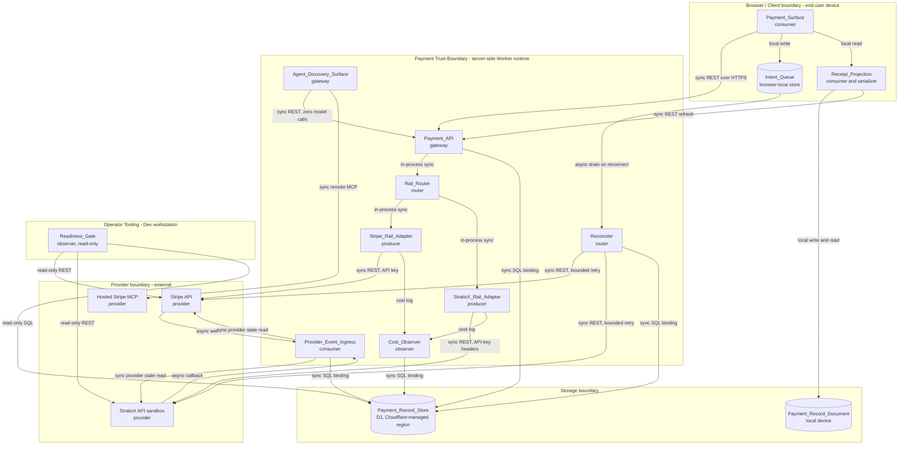
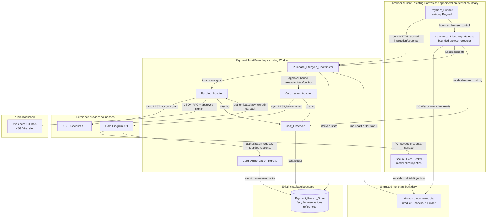
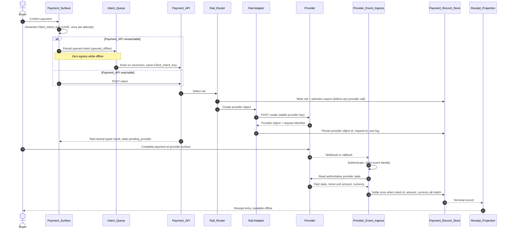
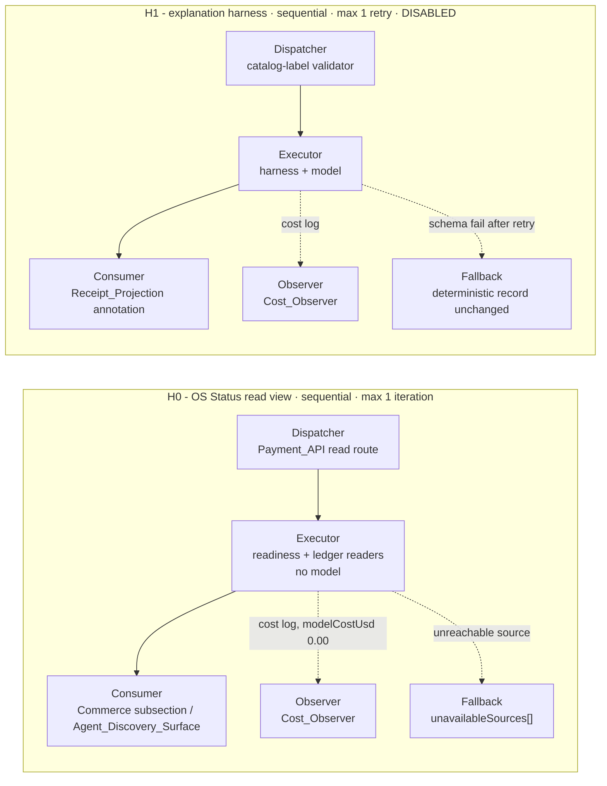
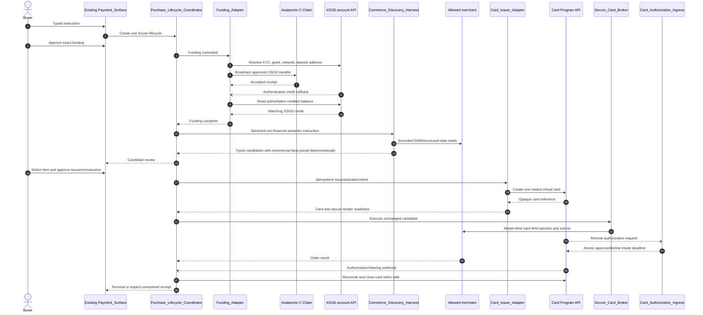
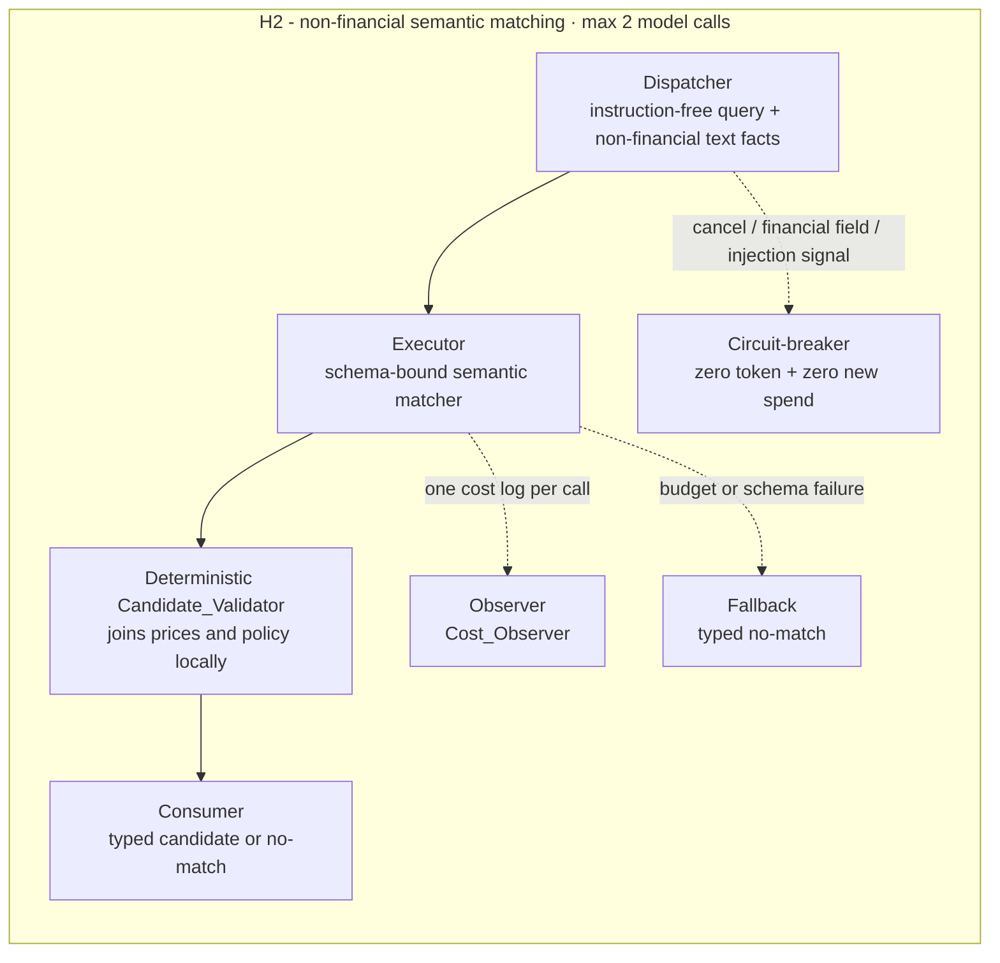
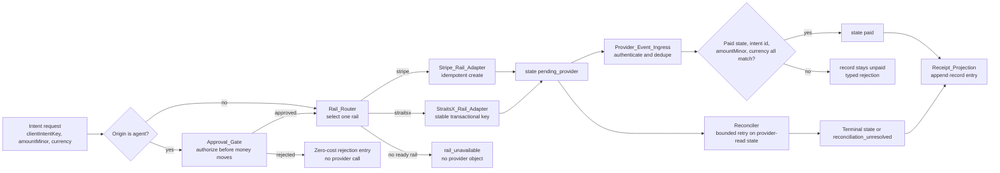
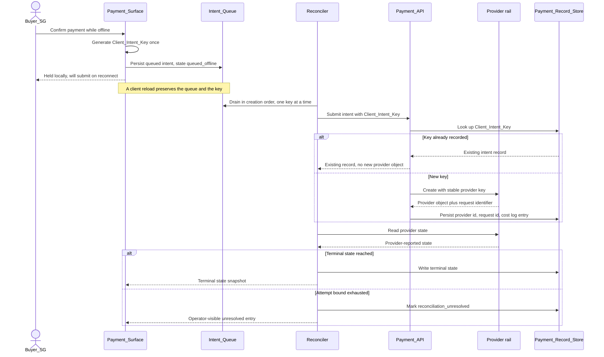
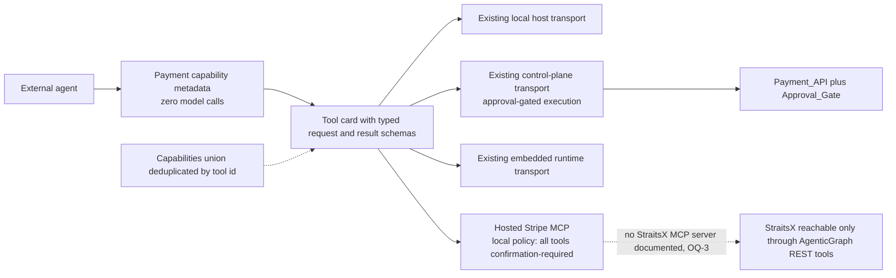

# Reference implementation: AgenticGraph Payments PRD/TAD

## Status

| Scope | Local rung | Delivered rung | Derivation |
|---|---|---|---|
| This combined PRD/TAD | `dev-proven` | `undocumented` | Requirements version 0.4.0 and a source-digest-bound Dev candidate carry executable deterministic evidence for R1-R17. Provider, browser, protected integration, mirror, and delivery remain independently unproven. |
| Provider activation and paid two-rail operation | `spec-complete` | `undocumented` | Provider contracts are documented; credentials, commercial approval, sandbox settlement, callback delivery, and paid two-rail proof remain external gates. |
| Agent-platform payment surfaces | `dev-proven` | `undocumented` | The existing OS status owner exposes a read-only `agentic_purchase_readiness` view with zero model/provider calls. External Increment 2 `/`, `#`, `@`, and MCP identities remain blocked under OQ-24. |
| Singapore agentic purchase lifecycle | `dev-proven` | `undocumented` | Shared contracts, same-D1 lifecycle safety, trusted existing-Paywall projection, and fail-closed readiness are executable in the Dev candidate. No XSGD transfer, Card Program call, secure credential injection, merchant checkout, or live-browser proof was authorized or run. |
| Normative requirements alignment | `dev-proven` | `undocumented` | Requirements version 0.4.0 accepts R13-R17 and preserves every external capability as an independently evidenced gate. |

Development-authoring authority only. This revision makes no `runtime-ready` or
`production-verified` claim. Official provider documentation establishes reference contracts,
not account configuration, payment success, protected integration, browser proof, mirror
publication, or public deployment.

This document is the source-checked PRD/TAD projection of the `agenticgraph-payments`
requirements at `.kiro/specs/agenticgraph-payments/requirements.md` version 0.4.0.
The spec remains the normative requirements source of truth. This document supplies
architecture, VCC mapping, and Evidence References without creating a competing
requirements owner.

The implementation evidence is a Dev-only candidate carried by this exact source revision
in the protected release lane. A branch name is transport metadata, not runtime evidence.
The candidate does not prove protected integration, provider access, a browser run, mirror
parity, or public delivery.

## Authority and Scope

| Concern | Owner | This document's position |
|---|---|---|
| Payments requirements SSOT | `.kiro/specs/agenticgraph-payments/requirements.md` | Version 0.4.0 remains the normative owner and accepts the R1-R17 contracts projected here. |
| Operator surface for commerce and payments | `docs/documents/agenticgraph-mainpanel-commerce-prd-tad.md` | MainPanel Commerce remains the canonical operator surface. Payments stays a Commerce subsection and never becomes a top-level tab. |
| Seller-side ACP checkout, Web3 settlement, Solana Pay, OpenBOX, proof and trace runtime | `docs/documents/agenticgraph-agentic-commerce-prd-tad.md` | Remains the AgenticGraph-as-seller runtime owner and the authority for server-owned AgenticGraph offers and prices. This document adds a distinct buyer-side, third-party-merchant purchase lifecycle; it does not route a StraitsX-issued card through ACP, relax seller price authority, or duplicate the commerce proof runtime. |
| Stripe MCP readiness, connection mode, tool confirmation policy | `docs/documents/agenticgraph-mcp/agenticgraph-stripe-mcp-service.md` | Remains the MCP readiness owner. This document references that transport for federation only. |
| `/`, `#`, `@`, and payment MCP invocation metadata | `agentic-canvas-os/docs/DICTIONARY-COMMAND.md`, `DICTIONARY-SEMANTIC.md`, `DICTIONARY-BINDING.md`, and `MCP-GATEWAY.md` | These files remain the invocation SSOT. This document consumes their exact payment routes and wire identities; it creates no parallel registry or alias. |
| Execution roles, task decomposition, tool blast radius, and run-state authority | `huijoohwee.github.io/guidelines/agentic-sdlc-guidelines.md` | Companion execution authority; this PRD/TAD does not redefine its contracts. |
| Settings row rendering and generated schema | existing settings architecture owner | Reused. No second payment settings registry. |

New surface area introduced by this document: an explicit rail-selection contract, the StraitsX rail adapter, a client-owned offline intent queue with reconnect reconciliation, a serialized payment record with a round-trip guarantee, and a stated agent-platform readiness posture for payment tools. Version 1.2 additionally specifies a bounded buyer-agent lifecycle that funds one KYC-verified provider account with XSGD, discovers one purchase candidate, issues one disposable virtual card, and executes one approved checkout through the existing Paywall owner.

Excluded by construction: a second payment Worker, a second payment store, a second commerce worker, a second Paywall or parallel panel framework, a unified MCP proxy tier, a copied invocation registry, AgenticGraph custody of funds or private keys, autonomous approval, live-mode payments, and any production mirror or Cloudflare deployment action.

### Normative requirements reconciliation

The requirements and PRD/TAD were updated atomically. This table records the version
0.4.0 disposition rather than an outstanding handoff.

| Requirements area | Source-current contract | Version 0.4.0 disposition |
|---|---|---|
| Frontmatter and companion state | Canonical guideline is `prd-tad-adr-guidelines.md`; this companion is populated and uses separate local/delivered rungs | Reconciled |
| R1 | Separate least-privilege credentials per adapter/agent/environment; independently pin request and webhook versions; bind exact signed-request contract | Reconciled |
| R2 | `admissionRails` permits only fully configured sandbox attempts while proof-complete `rails` remains false until paid evidence; exactly one server-owned buyer product is defined by the three `PAYMENT_BUYER_PRODUCT_*` variables | Reconciled |
| R4 | XSGD has separate capability readiness; `STRAITSX_FUND_FLOW` must match the configured integration model before authentication or egress; transactional retries reuse a stable provider key | Reconciled |
| R3 and R10 | A transport or `5xx` outcome can be indeterminate and remains `provider_outcome_unknown` through same-key reconciliation | Reconciled |
| R5 | Both rails cryptographically verify exact raw callback bytes; the SGD rail also applies source filtering and a provider read | Reconciled |
| R9 | Hosted tool inventory/auth is current; every hosted tool is confirmation-required, mutations additionally pass Approval_Gate, and only the excluded Treasury capability is Public Preview | Reconciled |
| R7, R8, and R10 | `refunded` is a distinct tenth public/surface/MCP/receipt terminal state and never projects as `paid`; SGD-rail refund stays zero-call until an exact official contract is bound | Reconciled |
| R11 and economics | Sandbox admission, proof-complete rail status, source-digest-bound local VCCs, provider sandbox, browser, protected integration, mirror, and delivery remain separate; provider-inclusive TCO is unknown | Reconciled |
| R13 | The single existing Paywall owns one four-phase lifecycle and rejects non-trusted or malformed invocation before state, storage, or egress | Reconciled |
| R14 | XSGD/Avalanche tuple, one funding reservation, provider-credit authority, external signer, and no-return-transfer cancellation are separate fail-closed capabilities | Reconciled |
| R15 | Discovery owns an immutable envelope, injection/cancellation stops, five-page/twelve-action/two-model-call bounds, and one cost row per model call; a real browser owner and merchant remain external | Reconciled |
| R16 | Approval TTL/restart/atomic consumption, first authorization identity, local reservation, secret canaries, and safe close are durable; provider card grants and secure credentials remain unavailable | Reconciled |
| R17 | Checkout revalidation, secure injection, merchant/issuer agreement, outcome uncertainty, receipt, and disposal are required; no external checkout is enabled by local conformance | Reconciled |

---

# PART I - PRD

## Feature: Two-Rail Payments Capability

### Problem Statement

A AgenticGraph buyer in Singapore is offered a card-only checkout, and a AgenticGraph client that is browser-first, local-first, offline-first, and mobile-first cannot structurally hold a payment secret. The result is three concrete losses. Buyers who transact with PayNow or SGD bank transfer abandon at the payment step. Buyers on an intermittent mobile connection tap twice and fear a double charge, because no client-generated identity ties the retry to the first attempt. Operators cannot tell whether a rail is configured well enough to accept money, because readiness lives in undocumented manual steps.

The opportunity is one payments capability with two provider-neutral rails behind one
deterministic selection contract: a global card rail and an SGD fiat rail, with XSGD exposed
only after its separate capability gate closes. The client keeps no credential, retries are
replay-safe, provider events are authenticated, and terminal payments project into one
locally readable record. The fixed-infrastructure target is 0.00 USD; total cost remains
unknown until provider commercial schedules and usage are known.

A second, buyer-side opportunity is now explicit. A Singapore user can delegate a bounded
e-commerce purchase to an agent only if four milestones close in order: a KYC-verified
provider account is funded with XSGD, the agent finds an item without accepting instructions
from the merchant page, one disposable virtual card is issued inside the approved spend
envelope, and checkout completes without exposing card credentials to a model, log, or local
store. Today those steps have no single control surface and no shared completion record.
Version 1.2 extends the existing Paywall as that control surface; it does not introduce a
second Paywall, panel, route owner, or client controller.

### Personas

| Persona | Job to be done | Primary pain | Success signal |
|---|---|---|---|
| Buyer_SG | Unlock a paid AgenticGraph capability paying in SGD from a phone on an unreliable connection | Card-only checkout excludes PayNow; a lost tap looks like a possible double charge | Payment reaches a terminal state within 90 seconds and a local receipt is readable offline |
| Buyer_Global | Pay by card in a non-SGD currency and retry safely | A retried card payment may create a second charge | Exactly one provider object exists per purchase attempt |
| Buying_Agent | Find and purchase one instructed e-commerce item with an XSGD-backed disposable card | No structured purchase envelope, card-credential boundary, or end-to-end lifecycle proof | One approved item, one bounded card, one checkout, no credential reaches a model or store, and every financial transition is auditable |
| Solo_Operator | Enable a rail from zero state and prove it works before exposing it | Unknown prerequisites; silent configuration drift; secrets leaking into visible config | One command per rail names every missing input and exits non-zero when the rail is not ready |

Buyer_Global is the non-SGD variant of the Buyer_SG journey and shares journey JB. It is named separately because R3 is written from its perspective.

### Journey JB: Buyer_SG - complete a purchase with an unreliable connection

| Stage | Action | Touchpoint | Pain Point | Opportunity |
|---|---|---|---|---|
| Trigger | Buyer decides to unlock a paid capability | Payment_Surface | Unclear which currency and method apply | Rail selected from locale and currency without asking |
| Discover | Buyer sees the price in SGD and the available method | Payment_Surface | Card-only checkout excludes PayNow users | SGD rail offers an account-granted PayNow method; XSGD is shown only when independently ready |
| Engage | Buyer confirms while the connection is intermittent | Payment_Surface plus Intent_Queue | Tap is lost; buyer retaps and fears a double charge | Client_Intent_Key makes the retry replay-safe |
| Complete | Payment confirms and the capability unlocks | Payment_Surface | Silent pending state with no explanation | Explicit pending, paid, and failed states each with a next action |
| Return | Buyer reopens later and reads a receipt | Payment_Record_Document | Receipt exists only in a provider dashboard | Local receipt projection readable with zero network requests |

### Journey JA: Buying_Agent - purchase on behalf of a buyer

| Stage | Action | Touchpoint | Pain Point | Opportunity |
|---|---|---|---|---|
| Trigger | Agent receives a purchase intent | Agent host | No structured payment target | Discoverable payment capability |
| Discover | Agent reads discovery metadata at zero token cost | Agent_Discovery_Surface | HTML scraping | Machine-readable capability document with typed schemas |
| Engage | Agent requests a payment intent | Agent_Discovery_Surface plus Approval_Gate | Unbounded agent spend | Approval gate authorizes before money moves |
| Complete | Payment settles and the agent receives a typed result | Agent_Discovery_Surface | Result shape varies per rail | One rail-neutral result schema |
| Return | Agent reads the settlement proof | Payment_Record_Document | No audit trail | Record carrying the provider reference and a cost log entry |

### Journey JX: Buying_Agent - complete an XSGD-backed e-commerce purchase

| Stage | Action | Touchpoint | Pain Point | Opportunity |
|---|---|---|---|---|
| Trigger | Buyer gives one typed purchase instruction and opens the existing Paywall | FloatingPanel Chat plus Payment_Surface | Natural-language scope can hide budget, merchant, and deadline ambiguity | Paywall normalizes one immutable purchase envelope before any financial call |
| Discover | Buyer authorizes XSGD funding, then the agent searches only allowed merchant origins | Payment_Surface plus Commerce_Discovery_Harness | Wrong network or page prompt injection can redirect money or change the requested item | Funding fails closed on network, token, KYC, and balance mismatch; page content is untrusted data |
| Engage | Buyer reviews one item candidate and approves one disposable card | Payment_Surface plus Approval_Gate | A reusable or overfunded credential creates unbounded spend | Card amount, currency, merchant policy, e-commerce-only use, and expiry are bound to the approval |
| Complete | Agent fills the merchant checkout, completes required buyer authentication, and waits for both merchant and issuer results | Secure_Card_Broker plus external merchant checkout | Price drift, add-ons, 3DS, timeout, or an ambiguous authorization can create an unsafe partial purchase | Mismatch stops before authorization; indeterminate results reconcile before retry; later authorizations stop immediately and permanent close waits for the source-bound safe point |
| Return | Buyer reopens the same Paywall and reads the lifecycle receipt offline | Payment_Surface plus Payment_Record_Document | Funding, card, and order evidence live in separate systems | One minimized record links funding, candidate, card reference, authorization, order, cost, and disposal status |

#### Existing Paywall lifecycle crosswalk

**Current Dev candidate**: the canonical overlay remains mounted by `CanvasViewport` when
the provider-neutral `payments.paywallEnabled` setting (persisted as
`kg:payments:paywallEnabled`) is enabled and FloatingPanel Chat is open. A one-time migration
reads and removes the legacy Stripe-specific key. The same overlay now accepts one
identity-bound direct-import invocation, validates the immutable purchase envelope before
state or storage mutation, and renders Funding, Discovery, Issuance, and Execution as
mobile-safe blocked phases.

This is deterministic source/component evidence only. Merchant page content cannot invoke,
approve, or change the frozen purchase envelope; no event, query, `postMessage`, storage, or
global invocation channel was added. Closing before the first financial approval causes zero
provider or financial calls. Once a funding reservation, transfer, card, or authorization
exists, closing/cancelling stops new spend-bearing calls and later phases but does not
suppress mandatory reservation release, provider reads, outcome reconciliation,
authorization blocking, or source-bound safe closure. No real-browser pixels or provider
transaction are claimed.

| Lifecycle milestone | Target enhancement of the existing Paywall | Required buyer action | Completion signal |
|---|---|---|---|
| Funding | Show KYC eligibility, network, token, requested XSGD amount, gas readiness, and provider-credit status | Approve the exact funding transfer or cancel | On-chain receipt plus authoritative provider account credit; Issuance stays disabled until the card-settlement bridge is verified |
| Discovery | Show bounded search progress and one or more schema-valid item candidates | Select one candidate or refine/cancel the original instruction | Candidate matches allowed origin, item constraints, amount ceiling, and freshness window |
| Issuance | Show the final amount/currency, merchant policy, expiry, and disposal rule; never show PAN or CVV | Approve one issuance envelope | One active virtual-card reference with exact controls and secure-injection readiness |
| Execution | Show checkout progress, any buyer-authentication handoff, issuer authorization, merchant order result, and card disposal state | Complete provider-hosted authentication if required; otherwise observe/cancel | Merchant and issuer agree, receipt persists, later authorizations are blocked, and disposal is `closure_pending` or safely closed |

### Journey JO: Solo_Operator - enable a rail from zero state

| Stage | Action | Touchpoint | Pain Point | Opportunity |
|---|---|---|---|---|
| Trigger | Operator decides to accept payment on a new rail | MainPanel Commerce, Payments subsection | Unknown prerequisites | Readiness_Gate names every missing input |
| Discover | Operator reads which credentials the rail needs | Readiness_Gate output | Secrets leak into visible config | Gate fails when a secret name appears in visible variables |
| Engage | Operator configures sandbox credentials | Server-side secret store | Manual undocumented steps | One command per rail |
| Complete | Operator observes a confirmed sandbox payment | Payment_Surface plus Readiness_Gate | No end-to-end proof | Sandbox payment reaches a terminal state |
| Return | Operator re-runs the gate after a change | Readiness_Gate output | Silent drift | Gate reports per-rail status and mutates nothing |

### User Stories

| ID | Story | Journey stage | Requirement |
|---|---|---|---|
| PS-1 | As a Solo_Operator I want every payment credential held only server-side so that a local-first browser client can never leak a payment secret. | JO-Discover, JO-Engage | R1 |
| PS-2 | As a Buyer_SG I want the right rail chosen for my currency and region without being asked so that I can pay with a method I already use. | JB-Trigger, JB-Discover | R2 |
| PS-3 | As a Buyer_Global I want a card payment I can retry safely so that a lost response never charges me twice. | JB-Engage | R3 |
| PS-4 | As a Buyer_SG I want to pay in SGD with PayNow or bank transfer, or settle in XSGD, so that I am not forced onto a card rail. | JB-Discover, JB-Engage | R4 |
| PS-5 | As a Solo_Operator I want provider callbacks authenticated and applied exactly once so that a replayed or forged event cannot unlock a paid capability. | JB-Complete, JA-Complete | R5 |
| PS-6 | As a Buyer_SG I want a purchase started with no connection to resolve correctly when the connection returns so that I neither lose the purchase nor pay twice. | JB-Engage, JB-Complete | R6 |
| PS-7 | As a Solo_Operator I want terminal payments written to one inspectable local document so that I can audit and show a receipt without opening a provider dashboard. | JB-Return, JA-Return | R7 |
| PS-8 | As a Buyer_SG on a phone I want the payment state and my next action always visible so that I am never left guessing whether I paid. | JB-Discover, JB-Complete | R8 |
| PS-9 | As a Buying_Agent I want zero-token discovery and an approval-gated payment tool so that automated purchase is possible without unbounded spend. | JA-Discover, JA-Engage | R9 |
| PS-10 | As a Solo_Operator I want every failure typed and every refund traceable so that I can resolve a buyer problem without guessing. | JB-Complete, JO-Return | R10 |
| PS-11 | As a Solo_Operator I want per-rail readiness and per-call cost visible before I accept a payment so that I never expose a half-configured rail and never pay for hidden model calls. | JO-Trigger, JO-Complete, JO-Return | R11 |
| PS-12 | As a Solo_Operator I want the capability to hold as little regulated data as possible and stay inside Dev authority so that compliance exposure and release risk stay bounded. | JO-Discover, JO-Return | R12 |
| PS-13 | As a Buyer_SG I want one existing Paywall to show the complete agentic purchase lifecycle so that I can understand and stop the agent at every financial boundary. | JX-Trigger, JX-Return | R13 |
| PS-14 | As a Buyer_SG I want the exact approved XSGD amount moved on the intended network into my KYC-verified provider account so that the issued card is backed without AgenticGraph taking custody. | JX-Discover | R14 |
| PS-15 | As a Buyer_SG I want the agent to find only an item matching my immutable instruction so that merchant content cannot expand the domain, product, quantity, or budget. | JX-Discover | R15 |
| PS-16 | As a Buyer_SG I want one disposable virtual card issued only after I approve the chosen item so that a compromised checkout cannot spend beyond that purchase. | JX-Engage | R16 |
| PS-17 | As a Buyer_SG I want checkout to stop on price drift, authentication failure, or uncertain issuer state, block repeat authorization immediately, and complete safe closure when settlement permits so that one instruction cannot become repeated spend. | JX-Complete, JX-Return | R17 |

### Acceptance Criteria

R1-R12 summarize the requirements source in Given-When-Then form and translate its existing
Verifiable Completion Conditions without weakening them. R13-R17 are accepted follow-on VCCs
in requirements version 0.4.0; their provider, browser, protected-integration, mirror, and
delivery evidence remains independently blocked.

#### R1 - Server-side trust boundary and secret custody

**Given** a browser-first Payment_Client and a server-side Payment_Trust_Boundary, **When** any payment or provider-tool operation runs, **Then** only the trust boundary sends a provider credential, each service and environment uses a separate least-privilege credential, every provider request and callback meets its authenticated and versioned contract, raw URL-encoded StraitsX query pairs are sorted lexicographically without decode/re-encode before signing, a signing failure stops before fetch and records zero provider calls, and a planted secret in client output or visible configuration fails readiness with configuration unchanged.

> **VCC translation**: `Verify a focused check reports zero secret-name or secret-value occurrences in client output and visible configuration and fails when a secret is planted; verify adapter, agent, sandbox, and live credential owners are distinct and least-privilege; verify every enabled provider contract reports authenticated request, authenticated callback, and explicit version configuration; verify repeated raw query pairs retain their encodings and sort byte-lexicographically in the canonical request; verify a signing failure stops before fetch with providerCallCount=0; verify the check performs zero writes`

#### R2 - Rail selection

**Given** a requested currency, requested settlement asset, and per-capability sandbox
admission,
**When** the Rail_Router runs, **Then** exactly one rail is selected before any provider call:
SGD fiat may select the admitted SGD rail, XSGD selects it only when the separate XSGD
capability is admitted, and a supported card-settled currency may select the admitted card
rail. A single
eligible rail records reason `only_ready_rail`; no eligible rail returns `rail_unavailable`
with zero provider objects; identical inputs return identical rail and reason. Complete
sandbox configuration can set `admissionRails` true without promoting proof-complete `rails`.
The request must exactly match the one server-owned buyer product; missing authority or a
caller price, currency, or settlement-asset mismatch returns `capability_unavailable` before
D1 or provider contact.

> **VCC translation**: `Verify a selection table covers admitted and unadmitted SGD fiat, separately admitted and unadmitted XSGD, supported card currency, single-eligible-rail, and no-eligible-rail; verify rail and reason persist before any provider call; verify identical inputs return identical output across 100 generated cases with zero provider calls; verify admissionRails can be true while proof-complete rails remains false; verify the exact server-owned buyer product is projected and caller mismatches fail before D1 or provider contact`

#### R3 - Card-rail intent creation and idempotency

**Given** the Rail_Router selected the card rail and the reference implementation identifies
its hosted checkout session as the authoritative object, **When** that rail creates or retries
a payment, **Then** one Client_Intent_Key owns at most one provider object, changed parameters
return `intent_parameter_conflict`, provider and correlation identifiers are recorded, an
indeterminate response remains `provider_outcome_unknown` until reconciled without a new
operation key, provider create is never re-POSTed once local intent age reaches the 23-hour
safety window, and paid capability unlocks only from the authoritative object's financially
successful state.

> **VCC translation**: `Verify the hosted checkout session is the one authoritative card object; verify replay and delayed replay leave one provider object and one local record; verify changed parameters return intent_parameter_conflict; verify transport and provider uncertainty preserve provider_outcome_unknown and reconcile without a new logical key; verify provider create is never retried at or after the 23-hour local safety window; verify a non-financially-successful state unlocks nothing and nested object states are not conflated`

#### R4 - StraitsX rail for SGD fiat and XSGD

**Given** exactly one configured SGD-rail integration model, one required
`STRAITSX_FUND_FLOW`, and its granted prerequisites, **When** the Rail_Router selects that
rail, **Then** the model-flow pair is validated before authentication, signing, or fetch; an
SGD collection uses only the granted method, preserves the returned payment instruction,
owns one stable logical operation identity across retries, reconciles uncertain results
before retry, and unlocks only from provider-confirmed completion. A missing or invalid flow,
model-flow mismatch, signing failure, unsupported environment, XSGD request, or unbound
refund reports an empty provider call list and zero provider calls. XSGD remains
`capability_unavailable` until its exact account-granted endpoint, network, and settlement
contracts are bound.

> **VCC translation**: `Verify one configured model, STRAITSX_FUND_FLOW, and granted-product owner; verify missing or invalid flow returns fund_flow_unresolved and a model-flow mismatch returns integration_model_unsupported before authentication or fetch with calls=[] and providerCallCount=0; verify signing/config failures, xsgd, and unbound refund likewise make zero provider calls; verify the buyer instruction matches provider output; verify uncertain retries preserve one logical operation and one completed record`

#### R5 - Provider event authentication and replay-safe settlement

**Given** an inbound provider event, **When** the Provider_Event_Ingress processes it, **Then** it cryptographically authenticates the exact received bytes before parsing, applies any provider-specific replay and source controls, deduplicates repeated and semantically duplicate events without assuming delivery order, durably claims the event, acknowledges successful receipt promptly, and applies settlement at most once. Any authenticity failure changes no state; paid capability unlocks only after an authoritative provider read matches success state, intent identifier, minor-unit amount, and currency.

> **VCC translation**: `Verify altered bytes, wrong secret, stale replay input, or disallowed source is rejected before parse with zero state change; verify repeated, semantic-duplicate, and reordered events produce one settlement side effect; verify successful receipt is acknowledged promptly, failed claims remain reprocessable, and any success-state, amount, currency, or intent mismatch leaves the record unpaid`

#### R6 - Offline intent queue and reconnect reconciliation

**Given** an unreachable Payment_Trust_Boundary, **When** a buyer requests a payment, **Then** the client persists only an unsent intent record with a UUID Client_Intent_Key generated once per purchase attempt and displays `queued_offline`; it creates no provider object, QR code, destination, or provider-derived status while offline. The queue survives reload, and on reconnect the trust boundary submits records in creation order one key at a time, preserves durable local uniqueness beyond any provider idempotency-retention window, returns an existing record for an already-owned key, and accepts a terminal state only from an authenticated provider read or event. Once local intent age reaches the 23-hour provider-create safety window, reconciliation does not re-POST provider create and requires provider-read or operator resolution. An unresolved record stops at a stated bound as `reconciliation_unresolved`, paid capability remains locked, the queue stores no credential or card or bank identifier, and a 101st enqueue fails closed without evicting any of the 100 existing records.

> **VCC translation**: `Verify an offline request persists queued_offline and survives reload while producing no provider call, QR code, destination, or provider status; verify submitting one Client_Intent_Key N times creates at most one provider object across 100 generated interleavings; verify a queued intent at or after the 23-hour provider-create safety window is not re-POSTed and requires provider-read or operator resolution; verify only an authenticated provider read or event can establish terminal state; verify an unresolvable record stops at the stated bound, unlocks nothing, and the queue contains no credential, card, or bank identifier; verify a 101st enqueue returns queue_capacity_reached and preserves all 100 existing records`

#### R7 - Payment record serialization and receipt round-trip

**Given** an intent record reaching a terminal state, **When** the Record_Serializer runs, **Then** one entry is appended carrying the intent identifier, Client_Intent_Key, selected rail, minor-unit amount, currency, settlement asset, terminal state, provider object identifier, and terminal timestamp, entries are emitted in a stable order with base-10 integer minor units, LF line endings, and a single trailing newline, parsing then re-serializing any valid document is byte-identical, serializing then parsing then serializing any valid record set is byte-identical, a malformed document yields a typed parse error naming the failing line with document bytes unchanged, no entry carries a card number, bank account number, credential, buyer email address, or provider customer identifier, `refunded` remains `refunded` rather than `paid`, and the offline receipt view renders from local storage with zero network requests.

> **VCC translation**: `Verify every terminal record produces exactly one entry with all nine named fields populated; verify parse then print is byte-identical for 100 generated valid documents; verify print then parse then print is byte-identical for 100 generated record sets; verify a malformed document yields a typed parse error naming the failing line with file bytes unchanged; verify no entry contains a card number, bank account number, credential, email address, or provider customer identifier across 100 generated records; verify refunded round-trips distinctly from paid; verify the receipt view renders from local state with zero network requests`

#### R8 - Buyer payment surface states

**Given** the server-owned buyer product or an active intent record, **When** the Payment_Surface renders, **Then** it displays exactly one of `idle`, `queued_offline`, `pending_provider`, `paid`, `refunded`, `no_payment_required`, `failed`, `expired`, `cancelled`, or `reconciliation_unresolved` together with the server-owned product amount before intent creation and the matching persisted amount, selected rail, and payment instruction afterward. The `queued_offline` state states that the payment is held locally and will be submitted on reconnect; `refunded` is labelled distinctly, exposes a refund-receipt action, and withholds paid capability. State changes come from the single client-owned snapshot with no surface-derived payment state, a failure shows a buyer-safe reason and one retry action reusing the existing Client_Intent_Key, the surface has no horizontal overflow at 375 by 812 CSS pixels, and every control is keyboard reachable with the current state exposed to assistive technology as text.

> **VCC translation**: `Verify each of the ten states renders a distinct labelled state and documented next action; verify idle price comes from the server-owned buyer product; verify refunded never projects as paid; verify no horizontal overflow at 375x812 and every control is keyboard reachable with a text state announcement; verify the surface reads the shared payment snapshot and holds no local payment state field`

#### R9 - Agent payment discovery and approval-gated tools

**Given** an external agent, **When** it discovers and invokes the payment capability, **Then**
machine-readable metadata, the one resolved server-owned buyer product, and typed schemas are
returned with zero model calls and zero model cost, without a multi-product or entitlement
catalog. AgenticGraph's local policy marks every hosted provider tool confirmation-required, and
state-changing or spend-bearing calls additionally pass the existing Approval_Gate before
provider contact. Interactive, autonomous, connected-account, sandbox, and live access remain
explicitly separated under least-privilege authentication. The provider tool inventory is
reconciled against its current official contract, one rail-neutral result shape is returned,
and no new proxy tier is added. Public HTTP `origin = "agent"` creation is denial-only:
an arbitrary caller-supplied `approvalRef` returns `approval_missing` before D1 access, and only
the approved MCP host can reach agent-create service execution. After verification, that host
derives a non-secret `payment-action:<tokenId-or-issuedAt>` correlation reference and strips
the raw approval token before invoking the Worker adapter.

> **VCC translation**: `Verify discovery validates, projects only the resolved server-owned buyer product, introduces no catalog, and reports zero model cost; verify local registration marks every hosted tool confirmation-required and an unapproved mutation makes zero provider calls; verify public HTTP origin=agent create rejects an arbitrary approvalRef before D1; verify the approved MCP host derives a non-secret payment-action approvalRef only after validation and strips the raw token before one adapter call; verify each access mode resolves only its least-privilege authentication and environment; verify current allowlisted tools match the official provider manifest while excluded capabilities stay unavailable; verify both rails return one result shape and no new proxy exists`

#### R10 - Typed failures and refunds

**Given** a provider failure or an Approval_Gate-authorized MCP-host refund request, **When** the trust boundary handles it, **Then** the operator record preserves the provider's typed error and correlation details while buyer output remains safe. The public HTTP refund path returns `approval_missing` before D1 access and cannot call the refund service. Transport or provider uncertainty stays `provider_outcome_unknown` through bounded same-operation reconciliation and is never mislabeled failed. A verified refund on a paid record is idempotent and traceable; successful refund or authoritative provider-read refund state remains `refunded` across the public status, MCP result, Payment_Surface, and receipt and never projects as `paid`; an unbound rail refund returns `provider_operation_unverified` with zero provider calls; and a refund on a non-paid record returns `refund_not_applicable` with zero provider contact.

> **VCC translation**: `Verify each provider error class maps to distinct operator output with internals excluded from buyer output; verify uncertain cases retain provider_outcome_unknown, preserve one operation identity, and never create a second object; verify public HTTP refund returns approval_missing before D1 access and only the approved MCP host can reach refund execution; verify a supported paid-record refund records one reference under replay and projects refunded distinctly across public, MCP, surface, and receipt contracts; verify unbound and non-paid refunds make zero provider calls with their respective typed results`

#### R11 - Cost observability, token economics, and readiness gates

**Given** a configured Authoring-lane runtime, **When** payments run and the Readiness_Gate is
invoked, **Then** every provider call has one cost entry, deterministic payment paths make
zero model calls, and optional explanation remains typed, bounded, costed, and fallback-safe.
The non-mutating gate reports credential-name presence without values, environment and version
configuration, the three server buyer-product inputs, the StraitsX integration model,
`STRAITSX_FUND_FLOW`, account grants, callback/signature readiness, and clock health.
`admissionRails` omits paid-settlement evidence only and can allow a fully configured first
sandbox attempt, while proof-complete `rails` remains false until an authenticated paid
sandbox record round-trips. A connectivity probe or admission entry cannot mark a rail ready.
Local `runtime-ready` requires satisfying Evidence References for every attached VCC,
including a recorded authenticated sandbox event plus authoritative provider read reaching
the rail-specific success state; no local result advances delivered readiness.

> **VCC translation**: `Verify every provider call has one cost entry and a deterministic run reports zero model calls and 0.00 model cost; verify the gate exposes no credential values, performs zero writes, and fails closed on every missing or mismatched readiness input; verify admissionRails can be true while rails remains false and cannot promote any readiness or delivery rung; verify connectivity evidence alone cannot promote the rail; verify runtime-ready requires a satisfying Evidence Reference for every VCC, including authenticated event, provider read, and rail-specific success; verify delivered rung remains independent`

#### R12 - Data minimization, compliance boundary, and release boundary

**Given** the payments capability in Dev authority, **When** any payment data is stored, transmitted, or released, **Then** no card number, card verification value, or full bank account number is stored in any AgenticGraph store, buyer identity verification is delegated to the selected provider, idempotency keys and provider metadata exclude email addresses and personal identifiers, no payment record field enters a model prompt, the public status response carries exactly the intent identifier, state, minor-unit amount, and currency, a live-mode credential under sandbox mode returns typed `mode_mismatch` with zero provider contact, no production mirror change and no Cloudflare deployment occurs without a separate explicit release instruction, and no second payment Worker, payment store, or payment settings registry is added.

> **VCC translation**: `Verify no store schema field can hold a card number, CVV, or full bank account number and a planted value is rejected; verify no idempotency key or provider metadata value contains an email address or personal identifier across 100 generated records; verify no payment record field appears in any model prompt in a recorded run; verify the public status response contains exactly the four permitted fields; verify a live-mode credential under sandbox mode returns mode_mismatch and contacts no provider; verify the change set touches no production mirror path and no Cloudflare deployment target and introduces no second payment worker, store, or settings registry`

Provider-side customer profiles, KYC, and bank-account linking are documented provider capabilities, not AgenticGraph capabilities ([StraitsX API guides](https://docs.straitsx.com/docs/introduction)). Metadata limits of up to 50 keys, key names at most 40 characters, values at most 500 characters, no square brackets in key names, and the prohibition on storing bank account numbers or card details in metadata or `description` are Stripe-documented ([Stripe API](https://docs.stripe.com/api)).

#### R13 - Existing Paywall invocation and lifecycle control

**Given** one trusted buyer instruction containing an allowed merchant set, item constraints,
quantity, maximum total, currency, and expiry, **When** the buyer starts an agentic purchase,
**Then** the single existing Paywall opens and projects Funding, Discovery, Issuance, and
Execution in order under one lifecycle identifier. Before the first financial approval,
closing, hiding, cancellation, malformed input, or a page-originated trigger makes zero
provider or financial calls. After financial state exists, cancellation blocks new
spend-bearing calls and later phases while mandatory reservation release, provider reads,
outcome reconciliation, authorization blocking, and safe closure continue. Lifecycle phases
compose with, rather than replace, the specified rail-neutral payment states. No second
Paywall, top-level tab, route owner, payment controller, Worker, or store is created.

> **VCC translation**: `Verify one trusted instruction mounts exactly one existing Paywall and one lifecycle identifier; verify the four phase labels and next actions render without horizontal overflow at 375×812; verify pre-approval hidden, closed, malformed, page-originated, cancelled, and unapproved triggers make zero provider or financial calls; cancel at Funding, Discovery, Issuance, and Execution and verify zero new spend-bearing calls while only required unreserve/read/reconcile/block/safe-close work continues; verify the implementation adds no second Paywall, panel, route owner, client payment controller, Worker, or store`

#### R14 - KYC-bound XSGD funding

**Given** a provider-confirmed KYC-verified account, an approved funding amount, and an
account-granted XSGD network, **When** Funding runs, **Then** the runtime validates the exact
network identity, token contract, destination deposit address, signer authority, gas
readiness, amount, and provider product grant before transfer. One funding key produces at
most one transfer. The phase completes only after both an accepted on-chain receipt and an
authoritative provider balance read credit the expected XSGD amount; a token contract address
is never treated as a deposit address. Wrong network, token, destination, KYC state, grant,
amount, or signer state fails before egress. On cancellation, expiry, discovery failure, or
issuance failure before authorization, Purchase_Lifecycle_Coordinator instructs
Funding_Adapter to atomically release the unused local balance reservation exactly once.
Already credited XSGD remains in the buyer's provider account; AgenticGraph never broadcasts an
automatic return transfer, stores a private key, or takes custody.

> **VCC translation**: `Verify the approved funding command produces one transaction hash and one provider-credit reference under replay; verify wrong chain, token, destination, KYC, grant, amount, gas, or signer fixtures produce typed failures with zero egress; verify an accepted chain receipt without matching provider credit does not advance Funding; cancel or fail after funding and verify the unused local reservation is released exactly once, credited XSGD remains in the buyer provider account, and no return transfer is broadcast; verify no private key, seed phrase, raw signed transaction, or regulated identity field enters client state, logs, records, or model input`

#### R15 - Bounded e-commerce discovery

**Given** a funded lifecycle and one immutable purchase envelope, **When** Discovery scans an
allowed e-commerce origin, **Then** merchant content is treated only as untrusted data and
cannot change the allowed origins, item constraints, quantity, budget, currency, deadline,
approval policy, or tool access. Deterministic DOM and structured-data extraction runs before
any model call. The loop visits at most five product pages, performs at most twelve browser
actions, makes at most two model calls, and returns typed candidates containing merchant
origin, canonical product URL, product/variant, quantity, item amount, shipping, tax, total,
currency, observation time, and evidence selectors. Unknown mandatory cost, price drift,
blocked access, prompt injection, cancellation, or no conforming item aborts the discovery run
before another browser/model action and exits without issuing a card.

> **VCC translation**: `Verify deterministic fixtures for matching, no-match, unknown total, price drift, blocked origin, prompt injection, and cancellation before and between every browser/model action; verify every candidate matches the typed schema and original envelope; verify counters never exceed five product pages, twelve browser actions, or two model calls and every model call has one persisted cost log; verify every failure or cancellation branch creates zero cards and zero payment authorizations`

#### R16 - Approval-bound disposable virtual-card issuance

**Given** one fresh candidate, sufficient provider-confirmed funding, a KYC-eligible user, a
granted instant-issuance product, and one unconsumed approval bound to the final amount and
merchant policy, **When** Issuance runs, **Then** the Approval_Gate atomically consumes one
durable approval after final validation and before provider card creation. The approval has a
thirty-minute-or-shorter TTL, survives a process restart, and cannot authorize a changed or
second lifecycle. One lifecycle key creates at most one virtual card, activates it, and
enforces every approved e-commerce, amount, currency, merchant, geography, and time
restriction through the union of provider-native controls and repository-owned RHA policy.
If that effective union is weaker than the approval, Issuance fails before a usable card.
The card becomes one-use when the first authenticated authorization request is successfully
claimed and atomically reserved by Card_Authorization_Ingress; concurrent later requests are
denied, while a duplicate of the same provider authorization identity returns the prior
decision without a second reservation. Buyer cancellation or card expiry also blocks new
authorizations. The card then enters `closure_pending` until the exact hold, capture,
reversal, refund, and force-post contract says permanent close is safe, and is closed exactly
once. Pool exhaustion, unavailable secure credential injection, or changed candidate data
fails closed.
PAN, CVV, and full expiry never enter a model, general application store, log, screenshot, or
receipt.

> **VCC translation**: `Verify replay creates one provider card and one local card reference; verify the enforced union of provider-native controls and RHA policy covers every approved amount, currency, e-commerce, merchant, geography, time, expiry, and disposal restriction and fails before a usable card when weaker; verify pool exhaustion, changed candidate, missing grant, ineffective controls, and unavailable secure injection create no usable card; verify planted PAN, CVV, and full-expiry canaries are rejected from model input, stores, logs, screenshots, and receipts; verify the first authenticated authorization identity successfully claimed and reserved blocks concurrent later identities, an exact duplicate returns the prior decision without another reservation, cancellation/expiry also block new authorizations, closure_pending persists while capture/reversal/refund risk exists, and close occurs exactly once when safe; verify approval TTL, restart survival, atomic single consumption, unchanged replay reconciliation, changed-envelope denial, and zero provider calls for expired/rejected approval`

The final durable-approval clause is `R16-VCC6`; authorization identity and disposal remain
`R16-VCC5`.

#### R17 - Agent checkout execution and terminal reconciliation

**Given** an active disposable card and the unchanged approved candidate, **When** Execution
fills and submits checkout, **Then** only the secure credential boundary can inject card
fields, the model cannot read them, and the agent revalidates merchant origin, product,
variant, quantity, total, currency, delivery terms, and prohibited add-ons immediately before
submission. Any mismatch stops before authorization. Buyer authentication is surfaced as an
explicit Paywall handoff. The lifecycle reaches success only when the merchant order and
authoritative issuer result agree; timeout or disagreement remains
`purchase_outcome_unknown` and reconciles without a second card or checkout. A terminal
success, failure, cancellation, or expiry blocks new authorizations, records
`closure_pending` while capture/reversal/refund risk remains, closes exactly once when safe,
and writes one minimized lifecycle receipt with the current disposal state.

> **VCC translation**: `Verify sandbox merchant runs for success, decline, price drift, add-on injection, merchant-origin change, buyer-authentication required, authorization timeout, duplicate callback, merchant-only success, issuer-only success, cancellation, expiry, hold, completion, reversal, refund, and force-post fixtures; verify mismatches submit no authorization, uncertain results do not reissue or resubmit, card-field values are absent from model and telemetry output, terminal outcomes block new authorizations immediately and remain closure_pending until safe, one card closes exactly once, and one minimized receipt links funding, candidate, card reference, authorization, order, cost, and disposal state`

### Time-to-Value

| Step | Persona | Named action | Cumulative steps |
|---|---|---|---|
| T0 | Solo_Operator | Zero state: repository checked out, no provider credential configured | 0 |
| T1 | Solo_Operator | Obtain sandbox credentials for the target rail | 1 |
| T2 | Solo_Operator | Write credentials into server-side secret storage with the per-rail configure command | 2 |
| T3 | Solo_Operator | Record rail mode, Stripe request and webhook API-version pins, and the StraitsX integration model and product grant in visible configuration | 3 |
| T4 | Solo_Operator | Run the StraitsX sandbox reachability probe and the per-rail readiness gate | 4 |
| T5 | Solo_Operator | Resolve every input the gate reports as missing | 5 |
| T6 | Solo_Operator | Start one sandbox payment from the Payment_Surface | 6 |
| T7 | Solo_Operator | Drive the sandbox settlement using the provider sandbox simulation for that rail | 7 |
| T-check | Solo_Operator | Observe the intent reach a terminal state and appear in the Payment_Record_Document | 8 |

The follow-on steady-state walkthrough starts only after provider onboarding, one
KYC-eligible test/program user, one granted instant-card product, one allowed merchant
fixture, and a provider-confirmed spendable test balance exist. A real-XSGD golden path also
requires OQ-18 to establish one environment-consistent card-settlement bridge plus separate
financial authority. Those operator prerequisites are external gates, not hidden buyer steps.

| Step | Persona | Named action | Cumulative steps |
|---|---|---|---|
| AX0 | Buyer_SG | Enter one purchase instruction with item, allowed merchant, quantity, maximum total, currency, and expiry | 1 |
| AX1 | Buyer_SG | Review and approve exact XSGD funding | 2 |
| AX2 | Buyer_SG | Review and select one discovered item candidate | 3 |
| AX3 | Buyer_SG | Approve the exact issuance and execution envelope | 4 |
| AX4 | Buyer_SG | Complete provider-hosted buyer authentication only if requested | 5 |
| AX-check | Buyer_SG | Observe matching merchant and issuer results, one receipt, no permitted later authorization, and disposal `closure_pending` or safely closed | 6 |

| Dimension | Estimate | Target ceiling | Validation method |
|---|---|---|---|
| TTV steps (Solo_Operator, zero state to first confirmed sandbox payment) | 8 steps | 10 steps or fewer | Walk-through on a clean checkout with sandbox credentials |
| TTV elapsed (Solo_Operator) | about 30 min | 45 min or less | Timed first-run on a clean checkout |
| TTV steps (Buyer_SG, price shown to paid) | 3 steps | 4 steps or fewer | Timed sandbox purchase on a 375 px viewport |
| TTV elapsed (Buyer_SG) | about 45 s | 90 s or less | Timed sandbox purchase |
| TTV steps (Buying_Agent, discovery to typed result) | 3 calls | 4 calls or fewer | Scripted agent run against sandbox |
| Steady-state completion steps (Buying_Agent, pre-provisioned agentic purchase) | 6 buyer actions including optional authentication | 6 actions or fewer | Timed run against one allowed sandbox merchant |
| Steady-state completion elapsed (Buying_Agent, pre-provisioned agentic purchase) | unknown | 5 min or less | Timed end-to-end run with provider onboarding, KYC, product/card-pool grant, allowed merchant, and spendable account balance already provisioned |
| Zero-state TTV (Buying_Agent ecosystem) | unknown | One measured duration required before demo scheduling; no numeric ceiling until OQ-25 closes | Time from initial provider application through KYC/program/product/funding setup to the first golden-path receipt and safe disposal |
| First-value action | A sandbox payment reaches a terminal state and the Payment_Surface reflects it | - | Observable state transition plus a Payment_Record_Document entry |
| First-value action (agentic purchase) | One approved item produces one matching merchant order and authoritative issuer result, blocks later authorization, and records disposal as `closure_pending` or safely closed | - | Lifecycle receipt plus provider and merchant reads |

The five-minute agentic measure is deliberately a **steady-state completion time**, not TTV
from zero. True zero-state TTV includes provider application/approval, KYC, issuer-group,
plan/product/card-pool, XSGD funding/credit, secure-broker, and merchant setup; it is unknown
until OQ-25 is measured. StraitsX access depends on an approved use case and assigned
integration model ([StraitsX API guides](https://docs.straitsx.com/docs/introduction)). No TTV
walk-through has been executed because it requires operator-provided credentials and provider
grants; measurement is a pre-sign-off gate, not a claim.

### Success Metrics

| Metric | Baseline | Target | Timeline |
|---|---|---|---|
| Rails reaching a confirmed sandbox payment | unverified in this document | 2 rails with separate satisfying Evidence References | Increment 1 |
| Duplicate provider objects created per replayed intent | not measured | 0 | Increment 1 |
| Queued offline intents resolved to a terminal state after reconnect | 0 percent (no queue exists) | 100 percent within 60 s of reconnect | Increment 1 |
| Provider events applied more than once | not measured | 0 | Increment 1 |
| Unauthenticated provider events accepted | not measured | 0 | Increment 1 |
| Payment secrets reachable from the client bundle | 0 asserted, not gated | 0 gated by a check | Increment 1 |
| Payment_Record_Document round-trip fidelity | not measured | byte-identical re-serialization for every valid document | Increment 1 |
| Time-to-value steps (Solo_Operator) | not measured | 10 steps or fewer | Increment 1 |
| Time-to-value elapsed (Solo_Operator) | not measured | 45 min or less | Increment 1 |
| Time-to-value steps (Buyer_SG) | not measured | 4 steps or fewer | Increment 1 |
| Time-to-value elapsed (Buyer_SG) | not measured | 90 s or less | Increment 1 |
| Full agentic lifecycle reaches matching merchant and issuer success | 0 recorded runs | 1 bounded, environment-consistent, provider-approved golden path plus all failure fixtures | Increment 2 |
| XSGD funding replay creates duplicate transfers | not measured | 0 across 100 generated retries and one provider-backed proof | Increment 2 |
| Discovery leaves the immutable purchase envelope | not measured | 0 across prompt-injection and merchant-mutation fixtures | Increment 2 |
| Disposable cards issued per lifecycle | not measured | exactly 1; 0 on rejected or expired approval | Increment 2 |
| Terminal lifecycle cards still permitting new authorization | not measured | 0 | Increment 2 |
| Safe closure overdue past the source-bound disposal deadline | not measured | 0; `closure_pending` is allowed only while recorded capture/reversal/refund risk remains | Increment 2 |
| PAN, CVV, or full expiry in model input, logs, screenshots, stores, or receipts | not measured | 0, enforced by a planted-secret check | Increment 2 |
| Remote authorization decisions within provider deadline | not measured | 100 percent under the documented deadline in focused load proof | Increment 2 |
| Discovery model budget per lifecycle | not measured | at most 2 calls, 12,000 prompt tokens plus 2,000 completion tokens total | Increment 2 |
| Token cost per month on the payment path | not measured | 0.00 USD with zero model calls in selection, creation, ingestion, reconciliation, serialization | Continuous |
| Token cost per month for commerce discovery at 10 demo runs | not measured | 2.00 USD ceiling; exact model price and cache rate recorded before enablement | Increment 2 |
| Monthly fixed infrastructure spend | 0.00 USD (existing Worker plus D1 free tier) | 0.00 USD | Continuous |
| Provider-inclusive monthly TCO at launch load | unknown; commercial and transaction schedules are not established here | Must be recorded before any live enablement | Commercial gate before release |
| ROI score (capability aggregate) | - | 8 or higher | Increment 1 |

Provider transaction, FX, and network fees do not change the fixed-infrastructure row, but
they do belong in provider-inclusive TCO. That total and commercial ROI remain unknown while
the StraitsX collection schedule is open under OQ-1 and Increment 2 card, PCI, blockchain,
dispute, and model economics are open under OQ-22; this document makes no zero-total-TCO claim
([StraitsX API guides](https://docs.straitsx.com/docs/introduction)).

### MoSCoW Priority

The prioritization proxy uses `(User Impact x Reach) / (Build Hours + Monthly fixed
infrastructure spend + Token Cost per Month)`, with Reach expressed as launch payments per
month and Impact on a 1-to-5 scale. Because provider variable fees are unresolved, the scores
are scope-ranking upper bounds, not final financial ROI; OQ-1 and OQ-22 block commercial
go-live claims, and the Increment 2 scores must be recomputed after both close.

| Tier | Feature | Requirement | Impact x Reach | Build hours | Monthly fixed infra | Token cost / month | Scope ROI upper bound |
|---|---|---|---|---|---|---|---|
| Must | Server-side trust boundary and secret custody gate | R1 | 5 x 40 = 200 | 4 | 0.00 | 0.00 | 50.0 |
| Must | Rail selection contract | R2 | 4 x 40 = 160 | 3 | 0.00 | 0.00 | 53.3 |
| Must | Stripe rail intent creation with idempotency | R3 | 4 x 30 = 120 | 5 | 0.00 | 0.00 | 24.0 |
| Must | StraitsX rail SGD fiat collection | R4 | 5 x 25 = 125 | 10 | 0.00 | 0.00 | 12.5 |
| Must | Provider event authentication and replay-safe settlement | R5 | 5 x 40 = 200 | 6 | 0.00 | 0.00 | 33.3 |
| Must | Offline intent queue and reconnect reconciliation | R6 | 4 x 20 = 80 | 8 | 0.00 | 0.00 | 10.0 |
| Must | Payment record serialization with round-trip guarantee | R7 | 3 x 40 = 120 | 4 | 0.00 | 0.00 | 30.0 |
| Must | Typed failure handling and refunds | R10 | 4 x 15 = 60 | 5 | 0.00 | 0.00 | 12.0 |
| Must | Per-rail readiness gates | R11 | 4 x 20 = 80 | 4 | 0.00 | 0.00 | 20.0 |
| Must | Data minimization and release boundary | R12 | 5 x 40 = 200 | 2 | 0.00 | 0.00 | 100.0 |
| Must (Increment 2) | Existing-Paywall lifecycle projection | R13 | 5 x 40 = 200 | 8 | 0.00 | 0.00 | 25.0 |
| Must (Increment 2) | KYC-bound XSGD funding on one granted network | R14 | 5 x 40 = 200 | 12 | 0.00 (network/provider fees variable) | 0.00 | 16.7 |
| Must (Increment 2) | Bounded e-commerce discovery harness | R15 | 5 x 40 = 200 | 12 | 0.00 | 8.00 ceiling at 40 runs | 10.0 |
| Must (Increment 2) | Approval-bound disposable virtual-card orchestration | R16 | 5 x 40 = 200 | 14 | 0.00 (provider fees unknown) | 0.00 | 14.3 |
| Must (Increment 2) | Secure checkout execution, authorization, reconciliation, and disposal | R17 | 5 x 40 = 200 | 18 | 0.00 | 0.00 | 11.1 |
| Should | Mobile-first buyer payment surface states | R8 | 3 x 40 = 120 | 5 | 0.00 | 0.00 | 24.0 |
| Should | Agent payment discovery plus approval-gated tool surface | R9 | 4 x 10 = 40 | 6 | 0.00 | 0.00 | 6.7 |
| Should | StraitsX rail XSGD stablecoin acceptance | R4 | 3 x 8 = 24 | 8 | 0.00 (network fees variable) | 0.00 | 3.0 |
| Could | XSGD to SGD conversion through the Swap API | - | 2 x 5 = 10 | 6 | 0.00 | 0.00 | 1.7 |
| Could | Payout and disbursement rails through the Payout API | - | 2 x 3 = 6 | 8 | 0.00 | 0.00 | 0.8 |
| Won't (this increment) | Subscriptions and recurring billing | - | - | - | - | - | - |
| Won't (this increment) | Marketplace or connected-account fund splitting | - | - | - | - | - | - |
| Won't (this increment) | Custody of buyer funds or a AgenticGraph-operated wallet | - | - | - | - | - | - |
| Won't (this increment) | Stripe Treasury agentic finance tools | - | - | - | - | - | - |
| Won't (this increment) | A second payment Worker, proxy tier, or payment store | - | - | - | - | - | - |

### Min-Viable Scope

Increment 1 remains the ten original Must rows: two collection rails, one selection contract,
one replay-safe settlement path, one offline queue, one serialized record, and one readiness
gate per rail in sandbox mode inside Dev.

The Increment 2 min-viable-max-value cut adds exactly five Must rows: enhance the single
existing Paywall, bind one KYC-verified provider user and one granted XSGD network, scan one
allowlisted sandbox merchant, issue one provider-granted instant virtual-card product, and
execute one approval-bound order through one secure credential path. It excludes open-web
shopping, multiple issuers, multiple blockchain networks, generalized product comparison,
automatic approval, live cards, and any second UI/runtime/store. Increment 2 cannot start live
or provider-backed proof until Increment 1 spend-safety and the external card-program gates
close.

### Out of Scope

- Subscriptions, recurring billing, invoicing schedules, and dunning.
- Marketplace flows, connected-account fund splitting, and platform fee capture.
- AgenticGraph custody of buyer funds, a AgenticGraph-operated wallet, or an exchange.
- Stripe Treasury money-movement, bill-pay, and card tools, which are access-gated ([Stripe MCP](https://docs.stripe.com/mcp)).
- StraitsX Payout, Swap, and FX flows beyond the Could tier.
- Tax calculation, invoicing compliance, and accounting integration.
- A custom card-entry form or any component touching raw card data.
- A second payment Worker, a unified proxy gateway tier, a second payment store, and a second payment settings registry.
- A payment-only top-level MainPanel tab.
- A second Paywall, a buyer storefront, an open-web autonomous shopping agent, or merchant
  origins not explicitly allowed by the buyer instruction.
- AgenticGraph custody of XSGD, private keys, seed phrases, provider KYC documents, PAN, CVV, or
  full card expiry.
- Automatic approval, approval inferred from chat text, page-originated approval, or card
  issuance before a fresh item/total review.
- A claim that the reference card provider offers a native disposable/single-use card,
  merchant lock, caller-selected expiry, or automatic XSGD-to-card funding; those contracts
  remain account- and product-gated.
- Reusing the seller-side ACP checkout owner for a third-party merchant card purchase, or
  injecting a reference-provider card into an ACP shared-payment-token flow without an
  official interoperability contract.
- Production-only blockchain deposit-address creation or any real-value XSGD transfer without
  separate explicit financial authorization and recorded rollback/recovery guidance.
- Production mirror publication and Cloudflare deployment.
- Live-mode payments. This increment is sandbox only, and the API key in use determines live versus sandbox behavior on the Stripe side ([Stripe API](https://docs.stripe.com/api)).

### Dependencies

| Dependency | Class | Justification |
|---|---|---|
| Existing `agenticgraph-payment` Cloudflare Worker and its D1 binding | No-new-fixed-infra, existing free-tier binding | Already the payment trust boundary; reuse avoids a new tier. |
| Existing shared payment SSOT modules (`grph-shared/src/payments/stripePaymentSsot.ts`, `stripeMcpSsot.ts`, `agenticCommerceSsot.ts`) | Repository-owned | Route, secret-name, and MCP configuration authority already exists; duplicating it would split ownership. |
| Existing external-tool Approval_Gate owner | Repository-owned | Spend authorization must not be reimplemented per rail. |
| Existing MainPanel Commerce surface | Repository-owned | Payments remains a Commerce subsection. |
| Existing Paywall overlay and Canvas conditional mount | Repository-owned | The only current buyer control surface. The Increment 2 target introduces at most one controller beneath that owner, atomically migrates the single configuration owner to provider-neutral naming, and leaves no legacy alias, second overlay, or parallel controller. |
| Existing seller-side Agentic Commerce runtime | Repository-owned | Retains ACP seller checkout, server-owned offer/price authority, and commerce proof ownership. Increment 2 consumes no non-Stripe ACP processor path. |
| Browser-control discovery owner, unresolved under OQ-23 | Planned repository-owned extension plus browser platform | After the canonical owner is selected, deterministic DOM/structured-data extraction precedes at most two model calls; origin allowlist, page/action limits, and prompt-injection isolation are mandatory. |
| Stripe API and hosted Checkout | Proprietary, justified in ADR-1 | No FOSS alternative provides global card acquiring. Fees are per-transaction and variable; fixed infrastructure TCO stays 0.00 while total TCO remains usage-dependent ([Stripe API](https://docs.stripe.com/api)). |
| Hosted Stripe MCP server | Proprietary, justified in ADR-4 | First-party remote MCP surface for the Stripe account; OAuth is preferred where supported, autonomous access uses a dedicated restricted key, and AgenticGraph applies the provider-recommended human-confirmation control to every registered tool ([Stripe MCP](https://docs.stripe.com/mcp)). |
| StraitsX API, sandbox first | Proprietary, justified in ADR-2 | Regulated SGD collection has no FOSS substitute; access depends on an approved use case, Customer Profiles prerequisites, product grants, and assigned integration model. The XSGD account-deposit endpoint/network source is documented but production-only; capability remains unavailable until authenticated account-grant, returned-address, provider-credit, and settlement evidence is bound ([StraitsX API guides](https://docs.straitsx.com/docs/introduction), [create deposit address](https://docs.straitsx.com/reference/create-deposit-address), [supported blockchains](https://docs.straitsx.com/reference/get-a-list-of-supported-blockchains)). |
| StraitsX Card Issuing APIs, reference implementation | Proprietary, justified in ADR-8 | Requires a provider-created issuer group, issuing plan, card product, authentication method, card pool, KYC/cardholder contract, and sandbox integration. Current docs establish instant virtual-card capability, not a native disposable-card or arbitrary XSGD-funding contract ([Card Issuing API](https://docs.straitsx.com/v1-CARDS/docs/introduction), [Getting Started](https://docs.straitsx.com/v1-CARDS/docs/getting-started)). |
| Avalanche C-Chain, reference implementation | FOSS protocol plus configurable RPC | XSGD funding binds to mainnet chain ID `43114` and an authenticated provider-supported token/network tuple; a self-hosted AvalancheGo node is optional and not required for the min-viable browser/serverless path ([C-Chain integration](https://build.avax.network/docs/primary-network/exchange-integration), [AvalancheGo](https://github.com/ava-labs/avalanchego)). |
| Secure card-credential broker | Proprietary or provider-hosted, unresolved | Generic e-commerce checkout needs a PCI-scoped injection path that keeps PAN/CVV outside models, logs, screenshots, and general application state. No readiness claim is permitted until OQ-19 closes. |
| Browser-local storage for the Intent_Queue | Platform, FOSS | Zero egress while offline; no new service. |

### Open Questions

Open questions use one shared `OQ-N` identifier space with the requirements authority at
`.kiro/specs/agenticgraph-payments/requirements.md`. An id means the same question in both
documents, so a resolution recorded against `OQ-7` there closes `OQ-7` here. Ids are
never reused or renumbered once assigned; a withdrawn question keeps its id and is marked
resolved.

The `Owner` column names which document is responsible for closing the question.
`Requirements` questions block acceptance criteria and are mirrored in the requirements
authority. `Design` questions arise from architecture decisions in this document and
exist only here.

| ID | Owner | Question | Blocks | Resolution path |
|---|---|---|---|---|
| OQ-1 | Requirements | StraitsX commercial pricing (transaction, FX, and network fee schedules) is not published in the referenced documentation ([StraitsX API guides](https://docs.straitsx.com/docs/introduction)). | Revenue model and per-transaction cost of revenue | Operator to obtain a commercial schedule from the provider |
| OQ-2 | Requirements | Which StraitsX integration model will be approved for a solo operator collecting payments for its own product: First Party Transfer, Third Party Transfer, or Regular Transfer ([StraitsX API guides](https://docs.straitsx.com/docs/introduction)). | R4 endpoint selection and the StraitsX_Rail_Adapter fund-flow guard | Provider onboarding outcome |
| OQ-3 | Requirements | No StraitsX MCP server is described in the referenced documentation. | Agent-surface parity across rails | Confirm existence before promising parity; otherwise StraitsX stays REST-only behind the AgenticGraph tool surface |
| OQ-4 | Design | The hosted Stripe MCP tool inventory is mutable provider surface area; the current page does not give the whole server a Public Preview label ([Stripe MCP](https://docs.stripe.com/mcp)). | ADR-4 federation stability | Reconcile the allowlist against current official documentation on every provider-surface change; fail closed on unknown tools |
| OQ-5 | Design | Stripe Treasury money-movement, bill-pay, and card tools are access-gated ([Stripe MCP](https://docs.stripe.com/mcp)). | Any future money-movement automation | Out of scope this increment; revisit only with granted access and a new ADR |
| OQ-6 | Requirements | **Resolved 2026-07-29**: StraitsX documents `Xfers-Signature` as HMAC-SHA256 over the exact raw callback body using the active signing secret, in addition to source-address allowlisting ([callback security](https://docs.straitsx.com/docs/securing-your-callback)). | — | R5 now requires signature verification before parsing and retains the provider state read |
| OQ-7 | Requirements | **Resolved 2026-07-29**: transactional POSTs accept `referenceId` or `idempotency_id`; the same logical retry reuses the same value and an uncertain result is read before retry ([idempotent requests](https://docs.straitsx.com/docs/idempotent-requests), [transaction safety](https://docs.straitsx.com/docs/transaction-safety)). | — | R4 now owns one stable provider key derived from Client_Intent_Key |
| OQ-8 | Requirements | Which request header the Worker reads to evaluate the StraitsX source address, and whether a shared-secret path segment is warranted as defense in depth. | Provider_Event_Ingress implementation | Design task |
| OQ-9 | Requirements | **Partially resolved 2026-07-29**: the business-account API documents production-only deposit-address creation with `token` plus `blockchain`, including `avalanche`, and a supported-blockchain read; the exact account grant, returned address, XSGD contract match, callback credit semantics, and availability for this card program remain unproven ([create deposit address](https://docs.straitsx.com/reference/create-deposit-address), [supported blockchains](https://docs.straitsx.com/reference/get-a-list-of-supported-blockchains)). | R4 and R14 XSGD scope | Keep capability false until authenticated account responses and one provider-credit proof bind the exact tuple |
| OQ-10 | Requirements | Exact StraitsX payment method for the first increment: dynamic PayNow QR, persistent PayNow QR, or virtual bank account, all documented as Payment API capabilities ([StraitsX API guides](https://docs.straitsx.com/docs/introduction)). | R4 buyer flow | Depends on OQ-2 |
| OQ-11 | Requirements | Which Stripe request API version and webhook endpoint version the existing owners already pin. `2026-06-24.dahlia` is current as checked on 2026-07-29, but current is not evidence of the configured versions ([versioning](https://docs.stripe.com/api/versioning)). | R1 version-pinning contract | Read both existing owners before any implementation change |
| OQ-12 | Requirements | Which existing browser-local persistence owner holds the Intent_Queue and what its size bound is. | R6 implementation | Design task |
| OQ-13 | Design | R11 criterion 3 permits an optional payment-adjacent model explanation while R12 criterion 4 forbids any payment record field in a model prompt, leaving that harness with no record-derived input. | Enabling any payment-adjacent model call | Keep the harness disabled and specified as a contract only until the spec resolves the tension |
| OQ-14 | Design | **Resolved 2026-07-29**: the signed request canonical form is `METHOD\nPATH\nQUERY\nTIMESTAMP\nNONCE\nBODY`, with raw URL-encoded query pairs sorted lexicographically and the exact transmitted body ([HTTP request signing](https://docs.straitsx.com/docs/http-request-signing)). | — | R1 and the provider contract now require the documented Ed25519 builder |
| OQ-15 | Design | **Resolved 2026-07-29**: current hosts are `https://api-sandbox.straitsx.com` and `https://api.straitsx.com`; production additionally requires business verification and explicit API approval ([sandbox and production environments](https://docs.straitsx.com/docs/sandbox-production-environments)). | Live operation remains out of scope by operator directive, not by host ambiguity | Keep production disabled until a separate release instruction and provider approval |
| OQ-16 | Requirements | The inspected official sources do not establish an exact StraitsX refund endpoint, eligibility rule, or idempotency contract. | StraitsX branch of R10 | Return `provider_operation_unverified` with zero provider calls until an exact official endpoint reference and account grant are recorded |
| OQ-17 | Requirements | Which card-program issuer group, issuing plan, instant virtual-card product, funding source, account currency, card pool, KYC/cardholder model, 3DS method, and sandbox hosts will the provider grant? | R16 implementation and any card readiness claim | Provider onboarding packet plus authenticated sandbox configuration read |
| OQ-18 | Requirements | Which exact provider contract moves XSGD credited from an Avalanche deposit into the card settlement account, and which balance is authoritative for issuance and Remote Host Authorization? General XSGD settlement marketing does not establish this bridge. | R14-R17 end-to-end value path | Provider-signed integration design, account/application whitelisting, settlement address, network/product grant, and authenticated balance/settlement evidence |
| OQ-19 | Requirements | Which PCI-compliant mechanism injects PAN, CVV, and expiry into a third-party merchant checkout without exposing them to the model, screenshots, logs, or general application state? The card API permits encrypted credential return only for eligible PCI merchants. | R16 secure-injection readiness and all R17 execution | Approved provider-hosted or PCI-scoped credential broker plus planted-secret proof |
| OQ-20 | Requirements | Which sandbox merchant origin, product, robots/terms permission, checkout fields, shipping/tax behavior, 3DS path, CAPTCHA behavior, and order-read contract are approved for the golden path? | R15 discovery and R17 browser proof | One allowlisted deterministic merchant fixture or explicit merchant sandbox |
| OQ-21 | Requirements | What exact one-use policy handles holds, completions, reversals, partial captures, refunds, duplicate authorizations, concurrent authorization, merchant retries after card closure, and force-post transactions? The reference provider documents spend limits and permanent close, not native disposable cards. | R16 disposal and R17 settlement safety | Atomic authorization ledger, exact provider event contract, provider review, and focused race/reversal fixtures |
| OQ-22 | Requirements | What are card setup, issuance, authorization, settlement, blockchain, FX, reserve, dispute, PCI, and model costs at launch load? | Provider-inclusive TCO and ROI | Commercial schedule plus a 12-month managed/serverless, self-managed, and hybrid comparison |
| OQ-23 | Design | Which canonical browser-control owner will host JX discovery, and how are its tool allowlist, prompt-injection shield, five-page/twelve-action/two-model-call bounds, cost logs, and cancellation signal surfaced? | H2 and R15 | Bind the canonical owner or add one repository-owned bounded extension beneath it without duplicating browser control |
| OQ-24 | Design | Which canonical command, semantic tag, binding, and MCP tool identities will invoke the buyer-side lifecycle? This document cannot add them to the Agentic Canvas OS dictionaries it only projects. | External agent invocation beyond the existing Chat/Paywall UI | Update the invocation dictionaries and gateway catalog in their owner, then project the accepted exact identities here |
| OQ-25 | Requirements | What is the measured provider onboarding lead time from zero state to issuer group, card product, KYC user, XSGD funding, card activation, and sandbox transaction? | Operator TTV and demo schedule | Timed provider onboarding record; keep steady-state buyer TTV separate |

---

# PART II - TAD

## Architecture: AgenticGraph Payments

### Overview

**From buyer intent to a locally readable receipt**: Payment_Surface captures an intent with a client-generated key, Intent_Queue holds it when the trust boundary is unreachable, Rail_Router selects exactly one rail, the selected rail adapter creates the provider object inside the Payment_Trust_Boundary, Provider_Event_Ingress authenticates and applies provider events at most once, Reconciler resolves every intent to a terminal state from provider-read state, Payment_Record_Store persists the record, and Receipt_Projection emits a byte-stable document the buyer and operator can read offline.

**From a bounded buyer instruction to one third-party merchant order**: the existing
Payment_Surface invokes one Purchase_Lifecycle_Coordinator. Funding_Adapter proves a
KYC-bound XSGD credit, Commerce_Discovery_Harness returns schema-valid candidates under fixed
bounds, Card_Issuer_Adapter creates one approval-bound virtual card, Secure_Card_Broker fills
credential fields without model visibility, Card_Authorization_Ingress atomically decides
network authorizations, and the coordinator reconciles merchant plus issuer state before
closing the card and projecting the lifecycle receipt.

The deterministic payment, funding, issuance, authorization, settlement, and record paths
perform zero model calls. Only bounded commerce discovery may call a model. All provider
credentials and financial decisions live server-side. The client holds instruction identity,
approval references, minimized state projections, and offline receipts only.

### Journey to System Mapping

| Journey Stage | Workflow | Data Flow | Orchestration/Harness Flow | Topology Node(s) | Component |
|---|---|---|---|---|---|
| JB-Trigger, JB-Discover | W1 Rail selection and intent creation | DF1 Intent ingest | None. Deterministic rules, zero model calls | Payment_Surface, Payment_API, Rail_Router | Payment_Surface, Rail_Router |
| JB-Engage online | W1 Rail selection and intent creation | DF1 Intent ingest, DF2 Provider create | None | Rail_Router, Stripe_Rail_Adapter, StraitsX_Rail_Adapter, provider APIs | Stripe_Rail_Adapter, StraitsX_Rail_Adapter |
| JB-Engage offline | W3 Offline queue and reconnect reconciliation | DF4 Queue persistence | None | Intent_Queue, Reconciler | Intent_Queue |
| JB-Complete, JA-Complete | W2 Provider event ingestion and settlement | DF3 Event ingest and settlement | None | Provider_Event_Ingress, Payment_Record_Store | Provider_Event_Ingress, Payment_Record_Store |
| JB-Return, JA-Return | W4 Receipt projection | DF5 Record serialization | H1 explanation harness, disabled this increment | Receipt_Projection, Payment_Record_Store | Receipt_Projection |
| JA-Discover | W5 Agent discovery | DF6 Capability metadata read | H0 zero-token read view, max 1 iteration | Agent_Discovery_Surface | Agent_Discovery_Surface |
| JA-Engage | W1 with an approval precondition | DF1 Intent ingest | None. The approval check is policy, not a model call | Approval_Gate, Payment_API | Agent_Discovery_Surface |
| JO-Trigger to JO-Return | W6 Rail readiness | DF7 Readiness snapshot | H0 zero-token read view, max 1 iteration | Readiness_Gate, Commerce Payments subsection | Readiness_Gate |
| JB-Complete failure branch, JO-Return | W7 Typed failure and refund | DF3, DF5 | None | Payment_API, rail adapters, Payment_Record_Store | Stripe_Rail_Adapter, StraitsX_Rail_Adapter |
| JX-Trigger | W8 Existing-Paywall lifecycle coordination | DF8 Lifecycle state | None. Typed validation and approval policy | Payment_Surface, Purchase_Lifecycle_Coordinator | Payment_Surface, Purchase_Lifecycle_Coordinator |
| JX-Discover, funding | W9 KYC-bound XSGD funding | DF9 XSGD funding | None. Deterministic chain/account checks | Funding_Adapter, Provider_Event_Ingress, Avalanche C-Chain | Funding_Adapter |
| JX-Discover, item search | W10 Bounded commerce discovery | DF10 Candidate extraction | H2 bounded discovery, max 12 actions and 2 model calls | Commerce_Discovery_Harness, external merchant | Commerce_Discovery_Harness |
| JX-Engage | W11 Disposable card issuance | DF11 Card issuance | None. Approval and provider policy | Approval_Gate, Card_Issuer_Adapter, Secure_Card_Broker | Card_Issuer_Adapter, Secure_Card_Broker |
| JX-Complete | W12 Secure checkout and reconciliation | DF12 Checkout execution | None on financial path; browser actions are policy-driven | Secure_Card_Broker, Card_Authorization_Ingress, external merchant | Card_Authorization_Ingress, Purchase_Lifecycle_Coordinator |
| JX-Return | W12 Secure checkout and reconciliation | DF8 Lifecycle state, DF5 Record serialization | H0 zero-token read view | Payment_Surface, Receipt_Projection, Payment_Record_Document | Purchase_Lifecycle_Coordinator, Receipt_Projection |

### Topology

**Version 2 retained baseline**: 2026-07-29, `spec-complete`, Authoring-lane snapshot only.

**Boundaries**: Browser/Client (end-user device), Payment Trust Boundary (server-side Worker runtime), Provider boundary (Stripe, hosted Stripe MCP, StraitsX sandbox), Storage boundary, Operator Tooling (Dev workstation, command-invoked).

| Node | Role | Type | Lane | Connects to | Connection type | Data residency |
|---|---|---|---|---|---|---|
| Payment_Surface | Consumer | Client view | Authoring | Payment_API, Intent_Queue, Receipt_Projection | Sync REST over HTTPS, local read | End-user device. No credential, card, or bank identifier |
| Intent_Queue | Store | Browser-local durable queue | Authoring | Payment_Surface, Reconciler | Local write, async drain on reconnect | End-user device only. Unsent intent identity, amount, currency, rail, state |
| Receipt_Projection | Consumer | Client view plus serializer | Authoring | Payment_Record_Document, Payment_API | Local read and write, sync REST on refresh | End-user device for the local projection |
| Payment_API | Gateway | Worker route | Authoring | Rail_Router, Payment_Record_Store, Approval_Gate | Sync REST over HTTPS | No persistence in the route layer |
| Rail_Router | Router | Worker function | Authoring | Stripe_Rail_Adapter, StraitsX_Rail_Adapter, Payment_Record_Store | In-process sync | No persistence. Decision written to Payment_Record_Store |
| Stripe_Rail_Adapter | Producer | Worker function | Authoring | Stripe API, Cost_Observer | Sync REST over HTTPS with restricted-key auth | No persistence. Credential read from server-side secret storage |
| StraitsX_Rail_Adapter | Producer | Worker function | Authoring | StraitsX API sandbox, Cost_Observer | Sync REST over HTTPS with API-key and optional signed-request headers | No persistence. Credential read from server-side secret storage |
| Provider_Event_Ingress | Consumer | Worker route | Authoring | Stripe API, StraitsX API, Payment_Record_Store | Async inbound webhook or callback, then sync provider state read | Event identity and processing status persisted in the payment store |
| Reconciler | Router | Worker function plus client driver | Authoring | Provider APIs, Payment_Record_Store, Intent_Queue | Sync REST with bounded same-key retry | No persistence of its own |
| Payment_Record_Store | Store | Existing payment database binding | Authoring | Payment_API, Provider_Event_Ingress, Reconciler, Cost_Observer | Sync database access through the trust boundary | Existing managed payment store. Intent records, event identities, cost ledger rows; no card, verification value, or full bank account number |
| Cost_Observer | Observer | Worker function | Authoring | Payment_Record_Store | In-process sync write | Cost ledger rows in the payment store |
| Agent_Discovery_Surface | Gateway | Worker route plus static metadata | Authoring | Payment_API, existing MCP transports, hosted Stripe MCP | Sync REST and sync remote MCP, zero model calls | No persistence. Metadata derived at read time |
| Readiness_Gate | Observer | Command-invoked script | Authoring | Provider APIs, Payment_Record_Store, secret-store metadata | Sync REST and database read, read-only | No persistence. Writes nothing |
| Stripe API | Provider | External REST service | Authoring reference dependency | Stripe_Rail_Adapter, Provider_Event_Ingress | Sync REST over HTTPS | Provider-managed at `https://api.stripe.com` ([Stripe API](https://docs.stripe.com/api)) |
| Hosted Stripe MCP | Provider | External MCP transport | Authoring reference dependency | Agent_Discovery_Surface | Sync remote MCP over HTTPS | Provider-managed at `https://mcp.stripe.com` ([Stripe MCP](https://docs.stripe.com/mcp)) |
| StraitsX API sandbox | Provider | External REST service | Authoring reference dependency | StraitsX_Rail_Adapter, Provider_Event_Ingress | Sync REST over HTTPS | Provider-managed at `https://api-sandbox.straitsx.com` ([environments](https://docs.straitsx.com/docs/sandbox-production-environments)) |
| Payment_Record_Document | Store | Serialized text projection | Authoring | Receipt_Projection | Local write and read | End-user device or operator workstation. No credential, card, bank account, email, or provider customer identifier |

**Component inventory for the topology diagram**

| Node in diagram | Component specification | Boundary | Local rung | Delivered rung | Evidence Reference |
|---|---|---|---|---|---|
| PS | Payment_Surface | Browser/Client | `dev-proven` | `undocumented` | Source/component tests cover the payment states and trusted four-phase projection; no live-browser result |
| IQ | Intent_Queue | Browser/Client | `dev-proven` | `undocumented` | Persistence, replay, reload, and capacity cases pass locally |
| RP | Receipt_Projection | Browser/Client | `dev-proven` | `undocumented` | Minimized serialization and round-trip cases pass locally |
| API | Payment_API route surface | Payment Trust Boundary | `dev-proven` | `undocumented` | Public denial, typed route, and read-only readiness cases pass locally |
| RR | Rail_Router | Payment Trust Boundary | `dev-proven` | `undocumented` | Deterministic selection and persisted reason pass locally |
| SRA | Stripe_Rail_Adapter | Payment Trust Boundary | `dev-proven` | `undocumented` | Local idempotency and uncertainty contracts pass; no paid sandbox proof |
| XRA | StraitsX_Rail_Adapter | Payment Trust Boundary | `dev-proven` | `undocumented` | Local signing, path, grant, fund-flow, and zero-egress guards pass; no account or sandbox proof |
| PEI | Provider_Event_Ingress | Payment Trust Boundary | `dev-proven` | `undocumented` | Raw-body authentication, duplicate, and provider-read contracts pass locally |
| REC | Reconciler | Payment Trust Boundary | `dev-proven` | `undocumented` | Bounded same-key reconciliation and terminal monotonicity pass locally |
| CO | Cost_Observer | Payment Trust Boundary | `dev-proven` | `undocumented` | Per-call zero-model cost rows and explicit gaps pass locally |
| ADS | Agent_Discovery_Surface | Payment Trust Boundary | `dev-proven` | `undocumented` | Typed zero-token discovery and approval rejection pass locally |
| RG | Readiness_Gate | Operator Tooling | `dev-proven` | `undocumented` | Source-bound local gate passes and external gates remain independently blocked |
| STRIPE, SMCP, XFERS | External providers | Provider | `undocumented` | `undocumented` | Dependency only; provider docs are contracts, not runtime evidence |
| D1 | Payment_Record_Store | Storage | `dev-proven` | `undocumented` | Additive migrations `0009` and `0010` are exercised by focused local SQLite tests; no remote migration |
| DOC | Payment_Record_Document | Storage | `dev-proven` | `undocumented` | Exact field guard and byte-stable round trip pass locally |

**Version notes**: version 2 adds the required functional lane and separates local from
delivered rungs. Its repository-owned nodes are executable in the Dev candidate on existing
owners; it adds no second Worker or store. Mirror and Delivery topology remain unchanged
because both promotion boundaries are closed.

#### Topology version 3: buyer-side agentic purchase extension

**Version**: 3 - 2026-07-29, `dev-proven` for the deterministic local safety owners and
`spec-complete` for provider/browser adapters, Authoring-lane delta over retained version 2.

**New boundaries**: Untrusted Merchant (third-party e-commerce origin), Card Program
(separately provisioned provider surface), and Public Blockchain (XSGD network). Existing
Browser, Payment Trust, Storage, and Operator boundaries remain.

| Node | Role | Type | Lane | Connects to | Connection type | Data residency |
|---|---|---|---|---|---|---|
| Purchase_Lifecycle_Coordinator | Router | Deterministic safety/persistence kernel in the existing payment Worker owner | Authoring | Payment_Surface, future Funding_Adapter, Commerce_Discovery_Harness, Card_Issuer_Adapter, Card_Authorization_Ingress, Payment_Record_Store | Sync in-process; future HTTPS status reads remain gated | Lifecycle ids, minimized stage state, approval/card/funding/order references in the existing managed payment store |
| Funding_Adapter | Producer | Planned function in the existing payment Worker owner | Authoring | XSGD account API, Avalanche C-Chain, Provider_Event_Ingress, Cost_Observer | Sync REST/JSON-RPC plus async authenticated callback | No key custody; provider account data remains provider-side; minimized transaction and credit references in existing store |
| Commerce_Discovery_Harness | Executor | Planned extension under the canonical browser-control owner selected by OQ-23 | Authoring | Payment_Surface, allowed merchant origins, Cost_Observer | Browser navigation and DOM reads; at most two model calls | Ephemeral page data on end-user device; only typed candidate fields persist |
| Card_Issuer_Adapter | Producer | Planned function in the existing payment Worker owner | Authoring | Card Program API, Approval_Gate, Cost_Observer | Sync REST over HTTPS with server-side bearer token | No PAN/CVV persistence; opaque user/card/program references in existing store |
| Secure_Card_Broker | Gateway | Planned PCI-scoped ephemeral credential adapter | Authoring | Card Program secure credential surface, allowed merchant checkout | Provider-hosted/PCI-scoped credential retrieval and browser field injection | Card fields exist only inside the approved ephemeral credential boundary; never in model, screenshot, log, general store, or receipt |
| Card_Authorization_Ingress | Consumer | Planned route in the existing payment Worker owner | Authoring | Card Program authorization calls, Payment_Record_Store, Purchase_Lifecycle_Coordinator | Async inbound authorization request with synchronous bounded response; async webhook reconciliation | Atomic reservation and issuer event identity in existing managed payment store |
| XSGD account API | Provider | External REST service | Authoring reference dependency | Funding_Adapter, Provider_Event_Ingress | Sync REST plus async authenticated callback | Provider-managed KYC, account, address, balance, and credit state |
| Card Program API | Provider | External REST service | Authoring reference dependency | Card_Issuer_Adapter, Secure_Card_Broker, Card_Authorization_Ingress | Sync REST plus async authorization/webhook | Provider-managed user, card, credential, authorization, clearing, and settlement state |
| Avalanche C-Chain | Network | Public EVM blockchain | Authoring reference dependency | Funding_Adapter | JSON-RPC plus signed transaction broadcast | Public transaction/address/token/amount data; no KYC data written on-chain |
| External merchant | Consumer/Producer | Third-party e-commerce site | Authoring reference dependency | Commerce_Discovery_Harness, Secure_Card_Broker, Purchase_Lifecycle_Coordinator | Browser HTTPS plus merchant order read | Merchant-managed product, checkout, delivery, and order data |

**Version 3 inventory delta**

| Node | Component specification | Local rung | Delivered rung | Evidence Reference |
|---|---|---|---|---|
| Purchase_Lifecycle_Coordinator | Added below | `dev-proven` | `undocumented` | Same-D1 lifecycle, approval, authorization identity, receipt, cancellation, and safe-close kernel passes local race/restart tests |
| Funding_Adapter | Added below | `dev-proven` for tuple/reservation safety; provider adapter `spec-complete` | `undocumented` | Local reservation/release and no-return-transfer contracts pass; no authenticated account, signer, transfer, or provider credit |
| Commerce_Discovery_Harness | Added below | `dev-proven` for shared validation; browser adapter `spec-complete` | `undocumented` | Injection/cancellation/bounds/cost contracts pass; no browser owner, merchant fixture, or pixels |
| Card_Issuer_Adapter | Added below | `dev-proven` for approval/opaque-card persistence; provider adapter `spec-complete` | `undocumented` | Durable approval and secret-canary contracts pass; no card-program grant or sandbox card |
| Secure_Card_Broker | Added below | `spec-complete` | `undocumented` | R16-R17 VCCs stated; OQ-19 remains open |
| Card_Authorization_Ingress | Added below | `dev-proven` for identity/reservation persistence; provider ingress `spec-complete` | `undocumented` | Local first-identity/exact-replay/competing-denial passes; no authenticated authorization/webhook/load result |
| XSGD account API, Card Program API, Avalanche C-Chain, External merchant | External dependencies | `undocumented` | `undocumented` | Contract/source references only; not runtime evidence |

Version 3 adds deterministic contracts, same-D1 state, the trusted existing-Paywall
projection, and read-only readiness on existing owners. It adds no second runtime, store,
top-level surface, provider/browser adapter, or delivery path. Mirror and Delivery versions
remain unchanged and both Deploy Boundaries remain closed.

### Workflow Specifications

#### Workflow W1: Rail selection and intent creation

**Trigger**: Buyer confirms a payment on the Payment_Surface, or an approved agent tool call requests a payment intent.

**Actors**: Buyer_SG or Buying_Agent, Payment_Surface, Payment_API, Approval_Gate, Rail_Router, Stripe_Rail_Adapter, StraitsX_Rail_Adapter, Payment_Record_Store, Cost_Observer.

**Happy path**:
1. Payment_Surface generates a Client_Intent_Key UUID once for the attempt and posts the intent to Payment_API over HTTPS.
2. For an agent-originated call, Payment_API requires a valid Approval_Gate authorization before any provider contact.
3. Rail_Router selects exactly one rail from currency, settlement asset, and per-rail readiness, then writes the rail identifier and selection reason to Payment_Record_Store before any provider call.
4. The selected adapter creates the provider object using one stable provider idempotency value derived from the Client_Intent_Key: a Stripe API v1 idempotency key or a StraitsX `referenceId`/`idempotency_id` under the approved integration model.
5. The adapter records the provider object identifier and, for Stripe, the `Request-Id` response header value on the intent record. Cost_Observer writes one cost log entry.
6. Payment_API returns the rail-neutral typed result and the rail's payment instruction. The record state is `pending_provider`.

**Alternate paths**:
- Only one rail is ready: Rail_Router selects it and records reason `only_ready_rail`.
- Retry with the same Client_Intent_Key and identical parameters: the adapter reuses the same provider key; after an uncertain response it reads provider state before retrying, so exactly one logical provider operation remains owned.
- Agent call with no valid approval: rejected with a zero-cost rejection entry and zero provider contact.

**Error paths**:
- No ready rail for the requested currency and settlement asset: typed `rail_unavailable`, zero provider objects created.
- Retry with the same key and different parameters: Stripe returns the `idempotency_error` type and the adapter records typed `intent_parameter_conflict` with no additional provider object ([Stripe API](https://docs.stripe.com/api)).
- Requested fund flow outside the configured StraitsX integration model: typed `integration_model_unsupported`, zero provider objects created.
- Live-mode credential detected under sandbox mode: typed `mode_mismatch`, zero provider contact.
- Transport or `5xx` provider result: record `provider_outcome_unknown`, perform bounded same-key retry plus provider reads, and leave settlement locked for later reconciliation if uncertainty remains.

**Postconditions**: exactly one intent record exists for the Client_Intent_Key, carrying the rail identifier, selection reason, provider object identifier where one was created, and one cost log entry per provider call. No credential left the trust boundary. Paid capability remains withheld.

#### Workflow W2: Provider event ingestion and settlement

**Trigger**: Stripe webhook delivery or StraitsX callback delivery to Provider_Event_Ingress.

**Actors**: Stripe API, StraitsX API, Provider_Event_Ingress, Payment_Record_Store, Payment_Surface.

**Happy path**:
1. Provider_Event_Ingress authenticates the delivery before parsing. Stripe deliveries verify `Stripe-Signature`, the endpoint signing secret, and timestamp tolerance over the unmodified raw body. StraitsX deliveries verify `Xfers-Signature` by HMAC-SHA256 over the unmodified raw body and pass the documented source-address allowlist.
2. The event identity is claimed in Payment_Record_Store with a processing status.
3. Provider state is read before any settlement is applied.
4. Settlement applies only when provider-reported paid state, intent identifier, minor-unit amount, and currency all match the stored record. The record moves to `paid`.
5. Payment_Surface reflects the new state from the shared snapshot and Receipt_Projection appends the terminal entry.

**Alternate paths**:
- Repeat delivery of a processed identity with an equivalent payload: acknowledged with success, zero additional state change.
- Identity previously recorded as failed or as a stale in-flight claim: a later delivery is processed to a terminal outcome. The receiver returns success quickly after the durable claim; provider retries remain safe because processing is idempotent.

**Error paths**:
- Signature verification failure or a tampered body: typed `signature_verification_failed`, zero state change.
- Callback from an address outside the documented source addresses: rejected, zero state change.
- Reordered Stripe events: process from provider-authoritative state; never infer state from delivery order.
- Conflicting payload for a recorded identity: rejected, prior state preserved.
- Amount, currency, or intent-identifier mismatch: the record stays unpaid.

**Postconditions**: the event identity is recorded exactly once with a terminal processing status, settlement side effects applied at most once, and the intent record either reached `paid` with a matched amount and currency or remained unpaid with a typed rejection recorded.

#### Workflow W3: Offline queue and reconnect reconciliation

**Trigger**: Buyer confirms a payment while the Payment_Trust_Boundary is unreachable.

**Actors**: Buyer_SG, Payment_Surface, Intent_Queue, Reconciler, Payment_API, provider APIs.

**Happy path**:
1. Payment_Surface generates the Client_Intent_Key, persists a queued intent record to Intent_Queue, and displays `queued_offline` with the statement that the payment is held locally and will be submitted on reconnect.
   No provider object, QR code, payment destination, or provider-derived state exists yet.
2. On reconnect, Reconciler submits queued records in creation order, one Client_Intent_Key at a time.
3. Payment_API returns the existing record for an already-recorded key and creates no additional provider object.
4. Reconciler resolves each record to a terminal state from provider-read state and Receipt_Projection appends the terminal entry.

**Alternate paths**:
- Client reload while offline: the queue and its keys survive and the display remains `queued_offline`.
- Provider object already created before the disconnection: reconciliation reads provider state and adopts the terminal outcome without creating anything.

**Error paths**:
- A record that cannot reach a terminal state within the stated attempt bound: marked `reconciliation_unresolved`, retries stop, an operator-visible entry is surfaced.
- Provider unavailable during reconciliation: bounded same-key retry plus provider reads, then `provider_outcome_unknown`; the record stays non-terminal until a later drain.

**Postconditions**: every queued record is either terminal from provider-read state or explicitly `reconciliation_unresolved`. Exactly one provider object exists per Client_Intent_Key. Paid capability was never unlocked from queue state alone. The persisted queue holds no credential and no card or bank identifier.

#### Workflow W4: Receipt projection

**Trigger**: An intent record reaches a terminal state, or the buyer opens the receipt view.

**Actors**: Payment_Record_Store, Receipt_Projection, Payment_Record_Document, Payment_Surface.

**Happy path**: the terminal record is appended as one entry with the nine named fields in stable order, base-10 integer minor units, LF line endings, and a single trailing newline. The receipt view renders the document from local storage with zero network requests.

**Alternate path**: the document is parsed and re-serialized during verification and the output is byte-identical to the input.

**Error path**: a malformed document yields a typed parse error naming the failing line and leaves the document bytes unchanged.

**Postconditions**: one entry per terminal record, byte-stable under round trip, containing no card number, bank account number, credential, email address, or provider customer identifier.

#### Workflow W5: Agent discovery

**Trigger**: An external agent resolves the AgenticGraph payment capability.

**Actors**: Buying_Agent, Agent_Discovery_Surface, existing MCP transports, hosted Stripe MCP, Approval_Gate.

**Happy path**: the agent reads capability metadata naming both rails, supported currencies, supported settlement assets, and the typed request and result schemas, with zero model calls and a recorded model cost of zero. Execution requests route through Payment_API and the existing Approval_Gate.

**Alternate path**: the hosted Stripe MCP transport is federated as one additional external
transport. AgenticGraph registers every hosted tool as confirmation-required; spend-bearing and
state-changing tools also require Approval_Gate authorization. OAuth is preferred for
supported interactive clients, while autonomous access uses a dedicated restricted key
([Stripe MCP](https://docs.stripe.com/mcp)).

**Error path**: an unreachable federated transport is listed as unavailable in the discovery response rather than failing the whole response, and no new proxy tier is introduced to compensate.

**Postconditions**: the discovery response validates against the published schema, reports a model cost of zero, and adds no transport beyond the existing set plus the federated Stripe MCP endpoint.

#### Workflow W6: Rail readiness

**Trigger**: Operator invokes the per-rail readiness gate, or opens the Payments subsection inside MainPanel Commerce.

**Actors**: Solo_Operator, Readiness_Gate, secret-store metadata, provider sandbox APIs, Payment_Record_Store.

**Happy path**: the gate reports per rail the required credential names, their presence in
server-side secret storage, environment match, Stripe request and webhook version pins,
StraitsX integration model and granted product, callback verification configuration, and
signing-clock health. A rail can reach local `runtime-ready` only when every attached VCC has
a satisfying Authoring-lane Evidence Reference, including an authenticated callback plus
provider read establishing its rail-specific success state in a recorded sandbox run.

**Alternate path**: `GET https://api-sandbox.straitsx.com/v1/authorize/hello` returning HTTP `200` is recorded only as sandbox connectivity and API-key-authentication evidence. It does not prove Payment API access, integration-model approval, callback delivery, or settlement readiness ([StraitsX Say Hello](https://docs.straitsx.com/reference/say-hello)).

**Error paths**:
- A required input for an enabled rail is missing: the gate exits non-zero and mutates nothing.
- A credential name appears in visible configuration or in client bundle output: the gate reports failure and leaves configuration unchanged.

**Postconditions**: the gate wrote nothing, made zero model calls, and produced a per-rail readiness snapshot that the Commerce Payments subsection renders read-only.

#### Workflow W7: Typed failure and refund

**Trigger**: A provider call fails, or an operator requests a refund.

**Actors**: Solo_Operator, Payment_API, rail adapters, provider APIs, Payment_Record_Store.

**Happy path**: when the settling rail has a source-verified refund contract, a refund on a
`paid` record is created on that rail and its reference is recorded.

**Alternate paths**:
- Repeated refund request for the same record: the refunded amount is unchanged.
- Stripe card failure carrying a `decline_code`: the code is recorded and only a buyer-safe message reaches the surface.
- StraitsX refund requested while OQ-16 is open: typed `provider_operation_unverified`, zero provider contact.

**Error paths**:
- Refund requested for a non-`paid` record: typed `refund_not_applicable`, zero provider contact.
- Transport or `5xx` failure: preserve `provider_outcome_unknown`, perform bounded same-key retry and provider reads, and never relabel the operation failed while the outcome is indeterminate.

**Postconditions**: every failure carries a typed AgenticGraph result preserving the provider error type or HTTP status and the provider request identifier where supplied, and no buyer-visible message contains provider internals.

#### Workflow W8: Existing-Paywall lifecycle coordination

**Trigger**: A trusted host receives one schema-valid buyer purchase instruction while the
single Paywall capability is enabled.

**Actors**: Buyer_SG, Buying_Agent, Payment_Surface, Purchase_Lifecycle_Coordinator,
Approval_Gate.

**Happy path**:
1. Payment_Surface validates the instruction and creates one lifecycle identity.
2. Purchase_Lifecycle_Coordinator freezes the purchase envelope and projects Funding,
   Discovery, Issuance, and Execution through the existing Paywall.
3. Each phase consumes the prior phase's typed result and pauses at its financial approval
   boundary.

**Alternate paths**:
- Buyer closes or cancels before the first financial approval: lifecycle becomes
  `cancelled`, performs zero provider/financial calls, and runs no later phase.
- Buyer closes or cancels after financial state exists: lifecycle becomes `cancelled`,
  blocks new spend-bearing calls and later phases, atomically releases any unused local XSGD
  reservation, keeps already credited XSGD in the buyer's provider account, reconciles any
  indeterminate provider/order state, blocks new card authorizations, and applies the
  source-bound safe-close policy. Cleanup is not treated as new spend.
- Same instruction/lifecycle key is replayed unchanged: the existing lifecycle is returned.

**Error paths**:
- Page-originated, malformed, expired, or unapproved instruction: typed
  `purchase_instruction_rejected`, zero financial calls.
- Same key with changed envelope: typed `purchase_instruction_conflict`, original unchanged.

**Postconditions**: exactly one lifecycle, one existing Paywall instance, one frozen envelope,
phase-specific cancellation cleanup completed or explicitly pending, and no parallel
route/UI/controller/store owner.

#### Workflow W9: KYC-bound XSGD funding

**Trigger**: Funding has a fresh approval and the lifecycle is not already funded.

**Actors**: Buyer_SG, Approval_Gate, Funding_Adapter, approved signer, XSGD account API,
Avalanche C-Chain, Provider_Event_Ingress.

**Happy path**:
1. Funding_Adapter reads KYC, product, supported-network, deposit-address, token-contract,
   signer, gas, and balance readiness.
2. The approved signer sends the exact XSGD amount to the exact returned deposit address on
   the configured network using one stable funding key.
3. The adapter observes an accepted chain receipt but keeps the phase pending.
4. Provider_Event_Ingress authenticates the raw callback and the adapter reads the
   authoritative account balance/credit.
5. Matching token, network, address, amount, transaction, credit, and account advance Funding.

**Alternate paths**:
- Provider-confirmed spendable XSGD already covers the exact approved reservation: reserve it
  atomically and record `existing_balance`; no transfer is broadcast.
- Transfer is accepted but provider credit is pending: remain `funding_pending`, poll/read
  under a bounded schedule, and never advance on chain observation alone.
- Lifecycle cancels/expires or Discovery/Issuance fails before authorization: atomically
  release the unused local reservation exactly once. Already credited XSGD remains in the
  buyer's provider account; do not broadcast a return transfer.

**Error paths**:
- Deposit-address creation is unavailable in the configured environment or account: typed
  `xsgd_funding_unavailable`, zero transfer.
- Any KYC, grant, chain, contract, destination, amount, signer, gas, callback, or credit
  mismatch: typed failure; no issuance.

**Postconditions**: one provider-confirmed XSGD reservation funds one lifecycle or is
released exactly once by Funding_Adapter on a pre-authorization terminal branch; no private
key or KYC document enters AgenticGraph state and no automatic return transfer exists.

#### Workflow W10: Bounded commerce discovery

**Trigger**: Funding is provider-confirmed and the immutable purchase envelope is unexpired.

**Actors**: Buying_Agent, Payment_Surface, Commerce_Discovery_Harness, allowed external
merchant, Cost_Observer.

**Happy path**:
1. Dispatcher validates the envelope and origin allowlist before browser or model spend.
2. Executor inspects structured data and DOM, visits at most five product pages, and performs
   at most twelve browser actions.
3. Only unresolved semantic matching may use a model, at most twice.
4. Harness validates typed candidates and returns them to the existing Paywall for selection.

**Alternate paths**:
- Structured data yields a unique valid candidate: return it with zero model calls.
- Multiple valid candidates: pause for buyer selection; do not rank with a financial action.

**Error paths**:
- Page instruction asks the agent to change policy, call a tool, reveal data, or leave the
  origin allowlist: record a prompt-injection signal, abort the whole discovery run before
  another browser/model action, and create no candidate, card, or authorization.
- Buyer cancellation signal: abort before the next browser action or model call, release the
  unused funding reservation through W8/W9, and create no card or authorization.
- Unknown total, blocked page, no match, changed currency, or action/model bound reached:
  typed discovery failure and zero card creation.

**Postconditions**: zero or more schema-valid candidates, one bounded cost log, and no new
financial state. Cancellation, expiry, injection, or another terminal discovery failure
causes Purchase_Lifecycle_Coordinator to release the unused local funding reservation exactly
once; a non-terminal buyer refinement keeps the same bounded lifecycle.

#### Workflow W11: Approval-bound disposable card issuance

**Trigger**: Buyer selects one fresh candidate and grants one issuance/execution approval.

**Actors**: Buyer_SG, Approval_Gate, Purchase_Lifecycle_Coordinator, Card_Issuer_Adapter, Card
Program API, Secure_Card_Broker.

**Happy path**:
1. Coordinator revalidates funding reservation, candidate freshness, total, currency,
   merchant policy, approval TTL/digest, program grant, product, pool, and secure credential
   path.
2. Approval_Gate atomically consumes the durable single-use approval; its state survives
   restart and an expired/rejected/changed approval makes zero provider calls.
3. Card_Issuer_Adapter creates at most one virtual card using the lifecycle idempotency key.
4. The adapter activates the card and combines provider-native controls with
   repository-owned RHA enforcement so their effective union covers every approved
   restriction; it prepares 3DS and records only opaque/truncated references.
5. Secure_Card_Broker reports ready without exposing PAN, CVV, or full expiry.

**Alternate paths**:
- Unchanged retry after an uncertain create: reconcile by opaque card reference and return the
  existing card; never issue another.
- Unchanged replay after approval consumption: return/reconcile the same lifecycle/card;
  never consume a second approval. A changed replay is denied.
- Provider lacks a native one-use control: RHA atomic reservation plus permanent close is the
  proposed disposal mechanism and remains capability-gated until OQ-21 closes.

**Error paths**:
- Pool empty, product/grant missing, card remains inactive, the effective provider-plus-RHA
  control union is weaker than approval, 3DS is unavailable where required, or secure broker
  is unavailable: close any pre-authorization partial card and fail closed.
- Candidate or approval changed: reject with zero card create.

**Postconditions**: one active, approval-bound card reference and one thirty-minute-or-shorter
disposal deadline, or no usable card.

#### Workflow W12: Secure checkout, authorization, reconciliation, and disposal

**Trigger**: One disposable card is active and the approved candidate remains fresh.

**Actors**: Buying_Agent, Secure_Card_Broker, allowed external merchant,
Card_Authorization_Ingress, Card Program API, Purchase_Lifecycle_Coordinator,
Payment_Record_Store.

**Happy path**:
1. Agent revalidates origin, item, variant, quantity, total, currency, delivery terms, and
   prohibited add-ons.
2. Secure_Card_Broker injects card fields into the merchant form without model visibility.
3. Card_Authorization_Ingress authenticates the provider request, atomically claims its
   authorization identity, and reserves the exact authorization before responding inside the
   provider deadline. This first successful claim is the one-use trigger; an exact duplicate
   returns the prior decision and a concurrent different identity is denied.
4. Buyer completes provider-hosted authentication if requested.
5. Coordinator reconciles authorization/webhook state with the merchant order, records the
   terminal result, blocks further authorizations, releases or settles the reservation,
   records `closure_pending` while capture/reversal/refund risk remains, closes exactly once
   when safe, and projects one receipt.

**Alternate paths**:
- Hold then completion: retain the reservation through completion/reversal under OQ-21's
  exact contract; do not close until a safe terminal point.
- Buyer authentication required: pause the Paywall; never let the agent impersonate the
  buyer or read the authentication secret.

**Error paths**:
- Price, currency, merchant, item, quantity, delivery, or add-on mismatch: stop before form
  submission and return to candidate review.
- Authorization timeout, merchant-only success, issuer-only success, or missing webhook:
  remain `purchase_outcome_unknown`, reconcile without new card or submission, and escalate
  before disposal if capture risk remains.

**Postconditions**: merchant and issuer agree on one terminal result, or the lifecycle remains
explicitly unresolved; new authorizations are blocked after the first successfully claimed
authorization identity, cancellation, or expiry; one card is `closure_pending` or closed
exactly once according to the source-bound safety contract; and one minimized record captures
the audit chain.

### Data Flows

#### DF1: Intent ingest

| Stage | Component | Input Format | Output Format | Persistence | Error Handling |
|---|---|---|---|---|---|
| Ingest | Payment_API | `{clientIntentKey: uuid, amountMinor: int, currency: iso4217-lower, settlementAsset: "fiat" \| "xsgd", origin: "buyer" \| "agent", approvalRef?: string}` JSON over HTTPS | Validated intent command plus `receivedAt` | None in the route layer | Schema rejection before any provider call; typed error returned |
| Transform | Rail_Router | Validated intent command plus per-rail readiness snapshot | `{rail: "stripe" \| "straitsx", reason: enum}` | None | Typed `rail_unavailable`; no provider object |
| Store | Payment_Record_Store | Intent record with rail and reason | Persisted row with `state: "pending_provider"` | D1 table on the payment Worker binding, retained for audit | Write failure aborts before the provider call; typed error returned |
| Serve | Payment_API | Intent identifier | `{intentId, state, amountMinor, currency}` only | None | Typed error; never a provider payload |

#### DF2: Provider create

| Stage | Component | Input Format | Output Format | Persistence | Error Handling |
|---|---|---|---|---|---|
| Ingest | Stripe_Rail_Adapter | Intent record plus derived API v1 idempotency key | Form-encoded request for the configured authoritative object type | None | Typed `intent_parameter_conflict`; transport and 5xx results stay `provider_outcome_unknown` through same-key reconciliation |
| Ingest | StraitsX_Rail_Adapter | Intent record plus stable `referenceId` or `idempotency_id` | JSON request with API-key auth and, in signed mode, the documented Ed25519 headers | None | Typed `integration_model_unsupported`; provider state read after uncertainty before a same-key retry |
| Transform | Rail adapters | Provider JSON response | Rail-neutral typed result plus rail payment instruction | None | Provider error mapped to a typed AgenticGraph result |
| Store | Payment_Record_Store | Provider object identifier, request identifier, cost log entry | Row update plus one cost ledger row | D1, Cloudflare-managed region | State transition rolled back; typed error returned |
| Serve | Payment_API | Intent identifier | Rail-neutral result plus rail payment instruction; the public status response omits hosted payment URLs | None | Typed error |

#### DF3: Event ingest and settlement

| Stage | Component | Input Format | Output Format | Persistence | Error Handling |
|---|---|---|---|---|---|
| Ingest | Provider_Event_Ingress | Exact raw body bytes, signature headers, and source address | Authenticated event envelope `{provider, eventId, type, payload}` | Event identity row claimed with a processing status | Stripe signature/timestamp or StraitsX HMAC/source failure produces zero state change |
| Transform | Provider_Event_Ingress | Event envelope plus provider state read | `{intentId, providerPaid: bool, amountMinor, currency}` | None | Mismatch leaves the record unpaid |
| Store | Payment_Record_Store | Matched settlement decision | Intent row at `paid` plus event identity marked processed | D1, Cloudflare-managed region | Conflicting payload rejected with prior state preserved; a failed identity stays reprocessable |
| Serve | Payment_API | Intent identifier | `{intentId, state, amountMinor, currency}` | None | Typed error |

#### DF4: Queue persistence

| Stage | Component | Input Format | Output Format | Persistence | Error Handling |
|---|---|---|---|---|---|
| Ingest | Payment_Surface | Buyer confirmation plus generated `clientIntentKey` | Queued intent record with no credential and no card or bank identifier field | Browser-local durable store on the end-user device | Rejected if any prohibited field is present |
| Transform | Reconciler | Queued records ordered by creation time | One submission per Client_Intent_Key | None | Bounded retry schedule with a stated maximum attempt count |
| Store | Payment_Record_Store | Submitted intent | Existing row for a known key, otherwise a new row | D1, Cloudflare-managed region | A duplicate key never creates a second provider object |
| Serve | Payment_Surface | Local queue plus server snapshot | One displayed state from the shared snapshot | None | `reconciliation_unresolved` surfaced with an operator-visible entry |

#### DF5: Record serialization

| Stage | Component | Input Format | Output Format | Persistence | Error Handling |
|---|---|---|---|---|---|
| Ingest | Receipt_Projection | Terminal intent record with the nine named fields | Normalized entry with base-10 integer minor units | None | A missing field aborts the append |
| Transform | Record_Serializer role of Receipt_Projection | Normalized entries in stable order | Text document, LF line endings, single trailing newline | None | Deterministic output required; nondeterminism is a defect |
| Store | Payment_Record_Document | Serialized text | Appended document | End-user device or operator workstation | Malformed input yields a typed parse error naming the failing line; bytes unchanged |
| Serve | Payment_Surface receipt view | Local document bytes | Rendered receipt list | None, zero network requests | Parse error surfaced as a typed message |

#### DF6: Capability metadata read

| Stage | Component | Input Format | Output Format | Persistence | Error Handling |
|---|---|---|---|---|---|
| Ingest | Agent_Discovery_Surface | Discovery request, no body | Read-time capability snapshot request | None | Typed error; zero model calls |
| Transform | Agent_Discovery_Surface | Rail catalog plus schema registry plus federated transport list | `{rails[], currencies[], settlementAssets[], requestSchema, resultSchema, transports[], unavailableTransports[]}` | None | An unreachable transport is listed in `unavailableTransports[]` and the response still succeeds |
| Store | None | - | - | No new persistent store | - |
| Serve | Agent_Discovery_Surface | Discovery request | JSON metadata with `modelCostUsd: 0.00` | None | Typed error |

#### DF7: Readiness snapshot

| Stage | Component | Input Format | Output Format | Persistence | Error Handling |
|---|---|---|---|---|---|
| Ingest | Readiness_Gate | Rail identifier plus configuration and secret-store metadata | Required-input checklist per rail | None | A missing input is recorded and nothing is written |
| Transform | Readiness_Gate | Checklist plus environment, version pins, signing/callback health, Hello result, and authenticated sandbox settlement evidence | `{rail, requiredCredentialNames[], presentInSecretStore[], leakedIntoVisibleConfig[], environmentMatch, requestApiVersion?, webhookApiVersion?, integrationModel?, grantedProducts[], callbackVerified, helloAuthenticated, localRung}` | None | Non-zero exit on a missing input, mismatch, absent version pin, or unverified callback; Hello never promotes readiness alone |
| Store | None | - | - | Read-only, no configuration mutation | - |
| Serve | MainPanel Commerce Payments subsection | Readiness snapshot | Read-only rendered rows | None | Row marked not ready; no write path exposed |

#### DF8: Agentic lifecycle state

| Stage | Component | Input Format | Output Format | Persistence | Error Handling |
|---|---|---|---|---|---|
| Ingest | Payment_Surface | `{lifecycleKey: uuid, allowedOrigins: https-origin[], item: {query, requiredAttributes}, quantity: 1, maximumTotalMinor: int, currency: "sgd", expiresAt: rfc3339}` | Schema-valid immutable `Purchase_Envelope` | None in client view | Malformed, expired, page-originated, or conflicting input rejected before financial calls |
| Transform | Purchase_Lifecycle_Coordinator | Envelope plus approvals and phase results | `{lifecycleId, phase, phaseState, nextAction, candidateSummary?, fundingRef?, cardRef?, orderRef?, error?}` | No transform-local state | Invalid transition rejected; prior phase remains authoritative |
| Store | Payment_Record_Store | Minimized lifecycle event with monotone revision | Lifecycle row plus append-only transition/event identities | Existing managed payment store | Compare-and-swap conflict returns typed retry; no second store |
| Serve | Payment_Surface | Minimized lifecycle snapshot | Four-phase Paywall projection with one next action | Browser snapshot only; offline receipt for terminal state | Unreachable server shows explicit offline/read-only state and creates no financial request |

#### DF9: XSGD funding

| Stage | Component | Input Format | Output Format | Persistence | Error Handling |
|---|---|---|---|---|---|
| Ingest | Funding_Adapter | `{lifecycleId, fundingKey, amountMinor, asset: "xsgd", network, accountRef, approvalRef}` plus account readiness | Validated `Funding_Command` | None | Wrong KYC/grant/network/token/address/amount/signer/gas fails before egress |
| Transform | Funding_Adapter | Deposit address, signed transfer result, chain receipt, authenticated provider callback/read | `{fundingRef, txHash, providerCreditRef, creditedAmountMinor, asset, network, state}` | No private key or raw signed transaction | Chain-only success remains pending; mismatch fails closed |
| Store | Payment_Record_Store | Minimized transaction and provider-credit references | Funding reservation, release state, and dedupe identities | Existing managed payment store | Duplicate tx/credit/release applies once; conflicting tuple rejected |
| Serve | Payment_Surface | Funding state projection | Network, amount, status, next action; no KYC data or address secret | Browser snapshot | `xsgd_funding_unavailable` or `funding_pending` remains explicit |

#### DF10: Commerce candidate extraction

| Stage | Component | Input Format | Output Format | Persistence | Error Handling |
|---|---|---|---|---|---|
| Ingest | Commerce_Discovery_Harness | Immutable Purchase_Envelope plus allowed-origin page DOM/structured data | Sanitized typed page facts; page instructions excluded | Ephemeral browser memory | Origin violation, blocked page, or injection signal aborts/fails typed |
| Transform | Commerce_Discovery_Harness | Page facts and optional bounded semantic match | `{merchantOrigin, productUrl, title, variant, quantity, itemAmountMinor, shippingMinor, taxMinor, totalMinor, currency, observedAt, evidenceSelectors[]}` | No raw page snapshot persisted | Unknown mandatory cost or schema failure yields no candidate |
| Store | Payment_Record_Store | Selected minimized candidate and envelope digest | Candidate fields plus digest/revision | Existing managed payment store | Stale observation or changed total invalidates selection |
| Serve | Payment_Surface | Candidate summaries | Review/select/refine/cancel actions | Browser snapshot | No candidate means no card issuance |

#### DF11: Virtual-card issuance

| Stage | Component | Input Format | Output Format | Persistence | Error Handling |
|---|---|---|---|---|---|
| Ingest | Approval_Gate plus Card_Issuer_Adapter | `{lifecycleId, candidateDigest, amountMinor, currency, merchantPolicy, expiresAt, approvalRef}` plus provider program/grant state | Atomically consumed durable approval plus validated `Card_Issue_Command` | Approval consumption in existing managed store | Expired, consumed, changed, funding, grant, product, pool, or secure-broker failure rejects before provider contact or usable card as applicable |
| Transform | Card_Issuer_Adapter | Provider create/activate/control responses | `{cardRef, userRef, programRef, truncatedDisplay?, status, controls, disposalAt, credentialBrokerRef}` | No PAN, CVV, or full expiry | Uncertain create reconciles by stable key; partial card is closed on failure |
| Store | Payment_Record_Store | Opaque card references, controls, approval digest, disposal state | One card row/reservation in existing store | Existing managed payment store | Compare-and-swap prevents two cards; closure idempotent |
| Serve | Payment_Surface | Minimized card readiness | Controls, expiry/disposal, status; never card credentials | Browser snapshot | `card_issuance_unavailable` or `secure_injection_unavailable` |

#### DF12: Checkout execution and authorization

| Stage | Component | Input Format | Output Format | Persistence | Error Handling |
|---|---|---|---|---|---|
| Ingest | Secure_Card_Broker plus Card_Authorization_Ingress | Frozen checkout facts; PCI-scoped card fields; issuer authorization payload | Credential injection result and validated authorization request | Card fields ephemeral only | Any candidate/merchant/amount/currency/add-on mismatch stops before authorization |
| Transform | Card_Authorization_Ingress plus Purchase_Lifecycle_Coordinator | Atomic balance reservation, issuer webhook/read, merchant order read | `{authorizationRef, issuerState, orderRef?, merchantState, lifecycleState, disposalState}` | No card credential persistence | Timeout/disagreement becomes `purchase_outcome_unknown`; no replayed checkout |
| Store | Payment_Record_Store | Reservation, event identities, order/authorization refs, terminal lifecycle record | Existing store plus Payment_Record_Document projection | Existing managed store and local minimized receipt | Duplicate events apply once; unresolved capture risk blocks disposal completion |
| Serve | Payment_Surface | Terminal or unresolved lifecycle snapshot | Buyer-authentication handoff, reconcile/cancel/escalate, or receipt | Browser snapshot and offline receipt | No false success; card closure shown only after authoritative confirmation |

### Orchestration/Harness Flows

**No AI model call is in any financial path.** Rail selection, intent creation, provider event
ingestion, funding validation/credit, card issuance, card authorization, reconciliation,
disposal, and record serialization are deterministic and make zero model calls. Only H2
commerce discovery may call a model under its fixed bounds. The read-only OS Status Surface
for payments (rail readiness views and the cost ledger view) costs 0.00 USD in token spend
with zero model calls per view, aggregates at read time over state that already exists in the
payment store, adds no persistent OS-level datastore, and exposes no payment write path. A
non-zero model cost on any financial or read-only view is a defect, not a budget overrun.

#### H0: Payment OS Status Surface read view

**Trigger**: Operator or agent requests a payment readiness or cost view.
**Topology pattern**: Sequential. **Max iterations**: 1. **Circuit-breaker**: any view attempting a model call or a state write aborts the response and reports a defect.
**Token budget**: 0 prompt + 0 completion at any cache hit rate = 0.00 USD per call.

| Role | Component | Input schema | Output schema | Cost log emitted | Fallback |
|---|---|---|---|---|---|
| Dispatcher | Payment_API read route | `{view: "rail_readiness" \| "cost_summary"}` | Routed read request | - | Reject an unknown view with a typed error |
| Executor | Readiness snapshot reader and cost ledger reader, no model | Typed read request | `{entries[], unavailableSources[]}` | Yes, with `modelCostUsd: 0.00` | Move the unreachable source into `unavailableSources[]`; the response still succeeds |
| Observer | Cost_Observer | Cost log stream | Ledger rows and totals | - | Silent fail with a logged gap; the view still returns |
| Consumer | MainPanel Commerce Payments subsection, Agent_Discovery_Surface | `{entries[], unavailableSources[]}` | Rendered rows or JSON | - | Upstream typed error propagated |

**Postconditions**: zero payment state mutation, zero model calls, `modelCostUsd` equal to 0.00, and every unreachable source named rather than silently dropped.

#### H1: Optional payment-adjacent explanation harness, disabled in this increment

R11 criterion 3 allows an optional payment-adjacent model explanation behind a harness. R12 criterion 4 forbids sending any payment record field into a model prompt. Together those constraints leave the harness with no record-derived input, so H1 ships disabled and is specified only so that no ad-hoc model call can appear later without a contract. The tension is recorded as OQ-13.

**Trigger**: Operator explicitly enables the harness and requests a generic explanation of a state label. Never invoked from a selection, creation, ingestion, reconciliation, settlement, or serialization path.
**Topology pattern**: Sequential. **Max iterations**: 1. **Circuit-breaker**: an invalid output schema after one retry, or invocation from any payment path, aborts and returns the deterministic record unchanged.
**Token budget**: not measured. A ceiling must be stated before enablement and the harness stays disabled until then.

| Role | Component | Input schema | Output schema | Cost log emitted | Fallback |
|---|---|---|---|---|---|
| Dispatcher | Payment_API explanation route, disabled by default | `{stateLabel: enum, railLabel: enum}` drawn from the static catalog, with no intent identifier, amount, currency, provider identifier, card, bank, email, or provider customer field | Validated explanation request | - | Reject malformed or record-bearing input before any token spend |
| Executor | Explanation harness plus model | Typed prompt built only from the two catalog labels | `{explanation: string}` validated against schema | Yes, `{model, prompt_tokens, completion_tokens, cache_hits, estimated_cost_usd}` | Return the deterministic record unchanged |
| Observer | Cost_Observer | Cost log stream | Ledger rows and alerts | - | Silent fail with a logged gap |
| Consumer | Receipt_Projection view | `{explanation}` | Rendered annotation, never a stored payment field | - | Upstream error propagated; record unchanged |

**Postconditions**: no payment record field entered a model prompt, the deterministic record is unchanged, and one cost log entry exists per call while the harness is enabled.

#### H2: Bounded non-financial commerce semantic matching

**Trigger**: deterministic structured-data and DOM extraction produced candidate text facts
but cannot decide which candidate satisfies the buyer's semantic item attributes.
**Topology pattern**: Agentic loop.
**Max iterations**: 2 model calls, within the enclosing maximum of five product pages and
twelve browser actions.
**Circuit-breaker**: cancellation is signalled; any input contains lifecycle id, approval,
account, address, transaction, funding, card, authorization, order, amount, price, shipping,
tax, total, currency, or payment record data; deterministic page filtering detects a
tool/policy instruction; output schema fails twice; model budget is exhausted; or the
instruction expires. Cancellation stops before the next browser action or model call.
**Token budget**: at most 6,000 prompt plus 1,000 completion tokens per call; at most 12,000
prompt plus 2,000 completion tokens per lifecycle; target cache hit rate at least 50 percent.
The configured model price converts logged token counts to estimated cost before H2 is
enabled.

| Role | Component | Input schema | Output schema | Cost log emitted | Fallback |
|---|---|---|---|---|---|
| Dispatcher | Commerce_Discovery_Harness | `{semanticQuery, requiredAttributes[], candidates: [{candidateId, title, variantText, descriptionFacts[]}], cancellationSignal}` with every financial/lifecycle/provider field structurally absent | Validated non-financial semantic match request | Input rejection costs zero | Deterministic candidate set or typed `semantic_match_unavailable` |
| Executor | Model adapter inside Commerce_Discovery_Harness | Non-financial semantic match request only | `{matches: [{candidateId, matchedAttributes[], missingAttributes[], confidenceBasis}]}` | `{model, prompt_tokens, completion_tokens, cache_hits, estimated_cost_usd}` per call | At most one retry, then no-match |
| Observer | Cost_Observer | Model cost log plus browser page/action counters | Persisted cost/counter entry | — | Log failure aborts H2 before candidate selection |
| Consumer | Deterministic Candidate_Validator inside Commerce_Discovery_Harness | Model semantic output joined locally with separately held origin, URL, quantity, price, shipping, tax, total, currency, and freshness facts | R15 candidate schema or typed rejection | Zero additional model cost | No candidate; zero card/authorization or other new spend-bearing calls; terminal cleanup may release the existing funding reservation |

**Happy path**:
1. Deterministic filtering admits only instruction-free page facts; any injection signal has
   already aborted the discovery run. Dispatcher validates that the prompt schema cannot
   carry any payment, lifecycle, or provider field.
2. Executor returns schema-valid semantic matches and one cost entry.
3. Deterministic consumer joins the matches with separately held commercial facts, applies
   origin, budget, currency, and freshness rules without a model, and returns candidates.

**Alternate paths**:
- Structured data already resolves the item: H2 is skipped and model cost is `0.00`.
- First output invalid: one bounded retry with the same sanitized input.

**Error paths**:
- Any injection signal, prohibited field, or page instruction reaches filtering/dispatcher:
  abort the whole discovery run before token spend or another browser action.
- Cancellation before or during H2: stop before the next browser action/model call, return a
  typed cancellation, and create no card or authorization.
- Model unavailable, budget exceeded, or second output invalid: return typed no-match and
  create no card.

**Postconditions**: at most one schema-valid non-financial semantic result is joined by
deterministic code to commercial facts; every model call has one cost log; payment records
and financial fields never enter a model prompt.

### Workflow and Harness Diagrams

**W1 plus W2: intent creation through settlement** (multi-actor, `sequenceDiagram`).

**H0 and H1: harness control paths** (`flowchart LR`, loop sections bounded by subgraphs).

Circuit-breaker conditions restated for the diagram: H0 aborts and reports a defect if any
view attempts a model call or a state write. H1 aborts to the deterministic record if the
output schema fails after one retry, or if it is invoked from any selection, creation,
ingestion, reconciliation, settlement, or serialization path.

**W8-W12 plus H2: XSGD-funded agentic purchase lifecycle** (multi-actor
`sequenceDiagram`; financial calls remain outside H2).

H2 never receives prices, amounts, currency, payment/lifecycle/provider identifiers, or card
data. Deterministic code joins those separately after semantic matching. The lifecycle stops
on any phase mismatch; no branch reissues a card or resubmits checkout while outcome is
unknown.

### Reference implementation: Component Specifications

R1-R17 VCC identities below originate in requirements version 0.4.0. Unless a **Current Dev
candidate** is explicitly identified, a component specification remains a target contract
and not a claim that provider-backed or canonical runtime behavior exists.

---

**Component**: `Payment_Surface`
**Current Dev candidate**: the existing Paywall remains lazy-mounted by `CanvasViewport`
under the provider-neutral `payments.paywallEnabled` owner. It accepts only the unexported
identity-bound direct-import host seam, validates before state/storage mutation, renders four
blocked lifecycle phases, suppresses the ordinary checkout controller while active, and
cancels with zero provider calls. This is source/component evidence, not live-browser or
provider evidence.
**Target responsibility**: The surface renders exactly one payment state and its next action from
the single client-owned snapshot and projects the four agentic-purchase phases from the
single server-owned lifecycle snapshot.
**Target interfaces**: reads the client payment snapshot; posts an intent to `Payment_API`; emits a
retry that reuses the existing `Client_Intent_Key`; creates, reads, approves, cancels, and
resumes one `Purchase_Lifecycle_Coordinator` lifecycle.
**Dependencies**: `Payment_API`, `Intent_Queue`, `Receipt_Projection`,
`Purchase_Lifecycle_Coordinator`.
**Target configuration**: one provider-neutral Paywall enablement owner. Implementation atomically
migrates the existing provider-specific Paywall setting/key to that owner and removes the
legacy name; no alias or second setting remains. The specified rail-neutral payment states and
the separate four-phase lifecycle projection remain distinct.
**Invocation contract**: the existing `CanvasViewport` lazy mount remains the only
owner and retains its current setting-plus-Chat preconditions. Increment 2 additionally
requires a trusted host instruction before creating a lifecycle. Merchant page content
cannot mount, reopen, approve, or mutate it. Hidden/closed before first financial approval
creates zero provider/financial calls; after financial state exists it blocks new spend while
required unreserve/read/reconcile/block/safe-close cleanup continues. External `/`, `#`, `@`,
and MCP invocation stays blocked under OQ-24.
**FOSS / Vendor**: FOSS, repository-owned. Extends the existing paywall overlay owner.
**VCC Conditions**: R8-VCC1 (nine states each render a distinct label and documented next
action), R8-VCC2 (no horizontal overflow at 375×812; every control keyboard reachable; state
announced as text), R8-VCC3 (surface holds no local payment state field), R13-VCC1 (one
existing Paywall and one lifecycle), R13-VCC2 (four phases and next actions render mobile
first), R13-VCC3 (pre-approval invalid/hidden/unapproved triggers make zero calls and
post-state cancellation permits only mandatory cleanup), R13-VCC4 (no parallel owner).
**Evidence References**: fixed Canvas suite 14/14; broader payment selector 27/27; TypeScript
check passed. No live-browser result.
**Readiness rung**: Local `dev-proven`; Delivered `undocumented`.

---

**Component**: `Purchase_Lifecycle_Coordinator`
**Responsibility**: The coordinator advances one immutable purchase envelope through Funding,
Discovery, Issuance, Execution, and a terminal or explicitly unresolved result.
**Interfaces**: create/read/cancel lifecycle; compare-and-swap phase transition; consume one
approval; release an unused funding reservation; reconcile funding/card/authorization/order
references; block later authorization; drive source-bound safe closure; emit minimized
snapshot.
**Dependencies**: `Payment_Surface`, `Approval_Gate`, `Funding_Adapter`,
`Commerce_Discovery_Harness`, `Card_Issuer_Adapter`, `Card_Authorization_Ingress`,
`Payment_Record_Store`, `Receipt_Projection`.
**Configuration**: lifecycle expiry; candidate freshness; card disposal deadline; transition
table; terminal-close safety policy.
**FOSS / Vendor**: FOSS, repository-owned, inside the existing payment Worker.
**VCC Conditions**: R13-VCC1 … R13-VCC4; R14-VCC1 (unused reservation released once);
R17-VCC1 (mismatch before authorization), R17-VCC3 (uncertain outcome never
reissues/resubmits), R17-VCC5 (one minimized receipt).
**Evidence References**: fixed shared and Worker suites exercise immutable lifecycle,
same-D1 replay, approval consumption, authorization identity, cancellation, receipt, and
risk-aware close against migration `0010`.
**Readiness rung**: Local `dev-proven` for the deterministic safety kernel; Delivered
`undocumented`.

---

**Component**: `Funding_Adapter`
**Responsibility**: The adapter proves that one KYC-bound provider account has one exact XSGD
reservation for one lifecycle without holding a private key.
**Interfaces**: read KYC/product/network/token/deposit-address/balance capability; submit an
approved signer request; observe chain receipt; authenticate provider credit callback; read
authoritative credit; release reservation.
**Dependencies**: approved external signer, XSGD account API, Avalanche-compatible JSON-RPC,
`Provider_Event_Ingress`, `Payment_Record_Store`, `Cost_Observer`.
**Configuration**: environment; provider account and product grant; exact network/chain id;
XSGD contract from an authenticated capability source; RPC endpoints; callback secret;
bounded credit-read schedule; gas ceiling. Deposit addresses are provider responses and are
never derived from the token contract.
**FOSS / Vendor**: FOSS adapter over proprietary regulated-account APIs and a FOSS public
chain. See ADR-7.
**VCC Conditions**: R14-VCC1 (one transfer/credit under replay and unused local reservation
released exactly once without a return transfer), R14-VCC2 (wrong tuple fails before egress),
R14-VCC3 (chain receipt alone never advances), R14-VCC4 (no private key/KYC leakage).
**Evidence References**: exact XSGD/Avalanche tuple and local reservation/release/no-return
contracts pass; production-only account capability, signer, provider credit, transfer, and
financial proof require separate authorization.
**Readiness rung**: Local `spec-complete`; Delivered `undocumented`.

---

**Component**: `Commerce_Discovery_Harness`
**Responsibility**: The harness finds schema-valid purchase candidates on allowed merchant
origins without letting page content alter policy or trigger a financial tool.
**Interfaces**: H2 non-financial semantic match; deterministic DOM/structured-data extractor;
Candidate_Validator; cancellation signal; page/action/model counters.
**Dependencies**: canonical browser-control owner selected under OQ-23, `Cost_Observer`,
`Purchase_Lifecycle_Coordinator`.
**Configuration**: allowed origins; maximum five product pages, twelve browser actions, and
two model calls; 12,000 prompt plus 2,000 completion token lifecycle ceiling; model price and
cache target; blocked URL/content types; candidate freshness.
**FOSS / Vendor**: FOSS harness over a configurable model dependency. Deterministic extraction
is the zero-model default.
**Harness Contract**: H2. Model input contains semantic query/attribute and sanitized
non-financial text facts only. Amount, price, total, currency, lifecycle, funding, card,
authorization, order, and payment-record fields are structurally excluded.
**VCC Conditions**: R15-VCC1 (fixture matrix aborts on any injection signal), R15-VCC2
(candidate schema/envelope match), R15-VCC3 (all bounds, cancellation before the next action,
and per-call logs), R15-VCC4 (all failures/cancellations make zero card/authorization calls).
**Evidence References**: immutable candidate, injection/cancellation, page/action/model bounds,
and cost-log contracts pass in the shared suite. No canonical browser adapter or merchant run.
**Readiness rung**: Local `dev-proven` for shared deterministic contracts; browser/provider
execution remains `spec-complete`; Delivered `undocumented`.

---

**Component**: `Card_Issuer_Adapter`
**Responsibility**: The adapter creates, activates, controls, reconciles, and closes one
approval-bound virtual card without exposing card credentials.
**Interfaces**: obtain server-side access token; create/read user and card; activate card;
create spend limit; prepare 3DS; read status; close card; reconcile uncertain create/close.
**Dependencies**: `Approval_Gate`, Card Program API, `Secure_Card_Broker`,
`Payment_Record_Store`, `Cost_Observer`.
**Configuration**: separate sandbox/live hosts and client credentials; issuer group, issuing
plan, instant virtual-card product, funding source, account currency, card pool,
provider-native controls, repository-owned RHA controls, 3DS method, secure credential path,
and close semantics. Every approved restriction is enforced by at least one side of that
effective control union; every value is provider-assigned or operator-configured, never
inferred.
**FOSS / Vendor**: Proprietary card-program dependency behind a repository-owned adapter. See
ADR-8.
**VCC Conditions**: R16-VCC1 (idempotent one-card result), R16-VCC2 (effective
provider-plus-RHA controls cover the approval), R16-VCC3 (grant/pool/control/broker failures
yield no usable card), R16-VCC4 (card-field canaries absent), R16-VCC5 (atomic authorization
identity claim and safe one-time disposal), R16-VCC6 (durable single-use approval TTL,
restart, atomic consumption, unchanged replay, changed replay denial, and zero provider calls
on rejection).
**Evidence References**: durable approval consumption, replay, first authorization identity,
secret canaries, concurrency, and safe-close persistence pass locally; account/program,
issuance, effective-control, RHA, and sandbox evidence are absent.
**Readiness rung**: Local `spec-complete`; Delivered `undocumented`.

---

**Component**: `Secure_Card_Broker`
**Responsibility**: The broker injects provider-held card credentials into one allowed
merchant checkout without exposing them to the model or general application runtime.
**Interfaces**: prepare one provider credential session; bind it to lifecycle, merchant
origin, form, and expiry; inject fields; return success/failure only; destroy session.
**Dependencies**: provider-hosted or PCI-scoped credential surface, allowed merchant browser
session, `Card_Issuer_Adapter`.
**Configuration**: approved PCI mode; screenshot/telemetry redaction; allowed form/origin;
ephemeral-session TTL; cleanup guarantee.
**FOSS / Vendor**: unresolved proprietary/provider-hosted boundary. Capability remains false
until OQ-19 closes; a generic DOM script is forbidden.
**VCC Conditions**: R16-VCC3, R16-VCC4, R17-VCC2 (model-blind injection), R17-VCC4
(buyer-authentication isolation).
**Evidence References**: none; OQ-19 blocker.
**Readiness rung**: Local `spec-complete`; Delivered `undocumented`.

---

**Component**: `Card_Authorization_Ingress`
**Responsibility**: The ingress authenticates each card-network authorization request,
atomically reserves or rejects the approved amount, and reconciles follow-up events exactly
once.
**Interfaces**: provider-called authorization endpoint; separate authenticated webhook;
atomic authorization-identity claim, reservation/release/settle, exact-duplicate prior
decision, concurrent-later-identity denial; lifecycle status read.
**Dependencies**: Card Program API, `Purchase_Lifecycle_Coordinator`,
`Payment_Record_Store`, server-side secret storage.
**Configuration**: separate authorization bearer secret and webhook signing secret; provider
deadline with an internal safety margin; amount/currency/merchant/transaction-type policy;
hold/completion/reversal/refund state table.
**FOSS / Vendor**: FOSS route on the existing always-online Worker; provider callback
contract is proprietary. Offline client operation cannot approve a live card authorization.
**VCC Conditions**: R16-VCC5; R17-VCC1 … R17-VCC5, including atomic first-identity claim,
concurrency, exact duplicate, timeout, hold/completion, reversal, and mismatch fixtures.
**Evidence References**: local authorization-identity claim, exact replay, competing-identity
denial, and reservation safety pass against the real migration. No authenticated provider
ingress, deadline, hold, or event proof exists.
**Readiness rung**: Local `dev-proven` for the persistence kernel; provider ingress remains
`spec-complete`; Delivered `undocumented`.

---

**Component**: `Intent_Queue`
**Responsibility**: The queue durably holds intents created while `Payment_API` is
unreachable.
**Interfaces**: local append, ordered read by creation ordinal, mark-submitted; survives a
client reload.
**Dependencies**: browser-local durable storage.
**Configuration**: maximum queue depth (bound required, see OQ-12).
**FOSS / Vendor**: FOSS, browser platform storage. Zero egress while offline.
**VCC Conditions**: R6-VCC1 (queued record persists with a UUID key and survives reload),
R6-VCC5 (persisted queue holds no credential, card, or bank identifier field).

---

**Component**: `Reconciler`
**Responsibility**: The reconciler resolves every submitted intent to a terminal state from
provider-read state under a bounded retry schedule.
**Interfaces**: reconnect trigger; ordered submission, one `Client_Intent_Key` at a time;
bounded retry with a stated maximum attempt count.
**Dependencies**: `Intent_Queue`, `Payment_API`, both rail adapters, `Payment_Record_Store`.
**Configuration**: maximum attempt count per record; retry backoff schedule.
**FOSS / Vendor**: FOSS, repository-owned.
**VCC Conditions**: R6-VCC2 (one provider object across 100 generated interleavings of the
same key), R6-VCC3 (terminal state only from provider-read state; queue state alone never
unlocks capability), R6-VCC4 (stops at the attempt bound and reports
`reconciliation_unresolved`), R3-VCC5 (indeterminate provider outcomes remain unresolved and
object-specific states are not conflated).

---

**Component**: `Receipt_Projection`
**Responsibility**: The projection serializes terminal records to a byte-stable document and
parses that document back without loss.
**Interfaces**: `serialize(records) → bytes`; `parse(bytes) → records | typed parse error`;
offline render from local storage.
**Dependencies**: `Payment_Record_Document`, `Payment_API` (refresh only).
**Configuration**: document location; entry field order.
**FOSS / Vendor**: FOSS, repository-owned.
**VCC Conditions**: R7-VCC1 (one entry per terminal record with all nine fields), R7-VCC2
(parse-then-print byte-identical across 100 generated documents), R7-VCC3
(print-parse-print byte-identical across 100 generated record sets), R7-VCC4 (malformed
document yields a typed error naming the failing line; bytes unchanged), R7-VCC5 (no
prohibited field across 100 generated records), R7-VCC6 (renders with zero network requests).

The two round-trip properties are why this component is trustworthy rather than merely
present. They are property-based tests, not examples.

---

**Component**: `Payment_API`
**Responsibility**: The route surface accepts payment operations, enforces the approval
precondition for agent-originated calls, and returns rail-neutral typed results.
**Interfaces**: intent create; public status read returning exactly four fields; refund
request; read-view route for H0.
**Dependencies**: `Rail_Router`, `Payment_Record_Store`, `Approval_Gate`, `Cost_Observer`.
**Configuration**: sandbox mode flag; per-rail enablement; pinned card-rail request and
webhook API versions; SGD-rail integration model and granted products.
**FOSS / Vendor**: FOSS, repository-owned, on the existing zero-cost Worker runtime.
**VCC Conditions**: R1-VCC1 (no secret name or value in client bundle output or visible
Worker variables; a planted secret fails the check), R1-VCC3 (one API-version owner reflected
in every outbound Stripe request), R9-VCC5 (identical result shape across rails), R12-VCC4
(public status response carries exactly the four permitted fields).

---

**Component**: `Rail_Router`
**Responsibility**: The router selects exactly one rail per intent from currency, settlement
asset, and per-rail readiness.
**Interfaces**: pure selection function returning `{rail, reason}`; result persisted before
any provider call.
**Dependencies**: readiness state in `Payment_Record_Store`. No network access.
**Configuration**: per-rail enablement; the card-settled currency set.
**FOSS / Vendor**: FOSS, repository-owned. No dependency.
**VCC Conditions**: R2-VCC1 (selection table covers ready and unready SGD fiat, separately
ready and unready XSGD, supported card currency, single-eligible-rail, and no-eligible-rail),
R2-VCC2 (rail and reason persisted before any provider call), R2-VCC3 (identical inputs yield
identical output across 100 generated cases with zero provider calls during the property run).

Determinism here is a property, not a convention. It is what makes offline replay and agent
retry safe to reason about.

---

**Component**: `Stripe_Rail_Adapter`
**Responsibility**: The adapter creates and reads card-rail payment objects with
deterministic idempotency.
**Interfaces**: create and read the authoritative hosted Checkout Session; create refund.
**Dependencies**: server-side secret storage, `Cost_Observer`, `Payment_Record_Store`.
**Configuration**: independently pinned request and webhook API versions; return origin;
separate restricted keys for this adapter and autonomous MCP access.
**FOSS / Vendor**: Proprietary provider. See ADR-1.
**VCC Conditions**: R3-VCC1 (key ≤ 255 characters, derived from the intent key, no email or
personal identifier), R3-VCC2 (replay yields exactly one provider object), R3-VCC3 (simulated
`idempotency_error` yields typed `intent_parameter_conflict`), R3-VCC4 (provider object id and
`Request-Id` persisted per call), R3-VCC5 (uncertain outcomes stay unresolved and object-type
states are not conflated), R10-VCC1 (each documented error type maps to a distinct typed
result).

Upstream basis: API v1 replays the first result for an idempotency key, including `500`; a
`500` is still an indeterminate outcome, so the adapter retains the key and reconciles rather
than manufacturing a fresh request ([idempotent requests](https://docs.stripe.com/api/idempotent_requests),
[advanced error handling](https://docs.stripe.com/error-low-level)).

---

**Component**: `StraitsX_Rail_Adapter`
**Responsibility**: The adapter creates and reads SGD fiat collections under exactly one
approved integration model and fails closed for unbound XSGD or refund operations.
**Interfaces**: create a Payment API collection valid for the configured model and granted
product; read authoritative payment state; return `capability_unavailable` for XSGD and
`provider_operation_unverified` for refunds while their source gates remain open.
**Dependencies**: server-side secret storage, `Cost_Observer`, `Payment_Record_Store`.
**Configuration**: integration model (one per deployment); sandbox base URL
`https://api-sandbox.straitsx.com`; granted products; signing mode; callback signing secret;
secret names.
**FOSS / Vendor**: Proprietary provider. See ADR-2.
**VCC Conditions**: R1-VCC2 (mandatory header always present; signed mode additionally emits
the key id, timestamp, never-reused nonce, and Ed25519 signature over the canonical request),
R4-VCC1 (single approved integration-model and product-grant owner; unsupported flow makes
zero provider calls), R4-VCC2 (instruction matches the provider response byte-for-byte),
R4-VCC3 (unbound XSGD makes zero provider calls), R4-VCC4 (stable transactional key plus
provider read after uncertainty), R4-VCC5 (environment host matches mode), R10-VCC2 (provider
error envelope preserved).

The byte-for-byte instruction rule exists because a reformatted payment reference or amount
produces an unmatchable payment. AgenticGraph presents provider instructions; it never rewrites
them.

---

**Component**: `Provider_Event_Ingress`
**Responsibility**: The ingress authenticates, deduplicates, and applies provider events at
most once.
**Interfaces**: per-rail inbound receiver; event identity ledger carrying processing status
and processing error; provider state read before settlement.
**Dependencies**: server-side secret storage (signing secret), both rail adapters,
`Payment_Record_Store`.
**Configuration**: per-endpoint signing secret name; Stripe timestamp tolerance; StraitsX
callback signing secret and documented source addresses; source-address header (see OQ-8).
**FOSS / Vendor**: FOSS, repository-owned. Extends the existing webhook processing-state
pattern, keeping in-flight and failed claims retryable rather than frozen.
**VCC Conditions**: R5-VCC1 (raw-body mutation, wrong secret, or stale Stripe timestamp
rejected with zero state change), R5-VCC2 (StraitsX HMAC and source checks pass before parsing,
then a provider read occurs), R5-VCC3 (Stripe event-id and object/type duplicates yield one
side effect), R5-VCC4 (delivery order never drives state), R5-VCC5 (failed identity
reprocessed on redelivery), R5-VCC6 (success state, amount, currency, or intent mismatch
leaves the record unpaid).

Both rails are cryptographically verified over exact raw bodies before parsing. The SGD rail
also applies the provider source-address allowlist and always performs an authoritative
provider read; OQ-6 is resolved, but the read remains a defense against stale or misleading
callback content.

---

**Component**: `Payment_Record_Store`
**Responsibility**: The store persists intent records, event identities, and cost ledger rows
for the payment Worker, plus minimized agentic lifecycle, candidate, funding reservation,
opaque card, durable approval consumption, authorization reservation, order-reference, and
disposal state.
**Interfaces**: intent/lifecycle row read and compare-and-swap write; event identity claim and
status update; funding release; approval claim/consume; card/authorization reservation; cost
ledger append; readiness snapshot read.
**Dependencies**: the existing D1 binding on the payment Worker.
**Configuration**: additive migration only. No second store.
**FOSS / Vendor**: FOSS schema on an existing zero-cost managed binding.
**VCC Conditions**: R12-VCC1 (no schema field can hold a card number, CVV, full expiry, private
key, KYC document, or full bank account number; a planted value is rejected), R12-VCC6 (no
second payment worker, store, or settings registry introduced), R13-VCC4, R14-VCC1,
R16-VCC1, R16-VCC6, R17-VCC3.

---

**Component**: `Cost_Observer`
**Responsibility**: The observer records one cost log entry per provider call and per model
call, plus bounded browser page/action counters for commerce discovery.
**Interfaces**: provider entry `{rail, operation, providerRequestId?, outcome, elapsedMs}`;
model entry `{model, prompt_tokens, completion_tokens, cache_hits, estimated_cost_usd}`.
**Dependencies**: `Payment_Record_Store`.
**Configuration**: ledger retention.
**FOSS / Vendor**: FOSS, repository-owned.
**Harness Contract**: observer role in H0, H1, and H2.
**Token Budget**: 0 prompt + 0 completion on every payment-path operation.
**Orchestration Topology**: sequential observer, no loop.
**VCC Conditions**: R11-VCC1 (every provider call in a recorded run has exactly one entry
with the five named fields), R11-VCC2 (a full intent-to-settlement run reports model cost
`0.00` and zero model calls), R11-VCC6 (read views return typed output with zero mutation and
zero model calls), R15-VCC3 (H2 records page/action/model counters and one cost row per model
call). Provider-cost log failure on a financial path flags an observability gap but cannot
rewrite or suppress settlement. H2 model-cost log persistence is stricter: failure aborts
candidate selection before any financial action. Funding, issuance, authorization,
settlement, disposal, and receipt paths remain zero-model-call.

---

**Component**: `Agent_Discovery_Surface`
**Responsibility**: The surface publishes payment capability metadata and registers
approval-gated payment tools over existing transports.
**Interfaces**: capability metadata read (zero model calls); payment tool registrations on
existing MCP transports; federation of the hosted card-rail MCP transport.
**Dependencies**: `Payment_API`, `Approval_Gate`, existing MCP transport owner.
**Configuration**: federated transport URL `https://mcp.stripe.com`; local
confirmation-required registration for every tool; OAuth preference; autonomous restricted-key reference; connected-account
restricted-key reference plus `Stripe-Account`; separate sandbox/live sessions; reviewed
tool allowlist.
**FOSS / Vendor**: FOSS surface over one proprietary federated transport. See ADR-4.
**Harness Contract**: H0 for read views. Input `{view}`; output `{entries[],
unavailableSources[]}`; cost log with `modelCostUsd: 0.00`; fallback names every unreachable
source rather than dropping it.
**Token Budget**: 0 prompt + 0 completion at any cache hit rate = `0.00` per call.
**Orchestration Topology**: sequential, max 1 iteration, circuit-breaker on any attempted
model call or state write.
**VCC Conditions**: R9-VCC1 (discovery validates against the published schema and reports
model cost zero), R9-VCC2 (local registration marks all hosted tools confirmation-required; unapproved mutations
make zero provider calls), R9-VCC3 (endpoint and current allowlist match official docs),
R9-VCC4 (OAuth, autonomous restricted-key fallback, connected-account exception, and
environment separation are explicit), R9-VCC6 (no new transport or proxy component).

Upstream basis: OAuth is preferred where supported, human confirmation is recommended,
prompt-injection caution applies when combining servers, autonomous clients may use a
vault-held restricted key, and connected-account calls use restricted keys with an account
header rather than OAuth ([Stripe MCP](https://docs.stripe.com/mcp)).

---

**Component**: `Readiness_Gate`
**Responsibility**: The gate reports per-rail configuration completeness and mutates nothing.
**Interfaces**: per-rail and combined commands; report on stdout plus a process exit code.
**Dependencies**: secret-store name listing, client bundle output, visible Worker variables,
provider reachability probe, environment and clock checks, callback verification
configuration, `Payment_Record_Store` sandbox evidence.
**Configuration**: required credential names per rail; enabled-rail set; request and webhook
version pins; integration model; granted products.
**FOSS / Vendor**: FOSS, repository-owned. Extends the existing payment readiness script
family.
**VCC Conditions**: R11-VCC3 (lists credential names without values, performs zero writes,
fails on missing input, mismatch, stale clock, absent callback verification, or absent
version pin), R11-VCC4 (Hello alone cannot promote readiness; authenticated callback plus
provider read and rail-specific success are required), R11-VCC5 (output names both Stripe
version pins and the StraitsX model/grants), R1-VCC1 (leak check), R12-VCC5
(`mode_mismatch` makes zero provider calls).

The SGD rail's cheapest check is deliberately first: Hello HTTP `200` proves that request's
connectivity and API-key authentication without creating a financial object, but it does not
prove Payment API or settlement readiness
([StraitsX Say Hello](https://docs.straitsx.com/reference/say-hello)).

---

**Component**: `Approval_Gate` (existing owner, extended not rebuilt)
**Responsibility**: The gate authorizes spend-bearing tool calls before they execute and owns
the target durable single-use issuance approval.
**Interfaces**: the existing external-tool approval contract; Increment 2 adds an atomic
claim/consume/read result beneath that owner, bound to lifecycle/candidate/amount/policy and
surviving restart.
**Dependencies**: existing owner.
**Configuration**: existing plus an Increment 2 approval TTL of thirty minutes or shorter.
**FOSS / Vendor**: FOSS, repository-owned.
**VCC Conditions**: R9-VCC2; R16-VCC6 (TTL, restart, single consumption, unchanged replay,
changed replay denial, and zero provider calls on expiry/rejection).

---

**Component**: `Payment_Record_Document`
**Responsibility**: The document holds the serialized terminal payment entries readable
without a network.
**Interfaces**: append-only write by `Receipt_Projection`; whole-document read by the parser.
**Dependencies**: local device storage.
**Configuration**: stable field order; base-10 minor units; LF line endings; single trailing
newline.
**FOSS / Vendor**: FOSS, plain text.
**VCC Conditions**: R7-VCC2, R7-VCC3, R7-VCC5.

### Reference implementation: Cross-Boundary Integration Contracts

| Interface | Protocol | Format | Auth | Error strategy |
|---|---|---|---|---|
| `Payment_Surface` → `Payment_API` buyer intent create | HTTPS POST | JSON with `origin="buyer"` and amount/currency/asset asserting the projected server buyer product | Session-scoped; no payment credential client-side | Missing authority or tuple mismatch returns `capability_unavailable` before D1/provider; other typed results include `rail_unavailable`, `intent_parameter_conflict`, `integration_model_unsupported`, `provider_outcome_unknown`, `mode_mismatch` |
| `Payment_Surface` → `Payment_API` status read | HTTPS GET | JSON, exactly four fields | Public by intent identifier | Typed `not_found`; provider internals never surfaced |
| `Payment_API` → `Stripe_Rail_Adapter` → Stripe | HTTPS POST/GET, form-encoded request bodies, JSON responses | Provider JSON | Adapter-specific restricted key from server-side secret storage, HTTPS only, request API version pin | Provider `type` mapped to a typed result; indeterminate outcomes remain unresolved through same-key reconciliation |
| `Payment_API` → `StraitsX_Rail_Adapter` → StraitsX | `POST /v1/payments/paynow`; `GET /v1/payments/paynow/{paymentId}` | Nested JSON:API request `{data:{attributes:{referenceId,amount,expiresAt}}}` and `data.type="payment"` response with nested `attributes.paymentMethod` | API key always; signed mode adds the documented Ed25519 canonical-request headers after raw query sorting | Missing/invalid fund flow, model-flow mismatch, signing failure, exact-path/grant mismatch, XSGD, and unbound refund fail before egress with zero provider calls; response PayNow id, amount, currency, reference, and shape mismatches remain fail-closed |
| Stripe → `Provider_Event_Ingress` | HTTPS POST, exact raw body preserved | JSON | `Stripe-Signature`, endpoint secret, and timestamp tolerance verified before parsing | Signature/timestamp failure produces zero state change; duplicates and order handled explicitly |
| StraitsX → `Provider_Event_Ingress` | HTTPS POST, exact raw body preserved | JSON | `Xfers-Signature` HMAC-SHA256 plus source allowlist before parsing; mandatory provider read after | Rejected on either authenticity failure; provider state remains settlement authority |
| Agent host → `Agent_Discovery_Surface` metadata | HTTPS GET | JSON matching the published schema | None required; zero model calls | Typed `method_not_allowed`; unreachable sources named in `unavailableSources[]` rather than dropped |
| Agent host → payment tool | Existing MCP transport | Typed tool schema; verified agent create receives derived `payment-action:<tokenId-or-issuedAt>` reference, never the raw token | AgenticGraph marks hosted tools confirmation-required; `Approval_Gate` also required for state-changing or spend-bearing calls | `approval_missing`, `schema_invalid`; zero-cost pre-dispatch rejection; agent-create and refund services are callable only through this approved host boundary |
| Public HTTP caller → agent intent create | HTTPS POST `/api/payments/intents` with `origin="agent"` | Typed denial envelope; caller-supplied `approvalRef` is never authority | No public agent-create authority | Always `403 approval_missing` before runtime construction or D1 access; zero provider calls |
| Public HTTP caller → refund path | HTTPS POST `/api/payments/intents/{intentId}/refund` | Typed denial envelope | No public refund authority | Always `403 approval_missing` before runtime construction or D1 access; zero provider calls |
| `Agent_Discovery_Surface` → hosted MCP transport | HTTPS, MCP | MCP tool schema | OAuth preferred; autonomous restricted-key fallback; connected account uses restricted key plus account header | Unknown tools and environment mismatch fail closed; unreachable transport is surfaced |
| `Readiness_Gate` → providers and store | HTTPS GET, database read | JSON with separate `admissionRails` and proof-complete `rails` | Read-only | Non-zero on missing input, buyer-product mismatch, absent pin, fund-flow mismatch, signing-clock failure, or unverified callback; admission never promotes readiness; writes nothing |
| Existing `Payment_Surface` → `Purchase_Lifecycle_Coordinator` | HTTPS REST | Immutable Purchase_Envelope and minimized lifecycle snapshot | Existing user session plus phase-specific Approval_Gate reference | `purchase_instruction_rejected`, `purchase_instruction_conflict`, `approval_missing`; pre-approval hidden/closed makes zero calls, while post-state cancellation permits only mandatory unreserve/read/reconcile/block/safe-close cleanup |
| `Funding_Adapter` → XSGD account API | HTTPS REST plus callback | Provider JSON; exact raw callback body | Server-side account credential; callback HMAC/source controls | Unsupported environment/account/network/product makes zero transfer; chain-only result remains pending |
| `Funding_Adapter` → Avalanche-compatible RPC/signer | JSON-RPC plus external signer request | EVM transaction/receipt and signer result | Buyer-controlled or approved external signer; AgenticGraph holds no private key | Wrong chain/token/address/amount/gas/signer fails before broadcast; provider credit remains separately required |
| `Commerce_Discovery_Harness` → allowed merchant | Browser HTTPS | DOM/structured data in; typed candidate out | Public browsing/session cookies scoped to buyer browser; no payment credential | Redirect/origin violation, injection signal, cancellation, blocked page, unknown total, or bound exhaustion aborts before another action/model call and produces no card |
| `Card_Issuer_Adapter` → Card Program API | HTTPS REST | Provider JSON | Server-side client-credentials bearer token; separate environment/program | Grant/product/pool/activation/3DS mismatch or provider-plus-RHA control union weaker than approval yields no usable card; uncertain create reconciles before retry |
| Card Program → `Card_Authorization_Ingress` | Provider callback HTTPS with synchronous response, plus separate webhook | Provider authorization/event schema | Dedicated inbound bearer secret; separate webhook signing secret | Invalid auth fails closed; first identity is atomically claimed/reserved, exact duplicate returns prior decision, concurrent later identity is denied, deadline is enforced, and timeout remains provider-declined/unresolved according to exact contract |
| Card Program secure surface → `Secure_Card_Broker` → allowed merchant checkout | Provider-hosted or PCI-scoped browser channel | Card fields remain opaque to model/app; result is success/failure only | Ephemeral credential session bound to lifecycle, origin, form, and TTL | Any redaction, origin, broker, or PCI-mode failure aborts before checkout |
| `Purchase_Lifecycle_Coordinator` → merchant order read | Browser/API HTTPS | Minimized order id, total, currency, state | Buyer/merchant session | Merchant/issuer disagreement remains `purchase_outcome_unknown`; no card reissue or checkout resubmit |

The local API-reference captures are advisory snapshots only. Current official sources below
are normative for this revision; a local capture that differs is a stale-source finding and
must not override the upstream contract.

### Reference implementation: Provider Integration Contracts

#### Interface: Stripe REST API

| Aspect | Contract |
|---|---|
| Protocol | HTTPS REST, resource-oriented URLs, base URL `https://api.stripe.com`. Plain HTTP and unauthenticated requests fail ([Stripe API](https://docs.stripe.com/api)) |
| Format | Form-encoded request bodies, JSON responses, standard HTTP verbs and status codes. One object per request; no bulk update ([Stripe API](https://docs.stripe.com/api)) |
| Auth | One least-privilege restricted key per service/use case, with separate `rk_test_` and `rk_live_` credentials; the payment adapter and autonomous MCP client do not share a key. Keys are held server-side and never enter source or a browser ([restricted API keys](https://docs.stripe.com/keys/restricted-api-keys)) |
| Sandbox | Sandboxes exercise the API without touching live data or banking networks, and the key in use determines live versus sandbox ([Stripe API](https://docs.stripe.com/api)) |
| Idempotency | Scope this contract to API v1: every POST carries a key of at most 255 characters derived from Client_Intent_Key and free of personal data. Stripe replays the first status/body, including `500`, can prune a key after at least 24 hours, and rejects changed parameters. AgenticGraph retains durable uniqueness beyond that window ([idempotent requests](https://docs.stripe.com/api/idempotent_requests)) |
| Errors | Preserve documented error fields and `decline_code` in operator output. Network errors and `5xx` can be indeterminate; reuse the same key and parameters, reconcile by provider read and authenticated webhook, and retain `provider_outcome_unknown` rather than minting a new key or recording failure ([advanced error handling](https://docs.stripe.com/error-low-level)) |
| Pagination | Cursor-based with `limit` between 1 and 100 (default 10) and mutually exclusive `starting_after` and `ending_before`; list responses are `{object:"list", data, has_more, url}`. Search uses `query`, `page`, `next_page`. The `/v2` namespace paginates differently, and API v2 uses an `include` array to select which properties return actual values instead of null ([Stripe API](https://docs.stripe.com/api)) |
| Metadata | Up to 50 keys, key names at most 40 characters, values at most 500 characters, no square brackets in key names. Bank account numbers and card details are never placed in metadata or `description` ([Stripe API](https://docs.stripe.com/api)) |
| Versioning | Pin outbound requests and webhook endpoints independently. `2026-06-24.dahlia` is the current documented version checked on 2026-07-29; existing Event payloads retain their creation-time version ([versioning](https://docs.stripe.com/api/versioning), [webhook versioning](https://docs.stripe.com/webhooks/versioning)) |
| Correlation | `Request-Id` response header recorded per call for support correlation and log linkage ([Stripe API](https://docs.stripe.com/api)) |
| Connected accounts | A `Stripe-Account` header carrying an `acct_` identifier where an operation is account-scoped ([Stripe API](https://docs.stripe.com/api)) |
| Authoritative state | ADR-1 selects Checkout Session. `status=complete` is not sufficient by itself: unlock only from `payment_status=paid` or `no_payment_required` and the applicable asynchronous success event. A nested PaymentIntent has a different state model and must not overwrite the Session state ([Checkout Session](https://docs.stripe.com/api/checkout/sessions/object), [PaymentIntent](https://docs.stripe.com/api/payment_intents/object)) |
| Webhooks | Verify exact raw body, `Stripe-Signature`, endpoint secret, and timestamp tolerance before parsing; deduplicate Event ID and `(event.type, data.object.id)`, return `2xx` quickly, and never depend on delivery order ([webhooks](https://docs.stripe.com/webhooks)) |

#### Interface: hosted Stripe MCP transport

| Aspect | Contract |
|---|---|
| Protocol | Remote MCP over HTTPS at `https://mcp.stripe.com`. Client configuration is `{"mcpServers":{"stripe":{"url":"https://mcp.stripe.com"}}}` ([Stripe MCP](https://docs.stripe.com/mcp)) |
| Current tool inventory | `stripe_api_search`, `stripe_api_details`, `stripe_api_read`, `stripe_api_write`, `get_stripe_account_info`, `create_refund`, `search_stripe_documentation`, `stripe_implementation_planner`, `send_stripe_mcp_feedback`, and `stripe_report`. Reconcile this allowlist at source-check time; unknown tools remain unregistered ([Stripe MCP](https://docs.stripe.com/mcp)) |
| Tools excluded | `get_balance_summary` is Treasury Public Preview, and Treasury money movement, bill pay, and cards are access-gated; all remain out of scope ([Stripe MCP](https://docs.stripe.com/mcp)) |
| Auth | OAuth is preferred where supported. An autonomous client may use a dedicated vault-held restricted key. Connected-account calls cannot use OAuth and require a restricted key plus `Stripe-Account`. Sandbox and live access are separate ([Stripe MCP](https://docs.stripe.com/mcp)) |
| Safety | Official guidance recommends human confirmation; this reference implementation marks every registered hosted tool confirmation-required. Broad reads/writes, refunds, reports, and feedback also receive explicit local side-effect classification; spend-bearing or state-changing calls additionally pass Approval_Gate. Prompt-injection caution applies when servers are combined ([Stripe MCP](https://docs.stripe.com/mcp)) |
| Errors | An unreachable transport is reported in `unavailableTransports[]`; missing confirmation, missing approval, environment mismatch, or unknown tool is refused before dispatch |

#### Interface: StraitsX REST API

| Aspect | Contract |
|---|---|
| Protocol | HTTPS REST. Current hosts are `https://api-sandbox.straitsx.com` and `https://api.straitsx.com`; production requires business verification and explicit API approval and remains disabled here ([sandbox and production environments](https://docs.straitsx.com/docs/sandbox-production-environments)) |
| Format | JSON requests and responses |
| Auth, all modes | `X-XFERS-APP-API-KEY` is required on every request under every authentication method ([StraitsX Say Hello](https://docs.straitsx.com/reference/say-hello)) |
| Auth, signed mode | Add `X-PUBLIC-KEY-ID`, `X-TIMESTAMP`, a never-reused UUID `X-NONCE`, and base64 Ed25519 `X-SIGNATURE` over `METHOD\nPATH\nQUERY\nTIMESTAMP\nNONCE\nBODY`; use exact raw body, lexicographically sorted raw URL-encoded query pairs, and ±300-second clock tolerance ([HTTP request signing](https://docs.straitsx.com/docs/http-request-signing)) |
| Reachability probe | `GET https://api-sandbox.straitsx.com/v1/authorize/hello` with HTTP `200` proves only connectivity and API-key authentication for that request; it is not Payment API, callback, integration-model, or settlement evidence ([StraitsX Say Hello](https://docs.straitsx.com/reference/say-hello)) |
| Access model | Access depends on an approved use case, and the partner is assigned one of First Party Transfer (Customer Profile), Third Party Transfer (Customer Profile), or Regular Transfer. First Party restricts deposits and withdrawals to a user's own bank accounts with per-user KYC. Third Party lets the partner collect KYC and move funds to users, merchants, or third parties. Regular Transfer moves only the partner's own funds between its own or linked corporate accounts ([StraitsX API guides](https://docs.straitsx.com/docs/introduction)) |
| API families used | Customer Profiles is an essential prerequisite for Payment and Payout APIs according to the introduction. Increment 1 binds only the granted SGD Payment API method. Increment 2 specifies a separately gated business-account blockchain deposit and Card Program path; Payout, Swap, and Transaction Limit operations remain blocked ([StraitsX API guides](https://docs.straitsx.com/docs/introduction)) |
| Idempotency | Transactional POSTs accept `referenceId` or `idempotency_id`. Reuse the same value for the same logical operation; changed requests can return `422/STXE-7000`. On timeout or `5xx`, read transaction state before a same-key retry ([idempotent requests](https://docs.straitsx.com/docs/idempotent-requests), [transaction safety](https://docs.straitsx.com/docs/transaction-safety)) |
| State | `pending`, `completed`, `refunded`, `failed`, and `expired`; only `completed` is success. `expired` is production-only for time-limited QR and is not a sandbox proof target ([transaction status](https://docs.straitsx.com/docs/transaction-status)) |
| Callbacks | Verify `Xfers-Signature` as HMAC-SHA256 over the exact raw body using the active signing secret, compare timing-safely, and enforce source IP allowlisting before parse. Return HTTP `200` quickly; repeated delivery is expected, so processing is idempotent ([securing callbacks](https://docs.straitsx.com/docs/securing-your-callback), [source IP addresses](https://docs.straitsx.com/docs/source-ip-addresses)) |
| Errors | Preserve HTTP status and each `errors[]` entry's `error`, `error_code`, and `error_handling`. Treat `429/STXE-9000` with configurable bounded backoff; the source provides no numeric quota or guaranteed `Retry-After` ([errors](https://docs.straitsx.com/docs/errors)) |
| Gated operations | Increment 1 XSGD collection returns `capability_unavailable`; refund returns `provider_operation_unverified`. Increment 2 XSGD funding is a separate capability and remains false until its exact production account/network/address/credit and card-settlement bridge close OQ-9 and OQ-18 |

#### Interface: StraitsX XSGD account funding, reference implementation

| Aspect | Contract |
|---|---|
| Account model | Business-account blockchain deposit is account-scoped and must not be conflated with Customer Profile KYC/payment records. The exact KYC/cardholder/account ownership mapping remains provider-assigned |
| Capability discovery | Authenticated `GET /v1/blockchain_transfer/blockchains` is the runtime source for account-supported token/network tuples; documentation examples alone do not enable a tuple ([supported blockchains](https://docs.straitsx.com/reference/get-a-list-of-supported-blockchains)) |
| Deposit address | Production-only `POST /v1/blockchain_transfer/deposit_addresses` accepts a token and blockchain, with `avalanche` among documented blockchain examples. The returned account deposit address is the only eligible destination after allowlist/grant checks; the token contract is never a destination ([create deposit address](https://docs.straitsx.com/reference/create-deposit-address)) |
| Credit authority | An observed chain transaction is a hint. Funding completes only after the exact raw provider callback authenticates and an authoritative account balance/credit read matches token, network, address, transaction, amount, and completed state ([callback samples](https://docs.straitsx.com/docs/callback-samples), [callback security](https://docs.straitsx.com/docs/securing-your-callback)) |
| Fiat-versus-token drift | Current API changes state that SGD/USD deposits into dashboard virtual accounts credit fiat balances instead of automatically minting XSGD/XUSD; `wallet_source` selects the withdrawal balance. No bank deposit may be inferred to mint XSGD ([mandatory 2026 changes](https://docs.straitsx.com/changelog/mandatory-changes-30-jan-2026)) |
| Environment | The documented deposit-address create path is production-only. Deterministic local fixtures may prove schemas/state/idempotency, but no provider-backed XSGD/Avalanche proof or financial transfer occurs without separate explicit authority |
| Card bridge | No inspected official endpoint proves that an arbitrary credited XSGD Avalanche deposit automatically funds the Card Program account. OQ-18 remains a blocker and the lifecycle advertises Funding as unavailable until that bridge is provider-confirmed |

#### Interface: StraitsX Card Program, reference implementation

| Aspect | Contract |
|---|---|
| Hosts | Card Management System sandbox `https://merchant.cop-staging.straitsx.com/`; production `https://merchant.cop.straitsx.com/` ([Card Management System](https://docs.straitsx.com/v1-CARDS/docs/card-management-system-cms)) |
| Authentication | Server obtains a bearer token with provider-distributed client credentials; secrets never enter client code or visible configuration ([authentication](https://docs.straitsx.com/v1-CARDS/docs/authentication-method)) |
| Provider provisioning | Provider creates the issuer group, issuing plan, card product, authentication method, and product opaque ids. Card capability is false until exact sandbox program/grant evidence exists ([Getting Started](https://docs.straitsx.com/v1-CARDS/docs/getting-started)) |
| Card create | `POST /api/v1/issuing_plans/{issuing_plan_opaque_id}/users/{customer_opaque_id}/cards` creates a card for an existing user; virtual/instant behavior comes from the provider-assigned card product. Funding source and account currency are account/program contracts, not caller assumptions ([Create Card](https://docs.straitsx.com/v1-CARDS/reference/create-card)) |
| Instant availability | Instant issuance needs a provider-supplied product opaque id and pre-generated card pool. A created card is initially inactive and must be activated; pool exhaustion is a typed, fail-closed outcome ([Instant Card Issuance](https://docs.straitsx.com/v1-CARDS/docs/instant-card-issuance)) |
| E-commerce readiness | Most e-commerce payments need 3DS enrollment; buyer authentication is a user handoff, never agent impersonation. Spend limits and permanent close are explicit API capabilities ([Getting Started](https://docs.straitsx.com/v1-CARDS/docs/getting-started)) |
| Credential boundary | Requesting encrypted PAN or CVV through Create Card requires PCI eligibility. Non-PCI runtime cannot request those fields. OQ-19 must bind an approved secure credential path before execution |
| Authorization | Remote Host Authorization lets the program approve/decline using balance and policy. The inbound request uses a dedicated bearer secret, the documented timeout is six seconds, timeout auto-declines, and the provider does not retry; the existing always-online Worker must prove atomic reservation and latency ([RHA reference](https://docs.straitsx.com/v1-CARDS/reference/remote-host-authorization), [RHA FAQ](https://docs.straitsx.com/v1-CARDS/docs/faqs-rha)) |
| Effective controls | Provider-native card controls combine with repository-owned RHA amount/currency/merchant/transaction/time policy. Every approval restriction must be enforced by at least one side; a weaker effective union yields no usable card |
| Disposable semantics | Provider docs do not define a native disposable/single-use card. Increment 2 defines one-use at the first authenticated authorization identity successfully claimed and atomically reserved; an exact duplicate returns the prior decision, later identities are denied, `closure_pending` persists through hold/capture/reversal/refund risk, and permanent close occurs when safe. This remains unavailable until OQ-21 is source-bound |
| XSGD settlement | The provider describes XSGD as an issuer-native card settlement rail, but marketing capability is not authenticated account/program evidence and does not close the Avalanche-to-card bridge ([card issuance platform](https://www.straitsx.com/platform/card-issuance)) |

#### Interface: Avalanche C-Chain for XSGD, reference implementation

| Aspect | Contract |
|---|---|
| Network | Avalanche C-Chain is EVM-compatible; mainnet transactions must use chain id `43114`. Wrong-chain or replayable transaction configuration fails before signing/broadcast ([C-Chain integration](https://build.avax.network/docs/primary-network/exchange-integration)) |
| Token | The current provider support source lists XSGD C-Chain contract `0xb2F85b7AB3c2b6f62DF06dE6aE7D09c010a5096E`. Runtime still verifies the authenticated account-supported tuple and configured contract; the address is a token contract, never a deposit address ([XSGD token addresses](https://support.straitsx.com/support/solutions/articles/157000365664-how-do-i-add-the-xsgd-token-to-my-eth-polygon-avalanche-arbitrum-zilliqa-xrp-ledger-or-hedera-w)) |
| Finality | C-Chain exposes accepted/finalized state through normal EVM reads with fast irreversible finality, but provider account credit is a separate business event and remains the Funding authority ([C-Chain finality](https://build.avax.network/docs/primary-network/exchange-integration)) |
| RPC/node | JSON-RPC is configurable. Reusing an authenticated managed RPC keeps the min-viable runtime zero-new-infra; self-hosting FOSS AvalancheGo is an optional provisioned alternative with patching, storage, monitoring, and availability burden ([AvalancheGo](https://github.com/ava-labs/avalanchego)) |
| Privacy | Public chain data includes sender, destination, token, amount, and transaction. No KYC field, buyer instruction, merchant candidate, card, or order data is written on-chain |
| Proof boundary | Local fixtures and provider docs can reach at most `dev-proven`. A real-value mainnet transfer and account credit require explicit financial authority; no sandbox XSGD token/network proof is inferred |

### Quality Attribute Summary

| Attribute | Scenario | Pattern | Validation |
|---|---|---|---|
| Performance | Buyer on a 375 px viewport reaches a terminal sandbox state within 90 seconds | Hosted provider payment surfaces, no client-side card handling, one state snapshot | Timed sandbox purchase during the TTV walk-through |
| Correctness | A replayed intent must never create a second provider object | Client-generated key carried into the provider idempotency mechanism plus a provider state read | Property test across 100 generated interleavings |
| Scalability | Event volume grows without a second store or tier | Existing Worker plus existing D1 binding, event identity dedup table | Focused worker tests plus readiness gate output |
| Security | A forged or replayed provider event must not unlock capability | Cryptographic verification over exact raw bytes on both rails, provider-specific replay/source controls, provider read, at-most-once side effects | Negative-path tests for tampered bytes, wrong secret, stale replay input, foreign source address, duplicate forms, and reordered delivery |
| Secret custody | A payment secret must never be reachable from the client bundle | Server-side secret storage only, gated bundle and visible-var scan | Gate exits non-zero when a secret name is planted |
| Observability | Every provider call must be attributable | One cost log entry per call with rail, operation, provider request identifier, outcome, elapsed ms | Recorded-run assertion of one entry per call |
| Accessibility | Payment state must be available without sight or a mouse | Text state announcement, keyboard-reachable controls, no horizontal overflow at 375x812 | Focused surface tests |
| Token Cost | Payment path at any load | Zero model calls on selection, creation, ingestion, reconciliation, serialization; read views at 0 prompt plus 0 completion | Cost log assertion that `modelCostUsd` equals 0.00; a non-zero value fails the gate |
| Agent discovery cost | One agentic purchase searches one allowed merchant | Deterministic structured-data/DOM extraction first; H2 max five pages, twelve browser actions, two model calls, 12,000 prompt plus 2,000 completion tokens | Browser/model counter assertions, per-call cost logs, and prohibited-financial-field prompt canary |
| Funding correctness | A chain receipt exists but the regulated account has not credited the matching XSGD | Dual authority: accepted chain receipt plus authenticated provider callback/read | Wrong-chain/token/address/amount and chain-only fixtures; one explicitly authorized provider proof |
| Authorization latency | Card Program calls the Remote Host Authorization endpoint | Existing always-online Worker, atomic reservation, internal safety margin below provider's six-second timeout | Focused p95/p99 load result plus timeout/duplicate/concurrency fixtures |
| Card credential security | Agent checks out at an allowed third-party merchant | Provider-hosted or PCI-scoped, model-blind ephemeral injection; screenshots/telemetry disabled for credential fields | Planted PAN/CVV/expiry/OTP canaries absent from model, logs, screenshots, stores, and receipts |
| Disposable-card correctness | Merchant uses hold/completion/reversal/refund or a late force-post | Immediate authorization block plus `closure_pending` until source-bound safe-close condition | State/race property suite across authorization, capture, reversal, refund, timeout, and close |
| Offline Behaviour | Client disconnects during any agentic phase | Paywall keeps the last minimized snapshot/receipt locally; new funding, discovery navigation, issuance, authorization, and checkout pause/fail explicitly, while server-side unreserve/read/reconcile/block/safe-close cleanup for existing financial state remains permitted | Airplane-mode surface pass; pre-approval offline causes zero calls; post-state disconnect causes zero new spend and mandatory cleanup remains observable |
| Device Reach | Buyer controls the lifecycle from a mobile browser | Existing responsive Paywall, provider-hosted authentication handoff, no native-only dependency | 375×812 browser pass for every phase, error, `closure_pending`, and receipt |
| TCO | 12-month fixed infrastructure spend at target load | Reuse of the existing managed serverless Worker and its managed serverless database free tier; zero-egress default; no new provisioned runtime | Monthly cost audit and ADR-5 review. Managed serverless variant is 0.00 USD per month at current load; self-managed equivalents are priced separately in ADR-1 and ADR-5 and are not blended into this figure |
| Provider-inclusive TCO | XSGD funding, card issuance, authorization, settlement, PCI boundary, disputes, and discovery model at launch load | Commercial gate separate from fixed infrastructure; no zero-total-cost claim | OQ-22 schedule plus 12-month managed/serverless, provisioned/self-managed, and hybrid comparison before any live enablement |

### Lane and Diagram Strategy

The canonical functional-lane table and Deploy Boundary Register appear in the Deployment
Strategy below. Both promotion boundaries are closed. This subsection only constrains the
Authoring-lane architecture diagrams and performs no publication or deployment.

Rules that bind this increment:

- Prod and Cloudflare deploys are gated on explicit operator instruction and are NOT performed by this document. No deploy, publish, or push command is issued here.
- Rail enablement is staged. A rail is exposed only after a recorded authenticated sandbox callback plus provider read establishes its rail-specific success state and all configuration checks pass.
- Live-mode credentials are rejected while sandbox mode is configured, so an accidental live deploy fails closed rather than moving money.
- Schema changes ride the existing payment migration owner. No second migration path is introduced.

### Architecture Diagrams

#### Diagram 1: Rail selection and settlement control flow

**Component inventory for diagram 1**

| Diagram node | Component | Requirement | Local rung | Delivered rung |
|---|---|---|---|---|
| Intent request | Payment_Surface, Payment_API | R6, R8 | `dev-proven` | `undocumented` |
| Approval_Gate | existing approval owner | R9 | `dev-proven` | `undocumented` |
| Rail_Router | Rail_Router | R2 | `dev-proven` | `undocumented` |
| Stripe_Rail_Adapter | Stripe_Rail_Adapter | R3 | `dev-proven` | `undocumented` |
| StraitsX_Rail_Adapter | StraitsX_Rail_Adapter | R4 | `dev-proven` | `undocumented` |
| Provider_Event_Ingress | Provider_Event_Ingress | R5 | `dev-proven` | `undocumented` |
| Reconciler | Reconciler | R6 | `dev-proven` | `undocumented` |
| Receipt_Projection | Receipt_Projection | R7 | `dev-proven` | `undocumented` |

#### Diagram 2: Offline capture to reconnect settlement

**Component inventory for diagram 2**

| Diagram participant | Component | Requirement | Local rung | Delivered rung |
|---|---|---|---|---|
| Payment_Surface | Payment_Surface | R6, R8 | `dev-proven` | `undocumented` |
| Intent_Queue | Intent_Queue | R6 | `dev-proven` | `undocumented` |
| Reconciler | Reconciler | R3, R4, R6 | `dev-proven` | `undocumented` |
| Payment_API | Payment_API route surface | R1, R6 | `dev-proven` | `undocumented` |
| Provider rail | External provider contracts | R3, R4 | `undocumented` | `undocumented` |
| Payment_Record_Store | Payment_Record_Store | R5, R6, R12 | `dev-proven` | `undocumented` |

#### Diagram 3: Agent discovery federation

**Component inventory for diagram 3**

| Diagram node | Component | Requirement | Local rung | Delivered rung |
|---|---|---|---|---|
| Payment capability metadata, tool card, capabilities union | Agent_Discovery_Surface | R9 | `dev-proven` | `undocumented` |
| Existing local, control-plane, and embedded transports | existing MCP transport owners | R9 | `dev-proven` | `undocumented` |
| Hosted Stripe MCP | external provider transport | R9 | `undocumented` | `undocumented` |
| Payment_API plus Approval_Gate | Payment_API, existing approval owner | R9 | `dev-proven` | `undocumented` |
| StraitsX REST tools | StraitsX_Rail_Adapter behind AgenticGraph tools | R4, R9 | `dev-proven` | `undocumented` |

The three adjacent inventories are the diagram-to-component SSOT. Their repository-owned
nodes advance only from the recorded local VCC; provider and delivered nodes remain
independently unproven.

### Architectural Decisions

Figures are at launch scale: 40 payments per month, one selection path, one event ingestion
path, one small relational store. All costs are monthly unless stated. Provider transaction
fees are variable cost of revenue and are deliberately absent from the infrastructure rows,
because including an unknown schedule would hide which alternative changes fixed cost. These
tables compare infrastructure and operations only; provider-inclusive TCO and financial ROI
remain open under OQ-1 for Increment 1 collection and OQ-22 for Increment 2 card, PCI,
blockchain, dispute, and model economics.

---

#### ADR-1: Use a provider-hosted checkout session for the card rail

**Status**: Accepted
**Date**: 2026-07-28

**Context.** AgenticGraph needs global card acceptance from a browser-first client that must never
touch raw card data. Two shapes exist: redirect to a provider-hosted payment page, or build a
card-entry surface inside AgenticGraph against a payment-element SDK.

**Decision.** Create the card-rail payment object as a provider-hosted Checkout Session and
redirect the current browser window. AgenticGraph renders no card field.

**Alternatives Considered**
1. **In-app payment element with a client secret**: Pros — no redirect, tighter visual
   control. Cons — pulls a client-side SDK into the bundle, moves AgenticGraph toward card-data
   adjacency, and adds a second confirmation failure mode with no revenue gain at launch
   reach.
2. **FOSS alternative — self-operated payment router in front of an acquirer**: Pros — no
   vendor-owned checkout surface, multi-acquirer routing. Cons — the acquirer relationship and
   its per-transaction fee persist, so no variable cost is removed; it adds a provisioned
   runtime, PCI scope, and ops burden a solo operator cannot carry; TTV gets longer, not
   shorter.
3. **FOSS alternative — self-hosted invoicing plus manual bank transfer**: Pros — genuinely
   zero provider fee. Cons — no card acceptance at all, manual reconciliation, TTV in days.

**Rationale.** Hosted checkout is the smallest artifact delivering global card acceptance with
zero card data in AgenticGraph. The FOSS router is rejected on ops burden and PCI scope, not on
licence: it converts a $0 fixed-cost architecture into a provisioned one while leaving the
acquirer fee intact, failing the zero-new-fixed-infra and min-viable-max-value constraints
simultaneously.

**TCO Impact**

| Dimension | Hosted checkout on existing Worker [Managed/Serverless] | Self-operated router [Provisioned/Self-Managed] | Self-operated router [Hybrid/Consolidated] | Delta / 12 months |
|---|---|---|---|---|
| Infra cost | $0.00 (existing free-tier Worker and D1) | ~$12.00 (always-on host plus managed DB floor) | ~$5.00 (shares one provisioned host with other workloads) | +$60 to +$144 for the FOSS variants |
| Egress cost | $0.00 (zero-egress default) | ~$1.00 (metered host egress) | ~$1.00 | +$12 |
| Token cost | $0.00 | $0.00 | $0.00 | $0.00 |
| Ops burden | Near-zero: provider patches and scales the runtime | High: OS patching, DB backup, TLS renewal, failover, plus PCI scope | Medium-high: same duties amortized across workloads; PCI scope still applies | — |
| Vendor risk | Medium: checkout surface and API versioning are provider-controlled | Low on the router; the acquirer dependency persists | Low on the router; acquirer dependency persists | — |

The consolidated variant is shown because AgenticGraph could realistically place such a router on
a shared host rather than a dedicated one. Even consolidated it loses on ops burden and PCI
scope, so the comparison is not decided by infra dollars alone.

**Consequences**
- **Positive**: zero card data in AgenticGraph; no card SDK in the bundle; $0 fixed
  infrastructure; shortest TTV to a working card payment.
- **Negative**: a full-page redirect in the buyer flow; checkout appearance is
  provider-controlled; one API version must be pinned and maintained because major releases
  are not backward compatible ([Stripe API](https://docs.stripe.com/api)).
- **Neutral**: refunds and disputes stay provider-mediated.

---

#### ADR-2: Add an SGD fiat rail and defer XSGD until its exact provider contract is bound

**Status**: Accepted
**Date**: 2026-07-28

**Context.** The card rail can process SGD and can expose PayNow as a payment method through
the acquirer. A second provider means a second credential set, a second event authenticity
model, and a second integration contract, so the capability gain must be real.

**Decision.** Add a distinct SGD rail for the account-granted PayNow or bank-transfer
collection method, selected by the deterministic router. The production-only XSGD
deposit-address and supported-blockchain contracts are source-bound, but keep capability
fail-closed as `capability_unavailable` until authenticated account-grant, returned-address,
provider-credit, settlement, and applicable-rail evidence is attached.

**Alternatives Considered**
1. **Card rail only, PayNow through the acquirer**: Pros — one provider, one credential set,
   one authenticity model, materially lower build cost. Cons — no SGD-pegged stablecoin
   settlement, no direct virtual-bank-account collection, no local issuer relationship; the
   agent rail is left with no non-card settlement path.
2. **FOSS alternative — direct bank API integration**: Pros — no payment-provider fee layer.
   Cons — a regulated banking relationship, per-bank integration work, no stablecoin issuance;
   not reachable by a solo operator in this increment.
3. **FOSS alternative — self-custodied on-chain acceptance only**: Pros — near-zero provider
   fee, no provider onboarding. Cons — AgenticGraph would custody buyer funds, explicitly out of
   scope, and SGD buyers largely do not hold stablecoin.

**Rationale.** The second rail is justified by direct SGD collection capability, not an
unproven stablecoin promise. Both FOSS alternatives fail on regulatory reachability for a solo
operator. Cost stays contained because both rails share one router, one ingestion path, one
intent record, and one store; unresolved XSGD creates no provider traffic.

**TCO Impact**

| Dimension | Second rail on existing Worker [Managed/Serverless] | Direct bank integration [Provisioned/Self-Managed] | Direct bank integration [Hybrid/Consolidated] | Delta / 12 months |
|---|---|---|---|---|
| Infra cost | $0.00 (same Worker, same D1) | ~$12.00 (provisioned integration host) | ~$5.00 (shared provisioned host) | +$60 to +$144 |
| Egress cost | $0.00 | ~$1.00 | ~$1.00 | +$12 |
| Token cost | $0.00 | $0.00 | $0.00 | $0.00 |
| Ops burden | Near-zero infra; medium provider ops (integration-model approval, credential rotation, signing-mode setup) | Very high: banking relationship, per-bank protocol maintenance, settlement file handling | High: same duties on an amortized host | — |
| Vendor risk | Medium: access is granted against an approved use case (OQ-2); pricing unpublished (OQ-1) | Medium-high: per-bank dependency | Medium-high | — |

**Consequences**
- **Positive**: SGD buyers can receive a locally familiar method after account approval; the
  card rail stops being a single point of commercial failure.
- **Negative**: pricing remains unknown (OQ-1), the integration model is granted rather than
  chosen (OQ-2), and XSGD remains deferred (OQ-9).
- **Neutral**: transactional idempotency and callback HMAC are now documented; StraitsX
  refund execution remains blocked pending OQ-16.

---

#### ADR-3: Treat provider state as authoritative and inbound events as hints

**Status**: Accepted
**Date**: 2026-07-28

**Context.** Both rails cryptographically authenticate exact raw callback bodies, and the SGD
rail additionally documents source-address allowlisting. Neither callback payload alone is
the final authority for a local entitlement.

**Decision.** Never settle from an event payload alone. Authenticate the event, read provider
state, then require intent identifier, minor-unit amount, and currency to all match before a
record moves to `paid`.

**Alternatives Considered**
1. **Trust the signed card-rail payload directly and read state only for the SGD rail**:
   Pros — one fewer provider call on the card path, marginally faster settlement. Cons — two
   settlement code paths with different trust assumptions, which is precisely the shape that
   produces a subtle unlock bug under replay.
2. **FOSS alternative — self-hosted event broker with its own signing layer in front of both
   providers**: Pros — one uniform authenticity model inside AgenticGraph. Cons — a new
   provisioned tier and a new store, both forbidden by scope; and it cannot manufacture
   authenticity the upstream provider never asserted.

**Rationale.** One provider-authoritative rule is cheaper to verify than two settlement
semantics. The extra read costs one HTTPS call and no model tokens. OQ-6 is resolved, but
signature verification and source filtering do not replace amount, currency, intent, and
terminal-state reconciliation.

**TCO Impact**

| Dimension | Provider-state-authoritative on existing Worker [Managed/Serverless] | Self-hosted event broker [Provisioned/Self-Managed] | Self-hosted event broker [Hybrid/Consolidated] | Delta / 12 months |
|---|---|---|---|---|
| Infra cost | $0.00 | ~$10.00 (broker host plus persistence) | ~$4.00 (shared host) | +$48 to +$120 |
| Egress cost | $0.00 (one extra provider read; inbound is unbilled at this scale) | ~$1.00 | ~$1.00 | +$12 |
| Token cost | $0.00 | $0.00 | $0.00 | $0.00 |
| Ops burden | Near-zero | High: broker availability becomes a settlement dependency | Medium-high | — |
| Vendor risk | Low: no new vendor | Low | Low | — |

**Consequences**
- **Positive**: replay, forgery, and payload mutation all fail the same check; one settlement
  path to test.
- **Negative**: one additional provider read per settlement; settlement latency now depends on
  provider read availability.
- **Neutral**: provider redelivery remains the recovery mechanism for transient failures.

---

#### ADR-4: Federate the existing hosted MCP transport instead of building a payment gateway proxy

**Status**: Accepted
**Date**: 2026-07-28

**Context.** Agent-initiated purchase needs a tool surface. AgenticGraph already operates MCP
transports and an approval gate, and the card-rail provider publishes a hosted MCP server. The
choice is discovery-first federation over existing transports versus a unified AgenticGraph payment
proxy tier fronting everything.

**Decision.** Register the hosted transport as one external transport alongside existing
AgenticGraph transports. Mark every hosted tool confirmation-required in local policy; additionally
route state-changing and spend-bearing tools through the existing approval gate. Prefer OAuth where
supported, use a dedicated restricted-key fallback for autonomous access, and add no proxy
tier.

**Alternatives Considered**
1. **Unified AgenticGraph payment MCP proxy**: Pros — one endpoint for agents, uniform tool
   naming, provider changes absorbed centrally. Cons — duplicates the existing dispatch layer,
   puts a new always-on component on the money path, becomes a single point of failure for
   both rails, and concentrates tools in a way that widens prompt-injection blast radius.
2. **FOSS alternative — self-hosted MCP gateway fronting both rails**: Pros — FOSS licence,
   vendor-neutral tool naming. Cons — the same duplication as option 1 plus a provisioned
   runtime; and no SGD-rail MCP surface is documented upstream (OQ-3), so the gateway would
   front exactly one real transport.
3. **No agent surface this increment**: Pros — zero cost, zero risk. Cons — forfeits journey
   JA entirely; agent commerce is the differentiating reach for the SGD rail.

**Rationale.** Federation reuses what exists and adds no runtime. The proxy alternatives buy
uniform naming at the price of a new tier on the money path, which scope forbids. Upstream also
recommends human confirmation of tools and warns about prompt injection when combining servers
([Stripe MCP](https://docs.stripe.com/mcp)); concentrating tools behind one proxy would work
against that guidance rather than with it.

**TCO Impact**

| Dimension | Discovery-first federation [Managed/Serverless] | Self-hosted MCP gateway [Provisioned/Self-Managed] | Self-hosted MCP gateway [Hybrid/Consolidated] | Delta / 12 months |
|---|---|---|---|---|
| Infra cost | $0.00 (no new component) | ~$8.00 (gateway host) | ~$3.00 (shared host) | +$36 to +$96 |
| Egress cost | $0.00 | ~$1.00 | ~$1.00 | +$12 |
| Token cost | $0.00 on discovery | $0.00 on discovery | $0.00 on discovery | $0.00 |
| Ops burden | Near-zero; the transport is provider-operated | High: gateway availability gates agent commerce | Medium-high | — |
| Vendor risk | Medium: the provider-owned tool inventory can change and must be reconciled against an allowlist (OQ-4) | Low on the gateway; the provider dependency persists | Low on the gateway | — |

**Consequences**
- **Positive**: zero new runtime; the existing approval gate stays the single spend authority;
  discovery costs `0.00`.
- **Negative**: provider-owned tool identity can shift, so the federated allowlist must be
  re-verified and unknown tools refused (OQ-4).
- **Neutral**: no SGD-rail MCP parity is claimed, because none is documented upstream.

---

#### ADR-5: Own the offline intent queue in the client rather than deferring to server-side retry

**Status**: Accepted
**Date**: 2026-07-28

**Context.** The client is offline-first. A payment confirmed with no network path must not be
lost and must not become a second charge when the network returns.

**Decision.** Persist unsent intents in browser-local durable storage keyed by a
client-generated UUID, submit them in creation order on reconnect, and resolve each to a
terminal state from provider state under a bounded retry schedule.

**Alternatives Considered**
1. **Fail fast with no queue**: Pros — no client state, simplest implementation. Cons —
   abandons the offline-first claim; the purchase intent is lost; retry behaviour becomes
   buyer-improvised, which is exactly where double charges originate.
2. **FOSS alternative — server-side durable queue**: Pros — one queue, server-owned ordering.
   Cons — it cannot receive the intent while the client has no network path, so it does not
   address the stated failure; and it adds a binding the increment does not need.

**Rationale.** The failure being defended against is the absence of a network path, so the
queue must sit on the client side of that gap. Correctness comes from the client-generated
intent key plus provider-authoritative resolution, not from the queue: the queue preserves
intent and never asserts payment.

**TCO Impact**

| Dimension | Client-local queue [Managed/Serverless] | Server-side durable queue [Managed/Serverless] | Server-side durable queue [Provisioned/Self-Managed] | Delta / 12 months |
|---|---|---|---|---|
| Infra cost | $0.00 (browser storage) | $0.00 at this volume (free-tier binding) | ~$10.00 (provisioned broker) | $0 to +$120 |
| Egress cost | $0.00 while offline | $0.00 | ~$1.00 | +$12 on the provisioned variant |
| Token cost | $0.00 | $0.00 | $0.00 | $0.00 |
| Ops burden | Near-zero; storage quota is the only concern | Low; one more binding to configure and monitor | High: broker availability, retention, dead-letter handling | — |
| Vendor risk | Low: platform storage | Low | Low | — |

**Consequences**
- **Positive**: offline-first becomes honest rather than aspirational; zero egress while
  offline; replay safety proven by a property test over generated interleavings.
- **Negative**: client storage quota and eviction become failure modes; queue depth needs a
  stated bound (OQ-12); a device wipe loses unsent intents, though no payment, since nothing
  was sent.
- **Neutral**: one intent key powers both offline replay and online retry, so there is one
  retry concept rather than two.

---

#### ADR-6: Enhance the existing Paywall as the single agentic-purchase control surface

**Status**: Proposed
**Date**: 2026-07-29

**Context.** The buyer needs a visible approval and recovery surface across Funding,
Discovery, Issuance, and Execution. The repository already has one Paywall overlay,
conditional Canvas mount, Commerce settings owner, and Stripe return runtime. It does not
currently have the target lifecycle controller or receipt projection. A new panel would split
state and make it unclear which surface owns approval.

**Decision.** Extend the existing Paywall and its current mount. Introduce exactly one future
controller and receipt projection beneath that owner. Add a separate server-owned lifecycle
projection that composes with the specified rail-neutral payment state; do not add lifecycle
values to the payment-state enum merely to drive UI. Atomically migrate the one
provider-specific Paywall configuration owner to a provider-neutral owner and remove the
legacy name rather than retaining an alias.

**Alternatives Considered**
1. New agent-shopping panel/route [FOSS]: duplicates approval, mobile layout, lifecycle
   recovery, receipt, and settings ownership.
2. Headless agent only [FOSS]: least UI code, but removes the buyer's explicit financial
   boundary and fails mobile observability.
3. Existing Paywall extension [FOSS, chosen]: smallest UI delta and one ownership chain.

**Rationale.** Reuse delivers the highest value per build hour, preserves the current entry
point, and makes "one instruction, one surface, one lifecycle" mechanically testable.

**TCO Impact**

| Dimension | Existing Paywall extension [Managed/Serverless] | New panel on same runtime [Managed/Serverless] | Separate shopping app [Provisioned/Self-Managed] | Delta / 12 months |
|---|---|---|---|---|
| Infra cost | 0.00 USD/month incremental | 0.00 USD/month incremental | Unknown hosting/runtime | Existing path avoids a new runtime |
| Egress cost | Existing provider/browser traffic only | Same plus duplicated status reads | Additional app/API traffic | Lower on chosen path |
| Token cost | H2 only; UI/read paths 0.00 | H2 only | Unknown | No token delta |
| Ops burden | Low | Medium, two UI/state owners | High | Chosen avoids duplicate support |
| Vendor risk | Low | Low | Low infrastructure risk; higher lifecycle drift | Chosen |

**Consequences**
- **Positive**: no second UI, controller, Worker, store, or approval surface.
- **Negative**: the current provider-specific setting name requires a root migration and
  focused regression proof.
- **Neutral**: seller-side ACP checkout remains owned by the Agentic Commerce document.

---

#### ADR-7: Gate XSGD-on-Avalanche funding on chain and provider-account authority

**Status**: Proposed
**Date**: 2026-07-29

**Context.** A public-chain transfer can finalize while the regulated provider account remains
uncredited, the wrong account/network tuple is configured, or the address is merely the token
contract. Funding also risks private-key custody and real-value loss.

**Decision.** Use a provider-returned authenticated deposit address and an external
buyer-approved signer. Bind mainnet chain id, token contract, network/product grant, and amount
before signing. Treat the chain receipt as necessary but insufficient; only a matching
authenticated provider callback plus authoritative balance/credit read completes Funding.
Keep real-value transfer and production-only address creation behind separate explicit
financial authority. Do not infer the Card Program settlement bridge.

**Alternatives Considered**
1. Chain receipt only [FOSS]: low latency but cannot prove regulated account credit.
2. AgenticGraph-held wallet/private key [FOSS libraries]: creates custody, key security, recovery,
   and regulatory scope; rejected.
3. Provider address plus external signer and dual reconciliation [chosen]: preserves custody
   boundary and exact account proof.
4. Self-hosted AvalancheGo [FOSS]: sovereign RPC, but unnecessary for the min-viable path and
   adds storage, patching, uptime, and monitoring.

**Rationale.** Dual authority is the smallest safe bridge from public-chain movement to a
regulated spendable balance. It prevents fast finality from becoming a false funding claim.

**TCO Impact**

| Dimension | Configurable managed RPC + provider account [Managed/Serverless] | AvalancheGo node [Provisioned/Self-Managed] | Shared AvalancheGo node [Hybrid/Consolidated] | Delta / 12 months |
|---|---|---|---|---|
| Infra cost | 0.00 USD fixed target; provider/network fees unknown | Compute/storage cost unknown | Shared compute/storage cost unknown | Must be priced before live proof |
| Egress cost | RPC/provider usage-dependent | Node bandwidth/storage egress | Shared bandwidth/storage | Chosen scales to zero |
| Token cost | 0.00 | 0.00 | 0.00 | None |
| Ops burden | Low | High: patching, sync, backup, failover, monitoring | Medium/High shared ops | Chosen |
| Vendor risk | Medium account/RPC dependency | Low RPC vendor risk | Low/Medium | Dual RPC fallback remains possible |

**Consequences**
- **Positive**: no AgenticGraph key custody; wrong-chain/address failures occur before value moves.
- **Negative**: provider credit and production account grants can dominate latency and block
  sandbox proof.
- **Neutral**: public-chain data remains public; KYC/order/card data stays off-chain.

---

#### ADR-8: Implement disposable-card behavior as source-bound authorization plus safe closure

**Status**: Proposed
**Date**: 2026-07-29

**Context.** Current Singapore-capable reference documentation establishes instant virtual
cards, spend limits, remote authorization, and permanent close, but not a native
single-use/disposable control, merchant lock, caller-selected expiry, or generic non-PCI
credential injection. A provider-native single-use alternative exists outside current
Singapore availability and cannot establish local readiness.

**Decision.** Keep a provider-neutral Card_Issuer_Adapter, with the StraitsX Card Program as
the current Singapore reference implementation. Require one durably consumed approval-bound
card. Enforce every approval restriction through the effective union of provider-native card
controls and repository-owned RHA policy; fail before a usable card when that union is weaker.
Define one-use at the first authenticated authorization identity successfully claimed and
atomically reserved by Card_Authorization_Ingress: an exact duplicate returns the prior
decision and concurrent later identities are rejected. Retain `closure_pending` through
source-bound hold/capture/reversal/refund risk and permanently close when safe. Require a
provider-hosted or PCI-scoped Secure_Card_Broker; raw browser scripting and model-visible
credentials are forbidden. Capability stays false until OQ-17-OQ-21 close.
([Card Issuing API](https://docs.straitsx.com/v1-CARDS/docs/introduction))

**Alternatives Considered**
1. Stripe Issuing lifecycle controls [proprietary]: native single-use behavior, but current
   official availability excludes Singapore; cannot be the local reference without explicit
   account eligibility ([Issuing availability](https://docs.stripe.com/issuing/global),
   [lifecycle controls](https://docs.stripe.com/issuing/controls/lifecycle-controls)).
2. Self-built/FOSS issuer processor [FOSS components]: no card-network membership, regulated
   program, KYC, fraud, 3DS, disputes, or settlement reach; rejected.
3. Direct XSGD merchant payment [FOSS rail]: avoids card credentials but does not work at
   ordinary card-only e-commerce sites.
4. Provider Card Program plus RHA and safe close [chosen reference]: matches the requested
   merchant reach, subject to commercial/program/PCI gates.

**Rationale.** The adapter isolates proprietary contracts while the authorization ledger
turns "disposable" into a precise, race-testable behavior instead of a marketing label.

**TCO Impact**

| Dimension | Provider Card Program [Managed/Serverless] | FOSS issuer core [Provisioned/Self-Managed] | Shared issuer core [Hybrid/Consolidated] | Delta / 12 months |
|---|---|---|---|---|
| Infra cost | Existing Worker/D1 fixed target 0.00; provider/card/PCI fees unknown | Runtime, HSM, ledger, compliance, network program unknown | Shared runtime/HSM/compliance unknown | OQ-22 blocks commercial claim |
| Egress cost | Provider/merchant traffic usage-dependent | Card network/provider connectors plus ops traffic | Shared connectors | Unknown |
| Token cost | 0.00 on issuance/authorization/execution | 0.00 | 0.00 | None |
| Ops burden | Medium: always-online RHA, reconciliation, disputes | Very high: security, availability, compliance, settlement | High | Managed reference preferred |
| Vendor risk | High until grants and pricing recorded | Low software lock-in, prohibitive regulatory reach | Medium | Adapter limits coupling |

**Consequences**
- **Positive**: amount/use/race/disposal semantics become testable; credentials remain outside
  the model and general store.
- **Negative**: RHA requires an online low-latency endpoint; the agentic purchase is not
  offline-executable even though Paywall state and receipts remain offline-readable.
- **Neutral**: no live or sandbox readiness is inherited from documentation or marketing.

### Quality Attributes

| Attribute | Scenario | Pattern | Validation |
|---|---|---|---|
| Performance | Buyer on a 4G mobile connection expects intent creation to return within 1.5 s at p95 | One provider call per creation; selection is pure computation; zero model calls | Timed sandbox run asserting p95 on the creation route |
| Performance | Settlement adds one provider state read per event; terminal state within 60 s of the event | Single ingestion path; claim then read; no queue hop | Timed sandbox event-to-terminal measurement |
| Scalability | Growth to 10× launch reach (400 payments/month) must require no new component | Stateless Worker plus one relational store; per-intent work is constant | Synthetic 400-payment month against sandbox; assert no new binding is required |
| Scalability | Event redelivery storms must not multiply side effects | Event identity ledger with at-most-once side effects | Replay one identity N times; assert a single side effect |
| Security | A forged or replayed provider event attempts to unlock a paid capability | Raw-body cryptographic verification on both rails; timestamp check on the card rail; source allowlist plus provider read on the SGD rail; terminal-state and three-field match before `paid` | R5 VCC suite: tampered body, wrong secret, stale timestamp, foreign source address, duplicate forms, reordered delivery, amount and currency mismatch |
| Security | A provider secret leaks into the client bundle or visible Worker variables | Secrets only in server-side secret storage; gate fails on any name or value found in a visible surface | R1-VCC1 with a planted secret; the check must exit non-zero |
| Security | Regulated data minimization: no card number, CVV, or full bank account number anywhere in AgenticGraph | Provider-hosted collection; no schema field capable of holding them; prohibited-field assertion in the serializer | R12 VCC suite across 100 generated records |
| Security | Agent-initiated spend without authorization | Local registration marks every hosted tool confirmation-required; spend-bearing and state-changing tools pass Approval_Gate before provider contact; issuance consumes one durable TTL-bound approval atomically | R9-VCC2, R9-VCC3, R16-VCC6 |
| Observability | Operator must answer "did this settle, on which rail, and what did the provider say" without a provider dashboard | One cost log entry per provider call carrying rail, operation, provider request id, outcome, elapsed ms; provider request id persisted on the intent record | R11-VCC1 over a recorded run; R3-VCC4 |
| Observability | Provider-cost log emission fails during a financial path | Observer flags a gap without rewriting/suppressing settlement; H2 is stricter and aborts candidate selection if a model-cost row cannot persist | Inject provider-log failure and assert settlement continues with a gap; inject H2 model-log failure and assert zero candidate/card/authorization |
| Token Cost | Target load 400 payments/month with a money-path budget of 0 tokens per request | Zero model calls in selection, creation, ingestion, reconciliation, serialization | R11-VCC2: a full run reports `0.00` and zero model calls |
| Token Cost | The optional explanation harness must not become a hidden cost | H1 ships disabled, with typed schemas, a stated retry bound, a per-call cost log, and a deterministic fallback; a ceiling must be stated before enablement (OQ-13) | Cost log sampling on H1 once enabled; alert on p95 overrun of the stated ceiling |
| Token Cost | H2 commerce discovery at 40 lifecycle runs/month | Deterministic extraction first; max two model calls, 12,000 prompt plus 2,000 completion tokens per lifecycle, at least 50 percent cache-hit target | R15-VCC3, prompt-schema canary, monthly actual-versus-estimate review |
| Security | Merchant page attempts prompt injection, cross-origin navigation, or budget mutation | Page content remains untrusted facts; H2 structurally excludes financial/provider fields; deterministic validator owns origin, amount, currency, and freshness | R15 fixture matrix with zero card/authorization calls on every rejection |
| Security | Card fields, OTP, KYC data, or private key reaches a model, screenshot, log, store, or receipt | External signer, provider-hosted KYC, PCI-scoped Secure_Card_Broker, planted-secret guards, no general schema fields | R14-VCC4, R16-VCC4, R17-VCC2/R17-VCC4 |
| Correctness | On-chain XSGD transfer and provider account credit diverge | Dual chain/provider reconciliation with one funding key and authenticated callback/read | R14 property and provider-proof gates |
| Correctness | Concurrent or replayed card authorizations try to exceed one approved order | First authenticated authorization identity atomically claimed/reserved; exact duplicate returns prior decision; concurrent later identity denied; explicit hold/completion/reversal/refund states and safe close | R16-R17 race/state fixtures |
| Performance | Remote authorization must answer inside the provider's six-second timeout | Existing always-online Worker, no model call, indexed atomic reservation, internal deadline safety margin | Focused p95/p99 load result and timeout auto-decline fixture |
| Offline Behaviour | Client loses connectivity mid-lifecycle | Last minimized state/receipt remains locally readable; every financial/browser phase pauses or fails explicitly; live authorization cannot run offline | Airplane-mode and reconnect tests; no offline success claim |
| Device Reach | Buyer reviews and controls all phases at 375×812 | Existing Paywall, one next action, provider-hosted authentication handoff, no native-only UI | R13/R17 mobile browser pass across success, errors, unresolved, and `closure_pending` |
| Fixed infrastructure | 12-month projected fixed spend must stay at $0.00 against a zero-new-fixed-infra target | Existing free-tier Worker and D1; browser-local storage; zero-egress default; no new binding, tier, or store | Monthly fixed-infrastructure audit; ADR review; assert the change set adds no second worker, store, or settings registry (R12-VCC6) |
| TCO | A cheaper self-managed alternative appears for any dependency | Deployment-model variants compared separately in every ADR with ops burden stated per variant | 12-month re-evaluation per the FOSS-first rule |
| Provider-inclusive TCO | Card program, XSGD network, RPC, PCI path, settlement, disputes, and model pricing are unknown | Commercial gate separate from fixed-infrastructure target; no live enablement or zero-total-cost claim | OQ-22 12-month schedule and ROI recomputation |

### Deployment Strategy

**Environment sequence.** Dev only for this increment. Production mirror publication and
Cloudflare deployment are gated on a separate explicit operator instruction and are not part of
any task in this spec.

**Rollout pattern.** Incremental behind per-rail enablement flags, which act as the canary
mechanism. This document does not inherit or assert the card rail's runtime rung. The SGD rail
ships disabled and can be enabled locally only after every configuration VCC plus an
authenticated sandbox callback, provider read, and rail-specific success result has a
recorded Evidence Reference.

**Order of enablement**
1. Trust boundary and secret custody gating (R1, R12) — no buyer-visible change.
2. `Rail_Router` with the SGD rail disabled (R2) — card-rail behaviour unchanged; selection
   reason now recorded.
3. `Provider_Event_Ingress` hardening (R5) — benefits the existing card rail immediately.
4. `Intent_Queue` and `Reconciler` (R6), then `Receipt_Projection` (R7).
5. `StraitsX_Rail_Adapter` (R4) behind its flag; enable only after the gate passes.
6. `Payment_Surface` states (R8), `Agent_Discovery_Surface` (R9), typed failures and refunds
   (R10).

**Increment 2 follow-on order.** This is a linked follow-on workstream inside the same living
document, not an implied extension of Increment 1 readiness:
1. Authority closure: requirements owner accepts R13-R17; buyer-side ownership and canonical
   invocation identities resolve; seller-side ACP remains unchanged.
2. Deterministic local contracts: lifecycle schemas/state machine, single Paywall migration,
   100 replay/mutation fixtures, H2 bounds, prompt-injection fixtures, and secret canaries.
3. Spend safety: durable single-use approval with TTL/restart/replay proof, external signer
   approval, atomic authorization reservation, later-authorization deny, and zero provider
   calls on rejection.
4. Provider admission: authenticated account/card-program grants close OQ-17-OQ-21; exact
   XSGD-to-card settlement and secure credential contracts are bound.
5. Provider sandbox proof: card create/activate/control, 3DS, Remote Host Authorization,
   webhook/reconciliation, and safe disposal. XSGD/Avalanche proof remains separately gated
   where the provider path is production-only.
6. Browser proof: one allowed merchant at 375×812 covers redirect, injection, price/add-on
   drift, authentication, timeout, partial success, and credential redaction.
7. Golden path: one recorded Funding → Discovery → Issuance → Execution run carries exact
   source revision, TTV, token actuals, provider cost, receipt, and disposal state.
8. Operator UI enablement: only after stages 1-7; the existing Paywall may show unavailable
   readiness earlier but cannot invoke live/provider financial paths.

**Rollback plan.** Each rail is independently disable-able by flag, returning the router to
`only_ready_rail` behaviour without a deploy. Schema changes are additive, so a code rollback
needs no data migration. The offline queue is client-side and versioned; an unreadable queue
version is drained by reconciliation rather than discarded. Increment 2 has a separate
fail-closed capability flag. Disabling it blocks new lifecycle creation and authorizations,
but reconciliation and safe card closure remain enabled until every issued card and
reservation is terminal; rollback never abandons an active card.

**Migration path.** Intent records and the rail-neutral event ledger extend the existing
payment tables rather than introducing a store. The existing webhook processing-state pattern
is reused so in-flight and failed claims stay retryable rather than frozen. Increment 2 adds
revisioned lifecycle/card/reservation tables to the same binding, introduces exactly one
payment controller beneath the existing Paywall owner, and atomically migrates the one
provider-specific Paywall setting owner to the provider-neutral name with the legacy owner
removed.

#### Functional lanes

| Lane | Reference implementation location or surface | Mutation rights | Data residency | Readiness ceiling in this revision |
|---|---|---|---|---|
| Authoring | Dev checkout and local runtime | Source, focused tests, and local state only | Local device plus explicitly invoked sandbox dependencies | `dev-proven`; source-digest-bound 111-test local VCC recorded |
| Mirror | Production-content mirror | Publish-only from an approved whole Authoring state | Mirror repository/content storage | `undocumented`; unchanged |
| Delivery | Public web surfaces | Publish-only from an approved whole Mirror state | Public hosting and its configured stores | `undocumented`; unchanged |

#### Deploy Boundary Register

| Boundary | From → To | Evidence Reference | Operator instruction | Rollback statement and check | State |
|---|---|---|---|---|---|
| `PAYMENTS-AUTHORING-TO-MIRROR` | Authoring → Mirror | None recorded for this revision; source is ineligible for promotion | None. The current user instruction explicitly forbids Prod publication | No promotion occurred. If later opened, retain the prior mirror revision and verify whole-state mirror parity before and after rollback | `closed` |
| `PAYMENTS-MIRROR-TO-DELIVERY` | Mirror → Delivery | None recorded for this revision; no approved mirror candidate exists | None. The current user instruction explicitly forbids public deployment | No deployment occurred. If later opened, retain the last verified delivery revision and re-run the delivery-surface parity check after rollback | `closed` |

No authoring command in this revision mutates either downstream lane. Direct
Authoring-to-Delivery promotion is forbidden.

### Reference implementation: Component Inventory

Every row is conservatively derived from this document's VCCs. The Dev candidate is
source-digest-bound and executable; local results do not inherit provider, browser, protected,
mirror, or delivery proof.

| Layer | Component | File / Module | Local rung | Delivered rung | Evidence Reference |
|---|---|---|---|---|---|
| Client | `Payment_Surface` and trusted lifecycle invocation | `PaywallOverlay.tsx`, `PaymentSurfaceView.tsx`, `paymentSurfaceController.ts`, `AgenticPurchaseLifecycleView.tsx`, `trustedPurchaseInvocation.ts`, existing `CanvasViewport` mount | `dev-proven` | `undocumented` | Source/component cases cover ten distinct states including `refunded`; registered lifecycle tests reject spoofed and malformed invocation before mutation, show all four blocked phases, disable checkout, and cancel with zero provider calls; no live browser run |
| Client | Provider-neutral Paywall setting | `paymentPaywallSetting.ts` plus existing settings/store owners | `dev-proven` | `undocumented` | Generic key is canonical; focused tests prove one-time legacy-key migration and no parallel setting owner |
| Client | `Commerce_Discovery_Harness`, `Secure_Card_Broker` | future extensions under the browser-control owner selected by OQ-23 and the existing payments owner | `spec-complete` | `undocumented` | Shared bounds and candidate validation are executable, but no browser/PCI adapter or proof exists while OQ-19/OQ-23 remain open |
| Client | Checkout initiation and return | `canvas/src/features/payments/stripeCheckout.ts`, `StripeCheckoutReturnRuntime.tsx`, `stripeCheckoutReturn.ts` | `dev-proven` | `undocumented` | Existing return path uses the generic Paywall owner; no provider redirect or browser result is recorded |
| Client | Provider registry | `canvas/src/features/payments/providers.ts` | `dev-proven` | `undocumented` | R2/R4 source contracts pass locally; provider grants remain external |
| Client | Payment API transport | `paymentApiClient.ts` | `dev-proven` | `undocumented` | Typed create, read, reconcile, and refund envelopes bind the sole public route owner; public agent-create and refund requests remain denial-only before D1 |
| Client | `Intent_Queue`, `Reconciler`, `Receipt_Projection` | `paymentIntentQueue.ts`, `paymentReconciler.ts`, `paymentReceiptProjection.ts` | `dev-proven` | `undocumented` | Offline queue, replay, reconciliation, and minimized record contracts pass focused local checks |
| Shared | Payment and lifecycle SSOT owners | `stripePaymentSsot.ts`, `stripeMcpSsot.ts`, `straitsxPaymentSsot.ts`, `paymentBuyerProductSsot.ts`, `paymentRailSsot.ts`, `paymentRuntimeContract.ts`, `paymentRecordDocument.ts`, `agenticPurchaseRuntimeContract.ts`, `agenticPurchaseReadinessContract.ts` | `dev-proven` | `undocumented` | Separate version/credential/tool/signing owners, the exact server-owned buyer product, rail admission versus proof, terminal/refund projection, envelope/candidate, Avalanche chain `43114`, cancellation, cost, and data-minimization contracts pass; no provider capability is inferred |
| Worker | Existing payment trust boundary | `cloudflare/workers/agenticgraph-payment/index.ts`, `payments.ts`, `stripeHostedCheckout.ts`, `paymentRuntimeFailures.ts`, `paymentRuntimeRoutes.ts` | `dev-proven` | `undocumented` | The sole Worker delegates provider-neutral routes while hosted-checkout, typed-failure, read-only `agentic_purchase_readiness`, and denial-only public agent/refund ownership stay split into bounded modules |
| Worker | Router, SGD adapter, event ingress, persistence, cost observer, and host-only mutation boundaries | `paymentRuntimeService.ts`, `paymentRailAdapters.ts`, `paymentEventIngress.ts`, `paymentRuntimePersistence.ts`, `paymentRuntimeRoutes.ts` | `dev-proven` | `undocumented` | Source-bound contracts separate admission from proof and reject product, fund-flow, model-flow, signing, unauthenticated agent-create, and public refund failures before egress or D1 |
| Worker | Lifecycle replay, approval, authorization, and safe-close kernel | `agenticPurchaseSafetyPersistence.ts`, `agenticPurchaseReadiness.ts` | `dev-proven` | `undocumented` | In-memory SQLite tests apply the real migration and prove one lifecycle, restart-safe approval consumption, first authorization identity, exact replay, and risk-aware close under 100-way races; no provider adapter activated |
| Worker | Configuration owner | `cloudflare/workers/agenticgraph-payment/wrangler.toml` | `dev-proven` | `undocumented` | Secret-name and visible-variable checks pass; configured secrets and provider grants remain external |
| Store | Payment runtime ledgers | `cloudflare/d1/migrations/0009_agenticgraph_payment_runtime.sql` | `dev-proven` | `undocumented` | Additive intent, event, and cost schema passes focused local persistence checks |
| Store | Lifecycle, funding reservation, approval, opaque card, authorization, receipt, and disposal state | `cloudflare/d1/migrations/0010_agenticgraph_agentic_purchase_lifecycle.sql` | `dev-proven` | `undocumented` | Real migration is exercised by deterministic SQLite race/restart tests; no remote migration was run |
| Operator | Source-bound readiness and local VCC | `check-agenticgraph-payments-readiness.mjs`, `run-agenticgraph-payments-local-vcc.mjs`, `agenticgraph-agentic-purchase-readiness.mjs` | `dev-proven` | `undocumented` | Source and five-suite local gates pass; provider, browser, protected, mirror, and delivery gates remain separately blocked |
| Agent | Discovery, tools, and OS payment views | `mcp/payment-tool-contract.js`, `mcp/payment-runtime.js`, existing MCP server and `os-status-runtime.js` | `dev-proven` | `undocumented` | MCP contracts derive host-only approval correlation, keep `refunded` distinct, and expose typed read-only `agentic_purchase_readiness` with zero model/provider calls; hosted-provider proof remains external |
| Agent | Buyer-side lifecycle invocation metadata | canonical Agentic Canvas OS dictionaries and gateway catalog, future owner update | `spec-complete` | `undocumented` | R13-R17 schemas stated; exact invocation identities blocked by OQ-24 |
| Reference | Advisory local provider captures | `docs/documents/agenticgraph-api-reference/` | `spec-complete` | `undocumented` | Source bindings recorded below; current official sources remain normative |
| Reference | XSGD account, Card Program, Avalanche C-Chain, and allowed merchant | External official sources and one future sandbox merchant | `undocumented` | `undocumented` | Contracts only; no authenticated grant, transfer, card, authorization, merchant, or browser proof |

---

# PART III - AGENT-PLATFORM READINESS

All three readiness dimensions are in scope. No ambiguous "agent-ready" claim is made: each
dimension below names its surface, tier, spend boundary, and VCCs.

## Agentic OS: AgenticGraph Payments

**Tool surface**: one read-only status view on the existing OS status surface owner, taking a
`view` argument (`rail_readiness`, `cost_summary`, `agentic_purchase_readiness`). A single tool with a view argument is chosen
over per-view tools to match the existing OS surface convention and to avoid introducing a new
tool family; see H0 for the harness contract.
**Tier**: Must.
**Token cost**: `$0.00`, zero model calls per view.
**Spend boundary**: strictly read-only. The view must not create, mutate, refund, or reconcile
a payment, and must not issue, verify, or consume an approval token.

| View | Aggregates over | Partial-failure behaviour |
|---|---|---|
| `rail_readiness` | Credential-name presence, environment match, Stripe request/webhook version pins, StraitsX model/grants, signing/callback health, Hello result, and authenticated sandbox settlement evidence | Names every unreachable or unverified source in `unavailableSources[]`; never treats Hello or documentation as runtime proof |
| `cost_summary` | Per-call provider cost log entries, model cost total (expected `0.00`), per-rail counts and outcomes | Reports a log gap explicitly rather than presenting a complete-looking ledger |
| `agentic_purchase_readiness` | Requirements/invocation ownership, Paywall migration, H2 bounds, XSGD account/network/address/credit tuple, card program/product/pool/3DS/RHA grants, credential broker, merchant fixture, browser proof, disposal safety, TTV, and provider-inclusive cost | Returns the deterministic-local phase snapshot, zero provider/model calls, and explicit missing checks. Provider, browser, protected, and deployed claims remain false and cannot be promoted by editable configuration or documentation. |

**VCCs**: R11-VCC6 (typed output, zero mutation, zero model calls), R11-VCC3 and R11-VCC5
(readiness content), R11-VCC1 (ledger completeness per recorded run), R13-R17 readiness
projection (zero-token read only).

## AI Agent Discovery: AgenticGraph Payments

**Surface**: machine-readable payment capability metadata plus typed harness contracts,
segmented by trust boundary.
**Tier**: Must.
**Token cost**: `$0.00` on discovery; harness-dependent on execution and always logged.

| Surface | Consumer | Trust boundary | Callable | Approval required |
|---|---|---|---|---|
| Payment capability metadata | External agent, MCP host, browser agent | Public read | No | — |
| Rail, currency, and settlement-asset lists | External agent | Public read | No | — |
| Typed request and result schemas | External agent | Public read | No | — |
| Agentic lifecycle phase/readiness metadata | External agent | Public read | No | — |
| Purchase-envelope and candidate schemas | External agent | Public read | No | — |
| Intent create tool | External agent | Payment Trust Boundary | Yes | Yes |
| Status read tool (four-field projection) | External agent | Public projection | Yes | No |
| Refund tool | Operator-scoped agent | Payment Trust Boundary | Yes | Yes |

**Rules**: metadata discovery paths must not invoke a paid model; H2 may run only after a
trusted lifecycle starts and is not a public discovery read. Execution routes through the
existing `Approval_Gate`; the result shape is rail-neutral so an agent never branches on
rail. Increment 2 callable lifecycle tools remain unavailable until OQ-24 resolves their
canonical owners.
**VCCs**: R9-VCC1, R9-VCC2, R9-VCC5, R13-VCC1, R15-VCC2.

## Canonical Invocation Projection

This is a read-only projection, not a second Invocation Register. Agentic Canvas OS owns the
full-token identities and safety metadata in `DICTIONARY-COMMAND.md`,
`DICTIONARY-SEMANTIC.md`, `DICTIONARY-BINDING.md`, and `MCP-GATEWAY.md`. This document neither
aliases nor redeclares them.

| Kind | Canonical identities consumed here | Owner | Trust and token boundary |
|---|---|---|---|
| Commands | `/payment.rail.select`, `/payment.intent.create`, `/payment.event.settle`, `/payment.reconcile`, `/payment.receipt.project`, `/payment.refund`, `/payment.readiness` | Agentic Canvas OS command dictionary | Reads are zero-token; create/refund are approval-gated; readiness is read-only |
| Semantic tags | `#payment-rail-selection`, `#payment-idempotency`, `#payment-settlement-integrity`, `#offline-intent-queue`, `#payment-data-minimization`, `#payment-readiness` | Agentic Canvas OS semantic dictionary | Metadata only; zero token cost |
| Bindings | `@payment-rail`, `@payment-intent`, `@payment-provider`, `@payment-event`, `@payment-record`, `@payment-readiness` | Agentic Canvas OS binding dictionary | Binding metadata only; credentials remain behind `@payment-provider` |
| MCP tools | `agenticgraph.payment.rail.select`, `agenticgraph.payment.intent.create`, `agenticgraph.payment.status`, `agenticgraph.payment.event.settle`, `agenticgraph.payment.reconcile`, `agenticgraph.payment.receipt.project`, `agenticgraph.payment.refund`, `agenticgraph.payment.readiness` | Agentic Canvas OS MCP gateway | Status/readiness are read-only; intent/refund require approval; execution is zero-model-call |

Increment 2 declares no new canonical sigil or MCP identity here. The current canonical
Paywall invocation is the provider-specific settings toggle plus the open FloatingPanel Chat
mount; it is not a trusted-host lifecycle trigger. R13 proposes adding that trigger beneath
the same mount, but it remains unimplemented and non-callable. External agent invocation
remains `account_gated` until the Agentic Canvas OS dictionary and gateway owners accept exact
full-token identities under OQ-24. This prevents the PRD/TAD from manufacturing an orphan or
duplicate route.

## Gateway Federation: AgenticGraph Payments

**Surfaces in federation**: 2.

| Surface | Role | Transport type | Spend routing |
|---|---|---|---|
| Existing AgenticGraph MCP transports | Primary tool surface, control plane | Existing in-repo MCP transport | Orchestration and spend route through the existing `Approval_Gate` |
| Hosted card-rail MCP transport (`https://mcp.stripe.com`) | External provider tool surface | Remote MCP over HTTPS | Local policy marks every tool confirmation-required; state-changing and spend-bearing calls also pass Approval_Gate |

**Tier**: Must.
**Token cost**: `$0.00` on federation and discovery.
**No new proxy tier.** Resolution happens across existing transports. ADR-4 records the
comparison against the unified-proxy alternative.
**Known non-parity**: no MCP surface is documented for the SGD rail (OQ-3), so federation covers
one external transport and no parity claim is made.
**VCCs**: R9-VCC3, R9-VCC4, R9-VCC6.

## Execution Order

Must-tier visibility and discovery precede federation, federation precedes spend-safety proof,
and spend safety precedes any live orchestration.

1. `rail_readiness` and `cost_summary` read views (Agentic OS, Must).
2. Payment capability metadata and typed schemas (AI Agent discovery, Must).
3. Hosted transport registration with the local confirmation-required and reviewed-allowlist policy (Gateway federation,
   Must).
4. Approval-gated intent create and refund tools with a zero-cost rejection proof (spend
   safety, Must).
5. An authenticated sandbox callback plus provider read reaching rail-specific success in a
   recorded agent-driven run (local runtime proof, Must).
6. Surfacing the readiness and ledger views inside the MainPanel Commerce Payments subsection
   (Follow-on).

No Follow-on item starts before every Must-tier VCC above it passes. The Singapore
agentic-purchase lifecycle is a linked Increment 2 Follow-on and does not inherit readiness
from steps 1-6. Its evidence order is:

7. Requirements and ownership authority: the requirements owner accepts R13-R17; the existing
   Paywall, Worker, store, browser-control owner, and seller-side Agentic Commerce boundaries
   are confirmed; and OQ-24 either receives canonical invocation identities or remains
   non-callable outside Chat/Paywall.
8. Deterministic local contracts: lifecycle transitions, immutable purchase envelope,
   capability gates, idempotency, replay, secret canaries, cost counters, and failure fixtures
   pass with every financial/provider adapter replaced by a zero-egress fake.
9. Spend safety: durable approval TTL/restart/replay and atomic consumption, atomic
   authorization-identity claim/reservation, exact-duplicate prior decision,
   later-authorization denial, uncertain-outcome reconciliation, and `closure_pending`
   safe-close properties pass concurrency and timeout fixtures.
10. Provider admission: authenticated account reads establish the exact KYC, XSGD/Avalanche,
    Card Program, product, pool, funding-source, authorization, and secure-credential grants
    needed to close OQ-9 and OQ-17-OQ-21.
11. Provider sandbox: non-value or provider-approved test paths prove issuance, activation,
    controls, authorization, event reconciliation, and close behavior. Production-only
    XSGD deposit-address or value-transfer proof remains a separately authorized financial
    action.
12. Browser proof: one allowlisted deterministic merchant fixture passes bounded discovery,
    price revalidation, provider-hosted buyer authentication, credential isolation, mobile
    Paywall control, cancellation, and failure cases.
13. Golden path: one explicitly authorized provider-backed lifecycle links provider credit,
    one candidate, one card, one authorization, one merchant order, one minimized receipt,
    and safe disposal without a manual database correction.
14. UI enablement: only after steps 7-13 have recorded Evidence References may the existing
    provider-neutral Paywall capability advertise the lifecycle as available.

Each numbered Increment 2 step blocks the next. A source link, configured credential, chain
transaction, merchant order, or green test from only one boundary cannot skip an earlier
gate.

The current Dev candidate closes steps 7-9 only: requirements authority, deterministic local
contracts, and local spend-safety persistence are executable. Step 10 and every later
provider/browser/release step remain blocked and were not attempted.

## Readiness Gap Matrix

Local and delivered rungs are independently derived. The source-digest-bound Dev candidate
advances deterministic source/component work to `dev-proven`; it does not exercise a paid
provider sandbox, real browser, protected integration, mirror, or delivery surface, so every
external and delivered gate remains fail closed.

| Workstream | Local rung | Delivered rung | Gap | Priority | Exit criteria (VCC) |
|---|---|---|---|---|---|
| Card rail collection | `dev-proven` | `undocumented` | Local adapter, durable identity, indeterminate-outcome reconciliation, and state semantics pass focused checks; authenticated sandbox callback/provider-read and browser proof are absent | major | R3-VCC1 … R3-VCC5 |
| Rail selection | `dev-proven` | `undocumented` | Deterministic selection, persisted reason, and server-owned buyer product pass locally; paid-provider and browser execution remain unproven | blocker | R2-VCC1 … R2-VCC3 |
| SGD rail collection | `dev-proven` | `undocumented` | Stable-key adapter, fund-flow/model guards, exact paths, signing, and zero-egress failure contracts pass; approved model/product, credentials, callback, and authenticated settlement remain external | blocker | R4-VCC1, R4-VCC2, R4-VCC4, R4-VCC5 |
| Increment 1 XSGD acceptance (collection rail) | `spec-complete` | `undocumented` | The production-only account-deposit endpoint and Avalanche network source are documented, but applicability to this collection rail, authenticated account grant/response, returned address, provider credit, and settlement contract remain unproven (OQ-9); this is not Increment 2 card funding | major | R4-VCC3 |
| Event authenticity | `dev-proven` | `undocumented` | Exact-raw-body verification, source filtering, duplicate handling, provider reads, and terminal matching pass focused checks; real signed callbacks remain unproven | blocker | R5-VCC1 … R5-VCC6 |
| Offline continuity | `dev-proven` | `undocumented` | Unsent-only persistence, durable uniqueness, bounded reconciliation, and queue capacity pass locally; live reconnect/timing proof is absent | major | R6-VCC1 … R6-VCC5 |
| Local audit trail | `dev-proven` | `undocumented` | Serializer, parser, field guard, and round-trip properties pass; browser rendering and delivery proof are absent | major | R7-VCC1 … R7-VCC6 |
| Secret custody gating | `dev-proven` | `undocumented` | Separate-key ownership, bundle leakage, mode match, signing, and data-minimization checks pass; configured secrets and authenticated providers remain external | blocker | R1-VCC1 … R1-VCC3, R12-VCC5 |
| Agentic OS views | `dev-proven` | `undocumented` | `rail_readiness`, `cost_summary`, and `agentic_purchase_readiness` are typed, read-only, zero-model local contracts; hosted and delivered views remain unproven | major | R11-VCC1, R11-VCC6 |
| Agent discovery | `dev-proven` | `undocumented` | Metadata, rail-neutral schemas, approval rejection, and read views pass locally; external lifecycle invocation remains blocked by OQ-24 | major | R9-VCC1, R9-VCC5 |
| Gateway federation | `dev-proven` | `undocumented` | Auth modes, local confirmation policy, Approval_Gate rejection, and allowlist pass focused checks; no authenticated hosted session was run | major | R9-VCC3, R9-VCC4, R9-VCC6 |
| Existing-Paywall lifecycle projection | `dev-proven` | `undocumented` | One provider-neutral overlay, four mobile-safe phases, identity-bound direct import, malformed/spoof rejection, disabled financial action, and cancellation are component-proven; no live-browser pixels exist | blocker | R13-VCC1 … R13-VCC4 |
| XSGD/Avalanche lifecycle funding | `dev-proven` | `undocumented` | Exact chain/token/envelope and local reservation/release safety are executable, including no-return-transfer cancellation; authenticated account tuple, deposit address, provider credit, signer, and card-settlement bridge remain absent (OQ-9, OQ-18) | blocker | R14-VCC1 … R14-VCC4 |
| Bounded commerce discovery | `dev-proven` | `undocumented` | Immutable candidate, HTTPS-origin, injection/cancellation, five-page/twelve-action/two-model-call, and cost-log guards pass locally; browser owner, merchant fixture, and actual model/token evidence remain open (OQ-20, OQ-23) | blocker | R15-VCC1 … R15-VCC4 |
| Disposable virtual-card issuance | `dev-proven` | `undocumented` | Durable approval TTL/consume/replay, first authorization identity, exact duplicate handling, concurrency, secret canaries, and safe-close state pass local D1-backed tests; provider grants, issuance, effective controls, RHA, and PCI broker remain absent (OQ-17, OQ-19, OQ-21) | blocker | R16-VCC1 … R16-VCC6 |
| Checkout, authorization, reconciliation, and disposal | `dev-proven` | `undocumented` | Local candidate revalidation, cancellation, authorization identity, uncertainty, receipt, and risk-aware disposal contracts pass; no merchant, secure injection, provider latency, bridge, order, or golden path is recorded (OQ-18-OQ-21) | blocker | R17-VCC1 … R17-VCC5 |
| Increment 2 external invocation | `spec-complete` | `undocumented` | Internal direct-import trust is implemented, but no canonical command, semantic tag, binding, or MCP identity is accepted by Agentic Canvas OS (OQ-24) | blocker | R13-VCC3, R15-VCC2 |
| Payment-adjacent model use | `spec-complete` | `undocumented` | H1 is deliberately disabled while OQ-13 remains open | none | — |
| Live-mode operation | `spec-complete` | `undocumented` | Provider and release approval absent; live remains explicitly out of scope | none | — |
| Mirror and Delivery promotion | `spec-complete` | `undocumented` | Both Deploy Boundaries are closed; no Evidence Reference or operator instruction exists | none | R12-VCC6 and Deploy Boundary Register |

---

# PART IV - TRACEABILITY

## PRD ↔ TAD ↔ VCC

| PRD story | TAD component / interface | VCC set |
|---|---|---|
| `PS-1` (R1) | `TAD-Payment_API-SecretCustody`, `TAD-Readiness_Gate-Report` | R1-VCC1, R1-VCC2, R1-VCC3 |
| `PS-2` (R2) | `TAD-Rail_Router-Select` | R2-VCC1, R2-VCC2, R2-VCC3 |
| `PS-3` (R3) | `TAD-Stripe_Rail_Adapter-CheckoutCreate`, `TAD-Stripe_Rail_Adapter-StateRead` | R3-VCC1 … R3-VCC5 |
| `PS-4` (R4) | `TAD-StraitsX_Rail_Adapter-PaymentCreate`, `TAD-StraitsX_Rail_Adapter-CapabilityGate`, `TAD-StraitsX_Rail_Adapter-StateRead` | R4-VCC1 … R4-VCC5 |
| `PS-5` (R5) | `TAD-Provider_Event_Ingress-CardReceiver`, `TAD-Provider_Event_Ingress-SgdReceiver`, `TAD-Payment_Record_Store-EventLedger` | R5-VCC1 … R5-VCC6 |
| `PS-6` (R6) | `TAD-Intent_Queue-LocalStore`, `TAD-Reconciler-Submit` | R6-VCC1 … R6-VCC5 |
| `PS-7` (R7) | `TAD-Receipt_Projection-Serialize`, `TAD-Receipt_Projection-Parse`, `TAD-Payment_Record_Document` | R7-VCC1 … R7-VCC6 |
| `PS-8` (R8) | `TAD-Payment_Surface-Snapshot` | R8-VCC1, R8-VCC2, R8-VCC3 |
| `PS-9` (R9) | `TAD-Agent_Discovery_Surface-Metadata`, `TAD-Agent_Discovery_Surface-Tools`, `TAD-Approval_Gate-Authorize` | R9-VCC1 … R9-VCC6 |
| `PS-10` (R10) | `TAD-Payment_API-ErrorMap`, `TAD-Stripe_Rail_Adapter-Refund`, `TAD-StraitsX_Rail_Adapter-Refund` | R10-VCC1 … R10-VCC6 |
| `PS-11` (R11) | `TAD-Cost_Observer-Record`, `TAD-Readiness_Gate-Report`, `TAD-Agent_Discovery_Surface-H0` | R11-VCC1 … R11-VCC6 |
| `PS-12` (R12) | `TAD-Payment_API-PublicProjection`, `TAD-Receipt_Projection-FieldGuard`, `TAD-Payment_Record_Store-Schema` | R12-VCC1 … R12-VCC6 |
| `PS-13` (R13) | `TAD-Payment_Surface-LifecycleSnapshot`, `TAD-Purchase_Lifecycle_Coordinator-Transition` | R13-VCC1 … R13-VCC4 |
| `PS-14` (R14) | `TAD-Funding_Adapter-CapabilityRead`, `TAD-Funding_Adapter-CreditReconcile` | R14-VCC1 … R14-VCC4 |
| `PS-15` (R15) | `TAD-Commerce_Discovery_Harness-H2`, `TAD-Commerce_Discovery_Harness-CandidateValidate` | R15-VCC1 … R15-VCC4 |
| `PS-16` (R16) | `TAD-Approval_Gate-Consume`, `TAD-Card_Issuer_Adapter-Create`, `TAD-Secure_Card_Broker-Prepare`, `TAD-Card_Authorization_Ingress-Claim`, `TAD-Card_Issuer_Adapter-Close` | R16-VCC1 … R16-VCC6 |
| `PS-17` (R17) | `TAD-Card_Authorization_Ingress-Authorize`, `TAD-Purchase_Lifecycle_Coordinator-Reconcile`, `TAD-Receipt_Projection-Serialize` | R17-VCC1 … R17-VCC5 |

## Requirement → Flow coverage

| Requirement | Journey | Workflow | Data flow | Harness flow | Topology nodes |
|---|---|---|---|---|---|
| R1 | JO | W6 | DF7 | — | Payment_API, Readiness_Gate, providers |
| R2 | JB, JA | W1 | DF1 | — | Rail_Router, Payment_Record_Store |
| R3 | JB | W1, W2 | DF2, DF3 | — | Stripe_Rail_Adapter, Stripe API, Payment_Record_Store |
| R4 | JB | W1, W2 | DF2, DF3 | — | StraitsX_Rail_Adapter, StraitsX API sandbox, Payment_Record_Store |
| R5 | JB, JA | W2 | DF3 | — | Provider_Event_Ingress, Payment_Record_Store, both providers |
| R6 | JB | W3 | DF4 | — | Payment_Surface, Intent_Queue, Reconciler |
| R7 | JB, JA | W4 | DF5 | H1 (disabled) | Receipt_Projection, Payment_Record_Document |
| R8 | JB | W1, W3 | DF1, DF5 | — | Payment_Surface |
| R9 | JA | W5, W1 | DF6, DF1 | H0 | Agent_Discovery_Surface, Approval_Gate, Payment_API, Hosted Stripe MCP |
| R10 | JB, JO | W7 | DF3, DF5 | — | Payment_API, both rail adapters |
| R11 | JO | W6 | DF7 | H0, H1 | Cost_Observer, Readiness_Gate, Payment_Record_Store |
| R12 | JO | W1, W6 | DF1, DF5 | — | Payment_API, Payment_Record_Store, Payment_Surface |
| R13 | JX | W8 | DF8 | — | Payment_Surface, Purchase_Lifecycle_Coordinator, Approval_Gate |
| R14 | JX | W9 | DF9 | — | Funding_Adapter, XSGD account API, Avalanche C-Chain, Provider_Event_Ingress |
| R15 | JX | W10 | DF10 | H2 | Commerce_Discovery_Harness, allowed merchant, Cost_Observer |
| R16 | JX | W11 | DF11 | — | Approval_Gate, Card_Issuer_Adapter, Secure_Card_Broker, Card Program API |
| R17 | JX | W12 | DF12 | — | Secure_Card_Broker, Card_Authorization_Ingress, Purchase_Lifecycle_Coordinator, allowed merchant |

Every requirement traces to at least one journey, one workflow, and one data flow. No
requirement is orphaned and no flow exists without a requirement.

## Reference source bindings

The original four requested source roots and the current Increment 2 official sources are
bound below. Local captures are advisory snapshots, not normative mirrors; this revision was
checked against the current official pages on 2026-07-29 and does not silently inherit stale
local claims.

| Official source | Advisory local capture | Requirements grounded | 2026-07-29 disposition |
|---|---|---|---|
| [Stripe API](https://docs.stripe.com/api) | `docs/documents/agenticgraph-api-reference/agenticgraph-stripe-api-reference.md` | R1, R3, R10, R12 | Normative root; supplemented by exact official pages for v1 idempotency, errors, webhooks, keys, versions, and object states |
| [Stripe MCP](https://docs.stripe.com/mcp) | `docs/documents/agenticgraph-api-reference/agenticgraph-stripe-mcp-reference.md` | R9, ADR-4 | Normative current inventory/auth source; whole-server Public Preview and two stale resource-tool claims removed |
| [StraitsX introduction](https://docs.straitsx.com/docs/introduction) | `docs/documents/agenticgraph-api-reference/agenticgraph-straitsx-api-reference.md` | R4, R12, ADR-2 | Normative model/product root; Customer Profiles prerequisite and account-grant boundary retained |
| [StraitsX Say Hello](https://docs.straitsx.com/reference/say-hello) | `docs/documents/agenticgraph-api-reference/agenticgraph-straitsx-authentication-reference.md` | R1, R4, R11 | Normative connection probe; HTTP `200` is connectivity/authentication evidence only |
| [StraitsX Agentic Playground brief](https://luma.com/0x4uwpyh) | — | R13-R17 | Problem-source only: Funding, Discovery, Issuance, Execution, and XSGD on Avalanche; it is not an API or runtime-evidence contract |
| [StraitsX Card Program introduction](https://docs.straitsx.com/v1-CARDS/docs/introduction) and [getting started](https://docs.straitsx.com/v1-CARDS/docs/getting-started) | — | R16, R17 | Establishes a separately provisioned Card Program with issuer-group, plan, product, authorization, and card-pool dependencies; no availability is inferred |
| [Instant card issuance](https://docs.straitsx.com/v1-CARDS/docs/instant-card-issuance) and [Create Card](https://docs.straitsx.com/v1-CARDS/reference/create-card) | — | R16 | Grounds virtual-card creation and activation dependencies; does not establish native disposable semantics or this account's product grant |
| [Card Management System](https://docs.straitsx.com/v1-CARDS/docs/card-management-system-cms) | — | R16, R17 | Grounds the documented CMS sandbox and production hosts only; a dashboard login is not API/grant/readiness proof |
| [Remote Host Authorization](https://docs.straitsx.com/v1-CARDS/reference/remote-host-authorization) and [RHA FAQ](https://docs.straitsx.com/v1-CARDS/docs/faqs-rha) | — | R16, R17, ADR-8 | Grounds the synchronous authorization deadline and auto-decline/no-retry behavior; the one-use reservation and safe-close policy remain repository-owned and provider-review gated |
| [Create deposit address](https://docs.straitsx.com/reference/create-deposit-address) and [supported blockchains](https://docs.straitsx.com/reference/get-a-list-of-supported-blockchains) | — | R14 | Grounds a production-only account-scoped `token` plus `blockchain` capability including Avalanche; it does not prove this account's tuple, card bridge, or a completed credit |
| [Avalanche C-Chain integration](https://build.avax.network/docs/primary-network/exchange-integration) | — | R14 | Grounds C-Chain transaction mechanics and mainnet chain ID `43114`; chain inclusion alone is never provider-credit authority |
| [AvalancheGo](https://github.com/ava-labs/avalanchego) | — | R14, ADR-7 | FOSS node/reference implementation option; the min-viable path keeps RPC configurable and adds no required node infrastructure |
| [StraitsX XSGD token addresses](https://support.straitsx.com/support/solutions/articles/157000365664-how-do-i-add-the-xsgd-token-to-my-eth-polygon-avalanche-arbitrum-zilliqa-xrp-ledger-or-hedera-w) | — | R14 | Grounds the current published Avalanche XSGD token address; runtime must still match it to the authenticated provider-supported tuple and must never treat it as a deposit address |

Supplemental official contracts used for exact mechanics are
[Stripe idempotency](https://docs.stripe.com/api/idempotent_requests),
[Stripe advanced errors](https://docs.stripe.com/error-low-level),
[Stripe webhooks](https://docs.stripe.com/webhooks),
[Stripe versioning](https://docs.stripe.com/api/versioning),
[StraitsX signing](https://docs.straitsx.com/docs/http-request-signing),
[StraitsX environments](https://docs.straitsx.com/docs/sandbox-production-environments),
[StraitsX idempotency](https://docs.straitsx.com/docs/idempotent-requests),
[StraitsX transaction safety](https://docs.straitsx.com/docs/transaction-safety),
[StraitsX status](https://docs.straitsx.com/docs/transaction-status),
[StraitsX callback security](https://docs.straitsx.com/docs/securing-your-callback), and
[StraitsX errors](https://docs.straitsx.com/docs/errors). Stripe Issuing
[global availability](https://docs.stripe.com/issuing/global) and
[lifecycle controls](https://docs.stripe.com/issuing/controls/lifecycle-controls) are
comparison sources only: they do not make Stripe Issuing a Singapore reference rail.

No inspected source proves one native path from an arbitrary XSGD Avalanche deposit through
StraitsX provider credit into Card Program settlement. The topology therefore keeps chain
receipt, provider credit, card-funding authority, and merchant settlement as separate gates;
OQ-18 remains a blocker.

---

# PART V - VALIDATION STATUS

## Pre-Implementation

- [x] User journeys mapped before stories; every story anchored to a journey stage
- [x] Workflows defined with trigger, happy path, alternate paths, error paths, postconditions (W1–W12)
- [x] Data flows typed at every stage boundary with persistence and error handling (DF1–DF12)
- [x] User stories in "As a… I want… So that" form (PS-1 … PS-17)
- [x] Acceptance criteria in Given-When-Then with observable outcomes and VCC translations
- [x] Every criterion expressible as a VCC; VCC identities recorded per component
- [x] MoSCoW with ROI score and rationale per feature
- [x] Min-viable scope stated before implementation
- [x] Token budget stated for every harness (H0: 0 + 0; H1: ceiling required before enablement; H2: at most 12,000 prompt plus 2,000 completion tokens over two calls)
- [ ] Provider-inclusive monthly TCO — fixed infrastructure is estimated and FOSS-first ADRs are present; Increment 1 schedules remain open under OQ-1 and Increment 2 card/PCI/blockchain/dispute/model schedules under OQ-22
- [x] Deployment-model variants separated in every TCO table with ops burden per variant
- [x] ROI computed for every Must and Should feature
- [x] TTV estimated with steps and elapsed time; named rows present in success metrics
- [x] Harness flows document dispatcher, executor, observer, and consumer roles with cost log fields and fallback paths
- [x] Loop bounds and circuit-breaker conditions stated (H0 max 1; H1 max 1 retry; H2 max five pages, twelve browser actions, and two model calls)
- [x] Topology version 3 documented with labelled connection types, data residency per store, Mermaid `flowchart TB` with subgraphs per boundary, and a version-2 delta
- [x] Components carry a single responsibility; interfaces specified with explicit contracts
- [x] Harness contracts carry typed input, typed output, cost log fields, and a fallback
- [x] ADRs include a TCO comparison and at least one FOSS alternative
- [x] Diagrams are Mermaid; component inventory tables accompany them
- [x] PRD ↔ TAD ↔ VCC traceability established
- [x] Part I states user outcomes, acceptance outcomes, dependency risks, and open questions; provider protocol mechanics are centralized in the TAD reference-implementation contracts
- [x] Agent-platform readiness documented across all three dimensions with tiers and execution order
- [x] Gateway federation ADR compares discovery-first against a unified-proxy alternative
- [x] Increment 2 enhances the existing Paywall/Worker/store ownership chain and specifies no parallel UI, controller, payment Worker, credential store, or seller-side Agentic Commerce processor
- [x] Increment 2 financial, provider, browser, protected-integration, mirror, and delivery states remain fail-closed and independently evidenced
- [x] R13-R17 accepted into the requirements authority — version 0.4.0 is source-aligned with this projection
- [ ] Increment 2 canonical invocation identities accepted by Agentic Canvas OS — **pending** under OQ-24; the Dev candidate exposes only an internal identity-bound direct import and no external `/`, `#`, `@`, or MCP lifecycle identity
- [ ] TTV walked through on a clean environment — **pending**, blocked on sandbox credential provisioning and measured card-program onboarding (OQ-25)

## Post-Documentation Review

- [ ] Operator validates that Part I addresses the real user problems — pending review
- [x] Implementation confirms Part II gives sufficient guidance — deterministic Dev candidate implemented against W8-W12/DF8-DF12 safety boundaries
- [x] Acceptance criteria confirmed objectively testable — the fixed local VCC executes 111 tests; provider, browser, protected, mirror, and delivery criteria remain independent external gates
- [x] Success metrics defined with baseline, target, and timeline
- [x] Quality attributes specified with measurable scenarios; token cost and TCO attributes present
- [x] Open questions resolved or formally tracked — **tracked** as OQ-1 … OQ-25; resolved questions remain marked in place and unresolved provider/browser/invocation questions fail closed
- [ ] TTV validated on a clean environment — pending
- [x] Topology nodes all map to component specifications; no orphaned nodes; version note present
- [ ] Token budget actuals vs estimates — no actuals yet; review separately after the first Increment 1 run and after the first H2/Increment 2 golden-path run
- [x] FOSS alternatives evaluated per ADR against the 12-month threshold
- [x] Agent-platform execution order recorded; no Follow-on item precedes a Must-tier VCC, and Increment 2 has a separate authority-to-enablement evidence order
- [x] Readiness gap matrix present; local and delivered rungs are separate and use only the Readiness Ladder vocabulary

## Evidence Reference Register

The repository-owned evaluator is mechanically separate from the runtime contracts it checks.
It fixes the suite inventory, builds the client, rejects zero-test or failed suites, and binds
its attestation to the inspected source-evidence digest. Official source links remain contract
references rather than runtime Evidence References. Provider, browser, protected-integration,
mirror, and delivery results are not substituted by this local evidence.

| VCC set | Named invocable check | Recorded result | Surface | Derived rung |
|---|---|---|---|---|
| R1-R17 deterministic aggregate | `npm run payment:local:vcc -- --json` | Exit 0; 5/5 fixed suites and 111/111 tests passed; source evidence and inventory digests are bound in the emitted attestation | Authoring | `dev-proven` |
| Shared payment and purchase contracts | Fixed `shared-payment-contracts` suite | 23/23 passed, including exact envelope/candidate, phase, cancellation, injection/bounds/cost, Avalanche tuple, and secret-canary cases | Authoring | `dev-proven` |
| Worker persistence, adapters, ingress, and host boundaries | Fixed `worker-payment-runtime` suite | 45/45 passed, including the real `0010` migration, 100-way lifecycle/approval/authorization races, restart, replay, zero-D1 unauth rejection, no-return-transfer release, and risk-aware close | Authoring | `dev-proven` |
| Browser-owned source/component contracts | `npm --prefix canvas run test:ci:unit -- ui.payments.runtime` | 14/14 passed; the broader Canvas payment selector passed 27/27 and TypeScript passed; this is source/component evidence, never live-browser proof | Authoring | `dev-proven` |
| Agent and MCP contracts | Fixed `mcp-payment-contracts` suite | 25/25 passed; `agentic_purchase_readiness` is typed, read-only, zero-provider, and zero-model | Authoring | `dev-proven` |
| Evaluator independence and tamper rejection | Fixed `local-vcc-evaluator-contract` suite | 4/4 passed | Authoring | `dev-proven` |
| Layered readiness | `npm run payment:runtime:readiness -- --json` | Expected exit 1 overall with `localDevelopmentReady: true`: source and local VCC gates pass while paid-provider and Increment 2 external capability gates remain blocked | Authoring plus external gates | `dev-proven` locally; `undocumented` delivered |
| Increment 2 provider admission and sandbox | Authenticated account/Card Program capability reads plus provider-approved issuance, authorization, event, and close run | Not run; OQ-9 and OQ-17-OQ-21 remain open | Provider | `undocumented` |
| Increment 2 browser and golden path | Mobile existing-Paywall fixture plus explicitly authorized provider-backed Funding → Discovery → Issuance → Execution run | Not run; OQ-20/OQ-23, provider authority, and financial authorization remain open | Browser / Provider | `undocumented` |
| Protected integration, mirror, and delivery | Exact-head protected check, mirror parity, and public delivery-surface checks | Not run; both Deploy Boundaries remain closed and no release was authorized | Protected / Mirror / Delivery | `undocumented` |

## Provisional Alignment Self-Audit

This authoring self-audit is not itself an Evidence Reference. A mechanically independent,
source-digest-bound evaluator now supplies the deterministic local Evidence Reference above;
it does not claim provider, browser, protected-integration, mirror, or delivery conformance.
The revision-scoped review covers 22 artifact-bearing authoring rules linked to frontmatter,
requirements, topology, lanes, VCCs, readiness, agent dimensions, source bindings, diagrams,
ADRs, validation, existing-surface ownership, and the Increment 2 lifecycle. Linked-artifact
coverage is **20/22** for that scope: provider-inclusive TCO and canonical external
invocation-owner acceptance remain outstanding. **6 advisory rules** were considered
separately.

Counts are explicit for every authoring Finding Type in guideline version 1.7.0:

| Finding Type | Count | Finding Type | Count |
|---|---:|---|---:|
| `missing-frontmatter-key` | 0 | `malformed-document` | 0 |
| `unknown-status` | 0 | `unproven-claim` | 0 |
| `blended-status` | 0 | `unimplemented-guideline` | 0 |
| `unguided-artifact` | 0 | `unresolvable-reference` | 0 |
| `stale-evidence` | 0 | `missing-companion` | 0 |
| `duplicate-owner` | 0 | `status-conflict` | 0 |
| `gate-order-drift` | 0 | `gate-sequence-violation` | 0 |
| `vendor-coupling` | 0 | `path-derived-claim` | 0 |
| `non-modular-section` | 0 | `missing-economics-metric` | 1 |
| `blended-deployment-tco` | 0 | `missing-foss-comparison` | 0 |
| `unbounded-loop` | 0 | `paid-read-path` | 0 |
| `incomplete-delivery-reach` | 0 | `orphan-route` | 0 |
| `ambiguous-route` | 0 | `unfederated-tool` | 0 |
| `uncatalogued-tool` | 0 | `missing-lane` | 0 |
| `incomplete-lane-transition` | 0 | `deploy-boundary-breach` | 0 |
| `ungated-promotion` | 0 | `incomplete-topology-node` | 0 |

Issues corrected during the review included the stale guideline filename, blended readiness,
missing functional lanes, unsupported runtime claims, missing reference-implementation label,
and stale provider-source interpretations. They are not active findings in the revised
artifact.

One active major authoring finding remains formally blocked from sign-off:

| Finding Type | Severity | Artifact reference | Evidence excerpt | Remediation |
|---|---|---|---|---|
| `missing-economics-metric` | major | Provider-inclusive TCO | Increment 1 collection schedules are unknown under OQ-1; Increment 2 card, PCI, blockchain, dispute, and model schedules are unknown under OQ-22 | Record provider-inclusive monthly TCO at launch load and recompute Increment 2 ROI before any live enablement |

Open product and implementation questions remain in OQ-1 … OQ-25 and do not advance
readiness.

## Blocking Gates

| Gate | Blocked by | Unblocks |
|---|---|---|
| Two-rail paid-sandbox proof | Sandbox credentials, provider product grants, authenticated callbacks, authoritative provider reads, and paid settlement on both rails | Runtime readiness beyond deterministic Dev conformance |
| SGD rail sandbox enablement | OQ-2 (approved integration model), OQ-10 (granted payment method), credentials, callback configuration, and authenticated sandbox settlement evidence | Local SGD rail runtime proof |
| SGD rail enablement beyond sandbox | OQ-1 (pricing), provider production approval, live credentials, complete local evidence, protected integration, and a separate release instruction | Live SGD collection |
| Increment 1 XSGD collection acceptance | OQ-9 (authenticated account grant/response, returned address, provider-credit semantics, settlement contract, and applicability of the documented production-only deposit path to this rail) | Should-tier XSGD collection settlement only |
| Increment 2 XSGD/Avalanche funding admission | OQ-9 and OQ-18; exact KYC account/product/network/token/deposit-address tuple; approved external signer; provider-credit and card-settlement authority; separate authorization for production-only financial proof | R14 provider-backed funding proof |
| Increment 2 commerce discovery admission | OQ-20 and OQ-23; approved browser-control owner, allowlisted merchant fixture, robots/terms permission, immutable-envelope and cancellation contract | R15 deterministic browser proof |
| Increment 2 Card Program admission | OQ-17; authenticated issuer-group, plan, virtual product, funding source, account currency, pool, KYC/cardholder, 3DS, host, and credential grants | R16 sandbox issuance proof |
| Increment 2 secure credential admission | OQ-19; provider-hosted or PCI-scoped broker plus screenshot/telemetry planted-secret proof | R16 secure injection and any R17 merchant checkout |
| Increment 2 authorization/disposal admission | OQ-21; provider-reviewed authorization, hold/capture/reversal/refund/force-post, deadline, duplicate, concurrency, and safe-close contract | R16 disposal and R17 authorization proof |
| Increment 2 provider sandbox | Card Program, secure-broker, funding-bridge, and authorization admissions; deterministic local and spend-safety gates are already source-proven | Authenticated issuance/activation/control/RHA/event/close evidence |
| Increment 2 browser proof | Provider sandbox; approved merchant fixture; H2 bounds/cost logs; price/origin revalidation; buyer-authentication path; 375×812 existing-Paywall proof | Browser rung for R13, R15-R17 |
| Increment 2 provider-backed golden path | Browser proof; OQ-18 bridge closure; explicit financial/provider authority; one reconciled funding credit, card, authorization, order, receipt, and safe disposal | Runtime-ready lifecycle evidence without enabling live/public delivery |
| Increment 2 UI enablement | All R13-R17 Evidence References, readiness report, provider-inclusive TCO under OQ-22, and explicit operator approval | Existing Paywall may advertise the lifecycle as available in the authorized Dev environment |
| Increment 2 external agent invocation | OQ-24; accepted canonical command, semantic tag, binding, and MCP identities in the Agentic Canvas OS owners | Invocation beyond the implemented identity-bound direct-import host seam |
| Increment 2 operator TTV sign-off | OQ-25 measured provider onboarding plus clean-environment steady-state buyer walk-through | Credible demo schedule and TTV metric |
| StraitsX refund | OQ-16 (exact official endpoint, eligibility, idempotency, account grant) | Refund provider call on the SGD rail |
| Any payment-adjacent model call | OQ-13 (R11 vs R12 input tension) | Enabling H1 |
| Agent live orchestration | Must-tier spend-safety VCCs (R9-VCC2, R9-VCC3) | Follow-on operator UI surfacing |
| Mirror publication | Closed boundary `PAYMENTS-AUTHORING-TO-MIRROR` | Mirror change only after qualifying evidence and explicit operator instruction |
| Public delivery | Closed boundary `PAYMENTS-MIRROR-TO-DELIVERY` | Public change only after approved mirror evidence and explicit operator instruction |
