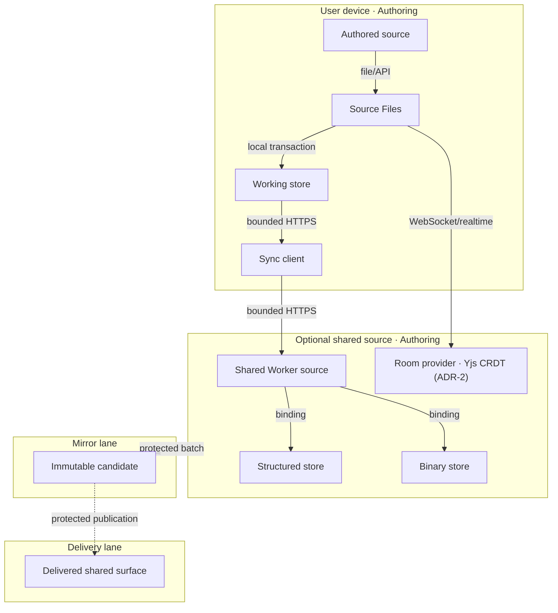

# Reference implementation: AgenticGraph Storage and Synchronization

## Authority and readiness

This document owns the product and architecture contract for local working persistence and optional
shared projections. Authored Markdown remains canonical. The portable authority is Git-backed
Markdown plus YAML frontmatter; GitHub is the current protected forge, not an irreplaceable content
database. Browser records, Lark resources, shared D1 rows, R2 objects, collaboration rooms, and
generated mirrors are supporting stores with explicit roles.

The source contains working adapters, but no satisfying Evidence Reference is attached here.
Therefore local readiness is `spec-complete` and delivered readiness is `undocumented`.

**Version note (v5.0.0)**: this revision restructures the document to close template gaps against
`prd-tad-adr-guidelines.md` v1.7.0 — User Stories, Component Specifications, Integration Contracts,
Quality Attributes, Deployment Strategy, a Readiness Gap Matrix, and three embedded Architectural
Decision Records are added. `doc_type` changes from Combined PRD/TAD to Combined PRD/TAD/ADR because
ADR ownership moves from the external `decision_archive` document into this document; the prior
decision archive file is archived, not deleted, per the Phase 4 archival rule. No readiness rung is
raised by this revision: structural gaps are closed, evidence gaps are not, and every new or changed VCC is
tracked honestly at `spec-complete`/`undocumented` in the Readiness Gap Matrix below.

**Traceability scheme**: this document fuses the guideline's `PRD-[Epic]-[Story] ↔
TAD-[Component]-[Interface] ↔ VCC [condition] ↔ Evidence Reference [check + result]` chain into one
identifier per capability, written `S[N]`. Each `S[N]` row in Requirements and VCCs is simultaneously
its own PRD acceptance criterion, its own VCC, and its own traceability anchor; the TAD component(s)
implementing it are named in Component Specifications and Component Inventory below.

## Recommended knowledge-base storage boundary

| Store or format | Decision | Minimum-value use | Forbidden authority claim |
|---|---|---|---|
| Git-backed Markdown/frontmatter | **Choose as SSOT** | Portable authoring, reviewable diffs, provenance, rollback, and agent-readable context | GitHub-specific UI or API state is not the content format. |
| Lark Suite Base + Wiki/Docs | **Integrate as collaboration projection** | Base for structured catalog/workflow fields; Wiki/Docs for navigation, discussion, and review | A Lark row, page, callback, or web-app payload cannot silently overwrite accepted source. |
| Cloudflare Pages/static Markdown | **Generate for publication** | Low-cost public read path for `airvio.co/agenticgraph` from an exact accepted revision | Published bytes are not an authoring root. |
| Cloudflare D1 | **Use as rebuildable structured projection** | Search, relationship, document metadata, cursors, and runtime queries | D1 content is not canonical Source Files content. |
| Cloudflare R2 | **Use for large or content-addressed bytes** | Media, exports, snapshots, and content-addressed artifacts | Immutability applies only where an owning route proves it; object existence does not prove source acceptance or delivery readiness. |
| Cloudflare KV | **Use narrowly** | Small caches, configuration, and revision pointers | KV is not for relational authority or concurrent document edits. |
| Cloudflare Durable Objects | **Use for live coordination only when needed** | One selected per-document room, ordering, and ephemeral collaboration state | Room history does not become durable authoring authority. |
| CSV/JSON | **Use for interchange** | Bulk import/export, backups, and deterministic transforms | An exchange file is a candidate until provenance and review bind it to Git. |
| PostgreSQL/other database | **Defer** | Future workloads that prove D1/source projections insufficient | Do not add a second database before measured scale, query, or retention need. |

The Git-backed Markdown/frontmatter SSOT choice is formalized in **ADR-1**; the Lark boundary below is
formalized in **ADR-3**. The recommended Lark integration is host-mediated and review-first. A Lark web app may provide the
user experience under the
[Web App API boundary](https://open.larksuite.com/document/client-docs/gadget/-web-app-api/api-overview),
while a server-owned adapter applies the [Lark Docs/Base OpenAPI](https://open.larksuite.com/document/ukTMukTMukTM/uczNzUjL3czM14yN3MTN)
scopes and user/tenant access-token permissions. The browser receives no app secret or reusable
provider credential. Start with read-only Base/Wiki/Docs discovery and supplied-snapshot import;
add outbound write-back only after idempotency, conflict, audit, rollback, deletion, and cost VCCs
are evidenced.

For the current release topology, accepted Dev source in `huijoohwee/agentic-graph` generates the
`huijoohwee/content/agenticgraph` mirror, which is then published to `airvio.co/agenticgraph`. The mirror
and public route remain generated projections and are never authoring roots.

The proposed Lark knowledge-base integration must define one typed projection envelope that binds:

- source repository, repository-relative path, accepted Git revision, and content digest;
- projection provider, resource identifier, provider revision, schema version, and generation time;
- direction (`source-to-projection` or `projection-to-candidate`) and review state.

No current D1 row or Lark adapter is claimed to satisfy this target. Its schema, migration, and
verification owner must be admitted before remote integration work begins.

The only accepted external-edit flow is `Lark change -> immutable snapshot/event -> normalized
Markdown/frontmatter candidate -> reviewed protected merge -> regenerated Lark/Cloudflare
projections`. Concurrent providers never use last-write-wins against the source.

## Problem and personas

| Persona | Problem | First value |
|---|---|---|
| Solo author | browser refresh/offline work can lose context | save and reopen one local source |
| Multi-device author | revisions can diverge across devices | explicit push/pull result or conflict |
| Collaborator | concurrent edits can overwrite one another | one selected room provider and visible state |
| Operator | source, shared state, and delivery can be confused | exact store role, evidence, and rollback |

## User Stories

**As a** solo author, **I want** my edits saved to a recoverable local record before any network
transport, **so that** a browser refresh or offline stretch never loses my work.

**As a** multi-device author, **I want** an explicit push/pull result or a surfaced conflict instead
of a silent overwrite, **so that** I can trust which revision is authoritative across devices.

**As a** collaborator, **I want** exactly one room provider to own concurrent edits to a document,
**so that** two providers never dual-write and corrupt shared state.

**As an** operator, **I want** every store's role, evidence, and rollback path stated explicitly,
**so that** I never mistake a rebuildable projection (D1, R2, a mirror, a Lark page) for the
authoring source.

## Journey: Author — Save, reconnect, and reconcile

| Stage | Action | Touchpoint | Pain | Opportunity |
|---|---|---|---|---|
| Trigger | edits one source | workspace | fears loss | persist locally before transport |
| Discover | inspects save/sync state | Source Files | status can be ambiguous | expose local, queued, conflict, and failure |
| Engage | requests synchronization | sync adapter | network may fail and trust differs by adapter | bounded outbox, typed result, and explicit auth gap |
| Complete | reopens or reconciles | workspace | fears silent overwrite | retain canonical revision and conflict |
| Return | continues offline/online | local store | provider may be unavailable | local-first degraded mode |

## Requirements and VCCs

| ID | Given / When / Then | VCC: end state; stated check; constraint |
|---|---|---|
| S1 Local durability | Given a valid source edit, when saved, then a recoverable local record exists before optional transport. | End: save/reopen and fallback tests pass; Check: `npm test` exits 0; Constraint: source identity remains explicit and memory fallback is not called durable. |
| S2 Typed synchronization | Given queued mutations, when push/pull runs, then applied/conflict/rejected/deferred results are recorded with cursors. | End: storage/runtime suites pass; Check: `npm run runtime:test` exits 0; Constraint: conflict/rejection is never silently resent or overwritten. |
| S3 Source authority | Given local, shared, and mirror copies, when identities disagree, then the configured authored source and revision remain authoritative. | End: source-authority tests pass; Check: `npm test` exits 0; Constraint: no D1/browser/mirror record becomes an implicit authoring owner. |
| S4 Optional collaboration | Given concurrent editing is enabled, when a document opens, then exactly one room provider owns updates and recovery. | End: provider-specific room/replay tests pass; Check: `npm test` exits 0; Constraint: no dual-write between room providers. |
| S4a Collaboration CRDT engine | Given the Room provider is enabled for a document, when concurrent edits arrive, then updates merge via a CRDT engine without last-write-wins and the merged state squashes to a Markdown/frontmatter candidate through the existing S9 review path. | End: CRDT-merge fixtures pass and squash-to-candidate fixtures pass; Check: a future named CRDT suite exits 0; Constraint: CRDT room state is never treated as durable authoring authority; only the squashed Markdown candidate may enter Git review. Engine selection: ADR-2. |
| S5 Binary separation | Given generated/uploaded bytes, when stored or replayed, then binary-route auth/overwrite behavior matches the dedicated contract. | End: media/blob suites pass; Check: named binary tests exit 0; Constraint: no entitlement, immutability, or delivery claim beyond actual handlers. |
| S6 Protected delivery | Given a shared Worker or mirror candidate, when promotion is requested, then Source→Mirror→Delivery boundaries remain closed without evidence and instruction. | End: exact candidate/live/rollback receipt exists; Check: protected workflow reports it; Constraint: the Pages release does not implicitly deploy storage Workers. |
| S7 Shared authorization | Given a shared structured route, when authorization is missing or invalid, then the request is rejected before any read or write. | End: negative auth tests pass for push, pull, and export; Check: a future named security suite exits 0; Constraint: current source has no satisfying auth enforcement, so shared delivery remains closed. |
| S8 Projection provenance | Given any Lark or Cloudflare projection, when it is read, then its accepted source revision and content digest are explicit and verifiable. | End: projection-envelope fixtures pass; Check: a future named projection suite exits 0; Constraint: provider timestamps, titles, and row IDs cannot substitute for source identity. |
| S9 External edit review | Given a Lark or interchange edit, when synchronization runs, then it produces a bounded candidate and never overwrites authored source directly. | End: candidate/conflict/idempotency fixtures pass; Check: a future named provider-adapter suite exits 0; Constraint: remote acquisition and write-back remain unimplemented and delivery-closed today. |

## Time-to-value and metrics

| Metric | Baseline | Target | Timeline |
|---|---:|---:|---|
| Local save/reopen TTV | unmeasured | ≤3 actions / ≤5 min | before baseline |
| Offline save recovery | unmeasured | 100% canonical fixtures | before baseline |
| Conflict visibility | unmeasured | 100% conflict fixtures produce explicit state | before enabling shared sync |
| Mandatory token cost | 0 by design | 0/run and $0/month | every run |
| Local cash TCO | $0 estimate | $0/month; $0/12 months | monthly |
| Shared cash TCO | unmeasured | operator-approved budget before use | before delivery |
| Local readiness rung | `spec-complete` | evidence-derived only | every revision |
| Delivered readiness rung | `undocumented` | evidence-derived only | every revision |

## MoSCoW Priority & ROI

Score is `(impact × monthly reach) / (build hours + 12-month cash TCO/100 + risk)`.

| Tier | Capability | Estimated ROI | 12-month TCO | Scope | Rationale |
|---|---|---:|---:|---|---|
| Must | local working store and recovery | 3.1 | $0 | minimum viable | highest-frequency pain (data loss on refresh/offline); zero cost to ship |
| Must | typed outbox/cursor/conflict | 2.2 | $0 local | minimum viable | prevents silent overwrite across devices; zero infra cost |
| Must | source-authority labels | 3.8 | $0 | minimum viable | cheapest highest-leverage fix: stops any store from being mistaken for SSOT |
| Should | optional shared structured sync | 0.9 | $0–540 | evidence-gated | real value, but only past S2/S7 evidence; not worth Must-tier risk yet |
| Should | one collaboration room provider (CRDT: Yjs, ADR-2) | 0.6 | $120–1,200 | evidence-gated | closes S4/S4a; ROI depends on real concurrent-editing demand materializing |
| Could | shared binary replay | 0.5 | $0–420 | blocked on security VCCs | S5's known unauthenticated-overwrite gap must close first (see Readiness Gap Matrix) |
| Won't | hidden cloud authority or unbounded auto-sync | <0.1 | unbounded | excluded | violates source-authority (S3) and lane-closure defaults outright |

### Min-Viable Scope

Local save/reopen, explicit memory fallback, typed outbox/cursor/conflict, and zero-token operation.
This is the entire Must tier above; nothing in Should/Could/Won't is required to satisfy it.

### Out of Scope

Real-time collaboration, automatic Worker delivery, and claims of cross-device/public durability are
out of scope until separately evidenced. CRDT room state (ADR-2) is explicitly excluded from ever
becoming durable authoring authority. Hidden cloud authority and unbounded auto-sync are excluded
outright (Won't tier).

### Dependencies

Git-backed Markdown/frontmatter authoring workflow (ADR-1); a Cloudflare account with Workers, D1,
R2, KV, and Durable Objects bindings; browser IndexedDB/Dexie support for the working store; the
existing typed route-path and binary-contract modules named in Component Inventory; a Yjs-compatible
Durable Object provider package (Should tier, ADR-2); a scoped Lark tenant with Base/Wiki/Docs OpenAPI
access (Should tier, ADR-3, only if the collaboration-projection track is pursued).

## Topology: Storage roles v5.0 — 2026-08-06

| Node | Role | Type | Lane | Connects to | Connection | Data residency |
|---|---|---|---|---|---|---|
| Authored source | Store | Markdown/file or configured source | Authoring | Source Files | file/API | configured source root |
| Protected Git history | Authority/Audit | Git repository; GitHub is current forge | Authoring | authored source, build jobs | commit/review | configured repository |
| Source Files | Router/Consumer | client feature | Authoring | working store, sync client | in-process events | browser memory |
| Working store | Store | IndexedDB/Dexie or explicit memory adapter | Authoring | sync client | local transaction | user device |
| Sync client | Producer/Consumer | typed client adapter | Authoring | shared Worker | bounded HTTPS | request memory |
| Shared Worker source | Gateway | Worker source | Authoring | D1/R2/room binding | in-process binding | configured service region |
| Structured store | Store | D1-compatible database | Authoring until delivered separately | Worker | binding call | configured database region |
| Binary store | Store | R2-compatible object store | Authoring until delivered separately | Worker | binding call | configured bucket region |
| Room provider | Store/Gateway | optional collaboration service; CRDT engine: Yjs (reference implementation, MIT — ADR-2) | Authoring until delivered separately | Source Files | WebSocket/realtime | provider configuration |
| Lark collaboration | Producer/Consumer | optional Base + Wiki/Docs adapter | Authoring until evidenced | candidate review, projection publisher | host-mediated OpenAPI | configured tenant/region |
| Mirror | Store | immutable candidate | Mirror | Delivery | protected batch | mirror artifact store |
| Delivery | Consumer/Gateway | optional public/shared runtime | Delivery | clients | HTTPS/WebSocket | declared delivery region |

**Version note**: v5.0 preserves the v4.1 delivery boundary and SSOT model unchanged, and adds one
decision: the Room provider's CRDT engine is now named (Yjs, ADR-2) rather than left unspecified.
This closes a structural gap in S4 without raising S4's readiness rung — no evidence is recorded for
this revision. ADR ownership moves into this document (see Architectural Decision Records); the
prior long-form ADR narrative remains an archived, non-authoritative reference.

## Orchestration/Harness Flows

Not applicable. Every storage/sync operation in this document's scope runs at a zero-LLM-token
budget (see TCO comparison); there is no AI-powered pipeline to route through a dispatcher/executor/
observer/consumer chain. This section is deliberately closed empty rather than omitted, so its
absence is a stated fact rather than an undocumented gap.

## Data flows

### Local save and reopen

| Stage | Component | Input | Output | Persistence | Error handling |
|---|---|---|---|---|---|
| Ingest | Source Files | source edit + identity | typed source revision | active source | validation error |
| Transform | storage mapper | revision | document/chunk/snapshot/outbox records | none | typed mapping error |
| Store | working store | records | committed local transaction | device; user-controlled | explicit memory fallback/failure |
| Serve | workspace | reopened record | source/projection | active session | preserve unsaved state |

### Optional synchronization

| Stage | Component | Input | Output | Persistence | Error handling |
|---|---|---|---|---|---|
| Ingest | sync client | outbox + cursor | bounded request | request-scoped | retain outbox |
| Transform | shared Worker | typed mutations/base revisions | applied/conflict/rejected/deferred | transaction-scoped | typed revision/quota result; current structured routes do not enforce auth |
| Store | structured/binary/room owner | accepted record/update | shared projection | declared retention/region | rollback/reconcile |
| Serve | reconciler | response + local state | updated cursor/conflict | local history | no silent overwrite |

### Room synchronization (CRDT, design-only — ADR-2)

| Stage | Component | Input | Output | Persistence | Error handling |
|---|---|---|---|---|---|
| Ingest | Room provider (Durable Object) | client Yjs update | applied update broadcast | active room, in-memory + hibernatable | reconnect-and-resync on drop |
| Transform | CRDT engine (Yjs) | concurrent updates | merged document state | none (ephemeral room state) | automatic conflict-free merge; no last-write-wins |
| Store | squash step | merged state | Markdown/frontmatter candidate | candidate worktree only, via S9 path | squash failure retains prior snapshot |
| Serve | protected Git workflow | candidate diff + source base | accepted revision or rejection | Git history | identical to Lark candidate flow's Review stage; no direct-write to canonical source |

This flow is unimplemented for this revision (S4a is `spec-complete`, not `dev-proven`); it is
documented ahead of the evidence per the guideline's Phase 2 authoring step, and its rung will not
move until the CRDT-merge and squash-to-candidate fixtures named in S4a exist and pass.

### Lark collaboration candidate flow

| Stage | Component | Input | Output | Persistence | Error handling |
|---|---|---|---|---|---|
| Discover | host-owned Lark adapter | scoped Base/Wiki/Docs selection | immutable provider snapshot + revision | request/evidence store | reject missing scope, token permission, or provider revision |
| Transform | deterministic mapper | snapshot + mapping version | Markdown/frontmatter candidate + diagnostics | candidate worktree only | preserve unsupported fields; no invented repair |
| Review | protected Git workflow | candidate diff + source base | accepted revision or explicit rejection/conflict | Git history | never direct-write canonical source |
| Project | bounded publisher | accepted revision + content digest | Lark and Cloudflare projections | declared provider stores | idempotent retry; retain prior projection on failure |

## Component Specifications

| Component | Responsibility and interfaces | Dependencies and configuration | FOSS / vendor | VCC, evidence, and readiness |
|---|---|---|---|---|
| Working store | Persists typed document/chunk/snapshot/outbox records in a committed local transaction before optional transport; exposes the Dexie/IndexedDB transactional API and an explicit memory-fallback adapter implementing the same typed contract. | `canvas/src/lib/storage/agenticgraphStorageSyncContract.ts`; IndexedDB-versus-memory adapter selection and per-record retention policy. | FOSS: Dexie, MIT (reference implementation). | S1; no Evidence Reference recorded this revision; Local `spec-complete`, Delivered `undocumented`. |
| Sync client | Dispatches queued outbox mutations to the shared Worker source and records applied/conflict/rejected/deferred results against a cursor through the bounded HTTPS contract below. | Working store outbox and Shared Worker source; retry/backoff policy; request-scoped memory only. | FOSS: project-owned client module. | S2; no Evidence Reference recorded this revision; Local `spec-complete`, Delivered `undocumented`. |
| Room provider (CRDT) | Merges concurrent edits for exactly one open document through WebSocket/Durable Object and the Yjs sync protocol, then squashes merged state to a Markdown/frontmatter candidate; `y-indexeddb`-equivalent local persistence stays alongside, not in place of, the working store. | One Durable Object per document and the existing S9 review path; exactly one active provider per document; idle hibernation. | FOSS: Yjs, MIT (reference implementation; ADR-2 owns alternatives). | S4/S4a; no evidence recorded and the remote/live adapter is unimplemented; Local `spec-complete`, Delivered `undocumented`. |
| Lark configuration/import adapter | A host-owned adapter discovers scoped Base/Wiki/Docs resources and produces an immutable provider snapshot for the deterministic mapper through host-mediated OpenAPI; the browser receives no reusable credential. | `agenticgraph-mcp/agenticgraph-feishu-base-mcp-prd-tad.md`, `agenticgraph-mcp/agenticgraph-lark-app-mcp-prd-tad.md`; scope allowlist and snapshot retention window. | Proprietary Lark platform, project-owned adapter; ADR-3 owns the TCO/FOSS comparison. | S9; remote fetch/write-back is not evidenced; Local and Delivered `undocumented`. |

The generic blob handler currently has no auth and permits overwrite at a workspace/path key. The
run-media token checks expiry and run id but is not signed. The binary contract owns those blockers.
The structured push, pull, and export handlers also have no authorization gate; current browser
clients send content type but no credential. These routes must not be treated as safe public shared
storage until S7 is implemented and evidenced. Optional KV support is not assumed live merely because
a binding is supported.

## Integration Contracts

| Interface | Protocol and format | Error contract |
|---|---|---|
| Sync client ↔ Shared Worker source | Bounded HTTPS outbox push/pull; JSON using the typed document/chunk/snapshot/outbox/cursor schema. | Typed applied/conflict/rejected/deferred result; retry with backoff on network failure; no silent overwrite. |
| Source Files ↔ Room provider (CRDT, ADR-2) | WebSocket to a Durable Object; Yjs sync protocol reference implementation with binary Yjs update encoding v1. | Reconnect-and-resync on drop; awareness/presence is best-effort; squash failure retains the prior snapshot. |
| Host-owned Lark adapter ↔ Lark Base/Wiki/Docs OpenAPI | HTTPS with a server-owned tenant/user token; Lark JSON → deterministic mapper → Markdown/frontmatter candidate. | Reject missing scope, token permission, or provider revision; never invent repairs for unsupported fields. |

## Architectural Decisions

See ADR-1 (SSOT storage format), ADR-2 (collaboration CRDT engine), and ADR-3 (Lark integration
boundary) in **Architectural Decision Records** below.

## Quality Attributes

| Attribute | Scenario | Pattern | Validation |
|---|---|---|---|
| Performance | Local save/reopen under normal load → local write commit well under human-perceptible delay | IndexedDB/Dexie transactional writes; no network round-trip on the hot path | Local benchmark harness against S1 fixtures |
| Scalability | Growth to N concurrent collaborators per document room → sync latency must not degrade past target | One Durable Object instance per document (per-document sharding); hibernation when idle | Load test against Durable Object free-tier request/compute ceilings |
| Security | Unauthenticated request against structured/binary routes → request rejected before any read or write | Bearer/session auth gate on Worker routes; signed run-media tokens (S7) | Negative auth test suite named in S7 |
| Observability | Sync conflict or rejection occurs → operator can see conflict state, cursor, and surface | Typed outbox/cursor/conflict records surfaced to Source Files UI | Conflict-fixture pass; manual conflict-visibility walkthrough (see Time-to-value) |
| Token Cost | Any storage/sync operation → zero LLM token spend | No model calls anywhere on the storage/sync path, by design | Cost log sampling shows $0.00 across all named checks |
| Offline Behaviour | Network/provider unavailable → local save/reopen stays available in degraded mode | Local-first working store with deferred reconciliation; explicit memory fallback only as a last resort | Airplane-mode pass; reconciliation replay test |
| TCO | 12-month spend at solo-dev/small-team load → stays within the $0–$45/mo optional band stated below | Cloudflare free-tier-first (D1/R2/DO/KV); FOSS CRDT engine (Yjs); no proprietary KB database | Monthly cost audit against TCO comparison table |
| Device Reach | Browser-first, offline-capable client across desktop and mobile → same storage contract everywhere | IndexedDB/Dexie works across modern browsers; no native-only APIs on the storage path | Cross-device manual pass |

## Deployment Strategy

Promotion is rolling and strictly lane-gated: authoring → mirror → delivery, per the Deploy Boundary
Register below. No blue-green or canary infrastructure is added at this scale — Cloudflare Worker
deploys are effectively atomic per version already. Rollback restores the prior Worker, config, and
migrations, then reruns the sync, conflict, auth, and read-back probes named in each boundary's
Evidence Reference; this is the same rollback statement already recorded per boundary, not a second
mechanism.

## Component Inventory

*Status values are Readiness Ladder rungs only; local and delivered are separate columns.*

| Layer | Component | File / Module | Local rung | Delivered rung |
|---|---|---|---|---|
| Browser contract/types | Storage sync contract | `canvas/src/lib/storage/agenticgraphStorageSyncContract.ts` | `spec-complete` | `undocumented` |
| Route identity source | Storage route paths | `canvas/src/lib/storage/agenticgraphStorageRoutePaths.ts` | `spec-complete` | `undocumented` |
| Browser database | Working store (Dexie/IndexedDB + memory fallback) | storage-sync client modules | `spec-complete` | `undocumented` |
| Storage Worker | Shared Worker source dispatcher | `cloudflare/workers/agenticgraph-storage/index.ts` | `spec-complete` | `undocumented` |
| Structured persistence | D1 modules/migrations | Worker D1 modules | `spec-complete` | `undocumented` |
| Binary persistence | R2 blob/media handlers | `cloudflare/workers/agenticgraph-storage/blob.ts`, `media.ts` | `spec-complete` | `undocumented` |
| Collaboration | Room provider (CRDT: Yjs, ADR-2) | Source Files room adapters + Durable Object source | `spec-complete` | `undocumented` |
| Lark configuration/import | Lark adapter (config + supplied-snapshot only) | `agenticgraph-mcp/agenticgraph-feishu-base-mcp-prd-tad.md`, `agenticgraph-mcp/agenticgraph-lark-app-mcp-prd-tad.md` | `undocumented` | `undocumented` |
| Git/file relay | Authenticated source transport | `agenticgraph-storage-git-file-sync-runtime-api.md` | `spec-complete` | `undocumented` |
| Release | Documentation/Pages release seed | `.github/workflows/release.yml` | `spec-complete` | `undocumented` |

## VCC and Evidence Reference register

| VCC | Named check | Recorded result | Surface | Derived rung |
|---|---|---|---|---|
| S1, S3 | `npm run check && npm test` | not recorded for this revision | authoring | `spec-complete` |
| S2, S4 | `npm run runtime:test` | not recorded for this revision | authoring | `spec-complete` |
| S4a | CRDT-merge and squash-to-candidate fixtures (named suite not yet created) | no satisfying check exists | authoring | `spec-complete` |
| S5 | named media/blob unit tests in the binary contract | not recorded | authoring | `spec-complete` |
| S6 | exact storage Worker delivery/security/rollback check | not recorded | delivery | `undocumented` |
| S7 | negative authorization tests for structured push/pull/export | no satisfying check exists | authoring/delivery | `undocumented` |
| S8 | projection-envelope source revision/digest checks | no satisfying check exists | authoring | `spec-complete` |
| S9 | Lark candidate/conflict/idempotency checks | remote adapter is not implemented | authoring/delivery | `undocumented` |

## Readiness Gap Matrix

*Local rung and delivered rung are separate columns; both draw from the Readiness Ladder. Priority
is the highest severity among the findings linked to that workstream, or `none`.*

| Workstream | Local rung | Delivered rung | Gap | Priority | Exit criteria (VCC) |
|---|---|---|---|---|---|
| Local durability | `spec-complete` | `undocumented` | Local check exists but has no recorded result this revision | major | S1 |
| Typed synchronization | `spec-complete` | `undocumented` | Runtime suite exists but has no recorded result this revision | major | S2 |
| Source authority | `spec-complete` | `undocumented` | Same evidence gap as S1 (shared check) | major | S3 |
| Collaboration room (CRDT) | `spec-complete` | `undocumented` | Engine chosen (ADR-2) but merge/squash fixtures not yet built | minor | S4, S4a |
| Binary separation | `spec-complete` | `undocumented` | Known unauthenticated overwrite path on blob/media routes | blocker | S5 |
| Protected delivery | `undocumented` | `undocumented` | No exact live storage/auth/rollback check exists yet | blocker | S6 |
| Shared authorization | `undocumented` | `undocumented` | Structured push/pull/export have no auth gate at all | blocker | S7 |
| Projection provenance | `spec-complete` | `undocumented` | Envelope fixtures not built | major | S8 |
| External edit review (Lark) | `undocumented` | `undocumented` | Remote adapter unimplemented; no fetch or write-back evidenced | minor | S9 |

## TCO comparison

*Each row states its deployment model explicitly, per the guideline's Deployment-Model TCO Variants
rule; Provisioned/Self-Managed and Hybrid/Consolidated are never blended into one figure.*

| Model [deployment model] | Infra/month | Egress/month | 12-month cash | Ops burden | Default |
|---|---:|---:|---:|---:|---|---|
| Local working store [device-local, N/A] | $0 | $0 | $0 | low | chosen minimum |
| Managed shared structured/object/room adapters [Managed/Serverless — Cloudflare D1/R2/DO/KV] | $0–45 | $0–15 | $0–720 | medium (near-zero per unit; provider patches/scales/hibernates) | optional |
| Lark collaboration projection [Managed/Serverless only — Lark offers no self-hosted variant] | plan-dependent/unmeasured | provider-dependent | unmeasured | low/medium (rate-limit backoff engineering) | optional after demand and permission review; see ADR-3 |
| FOSS self-hosted shared stack [Provisioned/Self-Managed — dedicated VPS] | $15–100 | $0–25 | $180–1,500 | high (patching, backup, failover, capacity planning) | portability fallback |
| FOSS self-hosted shared stack [Hybrid/Consolidated — shares existing Oracle A1 ARM free-tier box already running Ollama inference] | $0–20 incremental | $0–15 | $0–420 | medium/high, amortized against an already-operated box | preferred fallback over a new dedicated VPS |
| Hybrid local + selected managed adapters [mixed Managed/Serverless] | $0–35 | $0–15 | $0–600 | medium/high | only with measured value |

All storage/sync operations have a zero-LLM-token budget.

## Deploy Boundary Register

| Boundary | From lane | To lane | Evidence Reference | Operator instruction | Rollback statement/check | State |
|---|---|---|---|---|---|---|
| `STORAGE-SOURCE-TO-MIRROR` | Authoring | Mirror | local/security candidate result `not recorded` | `none` | discard candidate; rerun local/runtime/security checks | `closed` |
| `STORAGE-MIRROR-TO-DELIVERY` | Mirror | Delivery | exact live storage/auth/rollback result `not recorded` | `none` | restore prior Worker/config/migrations; rerun sync, conflict, auth, and read-back probes | `closed` |

## Architectural Decision Records

### ADR-1: Git-backed Markdown/frontmatter as the sole SSOT
**Status**: Accepted
**Date**: 2026-08-06 *(formalizes a decision already reflected in the knowledge-base storage
boundary table above; this ADR records it as an addressable decision rather than changing it)*

**Context**: the storage boundary table must name exactly one canonical authoring format across
local, shared, and mirror stores, or capability ownership becomes ambiguous as more projections
(Lark, Cloudflare stores, future providers) are added.

**Decision**: Git-backed Markdown plus YAML frontmatter is the sole SSOT. GitHub is the current
protected forge, not an irreplaceable content database. All other stores (D1, R2, KV, Durable
Objects, Lark, mirrors) hold non-authoritative, rebuildable projections.

**Alternatives Considered**:
1. CRDT-document-as-truth (reference implementation pattern: a Y-Doc binary as canonical state, as
   used by document-collaboration platforms built on BlockSuite/Yjs): Pros — native real-time
   convergence, no separate review step for concurrent edits. Cons — canonical state becomes an
   opaque binary requiring conversion for human/Git review; self-hosting the reference stack
   requires a provisioned relational database, cache, and object store running together, adding
   ops burden this project's zero-infra posture rejects.
2. FOSS alternative — status quo, Git-backed Markdown/frontmatter (chosen): Pros — plain-text diffs,
   reviewable via existing Git tooling, zero additional runtime. Cons — no native real-time merge;
   concurrent-edit convergence must be added as a bounded, non-authoritative layer (see ADR-2).

**Rationale**: reviewability, provenance, and zero-infra TCO outweigh the convergence convenience of
a CRDT-native canonical format at current scale; convergence can be layered on top without changing
the SSOT.

**TCO Impact**:

| Dimension | Chosen: Git+Markdown [Managed/Serverless — GitHub free tier] | FOSS Alt: CRDT-canonical [Provisioned/Self-Managed — dedicated VPS] | FOSS Alt: CRDT-canonical [Hybrid/Consolidated — existing Oracle A1] | Delta / 12 months |
|---|---|---|---|---|
| Infra cost | $0/mo | $15–40/mo | $0/mo incremental | +$0 to +$480 |
| Egress cost | $0 | $0–10/mo | $0–10/mo | +$0 to +$120 |
| Token cost | $0 | $0 | $0 | $0 |
| Ops burden | Low (Git hosting managed) | High (patching, backup, failover across three services) | High, amortized against an already-operated box | — |
| Vendor risk | Low (Markdown is portable off GitHub) | Low | Low | — |

**Consequences**:
- **Positive**: every future projection stays disposable and regenerable from Git; no second
  authoritative store to reconcile.
- **Negative**: concurrent-edit UX requires the additional room-provider layer (ADR-2) rather than
  getting it for free from the canonical format.
- **Neutral**: this decision does not preclude a CRDT-canonical model later if scale or collaboration
  demand outgrows the review-gated model; that would require a superseding ADR.

### ADR-2: Yjs as the collaboration-room CRDT engine
**Status**: Proposed
**Date**: 2026-08-06

**Context**: S4 (Optional collaboration) names a Room provider node with no CRDT engine specified,
leaving concurrent-edit merge undefined; S9 requires that any external-edit path, including a room
provider, never overwrite the authored source directly.

**Decision**: adopt Yjs (MIT) as the CRDT engine, hosted inside the existing Durable Object Room
provider node, with a `y-indexeddb`-equivalent local-persistence adapter alongside — not replacing —
the working store. Merged room state squashes to a Markdown/frontmatter candidate that enters the
existing S9 candidate → protected-merge review path; room state is never treated as durable
authoring authority (S4 constraint carried forward unchanged).

**Alternatives Considered**:
1. Automerge (FOSS, MIT/Apache-2.0 dual): Pros — strong JSON-CRDT semantics, actively maintained.
   Cons — smaller Cloudflare-Durable-Object-native provider ecosystem than Yjs at time of evaluation;
   would require building the Durable Object binding from scratch rather than adapting an existing
   FOSS provider.
2. Rust-native CRDT via native bindings (reference implementation pattern: a Yjs-compatible Rust
   engine compiled to native bindings, as used by some document-collaboration platforms): Pros —
   highest raw merge performance. Cons — a native build toolchain requirement conflicts with this
   project's browser-first, JS/TS/WASM-only runtime posture; the performance ceiling is not needed
   at current solo/small-team document sizes.
3. No CRDT — conflict-surfaced-only (status quo, current spec baseline): Pros — zero new dependency,
   already spec'd. Cons — leaves S4 permanently unimplemented; concurrent edits degrade to
   explicit-conflict-only with no automatic convergence, which is the gap this ADR exists to close.

**Rationale**: Yjs is FOSS (MIT), has a Cloudflare-Durable-Object-native provider already available
in the open ecosystem, and its JS-only runtime matches the existing browser-first stack without
adding a Rust build step. It closes S4 at the lowest build-hour cost among FOSS options while
leaving ADR-1's SSOT model unchanged.

**TCO Impact**:

| Dimension | Chosen: Yjs + Durable Object [Managed/Serverless] | FOSS Alt: Yjs + self-hosted relay [Provisioned/Self-Managed — dedicated VPS] | FOSS Alt: Yjs + self-hosted relay [Hybrid/Consolidated — existing Oracle A1] | Delta / 12 months |
|---|---|---|---|---|
| Infra cost | $0/mo at free-tier ceiling (100K requests/day, 13,000 GB-s/day); usage-based beyond | $5–10/mo dedicated VPS | $0/mo incremental | +$0 to +$120 |
| Egress cost | $0 (zero-egress) | $0–5/mo | $0–5/mo | +$0 to +$60 |
| Token cost | $0 | $0 | $0 | $0 |
| Ops burden | Near-zero (provider patches, scales, hibernates idle rooms) | Medium (process supervision; no built-in hibernation) | Medium, amortized against an already-operated box | — |
| Vendor risk | Low (Yjs's own protocol is portable; the Durable Object hosting layer is the only non-portable piece, and it is swappable for the self-hosted variant without a data-format change) | Low | Low | — |

**Consequences**:
- **Positive**: closes S4 at $0 incremental infra cost at current scale; reuses a FOSS provider
  rather than building a custom WebSocket relay.
- **Negative**: adds a new runtime dependency (Yjs) and a new local-persistence surface that must be
  kept explicitly non-authoritative in code, not only in documentation, or it risks becoming a second
  SSOT by accident.
- **Neutral**: this ADR closes the engine-selection open question only; S4 and S4a remain
  `spec-complete`/`undocumented` until the fixtures named in S4a exist and pass — choosing an engine
  does not itself raise a readiness rung.

### ADR-3: Lark as a host-mediated, review-first collaboration projection
**Status**: Accepted
**Date**: 2026-08-06 *(formalizes a decision already reflected in the knowledge-base storage
boundary table above)*

**Context**: the storage boundary table designates Lark Base + Wiki/Docs as an "Integrate as
collaboration projection" role. This ADR records that boundary against the FOSS-first rule.

**Decision**: Lark stays strictly a host-mediated, review-first collaboration projection —
read-only Base/Wiki/Docs discovery and supplied-snapshot import first; outbound write-back only
after the S9 idempotency/conflict/audit/rollback/cost VCCs are evidenced. Lark is never a second
SSOT.

**Alternatives Considered**:
1. No external KB integration (status quo / strict FOSS gate): Pros — zero new closed-source
   dependency, $0 TCO, no rate-limit engineering tax. Cons — no human-facing collaboration surface
   for non-technical stakeholders.
2. FOSS alternative — self-hosted collaboration surface rendering the same Markdown/frontmatter SSOT
   (Provisioned/Self-Managed): Pros — stays inside the FOSS gate entirely. Cons — solo-dev build and
   maintenance cost for a surface that closed-source SaaS already provides at small scale for free;
   not yet justified against a real stakeholder-collaboration workload.
3. Lark Base/Wiki/Docs (chosen, Managed/Serverless only — Lark offers no self-hosted variant): Pros —
   lowest build-hour cost for a polished human-facing view; tenant/token model already scoped by this
   project's MCP configuration docs. Cons — closed-source, per-app rate limits, requires host-owned
   credential management; fails the FOSS gate outright, which is why it is bounded to a
   non-authoritative, review-gated role rather than adopted as infrastructure.

**Rationale**: a strict FOSS-only stance would forbid Lark entirely; the practical bound already
reflected in the storage boundary table is to accept it only as a disposable, regenerable,
human-facing projection — never as a database — which contains the FOSS-gate exposure to the
smallest possible surface (read-mostly discovery, reviewed candidates) while preserving the option
to drop it without data loss, since it owns no canonical state.

**TCO Impact**:

| Dimension | Chosen: Lark Base/Wiki/Docs [Managed/Serverless, closed-source] | Alt: no integration [status quo] | FOSS Alt: self-hosted wiki [Provisioned/Self-Managed] | Delta / 12 months |
|---|---|---|---|---|
| Infra cost | $0 direct API cost; plan-dependent seat cost if collaborators need paid tiers | $0 | $5–15/mo VPS | +$0 to +$180 vs. status quo |
| Egress cost | provider-dependent, unmeasured | $0 | $0–5/mo | unmeasured |
| Token cost | $0 | $0 | $0 | $0 |
| Ops burden | Low/medium (rate-limit backoff engineering, credential management) | none | High (wiki software patching/backup) | — |
| Vendor risk | High (closed-source, per-app rate limits, no FOSS exit path for the *surface* — but zero exit risk for *data*, since Lark holds no canonical state) | none | Low | — |

**Consequences**:
- **Positive**: gives non-technical collaborators a usable view without asking them to read
  Markdown/frontmatter in Git.
- **Negative**: every Lark-facing feature carries a permanent FOSS-gate exception that must stay
  documented and bounded, not quietly expanded — e.g. accidental write-back before S9 evidence
  exists.
- **Neutral**: dropping Lark entirely remains a zero-data-loss operation at any time, because ADR-1
  already guarantees it owns no canonical state.

## Conformance Note

This revision adds Component Specifications, Integration Contracts, Quality Attributes, Deployment
Strategy, a Readiness Gap Matrix, and three embedded ADRs to close template gaps against
`prd-tad-adr-guidelines.md` v1.7.0. No VCC in this revision is marked above `spec-complete`/
`undocumented` without a newly recorded Evidence Reference; ADR-2 and S4a add a decision and a VCC
respectively but do not themselves raise any readiness rung, consistent with the Readiness Ladder's
evidence-only derivation rule. Remaining gaps after this revision are evidence gaps — named checks
not yet run — not structural gaps; they are tracked in the Readiness Gap Matrix above, and the three
`blocker`-priority rows (Binary separation, Protected delivery, Shared authorization) are the ones
that must close before any claim of `runtime-ready` on this document's Must-tier capabilities.

## Open questions

- Which shared adapter, region, retention, and deletion policy is authorized per workspace?
- Which cryptographic authorization replaces the current unsigned run-media token?
- What clean-environment save/reopen and conflict-recovery TTV is observed?
- What document/blob limits and cost ceilings are acceptable?
- Which separately approved runbook owns Worker migration and rollback?
- Which Base schema and Wiki/Docs hierarchy give enough collaboration value without duplicating the Markdown/frontmatter model?
- Which host owns Lark tokens, event verification, snapshot retention, candidate creation, and outbound idempotency?
- Which package implements the Yjs↔Durable Object provider (ADR-2), and has its license text been verified directly rather than trusted from npm metadata alone?
- What load level (concurrent rooms, updates/second) is the target for the Scalability quality-attribute validation before Durable Object free-tier ceilings are treated as sufficient?
