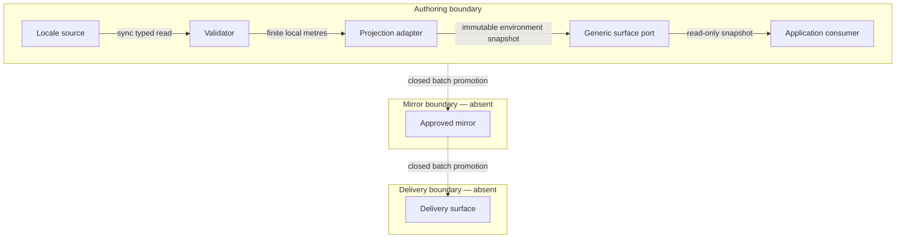

# Singapore ADM0 Environment Companion PRD/TAD/ADR

## 1. Authority and boundary

This companion is the sole document authority for the Singapore-specific
environment contract consumed by reusable surface modes and compatible
applications. It owns:

- ADM0 identity `SGP` and display identity `Singapore`;
- the local-stage geographic anchor and axis convention;
- the presentation center and viewport extent;
- planar and oblique initial camera policies;
- the selected Singapore terrain dimensions;
- the named major-POI roster and its schematic local-metre surfaces; and
- the distinction among an ADM0 identity, presentation framing, a local stage
  footprint, and authoritative geographic boundaries.

The generic mode document owns surface composition, renderer and input
arbitration, semantic media wrappers, overlay slots, lifecycle, and provider
adapters. The City document owns parcels, zoning, economy, advice, persistence,
and City actions. Flight and other applications own their own simulation state.
This companion supplies locale data to those owners and does not redefine,
specialize, or alias their contracts.

No polygon in this companion is asserted to be an administrative, legal,
surveyed, cadastral, navigational, or emergency-response boundary. The viewport
extent frames a presentation. The 32 by 24 metre stage is a local authored
scene. Major-POI surfaces are recognizable schematic representations rather
than surveyed footprints or building models.

## 2. Readiness and lane statement

| Concern | Local rung | Delivered rung | Statement |
|---|---|---|---|
| Product and architecture contract | `spec-complete` | `undocumented` | Requirements, typed boundaries, decisions, and VCCs are stated. |
| Source implementation | `spec-complete` | `undocumented` | Source owners exist, but no result is attached to this revision. |
| Mirror lane | `undocumented` | `undocumented` | Closed: no mirror target is declared by this companion. |
| Delivery lane | `undocumented` | `undocumented` | Closed: no public environment artifact or release target is declared. |

The document makes no runtime-ready, integration, production, or deployment
claim. A named command is a planned evaluator; it is not an Evidence Reference
until its immutable result, revision, and environment are recorded.

## 3. PRD

### 3.1 Problem and outcome

Locale facts previously embedded in simulator or mode descriptions can drift,
be mistaken for generic architecture, or turn a viewport rectangle into an
accidental boundary claim. A single locale companion must make those facts
reviewable while allowing the generic surface and each application to remain
place-agnostic.

The outcome is one source-authored Singapore environment package whose
identity, camera framing, anchor, axes, and schematic POIs project
deterministically into any conforming consumer without giving this package
renderer, interaction, simulation, persistence, provider, or delivery
ownership.

### 3.2 Personas

**Primary persona — environment data steward.** The steward changes a
Singapore-specific anchor, camera policy, or schematic POI once and expects
every conforming consumer to receive the same revision.

**Secondary persona — reviewer.** The reviewer needs to prove that the ADM0
identity, viewport extent, stage footprint, and POI geometry are distinct
concepts and that no generic mode or application contract is duplicated here.

**Tertiary persona — operator.** The operator selects the Singapore environment
and expects a stable initial view with recognizable, aligned POIs in planar and
volumetric presentations.

### 3.3 Primary journey

| Stage | Actor action | Locale owner response | Completion signal |
|---|---|---|---|
| Inspect | Review ADM0 identity and scope | Expose `SGP`, Singapore, and boundary disclaimers | No presentation rectangle is labelled as an ADM0 polygon |
| Select | Select the Singapore terrain | Resolve one 32 by 24 metre stage and one locale revision | One stage identity, anchor, and POI roster |
| Project | Enter a compatible planar or volumetric surface | Apply the matching camera policy and local-metre projection | Stable center, framing, footprints, and heights |
| Verify | Inspect the three named major POIs | Surface stable IDs, labels, and non-collidable geometry | Roster and surface count match the source |
| Exit | Leave or replace the environment | Release only locale data | Consumer lifecycle and prior surface remain consumer-owned |

### 3.4 User stories

- `PRD-SG-01` — As a steward, I can maintain the Singapore ADM0 identity in one
  locale contract so generic and application documents contain no copied facts.
- `PRD-SG-02` — As a reviewer, I can distinguish the presentation extent from
  an administrative boundary and the stage footprint from either.
- `PRD-SG-03` — As an operator, I receive a north-up planar initial view and an
  oblique volumetric initial view from one Singapore camera policy.
- `PRD-SG-04` — As a consumer, I can project local metres through one anchor
  and axis convention without a second geography or compatibility alias.
- `PRD-SG-05` — As an operator, I can identify Marina Bay Sands, Singapore
  Flyer, and Gardens by the Bay through stable semantic POI identities.
- `PRD-SG-06` — As a reviewer, I can verify that POIs are schematic,
  non-collidable presentation surfaces with finite positive dimensions.
- `PRD-SG-07` — As a maintainer, I can validate the locale package locally
  without a model, token, account, remote asset, or new runtime dependency.
- `PRD-SG-08` — As a delivery owner, I can see that mirror and delivery lanes
  are closed until a separate authorized contract opens them.

### 3.5 Must, should, could, will not

| Priority | Scope |
|---|---|
| Must | One ADM0 identity; one anchor; one axis convention; one presentation center and extent; two camera-policy classes; one stage; three POI identities; immutable typed values; explicit non-boundary and schematic disclaimers; deterministic local projection; VCC coverage. |
| Should | Human-readable labels, stable revisions, accessible inspection metadata, exact source-to-presentation equality checks, and failure on unknown POI identity. |
| Could | A future separately sourced official ADM0 polygon, richer provenance records, or additional Singapore environment variants, each admitted by a new requirement and VCC. |
| Will not | Own a generic mode, map provider, renderer, camera mechanism, application state, City logic, Flight logic, legal boundary, navigation product, hosted API, account, model, release lane, OS Status Surface, Agent Discovery Surface, or Gateway Federation Contract. |

### 3.6 Time to value, measures, and economics

| TTV dimension | Estimate | Ceiling | Validation |
|---|---:|---:|---|
| Manual actions | 1 environment selection | 1 | clean-source walk-through |
| Elapsed time after consumer readiness | 1 committed frame | 1 second | timed projection assertion |
| First value | stable regional context | — | identity, camera, and POI snapshot |

| Measure | Baseline | Target | Timeline |
|---|---:|---:|---|
| Select-to-stable initial environment projection | no candidate-bound observation | at most 1 committed presentation frame after the consumer is ready | first satisfying VCC run |
| Locale choices required after selecting Singapore | no candidate-bound observation | 0 | first satisfying VCC run |
| ADM0 identities in this package | unvalidated | exactly 1 | authoring gate |
| Geographic anchors | unvalidated | exactly 1 | authoring gate |
| Named major POIs | unvalidated | exactly 3 | authoring gate |
| POI presentation surfaces | unvalidated | exactly 9 | authoring gate |
| Required model or token calls | unvalidated | 0 | every run |
| Required remote locale or asset calls | unvalidated | 0 | every run |
| Added runtime dependencies | current repository baseline | 0 | integration gate |
| Locale-owned renderers, cameras, and persistence stores | unvalidated | 0 | every run |

The min-viable-max-value path is checked-in typed locale data plus the existing
shared projection and presentation owners. Marginal runtime cost, model cost,
token cost, locale storage operations, and locale delivery operations are zero.
Provider transport and application costs remain outside this companion and
must be attributed to their actual owners.

| Feature | Tier | Impact | Sessions/month | Build hours | Monthly TCO/token cost | ROI score |
|---|---|---:|---:|---:|---:|---:|
| ADM0 identity, framing, and camera policy | Must | 5 | 20 | 20 | $0 | 5.00 |
| Semantic POI roster and projection | Must | 4 | 12 | 24 | $0 | 2.00 |
| Official administrative polygon | Won't | 2 | 2 | 80 | $10 | 0.04 |

The Must threshold is `2.0`, using
`(impact × sessions) / (build hours + monthly TCO + monthly token cost)`.

### 3.7 Given/When/Then acceptance criteria

**AC-SG-01 — Identity and boundary honesty.** Given the locale package, when a
reviewer inspects its geographic values, then `SGP` is the only ADM0 code,
Singapore is the display identity, the viewport rectangle is labelled
presentation framing, and no local-stage ring is described as an
administrative or legal boundary.

**AC-SG-02 — Deterministic local projection.** Given finite local coordinates,
when they are projected, then positive local X moves east, negative local Z
moves north, Y remains height in metres, and repeated equal inputs return equal
coordinates. Non-finite inputs fail before projection.

**AC-SG-03 — Camera policy.** Given a planar view, when Singapore is framed,
then bearing and pitch are zero. Given a volumetric view, when Singapore is
framed, then the declared oblique bearing and pitch are used. Both policies use
the same center and presentation extent and do not create a camera owner.

**AC-SG-04 — Major POIs.** Given the Singapore stage, when its environment is
resolved, then the roster is exactly Marina Bay Sands, Singapore Flyer, and
Gardens by the Bay; their nine surfaces retain stable IDs, labels, finite
positions, positive dimensions, non-collidable state, and one parent POI ID.

**AC-SG-05 — Consumer projection.** Given the locale package and a conforming
consumer, when planar or volumetric features are produced, then every surface
uses the one anchor and authored-metre dimensions, and the stage footprint,
structures, POIs, and subjects remain distinguishable by typed kind.

**AC-SG-06 — Ownership and offline boundary.** Given environment selection,
when the package is read and projected, then it mounts no renderer, owns no
input or simulation state, persists nothing, and performs no model, token,
account, remote-locale, or remote-asset call.

## 4. Locale data contract

### 4.1 ADM0 identity and presentation reference

| Field | Normative value | Meaning |
|---|---|---|
| `adm0Code` | `SGP` | Country-level identity |
| `displayName` | `Singapore` | Human-readable locale identity |
| `localAnchor` | `[103.851959, 1.29027]` | Origin for authored local metres |
| `presentationCenter` | `[103.8198, 1.3521]` | Initial viewport center |
| `presentationSouthwest` | `[103.605, 1.158]` | Presentation framing only |
| `presentationNortheast` | `[104.09, 1.48]` | Presentation framing only |
| `stageSizeMeters` | `[32, 24]` | Authored local terrain width and depth |
| `axisConvention` | `+X east; -Z north; +Y up` | Local-to-geographic and height mapping |

Coordinates are ordered `[longitude, latitude]`. Local positions and sizes are
metres. The longitude conversion uses latitude-adjusted metres per degree; the
latitude conversion uses a fixed metres-per-degree approximation. This is a
bounded presentation transform, not a geodetic-survey method.

### 4.2 Camera policies

| Policy | Applicable view classes | Bearing | Pitch | Zoom cap | Maximum pitch | Fit padding |
|---|---|---:|---:|---:|---:|---:|
| North-up | planar classic and planar modern | `0` | `0` | `12` | `60` | `32` |
| Oblique city | volumetric classic and volumetric modern | `-18` | `55` | `12.8` | `85` | `32` |

These values are initial presentation data. The generic surface retains camera
mechanism, interaction, lifecycle, resize, and restoration ownership.

### 4.3 Major-POI surface roster

| POI ID | Surface ID | Presentation | Position `[x,y,z]` m | Size `[w,h,d]` m |
|---|---|---|---|---|
| `marina-bay-sands` | `marina-bay-sands:tower-west` | tower | `[-2.25,1.6,-9.45]` | `[1.42,3.2,1.38]` |
| `marina-bay-sands` | `marina-bay-sands:tower-center` | tower | `[0,1.8,-9.55]` | `[1.42,3.6,1.38]` |
| `marina-bay-sands` | `marina-bay-sands:tower-east` | tower | `[2.25,1.675,-9.4]` | `[1.42,3.35,1.38]` |
| `marina-bay-sands` | `marina-bay-sands:skypark` | skypark | `[0,3.78,-9.46]` | `[7.2,0.42,1.34]` |
| `singapore-flyer` | `singapore-flyer:wheel` | observation wheel | `[-8.5,3.55,-8.75]` | `[5.1,5.1,0.42]` |
| `gardens-by-the-bay` | `gardens-by-the-bay:supertree-west` | supertree | `[6.9,1.734,-7.35]` | `[2.754,3.468,2.754]` |
| `gardens-by-the-bay` | `gardens-by-the-bay:supertree-center` | supertree | `[8.8,1.394,-6.55]` | `[2.214,2.788,2.214]` |
| `gardens-by-the-bay` | `gardens-by-the-bay:supertree-east` | supertree | `[10.2,1.768,-7.75]` | `[2.808,3.536,2.808]` |
| `gardens-by-the-bay` | `gardens-by-the-bay:supertree-north` | supertree | `[10.8,1.156,-5.15]` | `[1.836,2.312,1.836]` |

All nine surfaces are `kind=poi`, `collidable=false`, and source-authored.
Colors and visual ornament are presentation hints, not identity or boundary
data. Changing a label, ID, position, size, or parent changes the locale
revision and requires the relevant VCCs to be rerun.

## 5. TAD

### 5.1 Typed boundaries

| Type | Required fields | Invariants |
|---|---|---|
| `Adm0EnvironmentIdentity` | `adm0Code`, `displayName` | one immutable identity; no inferred filename identity |
| `PresentationReference` | `localAnchor`, `presentationCenter`, `presentationBounds`, `axisConvention` | finite coordinates; ordered longitude/latitude; bounds are not an ADM0 polygon |
| `EnvironmentCameraPolicy` | `viewClass`, `center`, `bounds`, `bearing`, `pitch`, `zoom`, `maxPitch`, `padding` | policy supplies values but owns no camera |
| `EnvironmentStage` | `id`, `label`, `kind`, `sizeMeters`, `structures` | one Singapore terrain; positive finite dimensions |
| `PoiSurface` | `id`, `poiId`, `label`, `presentation`, `position`, `size`, `color`, `collidable` | stable IDs; positive size; non-collidable |
| `EnvironmentProjection` | `id`, `label`, `anchor`, `presentationBounds`, `stageFootprint`, `surfaces`, `revision` | one input revision yields one ordered immutable projection |

Unknown identities, non-finite distances, non-positive dimensions, missing POI
parents, duplicate surface IDs, or extra legacy properties fail closed. No
fallback alias or remapped legacy locale identifier is admitted.

### 5.2 Workflow and data flow

| Step | Input | Owner action | Output | Failure |
|---|---|---|---|---|
| 1. Resolve | selected environment ID | Resolve exact Singapore stage | immutable stage | unknown ID fails |
| 2. Validate | identity, stage, POI values | Check types, finiteness, uniqueness, dimensions | admitted locale revision | malformed value fails |
| 3. Project | local X/Y/Z metres | Apply one anchor and axis convention | geographic rings plus heights | non-finite input fails |
| 4. Publish | ordered environment projection | Hand data to the generic surface owner | typed environment snapshot | consumer remains unchanged on rejection |
| 5. Present | snapshot plus consumer view class | Select planar footprint or volumetric height use | one aligned presentation | no second surface is created |
| 6. Release | environment replacement or exit | Drop locale snapshot only | consumer-controlled restoration | no locale-owned cleanup side effect |

Data direction is one way:

`Singapore source -> validation -> local-metre projection -> immutable environment snapshot -> generic surface consumer`.

Application state never flows back into the locale source. A City or Flight
overlay may read the snapshot, but cannot mutate its anchor, POIs, camera
policy, revision, or stage geometry.

**Alternate path:** a consumer requests planar presentation; height remains
available in the snapshot but the consumer uses footprints only.

**Error path:** invalid identity, coordinate, dimension, parent, or revision
rejects the complete candidate and preserves the last admitted snapshot.

**Postconditions:** one immutable regional snapshot is accepted, or no regional
state changes.

### 5.3 Deterministic orchestration/harness flow

**Topology pattern:** sequential
**Max iterations:** 1
**Circuit-breaker:** first validation or consumer-admission failure
**Token budget:** 0 prompt + 0 completion at 100% no-call rate = $0 per run

| Role | Component | Input schema | Output schema | Cost log | Fallback |
|---|---|---|---|---|---|
| Dispatcher | locale resolver | exact environment identity | authored candidate | — | typed unknown-identity error |
| Executor | validation and projection adapter | typed locale candidate | immutable environment snapshot | model `none`; all token/cost fields zero | retain last admitted snapshot |
| Observer | revision recorder | candidate and result | bounded diagnostic | — | report telemetry gap |
| Consumer | generic surface port | environment snapshot | accepted or rejected revision | — | unchanged composed surface |

### 5.4 Topology and lane boundaries

**Topology version note:** v1.0 defines the locale-source, projection,
consumer, and closed promotion boundaries for this companion. A later delta
must version this topology rather than overwrite its ownership semantics.

| Boundary | Inputs | Outputs | Prohibited ownership |
|---|---|---|---|
| Locale source | authored ADM0, framing, stage, and POI values | immutable typed values | rendering, input, application state |
| Projection adapter | typed local metres plus anchor | rings, heights, labels, revision | a second geography, camera, or provider |
| Generic surface | environment snapshot plus view class | visible planar or volumetric presentation | locale mutation |
| Application consumer | read-only environment snapshot | application overlay composed in its own slot | locale or generic-surface ownership |
| Mirror lane | none | none | implicit copy or generated authority |
| Delivery lane | none | none | deployment or public-readiness inference |

| Boundary | From | To | Evidence Reference | Operator instruction | Rollback statement | State |
|---|---|---|---|---|---|---|
| `SG-AUTHORING-TO-MIRROR` | Authoring | Mirror | none recorded | none | retain prior mirror and verify its manifest | closed |
| `SG-MIRROR-TO-DELIVERY` | Mirror | Delivery | none recorded | none | retain prior delivery and rerun its reachability check | closed |

### 5.5 Component inventory

| Component ID | Interface | Responsibility | Local rung | Delivered rung | VCCs |
|---|---|---|---|---|---|
| `TAD-SG-IDENTITY` | `readEnvironmentIdentity()` | Return the one ADM0 identity and presentation reference | spec-complete | undocumented | `VCC-SG-01` |
| `TAD-SG-CAMERA` | `readInitialCameraPolicy(viewClass)` | Return deterministic initial values for planar or volumetric presentation | spec-complete | undocumented | `VCC-SG-02` |
| `TAD-SG-STAGE` | `resolveEnvironmentStage(id)` | Resolve the 32 by 24 metre Singapore terrain | spec-complete | undocumented | `VCC-SG-03`, `VCC-SG-04` |
| `TAD-SG-POI` | `resolveMajorPoi(id)` | Resolve stable major-POI identities and schematic surfaces | spec-complete | undocumented | `VCC-SG-04` |
| `TAD-SG-PROJECT` | `projectLocalMeters(x,z)` | Apply the one anchor and axis mapping | spec-complete | undocumented | `VCC-SG-03` |
| `TAD-SG-SNAPSHOT` | `projectEnvironment(stage, subjects)` | Produce ordered immutable rings, heights, kinds, and revision | spec-complete | undocumented | `VCC-SG-05`, `VCC-SG-06` |
| `TAD-SG-GATE` | `checkSingaporeEnvironment()` | Reject drift, aliases, invalid data, network ownership, or copied locale facts | spec-complete | undocumented | `VCC-SG-01` through `VCC-SG-08` |

### 5.6 Quality attributes

| Attribute | Bound | Design response | VCC |
|---|---|---|---|
| Semantic honesty | zero boundary mislabelling | Separate identity, framing, stage, and official-boundary concepts | `VCC-SG-01` |
| Determinism | equal input gives byte-equal ordered projection | Immutable values and stable ordered revision | `VCC-SG-03`, `VCC-SG-05` |
| Visual alignment | one anchor and authored-metre scale | One projection adapter for stage, structures, POIs, and subjects | `VCC-SG-05` |
| Portability | consumer- and provider-agnostic data contract | Typed coordinates, rings, heights, labels, and kinds | `VCC-SG-05` |
| Browser reach | compatible browser consumers can inspect the same typed profile | No document-tree, input, or provider assumption in the locale contract | `VCC-SG-05`, `VCC-SG-06` |
| Mobile reach | consumer layout and input remain external at every viewport | Local-metre geometry and semantic labels carry no viewport minimum | `VCC-SG-05`, `VCC-SG-06` |
| Offline behavior | zero required locale/asset/model calls | Checked-in source values only | `VCC-SG-06` |
| Performance | one projection per changed revision | Stable revision permits consumer memoization | `VCC-SG-05` |
| Accessibility | every POI surface has a readable label and parent | Semantic labels survive projection | `VCC-SG-04` |
| Maintainability | one Singapore document and one source chain | Generic and application docs link without copying facts | `VCC-SG-07` |
| Delivery safety | no implicit mirror or release | Closed lanes and undocumented delivery rung | `VCC-SG-08` |

### 5.7 Failure and recovery

| Failure | Required behavior |
|---|---|
| Unknown environment or POI ID | Fail with an explicit local error; do not choose a fallback |
| Non-finite coordinate or dimension | Reject before projection; retain the last admitted snapshot |
| Non-positive stage or surface size | Reject; never emit a zero-area or inverted ring |
| Duplicate or stale alias property | Reject exact-shape validation; remove the stale source rather than remap it |
| Consumer not ready | Retain the selected source; publish only after the consumer accepts a snapshot |
| Locale projection rejected | Leave generic surface and application state unchanged |
| Official-boundary requirement appears | Stop; create a sourced boundary requirement and provenance VCC before use |
| Mirror or delivery requested | Stop; require a separate owner, target, authorization, and Evidence Reference |

## 6. Architecture decisions

### ADR-SG-1: Keep one locale companion as the Singapore document authority

**Status:** Accepted
**Date:** 2026-07-31

**Context:** Repeating locale coordinates, camera values, or POI rosters in
generic mode and application documents creates drift and accidental coupling.

**Decision:** This companion owns Singapore-specific environment facts. Other
documents reference it and state only their consumer obligations.

**Alternatives:** duplicate values per consumer; derive facts from filenames;
or introduce compatibility aliases. All are rejected because they create
multiple authorities or hide identity drift.

**FOSS and 12-month TCO:**

| Variant | Cash TCO | Ops burden | Decision |
|---|---:|---:|---|
| One authored Markdown companion | $0 | 4 h/year | selected |
| FOSS docs duplicated per consumer | $0 | 20 h/year | rejected |
| Managed knowledge registry | at least $600 | 8 h/year | rejected |

**Consequences:** Locale changes are reviewed once and require downstream VCC
reruns. This companion must not absorb generic or application behavior.

### ADR-SG-2: Separate ADM0 identity, presentation framing, and local stage

**Status:** Accepted
**Date:** 2026-07-31

**Context:** A rectangular viewport and a local terrain ring can visually
resemble boundaries while having different semantics.

**Decision:** `SGP` is the ADM0 identity. The coordinate rectangle is viewport
framing. The local stage is a 32 by 24 metre authored scene. Neither geometry
is an official administrative boundary.

**Alternatives:** treat the rectangle as the boundary or silently import an
unsourced polygon. Both are rejected as inaccurate and unauditable.

**FOSS and 12-month TCO:**

| Variant | Cash TCO | Ops burden | Decision |
|---|---:|---:|---|
| Explicit typed semantic fields | $0 | 2 h/year | selected |
| FOSS unsourced polygon fixture | $0 | 12 h/year | rejected |
| Managed boundary service | at least $240 | 10 h/year | deferred pending provenance need |

**Consequences:** Boundary-dependent features remain blocked until a separately
sourced, licensed, versioned, and validated boundary artifact is admitted.

### ADR-SG-3: Project one authored-metre source into every compatible view

**Status:** Accepted
**Date:** 2026-07-31

**Context:** Separate planar and volumetric locale models can diverge in
footprint, height, label, and anchor.

**Decision:** One local-metre source projects through one anchor. Consumers may
use footprint or height fields according to view class, but cannot rewrite the
locale data.

**Alternatives:** maintain view-specific geometry or scale the environment
through an application's simulation unit conversion. Both are rejected.

**FOSS and 12-month TCO:**

| Variant | Cash TCO | Ops burden | Decision |
|---|---:|---:|---|
| One FOSS-compatible projection adapter | $0 | 6 h/year | selected |
| Separate FOSS geometry per view | $0 | 24 h/year | rejected |
| Managed transformation service | at least $720 | 12 h/year | rejected |

**Consequences:** The environment keeps real authored metre dimensions; each
consumer remains responsible for its own overlay and camera behavior.

### ADR-SG-4: Keep major POIs schematic, semantic, and non-collidable

**Status:** Accepted
**Date:** 2026-07-31

**Context:** Recognizable landmarks improve orientation, but surveyed models,
collision meshes, and remote assets increase provenance, accuracy, and runtime
obligations beyond this companion.

**Decision:** Three named POIs use stable semantic IDs and nine checked-in
schematic surfaces. They are presentation-only and non-collidable.

**Alternatives:** anonymous generic masses lose semantic value; remote or
opaque building assets add dependency and licensing risk; using them as
collision authority creates false physical accuracy. All are rejected.

**FOSS and 12-month TCO:**

| Variant | Cash TCO | Ops burden | Decision |
|---|---:|---:|---|
| Checked-in schematic surfaces | $0 | 8 h/year | selected |
| FOSS procedural anonymous masses | $0 | 12 h/year | rejected |
| Managed high-detail building assets | at least $1,200 plus egress | 16 h/year | rejected |

**Consequences:** Richer geometry requires explicit provenance, accuracy,
performance, accessibility, and collision VCCs before admission.

### ADR-SG-5: Prefer the zero-dependency FOSS-compatible data path

**Status:** Accepted
**Date:** 2026-07-31

**Context:** Locale presentation can be delivered as checked-in typed data, an
open-data ingestion pipeline, or a proprietary hosted environment service.

**Decision:** Use source-authored typed data and existing shared open
presentation capabilities. Add no locale-specific runtime package, service,
credential, token, model, or asset fetch.

**FOSS and TCO comparison:**

| Variant | License/portability | 12-month cash TCO | Ops burden | Decision |
|---|---|---:|---:|---|
| Checked-in typed source plus existing shared presentation | repository-auditable and portable | $0 | low | selected |
| Versioned FOSS open-data import with provenance | portable when source license permits | $0 | medium | deferred until official-boundary need |
| Proprietary hosted locale or building service | provider-coupled | at least $1,200 plus egress | medium | rejected |

**Consequences:** The current package is inspectable and offline. Official or
high-detail datasets require a separate source, license, refresh, and failure
contract rather than a hidden dependency.

## 7. VCC and Evidence Reference register

| VCC | Evaluator-checkable end state | Stated check | Constraint | Evidence Reference |
|---|---|---|---|---|
| `VCC-SG-01` | Exactly one `SGP` identity, one anchor, one center, and one presentation extent exist; framing and stage are never classified as an ADM0 polygon. | Focused locale-contract test plus terminology scan exits 0 and surfaces values. | No inferred filename identity or unsourced boundary. | none recorded |
| `VCC-SG-02` | Planar policy is north-up; volumetric policy uses the declared oblique values; both share center and extent. | Focused camera-policy test surfaces the four view-class results. | Locale owns values, not camera lifecycle. | none recorded |
| `VCC-SG-03` | Equal finite local inputs project equally with `+X east`, `-Z north`, `+Y up`; invalid inputs fail. | Focused projection test surfaces equal coordinate digests and rejection cases. | No second anchor or unit scale. | none recorded |
| `VCC-SG-04` | The exact three POIs and nine immutable non-collidable surfaces retain IDs, labels, parents, positions, and positive sizes. | Focused POI source test surfaces roster and count. | No remote or opaque POI asset. | none recorded |
| `VCC-SG-05` | One ordered environment snapshot preserves stage, structure, POI, and subject kinds, rings, heights, and revision across compatible views. | Focused projection/presentation test compares exact feature shapes. | Consumer cannot mutate locale source. | none recorded |
| `VCC-SG-06` | Locale selection and projection perform zero model, token, account, remote-locale, remote-asset, persistence, or new-dependency operations. | Focused offline boundary test surfaces forbidden-call counts of zero. | Provider transport remains separately owned. | none recorded |
| `VCC-SG-07` | Generic Geo+XR and City documents contain no copied Singapore facts and reference this companion for locale data. | Document contract scan exits 0 and surfaces allowed references. | No compatibility alias or duplicate locale authority. | none recorded |
| `VCC-SG-08` | Mirror and delivery targets are absent and no source check is interpreted as delivery proof. | Lane contract check surfaces zero targets and `delivered_rung=undocumented`. | Promotion requires a separate authorized contract. | none recorded |

PRD-to-TAD-to-ADR traceability covers 8 of 8 in-scope PRD requirements
(`100%`).

> **Reference implementation: conformance profile.** The
> [selected split structural profile](./knowgrph-prd-tad-adr-conformance-report.md#reference-implementation-2026-07-31-split-conformance)
> links 19 of 19 selected artifact-bearing rules (`100%`) and counts zero
> advisories. It is not a full guideline-set alignment claim and does not
> satisfy a VCC.

## 8. Readiness gap matrix

| Workstream | Local rung | Delivered rung | Gap | Priority | Exit criterion |
|---|---|---|---|---|---|
| ADM0 identity and semantic boundary | `spec-complete` | `undocumented` | no attached evaluator result | major | satisfying Evidence Reference for `VCC-SG-01` |
| Camera and local projection | `spec-complete` | `undocumented` | no attached evaluator result | major | satisfying Evidence References for `VCC-SG-02` and `VCC-SG-03` |
| POI source and environment snapshot | `spec-complete` | `undocumented` | no attached evaluator result | major | satisfying Evidence References for `VCC-SG-04` and `VCC-SG-05` |
| Offline and ownership boundary | `spec-complete` | `undocumented` | no attached evaluator result | major | satisfying Evidence References for `VCC-SG-06` and `VCC-SG-07` |
| Mirror and delivery | `undocumented` | `undocumented` | lanes deliberately closed | none | separate owner, target, authorization, and VCC |

## 9. PRD to TAD to ADR traceability

| PRD requirement | TAD components | ADR | VCC |
|---|---|---|---|
| `PRD-SG-01` | `TAD-SG-IDENTITY`, `TAD-SG-GATE` | `ADR-SG-1` | `VCC-SG-01`, `VCC-SG-07` |
| `PRD-SG-02` | `TAD-SG-IDENTITY` | `ADR-SG-2` | `VCC-SG-01` |
| `PRD-SG-03` | `TAD-SG-CAMERA` | `ADR-SG-3` | `VCC-SG-02` |
| `PRD-SG-04` | `TAD-SG-PROJECT`, `TAD-SG-SNAPSHOT` | `ADR-SG-3` | `VCC-SG-03`, `VCC-SG-05` |
| `PRD-SG-05` | `TAD-SG-POI`, `TAD-SG-STAGE` | `ADR-SG-4` | `VCC-SG-04` |
| `PRD-SG-06` | `TAD-SG-POI`, `TAD-SG-GATE` | `ADR-SG-4` | `VCC-SG-04`, `VCC-SG-05` |
| `PRD-SG-07` | `TAD-SG-GATE` | `ADR-SG-5` | `VCC-SG-06` |
| `PRD-SG-08` | closed mirror and delivery boundaries | `ADR-SG-1` | `VCC-SG-08` |

## 10. Reference implementation: current source projection

This section names the current repository projection only. The contracts above
remain neutral and are not inferred from these paths.

| Contract concern | Current source module or document | Current symbol or role |
|---|---|---|
| ADM0 and address-derived Singapore metadata | `grph-shared/src/geospatial/sgpAdministrativeAreas.ts` | `deriveSgAdministrativeAreasFromAddress` preserves `SGP`; postal and planning-area derivation is below ADM0 and is not a boundary source |
| Anchor, center, presentation extent, and local projection | `grph-shared/src/geospatial/singaporeFlightGeo.ts` | `SINGAPORE_FLIGHT_GEO_REFERENCE`, `projectSingaporeLocalMeters` |
| MapLibre initial presentation policy | `gympgrph/src/features/geospatial/singaporeMapPolicy.ts` | north-up and oblique policies for the four current view modes |
| Singapore stage catalog | `canvas/src/features/three/xrSceneLibrary.ts` | stage ID `singapore`, 32 by 24 metre terrain, major-POI structures |
| Major-POI source | `canvas/src/features/three/xrSingaporeEnvironmentSource.ts` | `XR_SINGAPORE_MAJOR_POIS`, `XR_SINGAPORE_MAJOR_POI_SURFACES` |
| React Three Fiber schematic terrain presentation | `canvas/src/features/three/XrSingaporeTerrainGeometry.tsx` | consumes the same POI source for the existing XR source view |
| Local-metre to geographic environment projection | `canvas/src/features/game-flight-sim/flightSimGeoEnvironmentProjection.ts` | `projectXrEnvironmentToFlightGeo` |
| MapLibre feature and extrusion projection | `gympgrph/src/flightGeoEnvironmentMapLibre.ts` | exact feature collection, planar fill, volumetric extrusion, and outline |
| Existing focused POI proof source | `canvas/src/__tests__/flightSimSingaporePoiExtrusion.test.ts` | exact roster, immutable source, projected heights, and stale-property rejection |
| Generic mode authority | `docs/documents/knowgrph-geo-xr-mode-prd-tad-ard.md` | shared surface, semantic wrapper, lifecycle, input, camera, and overlay ownership |
| City product authority | `docs/documents/knowgrph-game-city-building-sim-prd-tad-ard.md` | parcels, zoning, economy, advice, persistence, and City actions |

The current renderer libraries are implementation choices inside the generic
surface owner. This companion has no direct dependency on MapLibre, React,
React Three Fiber, Three.js, a provider SDK, or a hosted locale service.

## 11. Change policy

Any change to ADM0 identity, anchor, center, extent, camera values, stage size,
axis mapping, POI roster, surface identity, position, or size increments this
document's semantic version and reruns the mapped VCCs. A new official boundary,
new data source, new remote dependency, or opened mirror/delivery lane requires
its own ADR and evidence contract. Stale Singapore facts in generic or
application documents are removed at their source; they are never retained
through aliases, remapping, or compatibility prose.
