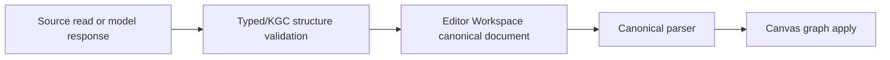

# Agent-Ready Source Contract Companion

## Reference implementation: source owners and non-projection rules

This companion records the detailed ownership constraints behind
[the parent contract](knowgrph-agent-ready-prd-tad.md). It does not own
endpoint invocation.

### Readiness declaration

| Scope | Local rung | Delivered rung | Basis |
|---|---|---|---|
| Source ownership and invariants | `spec-complete` | `undocumented` | VCCs are stated; no recorded Evidence Reference is attached. |

### Canonical owners

| Concern | Canonical source owner | Required invariant |
|---|---|---|
| Shared MCP tool definitions | `canvas/src/features/agent-ready/knowgrphAgentReadyToolContract.mjs` | One typed definition source supports the Pages subset and app registry. |
| Browser WebMCP registration | `canvas/src/features/agent-ready/webMcpRuntime.ts` | Exactly 42 tools: 30 read-only, 12 guarded controls. |
| Browser startup | `canvas/src/main.tsx` | Registration occurs through the canonical runtime owner. |
| Pages HTTP MCP | `cloudflare/pages/knowgrph-agent-ready.mjs` | Exactly 7 read-only tools; no guarded control. |
| Agent-ready resources/prompts | Agent-ready prompt/resource contracts consumed by the adapters | Resource or prompt discovery does not enlarge the tool count. |
| Local stdio MCP | `mcp/server.js`, `mcp/local-tool-contract.js` | Broader, configuration-gated, and fail-closed. |
| Structured response extraction | `canvas/src/features/chat/chatResponseStructuredContent.ts` | Literal structured content is validated before workspace use. |
| Chat validation and submit | Existing `canvas/src/features/chat/` coordinator and validation owners | One submit/validation path. |
| Workspace persistence | Existing Editor Workspace owners | A validated document is the canonical editable artifact. |
| Canvas projection | Existing parser and canvas apply owners | One structured-document-to-graph path. |
| Remote Worker registry | `cloudflare/workers/knowgrph-mcp/tool-registry.mjs` | Separate 10-tool source registry; not part of Pages or app WebMCP. |
| Remote Worker transport | `cloudflare/workers/knowgrph-mcp/index.ts` | Separate delivery, bearer authorization, and preserved MCP session id. |

### Pages capability catalog

The Pages tool registry contains exactly:

1. `search`
2. `fetch`
3. `list_source_files`
4. `read_source_file`
5. `read_shared_document`
6. `inspect_shared_document_structure`
7. `inspect_agent_surface`

All seven are read-only and require zero model calls.

### Browser capability boundary

The app WebMCP registry contains exactly 42 tools. Annotation classification is
part of the contract:

| Class | Count | Boundary |
|---|---:|---|
| Read-only | 30 | Inspection or context retrieval; zero implicit model calls. |
| Guarded control | 12 | Browser-local runtime owner and approval determine availability. |
| Total | 42 | No duplicate name. |

The browser total must not replace the Pages count in discovery metadata,
onboarding, tests, or status narratives.

### Source-to-canvas invariant

Required properties:

- A read result is not silently treated as a control response.
- Invalid structured content stops before workspace mutation.
- Workspace persistence precedes canvas projection.
- Parser and apply failures remain visible and preserve the last valid document.
- No MCP-specific second workspace, parser, grouping alias, or graph store is
  introduced.

### Forbidden projections

The following statements are false unless a later Evidence Reference proves the
specific surface:

- Source files establish public reachability.
- The seven-tool Pages surface exposes browser-local guarded controls.
- The 42-tool browser registry is the local stdio or remote Worker registry.
- The broader local stdio catalog is executable without its configuration.
- The 10-tool Worker source registry establishes a delivered Worker.
- A session id replaces Worker bearer authorization.
- A tool-list result proves an execution harness, approval, or downstream
  credential is available.
- A runtime companion or release note overrides the parent counts and rungs.

### Trust, token, and failure matrix

| Surface | Trust | Token contract | Failure rule |
|---|---|---|---|
| Pages HTTP | Read-only | Discovery and reads cost 0 model tokens. | Unknown or invalid reads return typed errors. |
| App WebMCP read | Browser-local read | 0 model tokens unless a separately guarded owner is invoked. | Missing owner returns unavailable. |
| App WebMCP control | Guarded browser-local action | Owner-declared; never implicit. | Missing approval returns denied with no side effect. |
| Local stdio | Local process/configuration boundary | Tool-owner dependent. | Missing config fails closed. |
| Remote Worker | Bearer-authenticated session boundary | Reads are 0; execution is harness-dependent. | Missing auth/session/approval fails closed. |

The sole endpoint Invocation Register and detailed remote client sequence are in
[the install contract](knowgrph-mcp-install-contract.md).

### Planned VCC register

| ID | End state | Stated check | Constraint | Evidence Reference |
|---|---|---|---|---|
| `VCC-AR-C-01` | Pages exposes the seven exact names above. | Run the focused Pages parity test and surface name/annotation output. | Read-only only. | None recorded |
| `VCC-AR-C-02` | Browser exposes 42 unique tools split 30/12. | Run the focused WebMCP runtime test and surface counts. | No duplicate; no Pages mutation. | None recorded |
| `VCC-AR-C-03` | Valid content uses one workspace/parser/canvas path. | Run the focused structured-content and canvas-apply tests and surface ownership assertions. | No second persistence or parser path. | None recorded |
| `VCC-AR-C-04` | Negative paths cause no unintended mutation or spend. | Run invalid-input, unavailable-owner, and denied-control tests and surface unchanged-state assertions. | Stop on first unexpected side effect. | None recorded |

These checks remain planned hosts. With no named invocation plus recorded result
and lane attached, local readiness is `spec-complete` and delivered readiness is
`undocumented`.

### Companion boundaries

| Document | Role |
|---|---|
| Parent PRD/TAD | Product requirements, five flows, topology, and rungs. |
| This companion | File owners, exact counts, and non-projection rules. |
| Runtime companion | Legacy implementation detail; non-normative for counts and readiness. |
| MCP service PRD/TAD | Cross-surface service architecture. |
| MCP install contract | Authoritative Invocation Register and client auth/session steps. |

No mirror, publication, secret change, or production verification is authorized
by this companion. Rollback is a source revert followed by frontmatter, link,
and count validation.
