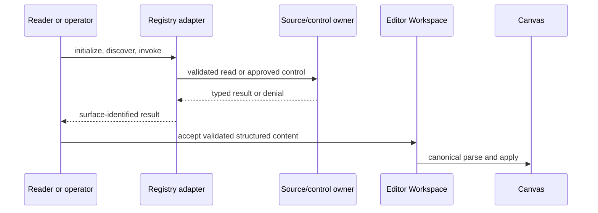
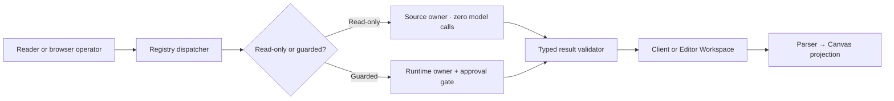
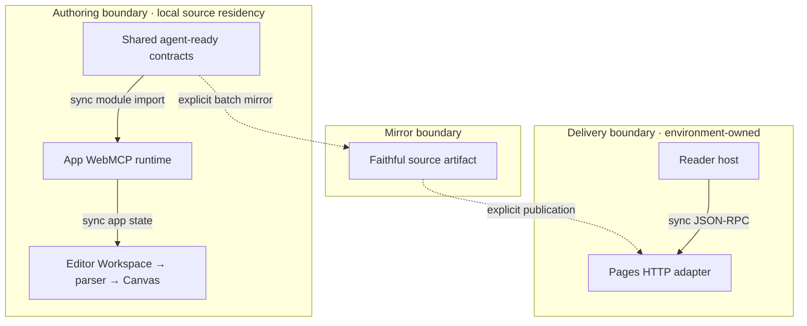

# Agent-Ready Surface Contract

## Reference implementation: repository discovery, retrieval, and canvas context

This combined PRD/TAD defines the source contract for agent discovery and
browser-local context. Source presence does not prove mirror, runtime, or
production delivery.

### Readiness declaration

| Scope | Local rung | Delivered rung | Basis |
|---|---|---|---|
| Agent-ready contract | `spec-complete` | `undocumented` | VCCs are stated; no Evidence Reference with a recorded result is attached. |

The only allowed order is `undocumented` → `spec-complete` → `dev-proven` →
`runtime-ready` → `production-verified`.

### PRD

#### Problem and target outcome

An agent must discover source-backed content, read it without model spend, and
understand which capabilities are read-only versus guarded. A browser operator
must be able to pass validated structured content into the existing editor and
canvas pipeline without implying that browser controls exist on the public
read-only transport.

#### Personas and journey

| Stage | Reader host | Browser operator | Friction addressed |
|---|---|---|---|
| Trigger | Needs repository context. | Needs contextual inspection or an approved action. | Similar transports have different capabilities. |
| Discover | Selects the Pages read surface. | Loads the app WebMCP registry. | Exact counts and trust are made explicit. |
| Engage | Calls one of 7 read-only tools. | Uses one of 30 reads or chooses one of 12 guarded controls. | Invalid or unavailable operations fail closed. |
| Complete | Receives a typed source result. | Receives a typed result or denial. | Partial failure remains visible. |
| Return | Reuses the authoritative install guidance. | Reuses browser-local context and app state. | No duplicate endpoint recipe. |

#### User stories

- **As a** reader host **I want** seven stable read tools **so that** I can
  acquire source context with zero model spend.
- **As a** browser operator **I want** 30 reads separated from 12 guarded
  controls **so that** I can approve side effects intentionally.
- **As a** document author **I want** one validated workspace-to-canvas path
  **so that** MCP input cannot create a parallel graph authority.

#### Requirements

| ID | Requirement | Priority |
|---|---|---|
| `PRD-AR-01` | Pages HTTP discovery exposes exactly 7 read-only source tools. | Must |
| `PRD-AR-02` | App WebMCP exposes exactly 42 tools: 30 read-only and 12 guarded controls. | Must |
| `PRD-AR-03` | Browser-local controls never appear in the Pages read-only contract. | Must |
| `PRD-AR-04` | Source reads and inspection require zero model calls. | Must |
| `PRD-AR-05` | Validated structured content follows one Editor Workspace → parser → Canvas path. | Must |
| `PRD-AR-06` | Missing configuration, invalid input, or absent approval fails closed with a typed outcome. | Must |
| `PRD-AR-07` | Local stdio and the remote Worker remain separate MCP surfaces, not expansions of Pages. | Must |
| `PRD-AR-08` | Additional public controls wait for a separately specified trust, spend, and evidence gate. | Won't in this increment |

#### MoSCoW and ROI

Scores use `(impact × reach) / (build + TCO + token cost)` with normalized
0–10 inputs.

| Tier | Scope | Impact × reach | Cost scores | ROI | Rationale |
|---|---|---:|---:|---:|---|
| Must | `PRD-AR-01` through `PRD-AR-07` | `9 × 8` | `4 + 0 + 0` | `18.0` | Preserves the useful read/canvas path without a new service. |
| Should | None | — | — | — | Evidence gates take priority. |
| Could | None | — | — | — | No extra surface is needed for first value. |
| Won't | `PRD-AR-08` without new trust/spend evidence | `2 × 2` | `8 + 5 + 8` | `0.19` | Public controls would blend trust and increase TCO/token risk. |

#### Acceptance criteria

| Requirement | Given / When / Then | VCC |
|---|---|---|
| `PRD-AR-01` | Given Pages tool discovery, when the registry is read, then the seven exact read-only names are returned. | `VCC-AR-01` |
| `PRD-AR-02` | Given app registration, when tool annotations are classified, then 42 names split 30/12. | `VCC-AR-02` |
| `PRD-AR-03` | Given both registries, when names and annotations are compared, then no guarded browser control is present on Pages. | `VCC-AR-03` |
| `PRD-AR-05` | Given valid structured content, when it is accepted, then one canonical editor/parser/canvas path receives it. | `VCC-AR-04` |
| `PRD-AR-06` | Given invalid input or absent approval, when an operation is requested, then no side effect occurs and a typed denial is surfaced. | `VCC-AR-05` |

#### Success metrics and economics

| Metric | Baseline | Target | Timeline / check |
|---|---|---|---|
| TTV steps / elapsed | Unmeasured | At most 3 actions / 5 minutes. | Clean-client VCC before promotion. |
| Discovery/read model tokens | 0 by source path | 0 per request. | Every registry change. |
| Guarded-control token budget | Owner-dependent | Numeric prompt/completion cap, cache target, max iterations, and circuit breaker before execution. | Owner VCC. |
| Local/browser 12-month incremental TCO | Existing app; actual unmeasured | USD 0 new license/store. | Quarterly review. |
| Pages 12-month incremental TCO | Delivery actual unmeasured | USD 0 until nonzero budget is approved. | Publication gate. |
| Added persistent stores | 0 | 0. | Architecture review. |
| ROI | `18.0` estimate | At least `10.0`. | Recompute on scope/cost change. |

The open-protocol/direct-adapter baseline has USD 0 license cost. A proprietary
gateway requires a later ADR with managed, self-managed, and hybrid TCO.

#### Minimum scope, exclusions, and dependencies

| Kind | Contract |
|---|---|
| Minimum scope | Seven Pages reads, 42 browser tools split 30/12, zero-token reads, and one validated canvas path. |
| Out of scope | Public guarded controls, a unified proxy, a second workspace/parser/store, and a delivery claim. |
| Dependencies | Shared tool contract, Pages/browser adapters, source readers, Editor Workspace, parser, and Canvas owners. |
| Open measurement | Clean-client TTV, p95 discovery latency, and environment-specific delivery TCO; close through VCC evidence. |

### TAD

#### Surface contract

| Surface | Source truth | Local rung | Delivered rung |
|---|---|---|---|
| Pages HTTP MCP | Exactly 7 read-only tools. | `spec-complete` | `undocumented` |
| App WebMCP | Exactly 42 tools: 30 read-only, 12 guarded controls. | `spec-complete` | `undocumented` |
| Local stdio MCP | Broader and configuration-gated. | `spec-complete` | `undocumented` |
| Remote Worker MCP | Separate 10-tool registry, delivery unit, bearer-authenticated session transport. | `spec-complete` | `undocumented` |

The Worker is contextual only; it is not part of the agent-ready Pages surface.
Its endpoint invocation and session steps are owned by
[the install contract](knowgrph-mcp-install-contract.md).

#### Pages tool set

1. `search`
2. `fetch`
3. `list_source_files`
4. `read_source_file`
5. `read_shared_document`
6. `inspect_shared_document_structure`
7. `inspect_agent_surface`

#### Workflow flow

**Trigger:** a reader needs source context or a browser operator selects an
app-local operation.

**Happy path:** discover the intended registry → validate typed arguments →
invoke its owner → return a typed result → optionally project validated
structured content through the canonical canvas path.

**Alternate path:** when a browser-only tool is requested through Pages, return
the Pages capability boundary rather than proxying it.

**Error path:** invalid identifier, unavailable source, missing runtime owner, or
denied control returns a typed error and no side effect.

**Postcondition:** the result identifies its surface; source state is unchanged
for all read operations.

#### Data flow

| Stage | Component | Input | Output | Persistence | Error handling |
|---|---|---|---|---|---|
| Discover | Shared tool contract | Registry request | Typed descriptors | None | Protocol error |
| Read | Source/shared-document owner | Allowlisted identifier | Text or structured content | Source-owned | Typed missing/denied result |
| Validate | Structured-content validators | KGC Markdown or MCP structured content | Validated document | None | Reject invalid structure |
| Store | Editor Workspace owner | Validated document | Workspace document | App/source-store owned | Preserve prior document on failure |
| Consume | Parser and Canvas owner | Workspace document | Graph projection | App-local | Surface parse/apply error |

This data flow traces to Engage and Complete in the journey.

#### Journey → system mapping

| Journey stage | Workflow | Data flow | Harness | Topology | Component |
|---|---|---|---|---|---|
| Trigger | Select read or browser need | User intent | None | Client/app | Install guidance |
| Discover | Initialize/list | Registry descriptors | Dispatcher, zero model calls | Shared contract + adapter | Registry |
| Engage | Invoke | Source/control request | Read owner or approval gate | Adapter + owner | Tool owner |
| Complete | Receive/project | Typed result → optional validated document | Observer/validator | Client + workspace | Validator/workspace |
| Return | Reuse context | Workspace/canvas state | Circuit breaker on denial/failure/budget | App state | Canvas owner |

#### Orchestration/harness flow

The MCP layer contains no agentic loop. A guarded owner that invokes a model
must emit spend data and enforce its own finite iteration bound; denial,
exhausted budget, or typed owner failure is the circuit breaker.

#### Topology v1.28.0

| Node | Role | Type | Lane | Connection | Data residency |
|---|---|---|---|---|---|
| Shared contracts | Catalog producer | Repository module | Authoring | Synchronous import | Authoring filesystem |
| App WebMCP runtime | Browser gateway | App module | Authoring/runtime target | In-process calls | Browser app state |
| Editor/parser/canvas | Consumer/projector | App modules | Authoring/runtime target | In-process state flow | Browser/workspace owners |
| Mirror artifact | Faithful copy | Repository artifact | Mirror | Explicit batch copy | Mirror repository |
| Pages adapter | Read gateway | Edge function | Delivery | Synchronous HTTP JSON-RPC | Delivery environment; no MCP-owned store |
| Reader host | Consumer | MCP client | Delivery | Synchronous HTTP JSON-RPC | Client-owned |

Dashed edges require an explicit operator action. No storage location or
delivery state is inferred from this authoring document.

#### Source ownership

| Concern | SVO responsibility | Interface/configuration | Local rung | Delivered rung |
|---|---|---|---|---|
| Shared definitions | Contract defines names, schemas, and annotations. | Module import; `knowgrphAgentReadyToolContract.mjs` | `spec-complete` | `undocumented` |
| Browser registration | Runtime registers 42 browser tools. | WebMCP; `webMcpRuntime.ts` and app startup | `spec-complete` | `undocumented` |
| Pages adapter | Adapter serves seven reads. | HTTP JSON-RPC; `knowgrph-agent-ready.mjs` | `spec-complete` | `undocumented` |
| Structured validation | Validator accepts or rejects structured response content. | Typed/KGC document; chat validation owners | `spec-complete` | `undocumented` |
| Editor/canvas bridge | Bridge persists then projects the canonical document. | Workspace/parser/canvas interfaces | `spec-complete` | `undocumented` |

File-level invariants and forbidden projections are in
[the companion](knowgrph-agent-ready-prd-tad.companion.md). The legacy runtime
companion is implementation detail and cannot override the counts or readiness
declared here.

#### Decision, quality, and reach

The discovery-first versus unified-proxy decision is owned by `MCP-ADR-01` in
[the MCP service contract](knowgrph-mcp/knowgrph-mcp-service-prd-tad.md); this
document does not redeclare it.

| Attribute | Target | Planned validation |
|---|---|---|
| Security | Invalid or unapproved work produces no side effect. | Negative-path VCC. |
| Performance | Discovery is at most 1 second p95 on the selected runtime target. | Bounded runtime measurement. |
| Browser reach | App registry is 42 tools; Pages is 7 reads. | Separate registry checks. |
| Mobile reach | HTTP reads require an MCP-capable mobile client; browser controls require capability support. | Supported-client clean run. |
| Offline behavior | Existing local/app state may work; HTTP reports unavailable and never silently falls back. | Network-off negative check. |
| Token/TCO | Reads use 0 model tokens; no new store/license. | Cost spy and quarterly review. |

#### Requirement traceability

| PRD requirements | TAD interfaces | VCCs |
|---|---|---|
| `PRD-AR-01`, `03`, `04` | Pages adapter and read catalog | `VCC-AR-01`, `VCC-AR-03` |
| `PRD-AR-02`, `06` | Browser registry and approval gates | `VCC-AR-02`, `VCC-AR-05` |
| `PRD-AR-05` | Validator → Editor Workspace → parser → Canvas | `VCC-AR-04` |
| `PRD-AR-07` | Federation boundary and install reference | `VCC-AR-03` |

#### VCC register

| ID | End state | Stated check | Constraint | Evidence Reference |
|---|---|---|---|---|
| `VCC-AR-01` | Pages exposes exactly the seven names above, all read-only. | Run the focused Pages parity test and surface count, names, and annotations. | No guarded control; one run. | None recorded |
| `VCC-AR-02` | App WebMCP exposes 42 unique names split 30/12. | Run the focused WebMCP runtime test and surface classification counts. | No duplicate name; one run. | None recorded |
| `VCC-AR-03` | Pages is a strict read-only subset boundary. | Compare the two surfaced registries. | Do not change tool implementations. | None recorded |
| `VCC-AR-04` | Valid structured content reaches the canonical Canvas path. | Run the focused structured-response/canvas bridge test and surface the asserted owner path. | No second parser or persistence path. | None recorded |
| `VCC-AR-05` | Invalid or unapproved operations cause no side effect. | Run focused negative-path tests and surface denial plus unchanged-state assertions. | Stop on first unexpected mutation. | None recorded |

Named checks above are planned VCC hosts, not evidence. Local readiness remains
`spec-complete`. Delivered readiness remains `undocumented`.

#### Readiness gap and boundary

| Workstream | Local rung | Delivered rung | Gap |
|---|---|---|---|
| Pages registry | `spec-complete` | `undocumented` | No attached Evidence Reference. |
| Browser registry | `spec-complete` | `undocumented` | No attached Evidence Reference. |
| Structured-content canvas path | `spec-complete` | `undocumented` | No attached Evidence Reference. |

Authoring → mirror and mirror → delivery boundaries are closed. Operator
instruction: none. Rollback is a source revert; any later delivery rollback must
restore the previously recorded delivery revision.
