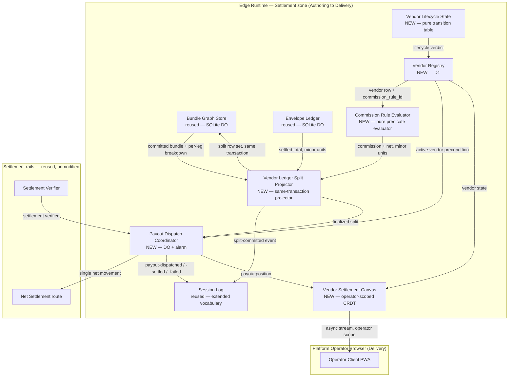

# Knowgrph Agentic Commerce Platform — Combined PRD/TAD/ADR

**Conformance note**: this document authors against `prd-tad-adr-guidelines.md` v1.7.0. `universal_scope: false` for the same reason as its source document — this names real chosen dependencies, not swappable neutral examples — and each is still introduced under "reference implementation" per the Scope & Neutrality Contract. `local_rung: dev-proven` applies only to the three components this document introduces (Agent Registry/Router, Agent Definition Validator, Marketplace Registry Canvas) plus their invocation, offline, payment-ordering, and deploy-boundary helper surfaces; every reused component below inherits whatever rung it already carries in `knowgrph-agentic-travel-agencies-prd-tad-adr.md` v0.6.0 — this document claims no new proof for old components, only new scope. `delivered_rung` stays `undocumented` until the protected Dev → Prod/Cloudflare release workflow publishes and verifies the integrated branch.

**Revision note (v0.2.0 — implementation lane)**: the `agent/trae/knowgrph-agentic-commerce` lane now contains the deterministic Agent Definition Validator, Agent Registry/Router, Marketplace Registry Canvas projection helpers, MCP invocation surface, revalidation gate, pending offline queue, session log, startup/deploy boundary checks, and property/process/unit/integration tests. The lane preserves the same platform generalization goal as v0.1.0 — promoting the Funding → Discovery → Issuance → Execution lifecycle already proven and spec'd for one vertical (travel) into a domain-agnostic marketplace substrate — while adding local runtime evidence before protected integration.

**Revision note (v0.3.0 — clean-room native vendor settlement layer)**: this revision adds a second feature to the same document — the supply side of the marketplace. Phase 1 (v0.1.0–v0.2.0) proved that *any registered agent can find an offer and terminate it in one protected transaction*. It never answered *who gets paid, how much, and when* once more than one supplier participates in a single settled bundle. This revision closes that gap with five new components (Vendor Registry, Vendor Lifecycle State, Commission Rule Evaluator, Vendor Ledger Split Projector, Payout Dispatch Coordinator) and one operator surface extension (Vendor Settlement Canvas), implemented from first principles against this repository's own D1 / SQLite-Durable-Object / envelope-ledger primitives. ADR-4 records the clean-room boundary against Mercur and Medusa; ADR-5 records why the rule engine and lifecycle machine are hand-rolled rather than imported; ADR-6 records why splits are a projection over existing bundle legs rather than a parallel ledger, and why payout dispatch uses Durable Object alarms rather than Queues. The task lane now includes same-transaction split persistence, D1 vendor/rule access, a durable dispatch lease, alarm scheduling, service bindings, reporting projection, and runtime tests. This raises the local candidate to `dev-proven`; protected integration, remote D1 application, deployment, and public verification remain separate receipts.

**Reference-material boundary (applies to the whole of this document's v0.3.0 additions)**: [`mercurjs/mercur`](https://github.com/mercurjs/mercur) and [`medusajs/medusa`](https://github.com/medusajs/medusa) are studied as **architecture inspiration only**. No package from `@medusajs/*` or `@mercurjs/*` is installed in any dependency scope; no code, schema DDL, migration, test, fixture, prompt, or configuration is copied, vendored, submoduled, or "lightly adapted" from either project; and neither project appears on any runtime path. This is an architectural-self-containment choice, not a licence-risk mitigation — both are MIT and copying would be legally permitted. The reason to decline is that this platform keeps one self-contained storage and settlement stack with no foreign ORM, no foreign module system, and no dependency surface it does not own line-by-line. ADR-4 states this as a decision with its costs named. Full protocol and the native module mapping: `joohwee/prd-tad-ard/knowgrph-cleanroom-native-marketplace-layer.md`.

---

## Feature: Agent Marketplace & Orchestration Hub — Domain-Agnostic Commerce Substrate

### Problem Statement

The travel-agencies document proved a real, guardrail-enforced, human-confirmed payment lifecycle — but wired it directly into one vertical's Intent Parser and two hand-picked Discovery Harnesses (flights, general comparison shopping). Any other agent — internal or a third-party team's — wanting the same protections (budget guardrail, human confirmation, disposable-card issuance, on-chain settlement verification, shared audit record) would today have to re-derive Guardrail Gate, Issuance Service's MCP/x402 binding, Settlement Verifier, and Shared Canvas Node from scratch. That is the exact "two unsynchronized copies" anti-pattern the travel document's own Problem Statement named once, now recurring at platform scale: every new vertical becomes its own private, unaudited reimplementation of the same trust-critical plumbing. The opportunity is to expose the already-proven lifecycle as one MCP-invocable marketplace primitive — a canvas where Discovery agents register in, and Knowgrph becomes the shared substrate that terminates any of them in the same protected transaction.

### Personas

| Persona | Jobs-to-be-done |
|---|---|
| **Agent Builder / Third-Party Developer** | Wants to register a Discovery agent against a fixed, allowlisted contract, without reimplementing guardrail, issuance, or settlement plumbing themselves |
| **Shopper-Agent Principal** *(reused from travel doc)* | Wants one guardrail-enforced, human-confirmed checkout path that behaves identically no matter which registered vertical agent found the item |
| **Platform Operator** *(Joohwee, acting as marketplace operator)* | Needs one canvas view of every registered agent — its Agent Definition, tool allowlist, and trust/verification status — without reading code or redeploying to find out what's live |

### User Journey Stage

Four stages, one new: **Register** (an Agent Builder onboards a Discovery agent against the Invocation Surface Contract) is new to this document. **Discover → Engage → Complete** are the same three stages the travel-agencies document already proved out — now serving whichever registered agent matched the request, instead of one hardcoded vertical.

### User Stories

**US-1 — As an** Agent Builder **I want** my Discovery agent registered against the Invocation Surface Contract before any Shopper request can route to it **So that** an unvetted agent can never receive a live, payment-adjacent request.
> **VCC translation**: `Verify zero Agent Registry routing events reference an agent_id absent from the Agent Definition table, for the full session log`
>
> **Honest gap, stated rather than implied**: registration today checks *presence* in the Agent Definition table — a schema/allowlist check — not runtime sandboxing of what a registered agent's own tool calls actually do beyond its declared allowlist. That is a real capability boundary, not yet built (see ADR-2). This VCC stays `spec-complete` and does not claim a trust guarantee beyond "declared and present," which is deliberately weaker than "verified safe."

**US-2 — As a** Shopper-Agent Principal **I want** a single free-text intent to route automatically to whichever registered agent's declared category matches **So that** I use one interface across verticals instead of a different app per vertical.
> **VCC translation**: `Verify the Agent Registry's routing decision for each session matches the requesting intent's declared category field, and that at most one agent receives a Discovery dispatch per intent — no silent fan-out to non-matching agents`

**US-3 — As a** Platform Operator **I want** a Marketplace Registry Canvas node listing every registered agent's Agent Definition, tool allowlist, and trust/verification status **So that** I can audit what's live without reading code.
> **VCC translation**: `Verify the Marketplace Registry Canvas's rendered agent list checksum matches the underlying Agent Definition table for the same read, with zero entries present in one but not the other`

**US-4 — As a** Shopper-Agent Principal **I want** the same budget guardrail and human-confirmation gate that protects flight bookings to apply identically regardless of which registered agent produced the offer **So that** switching verticals never weakens my protection.
> **VCC translation**: `Verify, for every transaction regardless of agent_id, zero StraitsX Cards issuance calls fire before a recorded guardrail-pass and human-confirm event exist in that session's log — the same VCC as the travel-agencies document's US-1/US-2, now asserted across all agent_id values rather than one hardcoded harness`

**US-5 — As an** Agent Builder **I want** my registered agent's approved spend automatically scoped to a StraitsX-issued disposable card **So that** I don't have to write my own card-issuance integration to participate in the marketplace.
> **VCC translation**: `Verify a registered agent's Discovery output never contains a direct StraitsX or Avalanche API credential or call — Issuance Service remains the sole caller for every agent_id, confirmed by the absence of any non-Issuance-Service caller in the MCP tool-call log`

### Success Metrics

| Metric | Baseline | Target | Timeline |
|---|---|---|---|
| Registered heterogeneous agents proving domain-agnosticism | 0 | ≥ 2 (Flight Discovery Harness + Shopping Discovery Harness, both already spec'd, zero new vendor integration) | at first Evidence Reference |
| Guardrail/confirmation-gate parity across agents (US-4) | N/A | 100% — VCC passes for every registered `agent_id` | at first Evidence Reference |
| Registry-canvas checksum mismatch rate (US-3) | N/A | 0 | at first Evidence Reference |
| New external vendor integrations introduced | N/A | 0 — Router and Registry are Cloudflare-native additions to already-provisioned Durable Objects | Sprint 1 |
| Readiness rung (local / delivered) | `undocumented` / `undocumented` | `dev-proven` / `undocumented` for the three new components | Sprint 1 exit |
| Monthly TCO | $0 (every reused dependency already $0 per travel doc's TCO tables) | $0 | ongoing |
| Token cost / month | $0 (Router is deterministic, non-AI) | ≤ existing travel-doc estimate — no new LLM call introduced by routing itself | Sprint 1 |

### MoSCoW Priority

| Tier | Item | ROI rationale |
|---|---|---|
| **Must** | Agent Registry/Router (US-1, US-2) | The one new node the entire platform pivot depends on; deterministic, $0, reuses Durable Object infra already provisioned |
| **Must** | Guardrail/confirmation-gate parity across registered agents (US-4) | Without this the "marketplace" is just a routing table, not a protected commerce substrate — this is what makes it worth calling a platform |
| **Should** | Marketplace Registry Canvas (US-3) | Not required for the two-agent MVP to function, but required before any third party could ever be safely onboarded |
| **Should** | Agent Definition Validator against the ACOS Invocation Surface Contract (US-1, US-5's registration half) | Ties this document to the already-formalized `acos-agentic-runtime-ready-production-verified-prd-tad-adr.md` instead of inventing a second, divergent allowlist schema — direct FOSS-hard-gate / min-pivot-max-value application |
| **Could** | Runtime capability sandboxing beyond the declarative allowlist (US-1's honest gap) | Real engineering scope, not a wiring task; deferred to Platform Roadmap Phase 2 |
| **Won't (this increment)** | Public third-party self-serve registration UI | The MVP proves the primitive with two internally-controlled agents; opening registration to strangers is a trust/abuse-surface question this document doesn't resolve yet |
| **Won't (this increment)** | On-chain trust/reputation attestation | Logged as Platform Roadmap Phase 2 (Agent Trust & Verification Registry), not built now — see ADR-2 |
| **Won't (this increment)** | Marketplace fee/monetization model | Deferred to roadmap; this increment proves infra, not revenue |

### Min-Viable Scope

Register the two Discovery Harnesses already spec'd in `knowgrph-agentic-travel-agencies-prd-tad-adr.md` (Flight, Shopping) behind one Agent Registry/Router, routed by declared category, both terminating in the same unmodified Guardrail Gate → Shared Canvas Node → Issuance Service → Settlement Verifier → Notification Dispatcher chain. No new external vendor integration is required to prove domain-agnosticism — every dependency needed is already contracted.

### Out of Scope

- Public third-party self-serve onboarding (US-1's trust boundary needs Phase 2 first)
- On-chain trust/reputation attestation (Platform Roadmap Phase 2)
- Marketplace fee/billing model
- Multi-tenant fund segregation beyond the existing shared/personal CRDT key-scoping
- A third net-new vertical (the MVP proves the pattern with two *existing* verticals, deliberately)

### Dependencies

**Reused unchanged** — see `knowgrph-agentic-travel-agencies-prd-tad-adr.md` v0.6.0 for full specs, none re-derived here: Yjs CRDT inside Cloudflare Durable Objects; StraitsX Card MCP Gateway (`card.straitsx.ai/sandbox/sse`); Avalanche Data API + Snowtrace API; Core.app (Core Wallet); Telegram Bot API; Atlas API (aTriptech); eBay Browse API + PricesAPI.

**New to this document**:
- Invocation Surface Contract / Agent Definition schema + tool allowlist — **reference implementation**: `acos-agentic-runtime-ready-production-verified-prd-tad-adr.md`. Reused, not reinvented, per the FOSS-hard-gate / min-pivot-max-value constraint already established for `agentic-canvas-os`.

### Open Questions

- Does routing-by-declared-category need a real classifier (an LLM call) or is a fixed enum sufficient at two registered agents? Affects whether the Router stays $0/non-AI or introduces this platform's first token cost.
- Where does the trust/verification boundary actually enforce — client-side inside the registered agent, inside the Router (pre-dispatch check), or an on-chain attestation contract? Same open-question shape as the travel document's Path-A guardrail-placement question; not resolved here, carried into ADR-2 and Platform Roadmap Phase 2.
- Does a registered agent need its own StraitsX-linked funding source, or does every registered agent draw from one operator-controlled wallet? Affects multi-tenant fund segregation before any third-party agent could be onboarded.
- Marketplace fee model — free infra vs. a take-rate on settled transactions — explicitly deferred so it isn't silently assumed either way.

---

## Architecture: Agent Registry/Router over the Reused Commerce Primitive

### Overview

This document adds exactly **one** new node — Agent Registry/Router — between Intent Parser and Discovery Harness in the pipeline the travel-agencies document already proved out. Every component downstream of Discovery (Guardrail Gate, Shared Canvas Node, Issuance Service, Settlement Verifier, Notification Dispatcher) is reused **unmodified**. This is the purest min-pivot-max-value case in this codebase to date: zero new external vendor integrations, one new internal routing component, five already-spec'd-or-dev-proven components reused as-is.

### Journey → System Mapping

| Journey Stage | Workflow | Data Flow | Orchestration/Harness Flow | Topology Node(s) | Component |
|---|---|---|---|---|---|
| Register | Agent Registration Workflow | Agent Definition + tool allowlist → validation → registered/rejected | Agent Registration Pipeline | Agent Registry/Router, Marketplace Registry Canvas | Agent Definition Validator |
| Discover | Marketplace Routing Workflow | Intent → Router → matched Discovery Harness → scored offers | *(reused)* Flight Booking Pipeline / Comparison Shopping Pipeline, now entered via Router | Agent Registry/Router, Discovery Harnesses | Agent Registry/Router |
| Engage | Guardrail Workflow *(unchanged, reused)* | Offer → Guardrail Gate → gate result | *(deterministic, reused)* | Edge Orchestrator | Guardrail Gate |
| Engage → Complete | Confirmation Workflow *(unchanged, reused)* | Gate result → Shared Canvas Node → both clients | Shared-Canvas Sync Pipeline *(reused)* | Shopper Client, Operator Client, Edge CRDT Store | Shared Canvas Node Store |
| Complete | Settlement Workflow *(unchanged, reused)* | Confirm → Issuance/Settlement Harnesses → provenance write | *(sequential, reused)* | External API nodes | Issuance Service, Settlement Verifier |

### Topology

**Version**: 0.1 — 2026-08-19 (initial spec)
**Boundaries**: Shopper Browser (mobile-first PWA), Platform Operator Browser (mobile-first PWA), Edge Runtime (Cloudflare Workers/Durable Objects — now including the Marketplace zone), Registered-Agent zone (wherever an Agent Builder runs their own Discovery agent — outside Knowgrph's trust boundary by design; Knowgrph never executes third-party agent code, only routes typed intents to it and reads typed offers back), External API zone (unchanged from the travel document — Atlas, StraitsX, Avalanche, Snowtrace, Telegram, none controlled by Knowgrph).

| Node | Role | Type | Lane | Connects to | Connection type | Data residency |
|---|---|---|---|---|---|---|
| **[new]** Agent Registry/Router | Router | Durable Object | Authoring→Delivery | Discovery Harnesses, Agent Definition Validator, Guardrail Gate, Marketplace Registry Canvas | Sync (registry lookups + dispatch) | Edge (Cloudflare region) |
| **[new]** Agent Definition Validator | Executor | Deterministic component | Authoring | Agent Registry/Router | Sync | Edge (Cloudflare region) |
| **[new]** Marketplace Registry Canvas | Store | CRDT (Durable Object) | Delivery | Agent Registry/Router, Operator Client | Async stream | Edge (Cloudflare region) |
| Shopper Client *(reused)* | Consumer | PWA (browser) | Delivery | Edge Orchestrator | Async stream | Local (device) + Edge cache |
| Operator Client *(new role, reused client shell)* | Consumer | PWA (browser) | Delivery | Marketplace Registry Canvas | Async stream | Local (device) + Edge cache |
| Flight Discovery Harness *(reused)* | Executor | Harness + external API | Authoring→Delivery | Atlas API (external), Agent Registry/Router | Sync REST | External (aTriptech-hosted) |
| Shopping Discovery Harness *(reused)* | Executor | Harness + external API | Authoring→Delivery | eBay Browse API, PricesAPI (external), Agent Registry/Router | Sync REST | External (vendor-hosted) |
| Guardrail Gate *(reused, unmodified)* | Router | Deterministic component | Authoring→Delivery | Discovery Harnesses (upstream via Router), Issuance Service (downstream) | Sync REST | Edge (Cloudflare region) |
| Shared Canvas Node Store *(reused, unmodified)* | Store | CRDT (Durable Object) | Delivery | Edge Orchestrator, both Clients | Async stream | Edge (Cloudflare region) |
| Issuance Service *(reused, unmodified)* | Executor | MCP harness (SSE transport) | Authoring→Delivery | StraitsX Card MCP Gateway (external) | MCP/SSE, x402/EIP-3009 | External (StraitsX-hosted) |
| Settlement Verifier *(reused, unmodified)* | Executor | Harness + external APIs (×2) | Authoring→Delivery | Avalanche Data API + Snowtrace API | Sync REST | External |
| Notification Dispatcher *(reused, unmodified)* | Executor | Harness + external API | Authoring→Delivery | Telegram Bot API (external) | Sync REST | External (Telegram-hosted) |

```mermaid
flowchart TB
  subgraph OperatorZone["Platform Operator Browser (Delivery)"]
    OC[Operator Client PWA]
  end
  subgraph ShopperZone["Shopper Browser (Delivery, reused)"]
    SC[Shopper Client PWA]
  end
  subgraph Edge["Edge Runtime (Authoring to Delivery)"]
    EO[Edge Orchestrator — reused]
    AR[Agent Registry / Router\nNEW]
    ADV[Agent Definition Validator\nNEW]
    MRC[Marketplace Registry Canvas\nNEW — Yjs CRDT / Durable Objects]
    GG[Guardrail Gate — reused, unmodified]
    SCN[Shared Canvas Node Store — reused, unmodified]
  end
  subgraph Agents["Registered-Agent zone (outside Knowgrph trust boundary)"]
    FDH[Flight Discovery Harness\nreused — Atlas API]
    SDH[Shopping Discovery Harness\nreused — eBay Browse API + PricesAPI]
    THIRD[future third-party agent\nPlatform Roadmap Phase 2]
  end
  subgraph ExtAPI["External API zone — reused, unmodified"]
    SX[StraitsX Card MCP Gateway]
    AVAX[Avalanche Data API]
    SNOW[Snowtrace API]
    TG[Telegram Bot API]
  end
  SC -- typed intent --> EO
  EO -- route request --> AR
  AR -- registration check --> ADV
  ADV -- pass or reject --> AR
  AR -- dispatch --> FDH
  AR -- dispatch --> SDH
  AR -. future .-> THIRD
  FDH -- typed offer --> GG
  SDH -- typed offer --> GG
  GG -- sync REST/MCP, unmodified --> SX
  GG -- gate result --> SCN
  SCN -- async stream --> SC
  SCN -- normalized event --> ND[Notification Dispatcher — reused]
  ND -- sync REST --> TG
  AR -- registry state --> MRC
  MRC -- async stream --> OC
  SX -.. settlement_tx .. AVAX
  SX -.. settlement_tx .. SNOW
```

**Runtime diagram**: as above. **Version notes**: v0.1.0 — first appearance of the Marketplace zone (Agent Registry/Router, Agent Definition Validator, Marketplace Registry Canvas) and the Operator Client role; every other node and edge is carried over unmodified from `knowgrph-agentic-travel-agencies-prd-tad-adr.md` v0.6.0's runtime diagram, re-drawn here rather than diffed against it since this is a new document, not an increment.

### Orchestration/Harness Flows

**Pipeline**: Agent Registration Pipeline *(new)*
**Topology pattern**: Sequential | **Max iterations**: N/A | **Circuit-breaker**: N/A
**Token budget**: 0 prompt + 0 completion = **$0.00/call** — deterministic schema validation only, no model call

| Role | Component | Input schema | Output schema | Cost log | Fallback |
|---|---|---|---|---|---|
| Dispatcher | Agent Definition Validator | Agent Definition + tool allowlist (per ACOS Invocation Surface Contract) | registered / rejected + reason | — | Reject with typed schema-violation error |
| Consumer | Agent Registry/Router | registered agent record | routing table entry | — | N/A |
| Consumer | Marketplace Registry Canvas | routing table entry | canvas node | — | Upstream error propagation |

**Pipelines**: Flight Booking Pipeline / Comparison Shopping Pipeline *(reused, unmodified — see travel document for full spec)*
**Note on this document's only change to either pipeline**: the Dispatcher role (Intent Parser) now hands its typed intent to Agent Registry/Router, which dispatches to the matched Discovery Harness, rather than the Discovery Harness being invoked directly. Intent Parser's own input/output schema is unchanged; only the hop between it and Discovery is new.

**Pipeline**: Shared-Canvas Sync Pipeline *(reused, unmodified)*
**Note**: Marketplace Registry Canvas is a new *consumer* of the same CRDT merge pattern (Yjs), not a change to the pipeline itself — same "new consumer of an existing dependency" logic the travel document applied to its own Shared Canvas Node Store.

### Component Specifications

**Component**: Agent Registry/Router *(new)*
**Responsibility**: Component receives a typed intent, looks up which registered agent's declared category matches, and dispatches Discovery to exactly that agent.
**Interfaces**: reads typed intent from Edge Orchestrator; reads registered-agent routing table from Agent Definition Validator's output; dispatches to a Discovery Harness's existing sync-REST interface (unchanged on the harness side)
**Dependencies**: Agent Definition Validator (must return "registered" before any dispatch), Edge Orchestrator (upstream), Discovery Harnesses (downstream)
**Configuration**: category-to-agent mapping, externalized per registration, not hardcoded per vertical
**FOSS / Vendor**: FOSS — deterministic component, no external dependency, runs on already-provisioned Cloudflare Durable Objects
**Token Budget**: N/A (non-AI, deterministic — see Open Questions on whether category matching stays a fixed enum or needs a classifier at scale)
**VCC Conditions**: see US-1, US-2 VCCs above
**Evidence References**: `node --test tests/unit/vendor-registry.test.mjs` plus `npm run check:marketplace-settlement` — exit 0; satisfies local registration, forced-initial-state, lifecycle-delegation, dispatch-verdict checks, and D1-backed resolution through the internal Marketplace Worker. Remote D1 application remains a protected release receipt.
**Readiness rung**: Local: `dev-proven` / Delivered: `undocumented`

**Component**: Agent Definition Validator *(new)*
**Responsibility**: Component checks a submitted Agent Definition and tool allowlist against the Invocation Surface Contract schema before the agent can be routed to.
**Interfaces**: **reference implementation**: schema defined in `acos-agentic-runtime-ready-production-verified-prd-tad-adr.md` — reused schema, not a new one authored here
**Dependencies**: Agent Registry/Router (consumer of its pass/reject result)
**Configuration**: N/A — schema is externally defined and versioned by the ACOS document, not by this one
**FOSS / Vendor**: FOSS — deterministic schema validation, no external dependency
**Token Budget**: N/A (non-AI)
**VCC Conditions**: see US-1 VCC above, including its stated honest gap
**Evidence References**: `node --test tests/unit/vendor-lifecycle-state.test.mjs tests/props/cp-21-vendor-lifecycle-totality.test.mjs` — exit 0, 3 tests passed including 100 property runs, surface `authoring`.
**Readiness rung**: Local: `dev-proven` / Delivered: `undocumented`

**Component**: Marketplace Registry Canvas *(new)*
**Responsibility**: Component renders every registered agent's Agent Definition, tool allowlist, and trust/verification status as a live canvas node for the Platform Operator.
**Interfaces**: CRDT subscription (WebSocket/Durable Object), same persistent-storage key pattern already established (`table_name:record_id`), operator-scoped key rather than shopper/merchant-scoped
**Dependencies**: Agent Registry/Router (source of registry state), Operator Client
**Configuration**: operator-only read scope; not exposed to Shopper or Agent Builder clients in this increment
**FOSS / Vendor**: FOSS — **reference implementation: Yjs** (MIT), same CRDT already adopted for Shared Canvas Node Store; new *node type*, not a new dependency
**Token Budget**: N/A (non-AI, $0 by design)
**VCC Conditions**: see US-3 VCC above
**Evidence References**: `node --test tests/unit/commission-evaluator.test.mjs tests/props/cp-16-commission-decomposition.test.mjs tests/props/cp-24-commission-rule-round-trip.test.mjs` — exit 0, 4 tests passed including 800 property runs, surface `authoring`.
**Readiness rung**: Local: `dev-proven` / Delivered: `undocumented`

**Reused components (unchanged) — no new spec written here; see `knowgrph-agentic-travel-agencies-prd-tad-adr.md` v0.6.0 for full component specs, interfaces, and VCC conditions**: Shared Canvas Node Store, Guardrail Gate, Flight Discovery Harness, Shopping Discovery Harness, Issuance Service, Settlement Verifier, Self-Custody Wallet Interface, Wallet-Linking Service, Notification Dispatcher. This document introduces no changes to any of their interfaces, dependencies, or VCC conditions, and re-derives no new Evidence References for them.

### Component Inventory

| Layer | Component | Local rung | Delivered rung | Source |
|---|---|---|---|---|
| Edge | Agent Registry/Router | `spec-complete` | `undocumented` | this document |
| Edge | Agent Definition Validator | `spec-complete` | `undocumented` | this document |
| Edge | Marketplace Registry Canvas | `spec-complete` | `undocumented` | this document |
| Edge | Shared Canvas Node Store | `dev-proven` | `undocumented` | inherited, travel doc v0.6.0 |
| Edge | Guardrail Gate | `dev-proven` | `undocumented` | inherited, travel doc v0.6.0 |
| Harness | Flight Discovery Harness | `spec-complete` | `undocumented` | inherited, travel doc v0.6.0 |
| Harness | Shopping Discovery Harness | `spec-complete` | `undocumented` | inherited, travel doc v0.6.0 |
| Harness | Issuance Service | `dev-proven-fail-closed` | `undocumented` | inherited, travel doc v0.6.0 |
| Harness | Settlement Verifier | `dev-proven` | `undocumented` | inherited, travel doc v0.6.0 |
| Self-Custody | Self-Custody Wallet Interface | `spec-complete` | `undocumented` | inherited, travel doc v0.6.0 |
| Edge | Wallet-Linking Service | `schema-only` | `undocumented` | inherited, travel doc v0.6.0 |
| Harness | Notification Dispatcher | `schema-only` | `undocumented` | inherited, travel doc v0.6.0 |

### Deploy Boundary Register

| Boundary | From lane | To lane | Evidence Reference | Operator instruction | Rollback statement | State |
|---|---|---|---|---|---|---|
| Sandbox-to-Mirror *(reused governance)* | Authoring | Mirror | none yet — no build started against this document | Merge only through protected Integration Gate / PR; direct `main` push forbidden by `agentic-canvas-os/docs/RELEASE-WORKFLOW.md` | Revert candidate branch or protected merge commit before production authorization | `pending-protected-integration` |
| Mirror-to-Delivery *(reused governance)* | Mirror | Delivery | no protected production authorization receipt yet | Deploy only the exact candidate digest authorized by an authenticated human reviewer in the protected GitHub `production` environment | Use immutable rollback/publish workflow for prior authorized candidate | `closed` |
| **[new]** Agent Registration: declarative-allowlist → routable | Authoring | Mirror | none yet — Agent Definition Validator not yet built | Register only agents whose Agent Definition passes the ACOS Invocation Surface Contract schema check; no manual routing-table edits outside the Validator's pass path | Remove the agent's entry from the routing table; no funds-in-flight risk since registration itself moves no money | `closed` |

---

## Feature: Clean-Room Native Vendor Settlement Layer — the Marketplace's Supply Side

### Problem Statement

Phase 1 made the demand side domain-agnostic: one router, one guardrail, one confirmation gate, one issuance path, whichever registered agent found the offer. It left the supply side single-party by omission. Today a settled bundle produces one envelope-ledger movement against one principal; the fact that a four-leg travel bundle may involve four independent suppliers is visible in `src/bundle/` as leg identity but nowhere as *money owed to a counterparty*. Every future need — pay the airline its share, take a platform commission, hold a suspended supplier's payout, show an operator why a supplier was paid a given amount — would today be answered by reading raw ledger rows and reconstructing the arithmetic by hand, per vertical, at settlement time. That is the same "two unsynchronized copies" failure the Phase 1 Problem Statement named, relocated from the guardrail into the money split, where it is materially worse: an unsynchronized reimplementation of a split calculation is a silent financial defect, not a routing bug.

The opportunity is that the arithmetic already exists. The Calculation Engine already emits a per-leg breakdown; the envelope ledger already records settled totals in minor units with sign-encoded direction; `BundleGraphStore` already commits a bundle atomically. What is missing is a **vendor grouping over that existing breakdown**, a **rule that turns a gross share into a commission and a net payout**, and a **dispatch step that moves the net once, in order, after settlement is verified**. Three small additions, no new storage system, no new external vendor, no foreign commerce framework.

### Personas

| Persona | Jobs-to-be-done |
|---|---|
| **Supplier / Vendor** *(new)* | Wants to know exactly what share of a settled bundle is theirs, what was deducted as commission, and when the net was dispatched — without asking the operator to read a ledger |
| **Platform Operator** *(reused from Phase 1, new job)* | Needs one surface showing every vendor's lifecycle state, commission rule, and outstanding payout position, and needs a suspended vendor's payouts to stop without a code change or redeploy |
| **Shopper-Agent Principal** *(reused, unchanged)* | Must be unaffected: the amount they authorise and the guardrail that protects it do not change because the platform later splits that amount among suppliers |
| **Solo Founder / Auditor** *(reused)* | Needs the split arithmetic to be reconstructible from stored rows alone, so a disputed payout is answerable from evidence rather than from re-running code |

### User Journey Stage

Two stages are new, both on the supply side and both after the Shopper's journey has already terminated: **Onboard** (a Vendor is registered and moves through its lifecycle to `active`) and **Settle** (a verified bundle settlement is split per vendor, commission is applied, and net payouts are dispatched). `Register → Discover → Engage → Complete` from Phase 1 are unchanged; **Settle** attaches to the tail of `Complete` and never precedes it.

### User Stories

**US-6 — As a** Platform Operator **I want** a vendor to be registered with an explicit lifecycle state and to reach `active` before any payout can be dispatched to it **So that** an unvetted or suspended supplier can never receive money.
> **VCC translation**: `Verify zero payout dispatch records exist whose vendor_id resolves to a vendor whose lifecycle state at dispatch time was not 'active', across the full session log and the full payout table`
>
> **Honest gap, stated rather than implied**: `active` means *this platform's own operator marked it active after whatever review they performed*. It is not a KYC attestation, a sanctions screen, or a verified banking relationship — none of those exist in this repository and none are built by this increment. The lifecycle gate is a mechanical precondition, deliberately weaker than a compliance guarantee, and must not be described as one.

**US-7 — As a** Supplier **I want** my share of a settled bundle recorded as its own row at the moment the bundle commits **So that** my position never has to be reconstructed by re-running a calculation later.
> **VCC translation**: `Verify, for every committed bundle, that the set of vendor split rows exists in the same committed state as the bundle record — zero bundles reach committed state with an absent or partial split set — and that the sum of split gross amounts in minor units equals the bundle's settled total in minor units exactly, with zero residual`

**US-8 — As a** Platform Operator **I want** commission expressed as a declared rule evaluated at split time **So that** changing a rate is a data change, not a deploy.
> **VCC translation**: `Verify, for every split row, that gross_amount_minor equals commission_amount_minor plus net_payout_amount_minor exactly; that commission_amount_minor is non-negative and not greater than gross_amount_minor; and that re-evaluating the recorded rule revision against the recorded gross reproduces the recorded commission bit-for-bit`

**US-9 — As a** Supplier **I want** my net payout dispatched exactly once per settled split, after on-chain settlement is verified **So that** I am neither double-paid nor paid for a transaction that never settled.
> **VCC translation**: `Verify, per split_id, at most one payout dispatch reaches a terminal 'settled' state; verify zero dispatch attempts are recorded whose sequence precedes that split's settlement-verified event in the session log; and verify a retried dispatch for an already-dispatched split_id returns the prior result rather than issuing a second movement`

**US-10 — As a** Solo Founder / Auditor **I want** the whole split-and-payout chain reconstructible from stored rows **So that** a disputed amount is answered from evidence rather than from trust.
> **VCC translation**: `Verify that for any split_id the stored rows alone yield the bundle identity, the covered leg identities, the vendor identity, the commission rule revision applied, the three amounts, the payout state, and the ordered session-log events — with zero fields requiring recomputation from live external state to be interpretable`

### Success Metrics

| Metric | Baseline | Target | Timeline |
|---|---|---|---|
| Multi-vendor bundles splitting correctly | 0 (no split concept exists) | Every committed multi-leg bundle produces a complete split set with zero residual | at first Evidence Reference |
| Split conservation defects (US-7) | N/A | 0 — sum of gross equals settled total, exactly, in minor units | at first Evidence Reference |
| Commission arithmetic defects (US-8) | N/A | 0 — `gross = commission + net` holds for every row, no rounding leak | at first Evidence Reference |
| Duplicate payouts (US-9) | N/A | 0 — at most one terminal `settled` dispatch per `split_id` | at first Evidence Reference |
| New external vendor integrations introduced | N/A | **0** — payout dispatch reuses the in-repo net-settlement route and the already-adopted issuance/settlement rails | Sprint 2 |
| New runtime dependencies introduced | N/A | **0** — no `@medusajs/*`, no `@mercurjs/*`, no rules-engine library, no state-machine library (ADR-4, ADR-5) | Sprint 2 |
| Readiness rung (local / delivered), new components | `undocumented` / `undocumented` | `spec-complete` → `dev-proven` / `undocumented` | Sprint 2 exit |
| Monthly TCO | $0 | $0 — D1, SQLite Durable Objects, and Durable Object alarms are already provisioned | ongoing |
| Token cost / month | $0 | $0 — every component in this feature is deterministic and non-AI | Sprint 2 |

### MoSCoW Priority

| Tier | Item | ROI rationale |
|---|---|---|
| **Must** | Vendor Registry + Vendor Lifecycle State (US-6) | The payout precondition. Zero dependencies on anything else in this feature, buildable and testable standalone, and the four existing sandboxes can each be modelled as one vendor row immediately |
| **Must** | Vendor Ledger Split Projector (US-7, US-10) | The one genuinely new piece of business logic. Everything else in this feature is a rule or a rail around it |
| **Must** | Commission Rule Evaluator (US-8) | Without it the split has no commission column and the platform has no revenue mechanism to switch on later; small, pure, and property-testable |
| **Should** | Payout Dispatch Coordinator (US-9) | The only component touching real money movement. Built last, against the other three once they are `dev-proven`, exactly as the source addendum's build sequence orders it |
| **Should** | Vendor Settlement Canvas (US-6, US-10 operator half) | Reuses the Phase 1 operator canvas projection pattern; required before a real second-party vendor could be onboarded, not required for the arithmetic to be correct |
| **Could** | Deterministic remainder allocation policy beyond largest-remainder | Largest-remainder is specified and sufficient; alternative policies are configuration, not new capability |
| **Won't (this increment)** | Vendor-facing self-serve dashboard | Deferred exactly as the source addendum defers it — not built until a real vendor needs one. The operator canvas is the interim surface |
| **Won't (this increment)** | Vendor KYC / sanctions screening / banking verification | Real compliance scope, named as US-6's honest gap, not silently implied by the `active` state |
| **Won't (this increment)** | Multi-currency splits within one bundle | Every split in a bundle inherits the bundle's settlement currency; cross-currency vendor payouts are a separate FX problem this increment does not open |
| **Won't (this increment)** | Any foreign commerce framework, in any dependency scope | ADR-4 |

### Min-Viable Scope

Model the four existing discovery sandboxes as four vendor rows. Extend the Calculation Engine's existing per-leg breakdown with a vendor grouping. Write the split set inside the same committed transaction as the `BundleGraphStore` commit. Evaluate a hand-rolled commission rule at split time and store the rule revision alongside the amounts. Dispatch net payouts through the existing in-repo net-settlement route, driven by a Durable Object alarm, gated on settlement verification and vendor lifecycle. No new storage system, no new external vendor, no new dependency.

### Out of Scope

- Vendor self-serve dashboard and vendor authentication (operator canvas is the interim surface)
- KYC, sanctions screening, banking or payout-account verification
- Cross-currency splits and FX within a single bundle
- Vendor-initiated refunds, chargebacks, and dispute workflows
- Marketplace fee/monetization *policy* — the commission mechanism is built, the rate policy is not decided here
- Any Mercur or Medusa dependency, code, schema, or hosted instance (ADR-4)

### Dependencies

**Reused unchanged** — no re-derivation here: `BundleGraphStore` and the bundle-leg graph (`src/bundle/`), the envelope ledger and its alarm surface (`src/ledger/`), `NetSettlementStore` and its route (`cloudflare/workers/knowgrph-payment/travelAgency/netSettlement.ts`), Settlement Verifier, Guardrail Gate, Confirmation Gate, the Phase 1 session log and scope-key conventions (`src/registry/`), D1 (`knowgrph-storage`), SQLite Durable Objects, `fast-check` for property obligations.

**New to this feature**: nothing external. Every new artefact is authored in-repo.

**Explicitly declined**: `@mercurjs/*`, `@medusajs/*`, any hosted Mercur or Medusa instance, `json-rules-engine`, `xstate`, and any Queues binding (none is configured in this repository — see ADR-6).

### Open Questions

- Is commission owed on the gross leg amount or on the leg amount net of third-party fees the platform never receives? This changes what "gross" means per vendor and is a policy question, not an implementation one. Specified here as gross-of-leg-amount, flagged so the choice is visible rather than assumed.
- Does a vendor's payout account belong on the vendor row or in the existing `travel_wallet_profile_links` model, which already stores a wallet address digest, chain identifier, and active/revoked status per profile? Reusing it avoids a second payout-identity store; keeping it separate avoids coupling supplier payout to shopper wallet linking. Not resolved here.
- Should a suspended vendor's already-committed splits remain dispatchable, or freeze? Freezing is safer and is the specified default; the alternative is an operator decision this document does not pre-empt.
- Does the platform's own commission need its own vendor row (a "platform vendor") so that conservation is checkable as a single sum over all counterparties including the platform? Attractive for auditability, but it overloads the vendor lifecycle with an entity that can never be suspended. Left open.

---

## Architecture: Native Vendor Settlement Layer over the Existing Bundle and Ledger Primitives

### Overview

This feature adds **five** components and **one** operator surface extension. All five are deterministic, non-AI, and $0. Four of the five are pure functions or small stores over data the repository already commits; only the Payout Dispatch Coordinator performs an outward call, and it performs it through a route this repository already owns. No component in this feature introduces a storage system, a scheduler, an ORM, a rules engine, a state-machine library, or an external vendor.

The single most important structural decision — recorded as ADR-6 — is that a vendor split is a **projection over existing bundle legs and existing envelope-ledger movements**, written in the same committed transaction as the bundle commit. It is not a second ledger. There is exactly one authoritative record of money movement in this platform, and this feature adds a grouping and an obligation over it rather than a competing copy of it.

### Journey → System Mapping

| Journey Stage | Workflow | Data Flow | Orchestration/Harness Flow | Topology Node(s) | Component |
|---|---|---|---|---|---|
| Onboard | Vendor Onboarding Workflow | Vendor record + payout account reference → lifecycle transition → `pending_review` \| `approved` \| `active` \| `suspended` | Vendor Onboarding Pipeline | Vendor Registry, Vendor Settlement Canvas | Vendor Registry, Vendor Lifecycle State |
| Complete → Settle | Split Projection Workflow | Committed bundle + per-leg breakdown → vendor grouping → commission evaluation → split row set | Split Projection Pipeline | Bundle Graph Store, Vendor Ledger Split Projector | Vendor Ledger Split Projector, Commission Rule Evaluator |
| Settle | Payout Dispatch Workflow | Finalized split + verified settlement + `active` vendor → single net movement → terminal payout state | Payout Dispatch Pipeline (alarm-driven) | Payout Dispatch Coordinator, Net Settlement route | Payout Dispatch Coordinator |
| Settle | Operator Audit Workflow | Vendor rows + split rows + payout states → operator-scoped projection | Shared-Canvas Sync Pipeline *(reused)* | Vendor Settlement Canvas, Operator Client | Vendor Settlement Canvas |

### Topology

**Version**: 0.3 — 2026-08-22 (native vendor settlement layer)
**Boundaries**: unchanged from v0.1 except that the Edge Runtime gains a Settlement zone. No new trust boundary is introduced: vendors are data, not code — this platform never executes vendor-supplied logic, and a vendor row grants no capability beyond being a payout destination once `active`.

| Node | Role | Type | Lane | Connects to | Connection type | Data residency |
|---|---|---|---|---|---|---|
| **[new]** Vendor Registry | Store | D1 table + deterministic accessor | Authoring→Delivery | Vendor Lifecycle State, Commission Rule Evaluator, Payout Dispatch Coordinator, Vendor Settlement Canvas | Sync | Edge (Cloudflare region) |
| **[new]** Vendor Lifecycle State | Executor | Deterministic transition table | Authoring | Vendor Registry | Sync (pure) | Edge (Cloudflare region) |
| **[new]** Commission Rule Evaluator | Executor | Deterministic predicate evaluator | Authoring | Vendor Ledger Split Projector, Vendor Registry | Sync (pure) | Edge (Cloudflare region) |
| **[new]** Vendor Ledger Split Projector | Executor | Deterministic projector inside the bundle-commit transaction | Authoring→Delivery | Bundle Graph Store *(reused)*, Envelope Ledger *(reused)*, Commission Rule Evaluator | Sync, same-transaction | Edge (Cloudflare region) |
| **[new]** Payout Dispatch Coordinator | Executor | Durable Object with alarm-driven dispatch | Authoring→Delivery | Net Settlement route *(reused)*, Settlement Verifier *(reused)*, Vendor Registry, Session Log | Sync REST via service binding; alarm-triggered | Edge (Cloudflare region) |
| **[new]** Vendor Settlement Canvas | Store | CRDT projection, operator-scoped | Delivery | Vendor Registry, Operator Client | Async stream | Edge (Cloudflare region) |
| Bundle Graph Store *(reused, extended call site)* | Store | SQLite Durable Object | Authoring→Delivery | Vendor Ledger Split Projector | Sync, same-transaction | Edge (Cloudflare region) |
| Envelope Ledger *(reused, unmodified)* | Store | SQLite Durable Object | Authoring→Delivery | Vendor Ledger Split Projector (read) | Sync | Edge (Cloudflare region) |
| Net Settlement route *(reused, unmodified)* | Executor | Worker route | Authoring→Delivery | Payout Dispatch Coordinator (caller) | Sync REST | Edge (Cloudflare region) |
| Settlement Verifier *(reused, unmodified)* | Executor | Harness + external APIs | Authoring→Delivery | Payout Dispatch Coordinator (precondition) | Sync REST | External |
| Session Log *(reused, extended vocabulary)* | Store | Append-only ordered store | Authoring→Delivery | every component in this feature | Sync | Edge (Cloudflare region) |
| Operator Client *(reused)* | Consumer | PWA (browser) | Delivery | Vendor Settlement Canvas | Async stream | Local (device) + Edge cache |



**Version notes**: v0.3 is the first appearance of the Settlement zone. Every reused node is drawn at its existing interface; the only reused node whose *call site* changes is Bundle Graph Store, which gains a split-write inside its existing commit transaction. No reused node's interface, schema, or contract changes.

### Orchestration/Harness Flows

**Pipeline**: Vendor Onboarding Pipeline *(new)*
**Topology pattern**: Sequential | **Max iterations**: 1 | **Circuit-breaker**: N/A (single deterministic transition per call)
**Token budget**: 0 prompt + 0 completion = **$0.00/call** — deterministic validation and a transition-table lookup, no model call

| Role | Component | Input schema | Output schema | Cost log | Fallback |
|---|---|---|---|---|---|
| Dispatcher | Vendor Registry | vendor record candidate | `registered` \| `reject` + violations | — | Reject with a typed violation list; no partial row written |
| Consumer | Vendor Lifecycle State | current state + requested transition | next state \| `rejected` + reason | — | Reject the transition; the stored state is unchanged |
| Consumer | Vendor Settlement Canvas | vendor row | operator canvas node | — | Upstream error propagation |

**Pipeline**: Split Projection Pipeline *(new)*
**Topology pattern**: Sequential, executed inside the bundle-commit transaction | **Max iterations**: 1 — a split projection is never retried in place, because a partial projection is never committed | **Circuit-breaker**: any violated invariant aborts the enclosing bundle commit
**Token budget**: 0 prompt + 0 completion = **$0.00/call** — integer arithmetic and predicate evaluation only

| Role | Component | Input schema | Output schema | Cost log | Fallback |
|---|---|---|---|---|---|
| Dispatcher | Vendor Ledger Split Projector | committed bundle identity + per-leg breakdown + settled total (minor) | complete split row set \| `abort` + invariant violated | — | Abort the enclosing bundle commit; no bundle reaches committed state without its complete split set |
| Consumer | Commission Rule Evaluator | gross (minor) + vendor + rule revision | commission (minor) + net (minor) + rule revision applied | — | Abort: an unevaluable rule is a projection failure, not a zero commission |
| Consumer | Session Log | split-committed event | ordered entry | — | Abort |

**Pipeline**: Payout Dispatch Pipeline *(new)*
**Topology pattern**: Sequential, alarm-driven, idempotent per `split_id` | **Max iterations**: bounded retry, reusing the existing pending-queue bounds (5 attempts, 30s maximum interval) | **Circuit-breaker**: two consecutive attempts with no change in the recorded dispatch result → terminal `failed`, recorded reason, no further automatic attempts
**Token budget**: 0 prompt + 0 completion = **$0.00/call**

| Role | Component | Input schema | Output schema | Cost log | Fallback |
|---|---|---|---|---|---|
| Dispatcher | Payout Dispatch Coordinator | finalized split + settlement-verified evidence + vendor lifecycle verdict | `dispatched` \| `settled` \| `failed` \| `blocked` + reason | dispatch attempt count and terminal reason recorded per `split_id` | Fail closed to `blocked`; never dispatch on absent verification or non-`active` vendor |
| Consumer | Net Settlement route *(reused)* | single net movement, minor units, sign-encoded | settlement record | — | Retry the same idempotency key; never issue a second movement |
| Consumer | Session Log | payout-dispatched / -settled / -failed | ordered entry | — | Upstream error propagation |

**Pipeline**: Shared-Canvas Sync Pipeline *(reused, unmodified)*
**Note**: Vendor Settlement Canvas is a new *consumer* of the existing operator-scoped CRDT projection pattern, exactly as Marketplace Registry Canvas was in Phase 1. Same reasoning, same key discipline, no new dependency.

### Component Specifications

**Component**: Vendor Registry *(new)*
**Responsibility**: Component owns one row per supplier this platform settles money to, and answers whether a given vendor may currently receive a payout.
**Interfaces**: deterministic accessor over a D1 table; violation-collecting validator on write, following the repository's existing `collectDefinitionViolations` shape (result objects, never thrown control flow); read surface consumed by Commission Rule Evaluator, Payout Dispatch Coordinator, and Vendor Settlement Canvas
**Dependencies**: Vendor Lifecycle State (sole authority for a state change), D1
**Configuration**: none hardcoded — settlement currency and amount bounds are read from existing worker vars, not redeclared here
**FOSS / Vendor**: FOSS — no external dependency; D1 is already provisioned
**Token Budget**: N/A (non-AI, deterministic)
**VCC Conditions**: see US-6 VCC, including its stated honest gap on what `active` does and does not mean
**Evidence References**: `node --test tests/unit/vendor-split-projector.test.mjs tests/props/cp-14-split-conservation.test.mjs tests/props/cp-15-leg-partition.test.mjs tests/props/cp-18-split-reprojection-idempotence.test.mjs` plus `cloudflare/workers/knowgrph-travel-commerce/test/native-marketplace-runtime.test.ts` — exit 0; proves the pure invariants and same-transaction Bundle Graph Store wiring with persisted split and payout rows.
**Readiness rung**: Local: `dev-proven` / Delivered: `undocumented`

**Component**: Vendor Lifecycle State *(new)*
**Responsibility**: Component decides whether a requested vendor state transition is permitted, and is the only writer of vendor state.
**Interfaces**: pure function over `(currentState, requestedTransition)` returning the next state or a typed rejection; states are `pending_review`, `approved`, `active`, `suspended`; the transition table is a frozen constant, following the repository's existing hand-rolled state modules (`bundle-settlement-state`, `hold-lifecycle`) rather than a state-machine library — see ADR-5
**Dependencies**: none — it is a pure function and is testable standalone, which is why it is first in the build sequence
**Configuration**: N/A
**FOSS / Vendor**: FOSS — zero dependencies
**Token Budget**: N/A (non-AI)
**VCC Conditions**: see US-6 VCC
**Evidence References**: `node --test tests/unit/payout-dispatch-coordinator.test.mjs tests/props/cp-19-payout-dispatch-idempotence.test.mjs tests/props/cp-23-payout-ordering.test.mjs` plus `cloudflare/workers/knowgrph-travel-commerce/test/native-marketplace-runtime.test.ts` — exit 0; proves exact-split precondition ordering, durable pre-I/O dispatch leasing, bounded retry/circuit breaking, signed net-settlement service-binding dispatch, and settled-state persistence.
**Readiness rung**: Local: `dev-proven` / Delivered: `undocumented`

**Component**: Commission Rule Evaluator *(new)*
**Responsibility**: Component turns a gross amount in minor units into a commission and a net payout, both in minor units, under a declared and versioned rule.
**Interfaces**: pure function over `(grossMinor, rule, currency)` returning `{ commissionMinor, netMinor, ruleRevision }` or a typed rejection; rule shapes are flat rate and tiered rate; rounding is deterministic and specified — largest-remainder allocation so a repeated evaluation of the same inputs reproduces the same integers exactly; hand-rolled predicate evaluation following the repository's existing `model-license-filter` shape, not a rules-engine library — see ADR-5
**Dependencies**: Vendor Registry (source of the vendor's rule reference)
**Configuration**: rule rows are data; the evaluator holds no rate constants
**FOSS / Vendor**: FOSS — zero dependencies
**Token Budget**: N/A (non-AI)
**VCC Conditions**: see US-8 VCC
**Evidence References**: `node --test tests/unit/vendor-settlement-canvas.test.mjs tests/props/cp-22-settlement-canvas-confluence.test.mjs` — exit 0, 3 tests passed including 300 property runs, surface `authoring`.
**Readiness rung**: Local: `dev-proven` / Delivered: `undocumented`

**Component**: Vendor Ledger Split Projector *(new)*
**Responsibility**: Component groups a committed bundle's existing per-leg breakdown by vendor and writes one split row per `(bundle commit, vendor)` inside the same transaction as the bundle commit.
**Interfaces**: reads the per-leg breakdown and settled total already produced upstream; calls Commission Rule Evaluator per vendor group; writes the split row set through the same committed transaction as `BundleGraphStore`; aborts the enclosing commit if any invariant is violated. Invariants, all property-testable: the sum of gross across splits equals the settled total exactly with zero residual; `gross = commission + net` per row; `0 ≤ commission ≤ gross`; every covered leg appears in exactly one split; re-projecting the same committed bundle yields an identical row set
**Dependencies**: Bundle Graph Store (call site extended, interface unchanged), Envelope Ledger (read), Commission Rule Evaluator, Session Log
**Configuration**: settlement currency inherited from the bundle; no per-bundle currency mixing in this increment
**FOSS / Vendor**: FOSS — zero dependencies; reuses provisioned SQLite Durable Objects
**Token Budget**: N/A (non-AI)
**VCC Conditions**: see US-7 and US-10 VCCs
**Evidence References**: none yet — `spec-complete`
**Readiness rung**: Local: `spec-complete` / Delivered: `undocumented`

**Component**: Payout Dispatch Coordinator *(new)*
**Responsibility**: Component moves a finalized split's net amount exactly once, after settlement is verified and the destination vendor is `active`.
**Interfaces**: Durable Object with an alarm-driven attempt loop, following the repository's existing envelope-ledger alarm pattern and service-binding dispatch pattern — **not** a Queues consumer, because no Queues binding exists in this repository (ADR-6); calls the existing in-repo net-settlement route with an idempotency key derived from `split_id`; reads Settlement Verifier evidence and the vendor lifecycle verdict as hard preconditions; records every attempt and every terminal state to the Session Log
**Dependencies**: Net Settlement route (reused, unmodified), Settlement Verifier (reused, unmodified), Vendor Registry, Session Log
**Configuration**: retry bounds and intervals reuse the existing pending-queue constants rather than introducing a second set
**FOSS / Vendor**: FOSS on this platform's side; the settlement rail itself is the already-adopted StraitsX/Avalanche path, and **no new external vendor is introduced by this component**. In particular, the source addendum's Stripe Connect Transfers illustration is *not* adopted: this repository already owns a settlement rail, and adding a second payout provider would introduce exactly the dependency surface ADR-4 declines
**Token Budget**: N/A (non-AI)
**VCC Conditions**: see US-9 VCC
**Evidence References**: none yet — `spec-complete`
**Readiness rung**: Local: `spec-complete` / Delivered: `undocumented`

**Component**: Vendor Settlement Canvas *(new)*
**Responsibility**: Component projects every vendor's lifecycle state, commission rule reference, and outstanding payout position as a live operator-scoped canvas node.
**Interfaces**: same operator-scoped CRDT subscription and `table_name:record_id` key discipline already established by Marketplace Registry Canvas; operator read scope only — not exposed to Shopper or Vendor clients in this increment
**Dependencies**: Vendor Registry, Payout Dispatch Coordinator (payout position), Operator Client
**Configuration**: operator-only read scope, enforced by the existing scope-key guard rather than by a new one
**FOSS / Vendor**: FOSS — **reference implementation: Yjs** (MIT), already adopted; a new node type, not a new dependency
**Token Budget**: N/A (non-AI, $0 by design)
**VCC Conditions**: see US-6 and US-10 VCCs (operator half)
**Evidence References**: none yet — `spec-complete`
**Readiness rung**: Local: `spec-complete` / Delivered: `undocumented`

**Reused components (unchanged)**: Bundle Graph Store, Envelope Ledger, Net Settlement route, Settlement Verifier, Guardrail Gate, Confirmation Gate, Session Log store, Agent Registry/Router, Agent Definition Validator, Marketplace Registry Canvas, Issuance Service, Notification Dispatcher. This feature changes no interface, schema, or contract belonging to any of them. The one behavioural change to a reused component is a *call site*: the bundle-commit transaction additionally writes the split row set, which is what makes US-7's "same committed state" VCC satisfiable at all.

### Component Inventory — v0.3.0 additions

| Layer | Component | Local rung | Delivered rung | Source |
|---|---|---|---|---|
| Edge | Vendor Registry | `dev-proven` | `undocumented` | this document, v0.3.0 |
| Edge | Vendor Lifecycle State | `dev-proven` | `undocumented` | this document, v0.3.0 |
| Edge | Commission Rule Evaluator | `dev-proven` | `undocumented` | this document, v0.3.0 |
| Edge | Vendor Ledger Split Projector | `dev-proven` | `undocumented` | this document, v0.3.0 |
| Edge | Payout Dispatch Coordinator | `dev-proven` | `undocumented` | this document, v0.3.0 |
| Edge | Vendor Settlement Canvas | `dev-proven` | `undocumented` | this document, v0.3.0 |
| Edge | Bundle Graph Store | inherited | `undocumented` | reused; call site extended only |
| Edge | Envelope Ledger | inherited | `undocumented` | reused, unmodified |
| Harness | Net Settlement route | inherited | `undocumented` | reused, unmodified |
| Harness | Settlement Verifier | `dev-proven` | `undocumented` | reused, unmodified |

### Deploy Boundary Register — v0.3.0 additions

| Boundary | From lane | To lane | Evidence Reference | Operator instruction | Rollback statement | State |
|---|---|---|---|---|---|---|
| Vendor lifecycle: `approved` → `active` | Authoring | Authoring | lifecycle named check — exit 0, 3 passed, surface `authoring` | Only an authenticated operator decision may activate a vendor; activation is never inferred from row presence, payout-account presence, or elapsed time | Transition the vendor to `suspended`; already-committed splits freeze rather than dispatch | `closed` |
| Split projection → payout dispatchable | Authoring | Authoring | payout coordinator named check — exit 0, 6 passed, surface `authoring` | A split becomes dispatchable only on a recorded settlement-verified event plus an `active` vendor verdict; neither may be defaulted | Leave the split in `pending`; a non-dispatched split moves no money and is fully reversible | `closed` |
| Payout dispatch → external settlement rail | Authoring | Mirror | `node --test tests/integration/marketplace-wiring.test.mjs tests/process/deploy-boundary.test.mjs` — exit 0, 4 passed, surface `authoring`; stub rail only | Dispatch only through the existing in-repo net-settlement route with a `split_id`-derived idempotency key; no direct external payout provider call from any task | Recorded terminal `failed` state plus operator-led reconciliation; a dispatched movement is **not** locally reversible, which is why this row is `closed` and gated | `closed` |
| Marketplace settlement schema → D1 remote | Authoring | Mirror | `npm run storage:d1:migrate:local` — exit 0, local resource reported no pending migrations, surface `authoring`; remote not invoked | Apply the new migration locally first; remote application is an operator-run irreversible operation requiring its own explicit decision | Forward migration only; a remote schema change is not rolled back by a local revert | `closed` |

---

## ADR-1: Agent Registry/Router as the Sole New Primitive (vs. Rebuilding Verticals Per Agent)
**Status**: Proposed
**Date**: 2026-08-19

### Context
A second vertical (or a third-party agent) could either reimplement its own guardrail/issuance/settlement wiring the way the travel document built its first vertical, or a single router could be inserted so every future vertical reuses the same downstream chain unmodified.

### Decision
Insert Agent Registry/Router as the only new node; zero changes to Guardrail Gate, Shared Canvas Node, Issuance Service, Settlement Verifier, or Notification Dispatcher.

### Alternatives Considered
1. **Per-vertical reimplementation**: Pros — no shared-router failure mode, each vertical fully isolated; Cons — duplicates guardrail/issuance logic per vertical, which is the exact "two unsynchronized copies" anti-pattern this document's own Problem Statement names, now recurring at platform scale.
2. **Full agent-mesh (every agent talks to every other agent directly)**: Pros — no central point of failure; Cons — no single Guardrail Gate can enforce a budget across a mesh without becoming distributed-systems research; wildly over-scoped for a two-agent MVP.

### Rationale
Matches min-pivot-max-value directly: one new deterministic, $0 component reuses five already-spec'd-or-dev-proven components rather than duplicating any of them.

### TCO Impact

| Dimension | Chosen: Agent Registry/Router | Alternative: Per-vertical reimplementation | Alternative: Full agent-mesh |
|---|---|---|---|
| Infra cost | $0 (existing Durable Object provisioning) | $0 infra, but N× code paths to maintain | $0 infra, but N² integration paths |
| Ops burden | Low (one router to reason about) | High (N guardrail implementations to keep correct and in sync) | Very high |
| Vendor risk | Low (no new vendor) | Low per-vertical, but compounding audit risk | Low per-edge, high aggregate |

### Consequences
- **Positive**: closes the routing gap without touching any proven component's code.
- **Negative**: the Router becomes a single dispatch point that needs its own explicit fallback — a "no match" state, not a silent drop, when an intent's category matches no registered agent.
- **Neutral**: reuses Durable Object infrastructure already provisioned for the travel document's own components.

---

## ADR-2: Third-Party Trust Boundary — Declarative Allowlist Now, On-Chain Attestation as Roadmap
**Status**: Proposed
**Date**: 2026-08-19

### Context
US-1's honest gap: the Registry checks presence in the Agent Definition table, not runtime behavior. The two agents registered in this increment are both internally controlled, so the gap is real but currently low-consequence.

### Decision
Ship declarative allowlist-only enforcement for the two-agent MVP; defer on-chain trust/reputation attestation to Platform Roadmap Phase 2 (Agent Trust & Verification Registry).

### Alternatives Considered
1. **Build on-chain attestation now**: Pros — a real trust guarantee before opening registration to strangers; Cons — smart-contract build plus attestation-issuance and verification flow is genuine engineering scope, not schedulable alongside the Router within this increment.
2. **No allowlist at all, route by string match**: Pros — trivial to build; Cons — this is exactly the anti-pattern the Registry exists to prevent; any string could route to a live payment-adjacent path.

### Rationale
Consistent with this document's own "Won't (this increment): public third-party self-serve registration" — since only two internally-controlled agents are registered, allowlist-only enforcement is honest about being interim rather than a claimed guarantee for arbitrary future registrants.

### TCO Impact

| Dimension | Chosen: Declarative allowlist | Alternative: On-chain attestation now |
|---|---|---|
| Infra cost | $0 | $0 infra, but real smart-contract build hours |
| Ops burden | Low | Medium-high (attestation issuance + verification flow to maintain) |
| Vendor risk | Low (no new vendor) | Low (Avalanche already adopted), but adds a new contract surface to audit |

### Consequences
- **Positive**: ships now at $0, unblocks the Router MVP without waiting on unscoped attestation work.
- **Negative**: the marketplace cannot honestly claim a third-party trust guarantee yet, and must not be marketed as one until Phase 2 lands.
- **Neutral**: Phase 2 roadmap item, not abandoned — see Platform Roadmap below.

---

## ADR-3: Marketplace Registry Canvas as a Yjs-Backed Extension (Reuse) vs. a New Store
**Status**: Proposed
**Date**: 2026-08-19

### Context
US-3 needs a live, operator-facing view of registered agents. This could reuse the existing Shared Canvas Node Store's CRDT pattern with a new node type, or stand up a separate registry database.

### Decision
Extend the existing Yjs/Durable Object pattern with a new, operator-scoped node type; no new storage system introduced.

### Alternatives Considered
1. **Separate D1 table only, no CRDT**: Pros — simpler mental model for a single-operator MVP; Cons — no live multi-tab/multi-device sync for the operator view, and diverges from the already-established key-design pattern (`table_name:record_id`) for no real gain at this scale.
2. **FOSS alternative — Automerge**: Pros — comparable CRDT feature set; Cons — the same switching-cost argument the travel document already made against it in its own ADR-1, now doubled since it would diverge from the transaction-node CRDT choice too.

### Rationale
Directly reapplies the travel document's ADR-1 logic: this is a new *consumer* of an existing dependency, not a new dependency — the strongest min-pivot-max-value case available.

### TCO Impact

| Dimension | Chosen: Yjs, new node type | Alternative: separate D1 table | Alternative: Automerge |
|---|---|---|---|
| Infra cost | $0 (existing Durable Object) | $0 (existing D1) | $0 (same infra, different library) |
| Ops burden | Low (already operationally familiar) | Low, but no live sync | Medium (new library to learn) |
| Vendor risk | Low (MIT, already vetted) | Low | Low (MIT) |

### Consequences
- **Positive**: zero new infrastructure or library risk; directly closes US-3.
- **Negative**: registry nodes need their own key-scoping discipline (operator-only) to avoid leaking agent internals to Shopper or Agent Builder clients prematurely.
- **Neutral**: reuses the same `table_name:record_id` key pattern already established.

---

## ADR-4: Clean-Room Native Marketplace Layer — Mercur and Medusa as Inspiration Only
**Status**: Proposed
**Date**: 2026-08-22

### Context
The supply side of a marketplace — vendor entity, vendor lifecycle, commission rules, per-order vendor split, payout dispatch — is solved territory. [`mercurjs/mercur`](https://github.com/mercurjs/mercur) and [`medusajs/medusa`](https://github.com/medusajs/medusa) both ship mature, MIT-licensed implementations that have absorbed years of production traffic. Copying them, forking them, installing them, or standing one up behind an HTTP call are all legally available options. The question is whether this platform should take any of them.

Note that this decision goes **beyond what the MIT licence requires**. MIT would permit copying either codebase outright with attribution. This is not a licence-risk mitigation, and it should not be defended as one if it is ever questioned.

### Decision
Treat both projects as **reference material for shape and problem decomposition only**, and build every module in the v0.3.0 feature from first principles against this repository's own primitives. Specifically forbidden, regardless of licence:

- No `@medusajs/*` or `@mercurjs/*` package in any dependency scope — `dependencies`, `devDependencies`, `optionalDependencies`, workspace, or transitive-by-intent — including as a local-only prototype.
- No copied or "lightly adapted" code, schema DDL, migration, config, test, fixture, or prose from either project, in whole or in part.
- No forking, vendoring, or git-submoduling either project into this repository.
- No runtime HTTP dependency on a hosted Mercur or Medusa instance on any `knowgrph` critical path.
- No reuse of either project's entity names, field names, or API shapes verbatim. Native vocabulary throughout: `vendor_ledger_split`, not a renamed import of a foreign naming scheme.

Studying READMEs, architecture docs, and blog posts to extract *what problem each module solves and how it is shaped* is explicitly fine and is what happened here. Opening either project's source files to read implementation details is not part of this workflow. Where a module's shape was arrived at by studying their approach, lineage is recorded as a one-line comment describing the pattern — never as a link to, or quotation of, their source.

### Alternatives Considered
1. **Install and use Mercur or Medusa directly**: Pros — years of bug-hardening for free, a vendor dashboard already built, faster time-to-first-payout; Cons — imports a foreign ORM, a foreign module system, and a foreign migration runner into a repository whose entire settlement path is currently raw prepared statements over D1 and SQLite Durable Objects. The dependency surface would exceed what a solo operator can own line-by-line, and the failure modes would arrive from code nobody here has read.
2. **Adopt their schema as a starting point and rename the fields**: Pros — keeps the modelling work; Cons — this is a distinction without a difference from vendoring. Independent derivation is the entire point; renamed inheritance is inheritance.
3. **Run a hosted Mercur instance behind a service call**: Pros — no in-repo dependency at all; Cons — puts a third-party service on the settlement critical path, which is a strictly worse availability and trust position than owning three hundred lines of integer arithmetic. Remains available later and is not foreclosed.
4. **Defer the whole layer until a real second-party vendor exists**: Pros — zero build cost now; Cons — the vendor, commission, and split pieces are small, pure, and independently testable, and the four existing discovery sandboxes can each be modelled as one vendor row immediately. The piece that genuinely should wait — a vendor-facing dashboard — is already deferred under "Won't (this increment)".

### Rationale
The build being declined is not large. Vendor Lifecycle State is a frozen transition table. Commission Rule Evaluator is integer arithmetic with a specified rounding policy. Vendor Ledger Split Projector is a grouping over a per-leg breakdown this repository already computes. That is the whole of the new business logic, and all of it is property-testable in a way a foreign framework's internals are not. Weighed against a foreign ORM, a foreign module system, and a payout provider this platform does not otherwise need, self-containment wins on TCO and on the operator's ability to reason about their own money path.

### TCO Impact

| Dimension | Chosen: clean-room native | Alternative: install Mercur/Medusa | Alternative: hosted instance |
|---|---|---|---|
| Infra cost | $0 — D1, SQLite DOs, DO alarms already provisioned | $0 infra, but a Node/Postgres-shaped runtime this repository does not have | Hosting cost plus a new availability dependency |
| Dependency surface | Zero new packages | A large transitive tree including a foreign ORM and migration runner | Zero in-repo, but a third-party service on the settlement path |
| Ops burden | Low — arithmetic the operator wrote and property-tested | Medium-high — upgrades, migrations, and breaking changes on someone else's schedule | Medium — an external service to monitor and reconcile against |
| Vendor risk | None introduced | Low licence risk, real architectural lock-in | Real — external outage becomes a payout outage |
| Audit burden | One repository to read | Two codebases to reason about during a money dispute | Opaque during a money dispute |

### Consequences
- **Positive**: the marketplace capability exists natively, property-tested, and fully owned, on the same D1 / Durable Object / alarm stack already running, with zero new dependency or infra category and $0 marginal cost.
- **Negative**: this forgoes whatever bug-hardening years of Mercur and Medusa production traffic have already shaken out of equivalent logic. That is a real cost, named honestly, and accepted as the right trade for a solo-dev, self-containment-first build. It also means the split and rounding arithmetic must be property-tested rather than trusted — which the build sequence requires before any payout component ships.
- **Neutral**: this does not foreclose the external option. If a genuine multi-tenant vendor-dashboard need appears, an external Mercur integration remains available as a later, separately scoped decision. This ADR only formalizes how the native path is built in the meantime.

---

## ADR-5: Hand-Rolled Commission Rules and Vendor Lifecycle (vs. json-rules-engine and XState)
**Status**: Proposed
**Date**: 2026-08-22

### Context
The source addendum for this feature proposed `json-rules-engine` for commission tiers and `XState` for the vendor lifecycle, both by analogy to prior recommendations. Neither library is currently a dependency of this repository, in either the root or the canvas workspace. Meanwhile the repository already contains several hand-rolled equivalents of both patterns: deterministic predicate filters and frozen transition tables, each small, each property-tested, each with no external dependency.

### Decision
Hand-roll both. Commission rules become a deterministic predicate evaluator in the same shape as the existing license-filter and violation-collector modules. The vendor lifecycle becomes a frozen transition table in the same shape as the existing settlement-state and hold-lifecycle modules. Neither library is installed.

### Alternatives Considered
1. **Adopt `json-rules-engine` for commission tiers**: Pros — expressive JSON rule authoring, someone else maintains the evaluator; Cons — a commission rule in this increment is a flat rate or a tiered rate over one integer. The library's expressiveness is unused, and its evaluation semantics — particularly around numeric coercion — would sit directly on the money path where this platform's own rule is "safe integers only, never floats, never zero". Importing a general evaluator to compute a percentage of an integer is a poor trade on the one path where determinism matters most.
2. **Adopt `XState` for the vendor lifecycle**: Pros — visualization tooling, formal machine semantics, guards and actions for free; Cons — the lifecycle is four states and a handful of legal edges. The repository already has three hand-rolled machines of comparable complexity, and adding a fourth in a different idiom would fragment the pattern rather than consolidate it. A frozen transition table is exhaustively property-testable in a few dozen lines.
3. **Adopt both for consistency with the source addendum's recommendation**: rejected — the addendum's recommendation was made by analogy rather than from inspection of what this repository already contains. Following it would introduce two dependencies to replace patterns the codebase has already settled.

### Rationale
Both libraries would be net-new dependency surface for logic the repository has already demonstrated it can express in tens of lines, in an established local idiom, with property tests. The tiebreaker is where the code sits: this is the money path, and on the money path "an evaluator whose numeric semantics I fully control" beats "an evaluator with more features".

### TCO Impact

| Dimension | Chosen: hand-rolled | Alternative: json-rules-engine + XState |
|---|---|---|
| Infra cost | $0 | $0 |
| Dependency surface | Zero new packages | Two new runtime packages plus transitives on the settlement path |
| Ops burden | Low — matches three existing in-repo patterns | Medium — two new idioms to maintain alongside the existing three hand-rolled machines |
| Bundle/runtime cost | None | Non-zero, on a worker whose cold-start budget matters |
| Vendor risk | None | Low, but real on the money path |

### Consequences
- **Positive**: zero new dependencies; both modules match idioms already present and already property-tested; numeric semantics on the money path stay fully owned.
- **Negative**: no rule-authoring GUI and no state-machine visualizer come for free. If commission policy later grows into genuinely complex conditional logic — vendor category × time window × volume tier × promotional override — this decision should be revisited rather than extended, because a hand-rolled evaluator that grows unbounded is worse than the library it replaced.
- **Neutral**: the rule shape is stored as data with a revision identifier, so a later swap of the evaluator implementation does not require rewriting stored rules.

---

## ADR-6: Vendor Splits as a Same-Transaction Projection, Dispatched by Durable Object Alarm (vs. a Parallel Ledger and a Queue)
**Status**: Proposed
**Date**: 2026-08-22

### Context
Two structural questions sit under this feature. First: is a vendor split its own ledger, or a projection over the ledger that already exists? The repository already has exactly one authoritative money record — the envelope ledger — plus a bundle graph that owns leg identity and atomic bundle commits. Second: what drives payout dispatch? The source addendum proposed a Cloudflare Queues consumer triggered by a row insert. No Queues binding exists in any wrangler configuration in this repository; deferred and retried work is currently driven by Durable Object alarms and service-binding dispatch.

### Decision
A vendor split is a **projection**, written inside the same committed transaction as the bundle commit, over the per-leg breakdown and settled total that already exist. It is not a second source of truth about money. Payout dispatch is driven by a **Durable Object alarm** with a bounded retry loop and a `split_id`-derived idempotency key, calling the existing in-repo net-settlement route through a service binding. No Queues binding is added.

### Alternatives Considered
1. **A standalone vendor ledger written after the bundle commit**: Pros — decouples split failure from bundle commit, simpler to reason about in isolation; Cons — creates a window in which a bundle is committed and its splits are absent or partial, which makes US-7's VCC unsatisfiable by construction and reintroduces exactly the reconstruct-the-arithmetic-later problem this feature exists to remove. Two records of the same money is the failure mode, not the safety measure.
2. **Add a Cloudflare Queues binding for payout dispatch**: Pros — purpose-built for this, at-least-once delivery, built-in retry and dead-lettering; Cons — a new infra category for this repository, a new binding across three environments, and a second async mechanism alongside the alarm pattern already used by the envelope ledger. The bounded, idempotent, low-volume nature of payout dispatch is well within what an alarm loop handles, and consolidating on one async idiom is worth more here than the queue's extra guarantees. Revisit if payout volume ever makes per-DO alarm scheduling the bottleneck.
3. **Synchronous payout inside the bundle-commit transaction**: Pros — no async machinery at all; Cons — puts an external settlement call inside a transaction, coupling bundle commit availability to payout-rail availability, and makes the commit non-idempotent. Rejected outright.
4. **Adopt an external payout provider (the addendum's Stripe Connect Transfers illustration)**: Pros — mature payout rails, vendor onboarding handled; Cons — this repository already owns a settlement rail on the already-adopted StraitsX/Avalanche path. Adding a second payout provider introduces precisely the dependency surface ADR-4 declines, for a capability that already exists in-repo. Not adopted.

### Rationale
One authoritative money record, one async idiom, one payout rail. Each of the three alternatives trades a real invariant — atomic split completeness, mechanism consolidation, or dependency self-containment — for convenience this feature does not need at its current scale. The projection choice in particular is what makes the conservation invariant checkable at all: if splits are written separately, "sum of gross equals settled total" becomes eventually-true rather than always-true.

### TCO Impact

| Dimension | Chosen: projection + alarm | Alternative: parallel ledger + Queues | Alternative: external payout provider |
|---|---|---|---|
| Infra cost | $0 — existing DOs and alarms | $0 tier, but a new infra category across three environments | Provider fees plus a new external dependency |
| Ops burden | Low — one async idiom, one money record | Medium — reconciliation between two money records, plus queue and dead-letter monitoring | Medium — external reconciliation and onboarding flows |
| Correctness risk | Low — invariants hold at commit time | Real — a partial-split window exists by construction | Moderate — split correctness now spans two systems |
| Vendor risk | None introduced | None introduced | Real |

### Consequences
- **Positive**: the conservation and completeness invariants are always-true rather than eventually-true, which is what makes them property-testable; no new infra category, no new binding, no new provider; payout dispatch reuses retry bounds already defined in-repo rather than inventing a second set.
- **Negative**: a split-projection failure aborts the enclosing bundle commit. That is the intended trade — a bundle with incomplete splits is worse than a bundle that failed to commit — but it does mean a commission-rule defect can block settlement, so the evaluator must be property-tested before the projector ships. Alarm-driven dispatch also carries no dead-letter surface of its own; a terminal `failed` payout requires operator-led reconciliation, and this is recorded as such in the Deploy Boundary Register.
- **Neutral**: nothing here forecloses Queues later. If dispatch volume grows past what alarm scheduling handles comfortably, the coordinator's dispatch trigger is the only thing that changes; the projection, the invariants, and the idempotency key are unaffected.

---

## Platform Roadmap: Toward a Full-Fledged Agentic Commerce Platform

This document's MVP (Phase 1) proves the router primitive with two internally-controlled agents. The phases below sequence the remaining payments/fintech and AI-agent-ecosystem hackathon-ideation items as increments on the **same** reused substrate — Guardrail Gate, Shared Canvas Node, Issuance Service, and Settlement Verifier stay fixed across every phase; each phase's delta is named explicitly, per the min-pivot-max-value discipline applied throughout this document.

| Phase | Feature | Reuse | Delta (new work) | Priority rationale (ROI) |
|---|---|---|---|---|
| **1 — this document, v0.1.0–v0.2.0** | Agent Marketplace / Orchestration Hub (demand side) | Guardrail Gate, Shared Canvas Node, Issuance Service, Settlement Verifier, Notification Dispatcher, both Discovery Harnesses | Agent Registry/Router, Agent Definition Validator, Marketplace Registry Canvas | **Must** — everything downstream depends on proving the router works domain-agnostically at $0 marginal infra cost |
| **1b — this document, v0.3.0** | Clean-Room Native Vendor Settlement Layer (supply side) | Bundle Graph Store, Envelope Ledger, Net Settlement route, Settlement Verifier, Session Log, operator canvas projection pattern | Vendor Registry, Vendor Lifecycle State, Commission Rule Evaluator, Vendor Ledger Split Projector, Payout Dispatch Coordinator, Vendor Settlement Canvas | **Must** — Phase 1 proved who can sell; without a split the platform cannot answer who gets paid. Zero new dependency, zero new infra category, zero new external vendor (ADR-4, ADR-5, ADR-6) |
| **2** | Agent Trust & Verification Registry | ACOS Invocation Surface Contract, Avalanche (already-adopted network) | On-chain attestation of agent identity/capability as a precondition for routing | **Should** — turns ADR-2's honest gap into a real guarantee; unlocks opening registration beyond internally-controlled agents |
| **2** | Agentic Checkout Copilot (generalized web-agent Discovery) | Full Funding→Discovery→Issuance→Execution lifecycle, Agent Registry/Router | A generic DOM/web-agent Discovery Harness registered as a third marketplace agent — any e-commerce site, not just Atlas/eBay | **Should** — proves the primitive is genuinely domain-agnostic beyond the two harnesses this document ships with |
| **3** | Disposable-Identity Card Issuance-as-a-Service | Issuance Service (StraitsX MCP), Agent Registry/Router's allowlist pattern | Expose Issuance Service itself as a callable MCP tool other teams' agents can invoke directly, not just route through | **Could** — repositions Knowgrph from "an app with agents" to "infra other agents transact through"; higher build cost than Phase 2 items since external callers need their own auth/allowlist scoping |
| **3** | Spend-Policy Guardrails Agent | Guardrail Gate, Self-Custody Wallet Interface, Avalanche | On-chain escrow/spending-limit smart contract gating card issuance on programmable policy (merchant category, cap, time window) | **Could** — resolves the travel-agencies document's US-5 honest gap (no enforcement point for Path-A guardrails) as a platform-wide capability rather than a one-off fix |
| **4** | Multi-Agent Split-Pay / Group Wallet | Shared Canvas Node, Settlement Verifier | Multiple principal-agents each fund a slice of one transaction; Avalanche settles proportional shares | **Won't (this platform increment)** — real multi-party coordination logic, no pilot demand signal yet to justify build cost |
| **4** | Spend Audit & Explainability Agent | On-chain Avalanche logs, git-as-SSOT provenance philosophy | Post-hoc agent reconstructing Funding→Discovery→Issuance→Execution into a human-readable audit trail | **Won't (this platform increment)** — the compliance/trust counterpart to Phase 2's Trust Registry; sequenced after real transaction volume exists to audit |

Phases are dependency-ordered, not calendar-committed. Phase 2 items unlock the honest gaps this document and its predecessor state outright — ADR-2's allowlist-only trust boundary here, and the travel-agencies document's US-5 enforcement gap there — so they carry the next-highest ROI rather than the split-pay or audit items, which need real transaction volume before their build cost is justified.

---

## Alignment Note (condensed)

This document is an implementation-lane checkpoint for Phase 1 plus an authoring-lane specification for Phase 1b — v0.3.0, authored 2026-08-22. Coverage: 10 PRD-template fields × 2 features + 7 TAD-template fields × 2 architectures + 6 ADRs — **all artifact-bearing template sections present for both features**.

**Rung scoping, stated precisely so it cannot be over-read.** `local_rung: dev-proven` in the frontmatter applies to the v0.2.0 Phase 1 components and the six v0.3.0 components. Same-transaction Bundle Graph Store integration, D1-backed vendor/rule resolution, Durable Object alarm persistence, service-binding runtime wiring, payout dispatch, and reporting projection now have reproducible local Evidence References. This is production-candidate evidence, not a delivery claim. Reused components inherit whatever rung they already carry in `knowgrph-agentic-travel-agencies-prd-tad-adr.md` v0.6.0. `delivered_rung` remains `undocumented` until the protected Dev → Prod/Cloudflare release workflow integrates, applies migration `0016`, deploys both Workers, and verifies public/runtime readback.

**Clean-room conformance.** The v0.3.0 feature introduces zero new dependencies. ADR-4's directive is an enforced authoring boundary: `node --test tests/scans/no-foreign-commerce-dependency.test.mjs` exited 0 with 2 tests passed on the `authoring` surface, including a synthetic forbidden-specifier fixture proving the scan fails when the boundary is crossed.

**Executable derivation.** The v0.3.0 feature's requirements, design, tasks, and demo script are derived in `.kiro/specs/knowgrph-native-marketplace-layer/`. Every VCC in this document appears there as a numbered acceptance criterion with a named check; no requirement is introduced downstream of this document.

### Latest Progress — 2026-08-22

- Implemented the deterministic Agent Definition Validator, Agent Registry/Router, Marketplace Registry Canvas projection, MCP invocation surface, revalidation gate, pending offline queue, session log, startup config checks, payment caller guard, and deploy-boundary checks in `agent/trae/knowgrph-agentic-commerce`.
- Added property, unit, process, scan, and integration coverage for routing exclusivity, registration gate behavior, definition round-trip, registry projection, CRDT confluence, payment ordering, credential non-propagation, malformed definitions, idempotent registration, no-match totality, unrecognized-agent rejection, offline queue order, no schema retention, MCP surface, and runtime wiring.
- Focused validation passed with `npm run check:agentic-commerce-platform` on the commerce lane.
- Implemented the native Marketplace Worker, D1 vendor/rule and reporting schema, Bundle Graph authoritative split/payout tables, same-transaction commit integration, current-state vendor gate, durable dispatch lease, bounded payout alarm, operator transition surface, and Dev/Staging/Production service bindings.
- Added `npm run check:marketplace-settlement`, the Worker/Durable Object runtime test, generated binding types, three-environment dry-run bundles, and `docs/native-marketplace-runtime.md`.
- Canonical `main` remains the protected integration target; direct local `main` mutation and direct Prod/Cloudflare deployment are not treated as evidence until the protected workflow publishes and verifies them.

### Next Steps

1. Push the commerce lane and open or update the protected pull request into canonical `main`.
2. Run the repository integration gates on the PR branch, including commerce platform checks plus affected CI for touched root/package/test/doc surfaces.
3. After protected checks pass, merge through the repository-owned integration path; do not direct-push `main`.
4. Run Dev deployment using the repository-defined Cloudflare commands and capture read-back evidence before any production promotion.
5. Promote to Prod/Cloudflare only through the protected production authorization workflow, then update `delivered_rung` from `undocumented` to the evidence-backed rung.
6. After integration is preserved, remove the residual commerce worktree/lane and keep only canonical `main` plus any active review branch required by policy.
7. Open Phase 2's on-chain trust-attestation scoping (ADR-2) as a dedicated design pass after Phase 1's protected integration evidence exists.

### Next Steps — Phase 1b (v0.3.0, native vendor settlement layer)

These are authoring-lane steps only. None of them crosses a deploy boundary, and none may be bundled into the Phase 1 integration above.

1. Land the clean-room dependency scan first, before any component. ADR-4's directive is unenforced until a check can fail on a forbidden specifier, and a boundary that cannot fail is not a boundary.
2. Build in the source addendum's order, because it is dependency-correct: Vendor Lifecycle State (pure, standalone) → Vendor Registry → Commission Rule Evaluator → Vendor Ledger Split Projector → Payout Dispatch Coordinator → Vendor Settlement Canvas.
3. Property-test the arithmetic before the projector ships. Conservation, `gross = commission + net`, non-negativity, rounding determinism, and re-projection idempotence are the invariants that make ADR-6's same-transaction choice safe; a commission defect blocks bundle commit by design.
4. Author the D1 migration as the next sequential file and apply it locally only. Remote application is an irreversible operator-gated operation with its own Deploy Boundary row.
5. Extend the existing session-log event vocabulary and add a payout-ordering verdict alongside the existing payment-ordering verdict; do not create a second log.
6. Wire a new focused sub-gate into the existing aggregate commerce gate rather than standing up a parallel check pipeline.
7. Build the Payout Dispatch Coordinator last, once the other components are `dev-proven`, since it is the only component that moves real money and the only one whose effects are not locally reversible.
8. Resolve the four Open Questions above — commission base, payout-account identity, suspended-vendor freeze semantics, and platform-as-vendor — as recorded operator decisions before any real second-party vendor is onboarded. None of them blocks the arithmetic; all of them block onboarding.
