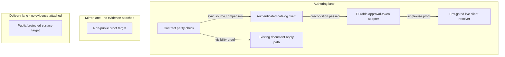

# Knowgrph Agentic OS follow-on — Reference implementation PRD/TAD

Parent authority: [Agentic OS reference implementation PRD/TAD](knowgrph-agentic-os-prd-tad.md)
v1.0.0. Authoring rules: [PRD, TAD & ADR Guidelines v1.7.0](https://huijoohwee.github.io/guidelines/prd-tad-adr-guidelines.md).

This document sequences work that must remain outside the parent baseline. It
does not declare an invocation route or tool identity, and it does not own an
Invocation Register. The parent retains the status identity; executable owners
retain all orchestration and document-resolution identities.

No test result, mirror result, delivery check, live-provider capture, or
operator promotion instruction is attached. Local readiness is therefore
`spec-complete`; delivered readiness is `undocumented`.

## Reference implementation scope and order

The canonical dependency order is:

1. **Precondition P — parent contract closure**: reconcile the two missing
   Worker view branches and make optional remote catalog discovery
   bearer-aware and session-compatible.
2. **Track 1 — spend safety**: prove durable, single-use approval tokens with a
   bounded TTL at the control plane.
3. **Track 2 — live orchestration proof**: after Track 1, capture one bounded
   approved run with valid cost evidence and a persisted manifest.
4. **Track 3 — operator projection**: after parent visibility is proven,
   project existing source-backed documents and manifests through the existing
   Canvas apply path.

Track 2 must not start before Track 1 exits unless a separate ADR explicitly
accepts the risk. Track 3 must not introduce a second dashboard store, graph
pipeline, or invocation owner.

## PRD

### Problem statement

The parent records three implementation gaps rather than masking them:

- the Worker advertises seven status views through the shared schema but
  dispatches five;
- the local capability-union adapter lacks bearer and MCP session handling for
  the protected control plane;
- source code alone does not prove durable approval, live provider execution,
  document projection, or delivery.

The follow-on increment closes those gaps in dependency order with bounded,
operator-verifiable outcomes.

### Personas and journeys

| Persona | Trigger | Action | Decision point | Outcome |
|---|---|---|---|---|
| Maintainer | Parent parity VCC is open | Compare shared schema with both dispatchers | Narrow schema or implement missing branches | One coherent remote contract |
| Agent integrator | Remote catalog is unreachable | Initialize an authenticated MCP session | Credentials/session valid? | Catalog result or explicit typed failure |
| Operator | A spend-bearing stage requests approval | Issue, present, and consume a token | Token valid, unused, and within TTL? | Spend allowed once or blocked at zero spend |
| Operator | Proven run state exists | Open the source-backed operator document | Projection valid? | Existing Canvas path renders it without a second store |

### Stories, criteria, and VCCs

| Story | Given-When-Then criterion | VCC |
|---|---|---|
| PRD-FO-01 — remote view parity | Given the shared seven-value schema, when local and Worker dispatchers are compared, then every advertised remote value resolves or the remote schema is intentionally narrower | VCC-FO-01 |
| PRD-FO-02 — protected federation | Given a configured bearer and an initialized MCP session, when the local union reads the remote catalog, then it receives the current definitions without logging or persisting the credential | VCC-FO-02 |
| PRD-FO-03 — durable approval | Given an unexpired token persisted before a simulated restart, when verification occurs after restart, then the token succeeds once and reuse fails closed | VCC-FO-03 |
| PRD-FO-04 — live proof | Given explicit live configuration, an approved bounded budget, and Track 1 evidence, when one golden path runs, then the manifest and valid cost records are surfaced and an unapproved control run costs zero | VCC-FO-04 |
| PRD-FO-05 — operator projection | Given a source-backed document and manifest, when the existing apply path runs, then one operator graph is rendered without a dashboard-only store or renderer | VCC-FO-05 |

### Success metrics and TTV

| Metric | Baseline from parent/source | Target | Gate |
|---|---:|---:|---|
| Worker status branches | 5 of 7 | 7 of 7, or an intentionally narrowed remote schema | Precondition P |
| Protected remote union paths | 0 | 1 authenticated, initialized path | Precondition P |
| Approval-token restart checks | 0 attached | 1 pass with single-use proof | Track 1 |
| Approved live golden paths | 0 attached | 1 bounded capture plus 1 zero-spend blocked control | Track 2 |
| Operator projection owners | Existing apply path; no evidence attached | 1 existing owner, 0 duplicate stores/renderers | Track 3 |
| TTV to first protected catalog | Not recorded | At most 3 operator actions and 2 minutes after prerequisites | Precondition P |
| TTV to first approved proof | Not recorded | At most 5 operator actions after configured prerequisites | Track 2 |
| Token budget for status/discovery | 0 | 0 | Every track |
| Live proof budget | Not recorded | At most $5 for one operator-approved capture | Track 2 |
| Incremental fixed monthly TCO | Planning assumption: $0 | $0 at demo load | Monthly review |

### MoSCoW and ROI

Formula:
`ROI = (impact × assumed monthly sessions) / (build hours + monthly TCO + token cost)`.
The inputs are planning assumptions, not usage or billing evidence.

| Tier | Item | Assumptions | ROI |
|---|---|---|---:|
| Must | Remote parity and protected federation | impact 5, sessions 20, hours 10, TCO 0, token 0 | 10.0 |
| Must | Durable single-use approval | impact 5, sessions 10, hours 8, TCO 0, token 0 | 6.3 |
| Should | One bounded live proof | impact 4, sessions 5, hours 8, TCO 0, token cost 5 | 1.5 |
| Should | Existing-path operator projection | impact 3, sessions 10, hours 8, TCO 0, token 0 | 3.8 |
| Won't | New proxy, dashboard store, or auto-approval | Not scored | — |

The working threshold of 5 keeps Track 1 ahead of live proof. Track 2 and Track
3 remain gated follow-ons whose strategic evidence value, not recurring usage,
must be approved explicitly.

### Out of scope

- Claiming public reach from source configuration or DNS/route declarations.
- Persisting provider credentials in documents, manifests, or logs.
- Making live clients the default; source configuration currently defaults the
  live-client switch to off.
- Remote exposure of the full 79-definition local catalog.
- A new monolithic gateway, dashboard database, or graph mutation bridge.
- Automatic approval, token reuse, unbounded retry, or provider spend without
  an explicit budget.

## TAD

### Topology delta

**Version**: 3.1.0 — 2026-07-30.
**Version note**: adds only the follow-on components and keeps both deploy
boundaries closed.

| Node | Responsibility | Lane | Connection | Data residency |
|---|---|---|---|---|
| Contract parity check | Compare shared enum and two dispatchers | Authoring | Sync source analysis | Local worktree |
| Authenticated catalog client | Initialize protected remote discovery | Authoring | Streamable HTTP with bearer/session | Credential in process memory only |
| Approval-token store adapter | Persist TTL and consumed state | Authoring target | Keyed async read/write | To-be-selected control-plane store; no delivery evidence |
| Live client resolver | Keep live providers explicit and env-gated | Authoring target | HTTPS after approval | Provider regions; no live evidence |
| Existing document apply path | Project source document/manifest to Canvas | Authoring target | In-process document apply | Local/browser state; no delivery evidence |

### Data and harness flows

| Track | Input | Validation before spend | Output | Persistence | Fallback |
|---|---|---|---|---|---|
| Precondition P | Shared schema, local/Worker dispatchers, remote config | Enum and credential/session checks | Parity result and catalog | None | Typed unreachable/error result |
| Track 1 | Gate id, token, issued time, TTL | Gate id and expiry | Single-use decision | Existing selected control-plane store | Fail closed; zero provider calls |
| Track 2 | Approved run, explicit live config, budget | Approval, budget, client config | Manifest and cost records | Existing run-manifest owner | Block or deterministic mock; no silent live fallback |
| Track 3 | Source document and manifest | Frontmatter/schema validation | Existing Canvas graph projection | Existing document/run owners | Typed apply failure; no direct graph write |

Track 2 uses an agentic loop only if the existing Director does. Its maximum
iteration count must remain source-configured and bounded; the circuit-breaker
is approval required, budget exhausted, blocked, verification failed, or the
configured iteration bound. Precondition P, Track 1, and Track 3 are
single-pass with maximum one iteration.

Every model-bearing executor must emit
`{ model, prompt_tokens, completion_tokens, cache_hits, estimated_cost_usd }`.
Status, discovery, approval verification, and document projection must remain
zero-model paths.

### Security and failure rules

- Bearer material remains in request/process memory and is never written to a
  catalog result.
- Approval tokens are distinct from transport bearer authentication.
- A missing, expired, reused, or wrong-gate approval token blocks before a
  provider call.
- Worker-held provider credentials do not make the status or discovery reads
  model-bearing.
- A live-provider error returns a typed failure and preserves the last
  authoritative manifest; it does not trigger an unbounded rerun.
- An unavailable operator projection leaves the source document authoritative.

### Architecture decisions and 12-month TCO

| Decision | Selected | FOSS/other alternative | Rationale |
|---|---|---|---|
| FO-ADR-01 | Extend the current remote catalog adapter with auth/session support | New FOSS proxy | Smaller ownership and attack surface |
| FO-ADR-02 | Reuse the current approval-store interface with one durable adapter | New standalone approval service | Preserves one token contract |
| FO-ADR-03 | Live off by default, operator-enabled per proof | Live by default | Bounds spend and accidental credential use |
| FO-ADR-04 | Reuse the existing document apply path | New dashboard store/renderer | Avoids duplicate state and projection |

| Deployment model | 12-month direct-cost assumption | Ops burden | Selection |
|---|---:|---|---|
| Existing managed/serverless control plane at demo load | $0 incremental target; measure before promotion | Low runtime ops, operator secrets/releases | Selected target |
| Existing local FOSS test path | $0 incremental | Manual local setup | Selected evidence host |
| New provisioned approval/proxy service | At least $60 at $5/month | Patching, backup, failover | Rejected |
| Hybrid service on an existing host | $0 incremental only with spare capacity; otherwise at least $60 | Shared manual operations | Rejected |

### Lane boundaries

| Boundary | Evidence Reference | Operator instruction | Rollback | State |
|---|---|---|---|---|
| FO-AUTHORING-MIRROR | None attached | None | Retain authoring state and fixtures | `closed` |
| FO-MIRROR-DELIVERY | None attached | None | Restore prior delivered state and re-run its recorded check | `closed` |

## Verification and traceability

### VCC register

| VCC | Candidate check | Recorded result | Surface |
|---|---|---|---|
| VCC-FO-01 | Deterministic shared-schema/local/Worker dispatcher comparison | None | None |
| VCC-FO-02 | Authenticated initialized catalog integration check | None | None |
| VCC-FO-03 | Approval-token restart, expiry, and reuse check | None | None |
| VCC-FO-04 | One approved bounded live capture plus one blocked zero-spend control | None | None |
| VCC-FO-05 | Existing document apply-path check with store/renderer owner count | None | None |

These are candidate check hosts, not Evidence References. No result and no lane
are recorded, so the VCCs keep the local rung at `spec-complete`; the absence of
delivery VCC evidence keeps the delivered rung at `undocumented`.

### Traceability

| PRD story | TAD component | VCC |
|---|---|---|
| PRD-FO-01 | Contract parity check | VCC-FO-01 |
| PRD-FO-02 | Authenticated catalog client | VCC-FO-02 |
| PRD-FO-03 | Approval-token store adapter | VCC-FO-03 |
| PRD-FO-04 | Live client resolver and existing manifest owner | VCC-FO-04 |
| PRD-FO-05 | Existing document apply path | VCC-FO-05 |

The parent regression VCCs must be rerun after every follow-on track. A track
that lacks a surfaced evaluator result remains at `spec-complete`; it is not
promoted by narrative, source presence, or a configured route.
