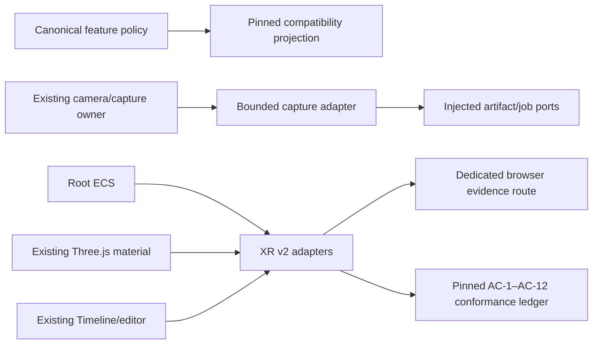

# Knowgrph AR/VR/XR — Pinned Runtime-Readiness Contract

## Source authority and decision

The requirements authority for this increment is the historical v2.0.0 document
at commit
[`5679d4101f5470fb85816b6df4f2ec0af6ca4eb7`](https://github.com/huijoohwee/knowgrph/blob/5679d4101f5470fb85816b6df4f2ec0af6ca4eb7/docs/documents/knowgrph-ar-vr-xr-prd-tad-adr.md).
This maintained document is its runtime-readiness overlay. It preserves and
traces pinned AC-1 through AC-12 without restoring the stale 1,056-line copy or
creating a second renderer, ECS, camera lifecycle, editor, transport, media
registry, or command/schema owner.

The exact readiness boundary is deliberately narrower than the requirements
authority:

- deterministic adapters, focused tests, source ledgers, and the admitted
  local-browser observations are review-candidate evidence;
- the existing `xr-authoring-edited-media-delivery` snapshot is one contained
  evidence slice, not a replacement authority for pinned AC-1–AC-12;
- full pinned runtime readiness remains **blocked** on admitted model bytes,
  named reference/physical devices, a connected live transport, and
  track-preserving mux proof; and
- all evidence is Dev-only. It grants no integration, release, deployment, or
  Production authority.

## Canonical ownership

| Concern | Canonical owner retained | XR v2 responsibility |
|---|---|---|
| Feature probes and entry decision | `canvas/src/lib/three/ThreeGraphXrSessionPolicy.ts` | Project the result and provide pinned compatibility evidence |
| Session binding and rendering | Existing mounted Three.js/R3F surface | No renderer, scene, or camera creation |
| Camera permission and capture | Existing Spatial Capture and Motion Control owners | Pure capture state plus injected processing ports |
| Scene data and query | Root `ecs` package | Read-only projection, including entity identifier zero |
| Materials | Existing Three.js material owner | Validate and apply a closed graph to caller-owned material |
| Timeline, preview, and export | `canvas/src/components/timeline` and `canvas/src/features/gitgraph` | Deterministic animation/preview adapters and typed command seam |
| XR adapter surface | `canvas/src/features/xr-v2` | Pinned conformance ledger and bounded adapters |
| Evidence | XR source runner and dedicated Chromium smoke | Reproducible source/browser observations, never self-promotion |

The canonical entry-mode union remains `immersive-session`, `inline-viewer`,
`monocular-capture`, `native-handoff`, and `unsupported`. A compatibility
projection may express the pinned four-tier requirement, but does not replace
that owner or infer device class from `navigator.userAgent`.

## Product requirements and acceptance trace

The following table is the normative trace for all acceptance criteria in the
pinned authority. “Backed” means that the checked-in deterministic or browser
slice is executable; it does not erase the named blocker.

| Pinned criterion | Requirement preserved | Executable owner/evidence | Readiness boundary |
|---|---|---|---|
| **AC-1 — Capability detection** | Report exactly one of the pinned four tiers before capture/session action | Canonical feature policy plus pinned conformance projection and matrix tests | Deterministic/source-backed; physical device matrix blocked |
| **AC-2 — Live capture default** | At sufficient budget, synthesize stereo for at least 90% of frames with no duplicate writes and expose live preview | Capture session, deterministic stereo synthesizer, pinned conformance probe | Synthetic/admitted-input proof only; model bytes, real camera, and named-device frame budget blocked |
| **AC-3 — Automatic post-process fallback** | After N consecutive budget breaches, preserve raw capture and produce a typed post-process job without failing capture | Capture-session state machine and injected artifact/job ports | Deterministic/focused-test-backed; durable connected executor proof remains outside this adapter |
| **AC-4 — Progressive-enhancement viewing** | Select the highest supported tier and retain a flat fallback | Canonical five-mode policy, compatibility projection, existing viewer route, browser probe | Selection/browser-route-backed; four-tier physical rendering matrix blocked |
| **AC-5 — iOS engine reality** | iOS-class matrices must not project either pinned immersive tier | Feature-probe compatibility matrix; no user-agent branch | Deterministic/source-backed; named iOS browser/device pass blocked |
| **AC-6 — ECS scene composition** | Component queries return the correct unique entities and applied components render | Root ECS projection tests and entity-zero browser observation | Query/focused-browser-backed; complete mounted scene-render wiring not promoted |
| **AC-7 — Node-based material authoring** | A closed graph compiles and applies its evaluated output to a target mesh/material | Material graph compiler and real caller-owned `MeshStandardMaterial` observation | Real standalone material backed; texture/shader graph and canonical target-mesh rendering proof blocked |
| **AC-8 — Visual behavior graph** | A wired trigger invokes its action exactly once; an unwired trigger invokes none | Exact-once behavior dispatcher and pinned probe | Deterministic/focused-test-backed; visual graph UI/schema publication is not claimed |
| **AC-9 — Particle authoring** | Particle count never exceeds configured rate/lifetime/ceiling bounds | Bounded particle emitter and fixed-duration probe | Deterministic/focused-test-backed; mounted GPU authoring surface not claimed |
| **AC-10 — Animation timeline** | Sampled bone/property interpolation matches keyframes within tolerance | Numeric/bone timeline interpolation and pinned probe | Deterministic/focused-test-backed; rigged mounted playback proof is separate |
| **AC-11 — In-browser packaging** | Preserve input track count and codec in one browser-playable container | Existing browser-native edited-media exporter proves non-empty decode/playback | Browser playback backed; already-encoded **track-preserving mux proof is blocked** |
| **AC-12 — Live edit-to-device preview** | Propagate an edit to a connected viewer within N ms with no build or reload | Bounded preview-delta channel and local probe | Process-local admission backed; **connected live transport** latency/no-reload proof is blocked |

### Pinned tier compatibility

The pinned vocabulary is retained verbatim for traceability:

- `webxr-ar`
- `webxr-vr`
- `pseudo-ar-depth-parallax`
- `flat-fallback`

Those values describe the v2.0.0 acceptance projection. They do not add an
asset field or reopen a second capability policy. The maintained runtime first
uses feature probes to obtain one canonical entry mode, then a bounded
compatibility adapter may map that result plus admitted platform facts to
exactly one pinned tier for conformance evidence. Platform facts are injected
test inputs or a separate trusted owner’s output, never browser-identity
classification in the XR adapter.

### Runtime-ready user journeys

1. A viewer opens an existing XR surface and receives one canonical entry
   recommendation before choosing a permission-bearing action.
2. A capture owner supplies raw frames to the bounded XR adapter. The adapter
   writes each raw frame once, attempts admitted live processing, and switches
   to raw/post-process mode when the configured consecutive-breach limit is
   reached.
3. An author uses the existing ECS, material, Timeline, preview, and export
   owners. XR v2 validates and projects data but does not seize lifecycle
   ownership.
4. A reviewer runs source/unit checks and a clean exact-commit Chromium smoke.
   The browser evidence remains an observation until a separate authority
   admits it.

## Technical architecture



### Invariants

- One feature policy, renderer, camera lifecycle, ECS, editor, and export owner.
- Raw capture is admitted before optional processing and never written twice.
- Entity identifier zero is valid; negative, duplicate, unsafe, and unbounded
  ECS input fails closed.
- Graphs, particles, timelines, deltas, and evidence envelopes are bounded.
- Callback failure cannot replay an accepted behavior revision.
- Caller-owned Three.js resources are never disposed by an adapter binding.
- Browser observations cannot promote their own readiness state.
- No adapter performs user-agent classification, camera acquisition, session
  entry, deployment, or network publication.

### Evidence schemas

| Schema | Role |
|---|---|
| `knowgrph-xr-v2-pinned-contract-conformance/v1` | AC-1–AC-12 result ledger tied to the pinned revision |
| `knowgrph-xr-v2-readiness/v1` | Existing source snapshot for the contained edited-media slice |
| `knowgrph-xr-v2-dev-runtime-evidence/v1` | Validated bounded browser observation payload |
| `knowgrph-xr-v2-browser-smoke/v1` | Clean exact-commit Chromium evidence artifact |

## Historical contract and ADR reconciliation

The pinned document included illustrative invocation rows `/xr.capture` and
`/xr.author`, an illustrative `kgc-behavior-graph/v1` contract, and proposed
dependency/implementation ADRs involving Depth Anything V2, Rete.js,
three.quarks, Theatre.js, and a custom muxer. They remain requirements lineage,
not restored command routes, persisted schemas, packages, or duplicate runtime
owners. A proposal becomes executable only after it is canonicalized at an
existing owner with its own license, asset, security, lifecycle, and evidence
review.

The current decisions are:

1. retain the shared Three.js/R3F renderer and feature-probed session policy;
2. treat a depth model as an admitted, hashed, same-origin asset rather than an
   assumed dependency;
3. retain the root ECS and existing node/editor surfaces;
4. implement deterministic adapters in-repository without silently adopting
   the historical candidate packages;
5. retain the existing Timeline and browser exporter; do not claim a custom
   already-encoded-track muxer; and
6. keep the preview adapter transport-neutral until connected transport proof
   is admitted.

[OpenCut](https://github.com/opencut-app/opencut) is an attribution-only product-workflow reference.

That citation is documentation-only. It is not a dependency, compatibility
target, source artifact, service, package, runtime request, or readiness proof.
The editor implementation remains independently specified and checked in.

## Readiness states

| Slice | State | Promotion condition |
|---|---|---|
| Pinned lineage and all AC rows | source-backed | Source guard passes against exact pinned SHA and all AC IDs |
| Pure capability/capture/authoring probes | focused-test-backed | Unit and conformance suites pass |
| Existing edited-media output/decode/playback | browser-backed | Clean exact-commit Chromium evidence passes |
| Live monocular depth and frame budget | blocked | Admit model bytes, metadata, and named reference-device results |
| Physical camera/headset behavior | blocked | Admit permission/session/lifecycle proof from named devices |
| AC-11 track preservation | blocked | Verify input/output tracks and codecs through one browser-playable container |
| AC-12 connected viewer | blocked | Verify connected transport latency and no full-page reload |
| Full pinned AC-1–AC-12 runtime readiness | blocked | Every row above has admitted runtime evidence |
| Production/deployment | blocked | Separate release authority and delivery gates pass |

## Verification contract

Run from the repository root:

```sh
node --test scripts/__tests__/xr-v2-source-smoke.test.mjs
node scripts/run-xr-v2-source-smoke.mjs
npm run xr-v2:unit
node --test scripts/__tests__/video-editor-source-smoke.test.mjs
node scripts/run-video-editor-source-smoke.mjs
node canvas/scripts/run_xr_v2_browser_smoke.mjs
npm run xr-v2:review-candidate
npm run xr-v2:review-ready
npm run xr:review-ready
```

`npm run xr-v2:review-candidate` joins TypeScript, unit, source, clean-room, and
fresh local-browser evidence. `npm run xr-v2:review-ready` adds the runner
contract suites and is the affected-scope reviewer command. The wider
`npm run xr:review-ready` retains existing camera-fallback compatibility.
These commands are Dev-only, make no physical-device inference, and do not
deploy.

## Promotion blockers

Full runtime readiness for the pinned authority requires all of the following:

1. admit immutable model bytes with license, digest, same-origin location,
   input/output contract, memory budget, and fallback metadata;
2. record live-preview quality and the AC-2 90% threshold on named reference
   devices while preserving raw-frame correctness;
3. record camera permission, interruption, lifecycle, and teardown on named
   mobile devices, plus session entry/tracking/exit on named headsets;
4. execute AC-11 over already-encoded input and prove track count, codec
   preservation, decode, and playback;
5. execute AC-12 through the canonical connected transport and prove bounded
   latency with no build and no page reload; and
6. obtain separately authorized integration, release, and deployment proof.

Until then, the honest result is: pinned AC-1–AC-12 are fully traced;
deterministic/source and specific browser-backed slices may be ready; the full
runtime, physical-device, connected-transport, track-preserving-mux, and
Production claims remain blocked.
