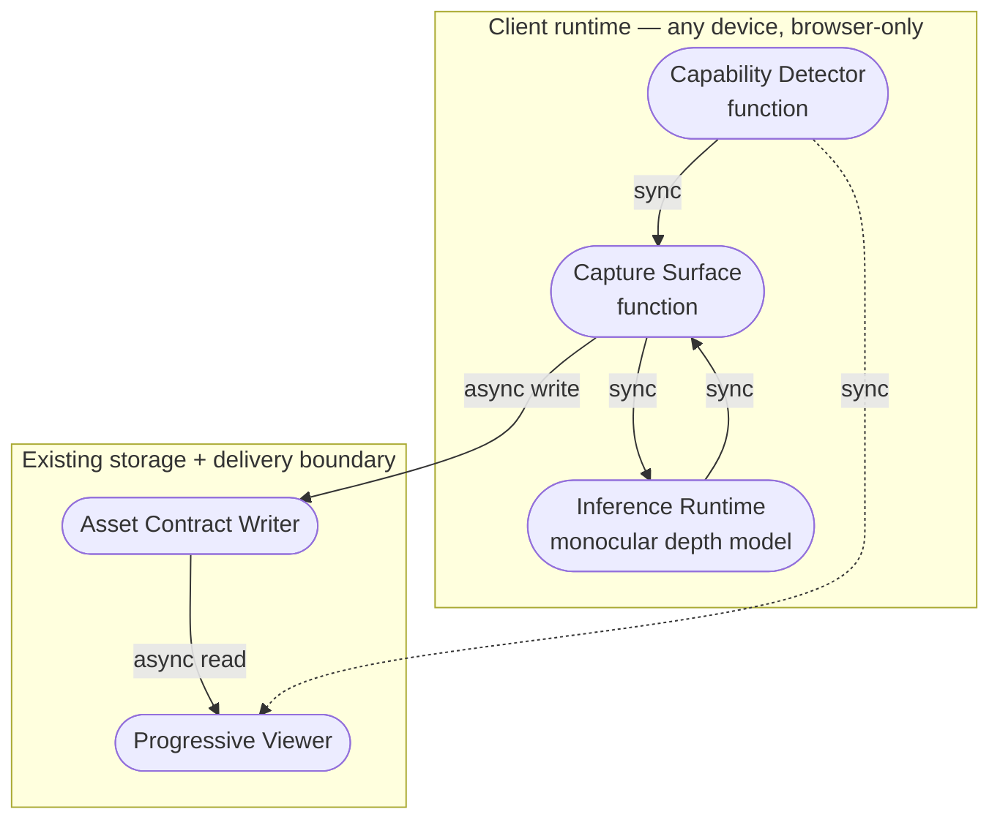

# Knowgrph AR/VR/XR — Device-Agnostic Immersive Capture & Viewing

**Contents**: Part I — PRD · Part II — TAD · Part III — ADR-1/2/3 · Part IV — Agent-Platform Readiness · Part V — Invocation Register · Part VI — Readiness Gap Matrix · Part VII — Validation Checklist Status

---

## Part I — Product Requirements (PRD)

### Feature: Device-Agnostic AR/VR/XR Capture & Immersive Viewing Layer

#### Problem Statement
Users capturing real-world footage (event flyovers, launches, performances, or everyday spatial documentation) via a phone camera cannot currently connect that footage into Knowgrph's canvas/graph as an immersive, device-independent asset. Existing immersive-capture pipelines require dedicated calibrated stereo hardware or platform-locked native AR SDKs, defeating the browser-native, zero-TCO, min-viable-max-value orientation of the product. Meanwhile, no unified capability layer exists inside the repo to detect what a given device/browser can actually do (immersive session support, monocular-camera-only, or native handoff) and degrade gracefully. The opportunity: a capability-detected, progressive-enhancement XR layer that turns any phone camera into a usable spatial-capture device and any supported headset/browser into a compatible viewer, without new paid infrastructure.

#### Personas
- **Solo Builder / Operator** (primary; also the Founder) — captures event or product footage on a personal phone, wants it to render immersively inside Knowgrph's canvas and be viewable by others on whatever device they own.
- **Node/Graph Viewer** — opens a Knowgrph node on a phone, desktop, an Android-class immersive-capable headset, or an iOS-headset-class device, and expects a reasonable spatial experience regardless of device, without installing a native app.

#### User Journey Stage
Addresses the "capture → publish → view" segment of the Knowgrph asset lifecycle journey — the stage after a canvas node is created and before it is available as a shareable spatial artifact.

##### Journey: Solo Builder — Capture and publish a spatial asset from a phone

| Stage | Action | Touchpoint | Pain Point | Opportunity |
|---|---|---|---|---|
| Trigger | Wants to document a live event or object as a spatial asset | Knowgrph canvas, "capture" affordance | No existing capture path exists in-canvas | Add first-class capture entry point |
| Discover | Opens capture UI on whatever phone is on hand | Browser camera permission prompt | Uncertainty whether device is "AR capable" | Capability badge shown before capture starts |
| Engage | Records footage; sees live depth/parallax preview | In-canvas capture widget | Frame drops / thermal throttling on live synthesis | Default-to-live with automatic fallback to post-process |
| Complete | Footage becomes a viewable spatial node | Canvas node, asset contract | Output quality inconsistent across devices | Explicit capability tier stored with the asset, so viewers know what to expect |
| Return | Views the same node later on a different device | Canvas / headset viewer | No universal viewer path | Progressive-enhancement viewer (flat → parallax → immersive session) |

**Directive compliance**: one journey, one persona-goal pair; every story below anchors to a stage in this journey.

#### User Stories

**As a** solo builder **I want** to capture spatial video from any phone's camera **So that** I don't need dedicated stereo/immersive hardware to add spatial assets to a Knowgrph canvas. *(Journey: Trigger/Engage)*

**As a** solo builder **I want** the capture pipeline to run live depth-based stereo synthesis by default **So that** I get an immediate spatial preview without a separate processing step. *(Journey: Engage)*

**As a** solo builder **I want** live synthesis to fall back automatically to a post-process step **So that** capture never fails or drops frames on lower-powered devices. *(Journey: Engage/Complete)*

**As a** node/graph viewer **I want** the canvas to detect my device's XR capability **So that** I see the best available spatial experience without manual configuration. *(Journey: Discover/Return)*

**As a** node/graph viewer on a capable headset **I want** to open the same spatial asset in an immersive session where supported **So that** I don't need a separate native app to view Knowgrph content immersively. *(Journey: Return)*

#### Acceptance Criteria

**AC-1 — Capability detection**
**Given** a user opens the capture or viewer surface on any device **When** the page loads **Then** the runtime reports exactly one capability tier (`webxr-ar`, `webxr-vr`, `pseudo-ar-depth-parallax`, `flat-fallback`) before any capture or session action is offered.

> **VCC translation**: `Verify the capability-detection function returns exactly one tier value from the closed enum for a mocked device-feature matrix covering iOS-class, Android-class, headset-class, and desktop devices, and no tier is inferred from a user-agent string alone`

**AC-2 — Live capture default**
**Given** a device reports sufficient frame budget **When** the user starts capture **Then** monocular-depth-based stereo synthesis runs per-frame during capture and a live parallax preview is shown.

> **VCC translation**: `Verify the capture session emits a synthesized stereo frame pair for ≥90% of captured frames in a fixed-length test clip at target frame budget, with no frame written twice`

**AC-3 — Automatic post-process fallback**
**Given** live synthesis cannot sustain the frame budget **When** frame time exceeds the configured threshold for N consecutive frames **Then** the session drops to raw-capture-plus-depth-metadata mode and queues a post-process synthesis job on save, without failing the capture.

> **VCC translation**: `Verify a simulated frame-budget breach triggers fallback within N frames, capture continues to completion, and a post-process job record is written with the raw clip and depth-metadata reference`

**AC-4 — Progressive-enhancement viewing**
**Given** a saved spatial asset **When** it is opened on any supported device **Then** the viewer renders the asset at the highest tier the capability detection reports, and at minimum renders a flat 3D fallback on every device.

> **VCC translation**: `Verify the viewer component renders without throwing for each of the four capability tiers in a mocked matrix, and the flat-fallback tier is reachable with zero optional dependencies loaded`

**AC-5 — iOS engine reality**
**Given** the device is iOS-class (any installed browser on that platform) **When** capability is detected **Then** the tier never reports `webxr-ar` or `webxr-vr`, and resolves to `pseudo-ar-depth-parallax` or `flat-fallback` only.

> **VCC translation**: `Verify capability detection on an iOS-class user-agent/feature matrix never returns a webxr-* tier, for every browser variant in the test matrix`

#### Success Metrics

| Metric | Baseline | Target | Timeline |
|--------|----------|--------|----------|
| Capture sessions completed without failure | — (feature does not exist) | ≥95% of started sessions reach a saved asset | 30 days post-ship |
| Live-synthesis sustain rate (devices meeting frame budget) | — | ≥60% of capture sessions stay in live mode without triggering fallback | 30 days post-ship |
| Readiness rung (local / delivered) | `undocumented` / `undocumented` | `runtime-ready` / `runtime-ready` | Phase 3 gate |
| Time-to-value (TTV steps) | n/a | ≤3 steps (open capture → grant camera → start capture) | Phase 0 estimate, validated Phase 3 |
| Time-to-value (TTV elapsed) | n/a | ≤60 sec to first live parallax preview frame | Phase 0 estimate, validated Phase 3 |
| Token cost / month | n/a | $0.00 (all inference client-side; no LLM token spend in this feature) | Ongoing |
| Monthly TCO | n/a | $0.00 incremental (no new server compute, no new storage class) | Ongoing |
| ROI Score | — | ≥ solo-dev threshold (see ROI Calculation) | Sprint 1 |

**Time-to-Value detail**:

| Dimension | Estimate | Target ceiling | Validation method |
|---|---|---|---|
| TTV steps | 3 steps | ≤3 steps | Walk-through on clean env |
| TTV elapsed time | ~45 sec | ≤60 sec | Timed first-run test |
| First-value action | Live parallax preview frame rendered after camera grant | — | Observable output defined |
| Persona | Solo Builder / Operator | — | Persona defined above |

**ROI Calculation** (per ROI Calculation Template):
```
User Impact = 4  (solo builder currently has no spatial-capture path at all; high pain, moderate frequency)
Reach       = 1  (solo operator + early node viewers; single-digit monthly sessions at this stage)
Build Hours = 40 (capability detection + capture layer + fallback + viewer wiring, estimate)
Monthly TCO = 0
Token Cost  = 0

ROI Score = (4 × 1) / (40 + 0 + 0) = 0.10
```
Low absolute reach keeps the raw ROI score low; the item is scoped Must-tier anyway because it unblocks the asset-contract's spatial-media class entirely (foundational, not reach-driven). This is an explicit MoSCoW override, documented below, consistent with the Min-Viable-Max-Value lens.

#### MoSCoW Priority

| Tier | Item | ROI score | Rationale |
|---|---|---|---|
| **Must** | Capability detection (4-tier enum) | n/a (foundational) | Every other item depends on a correct tier value; zero build cost to defer risk |
| **Must** | Capture layer: camera feed + monocular depth + live synthesis | 0.10 | Core deliverable; unblocks spatial-asset class |
| **Must** | Automatic post-process fallback | n/a (safety) | Prevents capture failure on lower-powered devices; required for AC-3 |
| **Should** | Progressive-enhancement viewer (flat → parallax → immersive session) | n/a (paired with capture) | Needed to consume what capture produces; can ship one tier at a time |
| **Should** | Markerless anchoring fallback for iOS-class in-canvas AR | n/a | Improves iOS-class experience but flat/parallax viewing works without it |
| **Could** | Native AR handoff for full 6DoF placement | n/a | High-fidelity but leaves the canvas runtime; defer until Must-tier proves demand |
| **Won't (this increment)** | Calibrated-stereo capture (purpose-built immersive-camera ingestion) | n/a | Out of zero-TCO envelope; a hardware-tier gap, not a browser-native capability gap |
| **Won't (this increment)** | Proprietary spatial-video container encoding | n/a | Requires a native toolchain outside the browser runtime; tracked as an explicit exclusion |

#### Min-Viable Scope
The smallest deliverable satisfying Must-tier acceptance criteria: capability detection returning one of four tiers; live capture with per-frame monocular-depth-based stereo synthesis; automatic fallback to raw-capture-plus-metadata with a queued post-process job when frame budget is exceeded. Explicitly excludes the viewer's immersive-session wiring, native AR handoff, and any calibrated-stereo or proprietary-container encoding path.

#### Out of Scope
- Purpose-built calibrated-stereo camera ingestion (hardware-tier capture)
- Proprietary spatial-video container encoding (native-toolchain-only muxing)
- Multi-device synchronized playback
- Server-side depth inference (this feature is client-side-only by design)

#### Dependencies
- Existing canvas rendering runtime (rendering baseline)
- Existing browser-native CV inference layer (monocular depth model, already selected under the FOSS gate — see ADR-2)
- Existing markerless-tracking component (already selected under the FOSS gate — see ADR-1)
- Existing native-handoff component for 3D model presentation (already selected under the FOSS gate — see ADR-1)
- The existing asset-contract schema, extended with an XR-capability field (see TAD Integration Contracts)

#### Open Questions
- What frame-time threshold (ms) should trigger the live→post-process fallback, and should it be device-class-tunable or a single global constant?
- Should the post-process job run as a foreground "processing…" state on the asset node, or a background job the user can navigate away from?
- Does the `pseudo-ar-depth-parallax` tier need its own explicit user-facing label, or should it be presented identically to `flat-fallback` with parallax as an invisible enhancement?

---

## Part II — Technical Architecture (TAD)

### Architecture: Device-Agnostic AR/VR/XR Capture & Viewing Layer

#### Overview
**From phone camera feed to viewable spatial asset**: Capture Surface → Capability Detection → [Live Synthesis Harness | Raw-Capture Fallback] → Asset Contract → Progressive-Enhancement Viewer → delivers a spatial asset viewable at the best tier any given device supports, with zero incremental infrastructure cost.

#### Journey → System Mapping

| Journey Stage | Workflow | Data Flow | Orchestration/Harness Flow | Topology Node(s) | Component |
|---|---|---|---|---|---|
| Trigger | Capture Init Workflow | — | — | Capture Surface | Capability Detector |
| Discover | Capture Init Workflow | — | — | Capture Surface | Capability Detector |
| Engage | Live Capture Workflow | Capture Data Flow | Depth Synthesis Harness Flow | Capture Surface, Inference Runtime | Monocular Depth Component, DIBR Synthesizer |
| Complete | Save & Publish Workflow | Capture Data Flow | Post-Process Fallback Harness Flow (conditional) | Asset Store | Asset Contract Writer |
| Return | View Workflow | Viewer Data Flow | — | Viewer Surface | Progressive Viewer |

#### Topology
**Version**: 1 — 2026-08-02
**Boundaries**: Client runtime (browser, any device); no server-side boundary crossed by this feature

| Node | Role | Type | Lane | Connects to | Connection type | Data residency |
|---|---|---|---|---|---|---|
| Capability Detector | Producer | Function (client-side) | Authoring | Capture Surface, Progressive Viewer | Sync in-process call | Local (device memory only) |
| Capture Surface | Producer/Consumer | Function (client-side) | Authoring | Inference Runtime, Asset Contract Writer | Sync in-process call | Local (device memory) |
| Inference Runtime | Producer | Function (client-side model runtime) | Authoring | Capture Surface | Sync in-process call | Local (device memory; no network egress) |
| Asset Contract Writer | Consumer/Store | Function → Storage adapter | Authoring/Delivery | Existing asset store | Async write | Region (existing storage residency, unchanged by this feature) |
| Progressive Viewer | Consumer | Function (client-side) | Delivery | Asset Contract Writer (read) | Async read | Region (same as Asset Contract Writer) |



**Version notes**: Initial topology for this feature; no prior version exists. No new storage class or network egress path introduced — the Inference Runtime and Capture Surface are entirely local to the client, keeping this feature inside the existing zero-egress boundary.

#### Orchestration/Harness Flows

**Pipeline**: Depth Synthesis Harness Flow
**Topology pattern**: Sequential | **Max iterations**: 1 per frame (no retry loop; a missed frame is dropped, not retried) | **Circuit-breaker**: N consecutive frame-budget breaches (configurable; see Open Questions) triggers fallback exit
**Token budget**: 0 prompt + 0 completion = $0.00 / call (client-side inference model, not an LLM call; cost log still emitted for parity with the harness contract)

| Role | Component | Input schema | Output schema | Cost log | Fallback |
|---|---|---|---|---|---|
| Dispatcher | Capture Surface | `{ frame: ImageBitmap, timestamp }` | `{ frame, depthRequest }` | — | Drop frame, continue capture |
| Executor | Inference Runtime | `{ frame, depthRequest }` | `{ depthMap, confidence }` | ✓ (frame_ms, model_id, device_class) | Frame-budget breach → exit to Post-Process Fallback Harness Flow |
| Observer | In-session frame-time logger | `{ frame_ms stream }` | `{ rolling avg, breach count }` | — | Silent fail; capture continues |
| Consumer | DIBR Synthesizer | `{ frame, depthMap }` | `{ stereoPairFrame }` | — | Upstream error → raw frame retained, depth discarded for that frame |

**Happy path**:
1. Capture Surface dispatches each frame to the Inference Runtime with a depth request
2. Inference Runtime returns a depth map; frame-time logger records elapsed ms
3. DIBR Synthesizer produces a stereo pair frame from the raw frame + depth map
4. If rolling frame-time average breaches threshold for N consecutive frames → exit to Post-Process Fallback Harness Flow

**Alternate paths**:
- Depth map confidence below threshold for a frame: frame is retained as 2D-only; no stereo pair emitted for that frame, capture continues
- Device reports no camera permission: Capture Surface never dispatches; user is returned to a permission-request state, not a failed session

**Error paths**:
- Inference Runtime throws (model load failure, out-of-memory): Executor fallback activates — session drops immediately to Post-Process Fallback Harness Flow, capture continues raw-only
- Frame-time logger emission fails: Observer silent-fails; capture continues; gap flagged in local session diagnostics only (no network telemetry call)

**Postconditions**: every captured frame is either a synthesized stereo pair or a raw frame with retained depth metadata; no frame is lost; no unbounded retry loop; zero token spend

---

**Pipeline**: Post-Process Fallback Harness Flow
**Topology pattern**: Sequential | **Max iterations**: 1 pass over the saved clip | **Circuit-breaker**: n/a (single bounded pass, not a loop)
**Token budget**: 0 prompt + 0 completion = $0.00 / call

| Role | Component | Input schema | Output schema | Cost log | Fallback |
|---|---|---|---|---|---|
| Dispatcher | Asset Contract Writer | `{ rawClipRef, depthMetadataRef }` | `{ jobRecord }` | — | Reject with typed error if clip ref unresolvable |
| Executor | Inference Runtime (batch mode) | `{ frame stream }` | `{ depthMap stream }` | ✓ required | Degraded mode: publish asset at `flat-fallback` tier without stereo synthesis |
| Observer | Job status logger | `{ progress stream }` | `{ percent complete }` | — | Silent fail; job continues |
| Consumer | Asset Contract Writer | `{ stereoPairFrame stream }` | `{ published asset, xr_capability_tier }` | — | Upstream error propagation to asset status field |

**Happy path**:
1. Job dispatched from a saved raw clip + retained depth metadata (or re-inferred if metadata absent)
2. Batch inference produces a depth-map stream at the clip's native frame rate
3. DIBR synthesis runs per frame without a live frame-budget constraint
4. Asset is republished with the synthesized stereo track and its capability tier updated

**Alternate paths**: job re-inference triggered when depth metadata was not retained during live capture (e.g. immediate hard-failure case)

**Error paths**: batch inference exhausts device/browser memory on a long clip → job fails closed, asset remains published at `flat-fallback` tier with a recorded failure reason, not silently retried

**Postconditions**: asset's `xr_capability_tier` field reflects the actually-achieved output tier; job record persisted; no unbounded retry

#### Component Specifications

**Component**: Capability Detector
**Responsibility**: Capability Detector determines the client's XR tier from feature probes, never from user-agent string matching alone.
**Interfaces**: `detectXRCapabilities(): { tier: 'webxr-ar'|'webxr-vr'|'pseudo-ar-depth-parallax'|'flat-fallback', modules: {...} }`
**Dependencies**: Browser feature APIs only (immersive-session existence check, camera permission API); no external service call
**Configuration**: None externalized; tier enum is closed and versioned with this component
**FOSS / Vendor**: FOSS (standard browser APIs only; no dependency to evaluate)
**VCC Conditions**: AC-1, AC-5
**Evidence References**: *(to be recorded at Phase 3 — none yet; document is `spec-complete`)*
**Readiness rung**: Local: `spec-complete` / Delivered: `undocumented`

---

**Component**: Capture Surface
**Responsibility**: Capture Surface reads the device camera feed and dispatches frames to the synthesis harness at the capability-appropriate rate.
**Interfaces**: `startCapture(tier): CaptureSession`; `CaptureSession.onFrame(callback)`
**Dependencies**: Capability Detector, Inference Runtime, Asset Contract Writer
**Configuration**: Frame-budget breach threshold (ms), consecutive-breach count N — both externalized, not hardcoded (see PRD Open Questions for default values)
**FOSS / Vendor**: FOSS (standard browser media-capture API)
**VCC Conditions**: AC-2, AC-3
**Evidence References**: *(none yet)*
**Readiness rung**: Local: `spec-complete` / Delivered: `undocumented`

---

**Component**: Inference Runtime (monocular depth estimation)
**Responsibility**: Inference Runtime produces a per-frame depth map from a single camera frame without a server round-trip.
**Interfaces**: `estimateDepth(frame: ImageBitmap): { depthMap, confidence }`
**Dependencies**: Browser-native model-inference runtime (already selected under the FOSS gate — see ADR-2)
**Configuration**: Model variant selectable by device-class (constrained vs. capable device), externalized
**FOSS / Vendor**: FOSS — see **Reference implementation** in ADR-2
**Harness Contract**:
  - Input schema: `{ frame: ImageBitmap }`
  - Output schema: `{ depthMap: Float32Array, confidence: number }`
  - Cost log fields: `{ model: 'depth-estimator', prompt_tokens: 0, completion_tokens: 0, cache_hits: 0, estimated_cost_usd: 0.00 }`
  - Fallback path: degraded response (skip stereo synthesis for that frame) — never an upstream error that aborts capture
**Token Budget**: 0 + 0 @ n/a cache rate = $0.00/request (client-side model inference, not a hosted LLM call)
**Orchestration Topology**: Sequential — max 1 iteration per frame; no retry, drop-and-continue on failure
**VCC Conditions**: AC-2, AC-3
**Evidence References**: *(none yet)*
**Readiness rung**: Local: `spec-complete` / Delivered: `undocumented`

---

**Component**: DIBR Synthesizer
**Responsibility**: DIBR Synthesizer produces a stereo pair frame from a raw frame and its depth map using depth-image-based rendering.
**Interfaces**: `synthesizeStereoPair(frame, depthMap): { left, right }`
**Dependencies**: Inference Runtime output
**Configuration**: Baseline eye-separation constant, externalized
**FOSS / Vendor**: FOSS (implemented in-repo; no external dependency)
**VCC Conditions**: AC-2
**Evidence References**: *(none yet)*
**Readiness rung**: Local: `spec-complete` / Delivered: `undocumented`

---

**Component**: Markerless Anchoring Fallback *(Should-tier)*
**Responsibility**: Markerless Anchoring Fallback provides in-canvas image/face-target tracking on devices without a native immersive-session API.
**Interfaces**: `startAnchoredSession(target): AnchorSession`
**Dependencies**: Capability Detector (`pseudo-ar-depth-parallax` tier)
**Configuration**: Target asset reference
**FOSS / Vendor**: FOSS — see **Reference implementation** in ADR-1
**VCC Conditions**: *(Should-tier; VCC deferred to a follow-on Phase 1 pass)*
**Evidence References**: *(none yet)*
**Readiness rung**: Local: `undocumented` / Delivered: `undocumented`

---

**Component**: Native Handoff Bridge *(Could-tier)*
**Responsibility**: Native Handoff Bridge hands a placement-ready 3D asset to the platform's native AR viewer for full positional tracking.
**Interfaces**: exposes a platform-native model-viewing link generated from the published asset
**Dependencies**: Asset Contract Writer output
**Configuration**: None
**FOSS / Vendor**: FOSS — see **Reference implementation** in ADR-1
**VCC Conditions**: *(Could-tier; deferred)*
**Evidence References**: *(none yet)*
**Readiness rung**: Local: `undocumented` / Delivered: `undocumented`

---

**Component**: Progressive Viewer
**Responsibility**: Progressive Viewer renders a published spatial asset at the highest capability tier the current device reports.
**Interfaces**: `renderAsset(assetRef): ViewerSession`
**Dependencies**: Capability Detector, Asset Contract Writer (read)
**Configuration**: Tier-to-renderer mapping table, externalized
**FOSS / Vendor**: FOSS (existing canvas runtime; immersive-session entry point uses the standard browser immersive-session API where reported available)
**VCC Conditions**: AC-4
**Evidence References**: *(none yet)*
**Readiness rung**: Local: `spec-complete` / Delivered: `undocumented`

#### Integration Contracts

**Interface**: `xr_capability_tier` asset field | **Protocol**: In-process function call + existing storage adapter | **Format**: JSON (extends the existing asset-contract schema) | **Errors**: Unresolvable clip/metadata reference → typed error surfaced to the Asset Contract Writer caller; asset not published

```json
{
  "xr_capability_tier": "webxr-ar | webxr-vr | pseudo-ar-depth-parallax | flat-fallback",
  "synthesis_mode": "live | post-process | none",
  "depth_metadata_ref": "string | null",
  "fallback_triggered": "boolean"
}
```

#### Architectural Decisions
See ADR-1 (anchoring/tracking layer selection), ADR-2 (monocular depth inference layer selection), ADR-3 (browser-native vs. native-app capture strategy) below.

#### Quality Attributes

| Attribute | Scenario | Pattern | Validation |
|---|---|---|---|
| Performance | Live synthesis must sustain target frame budget on a mid-tier device | Frame-budget monitor + automatic fallback exit | Timed capture session on reference device; frame-time histogram |
| Scalability | N/A — client-side only, no server component to scale | — | — |
| Security | Camera access must be user-granted per session; no frame data leaves the device | Browser permission API; no network call in Inference Runtime | Manual permission-denial pass; network-tab audit showing zero egress during capture |
| Observability | Frame-time breaches and fallback triggers must be visible in local session diagnostics | In-session logger (no network telemetry) | Manual diagnostics-panel review during a forced-fallback test |
| Token Cost | All inference is local; target is $0.00/session regardless of load | Client-side model runtime, no hosted LLM call | Cost log sampling confirms `estimated_cost_usd: 0` on every frame |
| Offline Behaviour | Capture and live synthesis must work with no network connectivity; publish step queues if offline | Local-first capture state; deferred publish reconciliation | Airplane-mode capture pass; reconciliation replay test on reconnect |
| TCO | Zero incremental infrastructure cost — no new compute, storage class, or egress path | Client-side-only architecture | Monthly cost audit shows no delta attributable to this feature |
| Device Reach | Must run acceptably on iOS-class, Android-class, headset-class, and desktop devices | Progressive enhancement; feature probes, not user-agent branching | Cross-device manual pass covering all four capability tiers |

#### Deployment Strategy
Client-side-only feature ships as part of the existing canvas bundle; no server-side deployment surface. Rollout is a standard canvas-bundle release through the existing Authoring → Mirror → Delivery lane sequence (see Deploy Boundary Register). Rollback is a bundle revert; no data migration involved since the asset-contract extension (`xr_capability_tier`) is additive and optional-field-safe for older assets.

#### Architecture Diagrams
See Topology diagram above; see Orchestration/Harness Flow tables above. Sequence-level diagrams are added at implementation time per the Guideline Load Budget (Phase 2 scope covers topology and component specs; sequence diagrams are a Phase 2 implementation artifact, not an authoring-stage requirement).

#### Component Inventory

| Layer | Component | File / Module | Local rung | Delivered rung |
|---|---|---|---|---|
| Capability | Capability Detector | `xr/capability-detector` *(indicative path; finalized at implementation)* | `spec-complete` | `undocumented` |
| Capture | Capture Surface | `xr/capture-surface` | `spec-complete` | `undocumented` |
| Inference | Inference Runtime | `xr/depth-inference` | `spec-complete` | `undocumented` |
| Synthesis | DIBR Synthesizer | `xr/dibr-synthesizer` | `spec-complete` | `undocumented` |
| Anchoring | Markerless Anchoring Fallback | `xr/anchoring-fallback` | `undocumented` | `undocumented` |
| Handoff | Native Handoff Bridge | `xr/native-handoff` | `undocumented` | `undocumented` |
| Viewer | Progressive Viewer | `xr/progressive-viewer` | `spec-complete` | `undocumented` |

#### Deploy Boundary Register

| Boundary | From lane | To lane | Evidence Reference | Operator instruction | Rollback statement | State |
|---|---|---|---|---|---|---|
| Authoring → Mirror | Authoring | Mirror | *(named local test suite pass — recorded at Phase 3)* | none | Revert to prior canvas bundle version | `closed` |
| Mirror → Delivery | Mirror | Delivery | *(named mirror-environment pass — recorded at Phase 3)* | none | Revert to prior published bundle; asset-contract field is additive so no data rollback required | `closed` |

---

## Part III — Architectural Decision Records (ADR)

### ADR-1: Anchoring & Tracking Layer Selection
**Status**: Proposed
**Date**: 2026-08-02

#### Context
Real-world anchoring/tracking must work across a fragmented capability landscape: native session-based hit-testing on some platforms, no equivalent API at all on others. A single anchoring strategy cannot cover every device.

#### Decision
Use a tiered anchoring strategy: native session-based hit-testing where the platform reports it, a markerless image/face-target tracking library as the universal client-side fallback, and a native-viewer handoff path for devices that support it, as a Could-tier enhancement rather than the default path.

#### Alternatives Considered
1. **Native session-based hit-testing only**: Pros — highest fidelity, real-world plane anchoring. Cons — unavailable on a large share of target devices (see PRD AC-5); would leave those devices with no AR path at all.
2. **Markerless tracking library (FOSS alternative)**: Pros — works identically across every browser, no platform-API dependency, permissively licensed. Cons — target-anchored rather than free-floating-surface-anchored; not a full substitute for real 6DoF placement.
3. **Native-viewer handoff only**: Pros — full native fidelity when it fires. Cons — leaves the in-canvas experience entirely; not usable as a default path for an in-canvas feature.

#### Rationale
No single option covers the full device matrix at zero TCO. The markerless tracking library is selected as the default/universal layer because it is the only option that works everywhere without a platform-API dependency; native hit-testing and native-viewer handoff are layered on top as capability-detected enhancements, not replacements, consistent with the Progressive Viewer's tier system.

**Reference implementation**: markerless tracking is implemented via MindAR.js (MIT license); native-viewer handoff is implemented via a `<model-viewer>`-class web component (Apache-2.0 license) generating a platform-native model-viewing link.

#### TCO Impact

| Dimension | Chosen Option [Provisioned/Self-Managed — bundled client library] | Best FOSS Alternative [same variant] | Delta / 12 months |
|---|---|---|---|
| Infra cost | $0/mo (bundled client library, no server) | $0/mo | $0 |
| Egress cost | $0/mo (no network calls at runtime) | $0/mo | $0 |
| Token cost | $0/mo (not an LLM-backed component) | $0/mo | $0 |
| Ops burden | Low — static bundle dependency, no runtime service to operate | Low | — |
| Vendor risk | Low — permissive license, no vendor lock-in | Low | — |

*Only one deployment model applies here (Provisioned/Self-Managed as a bundled static dependency); a Managed/Serverless variant does not exist for this candidate class, so no additional column is added, per the directive to compare only the deployment models a candidate actually offers.*

#### Consequences
- **Positive**: universal device coverage at $0 TCO; no new vendor dependency beyond what's already FOSS-gated
- **Negative**: markerless tracking is target-anchored, not free-surface-anchored — sets a fidelity ceiling on the default (non-native-handoff) path
- **Neutral**: native-viewer handoff remains a Could-tier item; its own conformance and readiness rungs are tracked separately once scoped

---

### ADR-2: Monocular Depth Inference Layer Selection
**Status**: Proposed
**Date**: 2026-08-02

#### Context
Stereo/spatial synthesis needs a depth signal from a single phone camera, without relying on platform-specific depth sensors (unevenly available) or a server round-trip (violates the zero-egress, zero-TCO posture).

#### Decision
Run a monocular depth-estimation model entirely client-side, using it as the universal depth source regardless of whether a platform-native depth sensor exists; treat native depth-sensing APIs (where reported present) as an optional accuracy refinement, not a requirement.

#### Alternatives Considered
1. **Platform-native depth-sensing API (where available)**: Pros — hardware-accurate depth. Cons — inconsistent availability across the target device matrix; would leave most devices with no depth signal at all if made the primary path.
2. **Server-side depth inference (FOSS alternative model, hosted)**: Pros — offloads compute from constrained devices. Cons — introduces a network round-trip, an egress cost, and a server dependency this feature is explicitly scoped to avoid (see PRD Dependencies — client-side-only by design).
3. **Client-side monocular depth model (chosen)**: Pros — works on any device with a camera and a modern browser runtime, zero egress, zero server cost. Cons — relative/monocular depth only, not metric-accurate; frame-to-frame consistency requires additional smoothing not covered by the model itself.

#### Rationale
Only the client-side monocular option satisfies the zero-egress, universal-device-coverage requirement simultaneously; the accuracy tradeoff is acceptable because the consuming use case (stereo-pair synthesis for parallax, not measurement) does not require metric accuracy.

**Reference implementation**: monocular depth inference is implemented via Depth Anything V2 Small (Apache-2.0 license), run through the browser-native transformer-model inference runtime already established in the project's CV stack.

#### TCO Impact

| Dimension | Chosen Option [Provisioned/Self-Managed — client-side model] | Best FOSS Alternative [Managed/Serverless — hosted inference] | Delta / 12 months |
|---|---|---|---|
| Infra cost | $0/mo (runs on user's device) | Non-zero at projected inference volume (usage-based) | Negative (favors chosen option) |
| Egress cost | $0/mo (no frame leaves device) | Non-zero (frame upload per capture session) | Negative (favors chosen option) |
| Token cost | $0/mo (not a hosted-model call) | Non-zero (per-inference metered cost) | Negative (favors chosen option) |
| Ops burden | Low — static model asset bundled/cached, no server to operate | Medium — inference endpoint to provision, scale, and monitor | — |
| Vendor risk | Low — permissive license, self-hostable, no lock-in | Low–Medium, dependent on host | — |

#### Consequences
- **Positive**: zero server cost, zero egress, works offline once the model asset is cached
- **Negative**: relative depth only; frame-to-frame flicker requires an explicit smoothing pass not yet scoped as a separate component
- **Neutral**: model asset adds to initial bundle/cache size — acceptable tradeoff, not a blocking constraint at this scope

---

### ADR-3: Browser-Native Capture Strategy vs. Native-App Capture
**Status**: Accepted
**Date**: 2026-08-02

#### Context
An immersive-capture feature could be built as a native mobile app (full platform API access, calibrated hardware integration) or as a browser-native, capability-detected layer inside the existing canvas.

#### Decision
Build entirely browser-native, inside the existing canvas runtime, with capability detection driving progressive enhancement — no native app, no native-only API dependency for the default path.

#### Alternatives Considered
1. **Native mobile app per platform**: Pros — full native API access (hit-testing, persistent anchors, hardware depth where present). Cons — doubles the delivery surface (two native codebases plus the existing web canvas), breaks the zero-install/browser-native product posture, and moves capture outside the existing asset-contract and lane-topology pipeline entirely.
2. **Browser-native, capability-detected (chosen)**: Pros — single codebase inside the existing canvas, zero install friction, fits the existing Deploy Boundary and lane sequence unchanged. Cons — cannot reach native-only capabilities (6DoF hit-testing, persistent anchors) on any device; explicitly documented as a hard gap, not a hidden one.

#### Rationale
The product's core orientation (browser-native, mobile-first, zero-install, zero-TCO) rules out a native-app default path; the capability gap is real but is mitigated, not eliminated, by the native-viewer handoff Could-tier item in ADR-1.

#### TCO Impact

| Dimension | Chosen Option [browser-native] | Best FOSS Alternative [native app, per-platform build] | Delta / 12 months |
|---|---|---|---|
| Infra cost | $0/mo (existing canvas delivery, unchanged) | $0/mo toolchain cost, but app-store distribution/signing overhead not modeled here | Different cost class; not directly comparable |
| Egress cost | $0/mo | $0/mo | $0 |
| Token cost | $0/mo | $0/mo | $0 |
| Ops burden | Low — one bundle, one release pipeline | High — two additional native release pipelines, platform review cycles | — |
| Vendor risk | Low | Medium (app-store policy dependency) | — |

#### Consequences
- **Positive**: single delivery surface, zero install friction, fits existing lane topology without a new deploy boundary
- **Negative**: hard capability ceiling on tracking fidelity that no browser-side choice can close
- **Neutral**: revisit this ADR if a Follow-on increment's user research shows the native-viewer-handoff Could-tier item is insufficient and 6DoF fidelity becomes a Must

---

## Part IV — Agent-Platform Readiness

**Explicit scope declaration** (per the Agent-Platform Readiness directive: ambiguous "agent-ready" claims are forbidden — every dimension is named here, not implied):

| Dimension | Status this increment |
|---|---|
| Agentic OS-ready | **Won't (this increment)** — this feature exposes no harness run state, capability catalog, or cost ledger beyond the local, client-side cost log already specified in the Orchestration/Harness Flows; no OS Status Surface is added |
| AI Agent-ready | **Won't (this increment)** — no external-agent-invocable surface is introduced; the Inference Runtime and DIBR Synthesizer are internal, in-process components, not discoverable tool endpoints |
| MCP Gateway-ready | **Won't (this increment)** — no new tool transport is introduced; nothing to federate |

Rationale: this is a client-side capture/viewing feature, not an agent-facing surface. Declaring these dimensions `undocumented` on the Readiness Ladder (rather than silently omitting them) satisfies the directive against ambiguous agent-readiness claims.

---

## Part V — Invocation Register: Knowgrph AR/VR/XR Layer

| Route | Kind | Owner | Typed arguments | Trust boundary | Token cost |
|---|---|---|---|---|---|
| `/xr.capture` | Command | Capture Surface owner | `{ tier?: capability-tier }` | local | 0 |
| `#xr-capability-tier` | Tag | Capability Detector owner | — | read | 0 |
| `@xr-capture-contract` | Binding | Asset Contract Writer owner | — | read | 0 |

*No tool-identity entries (`[ns].[tool]`) apply — this feature introduces no external-agent-invocable tool, consistent with Part IV.*

---

## Part VI — Readiness Gap Matrix

| Workstream | Local rung | Delivered rung | Gap | Priority | Exit criteria (VCC) |
|---|---|---|---|---|---|
| Capability detection | `spec-complete` | `undocumented` | No Evidence Reference recorded yet | major | AC-1, AC-5 pass on device-feature matrix |
| Live capture + synthesis | `spec-complete` | `undocumented` | No Evidence Reference recorded yet | major | AC-2 passes on reference device |
| Post-process fallback | `spec-complete` | `undocumented` | No Evidence Reference recorded yet | major | AC-3 passes under simulated frame-budget breach |
| Progressive viewer | `spec-complete` | `undocumented` | No Evidence Reference recorded yet | major | AC-4 passes across 4-tier mocked matrix |
| Markerless anchoring fallback | `undocumented` | `undocumented` | Not yet a VCC-bearing story (Should-tier) | minor | Deferred to next Phase 1 pass |
| Native handoff bridge | `undocumented` | `undocumented` | Not yet a VCC-bearing story (Could-tier) | none | Deferred |

---

## Part VII — Validation Checklist Status

*(Pre-Implementation Gate items applicable at this authoring stage; unresolved items are explicit open items, not silent gaps.)*

- [x] Development team confirms TAD provides sufficient guidance *(solo-dev context — self-confirmed at authoring time; re-confirm at Phase 2 gate)*
- [x] QA confirms acceptance criteria are objectively testable *(all 5 ACs carry a VCC translation)*
- [x] Success metrics defined with baseline, target, and timeline
- [x] Quality attributes specified with measurable scenarios; token cost and TCO attributes present
- [ ] Open questions resolved or formally tracked *(3 open questions listed in PRD; tracked, not yet resolved)*
- [ ] TTV validated on a clean environment *(estimate only; walk-through pending Phase 3)*
- [x] Topology diagram reviewed: all nodes map to Component Specifications; no orphaned nodes; version note present
- [ ] Token budget actuals vs. estimates reviewed *(no actuals yet — pre-implementation)*
- [x] FOSS alternatives re-evaluated *(ADR-1, ADR-2, ADR-3 each carry a FOSS/TCO comparison)*
- [ ] Agent-platform execution order reviewed *(n/a — all three dimensions explicitly Won't this increment, see Part IV)*
- [x] Readiness gap matrix present *(Part VI)*

**Coverage ratio**: 5 of 5 PRD acceptance criteria map to a VCC (5/5); 7 of 7 TAD components carry a stated Readiness rung (7/7). Advisory-only guidance items are not counted in this ratio.

**Alignment status**: zero `blocker` findings at authoring time. Two `major`-severity gaps stand: no Evidence Reference yet recorded for any Must-tier VCC (expected at this authoring stage — `spec-complete` is the correct rung until Phase 3 evidence exists), and the frame-budget breach threshold remains an open question blocking AC-3's exact test parameters. Both are tracked, not silently accepted.