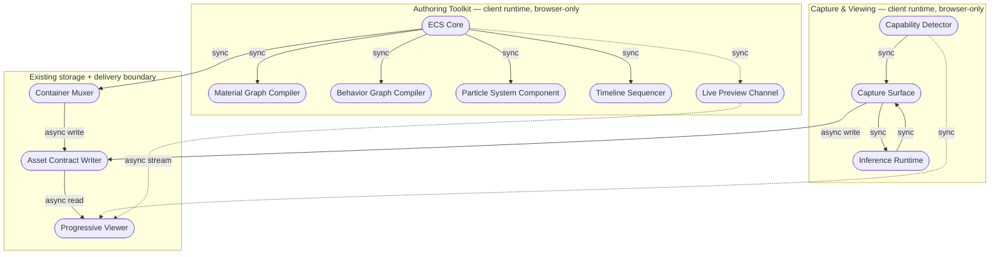

# Knowgrph AR/VR/XR — Device-Agnostic Capture, Viewing & Native In-Repo Spatial Authoring

**Contents**: Part I — PRD (Feature A: Capture & Viewing · Feature B: Native In-Repo Spatial Authoring Toolkit) · Part II — TAD · Part III — ADR-1 through ADR-9 · Part IV — Agent-Platform Readiness · Part V — Invocation Register · Part VI — Readiness Gap Matrix · Part VII — Validation Checklist Status

**Revision note (v2.0.0)**: supersedes v1.0.0. Feature A (Device-Agnostic AR/VR/XR Capture & Immersive Viewing Layer) is carried forward unchanged. Feature B (Native In-Repo Spatial Authoring Toolkit) is new — it replaces dependence on native desktop authoring/production tools with in-repo, browser-native equivalents. ADR-1 through ADR-3 are unchanged; ADR-4 through ADR-9 are new.

---

## Part I — Product Requirements (PRD)

### Feature A: Device-Agnostic AR/VR/XR Capture & Immersive Viewing Layer

#### Problem Statement
Users capturing real-world footage (event flyovers, launches, performances, or everyday spatial documentation) via a phone camera cannot currently connect that footage into Knowgrph's canvas/graph as an immersive, device-independent asset. Existing immersive-capture pipelines require dedicated calibrated stereo hardware or platform-locked native AR SDKs, defeating the browser-native, zero-TCO, min-viable-max-value orientation of the product. Meanwhile, no unified capability layer exists inside the repo to detect what a given device/browser can actually do (immersive session support, monocular-camera-only, or native handoff) and degrade gracefully. The opportunity: a capability-detected, progressive-enhancement XR layer that turns any phone camera into a usable spatial-capture device and any supported headset/browser into a compatible viewer, without new paid infrastructure.

#### Personas
- **Solo Builder / Operator** (primary; also the Founder) — captures event or product footage on a personal phone, wants it to render immersively inside Knowgrph's canvas and be viewable by others on whatever device they own.
- **Node/Graph Viewer** — opens a Knowgrph node on a phone, desktop, an Android-class immersive-capable headset, or an iOS-headset-class device, and expects a reasonable spatial experience regardless of device, without installing a native app.

#### User Journey Stage
Addresses the "capture → publish → view" segment of the Knowgrph asset lifecycle journey — the stage after a canvas node is created and before it is available as a shareable spatial artifact.

##### Journey: Solo Builder — Capture and publish a spatial asset from a phone

| Stage | Action | Touchpoint | Pain Point | Opportunity |
|---|---|---|---|---|
| Trigger | Wants to document a live event or object as a spatial asset | Knowgrph canvas, "capture" affordance | No existing capture path exists in-canvas | Add first-class capture entry point |
| Discover | Opens capture UI on whatever phone is on hand | Browser camera permission prompt | Uncertainty whether device is "AR capable" | Capability badge shown before capture starts |
| Engage | Records footage; sees live depth/parallax preview | In-canvas capture widget | Frame drops / thermal throttling on live synthesis | Default-to-live with automatic fallback to post-process |
| Complete | Footage becomes a viewable spatial node | Canvas node, asset contract | Output quality inconsistent across devices | Explicit capability tier stored with the asset, so viewers know what to expect |
| Return | Views the same node later on a different device | Canvas / headset viewer | No universal viewer path | Progressive-enhancement viewer (flat → parallax → immersive session) |

#### User Stories

**As a** solo builder **I want** to capture spatial video from any phone's camera **So that** I don't need dedicated stereo/immersive hardware to add spatial assets to a Knowgrph canvas. *(Journey: Trigger/Engage)*

**As a** solo builder **I want** the capture pipeline to run live depth-based stereo synthesis by default **So that** I get an immediate spatial preview without a separate processing step. *(Journey: Engage)*

**As a** solo builder **I want** live synthesis to fall back automatically to a post-process step **So that** capture never fails or drops frames on lower-powered devices. *(Journey: Engage/Complete)*

**As a** node/graph viewer **I want** the canvas to detect my device's XR capability **So that** I see the best available spatial experience without manual configuration. *(Journey: Discover/Return)*

**As a** node/graph viewer on a capable headset **I want** to open the same spatial asset in an immersive session where supported **So that** I don't need a separate native app to view Knowgrph content immersively. *(Journey: Return)*

#### Acceptance Criteria

**AC-1 — Capability detection**
**Given** a user opens the capture or viewer surface on any device **When** the page loads **Then** the runtime reports exactly one capability tier (`webxr-ar`, `webxr-vr`, `pseudo-ar-depth-parallax`, `flat-fallback`) before any capture or session action is offered.

> **VCC translation**: `Verify the capability-detection function returns exactly one tier value from the closed enum for a mocked device-feature matrix covering iOS-class, Android-class, headset-class, and desktop devices, and no tier is inferred from a user-agent string alone`

**AC-2 — Live capture default**
**Given** a device reports sufficient frame budget **When** the user starts capture **Then** monocular-depth-based stereo synthesis runs per-frame during capture and a live parallax preview is shown.

> **VCC translation**: `Verify the capture session emits a synthesized stereo frame pair for ≥90% of captured frames in a fixed-length test clip at target frame budget, with no frame written twice`

**AC-3 — Automatic post-process fallback**
**Given** live synthesis cannot sustain the frame budget **When** frame time exceeds the configured threshold for N consecutive frames **Then** the session drops to raw-capture-plus-depth-metadata mode and queues a post-process synthesis job on save, without failing the capture.

> **VCC translation**: `Verify a simulated frame-budget breach triggers fallback within N frames, capture continues to completion, and a post-process job record is written with the raw clip and depth-metadata reference`

**AC-4 — Progressive-enhancement viewing**
**Given** a saved spatial asset **When** it is opened on any supported device **Then** the viewer renders the asset at the highest tier the capability detection reports, and at minimum renders a flat 3D fallback on every device.

> **VCC translation**: `Verify the viewer component renders without throwing for each of the four capability tiers in a mocked matrix, and the flat-fallback tier is reachable with zero optional dependencies loaded`

**AC-5 — iOS engine reality**
**Given** the device is iOS-class (any installed browser on that platform) **When** capability is detected **Then** the tier never reports `webxr-ar` or `webxr-vr`, and resolves to `pseudo-ar-depth-parallax` or `flat-fallback` only.

> **VCC translation**: `Verify capability detection on an iOS-class user-agent/feature matrix never returns a webxr-* tier, for every browser variant in the test matrix`

#### Success Metrics

| Metric | Baseline | Target | Timeline |
|--------|----------|--------|----------|
| Capture sessions completed without failure | — (feature does not exist) | ≥95% of started sessions reach a saved asset | 30 days post-ship |
| Live-synthesis sustain rate (devices meeting frame budget) | — | ≥60% of capture sessions stay in live mode without triggering fallback | 30 days post-ship |
| Readiness rung (local / delivered) | `undocumented` / `undocumented` | `runtime-ready` / `runtime-ready` | Phase 3 gate |
| Time-to-value (TTV steps) | n/a | ≤3 steps (open capture → grant camera → start capture) | Phase 0 estimate, validated Phase 3 |
| Time-to-value (TTV elapsed) | n/a | ≤60 sec to first live parallax preview frame | Phase 0 estimate, validated Phase 3 |
| Token cost / month | n/a | $0.00 (all inference client-side; no LLM token spend in this feature) | Ongoing |
| Monthly TCO | n/a | $0.00 incremental (no new server compute, no new storage class) | Ongoing |
| ROI Score | — | ≥ solo-dev threshold (see ROI Calculation) | Sprint 1 |

**Time-to-Value detail**:

| Dimension | Estimate | Target ceiling | Validation method |
|---|---|---|---|
| TTV steps | 3 steps | ≤3 steps | Walk-through on clean env |
| TTV elapsed time | ~45 sec | ≤60 sec | Timed first-run test |
| First-value action | Live parallax preview frame rendered after camera grant | — | Observable output defined |
| Persona | Solo Builder / Operator | — | Persona defined above |

**ROI Calculation**:
```
User Impact = 4  (solo builder currently has no spatial-capture path at all; high pain, moderate frequency)
Reach       = 1  (solo operator + early node viewers; single-digit monthly sessions at this stage)
Build Hours = 40 (capability detection + capture layer + fallback + viewer wiring, estimate)
Monthly TCO = 0
Token Cost  = 0

ROI Score = (4 × 1) / (40 + 0 + 0) = 0.10
```
Low absolute reach keeps the raw ROI score low; the item is scoped Must-tier anyway because it unblocks the asset-contract's spatial-media class entirely (foundational, not reach-driven). This is an explicit MoSCoW override, documented below, consistent with the Min-Viable-Max-Value lens.

#### MoSCoW Priority

| Tier | Item | ROI score | Rationale |
|---|---|---|---|
| **Must** | Capability detection (4-tier enum) | n/a (foundational) | Every other item depends on a correct tier value; zero build cost to defer risk |
| **Must** | Capture layer: camera feed + monocular depth + live synthesis | 0.10 | Core deliverable; unblocks spatial-asset class |
| **Must** | Automatic post-process fallback | n/a (safety) | Prevents capture failure on lower-powered devices; required for AC-3 |
| **Should** | Progressive-enhancement viewer (flat → parallax → immersive session) | n/a (paired with capture) | Needed to consume what capture produces; can ship one tier at a time |
| **Should** | Markerless anchoring fallback for iOS-class in-canvas AR | n/a | Improves iOS-class experience but flat/parallax viewing works without it |
| **Could** | Native AR handoff for full 6DoF placement | n/a | High-fidelity but leaves the canvas runtime; defer until Must-tier proves demand |
| **Won't (this increment)** | Calibrated-stereo capture (purpose-built immersive-camera ingestion) | n/a | Out of zero-TCO envelope; a hardware-tier gap, not a browser-native capability gap |
| **Won't (this increment)** | Proprietary spatial-video container encoding | n/a | Requires a native toolchain outside the browser runtime; tracked as an explicit exclusion |

#### Min-Viable Scope
The smallest deliverable satisfying Must-tier acceptance criteria: capability detection returning one of four tiers; live capture with per-frame monocular-depth-based stereo synthesis; automatic fallback to raw-capture-plus-metadata with a queued post-process job when frame budget is exceeded. Explicitly excludes the viewer's immersive-session wiring, native AR handoff, and any calibrated-stereo or proprietary-container encoding path.

#### Out of Scope
- Purpose-built calibrated-stereo camera ingestion (hardware-tier capture)
- Proprietary spatial-video container encoding (native-toolchain-only muxing)
- Multi-device synchronized playback
- Server-side depth inference (this feature is client-side-only by design)

#### Dependencies
- Existing canvas rendering runtime (rendering baseline)
- Existing browser-native CV inference layer (monocular depth model, already selected under the FOSS gate — see ADR-2)
- Existing markerless-tracking component (already selected under the FOSS gate — see ADR-1)
- Existing native-handoff component for 3D model presentation (already selected under the FOSS gate — see ADR-1)
- The existing asset-contract schema, extended with an XR-capability field (see TAD Integration Contracts)

#### Open Questions
- What frame-time threshold (ms) should trigger the live→post-process fallback, and should it be device-class-tunable or a single global constant?
- Should the post-process job run as a foreground "processing…" state on the asset node, or a background job the user can navigate away from?
- Does the `pseudo-ar-depth-parallax` tier need its own explicit user-facing label, or should it be presented identically to `flat-fallback` with parallax as an invisible enhancement?

---

### Feature B: Native In-Repo Spatial Authoring Toolkit

#### Problem Statement
To author spatial scenes, materials, behaviors, particle effects, rigged animation, or to manage and package immersive video libraries, the solo builder currently has to leave the repo entirely and use native desktop applications — a visual spatial-authoring IDE with node-based material/behavior/particle graphs, a consumer-grade AR scene composer, a dedicated immersive-video library/packaging utility, and a full 3D content-creation suite. Each is native-desktop-only, breaking the zero-install, browser-native, single-codebase posture, and introducing a platform dependency that blocks the cross-platform SEA/China market orientation. The opportunity: build the equivalent authoring capability natively in-repo, running entirely in-browser, with zero dependency on any native desktop application.

#### Personas
- **Solo Builder / Operator** (primary) — authors spatial scenes, materials, behaviors, particle effects, and animation without leaving the browser or requiring a specific desktop OS.
- **Node/Graph Viewer** — benefits indirectly: assets authored through this toolkit conform to the same asset contract as Feature A's captured assets, so viewing behavior is unaffected by which tool authored the content.

#### User Journey Stage
Addresses the "author → preview → publish" segment of the Knowgrph asset lifecycle — upstream of Feature A's "capture → publish → view" segment, converging on the same asset-contract publish step.

##### Journey: Solo Builder — Author a spatial scene entirely in-browser

| Stage | Action | Touchpoint | Pain Point | Opportunity |
|---|---|---|---|---|
| Trigger | Wants to build a spatial scene or behavior without opening a native authoring app | Knowgrph canvas, "author" affordance | No in-canvas authoring surface exists | Add first-class authoring entry point |
| Discover | Opens in-canvas authoring surface | Authoring UI shell | Uncertainty about what's authorable in-browser vs. native-only | Explicit capability/feature-parity notice |
| Engage | Composes entities/components, wires material and behavior graphs, authors particles, sequences animation | Node graph editor, timeline, viewport | Authoring tools historically require a native IDE | Full authoring loop stays in one browser tab |
| Complete | Scene exports as a published asset | Canvas node, asset contract | Format lock-in to a native-only container | Publishes through the same asset-contract path as captured assets |
| Return | Edits the scene later | Authoring UI | Round-tripping through a native app to make a small change | Same in-browser editor reopens the same scene |

#### User Stories

**As a** solo builder **I want** to compose scenes from entities and components in-browser **So that** I don't need a native entity-component-system authoring environment. *(Journey: Engage)*

**As a** solo builder **I want** to author materials visually via a node graph **So that** I don't need a native shader-graph tool. *(Journey: Engage)*

**As a** solo builder **I want** to wire trigger-to-behavior logic visually **So that** I don't need a native behavior/script-graph tool. *(Journey: Engage)*

**As a** solo builder **I want** to author and preview GPU particle effects in-canvas **So that** I don't need a native particle-authoring tool. *(Journey: Engage)*

**As a** solo builder **I want** to rig and sequence animation on a timeline **So that** I don't need a native DCC's animation/timeline editor. *(Journey: Engage)*

**As a** solo builder **I want** to manage and package captured immersive video into deliverable containers in-browser **So that** I don't need a native immersive-video library utility. *(Journey: Engage/Complete)*

**As a** solo builder **I want** live edit-to-viewer preview **So that** I don't need a native live-preview-plus-companion-display workflow. *(Journey: Engage)*

#### Acceptance Criteria

**AC-6 — ECS scene composition**
**Given** an empty canvas **When** the builder adds an entity and attaches components **Then** the entity renders with those components applied and the scene is queryable by component type.

> **VCC translation**: `Verify a test scene with N entities and M component types returns the correct entity set for a component-type query, with no entity duplicated in the result`

**AC-7 — Node-based material authoring**
**Given** a node-material graph is wired **When** it is compiled **Then** the resulting material renders on the target mesh matching the graph's evaluated output.

> **VCC translation**: `Verify a reference node graph (e.g. albedo × texture → output) produces a compiled shader that renders without error on a test mesh`

**AC-8 — Visual behavior/script graph**
**Given** a trigger node is connected to an action node **When** the trigger event fires **Then** the action node's effect is invoked exactly once.

> **VCC translation**: `Verify a simulated trigger event invokes the wired action callback exactly once, and an unwired trigger produces no callback`

**AC-9 — Particle authoring**
**Given** a particle-emitter configuration **When** the emitter runs **Then** particle count stays within the configured rate/lifetime/ceiling bounds.

> **VCC translation**: `Verify particle count never exceeds the configured ceiling over a fixed-duration test run`

**AC-10 — Animation timeline/sequencing**
**Given** a rigged entity and a keyframe sequence **When** played back **Then** interpolated bone/property values match expected values between keyframes.

> **VCC translation**: `Verify interpolated values at a sampled time match expected values within tolerance for a reference keyframe set`

**AC-11 — In-browser packaging**
**Given** a captured raw clip and its encoded tracks **When** packaging runs **Then** a single deliverable container is produced containing those tracks, playable in a standard browser video element.

> **VCC translation**: `Verify the produced container's track count and codec match the input, and the file plays back without error in a headless browser test`

**AC-12 — Live edit-to-device preview**
**Given** an authoring session and a connected viewer session **When** an edit is made **Then** the change appears in the viewer session within a bounded latency, without a build step.

> **VCC translation**: `Verify a test edit event propagates to a mock viewer session within N ms, with no full-page reload triggered`

#### Success Metrics

| Metric | Baseline | Target | Timeline |
|--------|----------|--------|----------|
| Authoring sessions completed without a native-app handoff | — (feature does not exist) | 100% of scenes authored end-to-end in-browser | 30 days post-ship |
| Live-preview propagation latency | — | ≤ N ms (see Open Questions) | 30 days post-ship |
| Readiness rung (local / delivered) | `undocumented` / `undocumented` | `runtime-ready` / `runtime-ready` | Phase 3 gate |
| Time-to-value (TTV steps) | n/a | ≤4 steps (open authoring UI → add entity → attach component → see it render) | Phase 0 estimate, validated Phase 3 |
| Time-to-value (TTV elapsed) | n/a | ≤90 sec to first rendered entity | Phase 0 estimate, validated Phase 3 |
| Token cost / month | n/a | $0.00 (no LLM-backed component in this feature) | Ongoing |
| Monthly TCO | n/a | $0.00 incremental | Ongoing |
| ROI Score | — | ≥ solo-dev threshold (see ROI Calculation) | Sprint 1 |

**ROI Calculation**:
```
User Impact = 4  (currently requires leaving the repo for native tools entirely; high pain, recurring)
Reach       = 1  (solo operator at this stage)
Build Hours = 90 (ECS core + node graph engine + two compiler backends, estimate; excludes Could-tier items)
Monthly TCO = 0
Token Cost  = 0

ROI Score = (4 × 1) / (90 + 0 + 0) = 0.04
```
Even lower raw ROI than Feature A given the larger build-hour estimate; retained as Must/Should-tier for the ECS core and material graph specifically because they are foundational (every other authoring primitive depends on them), consistent with the Min-Viable-Max-Value lens's foundational-item override.

#### MoSCoW Priority

| Tier | Item | ROI score | Rationale |
|---|---|---|---|
| **Must** | ECS Core (custom in-repo scene model) | n/a (foundational) | Every other authoring primitive attaches to this |
| **Must** | Material Graph Compiler (node-based) | 0.04 | Highest-value single authoring primitive; replaces the most-used native tool surface |
| **Should** | Behavior Graph Compiler (node-based) | n/a | Depends on ECS Core and the shared graph engine from the Material Graph Compiler item |
| **Should** | Container Muxer (in-browser packaging) | n/a | Closes the loop with Feature A's capture output; narrow, bounded scope |
| **Could** | Particle System Component | n/a | Polish item; not blocking for a first authored scene |
| **Could** | Timeline Sequencer | n/a | Polish item; depends on ECS Core and rigging, larger build cost |
| **Could** | Live Preview Channel | n/a | Ergonomics improvement; authoring works without it via manual refresh |
| **Won't (this increment)** | Full mesh sculpting / topology editing | n/a | DCC-grade modeling is a separate, large scope; not evaluated in this increment |
| **Won't (this increment)** | OpenUSD scene interchange | n/a | License gate failure at current OpenUSD terms; see ADR-9 |

#### Min-Viable Scope
The smallest deliverable satisfying Must-tier acceptance criteria: ECS Core (entity/component storage and query) and the Material Graph Compiler (node-based material authoring compiling to the existing shading-language node-material system). Explicitly excludes the Behavior Graph Compiler, Particle System Component, Timeline Sequencer, Container Muxer, and Live Preview Channel.

#### Out of Scope
- Full mesh sculpting / topology editing (DCC-grade modeling)
- OpenUSD-based scene composition (see ADR-9)
- Multi-user real-time collaborative editing
- Any server-side rendering or compute for authoring (client-side-only by design, matching Feature A)

#### Dependencies
- Existing canvas rendering runtime (shared with Feature A)
- Existing asset-contract schema, extended with a behavior-graph contract (see TAD Integration Contracts)
- Existing generative-asset-creation pipeline (unchanged by this feature; referenced, not modified, for any future "generate a starting asset" affordance)
- Feature A's Asset Contract Writer and Progressive Viewer (shared publish/view path)

#### Open Questions
- Should Feature A's Capture Surface and Inference Runtime eventually migrate onto ECS Core as their scene model, or remain independent function-based components indefinitely?
- Should the behavior-graph contract be a new top-level schema or a nested extension of the existing asset-contract schema?
- What is the acceptable live-preview propagation latency ceiling (drives AC-12's `N ms` parameter)?

---

## Part II — Technical Architecture (TAD)

### Architecture: Device-Agnostic Capture, Viewing & Native In-Repo Spatial Authoring

#### Overview
**From phone camera feed and in-browser authoring to a published spatial asset**: [Capture Surface | Authoring Toolkit] → Capability Detection / ECS Core → asset-contract publish → Progressive-Enhancement Viewer → delivers a spatial asset viewable at the best tier any given device supports and authorable entirely in-browser, with zero incremental infrastructure cost and zero native-application dependency.

#### Journey → System Mapping

| Journey Stage | Workflow | Data Flow | Orchestration/Harness Flow | Topology Node(s) | Component |
|---|---|---|---|---|---|
| Capture: Trigger/Discover | Capture Init Workflow | — | — | Capture Surface | Capability Detector |
| Capture: Engage | Live Capture Workflow | Capture Data Flow | Depth Synthesis Harness Flow | Capture Surface, Inference Runtime | Monocular Depth Component, DIBR Synthesizer |
| Capture: Complete | Save & Publish Workflow | Capture Data Flow | Post-Process Fallback Harness Flow (conditional) | Asset Store | Asset Contract Writer |
| Capture: Return | View Workflow | Viewer Data Flow | — | Viewer Surface | Progressive Viewer |
| Author: Trigger/Discover | Authoring Init Workflow | — | — | Authoring Surface | ECS Core |
| Author: Engage | Scene Composition Workflow | Authoring Data Flow | — (deterministic compilers; no AI-powered pipeline) | Authoring Surface | Material Graph Compiler, Behavior Graph Compiler, Particle System Component, Timeline Sequencer |
| Author: Complete | Save & Publish Workflow | Authoring Data Flow | — | Asset Store | Container Muxer, Asset Contract Writer |
| Author: Return | Live Preview Workflow | Viewer Data Flow | — | Authoring Surface, Viewer Surface | Live Preview Channel |

#### Topology
**Version**: 2 — 2026-08-03
**Boundaries**: Client runtime (browser, any device); no server-side boundary crossed by either feature in this document

**Capture & Viewing nodes** *(unchanged from v1)*:

| Node | Role | Type | Lane | Connects to | Connection type | Data residency |
|---|---|---|---|---|---|---|
| Capability Detector | Producer | Function (client-side) | Authoring | Capture Surface, Progressive Viewer | Sync in-process call | Local (device memory only) |
| Capture Surface | Producer/Consumer | Function (client-side) | Authoring | Inference Runtime, Asset Contract Writer | Sync in-process call | Local (device memory) |
| Inference Runtime | Producer | Function (client-side model runtime) | Authoring | Capture Surface | Sync in-process call | Local (device memory; no network egress) |
| Asset Contract Writer | Consumer/Store | Function → Storage adapter | Authoring/Delivery | Existing asset store | Async write | Region (existing storage residency, unchanged) |
| Progressive Viewer | Consumer | Function (client-side) | Delivery | Asset Contract Writer (read) | Async read | Region (same as Asset Contract Writer) |

**Authoring Toolkit nodes** *(new in v2)*:

| Node | Role | Type | Lane | Connects to | Connection type | Data residency |
|---|---|---|---|---|---|---|
| ECS Core | Store/Router | Function (client-side, in-repo) | Authoring | Material Graph Compiler, Behavior Graph Compiler, Particle System Component, Timeline Sequencer, Live Preview Channel | Sync in-process call | Local (device memory only) |
| Material Graph Compiler | Producer | Function (client-side) | Authoring | ECS Core | Sync in-process call | Local |
| Behavior Graph Compiler | Producer | Function (client-side) | Authoring | ECS Core | Sync in-process call | Local |
| Particle System Component | Producer | Function (client-side, GPU-backed) | Authoring | ECS Core | Sync in-process call | Local |
| Timeline Sequencer | Producer | Function (client-side) | Authoring | ECS Core | Sync in-process call | Local |
| Container Muxer | Consumer | Function (client-side) | Authoring | Asset Contract Writer *(shared with Feature A)* | Async write | Region (existing storage residency) |
| Live Preview Channel | Router | Function (client-side) + existing transport | Authoring/Delivery | Progressive Viewer *(shared with Feature A)* | Async stream | Local/Region (no new persistence) |



**Version notes**: v2 adds the Authoring Toolkit subgraph and its `Container Muxer` / `Live Preview Channel` bridge nodes into the shared Delivery boundary. No storage class or network egress path changes from v1 — every new node is client-side only, and `Container Muxer` writes through the same `Asset Contract Writer` path Feature A already uses.

#### Orchestration/Harness Flows

**Pipeline**: Depth Synthesis Harness Flow *(unchanged from v1)*
**Topology pattern**: Sequential | **Max iterations**: 1 per frame | **Circuit-breaker**: N consecutive frame-budget breaches triggers fallback exit
**Token budget**: 0 prompt + 0 completion = $0.00 / call

| Role | Component | Input schema | Output schema | Cost log | Fallback |
|---|---|---|---|---|---|
| Dispatcher | Capture Surface | `{ frame: ImageBitmap, timestamp }` | `{ frame, depthRequest }` | — | Drop frame, continue capture |
| Executor | Inference Runtime | `{ frame, depthRequest }` | `{ depthMap, confidence }` | ✓ (frame_ms, model_id, device_class) | Frame-budget breach → exit to Post-Process Fallback Harness Flow |
| Observer | In-session frame-time logger | `{ frame_ms stream }` | `{ rolling avg, breach count }` | — | Silent fail; capture continues |
| Consumer | DIBR Synthesizer | `{ frame, depthMap }` | `{ stereoPairFrame }` | — | Upstream error → raw frame retained, depth discarded for that frame |

**Postconditions**: every captured frame is either a synthesized stereo pair or a raw frame with retained depth metadata; no frame lost; no unbounded retry loop; zero token spend.

---

**Pipeline**: Post-Process Fallback Harness Flow *(unchanged from v1)*
**Topology pattern**: Sequential | **Max iterations**: 1 pass over the saved clip | **Circuit-breaker**: n/a (single bounded pass)
**Token budget**: 0 prompt + 0 completion = $0.00 / call

| Role | Component | Input schema | Output schema | Cost log | Fallback |
|---|---|---|---|---|---|
| Dispatcher | Asset Contract Writer | `{ rawClipRef, depthMetadataRef }` | `{ jobRecord }` | — | Reject with typed error if clip ref unresolvable |
| Executor | Inference Runtime (batch mode) | `{ frame stream }` | `{ depthMap stream }` | ✓ required | Degraded mode: publish asset at `flat-fallback` tier without stereo synthesis |
| Observer | Job status logger | `{ progress stream }` | `{ percent complete }` | — | Silent fail; job continues |
| Consumer | Asset Contract Writer | `{ stereoPairFrame stream }` | `{ published asset, xr_capability_tier }` | — | Upstream error propagation to asset status field |

**Postconditions**: asset's `xr_capability_tier` field reflects the actually-achieved output tier; job record persisted; no unbounded retry.

---

**Authoring Toolkit — no new Orchestration/Harness Flow introduced.** None of the seven Authoring Toolkit components are AI/model-backed: ECS Core, the two graph compilers, the particle system, the timeline sequencer, the container muxer, and the live-preview channel are all deterministic, client-side functions. Any future "generate a starting asset" affordance continues to route through the existing generative-asset-creation pipeline (see Feature B Dependencies) unchanged by this document — that pipeline's own Orchestration/Harness Flow is documented in its own PRD/TAD, not duplicated here.

#### Component Specifications

*(Feature A components are unchanged from v1; carried forward for traceability continuity with ADR-1 and ADR-2.)*

**Component**: Capability Detector
**Responsibility**: Capability Detector determines the client's XR tier from feature probes, never from user-agent string matching alone.
**Interfaces**: `detectXRCapabilities(): { tier: 'webxr-ar'|'webxr-vr'|'pseudo-ar-depth-parallax'|'flat-fallback', modules: {...} }`
**Dependencies**: Browser feature APIs only; no external service call
**Configuration**: None externalized; tier enum is closed and versioned with this component
**FOSS / Vendor**: FOSS (standard browser APIs only; no dependency to evaluate)
**VCC Conditions**: AC-1, AC-5
**Evidence References**: *(none yet)*
**Readiness rung**: Local: `spec-complete` / Delivered: `undocumented`

---

**Component**: Capture Surface
**Responsibility**: Capture Surface reads the device camera feed and dispatches frames to the synthesis harness at the capability-appropriate rate.
**Interfaces**: `startCapture(tier): CaptureSession`; `CaptureSession.onFrame(callback)`
**Dependencies**: Capability Detector, Inference Runtime, Asset Contract Writer
**Configuration**: Frame-budget breach threshold (ms), consecutive-breach count N — externalized
**FOSS / Vendor**: FOSS (standard browser media-capture API)
**VCC Conditions**: AC-2, AC-3
**Evidence References**: *(none yet)*
**Readiness rung**: Local: `spec-complete` / Delivered: `undocumented`

---

**Component**: Inference Runtime (monocular depth estimation)
**Responsibility**: Inference Runtime produces a per-frame depth map from a single camera frame without a server round-trip.
**Interfaces**: `estimateDepth(frame: ImageBitmap): { depthMap, confidence }`
**Dependencies**: Browser-native model-inference runtime (already selected under the FOSS gate — see ADR-2)
**Configuration**: Model variant selectable by device-class, externalized
**FOSS / Vendor**: FOSS — see **Reference implementation** in ADR-2
**Harness Contract**:
  - Input schema: `{ frame: ImageBitmap }`
  - Output schema: `{ depthMap: Float32Array, confidence: number }`
  - Cost log fields: `{ model: 'depth-estimator', prompt_tokens: 0, completion_tokens: 0, cache_hits: 0, estimated_cost_usd: 0.00 }`
  - Fallback path: degraded response (skip stereo synthesis for that frame)
**Token Budget**: 0 + 0 @ n/a cache rate = $0.00/request
**Orchestration Topology**: Sequential — max 1 iteration per frame; no retry, drop-and-continue on failure
**VCC Conditions**: AC-2, AC-3
**Evidence References**: *(none yet)*
**Readiness rung**: Local: `spec-complete` / Delivered: `undocumented`

---

**Component**: DIBR Synthesizer
**Responsibility**: DIBR Synthesizer produces a stereo pair frame from a raw frame and its depth map using depth-image-based rendering.
**Interfaces**: `synthesizeStereoPair(frame, depthMap): { left, right }`
**Dependencies**: Inference Runtime output
**Configuration**: Baseline eye-separation constant, externalized
**FOSS / Vendor**: FOSS (implemented in-repo; no external dependency)
**VCC Conditions**: AC-2
**Evidence References**: *(none yet)*
**Readiness rung**: Local: `spec-complete` / Delivered: `undocumented`

---

**Component**: Markerless Anchoring Fallback *(Should-tier)*
**Responsibility**: Markerless Anchoring Fallback provides in-canvas image/face-target tracking on devices without a native immersive-session API.
**Interfaces**: `startAnchoredSession(target): AnchorSession`
**Dependencies**: Capability Detector (`pseudo-ar-depth-parallax` tier)
**Configuration**: Target asset reference
**FOSS / Vendor**: FOSS — see **Reference implementation** in ADR-1
**VCC Conditions**: *(deferred to a follow-on Phase 1 pass)*
**Evidence References**: *(none yet)*
**Readiness rung**: Local: `undocumented` / Delivered: `undocumented`

---

**Component**: Native Handoff Bridge *(Could-tier)*
**Responsibility**: Native Handoff Bridge hands a placement-ready 3D asset to the platform's native AR viewer for full positional tracking.
**Interfaces**: exposes a platform-native model-viewing link generated from the published asset
**Dependencies**: Asset Contract Writer output
**Configuration**: None
**FOSS / Vendor**: FOSS — see **Reference implementation** in ADR-1
**VCC Conditions**: *(deferred)*
**Evidence References**: *(none yet)*
**Readiness rung**: Local: `undocumented` / Delivered: `undocumented`

---

**Component**: Progressive Viewer
**Responsibility**: Progressive Viewer renders a published spatial asset at the highest capability tier the current device reports.
**Interfaces**: `renderAsset(assetRef): ViewerSession`
**Dependencies**: Capability Detector, Asset Contract Writer (read), Live Preview Channel (optional, authoring-time only)
**Configuration**: Tier-to-renderer mapping table, externalized
**FOSS / Vendor**: FOSS (existing canvas runtime; immersive-session entry point uses the standard browser immersive-session API where reported available)
**VCC Conditions**: AC-4
**Evidence References**: *(none yet)*
**Readiness rung**: Local: `spec-complete` / Delivered: `undocumented`

---

*(New Authoring Toolkit components — Feature B.)*

**Component**: ECS Core
**Responsibility**: ECS Core stores entities and components in typed arrays and executes systems per frame, providing the shared scene model for every other Authoring Toolkit component.
**Interfaces**: `createWorld()`, `addEntity(world)`, `addComponent(world, eid, Component)`, `query(world, [Components])`
**Dependencies**: None (self-contained, in-repo)
**Configuration**: Component schema registry, externalized
**FOSS / Vendor**: FOSS — custom in-repo build (see ADR-4; no external dependency)
**VCC Conditions**: AC-6
**Evidence References**: *(none yet)*
**Readiness rung**: Local: `spec-complete` / Delivered: `undocumented`

---

**Component**: Material Graph Compiler
**Responsibility**: Material Graph Compiler evaluates a node-material graph into a compiled shader targeting the existing node-material rendering system.
**Interfaces**: `compileMaterialGraph(graphDef): CompiledMaterial`
**Dependencies**: ECS Core (entity/material binding), shared Node Graph Engine
**Configuration**: Node-type registry, externalized
**FOSS / Vendor**: FOSS — see **Reference implementation** in ADR-5
**VCC Conditions**: AC-7
**Evidence References**: *(none yet)*
**Readiness rung**: Local: `spec-complete` / Delivered: `undocumented`

---

**Component**: Behavior Graph Compiler
**Responsibility**: Behavior Graph Compiler evaluates a node-based trigger/action graph into typed event-dispatch bindings against ECS Core.
**Interfaces**: `compileBehaviorGraph(graphDef): CompiledBehavior`
**Dependencies**: ECS Core, shared Node Graph Engine, the `kgc-behavior-graph/v1` contract (see Integration Contracts)
**Configuration**: Trigger/action node-type registry, externalized
**FOSS / Vendor**: FOSS — see **Reference implementation** in ADR-5
**VCC Conditions**: AC-8
**Evidence References**: *(none yet)*
**Readiness rung**: Local: `spec-complete` / Delivered: `undocumented`

---

**Component**: Particle System Component *(Could-tier)*
**Responsibility**: Particle System Component manages GPU particle emitters bound to ECS entities within configured rate/lifetime/count bounds.
**Interfaces**: `createEmitter(config): EmitterHandle`
**Dependencies**: ECS Core
**Configuration**: Emitter presets, externalized
**FOSS / Vendor**: FOSS — see **Reference implementation** in ADR-6
**VCC Conditions**: AC-9
**Evidence References**: *(none yet)*
**Readiness rung**: Local: `spec-complete` / Delivered: `undocumented`

---

**Component**: Timeline Sequencer *(Could-tier)*
**Responsibility**: Timeline Sequencer interpolates keyframed bone/property values over a scrubbable timeline for a rigged entity.
**Interfaces**: `createSequence(entity, keyframes): SequenceHandle`
**Dependencies**: ECS Core
**Configuration**: Interpolation-curve presets, externalized
**FOSS / Vendor**: FOSS — see **Reference implementation** in ADR-8
**VCC Conditions**: AC-10
**Evidence References**: *(none yet)*
**Readiness rung**: Local: `spec-complete` / Delivered: `undocumented`

---

**Component**: Container Muxer
**Responsibility**: Container Muxer packages already-encoded WebCodecs track output into a single standard, browser-playable deliverable container.
**Interfaces**: `muxTracks(encodedChunks[]): ContainerFile`
**Dependencies**: Browser-native WebCodecs API output (from Feature A's capture pipeline or Authoring Toolkit exports)
**Configuration**: Target container format (MP4 | WebM), externalized
**FOSS / Vendor**: FOSS — custom in-repo build (see ADR-7; no external dependency)
**VCC Conditions**: AC-11
**Evidence References**: *(none yet)*
**Readiness rung**: Local: `spec-complete` / Delivered: `undocumented`

---

**Component**: Live Preview Channel *(Could-tier)*
**Responsibility**: Live Preview Channel propagates authoring-session edit deltas to connected viewer sessions with bounded latency.
**Interfaces**: `publishEdit(delta)`, `subscribeToEdits(callback)`
**Dependencies**: ECS Core, Progressive Viewer, existing dev-transport infrastructure already in the stack
**Configuration**: Propagation-latency ceiling, externalized (see Feature B Open Questions)
**FOSS / Vendor**: FOSS (zero new dependency; reuses existing transport infrastructure)
**VCC Conditions**: AC-12
**Evidence References**: *(none yet)*
**Readiness rung**: Local: `spec-complete` / Delivered: `undocumented`

#### Integration Contracts

**Interface**: `xr_capability_tier` asset field *(unchanged from v1)* | **Protocol**: In-process function call + existing storage adapter | **Format**: JSON (extends the existing asset-contract schema) | **Errors**: Unresolvable clip/metadata reference → typed error surfaced to the Asset Contract Writer caller; asset not published

```json
{
  "xr_capability_tier": "webxr-ar | webxr-vr | pseudo-ar-depth-parallax | flat-fallback",
  "synthesis_mode": "live | post-process | none",
  "depth_metadata_ref": "string | null",
  "fallback_triggered": "boolean"
}
```

**Interface**: `kgc-behavior-graph/v1` contract *(new in v2)* | **Protocol**: In-process function call + existing storage adapter | **Format**: JSON/YAML, consistent with the existing markdown-as-SSOT convention | **Errors**: Malformed graph definition → typed compile error surfaced to the Behavior Graph Compiler caller; graph not published

```json
{
  "graph_id": "string",
  "nodes": [ { "id": "string", "type": "trigger | action | logic", "config": {} } ],
  "edges": [ { "from": "node_id", "to": "node_id" } ],
  "bound_entity": "ecs_entity_id | null"
}
```

#### Architectural Decisions
See ADR-1 (anchoring/tracking layer selection), ADR-2 (monocular depth inference layer selection), ADR-3 (browser-native vs. native-app capture strategy), ADR-4 (ECS scene model), ADR-5 (node-based visual graph framework), ADR-6 (GPU particle system), ADR-7 (media container muxing strategy), ADR-8 (animation timeline/sequencer), ADR-9 (scene interchange format) below.

#### Quality Attributes

*Applies uniformly to both Feature A and Feature B components — both share the same client-side-only, zero-egress architecture posture.*

| Attribute | Scenario | Pattern | Validation |
|---|---|---|---|
| Performance | Live synthesis and live authoring/preview must sustain target frame budget on a mid-tier device | Frame-budget monitor + automatic fallback exit (capture); direct-manipulation editing with no server round-trip (authoring) | Timed capture and authoring sessions on reference device; frame-time histogram |
| Scalability | N/A — client-side only, no server component to scale | — | — |
| Security | Camera access must be user-granted per session; no frame data leaves the device; authoring data stays local until publish | Browser permission API; no network call in Inference Runtime or Authoring Toolkit compilers | Manual permission-denial pass; network-tab audit showing zero egress during capture and authoring |
| Observability | Frame-time breaches, fallback triggers, and graph-compile errors must be visible in local session diagnostics | In-session logger (no network telemetry) | Manual diagnostics-panel review during a forced-fallback test and a forced-compile-error test |
| Token Cost | All inference and all authoring compilation is local; target is $0.00/session regardless of load | Client-side model runtime and deterministic compilers, no hosted LLM call | Cost log sampling confirms `estimated_cost_usd: 0` on every frame and every graph compile |
| Offline Behaviour | Capture, live synthesis, and authoring must work with no network connectivity; publish step queues if offline | Local-first state with deferred publish reconciliation | Airplane-mode capture and authoring pass; reconciliation replay test on reconnect |
| TCO | Zero incremental infrastructure cost across both features — no new compute, storage class, or egress path | Client-side-only architecture | Monthly cost audit shows no delta attributable to either feature |
| Device Reach | Must run acceptably on iOS-class, Android-class, headset-class, and desktop devices for both capture and authoring | Progressive enhancement; feature probes, not user-agent branching | Cross-device manual pass covering all four capability tiers, for both features |

#### Deployment Strategy
Both features are client-side-only and ship as part of the existing canvas bundle; no server-side deployment surface. Rollout is a standard canvas-bundle release through the existing Authoring → Mirror → Delivery lane sequence (see Deploy Boundary Register). Rollback is a bundle revert; no data migration involved since both the `xr_capability_tier` and `kgc-behavior-graph/v1` extensions are additive and optional-field-safe for older assets.

#### Architecture Diagrams
See Topology diagram above; see Orchestration/Harness Flow tables above. Sequence-level diagrams are added at implementation time per the Guideline Load Budget.

#### Component Inventory

| Feature | Layer | Component | File / Module | Local rung | Delivered rung |
|---|---|---|---|---|---|
| A | Capability | Capability Detector | `xr/capability-detector` *(indicative)* | `spec-complete` | `undocumented` |
| A | Capture | Capture Surface | `xr/capture-surface` | `spec-complete` | `undocumented` |
| A | Inference | Inference Runtime | `xr/depth-inference` | `spec-complete` | `undocumented` |
| A | Synthesis | DIBR Synthesizer | `xr/dibr-synthesizer` | `spec-complete` | `undocumented` |
| A | Anchoring | Markerless Anchoring Fallback | `xr/anchoring-fallback` | `undocumented` | `undocumented` |
| A | Handoff | Native Handoff Bridge | `xr/native-handoff` | `undocumented` | `undocumented` |
| A | Viewer | Progressive Viewer | `xr/progressive-viewer` | `spec-complete` | `undocumented` |
| B | Scene model | ECS Core | `xr/authoring/ecs-core` *(indicative)* | `spec-complete` | `undocumented` |
| B | Materials | Material Graph Compiler | `xr/authoring/material-graph` | `spec-complete` | `undocumented` |
| B | Behavior | Behavior Graph Compiler | `xr/authoring/behavior-graph` | `spec-complete` | `undocumented` |
| B | Particles | Particle System Component | `xr/authoring/particle-system` | `spec-complete` | `undocumented` |
| B | Animation | Timeline Sequencer | `xr/authoring/timeline-sequencer` | `spec-complete` | `undocumented` |
| B | Packaging | Container Muxer | `xr/authoring/container-muxer` | `spec-complete` | `undocumented` |
| B | Preview | Live Preview Channel | `xr/authoring/live-preview-channel` | `spec-complete` | `undocumented` |

#### Deploy Boundary Register

| Boundary | From lane | To lane | Evidence Reference | Operator instruction | Rollback statement | State |
|---|---|---|---|---|---|---|
| Authoring → Mirror | Authoring | Mirror | *(named local test suite pass — recorded at Phase 3)* | none | Revert to prior canvas bundle version | `closed` |
| Mirror → Delivery | Mirror | Delivery | *(named mirror-environment pass — recorded at Phase 3)* | none | Revert to prior published bundle; both asset-contract extensions are additive so no data rollback required | `closed` |

---

## Part III — Architectural Decision Records (ADR)

### ADR-1: Anchoring & Tracking Layer Selection
**Status**: Proposed
**Date**: 2026-08-02

#### Context
Real-world anchoring/tracking must work across a fragmented capability landscape: native session-based hit-testing on some platforms, no equivalent API at all on others. A single anchoring strategy cannot cover every device.

#### Decision
Use a tiered anchoring strategy: native session-based hit-testing where the platform reports it, a markerless image/face-target tracking library as the universal client-side fallback, and a native-viewer handoff path for devices that support it, as a Could-tier enhancement rather than the default path.

#### Alternatives Considered
1. **Native session-based hit-testing only**: Pros — highest fidelity, real-world plane anchoring. Cons — unavailable on a large share of target devices (see PRD AC-5); would leave those devices with no AR path at all.
2. **Markerless tracking library (FOSS alternative)**: Pros — works identically across every browser, no platform-API dependency, permissively licensed. Cons — target-anchored rather than free-floating-surface-anchored; not a full substitute for real 6DoF placement.
3. **Native-viewer handoff only**: Pros — full native fidelity when it fires. Cons — leaves the in-canvas experience entirely; not usable as a default path for an in-canvas feature.

#### Rationale
No single option covers the full device matrix at zero TCO. The markerless tracking library is selected as the default/universal layer because it is the only option that works everywhere without a platform-API dependency; native hit-testing and native-viewer handoff are layered on top as capability-detected enhancements, not replacements.

**Reference implementation**: markerless tracking is implemented via MindAR.js (MIT license); native-viewer handoff is implemented via a `<model-viewer>`-class web component (Apache-2.0 license) generating a platform-native model-viewing link.

#### TCO Impact

| Dimension | Chosen Option [Provisioned/Self-Managed — bundled client library] | Best FOSS Alternative [same variant] | Delta / 12 months |
|---|---|---|---|
| Infra cost | $0/mo | $0/mo | $0 |
| Egress cost | $0/mo | $0/mo | $0 |
| Token cost | $0/mo | $0/mo | $0 |
| Ops burden | Low | Low | — |
| Vendor risk | Low — permissive license, no vendor lock-in | Low | — |

#### Consequences
- **Positive**: universal device coverage at $0 TCO; no new vendor dependency beyond what's already FOSS-gated
- **Negative**: markerless tracking is target-anchored, not free-surface-anchored
- **Neutral**: native-viewer handoff remains a Could-tier item, tracked separately

---

### ADR-2: Monocular Depth Inference Layer Selection
**Status**: Proposed
**Date**: 2026-08-02

#### Context
Stereo/spatial synthesis needs a depth signal from a single phone camera, without relying on platform-specific depth sensors (unevenly available) or a server round-trip.

#### Decision
Run a monocular depth-estimation model entirely client-side, using it as the universal depth source regardless of whether a platform-native depth sensor exists.

#### Alternatives Considered
1. **Platform-native depth-sensing API (where available)**: Pros — hardware-accurate depth. Cons — inconsistent availability; would leave most devices with no depth signal if made primary.
2. **Server-side depth inference (FOSS alternative model, hosted)**: Pros — offloads compute. Cons — network round-trip, egress cost, server dependency this feature avoids by design.
3. **Client-side monocular depth model (chosen)**: Pros — works on any device with a camera, zero egress, zero server cost. Cons — relative depth only, needs additional smoothing.

#### Rationale
Only the client-side monocular option satisfies zero-egress, universal-device-coverage simultaneously; the accuracy tradeoff is acceptable since the use case is parallax synthesis, not measurement.

**Reference implementation**: monocular depth inference is implemented via Depth Anything V2 Small (Apache-2.0 license), run through the browser-native transformer-model inference runtime already established in the project's CV stack.

#### TCO Impact

| Dimension | Chosen Option [Provisioned/Self-Managed — client-side model] | Best FOSS Alternative [Managed/Serverless — hosted inference] | Delta / 12 months |
|---|---|---|---|
| Infra cost | $0/mo | Non-zero at projected volume | Negative (favors chosen option) |
| Egress cost | $0/mo | Non-zero | Negative (favors chosen option) |
| Token cost | $0/mo | Non-zero | Negative (favors chosen option) |
| Ops burden | Low | Medium | — |
| Vendor risk | Low | Low–Medium | — |

#### Consequences
- **Positive**: zero server cost, zero egress, works offline once cached
- **Negative**: relative depth only; frame-to-frame flicker needs a smoothing pass not yet scoped
- **Neutral**: model asset adds to bundle/cache size — acceptable tradeoff

---

### ADR-3: Browser-Native Capture Strategy vs. Native-App Capture
**Status**: Accepted
**Date**: 2026-08-02

#### Context
An immersive-capture feature could be built as a native mobile app or as a browser-native, capability-detected layer inside the existing canvas.

#### Decision
Build entirely browser-native, inside the existing canvas runtime, with capability detection driving progressive enhancement.

#### Alternatives Considered
1. **Native mobile app per platform**: Pros — full native API access. Cons — doubles the delivery surface, breaks the zero-install product posture, moves capture outside the existing pipeline.
2. **Browser-native, capability-detected (chosen)**: Pros — single codebase, zero install friction, fits existing Deploy Boundary unchanged. Cons — cannot reach native-only capabilities on any device.

#### Rationale
The product's browser-native, mobile-first, zero-TCO orientation rules out a native-app default path; the capability gap is mitigated, not eliminated, by ADR-1's native-viewer handoff item.

#### TCO Impact

| Dimension | Chosen Option [browser-native] | Best FOSS Alternative [native app, per-platform build] | Delta / 12 months |
|---|---|---|---|
| Infra cost | $0/mo | $0/mo toolchain, non-modeled distribution overhead | Different cost class |
| Egress cost | $0/mo | $0/mo | $0 |
| Token cost | $0/mo | $0/mo | $0 |
| Ops burden | Low — one bundle, one release pipeline | High — additional native release pipelines, platform review cycles | — |
| Vendor risk | Low | Medium (app-store policy dependency) | — |

#### Consequences
- **Positive**: single delivery surface, zero install friction
- **Negative**: hard capability ceiling on tracking fidelity
- **Neutral**: revisit if native-viewer-handoff proves insufficient

---

### ADR-4: Entity-Component-System Scene Model
**Status**: Proposed
**Date**: 2026-08-03

#### Context
Native spatial-authoring environments in this reference class are built on an entity-component-system architecture. Adopting an equivalent pattern in-repo gives every Authoring Toolkit primitive (materials, behaviors, particles, animation) a single, typed scene model instead of ad-hoc component wiring.

#### Decision
Implement a minimal ECS core in-repo (typed-array-backed entity/component storage plus a query function), rather than importing a third-party ECS package.

#### Alternatives Considered
1. **Third-party high-performance ECS package (FOSS alternative)**: Pros — mature, battle-tested, typed-array performance patterns already solved. Cons — the most widely used option in this space carries an MPL-2.0 license, which sits outside the MIT/Apache-2.0-only gate without an explicit exception; no clean MIT/Apache-2.0 alternative was found at time of writing.
2. **Custom in-repo ECS (chosen)**: Pros — zero dependency; satisfies both the license gate and the literal no-external-dependency constraint on this toolkit; scoped exactly to the query patterns this project needs. Cons — higher build-hour cost than adopting a mature package; the project takes on maintenance of a foundational primitive.

#### Rationale
Because the closest well-known FOSS candidate fails the license gate as currently licensed, and because typed-array storage plus query is a well-understood, boundable pattern, building in-repo is preferred over spending a review cycle on a license exception.

#### TCO Impact

| Dimension | Chosen Option [Provisioned/Self-Managed — custom, client-side] | Best FOSS Alternative [same variant — license-blocked] | Delta / 12 months |
|---|---|---|---|
| Infra cost | $0/mo | $0/mo | $0 |
| Egress cost | $0/mo | $0/mo | $0 |
| Token cost | $0/mo | $0/mo | $0 |
| Ops burden | Low — self-maintained, small scope | Low, but license-blocked | — |
| Vendor risk | Low — no dependency | Medium — license non-compliance risk under this gate | — |

#### Consequences
- **Positive**: zero license risk, zero dependency footprint, full control over query performance
- **Negative**: higher initial build-hour cost; ongoing maintenance of a foundational primitive
- **Neutral**: revisit if a clean MIT/Apache-2.0 ECS package becomes available — the interface is small enough for a low-risk future swap

---

### ADR-5: Node-Based Visual Graph Framework Selection
**Status**: Proposed
**Date**: 2026-08-03

#### Context
Material authoring and behavior/script authoring both need a node-graph editor UI and evaluation engine. Building this from scratch is a substantially larger undertaking than ADR-4's ECS core.

#### Decision
Adopt a FOSS node-based visual-programming framework as the shared graph editor/evaluation engine, with two compiler backends: the Material Graph Compiler (targeting the existing shading-language node-material system) and the Behavior Graph Compiler (targeting typed event dispatch against ECS Core).

#### Alternatives Considered
1. **Custom in-repo node-graph editor**: Pros — zero dependency. Cons — a full graph-editor UI (drag/connect/serialize/undo/redo) is a multi-week build on its own; poor ROI relative to adopting a maintained framework for this UI-heavy primitive, unlike the small, self-contained ECS case.
2. **FOSS node-graph framework (chosen)**: Pros — mature drag/connect/serialize UI, active maintenance, permissively licensed at time of writing. Cons — external dependency; license text must be re-verified against the exact pinned version before merge, per this project's standing practice.

#### Rationale
Unlike ADR-4, the marginal build-hour cost of a custom graph-editor UI is high enough, and the license checks out cleanly, that adoption is the better ROI call. The "forbid external dependency" instruction that motivated ADR-4 and ADR-7 is interpreted as forbidding dependency on the native reference applications, not all in-browser FOSS libraries — consistent with this project's existing FOSS-first practice.

**Reference implementation**: Rete.js (MIT license), a JavaScript/TypeScript visual-programming framework.

#### TCO Impact

| Dimension | Chosen Option [package] | Best FOSS Alternative [custom build] | Delta / 12 months |
|---|---|---|---|
| Infra cost | $0/mo | $0/mo | $0 |
| Egress cost | $0/mo | $0/mo | $0 |
| Token cost | $0/mo | $0/mo | $0 |
| Ops burden | Low — maintained upstream | High one-time build-hour cost, then low | — |
| Vendor risk | Low — permissive license, self-hostable | Low — no dependency | — |

#### Consequences
- **Positive**: fastest path to a working graph editor; permissive license fits the gate
- **Negative**: introduces a UI-framework dependency; license text should be re-confirmed against the pinned version before merge
- **Neutral**: both compiler backends share one editor instance, keeping the authoring surface consistent

---

### ADR-6: GPU Particle System Selection
**Status**: Proposed
**Date**: 2026-08-03

#### Context
Particle authoring is a Could-tier item in this increment; still worth a licensed, low-effort path rather than deferring the decision entirely.

#### Decision
Adopt a FOSS GPU particle library built for the existing rendering engine rather than building a custom particle system from scratch.

#### Alternatives Considered
1. **Custom in-repo particle system**: Pros — zero dependency. Cons — GPU particle systems (compute-shader-driven emission, curves, collision) are a substantial build for a Could-tier item; poor ROI at this priority level.
2. **FOSS particle library (chosen)**: Pros — purpose-built for the existing engine, permissively licensed at time of writing, GPU-driven. Cons — external dependency; license re-verification required at implementation time.

#### Rationale
Same build-hour-vs-license logic as ADR-5: adoption wins for a UI/feature-heavy, license-clean candidate at this priority tier.

**Reference implementation**: three.quarks (MIT license), a GPU particle system for the existing rendering engine.

#### TCO Impact

| Dimension | Chosen Option [package] | Best FOSS Alternative [custom build] | Delta / 12 months |
|---|---|---|---|
| Infra cost | $0/mo | $0/mo | $0 |
| Egress cost | $0/mo | $0/mo | $0 |
| Token cost | $0/mo | $0/mo | $0 |
| Ops burden | Low | High one-time build-hour cost | — |
| Vendor risk | Low — permissive license | Low — no dependency | — |

#### Consequences
- **Positive**: low build-hour cost for a Could-tier item
- **Negative**: another dependency to track licenses for over time
- **Neutral**: deferred until Must/Should-tier items ship, per MoSCoW

---

### ADR-7: Media Container Muxing Strategy
**Status**: Proposed
**Date**: 2026-08-03

#### Context
Feature B's in-browser packaging need (AC-11) is narrow: mux already-encoded WebCodecs output into a standard playable container. It does not need full transcoding, demuxing, or format-conversion breadth.

#### Decision
Implement a minimal in-repo MP4/WebM box writer over WebCodecs' encoded-chunk output, rather than adopting a general-purpose media-toolkit package.

#### Alternatives Considered
1. **General-purpose FOSS media toolkit (FOSS alternative)**: Pros — handles many codecs/containers, actively maintained. Cons — the actively maintained option in this space carries an MPL-2.0 license (its predecessor package is deprecated outright), outside the MIT/Apache-2.0-only gate without an exception; also far broader in scope than this project's narrow muxing-only need.
2. **Custom in-repo minimal muxer (chosen)**: Pros — zero dependency, scoped exactly to "mux pre-encoded chunks into one container," a bounded, well-documented format-writing task; satisfies both the license gate and the literal external-dependency constraint. Cons — narrower feature set; manual extension needed for broader container/codec support later.

#### Rationale
Same pattern as ADR-4: the mature FOSS option fails the strict license gate as currently licensed, and the actual need is narrow enough that a custom, bounded implementation is both lower-risk and appropriately scoped.

#### TCO Impact

| Dimension | Chosen Option [Provisioned/Self-Managed — custom, client-side] | Best FOSS Alternative [same variant — license-blocked] | Delta / 12 months |
|---|---|---|---|
| Infra cost | $0/mo | $0/mo | $0 |
| Egress cost | $0/mo | $0/mo | $0 |
| Token cost | $0/mo | $0/mo | $0 |
| Ops burden | Low — bounded scope | Low, but license-blocked | — |
| Vendor risk | Low — no dependency | Medium — license non-compliance risk under this gate | — |

#### Consequences
- **Positive**: zero license risk, scoped exactly to the need
- **Negative**: future support for additional containers/codecs is manual work, not a config flag
- **Neutral**: revisit if a clean-licensed alternative emerges or scope grows beyond simple muxing

---

### ADR-8: Animation Timeline / Sequencer Selection
**Status**: Proposed
**Date**: 2026-08-03

#### Context
Keyframe sequencing and interpolation over a scrubbable timeline (AC-10) is a well-solved problem in the existing web ecosystem, and is a Could-tier item in this increment.

#### Decision
Adopt a FOSS animation-sequencing library built for the existing rendering ecosystem rather than building a custom timeline/keyframe engine from scratch.

#### Alternatives Considered
1. **Custom in-repo timeline/keyframe engine**: Pros — zero dependency. Cons — a scrubbable, undo/redo-capable, multi-track keyframe sequencer is a substantial build; poor ROI at Could-tier priority.
2. **FOSS animation-sequencing library (chosen)**: Pros — purpose-built motion-design editor for the web, integrates with the existing rendering ecosystem, permissively licensed at time of writing. Cons — external dependency; license re-verification required at implementation time.

#### Rationale
Same build-hour-vs-license logic as ADR-5 and ADR-6.

**Reference implementation**: Theatre.js, a motion-design/animation editor for the web.

#### TCO Impact

| Dimension | Chosen Option [package] | Best FOSS Alternative [custom build] | Delta / 12 months |
|---|---|---|---|
| Infra cost | $0/mo | $0/mo | $0 |
| Egress cost | $0/mo | $0/mo | $0 |
| Token cost | $0/mo | $0/mo | $0 |
| Ops burden | Low | High one-time build-hour cost | — |
| Vendor risk | Low, pending final license confirmation | Low — no dependency | — |

#### Consequences
- **Positive**: low build-hour cost for a Could-tier item, mature scrubbing/keyframe UI
- **Negative**: another dependency to track
- **Neutral**: deferred until Must/Should-tier items ship

---

### ADR-9: Scene Interchange Format
**Status**: Accepted
**Date**: 2026-08-03

#### Context
Native spatial-authoring tools in this reference class increasingly treat a universal-scene-description format as a composition backbone; this project already standardized on a glTF-family format as its delivery format for the AR/XR asset pipeline.

#### Decision
Continue using the existing glTF-family format as the single scene-interchange and delivery format for both Feature A and Feature B output; do not adopt a universal-scene-description format as an interchange format in this increment.

#### Alternatives Considered
1. **Universal-scene-description format (FOSS-adjacent alternative)**: Pros — richer scene-composition semantics (layering, variants, references) than the existing format natively supports. Cons — ships under a modified permissive license with additional terms, not a clean OSI-approved license, which does not clear this project's stated MIT/Apache-2.0-only gate as written; would also introduce a second scene-interchange format alongside the already-adopted pipeline.
2. **Existing glTF-family format via a programmatic toolkit (chosen)**: Pros — already the established format for this project's AR/XR asset pipeline; clean MIT license; single interchange format end-to-end. Cons — lacks native support for non-destructive scene composition/layering; any such capability must be built as an in-repo convention on top of the existing asset-contract schema rather than inherited from the format itself.

#### Rationale
The universal-scene-description alternative fails the license gate as currently licensed, and adopting it would fragment a scene-interchange decision this project has already consolidated; composition-layering needs are better served by extending the existing schema than by adopting a second binary interchange format.

**Reference implementation**: glTF-Transform (MIT license), a programmatic glTF authoring/optimization toolkit.

#### TCO Impact

| Dimension | Chosen Option [existing glTF pipeline] | Best FOSS Alternative [universal-scene-description format] | Delta / 12 months |
|---|---|---|---|
| Infra cost | $0/mo | $0/mo | $0 |
| Egress cost | $0/mo | $0/mo | $0 |
| Token cost | $0/mo | $0/mo | $0 |
| Ops burden | Low | Low | — |
| Vendor risk | Low — clean license | Medium — license ambiguity under this gate | — |

#### Consequences
- **Positive**: single interchange format, no license ambiguity
- **Negative**: scene-composition/layering features remain a custom convention rather than an inherited format capability
- **Neutral**: revisit if the alternative's licensing changes or a compelling composition-layering need emerges

---

## Part IV — Agent-Platform Readiness

**Explicit scope declaration** (ambiguous "agent-ready" claims are forbidden — every dimension is named here, not implied):

| Dimension | Status this increment |
|---|---|
| Agentic OS-ready | **Won't (this increment)** — neither the capture/viewing layer nor the authoring toolkit exposes harness run state, a capability catalog, or a cost ledger beyond the local client-side cost logs already specified; no OS Status Surface is added |
| AI Agent-ready | **Won't (this increment)** — no external-agent-invocable surface is introduced by either feature; all Authoring Toolkit components are internal, in-process, deterministic compilers, not discoverable tool endpoints |
| MCP Gateway-ready | **Won't (this increment)** — no new tool transport is introduced; nothing to federate |

Rationale: both features in this document are client-side capture/authoring/viewing surfaces, not agent-facing surfaces. Declaring these dimensions `undocumented` on the Readiness Ladder satisfies the directive against ambiguous agent-readiness claims.

---

## Part V — Invocation Register: Knowgrph AR/VR/XR Layer

| Route | Kind | Owner | Typed arguments | Trust boundary | Token cost |
|---|---|---|---|---|---|
| `/xr.capture` | Command | Capture Surface owner | `{ tier?: capability-tier }` | local | 0 |
| `/xr.author` | Command | ECS Core owner | `{ sceneRef?: string }` | local | 0 |
| `#xr-capability-tier` | Tag | Capability Detector owner | — | read | 0 |
| `#ecs-world` | Tag | ECS Core owner | — | read | 0 |
| `#node-graph` | Tag | Material/Behavior Graph Compiler owners | — | read | 0 |
| `@xr-capture-contract` | Binding | Asset Contract Writer owner | — | read | 0 |
| `@kgc-behavior-graph-contract` | Binding | Behavior Graph Compiler owner | — | read | 0 |
| `@xr-authoring-runtime` | Binding | ECS Core owner | — | read | 0 |

*No tool-identity entries (`[ns].[tool]`) apply — neither feature introduces an external-agent-invocable tool, consistent with Part IV.*

---

## Part VI — Readiness Gap Matrix

| Workstream | Local rung | Delivered rung | Gap | Priority | Exit criteria (VCC) |
|---|---|---|---|---|---|
| Capability detection | `spec-complete` | `undocumented` | No Evidence Reference recorded yet | major | AC-1, AC-5 pass on device-feature matrix |
| Live capture + synthesis | `spec-complete` | `undocumented` | No Evidence Reference recorded yet | major | AC-2 passes on reference device |
| Post-process fallback | `spec-complete` | `undocumented` | No Evidence Reference recorded yet | major | AC-3 passes under simulated frame-budget breach |
| Progressive viewer | `spec-complete` | `undocumented` | No Evidence Reference recorded yet | major | AC-4 passes across 4-tier mocked matrix |
| Markerless anchoring fallback | `undocumented` | `undocumented` | Not yet a VCC-bearing story (Should-tier) | minor | Deferred to next Phase 1 pass |
| Native handoff bridge | `undocumented` | `undocumented` | Not yet a VCC-bearing story (Could-tier) | none | Deferred |
| ECS Core | `spec-complete` | `undocumented` | No Evidence Reference recorded yet | major | AC-6 passes on test scene |
| Material Graph Compiler | `spec-complete` | `undocumented` | No Evidence Reference recorded yet | major | AC-7 passes on reference node graph |
| Behavior Graph Compiler | `spec-complete` | `undocumented` | No Evidence Reference recorded yet | major | AC-8 passes on trigger/action test |
| Particle System Component | `spec-complete` | `undocumented` | No Evidence Reference recorded yet | minor | AC-9 passes under fixed-duration run |
| Timeline Sequencer | `spec-complete` | `undocumented` | No Evidence Reference recorded yet | minor | AC-10 passes on reference keyframe set |
| Container Muxer | `spec-complete` | `undocumented` | No Evidence Reference recorded yet | major | AC-11 passes on headless playback test |
| Live Preview Channel | `spec-complete` | `undocumented` | No Evidence Reference recorded yet | minor | AC-12 passes within latency bound |

---

## Part VII — Validation Checklist Status

*(Pre-Implementation Gate items applicable at this authoring stage; unresolved items are explicit open items, not silent gaps.)*

- [x] Development team confirms TAD provides sufficient guidance *(solo-dev context — self-confirmed at authoring time; re-confirm at Phase 2 gate)*
- [x] QA confirms acceptance criteria are objectively testable *(all 12 ACs carry a VCC translation)*
- [x] Success metrics defined with baseline, target, and timeline *(both features)*
- [x] Quality attributes specified with measurable scenarios; token cost and TCO attributes present *(both features)*
- [ ] Open questions resolved or formally tracked *(6 open questions across both features; tracked, not yet resolved)*
- [ ] TTV validated on a clean environment *(estimates only; walk-through pending Phase 3, both features)*
- [x] Topology diagram reviewed: all nodes map to Component Specifications; no orphaned nodes; version note present *(v2 diagram covers both features)*
- [ ] Token budget actuals vs. estimates reviewed *(no actuals yet — pre-implementation)*
- [x] FOSS alternatives re-evaluated *(ADR-1 through ADR-9 each carry a FOSS/TCO comparison)*
- [ ] Agent-platform execution order reviewed *(n/a — all three dimensions explicitly Won't this increment, see Part IV)*
- [x] Readiness gap matrix present *(Part VI, both features)*
- [ ] License text re-verified for the pinned versions of the packages named in ADR-5, ADR-6, and ADR-8's Reference implementation lines, before Phase 2 merge *(tracked in each ADR's Consequences; not yet performed)*

**Coverage ratio**: 12 of 12 PRD acceptance criteria map to a VCC (12/12); 14 of 14 TAD components carry a stated Readiness rung (14/14). Advisory-only guidance items are not counted in this ratio.

**Alignment status**: zero `blocker` findings at authoring time. Open `major`-severity gaps: no Evidence Reference yet recorded for any Must/Should-tier VCC across either feature (expected at this authoring stage), the frame-budget breach threshold remains an open question blocking AC-3's exact test parameters, and the live-preview latency ceiling remains an open question blocking AC-12's exact test parameters. A `minor`-severity gap stands on the three ADRs whose Reference implementation license text is asserted from general knowledge rather than confirmed against a pinned version — tracked, not silently accepted, and gating Phase 2 merge for those three components specifically.