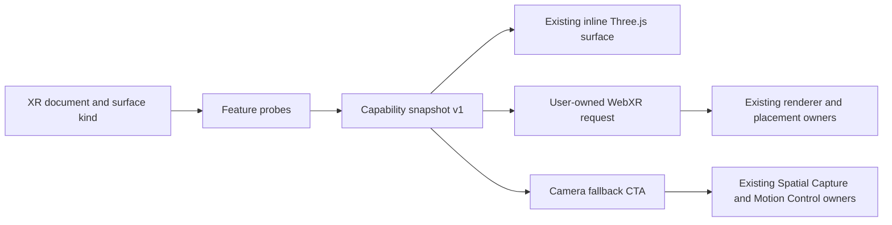

# Knowgrph AR/VR/XR — Capability, Session, and Camera Fallback

## Decision and authority

This document describes the XR capability and entry behavior that exists in the
repository. It does not specify a second XR product, renderer, camera stack, or
asset authority.

The source of truth is:

| Concern | Owner |
|---|---|
| Capability probes, five-mode decision, session order, and reference-space policy | `canvas/src/lib/three/ThreeGraphXrSessionPolicy.ts` |
| Capability markers, fallback action, WebXR request, renderer binding, and teardown | `canvas/src/lib/three/ThreeGraphXr.tsx` |
| Immersive AR hit test, reticle, placement, reset, and session state | `canvas/src/features/three/xrArPlacementRuntime.ts` |
| Physical placement wrapper | `canvas/src/features/three/XrArPlacementStage.tsx` |
| Existing local camera and pose-capture owner | `canvas/src/features/three/motionControlRuntime.ts` |
| Existing panel route for that camera owner | `canvas/src/features/three/motionControlSurfaceRuntime.ts` |
| Canonical Dev acceptance boundary | `docs/documents/knowgrph-xr-spatial-capture-fallback-readiness.md` |

The runtime contract is `knowgrph-xr-capability-snapshot/v1`. Any prose that
disagrees with that schema or its source owner is a proposal, not implemented
behavior.

## Part I — Product requirements

### Problem

Knowgrph can already render an XR surface inline, import spatial assets, enter
native immersive sessions on supported browsers, and run a local camera-based
Motion Control surface. Device support varies. The product needs one
feature-probed decision before it offers an immersive or fallback action, and
it must not imply that camera availability equals depth, reconstruction, or a
published spatial asset.

### Personas

- A mobile user needs a useful inline or camera route when immersive WebXR is
  unavailable.
- A headset user needs an explicit, user-initiated immersive session.
- An author needs imported graph, model, and spatial-capture content to retain
  one renderer and workspace owner across inline and immersive presentation.
- A reviewer needs exact source and browser proof with honest Dev-only limits.

### Journey

| Stage | User action | Runtime response | Boundary |
|---|---|---|---|
| Open | Open an XR graph, model, or spatial-capture document | Render the existing inline Three.js surface and start capability checks | No permission prompt |
| Decide | Wait for feature probes | Publish one capability snapshot and one recommended entry mode | No user-agent inference |
| Enter | Select Enter XR when supported | Request AR or VR from the browser under user activation | Browser permission may still fail |
| Fall back | Open a spatial capture where immersive support is absent | Offer **Open camera capture** when the camera API is present | Camera remains off |
| Capture motion | Start from Motion Control | Existing owner requests camera permission and runs its bounded local pose path | Not spatial reconstruction |
| Exit | End session, close XR, or lose the session | Release placement/session ownership and clear renderer session state | No retained hidden session |

### In scope

- Exact `knowgrph-xr-capability-snapshot/v1` resolution.
- Parallel support checks for `immersive-ar` and `immersive-vr`.
- AR-first selection unless the user already selected another supported mode.
- Inline viewing before any immersive session.
- User-activated WebXR session request and shared Three.js session ownership.
- `local-floor` then `local` reference-space negotiation.
- Immersive AR hit testing, reticle placement, scene commit, and reposition.
- A visible camera fallback action on a spatial-capture surface when immersive
  WebXR is absent and `getUserMedia` is exposed.
- Routing that action into the existing Spatial Capture `capture` mode and
  Motion Control panel.
- Source and local-browser proof for the bounded Dev slice.

### Out of scope

- Live or recorded monocular depth inference.
- Stereo synthesis, view synthesis, or 3D reconstruction from phone video.
- Automatic post-processing jobs or a new XR asset status field.
- A second camera, renderer, physics, timeline, or workspace owner.
- Device classification from browser name, operating system, or user agent.
- A persisted native-viewer handoff workflow.
- Physical headset coverage, physical camera-quality validation, Production,
  Cloudflare, or release authority.

### Requirements and acceptance criteria

#### KXR-CAP-1 — Deterministic feature-probed snapshot

Given a surface kind and browser feature matrix, when capability resolution
runs, then it returns exactly one `knowgrph-xr-capability-snapshot/v1` object
with booleans, one recommended entry mode, and stable reason codes.

VCC: `canvas.xrMode.nativeSessionPolicy`.

#### KXR-CAP-2 — Closed recommendation order

Given multiple available capabilities, when the policy chooses an entry mode,
then the order is immersive session, spatial-capture camera fallback, inline
viewer, native handoff, then unsupported.

VCC: the capability-policy unit matrix must cover each branch and preserve
AR-first native session preference.

#### KXR-CAP-3 — User-owned immersive entry

Given immersive support, when the user selects Enter XR, then the runtime calls
`requestSession` from that action, binds the session to the existing Three.js
renderer, negotiates the reference space, and owns teardown.

VCC: the native-session source contract covers request, reference-space,
placement, end-event, pending-session, and renderer replacement boundaries.

#### KXR-CAP-4 — Actionable camera fallback

Given a spatial-capture surface, no immersive support, and an exposed camera
API, when capability checks complete, then the surface recommends
`monocular-capture` and renders **Open camera capture**. Selecting it activates
the existing Spatial Capture `capture` mode and opens the existing Motion
Control surface. Camera permission remains a separate explicit Start action.

VCC: source proof binds the CTA to `setSpatialCapturePrimaryMode('capture')`
and `openMotionControlSurface('motion-control')`; browser proof selects the CTA
and verifies both routed owner states without starting camera permission.

#### KXR-CAP-5 — Honest evidence boundary

Given the focused proof passes, when readiness is reported, then the claim is
limited to the source-backed capability decision, rendered CTA, and local
browser surface. It must not imply a physical camera, headset, capture asset,
deployment, or release.

VCC: `docs/documents/knowgrph-xr-spatial-capture-fallback-readiness.md`.

## Part II — Technical architecture

### Capability snapshot

```ts
type XrCapabilitySnapshot = {
  schema: 'knowgrph-xr-capability-snapshot/v1'
  inline_viewer: boolean
  immersive_viewer: boolean
  monocular_capture: boolean
  capture_motion: boolean
  native_handoff: boolean
  recommended_entry_mode:
    | 'immersive-session'
    | 'inline-viewer'
    | 'monocular-capture'
    | 'native-handoff'
    | 'unsupported'
  reason_codes: readonly XrCapabilityReasonCode[]
}
```

The entry modes are:

| Mode | Selection condition | Current action | Current limit |
|---|---|---|---|
| `immersive-session` | Either immersive mode is supported | Show Enter XR and request the selected mode | Requires browser support, user activation, and permission |
| `monocular-capture` | Spatial-capture surface, inline viewer, camera API, no immersive mode | Show **Open camera capture** and route to existing Motion Control | The mode name means one browser camera path; it does not prove depth or reconstruction |
| `inline-viewer` | Inline canvas is available and the prior branches do not win | Continue using the mounted Three.js surface | No headset tracking |
| `native-handoff` | Inline is unavailable, share is available, and prior branches do not win | Policy outcome only | No persisted asset-handoff UX is implemented |
| `unsupported` | None of the above | No entry action | Pure policy result; the mounted active canvas normally supplies inline viewing |

### Probe semantics

| Field | Probe | What it proves | What it does not prove |
|---|---|---|---|
| `inline_viewer` | Active entry surface unless explicitly disabled | The existing canvas may remain visible | WebXR support |
| `immersive_viewer` | `isSessionSupported` result for AR or VR | A mode may be requested | Permission or session success |
| `monocular_capture` | `navigator.mediaDevices.getUserMedia` is a function | A camera request API exists | Permission, live track, recording, depth, or quality |
| `capture_motion` | Motion/orientation event constructors exist | A motion signal API is exposed | Sensor permission or usable samples |
| `native_handoff` | `navigator.share` is a function | Web Share is exposed | A native AR viewer or compatible asset |

Reason codes are emitted for every unavailable boolean. They are diagnostics,
not retry commands.

### Topology



### Native session flow

1. `CanvasXrEntryPanel` checks both immersive modes in parallel.
2. `chooseXrSessionMode` prefers AR, then VR, while preserving a supported
   explicit selection.
3. The user selects Enter XR.
4. `buildXrSessionInit` requests shared optional features and adds AR-only hit
   test, light estimation, and DOM overlay features for AR.
5. `requestPreferredXrReferenceSpace` tries `local-floor`, then `local`.
6. `renderer.xr.setSession` and `setReferenceSpace` bind the existing renderer.
7. AR starts the existing placement owner; VR activates the shared immersive
   lifecycle without inventing placement.
8. Session end, component cleanup, cancellation, or failure releases pending
   and active session state.

Current Three.js documentation confirms that injecting the requested session
through `WebXRManager.setSession` starts XR rendering. Current WebXR guidance
keeps immersive `requestSession` behind user activation. The implementation
preserves those boundaries.

### Camera fallback flow

1. The browser exposes `getUserMedia`, but no immersive mode is available.
2. A spatial-capture surface resolves `recommended_entry_mode` to
   `monocular-capture`.
3. The entry owner renders `data-kg-canvas-xr-fallback="monocular-capture"` and
   the `open-motion-control` action.
4. Selecting the action switches the existing spatial primary mode to
   `capture` and opens Motion Control.
5. Motion Control keeps the camera off until its Start action requests
   permission.

This route intentionally reuses the established camera lifecycle, cancellation,
page-visibility stop, track-end stop, preview, and cleanup owner.

### Observable DOM contract

The entry surface exposes:

- capability schema;
- selected and recommended entry modes;
- all five capability booleans;
- space-separated reason codes;
- surface kind and XR status;
- the camera fallback and action markers when their exact condition is true.

These markers are test evidence and accessibility hooks. They are not a public
network API or an asset schema.

## Part III — Architectural decisions

### ADR-1 — Reuse the existing Three.js/WebXR owner

Status: Accepted.

Keep one renderer and inject an active XR session through its existing
`renderer.xr` manager. Do not add another scene graph or immersive shell.

Consequences: lower bundle and ownership cost; browser/device support remains
an explicit capability boundary.

### ADR-2 — Feature probes, not device classes

Status: Accepted.

Resolve from exposed APIs and session-support results. Do not infer support from
browser, operating-system, or device names.

Consequences: fewer stale platform assumptions; permission and runtime failure
still require explicit states.

### ADR-3 — Capability is not completion

Status: Accepted.

A camera or share function indicates only an available request path. Do not
translate it into claims about permission, quality, depth, reconstruction,
publication, or native AR viewing.

Consequences: UI and evidence remain honest; broader capture requires a
separate source owner and acceptance contract.

### ADR-4 — Reuse Motion Control for camera entry

Status: Accepted.

The fallback CTA routes to the existing Spatial Capture and Motion Control
owners. It does not start a competing camera runtime or silently request
permission.

Consequences: cancellation and cleanup stay centralized; spatial reconstruction
remains deferred.

### TCO

The implemented slice adds no hosted service, paid API, model call, scheduler,
database, or deployment. It reuses browser APIs and repository dependencies.
Physical-device validation remains an operator cost and a separate gate.

## Part IV — Readiness and proof

Run from the repository root:

```sh
npm run xr:source-runner:test
npm -C canvas run test:smoke:xr-spatial-capture-fallback:source
npm run xr:runtime-ready
```

`npm run xr:review-ready` is the one-command local reviewer path. The exact
boundary and artifact location are owned by
`docs/documents/knowgrph-xr-spatial-capture-fallback-readiness.md`.

| Capability | Source state | Focused evidence | Honest rung |
|---|---|---|---|
| Five-mode capability snapshot | Implemented | Policy unit/source contract | Dev source-proven |
| Native AR/VR session lifecycle | Implemented | Source contract and unit coverage | Dev source-proven |
| Immersive AR placement/reposition | Implemented | Placement runtime tests | Dev source-proven |
| Inline spatial-capture fallback markers | Implemented | Local Chromium smoke | Runtime-ready Dev slice |
| Camera fallback CTA and owner routing | Implemented | Source binding plus local Chromium visibility | Runtime-ready Dev slice |
| Physical camera and headset execution | Not proven here | Requires device evidence | Blocked |
| Phone video to spatial asset | Not implemented | No owner or proof | Deferred |
| Native asset handoff UX | Not implemented | Capability probe only | Deferred |
| Production and Cloudflare | Not authorized | Separate release workflow | Blocked |

## Validation checklist

- [x] The capability enum matches `ThreeGraphXrSessionPolicy.ts`.
- [x] The policy is feature-probed and AR-first.
- [x] The camera CTA reuses established owners.
- [x] The camera stays permission-gated behind a separate user action.
- [x] Source and browser evidence have separate boundaries.
- [x] The canonical readiness commands and document are linked.
- [x] Speculative depth, reconstruction, native-viewer, and Production claims
  are excluded.
- [ ] Physical mobile camera proof.
- [ ] Physical immersive-device proof.
- [ ] Persisted camera capture draft and asset publication contract.
