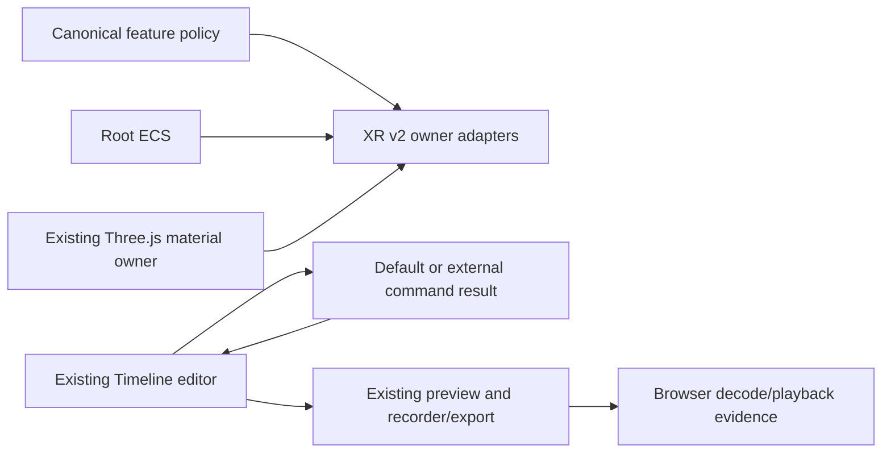

# Knowgrph AR/VR/XR — Native Authoring and Edited-Media Delivery

## Decision and readiness boundary

Knowgrph retains one XR capability policy, one Three.js renderer, one canonical
ECS, and one source-backed Gantt/video-sequence Timeline editor. XR v2 adds
typed adapters at those owners. It does not introduce a parallel editor,
renderer, scene store, camera lifecycle, collaboration transport, or media
registry.

The implemented review candidate is **XR authoring plus native edited-media
delivery**. Its machine-readable scope is
`xr-authoring-edited-media-delivery`. The following are executable as focused
source, unit, and isolated local-browser checks from this repository:

- the canonical five-mode XR capability decision;
- canonical-ECS projection including entity identifier zero;
- a material-graph adapter applied to an actual existing Three.js material;
- the existing Timeline editor's default Markdown mutation path and its typed
  externally-owned command seam;
- browser-native edited-video recording through the existing export owner;
- decoded browser playback of the resulting non-empty artifact;
- clean-room dependency/source enforcement; and
- affected-scope CI that selects the aggregate review command.

This evidence does **not** claim canonical runtime readiness, a loaded depth
model, depth quality, phone-video
reconstruction, named-device frame-budget proof, camera permission, physical
headset execution, Production availability, or deployment authority. Those
claims remain blocked until their own evidence gates close.

The readiness schema is `knowgrph-xr-v2-readiness/v1` and remains
`source-ready` in a task lane. The browser observation schema is
`knowgrph-xr-v2-browser-smoke/v1`; its bounded observation envelope is
`knowgrph-xr-v2-dev-runtime-evidence/v1`. Shape-valid observations cannot
promote readiness. Only protected integration followed by canonical-main
runtime proof may establish a runtime-ready state.

## Authority map

| Concern | Existing owner retained |
|---|---|
| Feature probes, five-mode decision, native-session order | `canvas/src/lib/three/ThreeGraphXrSessionPolicy.ts` |
| WebXR session binding and teardown | Existing Three.js XR surface |
| Camera permission and pose capture | Existing Motion Control runtime |
| ECS allocation, query, and snapshot | Root `ecs` package |
| Scene rendering and materials | Existing Three.js/R3F surface |
| Timeline ruler, transport, edits, preview, and export | `canvas/src/components/timeline` and `canvas/src/features/gitgraph` |
| XR v2 owner adapters | `canvas/src/features/xr-v2` |
| Clean-room enforcement | `scripts/video-editor` |
| Runtime proof | XR v2 source ledger and local Chromium smoke |

## Part I — Product requirements

### Problem

Knowgrph already has XR entry, camera fallback, authoring surfaces, a
source-backed Timeline, and browser-native edited-media export. The prior
document described a speculative parallel stack instead of the checked-in
runtime. The product needs an honest, executable contract that joins the
existing owners and makes their evidence selectable in CI.

### Personas

- A mobile user needs inline viewing or an explicit camera route when immersive
  entry is unavailable.
- A headset user needs an explicit user-owned immersive session.
- An author needs XR motion and media edits to use the same Timeline surface
  and source authority as other Knowgrph work.
- An automation client needs a typed edit-command boundary without bypassing
  the document owner.
- A reviewer needs local browser evidence and an explicit list of claims that
  remain blocked.

### Primary journey

| Stage | User or runtime action | Result | Boundary |
|---|---|---|---|
| Open | Open an XR or spatial document | Existing inline surface renders and feature probes begin | No permission prompt |
| Decide | Capability probes settle | Exactly one canonical entry mode is projected | No device-name inference |
| Author | Open the bottom Timeline | Existing Gantt/video-sequence editor renders | No parallel editor state |
| Edit | Invoke a clip or XR-owned command | Default document owner handles it, or an explicit external adapter returns a typed result | Rejection never mutates the document |
| Render | Apply an admitted material graph | Parameters update an actual caller-supplied Three.js material in the focused adapter proof | Normal mounted-renderer wiring is not claimed |
| Deliver | Export a short edited sequence | Existing recorder/export owner emits browser-native media | Capability failures are explicit |
| Verify | Attach output to a video element | Browser decodes metadata and playback without an observed error | Local Dev evidence only |
| Exit | End session or close the surface | Existing owners release media/session resources | No hidden retained session |

### Canonical entry modes

The closed entry-mode union is:

- `immersive-session`
- `inline-viewer`
- `monocular-capture`
- `native-handoff`
- `unsupported`

Selection is based on exposed features and session-support results. A camera
function proves only that a request path exists; it does not prove permission,
capture quality, depth, or publication.

### In scope

- Canonical five-mode capability projection.
- User-activated immersive-session request through the shared renderer.
- Inline viewing and the established Motion Control camera fallback route.
- XR v2 adapters over canonical ECS and the existing material owner.
- Reuse and enhancement of the existing Timeline/video editor.
- A typed optional external command adapter with the current Markdown actions
  as the default.
- Existing browser-native edited-video export and decoded playback proof.
- Attribution-only upstream product-workflow observation with a strict
  clean-room boundary.
- Focused source, unit, browser, documentation, and affected-CI proof.

### Out of scope

- Admitting or downloading a depth model.
- Claiming live depth inference or reconstruction quality.
- A new scene graph, editor, recorder, camera owner, or network service.
- Importing a third-party editor package or contacting one at build/test/runtime.
- Physical headset/camera validation.
- Production publication, Cloudflare promotion, or release authorization.

## Acceptance criteria

### KXR-CAP-1 — Deterministic capability projection

Given a surface kind and feature matrix, when capability resolution runs, then
it returns exactly one `knowgrph-xr-capability-snapshot/v1` and one of the five
canonical entry modes.

VCC: capability-policy unit matrix and XR mode source ledger.

### KXR-CAP-2 — User-owned native entry

Given immersive support, when the user explicitly selects entry, then the
existing owner requests the session, binds it to the mounted renderer,
negotiates reference space, and owns teardown.

VCC: native-session policy/source tests.

### KXR-CAP-3 — Honest camera fallback

Given a spatial-capture surface without immersive support and with a camera
request API, when probes settle, then `monocular-capture` routes to the existing
Spatial Capture and Motion Control owners. Camera access remains behind their
separate user action.

VCC: fallback source and local-browser smoke.

### KXR-AUTH-1 — One Timeline editor

Given a video sequence or XR timeline, when the bottom panel renders, then it
uses the existing Gantt/video-sequence editor, transport, ruler, preview, and
export owners.

VCC: editor source contract rejects an alternate editor dependency or runtime.

### KXR-AUTH-2 — Explicit external command handling

Given an externally-owned XR edit intent, when an optional command adapter is
installed, then the editor delegates through a typed result. A handled result
does not also execute the default Markdown mutation. A rejected or unavailable
adapter leaves the document unchanged; absent adapters preserve current
behavior.

VCC: focused editor command-adapter tests.

### KXR-AUTH-3 — Canonical ECS and material runtime

Given the root ECS allocates its first entity, when XR v2 projects it, then
entity identifier zero is retained. Given a valid closed material graph, when
the material adapter applies it, then an actual caller-supplied Three.js
material reflects the compiled values. Disposing the binding only unbinds the
adapter; the caller retains sole authority to dispose its material. This
focused proof does not establish wiring into the normal mounted renderer.

VCC: focused XR v2 entity/material runtime tests.

### KXR-DEL-1 — Edited-media browser delivery

Given the committed same-origin media fixture and an admitted short edit plan,
when the existing export owner runs in Chromium, then it emits a non-empty
video blob with a supported media type. When that blob is attached to a video
element, metadata decodes, dimensions are positive, duration is either finite
and positive or explicitly browser-unbounded, bounded playback advances, and
no media or page error is observed.

VCC: `node canvas/scripts/run_xr_v2_browser_smoke.mjs`.

### KXR-IP-1 — Clean-room independence

Given product source, configuration, dependencies, lockfiles, tests, fixtures,
assets, and generated artifacts, when the editor source ledger scans them, then
no attributed upstream-editor dependency, import, vendored path, build/runtime
request, or copied artifact marker is present. The approved ADR citation is the
only upstream URL allowance.

VCC: `node scripts/run-video-editor-source-smoke.mjs`.

### KXR-CI-1 — Affected scope is executable

Given any owned XR v2, Timeline-editor, smoke, guard, or readiness-document
path changes, when affected CI resolves the contract, then it selects
`npm run xr-v2:review-ready`.

VCC: collaboration contract and affected-CI tests.

## Part II — Technical architecture

### Topology



### Capability snapshot

```ts
type XrCapabilitySnapshot = {
  schema: 'knowgrph-xr-capability-snapshot/v1'
  inline_viewer: boolean
  immersive_viewer: boolean
  monocular_capture: boolean
  capture_motion: boolean
  native_handoff: boolean
  recommended_entry_mode:
    | 'immersive-session'
    | 'inline-viewer'
    | 'monocular-capture'
    | 'native-handoff'
    | 'unsupported'
  reason_codes: readonly string[]
}
```

### Editor ownership

The Timeline panel remains a projection over its existing source document.
Clip splitting, trimming, snapping, ripple edits, preview synchronization,
session feedback, and export stay with their current modules. The optional
command seam is dependency injection, not a new state store. It may translate
an intent to an XR motion-plan owner, but it may not silently write the wrong
Markdown document or execute both ownership paths.

### Edited-media evidence flow

1. The smoke route imports the public XR v2 owner and the existing Timeline
   export owner.
2. A bounded plan references the committed same-origin MP4 fixture.
3. The existing exporter negotiates a browser-supported recording type.
4. Canvas capture and the established media runtime emit one Blob.
5. The route creates a local object URL and assigns it to a video element.
6. Chromium waits for decoded metadata/readiness and performs bounded playback.
7. The verifier writes `data/outputs/xr-v2-browser-smoke.json`, including
   revision, commit-tree and worktree-state identity, blob bytes/type, decoded
   dimensions/duration, playback state, and page errors.
8. The route validates those observations as
   `knowgrph-xr-v2-dev-runtime-evidence/v1`; validation cannot promote the
   source-ready snapshot.
9. The Node verifier accepts only a clean exact-commit worktree, records the
   result as review-candidate evidence, and makes no canonical-runtime claim.
10. Component cleanup revokes the object URL and export cleanup stops owned
   media resources.

### Evidence states

| Capability | State after this change | Meaning |
|---|---|---|
| Capability policy | source-backed | Closed five-mode policy remains canonical |
| Canonical ECS projection | focused-test-backed | Entity zero and query projection are executed in tests |
| Material application | focused-test/browser observation | Compiled graph updates a real standalone material; mounted-renderer wiring is not claimed |
| Timeline command seam | focused-test/browser observation | Default, handled, rejected, and real mounted-panel paths are exercised |
| Edited-video output/playback | review-candidate observation | Fresh local Chromium records and decodes output from a clean exact commit |
| Canonical-main runtime | blocked | Protected integration and canonical runtime proof are absent |
| Live depth synthesis | blocked | Same-origin model-asset admission and reference-device proof are absent |
| Physical XR/camera | blocked | Named physical-device evidence is absent |
| Production | blocked | Dev-only; release authority is separate |

## Part III — Architectural decisions

### ADR-1 — Retain the shared Three.js XR owner

Status: Accepted.

Native sessions and production materials remain within the mounted renderer
lifecycle. XR v2 supplies an adapter boundary only; the focused proof uses a
standalone material and does not claim normal renderer-surface wiring. Binding
cleanup never disposes the caller-owned material.

### ADR-2 — Feature probes define entry

Status: Accepted.

Support is derived from exposed capabilities and session checks, not browser,
operating-system, or model-name inference.

### ADR-3 — Capability is not completion

Status: Accepted.

An API's presence does not prove permission, useful samples, reconstruction,
or publication. Readiness records each missing evidence owner explicitly.

### ADR-4 — Retain Motion Control for camera entry

Status: Accepted.

The fallback action routes to the established camera lifecycle and never starts
permission implicitly.

### ADR-5 — Canonical ECS and renderer adapters

Status: Accepted.

XR v2 consumes root-ECS rows, including entity zero, and compiles a closed graph
to parameters applied to an existing material. It does not own a world or
render loop.

### ADR-6 — Enhance the in-repository Timeline editor

Status: Accepted.

The existing Gantt/video-sequence Timeline is the editor authority. Its
optional typed command adapter supports externally-owned XR mutations while
preserving the current source-backed path by default.

### ADR-7 — Keep the workflow reference attribution-only

Status: Accepted with a strict clean-room boundary.

[OpenCut](https://github.com/opencut-app/opencut) is an attribution-only product-workflow reference.

The referenced repository's permissive license does not relax this project's
stricter clean-room rule.

Knowgrph contains no copied or adapted upstream code, prose, assets, UI text,
schemas, identifiers, algorithms, shaders, tests, fixtures, snapshots,
configuration, workflows, migrations, or generated artifacts. Knowgrph does
not import, execute, vendor, fork, embed, fetch from, link to, or communicate
with that project at build, test, or runtime. The canonical upstream URL may
appear only in the exact attribution line above and its mechanical source
ledger.

Consequences: the referenced project is neither a library, compatibility
target, service, nor readiness proof. All editor behavior is independently
specified by Knowgrph acceptance criteria and implemented through existing
owners.

The mechanical ledger detects identifiable lineage, dependency, path, and
runtime markers; it cannot by itself prove semantic authorship. Independent
specification and code review therefore remain mandatory.

### ADR-8 — Use the existing browser-native export owner

Status: Accepted.

Edited-media delivery uses the checked-in Timeline export path and browser
capability negotiation. Unsupported recording or decode capability fails with
a typed error; no third-party editor/media runtime is introduced.

### ADR-9 — Keep task-lane proof below runtime-ready

Status: Accepted.

The task lane may produce clean exact-commit review-candidate evidence for XR
authoring and edited-media delivery. It remains `source-ready`; canonical
runtime, live-depth, and physical-device claims stay blocked even when the
aggregate review gate passes.

## Part IV — Verification and delivery

Run from the repository root:

```sh
node --test scripts/__tests__/xr-v2-source-smoke.test.mjs
node scripts/run-xr-v2-source-smoke.mjs
node --test scripts/__tests__/video-editor-source-smoke.test.mjs
node scripts/run-video-editor-source-smoke.mjs
node canvas/scripts/run_xr_v2_browser_smoke.mjs
npm run xr-v2:review-candidate
npm run xr-v2:review-ready
npm run xr:review-ready
```

`npm run xr-v2:review-ready` is the focused aggregate for this document. It
joins TypeScript, unit, source, clean-room, documentation, and fresh
local-browser review-candidate proof from a clean exact commit.
`npm run xr:review-ready` retains the established camera-fallback compatibility
gate and aggregates the XR v2 slice. Neither command deploys or grants release
authority.

## Promotion blockers

The following remain required before broader claims:

1. admit a versioned same-origin depth model with license, hash, input/output,
   memory, and fallback metadata;
2. publish frame-budget evidence on named reference hardware while raw capture
   remains lossless across fallback;
3. validate camera permission, interruption, track end, visibility changes,
   and teardown on named physical mobile devices;
4. validate immersive entry, tracking, placement, and exit on named headsets;
5. pass protected integration and produce canonical-main runtime proof; and
6. pass separately authorized release workflows.

## Validation checklist

- [x] Canonical entry modes and owner map match checked-in source.
- [x] The existing Timeline/video editor remains authoritative.
- [x] External edit handling is typed and default behavior is retained.
- [x] ECS entity zero and real material application have focused proof.
- [x] Browser-native edited output is decoded in fresh Chromium evidence.
- [x] The upstream workflow reference is attribution-only with no copy or dependency allowance.
- [x] Affected CI selects the aggregate review command.
- [x] Dev-only and blocked claims are explicit.
- [ ] Same-origin depth model admission.
- [ ] Named reference-device frame-budget proof.
- [ ] Physical mobile camera proof.
- [ ] Physical immersive-device proof.
- [ ] Production release authorization.
