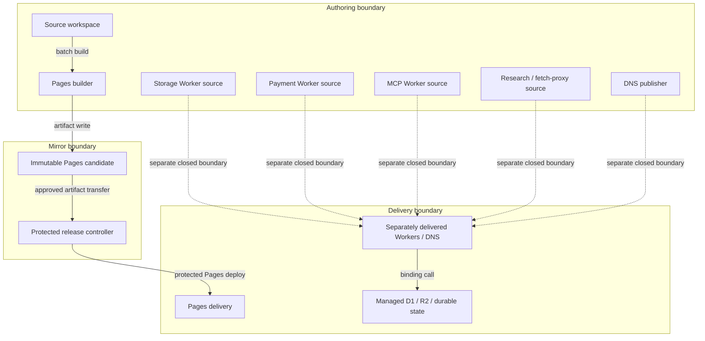

# Reference implementation: Knowgrph Cloud Platform Product and Technical Specification

## Reference implementation: Authority and readiness

This combined PRD/TAD owns the platform boundary between Knowgrph source, its generated Pages
candidate, and separately operated Cloudflare-hosted runtimes. It describes repository source and
named VCC hosts; it does not prove that any route, binding, DNS record, secret, database, bucket,
queue, or Worker is currently delivered.

No satisfying Evidence Reference for this revision is attached. The stated VCCs therefore derive
`local_rung: "spec-complete"`, while the absence of a delivery-surface result and referenced
operator instruction derives `delivered_rung: "undocumented"`.

Source presence, a `wrangler.toml` route, an old preview URL, an earlier deployment receipt, or a
historical check result must not promote either rung. This document grants no deployment, remote
mutation, DNS mutation, paid-provider, or secret-management authority.

### Canonical ownership and reading order

This document deliberately contains no duplicate Invocation Register.

| Contract | Canonical owner |
|---|---|
| Cross-cutting source, persistence, transport, and promotion decisions | [Core architecture decisions](knowgrph-architecture-decisions.md) |
| Protected Pages release, receipt, verification, and rollback | [Deployment runbook](../knowgrph-acos-deploy-runbook.md) |
| Source-to-publish artifact relationship | [Cross-repository publish topology](knowgrph-cross-repo-publish-topology.md) |
| Public discovery, browser, local, and control-plane MCP separation | [MCP overview](knowgrph-mcp/knowgrph-mcp.md) and [MCP install contract](knowgrph-mcp-install-contract.md) |
| Agent discovery requirements and surface counts | [Agent-ready PRD/TAD](knowgrph-agent-ready-prd-tad.md) |
| Structured persistence, reconciliation, and room ownership | [Storage and synchronization owner](knowgrph-storage-sync-document.md) |
| Generic blob and run-media byte contracts | [Artifact and media storage owner](knowgrph-artifact-media-storage-architecture.md) |
| Checkout, settlement, and payment-worker behavior | [Payments PRD/TAD](knowgrph-payments-prd-tad.md) |
| Draft AI routing work | [AI Gateway enhancement plan](knowgrph-ai-gateway-enhancement-plan.md) |

Exact storage paths remain owned by
`canvas/src/lib/storage/knowgrphStorageRoutePaths.ts`; exact MCP tools remain owned by their
linked registries. Route-family names below are implementation evidence, not a second declaration.

## Reference implementation: Product requirements

### Problem statement

An operator must be able to distinguish four facts that legacy documentation blended together:

1. source code and configuration exist;
2. a reproducible local check is named;
3. a candidate crossed the Authoring-to-Mirror boundary;
4. an explicitly authorized candidate crossed the Mirror-to-Delivery boundary.

Without that separation, an ordinary source change can be mistaken for a live Pages or Worker
deployment, and insecure storage handlers can be described as authenticated merely because other
handlers in the same Worker enforce sessions.

### Personas

| Persona | Job to be done | Current friction | Required outcome |
|---|---|---|---|
| Builder | Change Pages or Worker source safely | Source presence resembles delivery | Source state and delivered state remain separate |
| Release operator | Promote an exact reviewed Pages candidate | Worker and DNS scripts appear adjacent to the Pages workflow | Scope, evidence, instruction, and rollback are explicit |
| Security reviewer | Assess route trust boundaries | Storage handlers have mixed authentication | Every route family states its actual source-enforced boundary |
| Agent integrator | Choose a discovery or control surface | Public Pages MCP and protected Worker MCP can be conflated | Canonical MCP owner determines the surface |
| Maintainer | Estimate cost and portability | Managed services are presented without variants | Managed and FOSS deployment models remain comparable |

### Journey: Release operator — qualify one platform change

| Stage | Action | Touchpoint | Pain | Opportunity |
|---|---|---|---|---|
| Trigger | receives a reviewed source revision | Authoring source | revision may include several deployment units | identify affected units |
| Discover | reads canonical owners and VCCs | this document and linked owners | stale live claims can mislead | derive readiness from evidence only |
| Engage | produces a non-public candidate | protected verification job or unit-specific process | direct deploy scripts can bypass a mirror | keep boundary A closed by default |
| Complete | authorizes one named delivery unit | protected environment or separate runbook | Pages approval can be overread as Worker approval | scope instruction to one unit |
| Return | records result and rollback target | receipt/evidence store | a URL alone does not prove exact state | bind revision, result, instruction, and rollback |

### User stories and acceptance criteria

| ID | Story | Given / When / Then | VCC translation |
|---|---|---|---|
| PRD-CF-01 | As a release operator, I want Pages promotion to use one exact candidate so that public bytes match review. | Given an exact protected-main revision and localhost review artifact, when the protected release runs, then it builds a mirror candidate before any delivery mutation. | Verify the candidate manifest binds the exact source and dependency revisions; named release checks exit 0; no Worker deploy command runs. |
| PRD-CF-02 | As a maintainer, I want ordinary integration to remain non-deploying so that merge does not publish. | Given a pull request or ordinary `main` push, when integration runs, then it validates source without deploying Pages or Workers. | Verify `.github/workflows/integration.yml` contains no deployment mutation and its check exits 0. |
| PRD-CF-03 | As an agent integrator, I want public discovery and protected orchestration separated so that a read surface cannot imply control authority. | Given an agent chooses a Cloud-hosted surface, when discovery is public, then control execution remains on the separately authenticated Worker contract. | Verify linked MCP source-parity tests pass and no tool schema is redefined here. |
| PRD-CF-04 | As a security reviewer, I want storage trust boundaries stated per route family so that unauthenticated access is visible. | Given storage source is inspected, when push, pull, export, blob, run-media, or media-asset behavior is described, then the description matches the handler before any delivery claim. | Verify focused storage tests and static source inspection surface the security matrix below; do not call an unsigned token entitlement. |
| PRD-CF-05 | As an operator, I want storage, payment, MCP, research, fetch-proxy, and DNS publication treated separately so that Pages approval cannot deploy them. | Given the protected Pages workflow succeeds, when its steps are inspected, then it deploys Pages and reconciles documentation into D1 but does not deploy a Worker or publish DNS. | Verify the release workflow contains no Worker deploy or DNS publish step; preserve separate rollback ownership. |
| PRD-CF-06 | As a security maintainer, I want secrets externalized so that static artifacts and source never contain credential values. | Given a deployment or DNS mutation needs a credential, when configuration is prepared, then only a secret name or masked presence is surfaced. | Verify secret-canary checks find no value and visible Worker variables contain no credential material. |
| PRD-CF-07 | As a maintainer, I want routing and discovery checks to consume zero model tokens so that validation is bounded and cheap. | Given a source or deployed route check, when it runs, then it invokes no model harness and records zero prompt/completion tokens. | Verify network/model spies observe zero model calls and the cost record is zero. |

### Success metrics and time-to-value

| Metric | Baseline | Target | Timeline / stated validation |
|---|---|---|---|
| Local readiness rung | `spec-complete` | evidence-derived only | every revision |
| Delivered readiness rung | `undocumented` | evidence-derived only | every revision |
| Deployment-unit ambiguity | legacy combined claims | zero Pages-as-Worker claims | documentation review |
| Storage security coverage | mixed and incomplete | all six named families classified | static source audit |
| Ordinary integration deployments | must remain zero | 0 | workflow source check |
| Discovery token cost | 0 | 0 prompt + 0 completion | per check |
| TTV steps | unmeasured | at most 4 operator actions to identify owner and first check | clean-environment walkthrough |
| TTV elapsed | unmeasured | at most 20 minutes before first source result | timed walkthrough |
| Monthly platform TCO | unmeasured | operator-approved before delivery | monthly cost review |

### ROI and MoSCoW

ROI uses `(impact × monthly sessions) / (build hours + 12-month cash TCO/100 + monthly token
cost/1M)`. Values are planning estimates, not Evidence References.

| Tier | Capability | Inputs: impact, sessions, hours, 12-month cash | Score | Rationale |
|---|---|---|---:|---|
| Must | exact Pages lane and rollback boundary | 5, 20, 8, $0–1,200 | 5.0–12.5 | prevents the broadest release ambiguity |
| Must | truthful storage security matrix | 5, 20, 4, $0 | 25.0 | exposes read/write risk before delivery |
| Must | separate Worker and DNS units | 5, 12, 5, $0 | 12.0 | prevents accidental authority expansion |
| Should | DNS source contract and public proof path | 3, 8, 4, $0–120 | 4.6–6.0 | useful discovery with separate mutation risk |
| Could | managed infrastructure as code | 2, 4, 16, $0–240 | 0.4–0.5 | improves repeatability after boundaries are proven |
| Won't | automatic deploy from ordinary `main` push | 1, 20, 1, unbounded risk | <0.1 | contradicts protected promotion |

### Min-viable scope

The minimum truthful artifact is source ownership, per-family trust boundaries, one protected Pages
lane, separately closed Worker/DNS lanes, VCCs with no fabricated results, and rollback statements.

### Out of scope

- proving any currently delivered URL, DNS answer, binding, secret, or data row;
- redefining MCP tools, storage routes, payment schemas, or provider API contracts;
- authorizing a direct deploy, migration, DNS write, paid call, or remote mutation;
- claiming Cloud-hosted persistence from a local preview, source file, or browser cache;
- adding a unified proxy or new orchestration runtime.

## Reference implementation: Technical architecture

### Journey-to-system mapping

| Journey stage | Workflow | Data flow | Control flow | Topology nodes | Component owner |
|---|---|---|---|---|---|
| Trigger | identify affected unit | source classification | deterministic inspection | Authoring source | repository owners |
| Discover | resolve canonical contract | contract read | zero-model selection | docs/source registries | linked canonical owner |
| Engage | qualify candidate | source → candidate | verify job | Builder, Mirror | release controller |
| Complete | promote approved unit | candidate → delivery | protected deploy | Mirror, Pages delivery | release workflow |
| Return | verify or restore | receipt/rollback data | bounded verification | Delivery, prior state | release controller |

### Topology: Cloud platform boundary v2 — 2026-07-30

**Boundaries**: local/CI Authoring, non-public candidate Mirror, public Delivery, managed-data
bindings, and external provider control planes.

| Node | Role | Type | Lane | Connects to | Connection | Data residency |
|---|---|---|---|---|---|---|
| Source workspace | Store | repository checkout | Authoring | builders, Worker sources | local file reads | operator/CI workspace |
| Pages builder | Producer | deterministic build/sync | Authoring | Pages candidate | batch filesystem write | CI workspace |
| Pages candidate | Store | immutable artifact | Mirror | release controller | artifact transfer | CI artifact store |
| Release controller | Router/Gate | protected workflow | Mirror | Pages delivery, docs reconciler, receipts | approved batch | CI runner and receipt store |
| Pages delivery | Consumer/Gateway | static site + Functions | Delivery | public clients | HTTPS | configured edge network |
| Storage Worker source | Gateway/Router | Worker source | Authoring | D1, R2, optional KV, room object | HTTPS + binding calls | source workspace |
| Payment Worker source | Gateway/Router | Worker source | Authoring | D1, queues, providers | HTTPS + binding calls | source workspace |
| MCP Worker source | Gateway/Router | Worker source | Authoring | session/run objects, AI binding | authenticated HTTP + binding calls | source workspace |
| Research Worker source | Gateway/Producer | Worker source | Authoring | D1, queue, R2 | HTTPS + binding calls | source workspace |
| Fetch-proxy Worker source | Gateway | Worker source | Authoring | allowlisted remote fetch | HTTPS | source workspace/request memory |
| DNS publisher | Producer | bounded script | Authoring | authoritative DNS API | authenticated HTTPS | operator process/provider control plane |
| D1-compatible delivered store | Store | relational database binding | Delivery | storage/payment/research runtime | in-process binding | configured database region |
| R2-compatible delivered store | Store | object binding | Delivery | storage/research runtime | in-process binding | configured bucket region |
| Durable delivered state | Store | object/session binding | Delivery | storage/MCP runtime | in-process binding | configured provider region |
| Optional delivered KV cache | Store | key/value binding | Delivery | media asset runtime | in-process binding | not configured by source default |

**Version note**: v2 removes historical live-route evidence and the direct source-to-delivery
diagram. It makes the Pages candidate explicit and keeps every Worker and DNS publication outside
the Pages release boundary.

### Workflow: Protected Pages promotion

**Trigger**: a human supplies an exact protected `main` SHA and exact localhost-review candidate to
the manually dispatched release workflow.

**Happy path**:

1. The verify job checks out exact source/dependency revisions, materializes the review artifact,
   runs integration, and builds the Pages candidate once.
2. While the protected `production` deployment is pending, `npm run production:authorize`
   verifies the clean canonical checkouts, presents the candidate-bound terminal challenge,
   and submits the environment approval with its exact evidence comment. A separate browser
   approval is invalid.
3. The deploy job captures the previous Pages deployment, deploys the verified candidate,
   reconciles canonical documentation into D1, and runs live/browser/service-worker checks.
4. Only after verification does the workflow publish the generated mirror and completion receipts.

**Alternate path**: if the generated mirror already represents the candidate, the workflow records
that state without creating an unnecessary mirror commit.

**Error path**: only after a successful Pages deploy followed by failure, the workflow checks out
the captured prior source, resolves its documentation dependency, restores the prior Pages
deployment, reconciles prior documentation into D1, and reruns smoke checks. It does not revert a
new persistent-mirror commit; failure after mirror publication can therefore require manual mirror
reconciliation.

**Postconditions**: either the exact candidate has delivery receipts and an identifiable prior
Pages state, or the rollback path has attempted restoration. No Worker or DNS publication is
implied.

### Data flow: Pages candidate and documentation reconciliation

| Stage | Component | Input | Output | Persistence | Error handling |
|---|---|---|---|---|---|
| Ingest | release verifier | exact source/dependency/review identities | validated candidate context | run-scoped artifacts | fail closed on mismatch |
| Transform | Pages builder | source and pinned docs | static bytes + Functions + manifests | candidate artifact | non-zero build/parity result |
| Store | candidate publisher | immutable artifact | Pages deployment | configured delivery platform | retain prior deployment id |
| Serve | live verifiers | candidate/live origins | route, browser, and service-worker results | lifecycle receipts | retry within workflow bounds, then fail |
| Reconcile | docs seeder | pinned canonical docs | D1 documentation projection | configured D1 | rollback reseeds prior docs; no general D1 snapshot claim |

### Data flow: Storage trust boundaries

The following matrix describes current source enforcement. It is a delivery blocker, not an
authorization design target.

| Route family | Source owner | Persistence | Current source-enforced trust boundary | Material consequence |
|---|---|---|---|---|
| structured `push`, `pull`, and workspace `export` | `cloudflare/workers/knowgrph-storage/index.ts` | D1 | no authentication or membership check; caller supplies workspace/device identity | an exposed deployment could mutate or disclose another workspace |
| generic blob read/write | `cloudflare/workers/knowgrph-storage/blob.ts` | R2 | no authentication or entitlement check; same key is overwriteable | an exposed deployment could disclose or replace bytes |
| run-media read/write | `cloudflare/workers/knowgrph-storage/media.ts`, `mediaAuth.ts` | R2 | token checks only `{runId, expiresAt}` decoded from unsigned base64url JSON | caller can forge a matching unexpired token |
| media-asset metadata GET at `/api/storage/media/assets` | `cloudflare/workers/knowgrph-storage/mediaAssetSync.ts` | D1 | no authentication; caller supplies `workspaceId` | response exposes artifact/object/provenance metadata |
| media-asset metadata mutation at `/api/storage/media/assets` | `cloudflare/workers/knowgrph-storage/mediaAssetSync.ts` | D1, R2, optional KV/room | same unsigned run token as run-media | not issuer-backed authorization |
| authenticated relay/collaboration paths | storage relay, chat-auth, and room-proxy modules | D1, external provider, room object | session authentication plus workspace membership checks where invoked | these checks do not secure the route families above |
| crawler/document reads | storage dispatcher and crawler modules | D1 | public read behavior in source; no local-file fallback | source presence does not prove intended public exposure |

CORS allows `*` on the storage dispatcher. CORS is not authorization. Content hashes are metadata
unless a named handler verifies them.

### Orchestration/harness flow: Deterministic release control

There is no AI executor in the Pages release or route-discovery path.

**Topology pattern**: sequential
**Max iterations**: no agentic loop; individual install/fidelity retries are bounded in workflow
source
**Circuit-breaker**: any unresolved candidate, authorization, deploy, or live-check failure ends
promotion and enters the scoped failure path
**Token budget**: 0 prompt + 0 completion = $0.00 per control run

| Role | Component | Input schema | Output schema | Cost log | Fallback |
|---|---|---|---|---|---|
| Dispatcher | release workflow | exact revision + review candidate | authorized candidate context | zero-model invariant | typed workflow failure |
| Executor | deterministic build/deploy steps | candidate context + secrets by name | deployment/result artifacts | zero-model invariant | scoped rollback after mutation |
| Observer | lifecycle receipt owner | identities + check outputs | candidate/auth/live/publication receipts | zero-model invariant | incomplete run remains failed |
| Consumer | release operator/public surface | receipts + delivered bytes | accepted result or escalation | zero-model invariant | prior Pages state remains target |

### Component specifications and VCC conditions

| ID | Component responsibility (SVO) | Interfaces / dependencies / configuration | FOSS posture | VCC end state and stated check | Constraint | Evidence Reference | Local rung | Delivered rung |
|---|---|---|---|---|---|---|---|---|
| TAD-CF-01 | Pages builder creates one candidate | package scripts, Vite, sync/build-function scripts | FOSS toolchain; host replaceable | `pages:build-sync` and mirror checks exit 0 | no delivery mutation | not recorded | `spec-complete` | `undocumented` |
| TAD-CF-02 | Release controller promotes one exact Pages state | protected workflow, immutable manifest, review/auth receipts | provider-neutral CI contract | candidate, approval, live, and publication receipts close | no Worker/DNS deploy | not recorded | `spec-complete` | `undocumented` |
| TAD-CF-03 | Pages discovery serves public read contracts | Pages modules and generated mirror | FOSS-compatible HTTP/MCP formats | agent-ready source/parity checks exit 0 | zero model calls; no control execution | not recorded | `spec-complete` | `undocumented` |
| TAD-CF-04 | Storage Worker routes typed persistence requests | dispatcher, D1/R2/room bindings | replaceable with HTTP + SQLite/Postgres + object store | storage suites classify every trust boundary | no authenticated claim for insecure families | not recorded | `spec-complete` | `undocumented` |
| TAD-CF-05 | MCP Worker protects its separate control transport | Worker registry, bearer gate, session object | open protocol; host/runtime replaceable | Worker auth/session and registry checks exit 0 | Pages discovery does not grant control | not recorded | `spec-complete` | `undocumented` |
| TAD-CF-06 | Payment Worker isolates payment execution | payment source, D1, queues, provider secrets | provider adapters; self-hosted HTTP alternative | local payment VCC exits 0 | no Pages or storage readiness inference | not recorded | `spec-complete` | `undocumented` |
| TAD-CF-07 | DNS publisher upserts bounded discovery records | DNS scripts, scoped API token, zone config | standards-based SVCB/DNSSEC; provider replaceable | contract check exits 0; delivery requires recorded public proof | no token value surfaced | not recorded | `spec-complete` | `undocumented` |

### Integration contracts

| Interface | Protocol / format | Security and configuration | Error strategy |
|---|---|---|---|
| source → Pages candidate | batch files/manifests | exact revisions and generated-artifact parity | fail before candidate qualification |
| candidate → Pages | protected deployment API | exact review candidate; the candidate-bound interactive terminal command submits the protected-environment approval with evidence; release secret names | preserve captured prior deployment |
| Pages → public discovery | HTTPS, HTML/Markdown/JSON/JSON-RPC | public read-only contract; canonical MCP owner applies | route-specific typed failure |
| clients → storage source | HTTPS, JSON/bytes/Markdown | mixed per-family matrix above | validation/D1/binding errors; no invented auth |
| clients → MCP control source | Streamable HTTP MCP | configured bearer gate and session continuity | missing config unavailable; invalid bearer unauthorized |
| clients → payment source | HTTPS/JSON + provider callbacks | Worker-held provider secrets and D1 state | provider- and settlement-specific failure |
| DNS publisher → authoritative API | HTTPS/JSON | scoped bearer token, zone identity, DNSSEC check | missing token/config/API failure exits non-zero |

### Security and secret policy

| Credential class | Source expectation | Must never imply |
|---|---|---|
| Pages release credentials | protected workflow secrets/variables by name | authorization for a Worker or DNS mutation |
| Worker runtime secrets | configured through the runtime secret store | presence in visible vars, browser state, docs, or build output |
| MCP bearer | separate control-plane runtime secret | authorization for public Pages MCP |
| DNS API token | scoped DNS-edit token for the publisher | reuse of unrelated deploy credentials or broad account authority |
| Provider/payment credentials | server-owned Worker secrets | client-side key storage or delivery proof |

### Quality attributes

| Attribute | Scenario | Target / pattern | Validation |
|---|---|---|---|
| Security | an untrusted caller reaches storage | insecure families stay delivery-blocked or gain issuer/membership enforcement | focused negative-path tests plus live proof when authorized |
| Recoverability | Pages mutation passes then a later check fails | captured prior deployment and prior docs revision are restored | rollback job + post-rollback smoke |
| Consistency | source, candidate, and mirror diverge | exact manifest and parity checks fail closed | build/mirror checks |
| Observability | a promotion terminates | one linked receipt chain or explicit failed run | lifecycle receipt validation |
| Offline behavior | provider connectivity is absent | source inspection/build checks remain local; delivery probes degrade explicitly | network-off source pass |
| Token cost | routing/discovery/release control runs | 0 model calls | model/network spy or cost invariant |
| TCO | usage exceeds planning band | operator reviews actual service and egress spend before scale | monthly cost record |
| Device reach | public Pages candidate is accepted | browser and mobile layout remain testable; no native-only dependency | protected browser/mobile evidence |

## Reference implementation: Decisions, TCO, and portability

### Decision summary

| Decision | State | Choice | Rejected shortcut | Consequence |
|---|---|---|---|---|
| ADR-CF-001 | accepted in this source specification | static Pages candidate plus separately deployed bounded Workers | one deployment command or monolithic proxy | more units, but authority and rollback stay explicit |
| ADR-CF-002 | accepted in this source specification | protected manual Pages promotion | ordinary push or direct Authoring-to-Delivery mutation | slower intentional release with exact-state receipts |
| ADR-CF-003 | accepted in this source specification | route-family security truth blocks delivery claims | label the whole storage Worker authenticated | insecure handlers remain visible until hardened |
| ADR-CF-004 | accepted in this source specification | DNS mutation uses a scoped, separate credential | infer DNS authority from unrelated deploy login | additional setup with smaller blast radius |

The global source, persistence, transport, promotion, and generated-owner decisions remain in the
[core ADR set](knowgrph-architecture-decisions.md).

### Deployment-model TCO and FOSS comparison

These are planning ranges, not billing evidence.

| Deployment model | 12-month cash estimate | Token cost | Ops burden | FOSS / portability position |
|---|---:|---:|---|---|
| managed/serverless edge + managed data bindings | $0–1,200 | $0 for routing/control | low | source-owned HTTP, SQL, object, queue, and MCP contracts reduce but do not remove provider coupling |
| provisioned/self-managed per service | $600–3,000 | $0 for routing/control | high | static server + Node-compatible HTTP + PostgreSQL/SQLite + MinIO + NATS/Redis |
| hybrid/consolidated self-managed host | $180–1,200 | $0 for routing/control | medium/high | one host can consolidate HTTP, SQL, object, and queue roles at small scale |
| static-only host | $0–240 | $0 | low | FOSS static server; excludes dynamic storage, payment, control, and research capabilities |

The managed source shape is preferred for low initial operations only while actual spend stays
inside an operator-approved ceiling. No proprietary model call is required by this platform
control path.

## Reference implementation: Rollout, rollback, and evidence

### Rollout and rollback boundaries

- The canonical protected release is `.github/workflows/release.yml`; ordinary integration and
  `main` pushes do not deploy.
- The verify job binds the exact `main` revision and
  `agentic-local-review-candidate/v1`; an authenticated operator then runs
  `npm run production:authorize` for that workflow run and answers its generated,
  candidate-bound interactive challenge while the deployment is pending. The command requires
  clean Knowgrph and Agentic Canvas OS `main` checkouts at the candidate-bound fetched revisions
  and submits the protected-environment approval itself; a separate browser approval is invalid.
- That workflow owns Pages candidate verification, Pages deployment, D1 documentation
  reconciliation, live/browser/service-worker checks, receipts, and post-verification mirror
  publication.
- It does not deploy storage, payment, MCP, research, or fetch-proxy Workers and does not publish
  DNS.
- `storage:deploy`, `payment:worker:deploy`, `mcp:worker:deploy`, and `dns-aid:publish` exist as
  separate operator capabilities. Naming them here is not an instruction to run them.
- Pages rollback restores the captured Pages deployment and reseeds canonical docs from the prior
  source dependency. It is not a general D1 snapshot, schema rollback, R2 rollback, Worker rollback,
  DNS rollback, queue rollback, or external-provider compensation.
- Pages rollback runs only after the Pages deploy step succeeded and does not revert the persistent
  mirror. A failure after mirror publication can leave mirror `main` ahead of restored Pages/D1 and
  requires manual reconciliation.
- A storage deployment that applies remote migrations requires an explicit data/migration rollback
  plan before its boundary can open. Each other Worker requires its prior revision, bindings,
  secrets-by-name, and post-rollback probe.

### Deploy Boundary Register

Every boundary is closed because this revision references no operator instruction or recorded
result.

| Boundary | From | To | Evidence Reference | Operator instruction | Rollback statement / check | State |
|---|---|---|---|---|---|---|
| `CF-PAGES-SOURCE-TO-MIRROR` | Authoring | Mirror | candidate/parity result not recorded | `none` | discard candidate; rerun source checks | `closed` |
| `CF-PAGES-MIRROR-TO-DELIVERY` | Mirror | Delivery | protected live result not recorded | `none` | restore captured Pages deployment; reseed prior docs; smoke | `closed` |
| `CF-STORAGE-SOURCE-TO-MIRROR` | Authoring | Mirror | security/migration candidate not recorded | `none` | discard candidate; leave remote state unchanged | `closed` |
| `CF-STORAGE-MIRROR-TO-DELIVERY` | Mirror | Delivery | auth/read-back/migration result not recorded | `none` | prior Worker/config plus approved data migration plan | `closed` |
| `CF-PAYMENT-SOURCE-TO-MIRROR` | Authoring | Mirror | local payment candidate not recorded | `none` | discard candidate; leave remote/provider state unchanged | `closed` |
| `CF-PAYMENT-MIRROR-TO-DELIVERY` | Mirror | Delivery | payment/provider result not recorded | `none` | prior Worker/config; provider compensation plan | `closed` |
| `CF-MCP-SOURCE-TO-MIRROR` | Authoring | Mirror | registry/auth/session candidate not recorded | `none` | discard candidate; leave remote sessions unchanged | `closed` |
| `CF-MCP-MIRROR-TO-DELIVERY` | Mirror | Delivery | auth/session result not recorded | `none` | prior Worker/bindings; invalidate affected sessions | `closed` |
| `CF-OTHER-WORKERS-SOURCE-TO-MIRROR` | Authoring | Mirror | unit-specific candidate not recorded | `none` | discard candidate; leave remote state unchanged | `closed` |
| `CF-OTHER-WORKERS-MIRROR-TO-DELIVERY` | Mirror | Delivery | unit-specific result not recorded | `none` | prior Worker/bindings and scoped probe | `closed` |
| `CF-DNS-SOURCE-TO-MIRROR` | Authoring | Mirror | DNS contract/dry-run result not recorded | `none` | discard candidate; leave records unchanged | `closed` |
| `CF-DNS-MIRROR-TO-DELIVERY` | Mirror | Delivery | DNSSEC/public answer result not recorded | `none` | restore prior record set; repeat public DNS check | `closed` |

### VCC and Evidence Reference register

| VCC | Named invocable check | Recorded result | Surface | Derived effect |
|---|---|---|---|---|
| TAD-CF-01 | `npm run pages:check-sync` | not recorded for this revision | Authoring | remains `spec-complete` |
| TAD-CF-02 | protected release candidate/live/publication receipts | not recorded | Mirror/Delivery | delivered remains `undocumented` |
| TAD-CF-03 | `npm run agent-ready:check` | not recorded | Authoring or explicit Delivery target | remains `spec-complete` |
| TAD-CF-04 | storage route/unit/relay suites | not recorded | Authoring | remains `spec-complete` |
| TAD-CF-05 | `npm run mcp:worker:test` | not recorded | Authoring | remains `spec-complete` |
| TAD-CF-06 | `npm run payment:local:vcc` | not recorded | Authoring | remains `spec-complete` |
| TAD-CF-07 | `npm run dns-aid:contract` and separately authorized public check | not recorded | Authoring/Delivery | remains `spec-complete`; delivery undocumented |

Documentation YAML, link, or lint checks validate this artifact only. They do not satisfy a
platform VCC and must not promote these rungs.

### Component inventory

| Layer | Component / source owner | Local rung | Delivered rung |
|---|---|---|---|
| Pages | build/sync modules and Pages Functions | `spec-complete` | `undocumented` |
| Storage | `cloudflare/workers/knowgrph-storage/` | `spec-complete` | `undocumented` |
| Payment | `cloudflare/workers/knowgrph-payment/` | `spec-complete` | `undocumented` |
| MCP control | `cloudflare/workers/knowgrph-mcp/` | `spec-complete` | `undocumented` |
| Research | `cloudflare/workers/knowgrph-research/` | `spec-complete` | `undocumented` |
| Fetch proxy | `cloudflare/workers/knowgrph-fetch-proxy/` | `spec-complete` | `undocumented` |
| DNS discovery | `scripts/dns-aid-*.mjs` | `spec-complete` | `undocumented` |
| Managed stores | D1/R2/Durable Object/optional KV binding contracts | `spec-complete` | `undocumented` |

### Readiness Gap Matrix

| Workstream | Local rung | Delivered rung | Gap | Priority | Exit criteria |
|---|---|---|---|---|---|
| Pages release | `spec-complete` | `undocumented` | no attached candidate/live receipt | major | TAD-CF-01 and TAD-CF-02 carry satisfying evidence |
| Storage runtime | `spec-complete` | `undocumented` | unauthenticated and unsigned route families | blocker | TAD-CF-04 proves issuer/membership enforcement or non-exposure |
| Payment runtime | `spec-complete` | `undocumented` | no attached provider/config/live result | major | TAD-CF-06 carries local and separately authorized delivery evidence |
| MCP control | `spec-complete` | `undocumented` | no attached authenticated delivery result | major | TAD-CF-05 carries bearer/session delivery evidence |
| Research and fetch proxy | `spec-complete` | `undocumented` | no unit-specific policy or live result | major | unit-specific VCC and rollback evidence are attached |
| DNS discovery | `spec-complete` | `undocumented` | no attached DNSSEC/public answer result | major | TAD-CF-07 carries authorized public proof |
| Managed stores | `spec-complete` | `undocumented` | residency, retention, backup, restore, and auth evidence absent | blocker | each binding has configuration, security, recovery, and delivery evidence |

### Traceability

| Requirement | Technical owner | VCC |
|---|---|---|
| PRD-CF-01, PRD-CF-02 | TAD-CF-01, TAD-CF-02 | exact candidate and non-deploying integration |
| PRD-CF-03 | TAD-CF-03, TAD-CF-05 | surface separation and protected control |
| PRD-CF-04 | TAD-CF-04 | per-family storage security truth |
| PRD-CF-05 | TAD-CF-02, TAD-CF-04–07 | separate deployment units |
| PRD-CF-06 | TAD-CF-02, TAD-CF-05–07 | secret-value exclusion |
| PRD-CF-07 | TAD-CF-01–07 | zero-model platform control |

### Open questions

- Which explicit runbooks will own storage, payment, MCP, research, fetch-proxy, and DNS
  Mirror-to-Delivery transitions?
- Which issuer or membership system will replace unauthenticated structured storage and unsigned
  media tokens?
- What retention, residency, backup, restore, deletion, and monthly cost evidence applies to each
  managed binding?
- What clean-environment TTV is measured for each separately authorized delivery unit?

### Change note

Version 2.0.0 replaces the legacy blended-status label and historical release-evidence ledger. It
establishes guideline v1.7.0 frontmatter, source-grounded trust boundaries, separate readiness
rungs, and closed Authoring → Mirror → Delivery transitions.
