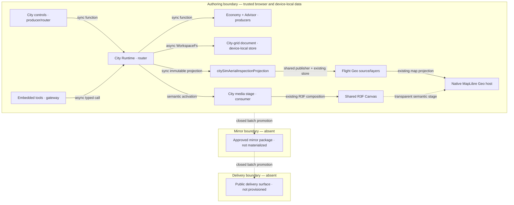

# Reference implementation: Knowgrph City Simulation PRD/TAD

## 1. Product decision

Knowgrph will add a small, deterministic city simulation to the existing
Geo+XR surface. Native MapLibre remains the geographic background while the
shared React Three Fiber Canvas remains a labeled semantic City media stage;
it does not paint an unregistered local City grid above the map. City Builder
coordinate controls own parcel input.
The feature turns a parcel zoning decision into an immediately visible economy
change and a bounded, explainable local recommendation. It is an extension of
current Geo, Canvas, Flight Geo overlay, FloatingPanel, camera, WorkspaceFs,
MCP, and gameplay-overlay owners rather than a standalone game or application.

The normative contract is
`.kiro/specs/knowgrph-city-building-sim/requirements.md`. This PRD/TAD explains
why the feature exists and how its ownership fits the product. The workspace
seed is a derived activation/proof projection and must never make a runtime
claim without exact-SHA evidence.

Every feature artifact is source-authored for Knowgrph. Only existing
repository-owned dependencies and assets may be used. No other
implementation's code, prose, schema, example, binary, or asset may be copied
or derived.

## 2. Problem and outcome

Probe-tree decisions are architecturally useful but difficult to understand in
an abstract graph. A compact city grid makes the loop legible:

1. select a parcel;
2. assign a zone or request a recommendation;
3. advance one deterministic tick;
4. observe population, land value, and treasury change;
5. save the exact state to a readable workspace document.

The intended outcome is a repeatable, two-minute local demo whose state can be
inspected through the same UI, Source Files, and agent interfaces already used
by Knowgrph.

## 3. Personas and journey

### Primary persona

A solo builder or presenter who needs a predictable local demonstration with
no account, hosted service, new asset pipeline, or model cost.

### Secondary persona

A reviewer who needs to verify that one source document caused the runtime
state and that a recommendation is bounded and non-mutating until approved.

### Happy path

1. Start Knowgrph from the exact candidate.
2. Open the city workspace seed in Explorer -> Source Files and apply it.
3. Geo+XR opens with native MapLibre as the geographic visual and viewport-
   gesture owner, plus a transparent shared R3F semantic City media stage.
4. The existing Flight Geo source/layers show one deterministic route and
   stopped aircraft while Flight gameplay/readiness remain inactive.
5. Select `r00c02`, zone it residential, and Start.
6. One tick commits; Stop fences later ticks.
7. Request Advice and inspect the ranked, zero-cost proposals.
8. Save and confirm read-back from `/game-city-sim/city-grid.md`.
9. Visit the six existing FloatingPanel views and see one shared city revision.
10. Exit and recover the prior surface and R3F camera.

## 4. Scope

### Must ship

- one typed 4 by 4 authored seed and a grid model that supports up to 64 by 64
  parcels without changing the document schema;
- residential, commercial, and industrial zoning;
- exact integer v1 economy coefficients and a fixed 1000 ms tick;
- Open, Start, Stop, Restart, Zone, Advise, Save, Reset, and Exit;
- a deterministic two-round local Advisor with a clarify gate;
- strict `/game.city @canvas #civic` native invocation;
- exactly two browser-local MCP tools;
- KGC plus CSV save/read-back at `/game-city-sim/city-grid.md`;
- Geo+XR activation with the existing native MapLibre host as the visual and
  viewport-gesture owner, plus one transparent shared R3F semantic media stage;
- explicit exclusion of the retained native XR physics world while City owns scene authority;
- one labeled semantic City media `figure`, conditionally selectable without
  intercepting MapLibre gestures; City Builder coordinate controls own parcel input;
- one deterministic read-only stopped aircraft/route projection through the
  existing Flight Geo store/source/layers, with a null XR environment and no Flight gameplay/readiness;
- `cityBuilder` plus city projections in Media, Animation, Motion Control,
  Game Mode, Flight Sim, and Camera;
- source-neutral exact-SHA browser proof.

### Deferred

- traffic and pedestrian simulation;
- multiplayer, sync, shared cities, and server persistence;
- procedural asset downloads;
- model-backed narration or Advisor enrichment;
- production publication or Cloudflare deployment.

### Success criteria

| Measure | Target |
|---|---:|
| First visible value from source application | within 2 minutes |
| First-value manual actions | at most 5 |
| Required model calls | 0 |
| Required network calls for core loop | 0 |
| Added runtime dependencies | 0 |
| City-created maps, sources, layers, or canvases | exactly 0 |
| Existing visual owners retained | 1 native MapLibre host + 1 shared R3F Canvas |
| Flight gameplay/readiness activated by City | 0 |
| Deterministic replay | byte-identical |
| Save targets | exactly 1 |
| Advisor rounds | at most 2 |

### ROI, MoSCoW, and time-to-value

The scoring threshold for Must scope is `1.0`, using
`(impact × monthly sessions) / (build hours + monthly TCO + monthly token
cost)`. Estimates are planning inputs, not delivery evidence.

| Feature | Tier | Impact | Sessions/month | Build hours | Monthly cash/token TCO | ROI score | Rationale |
|---|---|---:|---:|---:|---:|---:|---|
| Deterministic grid, lifecycle, and save | Must | 4 | 12 | 40 | $0 | 1.20 | Smallest complete observable loop |
| Local Advisor and shared projections | Must | 3 | 12 | 30 | $0 | 1.20 | Explains the state without a model |
| Model narration | Won't | 2 | 4 | 24 | $5 | 0.28 | Lower value and breaks the zero-token loop |
| Multiplayer persistence | Won't | 2 | 2 | 160 | $25 | 0.02 | Outside the local demonstration problem |

The primary journey has five manual actions before the first committed tick
and a two-minute elapsed ceiling. A clean-environment timed walk-through is
still unrecorded, so the target does not raise readiness.

| Time-to-value dimension | Estimate | Ceiling | Validation |
|---|---:|---:|---|
| Manual actions | 5 | 5 | clean-workspace browser walk-through |
| Elapsed time | 2 minutes | 2 minutes | timed first-tick proof |
| First-value action | one committed deterministic tick | — | visible revision and metric delta |
| Persona | solo builder/presenter | — | primary journey |

### Twelve-month deployment-model TCO

All values are estimates at the bounded demo load and exclude feature build
hours. None authorizes a promotion.

| Deployment model | Infra | API, egress, tokens | Ops | 12-month cash TCO | Disposition |
|---|---:|---:|---:|---:|---|
| Browser-local, existing FOSS application | $0 | $0 | 6 h/year | $0 | Chosen |
| Managed/serverless static delivery | $0 estimated within existing allowance | $0 | 4 h/year | $0 estimated | Not authorized |
| Provisioned/self-managed FOSS web server | $72/year | $0 | 18 h/year | $72 | Rejected for idle capacity |
| Hybrid/consolidated existing host | $0 incremental | $0 | 8 h/year | $0 incremental | Deferred; no delivery need |

## 5. Product surfaces

### Geo+XR composition

City source activation selects Surface Mode `geo-xr`. The existing native
MapLibre host stays visible as the geographic visual and viewport-gesture
owner. The existing shared R3F Canvas stays mounted as a transparent semantic
City media stage; its local City mesh and parcel hit testing are not mounted
over Geo. City Builder coordinate controls own parcel input. City creates no
map, source/layer family, Canvas, or renderer.

The City-owned pure `citySimAerialInspectionProjection` adapter reuses the
current selected authored XR spatial profile and existing Flight projector to
produce one deterministic route and one aircraft with phase `stopped`, run id
`0`, tick `0`, ready-frame request `null`, and environment `null`. Profile and
the absent environment form its stable visual identity, so City tick/revision
changes do not restart MapLibre bootstrap or move the aircraft. The shared
`CanvasViewport` geospatial publisher sends it through the existing Flight Geo
overlay store and MapLibre source/layers. The pure adapter calls no Flight
lifecycle, mission-advance, control, or readiness API; the shared publisher
retains normal Flight subscriptions for arbitration.

### City Builder

`cityBuilder` is the only complete editing surface. It displays lifecycle,
metrics, current selection, zone controls, Advisor results, save/read-back
status, and typed errors.

### Existing FloatingPanel views

| View | City contribution | Ownership rule |
|---|---|---|
| Media | palette and parcel-appearance context | read-only projection |
| Animation | fixed-step playback and tick revision | delegates Start/Stop |
| Motion Control | normalized input and current selection | no input copy |
| Game Mode | exclusive city-overlay state | explicit enter/exit handoff |
| Flight Sim | read-only City aerial-inspection handoff | no Flight gameplay/readiness or second city world |
| Camera | native MapLibre framing and captured shared R3F restore target | native MapLibre owns Geo+XR framing |

All seven views read one immutable City Runtime snapshot. Switching views must
not recreate, fork, or reset the city.

## 6. Interaction contract

### Native invocation

```text
/game.city @canvas #civic operation=<operation>
```

Operation arguments:

```text
operation=zone parcel=<rNNcNN> type=<residential|commercial|industrial>
operation=advise scope=<parcel|district>
```

Only `operation`, `parcel`, `type`, and `scope` are accepted keys. Missing
tokens, repeated sigils, repeated or unknown keys, mixed payload forms,
unsupported operations, and missing arguments fail without mutation.

### Input parity

Pointer, keyboard, and touch actions normalize to the same selected-parcel and
requested-zone actions. Input is copied into a queued runtime snapshot so a
later event cannot change an already scheduled tick or operation.

### Direct manipulation

Parcel interaction follows:

`select -> inspect -> choose zone -> validate -> commit -> observe next tick`.

An invalid parcel, zone, or lifecycle action explains why it was rejected and
leaves the committed revision unchanged.

## 7. Economy contract

The v1 model uses safe integers:

- treasury and land value: cents;
- tax rate: basis points;
- population and pollution: whole units.

Each tick applies parcel deltas in stable parcel-id order:

| Zone | Population | Land value | Pollution |
|---|---:|---:|---:|
| unzoned | 0 | 0 | 0 |
| residential | +2 | +200 cents | 0 |
| commercial | +1 | +100 cents | 0 |
| industrial | 0 | -50 cents | +1 |

Then:

```text
tax revenue cents = floor(total population * tax rate basis points / 100)

treasury delta cents =
  tax revenue cents
  + 300 * commercial parcel count
  + 500 * industrial parcel count
  - 100 * zoned parcel count
```

A complete candidate is validated before publication. One invalid or unsafe
integer aborts the whole tick. Time, frame cadence, locale, random values, and
object iteration order are not inputs to the economy.

## 8. Advisor contract

The Advisor is a deterministic browser-local harness:

`generate -> select -> clarify -> evolve`.

It validates scope first, runs no more than two rounds, and scores proposals
from the committed parcel/economy snapshot. A top-two delta below epsilon
returns `clarify_required: true` and changes no zone. A tie still present at
the cap prefers greater current land value, then the lexicographically smaller
parcel id, while retaining a tie flag.

Advice remains a proposal. An explicit Zone operation is the only way to
commit it. Every call emits one honest cost record with model `none` and all
token/cost fields zero.

## 9. Persistence contract

The only path is `/game-city-sim/city-grid.md`, owned through WorkspaceFs.
The document uses schema `knowgrph-city-grid/v1`:

1. ordered KGC frontmatter for city name, tick, treasury cents, and tax basis
   points;
2. one CSV table for parcel id, row, column, zone, land-value cents,
   population, and pollution;
3. stable parcel-id ordering, LF line endings, and one final newline.

Save is explicit. It writes, reads the same path back, compares bytes, parses
the read-back, and compares semantic state before reporting success. Open uses
a valid existing document or the authored default when the path is absent.
Malformed bytes remain untouched and block Start/Restart. Reset selects the
authored default in memory without overwriting those bytes.

## 10. Technical architecture

### Topology: city simulation v1.6 — Geo+XR conformance baseline

**Boundaries:** trusted browser runtime and device-local storage in Authoring;
an unmaterialized non-public Mirror; and an unprovisioned public Delivery
surface. Mirror and Delivery nodes below describe closed promotion targets,
not deployed components.

| Node | Role | Type | Lane | Connects to | Connection type | Data residency |
|---|---|---|---|---|---|---|
| City controls | Producer/router | Browser UI + invocation parser | Authoring | City Runtime | synchronous function call | volatile user-device memory |
| Embedded tools | Gateway | Browser-local WebMCP | Authoring | City Runtime | asynchronous typed function call | volatile user-device memory |
| City Runtime | Router | Browser function/state owner | Authoring | economy, Advisor, Workspace adapter, City stage, City Geo projection | synchronous function calls; async save | volatile user-device memory |
| Economy + Advisor | Producer | Pure browser functions | Authoring | City Runtime | synchronous return | volatile user-device memory |
| Workspace adapter | Store adapter | Browser function | Authoring | city-grid document | asynchronous WorkspaceFs read/write | user device |
| City-grid document | Store | KGC + CSV document | Authoring | Workspace adapter | device-local persistence | user device |
| City stage | Consumer | Semantic shared-Canvas media stage | Authoring | shared R3F Canvas; native MapLibre visual owner | synchronous semantic projection | volatile user-device memory |
| City media figure | Consumer | Semantic HTML figure | Authoring | shared WebGL Canvas and selection tooling | marker-only DOM projection | volatile user-device memory |
| `citySimAerialInspectionProjection` | Producer/adapter | Pure browser projection through the existing Flight projector | Authoring | current authored XR profile, null environment, shared geospatial publisher | synchronous stopped snapshot derivation | volatile user-device memory |
| Flight Geo overlay owners | Router/consumer | Existing store + MapLibre source/layers | Authoring | native MapLibre Geo host | synchronous store subscription and map-layer projection | volatile user-device memory |
| Native Geo host | Consumer | Existing MapLibre map | Authoring | selected Geo provider | existing provider transport; independent from gameplay | volatile user-device memory |
| Approved mirror package | Consumer | immutable publish artifact, absent | Mirror | public delivery surface | batch publish, boundary closed | none; not materialized |
| Public delivery surface | Consumer | static browser application, absent | Delivery | end-user browser | HTTPS fetch, boundary closed | none; not provisioned |



**Version note:** v1.6 suppresses the native graph from City source intent, clears the City-only Flight XR environment, and retains the stopped aircraft/route plus semantic figure without making a browser/promotion claim.

### Component inventory and VCC ownership

| Component ID | Component / interface | Responsibility | Local rung | Delivered rung | VCCs |
|---|---|---|---|---|---|
| `TAD-CITY-RUNTIME` | City Runtime / `dispatchCityOperation` | Runtime commits one valid operation atomically. | dev-proven | undocumented | 01, 02, 07 |
| `TAD-CITY-MODEL` | economy + Advisor / `advanceCityTick`, `adviseCityZoning` | Pure functions derive bounded deterministic results. | dev-proven | undocumented | 01, 04, 07 |
| `TAD-CITY-PERSIST` | codec + WorkspaceFs / `saveCityGridToWorkspace` | Adapter verifies one canonical document by read-back. | dev-proven | undocumented | 03, 07 |
| `TAD-CITY-STAGE` | semantic stage + controls / immutable projection | Retains a selectable shared R3F semantic stage while MapLibre owns Geo+XR visuals and City Builder owns parcel input. | spec-complete | undocumented | 02, 07 |
| `TAD-CITY-GEO` | `projectCitySimAerialInspectionToGeospatialOverlay` + shared publisher + existing Flight Geo store/layers | Reuses the current authored XR profile and Flight projector for one deterministic stopped aircraft/route with a null environment and no Flight activation. | spec-complete | undocumented | 02, 07 |
| `TAD-CITY-INVOKE` | parser / `executeCitySimInvocation` | Parser validates the exact native grammar before dispatch. | dev-proven | undocumented | 05, 07 |
| `TAD-CITY-MCP` | embedded tools / inspect + control | Gateway exposes the same dispatcher at browser-local trust. | dev-proven | undocumented | 06, 07 |
| `TAD-CITY-MIRROR` | approved package / batch publish | Absent target receives only an approved whole candidate. | undocumented | undocumented | — |
| `TAD-CITY-DELIVERY` | public surface / HTTPS | Absent target serves a promoted mirror. | undocumented | undocumented | — |

For each component, dependencies are exactly the topology `Connects to`
edges; configuration is the typed grid/economy/invocation schema; the runtime
uses the existing FOSS application stack and no paid dependency. Evidence and
rungs are owned by the VCC register, not inferred from source paths.

| Quality attribute | Bound | Architectural pattern | VCC |
|---|---|---|---|
| Determinism/performance | fixed 1000 ms tick; grid at most 64 by 64 | safe integers, stable ordering, atomic candidate | 01 |
| Security | no remote route; mutation through explicit control | strict parser and existing approval owner | 05, 06 |
| Offline behavior | 0 required network/model calls | local pure functions + WorkspaceFs | 01, 03, 04 |
| Observability | typed result for every operation; one zero Cost_Log/advice | shared immutable snapshot | 04 |
| Device reach | pointer, keyboard, touch parity | copied normalized input snapshot | 01, 07 |
| Visual ownership | 0 City-created maps/sources/layers/Canvases; Flight inactive | native MapLibre + shared R3F + existing Flight Geo overlay | 02, 07 |

### Single-world rule

The City Geo+XR presentation retains one shared React Three Fiber Canvas only
as a labeled semantic media stage. It does not mount the local instanced
parcel/building mesh or selection hit testing over the existing native MapLibre
host, because that grid has no geographic registration. MapLibre owns Geo+XR
visuals and viewport gestures; City Builder coordinate controls own parcel
input. City creates no map, source/layer family, Canvas, or alternate renderer.
Its pure aerial adapter reuses the current authored XR profile and existing
Flight projector to derive phase `stopped` with environment `null`. The shared
geospatial publisher uses `gympgrph/src/flightGeoOverlay.ts`, and the existing
`gympgrph/src/flightGeoOverlayMapLibre.ts` source/layers render the route and
aircraft. The City adapter calls no Flight lifecycle, control, mission-step, or
readiness API. Opening another exclusive gameplay surface exits the city
through the common lifecycle first; shared publication arbitration then
replaces or clears the City aerial projection as appropriate.

### Camera rule

In Geo+XR, native MapLibre keeps its own camera and responsive viewport
handling. City retains the captured shared R3F camera reference solely for
exact-once restoration on exit; it does not install an orthographic camera over
the geographic presentation.

### Persistence rule

The codec knows bytes but not WorkspaceFs. The WorkspaceFs adapter knows one
path but not formatting. The Runtime coordinates Save/read-back and publishes
the result. This separation keeps each failure observable and testable.

### MCP rule

Schema `knowgrph-city-sim-mcp/v1` registers exactly:

- `knowgrph.inspect_local_city_sim`;
- `knowgrph.control_local_city_sim`.

Inspect is read-only. Control uses the existing approval owner. Both delegate
to the same runtime dispatcher as City Builder and native invocation; no route
or deployment authority is added.

### Invocation Register: city simulation

This is the sole declaration site for these invocation identities.

| Route | Kind | Owner | Typed arguments | Trust boundary | Token cost |
|---|---|---|---|---|---:|
| `/game.city` | Command | `city-sim-invocation-owner` | `operation` enum; `parcel` `rNNcNN`; `type` enum; `scope` enum | browser-local; mutations explicit | 0 |
| `@canvas` | Binding | `city-sim-invocation-owner` | — | read-only surface selection | 0 |
| `#civic` | Tag | `city-sim-invocation-owner` | — | read-only context selection | 0 |
| `knowgrph.inspect_local_city_sim` | Tool identity | `city-sim-agent-ready-owner` | empty object | browser-local read | 0 |
| `knowgrph.control_local_city_sim` | Tool identity | `city-sim-agent-ready-owner` | native invocation or one structured operation | browser-local approval-gated mutation | 0 |

### Gateway federation and capability catalog disposition

The federation has one embedded browser surface. No remote gateway, proxy,
stdio, or HTTP transport is implied.

| Tool identity | Contributing catalog | Federated surface | Capability status | Federation disposition |
|---|---|---|---|---|
| `knowgrph.inspect_local_city_sim` | canonical agent-ready tool contract | embedded browser WebMCP | registered local read tool | catalogued in embedded federation; remote unregistered |
| `knowgrph.control_local_city_sim` | canonical agent-ready tool contract | embedded browser WebMCP | registered local mutation tool | catalogued in embedded federation; remote unregistered |

The catalog union deduplicates by full tool identity. Unavailable remote
catalogs are not synthesized; `sourceCatalogs[]` contains only the embedded
catalog for this feature.

**Routing rule:** browser-local read/control routes to the embedded surface;
all remote trust needs are excluded. **Catalog union source:** the canonical
agent-ready contract. **Excluded:** a monolithic proxy and transport parity.

## 11. Architecture decisions

### ADR-1: Geo+XR MapLibre-owned presentation, not a second world

**Decision:** Retain native MapLibre Geo as the visual and viewport-gesture
owner; keep the shared R3F Canvas only as a transparent labeled semantic media
stage, and use City Builder coordinate controls for parcel input.

**Reason:** A local isometric City mesh has no geographic registration. Keeping
it out of Geo+XR preserves the map, existing aircraft/route overlay, and
selection tooling without adding a parallel map or renderer owner.

### ADR-2: Integer economy

**Decision:** Store all money in cents and tax in basis points.

**Reason:** Integer arithmetic plus stable ordering makes replay and serialized
proof straightforward.

### ADR-3: One document, explicit read-back

**Decision:** Use one KGC plus CSV document and make Save verify its own
WorkspaceFs read-back.

**Reason:** The artifact remains human-readable and git-diffable while the UI
can distinguish an in-memory commit from a durable save.

### ADR-4: Local Advisor only

**Decision:** Ship a bounded deterministic heuristic and no enrichment branch.

**Reason:** The demo remains offline, zero-cost, replayable, and honest.

### ADR-5: Shared projection component

**Decision:** Compose one city projection wrapper around the six existing
FloatingPanel routes.

**Reason:** Existing panels retain ownership, city state stays centralized, and
the change avoids six copies and dependency cycles.

### ADR-6: Reuse the Flight Geo overlay without Flight gameplay

**Decision:** Derive the deterministic stopped aircraft/route from the current
selected authored XR spatial profile through the existing Flight projector and
`projectCitySimAerialInspectionToGeospatialOverlay`, with environment `null`.
The shared geospatial publisher uses the existing Flight Geo store
and MapLibre source/layers. The pure City adapter calls no Flight lifecycle,
mission-advance, control, or readiness API.

**Reason:** Reusing the stable overlay owner supplies the requested aerial
context without duplicate MapLibre sources/layers or a false Flight session.

### ADR alternatives and twelve-month TCO

Cash estimates assume the bounded local workload; maintainer hours expose the
otherwise hidden operations cost. Each rejected option is FOSS-capable and
would add no license fee, but duplicates an existing owner.

| ADR | Chosen option | FOSS alternative considered | Chosen 12-month TCO | Alternative 12-month TCO | Decision |
|---|---|---|---|---|---|
| 1 | stage in shared renderer | standalone FOSS scene/renderer | $0 + 4 h | $0 + 24 h | Reject duplicated world and camera owner |
| 2 | native safe integers | FOSS arbitrary-precision numeric library | $0 + 2 h | $0 + 6 h | Reject unnecessary dependency |
| 3 | KGC + CSV through WorkspaceFs | FOSS embedded browser database | $0 + 6 h | $0 + 16 h | Prefer readable, diffable state |
| 4 | deterministic local heuristic | FOSS local model runtime | $0 + 4 h; 0 tokens | about $120 power + 24 h; unbounded inference risk | Preserve offline deterministic zero cost |
| 5 | one projection wrapper | separate FOSS React composition per panel | $0 + 10 h | $0 + 30 h | Avoid duplicated adapters |
| 6 | existing Flight Geo overlay owners | City-specific MapLibre source/layers | $0 + 4 h | $0 + 18 h | Avoid duplicate map-layer lifecycle and readiness semantics |

## 12. Error policy

Every rejected operation returns a typed local result containing a code and
specific offending value. Entry failure restores the prior surface/camera.
If Exit supersedes an in-flight Geo claim and automatic rollback fails, the
typed `surface-restoration-failed` result replaces the provisional Exit
success. Tick failure preserves the prior revision. Save mismatch preserves
in-memory state and reports unsaved. Malformed file handling never repairs or
overwrites bytes. Advisor ambiguity never auto-zones. No error path creates
fallback MapLibre sources/layers or activates Flight.

## 13. VCC and Evidence Reference register

VCCs 01 and 03–06 retain one prior reproducible authoring result. The v1.6
Geo+XR, environment-exclusion, and semantic-media additions to VCC-02 have no
candidate-bound browser result, and VCC-07 remains unrecorded. The document
therefore remains `spec-complete`; prior evidence does not prove the new
composition or delivery.

| VCC | Evaluator-checkable end state and constraint | Stated check | Evidence Reference |
|---|---|---|---|
| `VCC-CITY-01` | Two equal seeds and input traces yield byte-identical valid city states; no clock, random, network, or model input. | Registered city model, economy, input, and lifecycle cases exit 0 with non-zero totals. | 2026-07-30 authoring: `npm --prefix canvas run test:ci:unit -- city.sim`; 31/31 passed |
| `VCC-CITY-02` | Geo+XR retains one native MapLibre visual/gesture owner and one shared transparent R3F semantic City media stage; no unregistered City mesh covers Geo; native XR physics/graph and Flight XR environment stay absent; the active City media figure is semantic/selectable without pointer capture; existing Flight Geo layers show the stopped aircraft/route without Flight activation or duplicate owners; exit restores surface/camera once. | Registered ownership/projection/semantic-media cases and candidate-bound browser assertions exit 0. | none recorded for v1.6; prior runs did not cover the full contract |
| `VCC-CITY-03` | Save writes only the canonical path, verifies byte and semantic read-back, and preserves malformed prior bytes. | Registered codec and persistence cases exit 0. | same authoring run; codec/persistence cases passed |
| `VCC-CITY-04` | Advisor returns at most two deterministic rounds and one zero-token cost record without mutating a zone. | Registered Advisor cases exit 0 and surface round/cost assertions. | same authoring run; Advisor case passed |
| `VCC-CITY-05` | Parser accepts only the exact tuple and typed operations; every invalid input leaves the revision unchanged. | Registered invocation cases exit 0 with accepted/rejected counts. | same authoring run; invocation case passed |
| `VCC-CITY-06` | Exactly two catalogued embedded tools inspect/control the same dispatcher; no remote transport or deployment authority is added. | Registered MCP contract and source-ownership cases exit 0. | same authoring run; MCP/source cases passed |
| `VCC-CITY-07` | A clean browser reaches first tick within five actions/two minutes, then proves Geo+XR composition, stopped aerial projection, inactive Flight, save, projections, stop fence, replay, and exit at one exact SHA. | Candidate-bound browser proof surfaces elapsed time, action count, SHA, and assertions. | none recorded |

## 14. PRD ↔ TAD ↔ VCC traceability

| PRD requirement | Product outcome | TAD component / interface | VCC |
|---|---|---|---|
| `PRD-CITY-R1/R12` | source ownership and honest evidence | `TAD-CITY-RUNTIME` / evidence boundary | 01, 07 |
| `PRD-CITY-R2/R11` | activation and seven-view proof | `TAD-CITY-STAGE` + `TAD-CITY-GEO` / immutable projections | 02, 07 |
| `PRD-CITY-R3/R10` | Geo+XR MapLibre ownership, semantic stage, aerial overlay, camera restoration | `TAD-CITY-STAGE` + `TAD-CITY-GEO` | 02, 07 |
| `PRD-CITY-R4/R5` | deterministic economy and lifecycle | `TAD-CITY-RUNTIME` / dispatch; `TAD-CITY-MODEL` / tick | 01 |
| `PRD-CITY-R6` | canonical save and read-back | `TAD-CITY-PERSIST` / WorkspaceFs adapter | 03 |
| `PRD-CITY-R7` | bounded local advice | `TAD-CITY-MODEL` / advise | 04 |
| `PRD-CITY-R8` | strict native invocation | `TAD-CITY-INVOKE` / parse + execute | 05 |
| `PRD-CITY-R9` | two browser-local tools | `TAD-CITY-MCP` / inspect + control | 06 |

The component inventory provides the reverse component-to-VCC mapping; no
component or requirement is intentionally orphaned.

## 15. Readiness Gap Matrix

| Workstream | Local rung | Delivered rung | Gap | Priority | Exit criteria (VCC) |
|---|---|---|---|---|---|
| deterministic runtime and Advisor | dev-proven | undocumented | clean-browser proof incomplete | major | 01, 04, 07 |
| Geo+XR shared stage, semantic media, aerial projection, and persistence | spec-complete | undocumented | v1.6 exact-SHA clean-browser proof absent | major | 02, 03, 07 |
| invocation and embedded tools | dev-proven | undocumented | no delivery proof | major | 05, 06, 07 |
| clean browser first value | spec-complete | undocumented | exact-SHA proof absent | major | 07 |
| Mirror and Delivery | undocumented | undocumented | targets absent and promotion not requested | none | separate promotion VCC required |

### Agent-platform dimensions and execution order

| Dimension | Tier | Order | Local rung | Delivered rung | VCC / disposition |
|---|---|---:|---|---|---|
| Agentic OS-ready | Won't this increment | — | undocumented | undocumented | no OS Status Surface declared |
| AI Agent-ready | Must | 1 | dev-proven | undocumented | 06, 07; embedded discovery only |
| MCP Gateway-ready | Won't this increment | — | undocumented | undocumented | remote gateway excluded; embedded tool disposition is recorded |

No Follow-on work starts before VCC-06 is satisfied. Discovery and reads stay
at zero tokens; no agent-platform path can promote a candidate.

## 16. Lane topology and Deploy Boundary Register

| Lane | Function | Mutation rights | Data residency | Readiness ceiling |
|---|---|---|---|---|
| Authoring | write and prove one candidate | source, tests, browser-local state | maintainer worktree and user device | runtime-ready |
| Mirror | hold one approved non-public package | publish-only; currently absent | none | runtime-ready |
| Delivery | serve one promoted mirror | publish-only; currently absent | none | production-verified |

| Boundary | From lane | To lane | Evidence Reference | Operator instruction | Rollback statement | State |
|---|---|---|---|---|---|---|
| `CITY-AUTHORING-TO-MIRROR` | Authoring | Mirror | none recorded | none; no promotion authorized | retain prior mirror and verify its manifest is unchanged | closed |
| `CITY-MIRROR-TO-DELIVERY` | Mirror | Delivery | none recorded | none; no promotion authorized | retain prior delivery revision and re-run its prior reachability check | closed |
