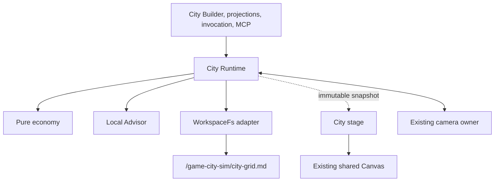

# Knowgrph City Simulation PRD/TAD

## 1. Product decision

Knowgrph will add a small, deterministic city simulation to the existing
shared Canvas. The feature turns a parcel zoning decision into an immediately
visible economy change and a bounded, explainable local recommendation. It is
an extension of current Canvas, FloatingPanel, camera, WorkspaceFs, MCP, and
gameplay-overlay owners rather than a standalone game or application.

The normative contract is
`.kiro/specs/knowgrph-city-building-sim/requirements.md`. This PRD/TAD explains
why the feature exists and how its ownership fits the product. The workspace
seed is a derived activation/proof projection and must never make a runtime
claim without exact-SHA evidence.

Every feature artifact is source-authored for Knowgrph. Only existing
repository-owned dependencies and assets may be used. No other
implementation's code, prose, schema, example, binary, or asset may be copied
or derived.

## 2. Problem and outcome

Probe-tree decisions are architecturally useful but difficult to understand in
an abstract graph. A compact city grid makes the loop legible:

1. select a parcel;
2. assign a zone or request a recommendation;
3. advance one deterministic tick;
4. observe population, land value, and treasury change;
5. save the exact state to a readable workspace document.

The intended outcome is a repeatable, two-minute local demo whose state can be
inspected through the same UI, Source Files, and agent interfaces already used
by Knowgrph.

## 3. Personas and journey

### Primary persona

A solo builder or presenter who needs a predictable local demonstration with
no account, hosted service, new asset pipeline, or model cost.

### Secondary persona

A reviewer who needs to verify that one source document caused the runtime
state and that a recommendation is bounded and non-mutating until approved.

### Happy path

1. Start Knowgrph from the exact candidate.
2. Open the city workspace seed in Explorer -> Source Files and apply it.
3. City Builder opens and the authored 4 by 4 grid appears on the shared
   Canvas.
4. Select `r00c02`, zone it residential, and Start.
5. One tick commits; Stop fences later ticks.
6. Request Advice and inspect the ranked, zero-cost proposals.
7. Save and confirm read-back from `/game-city-sim/city-grid.md`.
8. Visit the six existing FloatingPanel views and see one shared city revision.
9. Exit and recover the prior surface and camera.

## 4. Scope

### Must ship

- one typed 4 by 4 authored seed and a grid model that supports up to 64 by 64
  parcels without changing the document schema;
- residential, commercial, and industrial zoning;
- exact integer v1 economy coefficients and a fixed 1000 ms tick;
- Open, Start, Stop, Restart, Zone, Advise, Save, Reset, and Exit;
- a deterministic two-round local Advisor with a clarify gate;
- strict `/game.city @canvas #civic` native invocation;
- exactly two browser-local MCP tools;
- KGC plus CSV save/read-back at `/game-city-sim/city-grid.md`;
- one additive city stage in the existing shared Canvas;
- `cityBuilder` plus city projections in Media, Animation, Motion Control,
  Game Mode, Flight Sim, and Camera;
- source-neutral exact-SHA browser proof.

### Deferred

- traffic and pedestrian simulation;
- multiplayer, sync, shared cities, and server persistence;
- procedural asset downloads;
- model-backed narration or Advisor enrichment;
- production publication or Cloudflare deployment.

### Success criteria

| Measure | Target |
|---|---:|
| First visible value from source application | within 2 minutes |
| Required model calls | 0 |
| Required network calls for core loop | 0 |
| Added runtime dependencies | 0 |
| Canvas elements during session | exactly 1 |
| Deterministic replay | byte-identical |
| Save targets | exactly 1 |
| Advisor rounds | at most 2 |

## 5. Product surfaces

### City Builder

`cityBuilder` is the only complete editing surface. It displays lifecycle,
metrics, current selection, zone controls, Advisor results, save/read-back
status, and typed errors.

### Existing FloatingPanel views

| View | City contribution | Ownership rule |
|---|---|---|
| Media | palette and parcel-appearance context | read-only projection |
| Animation | fixed-step playback and tick revision | delegates Start/Stop |
| Motion Control | normalized input and current selection | no input copy |
| Game Mode | exclusive city-overlay state | explicit enter/exit handoff |
| Flight Sim | read-only aerial-inspection handoff | no second city world |
| Camera | orthographic framing and restore target | shared camera owner |

All seven views read one immutable City Runtime snapshot. Switching views must
not recreate, fork, or reset the city.

## 6. Interaction contract

### Native invocation

```text
/game.city @canvas #civic operation=<operation>
```

Operation arguments:

```text
operation=zone parcel=<rNNcNN> type=<residential|commercial|industrial>
operation=advise scope=<parcel|district>
```

Only `operation`, `parcel`, `type`, and `scope` are accepted keys. Missing
tokens, repeated sigils, repeated or unknown keys, mixed payload forms,
unsupported operations, and missing arguments fail without mutation.

### Input parity

Pointer, keyboard, and touch actions normalize to the same selected-parcel and
requested-zone actions. Input is copied into a queued runtime snapshot so a
later event cannot change an already scheduled tick or operation.

### Direct manipulation

Parcel interaction follows:

`select -> inspect -> choose zone -> validate -> commit -> observe next tick`.

An invalid parcel, zone, or lifecycle action explains why it was rejected and
leaves the committed revision unchanged.

## 7. Economy contract

The v1 model uses safe integers:

- treasury and land value: cents;
- tax rate: basis points;
- population and pollution: whole units.

Each tick applies parcel deltas in stable parcel-id order:

| Zone | Population | Land value | Pollution |
|---|---:|---:|---:|
| unzoned | 0 | 0 | 0 |
| residential | +2 | +200 cents | 0 |
| commercial | +1 | +100 cents | 0 |
| industrial | 0 | -50 cents | +1 |

Then:

```text
tax revenue cents = floor(total population * tax rate basis points / 100)

treasury delta cents =
  tax revenue cents
  + 300 * commercial parcel count
  + 500 * industrial parcel count
  - 100 * zoned parcel count
```

A complete candidate is validated before publication. One invalid or unsafe
integer aborts the whole tick. Time, frame cadence, locale, random values, and
object iteration order are not inputs to the economy.

## 8. Advisor contract

The Advisor is a deterministic browser-local harness:

`generate -> select -> clarify -> evolve`.

It validates scope first, runs no more than two rounds, and scores proposals
from the committed parcel/economy snapshot. A top-two delta below epsilon
returns `clarify_required: true` and changes no zone. A tie still present at
the cap prefers greater current land value, then the lexicographically smaller
parcel id, while retaining a tie flag.

Advice remains a proposal. An explicit Zone operation is the only way to
commit it. Every call emits one honest cost record with model `none` and all
token/cost fields zero.

## 9. Persistence contract

The only path is `/game-city-sim/city-grid.md`, owned through WorkspaceFs.
The document uses schema `knowgrph-city-grid/v1`:

1. ordered KGC frontmatter for city name, tick, treasury cents, and tax basis
   points;
2. one CSV table for parcel id, row, column, zone, land-value cents,
   population, and pollution;
3. stable parcel-id ordering, LF line endings, and one final newline.

Save is explicit. It writes, reads the same path back, compares bytes, parses
the read-back, and compares semantic state before reporting success. Open uses
a valid existing document or the authored default when the path is absent.
Malformed bytes remain untouched and block Start/Restart. Reset selects the
authored default in memory without overwriting those bytes.

## 10. Technical architecture



### Single-world rule

The City Stage is a React Three Fiber group with instanced parcel/building
meshes and selection hit testing. It is inserted by the existing gameplay
overlay owner and never creates a Canvas or alternate renderer. Opening another
exclusive gameplay surface exits the city through the common lifecycle first.

### Camera rule

City entry installs a mode-scoped orthographic `isometric-topdown` framing
through the existing camera owner. Responsive bounds update the projection
matrix. Exit reinstalls the captured camera reference exactly once.

### Persistence rule

The codec knows bytes but not WorkspaceFs. The WorkspaceFs adapter knows one
path but not formatting. The Runtime coordinates Save/read-back and publishes
the result. This separation keeps each failure observable and testable.

### MCP rule

Schema `knowgrph-city-sim-mcp/v1` registers exactly:

- `knowgrph.inspect_local_city_sim`;
- `knowgrph.control_local_city_sim`.

Inspect is read-only. Control uses the existing approval owner. Both delegate
to the same runtime dispatcher as City Builder and native invocation; no route
or deployment authority is added.

## 11. Architecture decisions

### ADR-1: Additive stage, not a second world

**Decision:** Mount instanced city meshes inside the existing shared Canvas.

**Reason:** One scene and camera lifecycle keeps overlays composable and avoids
the synchronization and accessibility cost of a parallel renderer.

### ADR-2: Integer economy

**Decision:** Store all money in cents and tax in basis points.

**Reason:** Integer arithmetic plus stable ordering makes replay and serialized
proof straightforward.

### ADR-3: One document, explicit read-back

**Decision:** Use one KGC plus CSV document and make Save verify its own
WorkspaceFs read-back.

**Reason:** The artifact remains human-readable and git-diffable while the UI
can distinguish an in-memory commit from a durable save.

### ADR-4: Local Advisor only

**Decision:** Ship a bounded deterministic heuristic and no enrichment branch.

**Reason:** The demo remains offline, zero-cost, replayable, and honest.

### ADR-5: Shared projection component

**Decision:** Compose one city projection wrapper around the six existing
FloatingPanel routes.

**Reason:** Existing panels retain ownership, city state stays centralized, and
the change avoids six copies and dependency cycles.

## 12. Error policy

Every rejected operation returns a typed local result containing a code and
specific offending value. Entry failure restores the prior surface/camera.
Tick failure preserves the prior revision. Save mismatch preserves in-memory
state and reports unsaved. Malformed file handling never repairs or overwrites
bytes. Advisor ambiguity never auto-zones.

## 13. Evidence plan

### Source proof

- economy coefficient, atomicity, stop-fence, and replay tests;
- codec canonicalization, round-trip, and malformed-byte tests;
- invocation and Advisor property tests;
- exact-two-tool MCP and shared-Canvas static tests;
- City Builder and six-projection routing tests;
- typecheck and focused build.

### Browser proof

Proof starts without a city environment selector or persisted city state.
Before source application, record that City Builder is closed and the city
stage inactive. After Source Files bootstrap is ready, apply the authored seed
and assert City Builder, one Canvas, authored metrics, and a clean console.

Exercise Zone, one Tick, Stop fencing, Advice, Save/read-back, all six
projections, and Exit restoration. Repeat from the same neutral state and
compare the initial serialized bytes.

The seed remains `proof-pending` and runtime validation boxes remain unchecked
until this evidence exists at the exact candidate SHA. Protected integration
and any release are separate later gates.

## 14. Traceability

| Product area | Normative requirements | Primary design owner |
|---|---|---|
| Ownership and source boundary | 1, 12 | owner map and evidence |
| Activation and seven panel views | 2, 11 | admission and projections |
| Shared scene/camera | 3, 10 | stage and camera adapters |
| Economy and lifecycle | 4, 5 | runtime and pure economy |
| Persistence | 6 | codec and WorkspaceFs adapter |
| Advisor | 7 | local Advisor |
| Invocation and MCP | 8, 9 | parser and MCP adapter |
