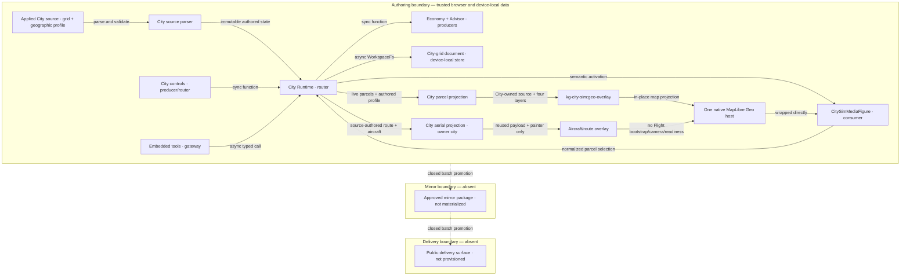

# Reference implementation: Knowgrph City Simulation PRD/TAD

## 1. Product decision

Knowgrph will add a small, deterministic city simulation to the existing
Geo+XR surface. One retained native MapLibre map is the sole City visual,
renderer, camera mechanism, and viewport-gesture owner. City owns one parcel
GeoJSON source with fill, extrusion, outline, and selected-parcel layers over
that map, and frames them inside the visible aperture without replacing the
map style. `CitySimMediaFigure` wraps the map as a labeled, selectable semantic
media stage; City mounts zero Three.js/React Three Fiber Canvas, stage, mesh,
or camera. Map feature selection and City Builder coordinate controls
normalize into the same parcel-selection action.
The feature turns a parcel zoning decision into an immediately visible economy
change and a bounded, explainable local recommendation. It is an extension of
current Geo, Canvas, Flight Geo overlay, FloatingPanel, camera, WorkspaceFs,
MCP, and gameplay-overlay owners rather than a standalone game or application.

The normative contract is
`.kiro/specs/knowgrph-city-building-sim/requirements.md`. This PRD/TAD explains
why the feature exists and how its ownership fits the product. The workspace
seed is a derived activation/proof projection and must never make a runtime
claim without exact-SHA evidence.

Every feature artifact is source-authored for Knowgrph. Only existing
repository-owned dependencies and assets may be used. No other
implementation's code, prose, schema, example, binary, or asset may be copied
or derived.

## 2. Problem and outcome

Probe-tree decisions are architecturally useful but difficult to understand in
an abstract graph. A compact city grid makes the loop legible:

1. select a parcel;
2. assign a zone or request a recommendation;
3. advance one deterministic tick;
4. observe population, land value, and treasury change;
5. save the exact state to a readable workspace document.

The intended outcome is a repeatable, two-minute local demo whose state can be
inspected through the same UI, Source Files, and agent interfaces already used
by Knowgrph.

## 3. Personas and journey

### Primary persona

A solo builder or presenter who needs a predictable local demonstration with
no account, hosted service, new asset pipeline, or model cost.

### Secondary persona

A reviewer who needs to verify that one source document caused the runtime
state and that a recommendation is bounded and non-mutating until approved.

### Happy path

1. Start Knowgrph from the exact candidate.
2. Open the city workspace seed in Explorer -> Source Files and apply it.
3. Geo+XR opens with one native MapLibre map, the source-authored City parcel
   polygons, and the semantic City media `figure`.
4. The selected Singapore environment renders source-authored major POIs as native
   MapLibre extrusions below the parcels. A reused overlay shows the authored
   route and stopped aircraft with owner `city`; Flight bootstrap, camera,
   gameplay, and readiness remain inactive.
5. Select `r00c02`, zone it residential, and Start.
6. One tick commits; Stop fences later ticks.
7. Request Advice and inspect the ranked, zero-cost proposals.
8. Save and confirm read-back from `/game-city-sim/city-grid.md`.
9. Visit the six existing FloatingPanel views and see one shared city revision.
10. Exit and recover the prior FloatingPanel/Canvas surface state exactly once.

## 4. Scope

### Must ship

- one source-authored initial parcel grid and geographic profile parsed from
  the applied seed, plus a grid model that supports up to 64 by 64 parcels
  without changing the document schema or adding a second initializer;
- residential, commercial, and industrial zoning;
- exact integer v1 economy coefficients and a fixed 1000 ms tick;
- Open, Start, Stop, Restart, Zone, Advise, Save, Reset, and Exit;
- a deterministic two-round local Advisor with a clarify gate;
- strict `/game.city @canvas #civic` native invocation;
- exactly two browser-local MCP tools;
- KGC plus CSV save/read-back at `/game-city-sim/city-grid.md`;
- Geo+XR activation with one retained native MapLibre host, one City-owned
  parcel GeoJSON source, and fill, extrusion, outline, and selected-parcel
  layers, wrapped by one semantic City media `figure`;
- zero City Three.js/R3F Canvas, stage, mesh, camera, or pointer handler;
- explicit exclusion of the retained native XR physics world while City owns scene authority;
- one labeled semantic City media `figure`, visible to selection tooling and
  conditionally selectable without blocking native MapLibre gestures;
- visible-aperture City framing that responds to map/panel resize, preserves
  the map style, and restores prior map padding when City releases ownership;
- one deterministic stopped aircraft/route projection through the reused overlay
  with owner `city`, plus shared environment layers below the parcels, independently
  of Flight bootstrap, camera, gameplay, and readiness;
- `cityBuilder` plus city projections in Media, Animation, Motion Control,
  Game Mode, Flight Sim, and Camera;
- source-neutral exact-SHA browser proof.

### Deferred

- traffic and pedestrian simulation;
- multiplayer, sync, shared cities, and server persistence;
- procedural asset downloads;
- model-backed narration or Advisor enrichment;
- production publication or Cloudflare deployment.

### Success criteria

| Measure | Target |
|---|---:|
| First visible value from source application | within 2 minutes |
| First-value manual actions | at most 5 |
| Required model calls | 0 |
| Required network calls for core loop | 0 |
| Added runtime dependencies | 0 |
| Native MapLibre maps retained | exactly 1 |
| City parcel GeoJSON source families | exactly 1 |
| City parcel style layers | exactly 4 |
| City-created Three canvases or alternate renderers | exactly 0 |
| Flight bootstrap/camera/gameplay/readiness activated by City | 0 |
| Deterministic replay | byte-identical |
| Save targets | exactly 1 |
| Advisor rounds | at most 2 |

### ROI, MoSCoW, and time-to-value

The scoring threshold for Must scope is `1.0`, using
`(impact × monthly sessions) / (build hours + monthly TCO + monthly token
cost)`. Estimates are planning inputs, not delivery evidence.

| Feature | Tier | Impact | Sessions/month | Build hours | Monthly cash/token TCO | ROI score | Rationale |
|---|---|---:|---:|---:|---:|---:|---|
| Deterministic grid, lifecycle, and save | Must | 4 | 12 | 40 | $0 | 1.20 | Smallest complete observable loop |
| Local Advisor and shared projections | Must | 3 | 12 | 30 | $0 | 1.20 | Explains the state without a model |
| Model narration | Won't | 2 | 4 | 24 | $5 | 0.28 | Lower value and breaks the zero-token loop |
| Multiplayer persistence | Won't | 2 | 2 | 160 | $25 | 0.02 | Outside the local demonstration problem |

The primary journey has five manual actions before the first committed tick
and a two-minute elapsed ceiling. A clean-environment timed walk-through is
still unrecorded, so the target does not raise readiness.

| Time-to-value dimension | Estimate | Ceiling | Validation |
|---|---:|---:|---|
| Manual actions | 5 | 5 | clean-workspace browser walk-through |
| Elapsed time | 2 minutes | 2 minutes | timed first-tick proof |
| First-value action | one committed deterministic tick | — | visible revision and metric delta |
| Persona | solo builder/presenter | — | primary journey |

### Twelve-month deployment-model TCO

All values are estimates at the bounded demo load and exclude feature build
hours. None authorizes a promotion.

| Deployment model | Infra | API, egress, tokens | Ops | 12-month cash TCO | Disposition |
|---|---:|---:|---:|---:|---|
| Browser-local, existing FOSS application | $0 | $0 | 6 h/year | $0 | Chosen |
| Managed/serverless static delivery | $0 estimated within existing allowance | $0 | 4 h/year | $0 estimated | Not authorized |
| Provisioned/self-managed FOSS web server | $72/year | $0 | 18 h/year | $72 | Rejected for idle capacity |
| Hybrid/consolidated existing host | $0 incremental | $0 | 8 h/year | $0 incremental | Deferred; no delivery need |

## 5. Product surfaces

### Geo+XR composition

City source activation selects Surface Mode `geo-xr`. The existing native
MapLibre host stays visible as the sole City visual, renderer, camera, and
viewport-gesture owner. `CitySimMediaFigure` wraps that geospatial projection
directly and owns only the semantic `figure`, active selection marker, caption,
and selection-tool identity. It is not an aria-hidden decoration or generic
layout wrapper. City mounts zero Three.js/R3F Canvas, stage, mesh, camera, or
alternate renderer.

The applied City source is the sole authority for both the initial parcel grid
and geographic profile: anchor, parcel dimensions/gaps/bearing, aerial route,
and aircraft pose. The parser fails closed when either section is absent or
invalid; runtime activation has no secondary grid or geographic-profile
authority. `projectCitySimToGeospatialOverlay` combines that profile with the
live City parcel state and selection. The City MapLibre controller projects
one geographic Polygon per parcel through
`kg-city-sim:geo-overlay`, with fill, extrusion, outline, and selected-parcel
layers above the shared environment and below the aircraft/route overlay. It
updates only its own source and layers and never replaces the provider style.

The City aerial adapter publishes the authored route and aircraft with phase
`stopped`, owner `city`, run id `0`, tick `0`, ready-frame request `null`, and the
selected environment. It projects major POIs through MapLibre fill-extrusion
layers without owning XR selection, physics, or a Three renderer. Reused painters
do not enter Flight bootstrap, camera, lifecycle, controls, mission advance, or
readiness. City parcel state remains represented only by the City source/layers.

### City Builder

`cityBuilder` is the only complete editing surface. It displays lifecycle,
metrics, current selection, zone controls, Advisor results, save/read-back
status, and typed errors.

### Existing FloatingPanel views

| View | City contribution | Ownership rule |
|---|---|---|
| Media | palette and parcel-appearance context | read-only projection |
| Animation | fixed-step playback and tick revision | delegates Start/Stop |
| Motion Control | normalized input and current selection | map and coordinate controls share one City selection action |
| Game Mode | exclusive city-overlay state | explicit enter/exit handoff |
| Flight Sim | read-only City aerial-inspection handoff | owner `city`; no Flight bootstrap/camera/gameplay/readiness or second city world |
| Camera | native MapLibre visible-aperture framing | City fits parcel bounds around panels, refits on resize, and restores prior padding on release |

All seven views read one immutable City Runtime snapshot. Switching views must
not recreate, fork, or reset the city.

## 6. Interaction contract

### Native invocation

```text
/game.city @canvas #civic operation=<operation>
```

Operation arguments:

```text
operation=zone parcel=<rNNcNN> type=<residential|commercial|industrial>
operation=advise scope=<parcel|district>
```

Only `operation`, `parcel`, `type`, and `scope` are accepted keys. Missing
tokens, repeated sigils, repeated or unknown keys, mixed payload forms,
unsupported operations, and missing arguments fail without mutation.

### Input parity

Pointer, keyboard, and touch actions normalize to the same selected-parcel and
requested-zone actions. Input is copied into a queued runtime snapshot so a
later event cannot change an already scheduled tick or operation.

### Direct manipulation

Parcel interaction follows:

`select -> inspect -> choose zone -> validate -> commit -> observe next tick`.

An invalid parcel, zone, or lifecycle action explains why it was rejected and
leaves the committed revision unchanged.

## 7. Economy contract

The v1 model uses safe integers:

- treasury and land value: cents;
- tax rate: basis points;
- population and pollution: whole units.

Each tick applies parcel deltas in stable parcel-id order:

| Zone | Population | Land value | Pollution |
|---|---:|---:|---:|
| unzoned | 0 | 0 | 0 |
| residential | +2 | +200 cents | 0 |
| commercial | +1 | +100 cents | 0 |
| industrial | 0 | -50 cents | +1 |

Then:

```text
tax revenue cents = floor(total population * tax rate basis points / 100)

treasury delta cents =
  tax revenue cents
  + 300 * commercial parcel count
  + 500 * industrial parcel count
  - 100 * zoned parcel count
```

A complete candidate is validated before publication. One invalid or unsafe
integer aborts the whole tick. Time, frame cadence, locale, random values, and
object iteration order are not inputs to the economy.

## 8. Advisor contract

The Advisor is a deterministic browser-local harness:

`generate -> select -> clarify -> evolve`.

It validates scope first, runs no more than two rounds, and scores proposals
from the committed parcel/economy snapshot. A top-two delta below epsilon
returns `clarify_required: true` and changes no zone. A tie still present at
the cap prefers greater current land value, then the lexicographically smaller
parcel id, while retaining a tie flag.

Advice remains a proposal. An explicit Zone operation is the only way to
commit it. Every call emits one honest cost record with model `none` and all
token/cost fields zero.

## 9. Persistence contract

The only path is `/game-city-sim/city-grid.md`, owned through WorkspaceFs.
The document uses schema `knowgrph-city-grid/v1`:

1. ordered KGC frontmatter for city name, tick, treasury cents, and tax basis
   points;
2. one CSV table for parcel id, row, column, zone, land-value cents,
   population, and pollution;
3. stable parcel-id ordering, LF line endings, and one final newline.

Save is explicit. It writes, reads the same path back, compares bytes, parses
the read-back, and compares semantic state before reporting success. Open uses
a valid existing document or the initial grid parsed from the applied City
source when the path is absent. Malformed bytes remain untouched and block
Start/Restart. Reset restores that source-authored initial grid in memory
without overwriting those bytes. Open, Restart, and Reset have no initializer
other than the applied source.

## 10. Technical architecture

### Topology: city simulation v1.8 — source-authored MapLibre Geo+XR

**Boundaries:** trusted browser runtime and device-local storage in Authoring;
an unmaterialized non-public Mirror; and an unprovisioned public Delivery
surface. Mirror and Delivery nodes below describe closed promotion targets,
not deployed components.

| Node | Role | Type | Lane | Connects to | Connection type | Data residency |
|---|---|---|---|---|---|---|
| Applied City source | Source authority | Workspace seed document | Authoring | City source parser | Source Files application | repository source bytes |
| City source parser | Producer/validator | Pure browser parser | Authoring | City Runtime, City parcel projection, City aerial projection | synchronous immutable source projection | volatile user-device memory |
| City controls | Producer/router | Browser UI + invocation parser | Authoring | City Runtime | synchronous function call | volatile user-device memory |
| Embedded tools | Gateway | Browser-local WebMCP | Authoring | City Runtime | asynchronous typed function call | volatile user-device memory |
| City Runtime | Router | Browser function/state owner | Authoring | economy, Advisor, Workspace adapter, City media figure, City parcel projection, City aerial projection | synchronous function calls; async save | volatile user-device memory |
| Economy + Advisor | Producer | Pure browser functions | Authoring | City Runtime | synchronous return | volatile user-device memory |
| Workspace adapter | Store adapter | Browser function | Authoring | city-grid document | asynchronous WorkspaceFs read/write | user device |
| City-grid document | Store | KGC + CSV document | Authoring | Workspace adapter | device-local persistence | user device |
| City media figure | Consumer/router | Semantic HTML `figure` | Authoring | native MapLibre Geo+XR host, selection tooling, City Runtime | semantic media projection and normalized parcel selection | volatile user-device memory |
| City parcel projection | Producer/router | `CityGeoOverlaySnapshot` + City MapLibre controller | Authoring | City parcel source/layers, visible-aperture framing | synchronous store publication and map projection | volatile user-device memory |
| City parcel source/layers | Consumer | `kg-city-sim:geo-overlay` GeoJSON + four style layers | Authoring | native MapLibre Geo host | in-place MapLibre source/layer updates | volatile user-device memory |
| City aerial projection | Producer/adapter | Source-authored stopped aircraft/route snapshot | Authoring | reused aircraft/route overlay | synchronous owner-`city` projection | volatile user-device memory |
| Reused aircraft/route overlay | Consumer | Existing aircraft/route source and painter | Authoring | native MapLibre Geo host | in-place overlay update; Flight bootstrap/camera/readiness excluded | volatile user-device memory |
| Native Geo host | Consumer | Existing MapLibre map | Authoring | selected Geo provider | existing provider transport; independent from gameplay | volatile user-device memory |
| Approved mirror package | Consumer | immutable publish artifact, absent | Mirror | public delivery surface | batch publish, boundary closed | none; not materialized |
| Public delivery surface | Consumer | static browser application, absent | Delivery | end-user browser | HTTPS fetch, boundary closed | none; not provisioned |



**Version note:** v1.8 establishes a source-authored City grid and geographic
profile, one City parcel source/layer family on the retained map, and an
independent owner-`city` aircraft/route overlay. It adds semantic media
selection and visible-aperture framing while making no exact-SHA browser,
protected-integration, promotion, or delivery claim.

### Component inventory and VCC ownership

| Component ID | Component / interface | Responsibility | Local rung | Delivered rung | VCCs |
|---|---|---|---|---|---|
| `TAD-CITY-RUNTIME` | City Runtime / `dispatchCityOperation` | Runtime commits one valid operation atomically. | dev-proven | undocumented | 01, 02, 07 |
| `TAD-CITY-MODEL` | economy + Advisor / `advanceCityTick`, `adviseCityZoning` | Pure functions derive bounded deterministic results. | dev-proven | undocumented | 01, 04, 07 |
| `TAD-CITY-PERSIST` | codec + WorkspaceFs / `saveCityGridToWorkspace` | Adapter verifies one canonical document by read-back. | dev-proven | undocumented | 03, 07 |
| `TAD-CITY-SOURCE` | City authored-source parser | Parses and validates the initial grid and geographic profile from the applied source as the only initialization authority. | spec-complete | undocumented | 01, 02, 03, 07 |
| `TAD-CITY-GEO-SURFACE` | `CitySimMediaFigure` + native MapLibre / semantic projection | Wraps the one native MapLibre Geo+XR owner in a selectable semantic `figure`; preserves gestures and mounts zero City Three.js/R3F content. | spec-complete | undocumented | 02, 07 |
| `TAD-CITY-GEO` | `projectCitySimToGeospatialOverlay` + City MapLibre controller | Projects live parcels through one City source and four layers, frames the visible aperture, refits on resize, and restores prior padding without replacing style. | spec-complete | undocumented | 02, 07 |
| `TAD-CITY-AERIAL` | City aerial adapter + shared environment and reused aircraft/route overlays | Publishes the source-authored stopped route/aircraft with owner `city` and the selected read-only environment, while Flight bootstrap, camera, gameplay, and readiness remain inactive. | spec-complete | undocumented | 02, 07 |
| `TAD-CITY-INVOKE` | parser / `executeCitySimInvocation` | Parser validates the exact native grammar before dispatch. | dev-proven | undocumented | 05, 07 |
| `TAD-CITY-MCP` | embedded tools / inspect + control | Gateway exposes the same dispatcher at browser-local trust. | dev-proven | undocumented | 06, 07 |
| `TAD-CITY-MIRROR` | approved package / batch publish | Absent target receives only an approved whole candidate. | undocumented | undocumented | — |
| `TAD-CITY-DELIVERY` | public surface / HTTPS | Absent target serves a promoted mirror. | undocumented | undocumented | — |

For each component, dependencies are exactly the topology `Connects to`
edges; configuration is the typed grid/economy/invocation schema; the runtime
uses the existing FOSS application stack and no paid dependency. Evidence and
rungs are owned by the VCC register, not inferred from source paths.

| Quality attribute | Bound | Architectural pattern | VCC |
|---|---|---|---|
| Determinism/performance | fixed 1000 ms tick; grid at most 64 by 64 | safe integers, stable ordering, atomic candidate | 01 |
| Security | no remote route; mutation through explicit control | strict parser and existing approval owner | 05, 06 |
| Offline behavior | 0 required network/model calls | local pure functions + WorkspaceFs | 01, 03, 04 |
| Observability | typed result for every operation; one zero Cost_Log/advice | shared immutable snapshot | 04 |
| Device reach | pointer, keyboard, touch parity | copied normalized input snapshot | 01, 07 |
| Visual ownership | 1 native map; 1 City source; 4 City layers; shared environment layers; 0 City Three Canvases; Flight bootstrap/camera/readiness inactive | environment + City parcel overlay + semantic figure + independent owner-`city` aircraft/route | 02, 07 |

### Single-world rule

The City Geo+XR presentation uses one native MapLibre map as its sole visual,
renderer, camera, and viewport-gesture owner. `CitySimMediaFigure` wraps that
map directly as a labeled semantic media stage rather than a generic or
aria-hidden decoration. It owns no renderer and does not intercept native map
gestures. City mounts zero Three.js/R3F Canvas, stage, mesh, camera, or alternate
renderer. The source-authored geographic profile and live runtime state produce
one City-owned parcel GeoJSON source and exactly four City layers on that map;
they are the only City representation.

The source-authored route and aircraft are an independent overlay with owner
`city`. The selected environment is a read-only shared MapLibre projection below
City parcels; City gains no XR physics, placement, or Three-renderer authority.
Reusing the environment and aircraft/route painters does not make Flight bootstrap,
camera, lifecycle,
controls, mission step, or readiness path a City dependency. Opening another
exclusive gameplay surface exits City through the common lifecycle first;
publication arbitration then removes the City parcel source/layers and clears
or replaces the owner-`city` aircraft/route projection without leaving aliases
or fallback renderers.

### Camera rule

In Geo+XR, native MapLibre keeps its camera mechanism and responsive viewport
handling. City fits the parcel bounds with padding computed from the currently
visible map aperture, so Explorer and floating panels do not obscure the City.
Map and panel resize events schedule a bounded refit; City does not replace the
style or call a Flight camera path. City saves the pre-City MapLibre padding and
restores it when presentation ownership changes or the controller disposes.
It neither captures nor restores a Three/R3F camera nor installs an
orthographic camera over the geographic presentation. Exit restores the prior
map padding and captured FloatingPanel/Canvas surface state exactly once.

### Persistence rule

The codec knows bytes but not WorkspaceFs. The WorkspaceFs adapter knows one
path but not formatting. The Runtime coordinates Save/read-back and publishes
the result. This separation keeps each failure observable and testable.

### MCP rule

Schema `knowgrph-city-sim-mcp/v1` registers exactly:

- `knowgrph.inspect_local_city_sim`;
- `knowgrph.control_local_city_sim`.

Inspect is read-only. Control uses the existing approval owner. Both delegate
to the same runtime dispatcher as City Builder and native invocation; no route
or deployment authority is added.

### Invocation Register: city simulation

This is the sole declaration site for these invocation identities.

| Route | Kind | Owner | Typed arguments | Trust boundary | Token cost |
|---|---|---|---|---|---:|
| `/game.city` | Command | `city-sim-invocation-owner` | `operation` enum; `parcel` `rNNcNN`; `type` enum; `scope` enum | browser-local; mutations explicit | 0 |
| `@canvas` | Binding | `city-sim-invocation-owner` | — | read-only surface selection | 0 |
| `#civic` | Tag | `city-sim-invocation-owner` | — | read-only context selection | 0 |
| `knowgrph.inspect_local_city_sim` | Tool identity | `city-sim-agent-ready-owner` | empty object | browser-local read | 0 |
| `knowgrph.control_local_city_sim` | Tool identity | `city-sim-agent-ready-owner` | native invocation or one structured operation | browser-local approval-gated mutation | 0 |

### Gateway federation and capability catalog disposition

The federation has one embedded browser surface. No remote gateway, proxy,
stdio, or HTTP transport is implied.

| Tool identity | Contributing catalog | Federated surface | Capability status | Federation disposition |
|---|---|---|---|---|
| `knowgrph.inspect_local_city_sim` | canonical agent-ready tool contract | embedded browser WebMCP | registered local read tool | catalogued in embedded federation; remote unregistered |
| `knowgrph.control_local_city_sim` | canonical agent-ready tool contract | embedded browser WebMCP | registered local mutation tool | catalogued in embedded federation; remote unregistered |

The catalog union deduplicates by full tool identity. Unavailable remote
catalogs are not synthesized; `sourceCatalogs[]` contains only the embedded
catalog for this feature.

**Routing rule:** browser-local read/control routes to the embedded surface;
all remote trust needs are excluded. **Catalog union source:** the canonical
agent-ready contract. **Excluded:** a monolithic proxy and transport parity.

## 11. Architecture decisions

### ADR-1: Geo+XR MapLibre-owned presentation, not a second world

**Decision:** Retain native MapLibre Geo+XR as the sole City visual, renderer,
camera mechanism, and viewport-gesture owner; add exactly one City parcel
source/layer family to that map, wrap it directly in `CitySimMediaFigure`,
mount zero City Three.js/R3F content, and normalize map and City Builder parcel
selection through one runtime action.

**Reason:** The semantic figure and City layers preserve the real map,
aircraft/route context, native gestures, and selection tooling without adding
a parallel Three world, map, or renderer owner.

### ADR-2: Integer economy

**Decision:** Store all money in cents and tax in basis points.

**Reason:** Integer arithmetic plus stable ordering makes replay and serialized
proof straightforward.

### ADR-3: One document, explicit read-back

**Decision:** Parse the initial City grid from the applied authored source, use
one KGC plus CSV persistence document, and make Save verify its own WorkspaceFs
read-back. Missing persistence restores the parsed initial grid, never an
alternate initializer.

**Reason:** The artifact remains human-readable and git-diffable while the UI
can distinguish an in-memory commit from a durable save.

### ADR-4: Local Advisor only

**Decision:** Ship a bounded deterministic heuristic and no enrichment branch.

**Reason:** The demo remains offline, zero-cost, replayable, and honest.

### ADR-5: Shared projection component

**Decision:** Compose one city projection wrapper around the six existing
FloatingPanel routes.

**Reason:** Existing panels retain ownership, city state stays centralized, and
the change avoids six copies and dependency cycles.

### ADR-6: Reuse Geo+XR environment and aircraft rendering without Flight ownership

**Decision:** Derive stopped aircraft/route from the City geographic profile and
publish it to the reused painter with owner `city`. Project the selected environment
through native MapLibre layers below City parcels. City calls no Flight bootstrap,
camera, lifecycle, mission-advance, control, or readiness API and gains no XR
physics or Three-renderer authority.

**Reason:** Reusing the stable overlay owner supplies the requested aerial
context while the City parcel source/layers remain the sole City-state
representation and no false Flight session or camera claim exists.

### ADR alternatives and twelve-month TCO

Cash estimates assume the bounded local workload; maintainer hours expose the
otherwise hidden operations cost. Each rejected option is FOSS-capable and
would add no license fee, but duplicates an existing owner.

| ADR | Chosen option | FOSS alternative considered | Chosen 12-month TCO | Alternative 12-month TCO | Decision |
|---|---|---|---|---|---|
| 1 | native MapLibre wrapped by semantic figure | standalone FOSS scene/renderer | $0 + 4 h | $0 + 24 h | Reject duplicated world and camera owner |
| 2 | native safe integers | FOSS arbitrary-precision numeric library | $0 + 2 h | $0 + 6 h | Reject unnecessary dependency |
| 3 | KGC + CSV through WorkspaceFs | FOSS embedded browser database | $0 + 6 h | $0 + 16 h | Prefer readable, diffable state |
| 4 | deterministic local heuristic | FOSS local model runtime | $0 + 4 h; 0 tokens | about $120 power + 24 h; unbounded inference risk | Preserve offline deterministic zero cost |
| 5 | one projection wrapper | separate FOSS React composition per panel | $0 + 10 h | $0 + 30 h | Avoid duplicated adapters |
| 6 | one City parcel source/layer family + owner-`city` reused aircraft/route painter | one shared gameplay renderer for both parcel and aerial state | $0 + 8 h | $0 + 22 h | Keep parcel state, aerial context, bootstrap, and camera ownership independent |

## 12. Error policy

Every rejected operation returns a typed local result containing a code and
specific offending value. Entry failure restores the prior
FloatingPanel/Canvas surface state.
If Exit supersedes an in-flight Geo claim and automatic rollback fails, the
typed `surface-restoration-failed` result replaces the provisional Exit
success. Tick failure preserves the prior revision. Save mismatch preserves
in-memory state and reports unsaved. Malformed file handling never repairs or
overwrites bytes. Advisor ambiguity never auto-zones. No error path creates
fallback MapLibre sources/layers or activates Flight.

## 13. Evidence, traceability, and delivery companion

The VCC evidence register, PRD–TAD traceability, readiness-gap matrix, and
deploy boundary register live in the linked
[City Simulation VCC and delivery register](./knowgrph-game-city-building-sim-vcc-delivery.md).
That companion shares this document's version and evidence boundary.
