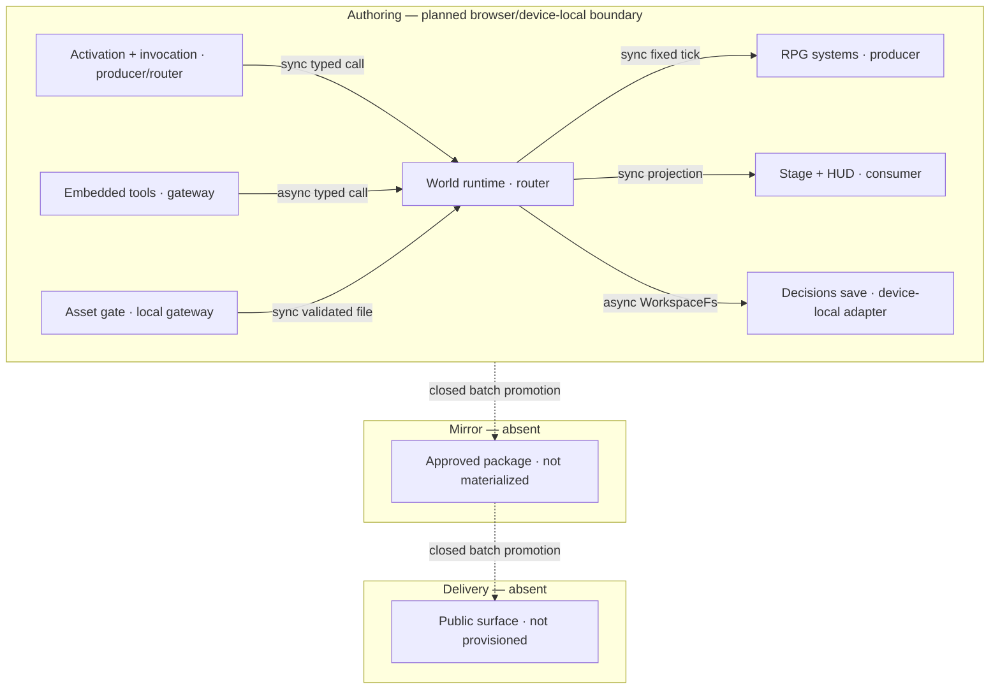

# Reference implementation: Knowgrph Game MMORPG PRD/TAD

Governed by the same solo-dev AI-native orientation as the sibling `knowgrph-game-fps-prd-tad.md` and `knowgrph-game-flight-sim-prd-tad.md`: every decision is evaluated through the four compounding lenses (min-viable-max-value, TCO-zero, token economics, harness-first). This is a `spec-complete`, source-absent reference design; no runtime-readiness proof exists. No production or Cloudflare deployment is authorized.

## Status boundary

This PRD/TAD is a normative **planned contract**, not documentation of an implemented runtime. The `canvas/src/features/game-mmorpg/` paths, MMORPG panel, `/mmorpg` command, WebMCP tools, asset/provenance loaders, and persistence adapter are proposed and do not currently exist or register in Knowgrph. Present-tense acceptance language states the behavior required for future promotion; it is not runtime proof.

## Scope reconciliation (read first)

A **massively multiplayer** online world inherently requires shared-world networking, an authoritative server, and durable multi-player state — which directly conflicts with this stack's **zero-infra, local-first, offline-first, no-Supabase** constraints. This increment does **not** pretend to resolve that conflict. Instead:

- **Must scope** delivers an **offline, single-player, MMO-style RPG world** — persistent zones, NPCs, quests, inventory, and character progression — on the deterministic native Agentic ECS with browser-local, Decisions-only persistence. It is "MMO-flavored," not networked.
- **Networked shared-world play** (many concurrent players, authoritative sync) is **explicitly deferred**. It would require a networking substrate and a durable backend decision that are out of the current zero-infra scope, and it must not use Supabase. Any future networked increment requires separate operator authorization and its own ADR.

The distinctive capability specified here is the **asset provenance pipeline**: an MMO-scale world needs many assets, sourced as a **mix of AI-generated, procedurally/programmatically created, and internet-sourced** content. This document defines how that mix stays FOSS-first, license-governed, diffable, local, and offline.

## Outcome

Knowgrph gains one browser-local FloatingPanel **MMORPG World** mode that runs a bounded, offline, single-player RPG world inside the existing React Three Fiber Canvas, over the shared authored XR terrain catalog. It opens from a source-backed run-ready document, the shared XR surface catalog, browser WebMCP, or the strict `/mmorpg @canvas #world` invocation. Desktop keyboard/pointer, mobile touch, gamepad, and optional Motion Control input arm one deterministic native Agentic ECS world with in-repo movement, AABB collision, NPCs, quests, inventory, a visible HUD, selectable camera source, and Decisions-only WorkspaceFs persistence.

Core gameplay requires no camera, account, passkey, model, remote asset, gameplay network call, or Cloudflare service. The distinctive capability is the **asset provenance pipeline**: world content is a governed mix of (A) **procedural/programmatic** generators expressed as small, diffable TypeScript + JSON specs; (B) **AI-generated** assets authored offline as img2threejs TypeScript + JSON specs (primary) with TRELLIS.2 opaque GLB as a fallback; and (C) **internet-sourced** FOSS/redistributable assets committed local with a mandatory provenance + license record. All three tracks are offline authoring artifacts — no runtime generation, remote fetch, or provider call occurs during play. The asset-mix framing is inspired by `Julian-adv/OpenMMO`, but this module copies none of its source and takes no dependency on it.

## Product Requirements

### Problem

Knowgrph has a native Three.js renderer, a deterministic Agentic ECS, a procedural XR terrain catalog, and browser-local Source Files persistence — but no RPG world loop, and no disciplined way to assemble the large, mixed-provenance asset set an MMO-style world needs while staying FOSS-first, license-clean, diffable, local, and offline. A first increment must be playable offline without a second engine, a speculative AI stack, a network service, an authentication flow, or any runtime asset generation, and every asset must carry auditable provenance and a redistributable license.

### Primary user

Mei is a mobile-first player who wants to open a source-backed browser workspace and explore a small RPG world immediately — move, talk to an NPC, accept and complete one quest, pick up an item — with no sign-in, camera request, or network dependency, then explicitly Save her validated progress locally.

A secondary user, the solo maintainer, wants every world asset to arrive with clear provenance and a redistributable license, to prefer diffable procedural/spec assets over opaque binaries, and to keep asset TCO and audit cost near zero.

### Primary journey

| Stage | Player action | Runtime owner | Durable effect |
|---|---|---|---|
| Enter | Apply the source-backed world seed or invoke `/mmorpg @canvas #world operation=open` | Run-ready activation | World mounts on the shared XR Canvas |
| Explore | Move through a zone with keyboard/pointer/touch/gamepad | Deterministic Agentic ECS `World_Tick` | Player position/zone state |
| Interact | Talk to an NPC, accept a quest, pick up an item | Dialogue/quest/inventory systems | Quest-flag and inventory Decisions (pending) |
| Progress | Complete the quest objective | Objective evaluator | Terminal quest result (pending Save) |
| Save | Explicitly Save | WorkspaceFs Decision adapter | Decisions-only KGC `@node` write |
| Return | Reopen the same browser workspace | Hydration/resume adapter | Reconstructed world/quest/inventory progress |

### Must scope

- One selected authored XR zone/terrain and collider profile from the existing local catalog; the world owns no replacement environment, manifest, R2, CDN, or runtime asset download.
- One offline single-player world: one explorable zone, 3–5 NPCs, one dialogue tree, one quest with a completion objective, a small inventory, and one retry/reset path.
- One FloatingPanel MMORPG lifecycle: `open`, `start`, `stop`, `restart`, `interact`, `save`, and `exit`.
- Desktop keyboard/pointer, mobile touch, and gamepad controls, plus optional reuse of the existing Motion Control pose adapter (input only, never an NPC or quest policy).
- One fixed-step deterministic simulation using the native Agentic ECS with ephemeral runtime state.
- In-repo movement, AABB collision, deterministic NPC scoring (closed action set), and deterministic quest/inventory state transitions — no external engine, navmesh, or LLM.
- **Asset provenance pipeline** governing the three-track asset mix (procedural, AI-generated, internet-sourced), all committed local and offline, each with a provenance + license record; the loader prefers diffable spec/procedural assets.
- A HUD reporting health, zone, quest state, inventory, save state, and explicit errors.
- Browser-local, Decisions-only KGC persistence through an explicit, idempotent Save; terminal results remain pending until that action succeeds.
- Strict native `/mmorpg @canvas #world` invocation and browser-local `knowgrph.inspect_local_mmorpg` / `knowgrph.control_local_mmorpg` WebMCP.
- Stop followed by Start resumes the exact in-memory tick and world state; Restart is the explicit fresh-run action.
- Synchronous WebGL admission, one existing Canvas, XR pause/restore ownership, and visible fail-closed runtime errors.
- Source-authored `run_ready_demo.id` activation through the known registry, independent of an imported path and fail-closed on identity conflict.

### Deferred scope

- **Networked massively-multiplayer shared world**, authoritative server sync, concurrent players, shared persistence, guilds, chat, trading, and matchmaking. Requires separate operator authorization, an ADR, and a substrate decision; Supabase and any remote realtime/state backend are forbidden.
- WebAuthn/passkeys, identity, accounts, cloud sync, and cross-device saves.
- Hosted or local LLMs, agent reasoning, generative dialogue, model escalation, edge-ML policy models, ONNX Runtime, and token budgets.
- Runtime image-to-3D generation, streaming/procedural asset generation at play time, or any remote model/asset call during play.
- Rapier, Yuka, `behaviortree.js`, recastnavigation, bitECS, or another game/ECS/physics engine.
- Any copy of, or runtime/build dependency on, `Julian-adv/OpenMMO` (inspiration only), and any non-redistributable or license-incompatible asset.
- Remote assets, D1, R2, KV, Durable Objects, Workers, Pages, or production routes; automatic Git commits, pushes, pull requests, or deployments from the browser runtime.

### User stories

1. As Mei, I can enter and explore the world with no account, camera prompt, or network dependency.
2. As Mei, movement, NPC dialogue, quest acceptance/completion, and inventory pickup form one coherent local loop.
3. As Mei, the same input sequence reproduces the same world state.
4. As Mei, a malformed save is never silently replaced; I can inspect the error and explicitly reset it.
5. As Mei, explicitly saving writes only validated Decisions (quest flags, dialogue outcomes, world-tick results) to my browser-local workspace.
6. As the maintainer, every world asset carries a provenance + redistributable-license record, procedural/spec assets are preferred over opaque binaries, and no asset is generated or fetched at runtime.
7. As an operator or agent, I can inspect and control the same local world through one strict invocation grammar and browser WebMCP contract.
8. As a maintainer, I can prove the core runtime is model-free, network-free, deterministic, license-clean, and Dev-only.

### Acceptance criteria

#### AC-1: open and explore

Given a clean browser-local workspace, when the world seed is applied, then the bounded world reaches a playable frame in the canonical authored XR zone without sign-in, camera permission, passkey API access, remote asset fetch, or Cloudflare request.

#### AC-2: deterministic world

Given the same world seed and normalized input frames, when two fresh runtimes advance the same fixed number of ticks, then player, NPC, quest, inventory, Decisions, and HUD projection are byte-equivalent after canonical serialization.

#### AC-3: in-repo simulation and collision

Given control input, when a tick advances, then in-repo movement and the AABB resolver return bounded non-penetrating positions against the authored zone slabs, and NPC/quest/inventory transitions are deterministic with stable tie-breaking — without a second renderer, physics engine, navmesh, or floating dependency fallback.

#### AC-4: governed three-track asset provenance

Given any world asset, when it is loaded, then it resolves to a committed local file on one of three tracks — (A) procedural/programmatic TypeScript+JSON generator output, (B) AI-generated img2threejs TypeScript+JSON spec (primary) or TRELLIS.2 opaque GLB fallback, or (C) internet-sourced FOSS/redistributable asset — and it carries a provenance record `{track, origin, license, attribution, representation, diffable}`. The loader prefers a diffable spec/procedural asset when more than one representation exists. No runtime image-to-3D model, asset generator, network fetch, or Cloudflare resource is invoked to obtain any asset.

> **VCC translation** (AC-4): `Verify every world asset has a provenance record with a redistributable (FOSS-compatible) license and a non-empty origin, that a source scan finds no runtime asset-generation or network/model asset call, that opaque-binary (Track B GLB / Track C binary) count is tracked and minimized against diffable specs, and that any asset lacking a compatible license or provenance fails the local asset gate.`

#### AC-5: canonical zero cost

Given a successful world `World_Tick`, when no reasoning request exists, then it returns exactly one canonical zero Cost_Log (`model: "none"`, all token fields `0`, `estimated_cost_usd: 0`, `incomplete: false`). No token ceiling, escalation, retry, fallback model, or synthetic non-zero cost record exists in this increment.

#### AC-6: decision-only local save

Given a completed quest or world milestone, when Mei explicitly selects **Save** and persistence succeeds, then browser-local WorkspaceFs contains only canonical `EcsDecision` additions using the supported `dialogue_outcome`, `quest_flag`, or `world_tick_result` types. Component arrays, world snapshots, cost logs, credentials, and raw input history are not written.

#### AC-7: fail-closed hydration and retry

Given no save document, the runtime may create a fresh world. Given an existing malformed KGC save, hydration blocks before a World is created, names the unreadable local path, preserves the original bytes, and exposes an explicit **Reset local save** action. Given a write failure, pending Decisions remain in memory, prior bytes are unchanged, and the HUD exposes **Retry save**. No silent drop, fabricated success, or automatic reset is allowed.

#### AC-8: strict invocation and browser WebMCP

Given an invocation, exactly one `/mmorpg`, one `@canvas`, and one `#world` token is accepted. Duplicate sigils, unknown keys, mixed structured/native input, and invalid lifecycle operations fail closed. Browser agent-ready registration exposes only `knowgrph.inspect_local_mmorpg` and `knowgrph.control_local_mmorpg` for this surface; it adds no stdio tool, HTTP mutation route, remote gateway, or deployment authority. The private Agentic ECS stdio lane remains exactly three tools.

#### AC-9: shared Canvas and XR ownership

Given a running XR surface, entering MMORPG World keeps the authored atmosphere, zone, and scene graph visibly mounted inside the same Canvas and overlays only the player, NPCs, world props, camera, and HUD. No fallback scene, second renderer, alternate world, or renderer branch is introduced. Camera source (fixed-follow / free-orbit) and Timeline camera-marks are reused.

#### AC-10: no-network, no-multiplayer boundary

Given core gameplay, when the world runs, then no networked multiplayer session, remote sync, Supabase call, or Cloudflare resource is opened or required; the world is single-player and offline. Any networked shared-world path is absent from this increment and fails closed if invoked.

### Success metrics

| Metric | Must target |
|---|---|
| First value | Playable first frame plus one NPC interaction from the source-backed demo |
| Deterministic replay | Two identical input traces yield identical canonical results |
| Runtime model calls | 0 (including 0 runtime asset-generation calls) |
| Gameplay network calls | 0 required; 0 multiplayer sessions |
| Token and inference cost | 0 tokens; USD 0 |
| Asset license coverage | 100% of assets carry a provenance + redistributable-license record |
| Asset diffability | Diffable procedural/spec assets preferred; opaque-binary count tracked and minimized |
| Persistent data | Validated Decisions only |
| New runtime dependencies | 0 |
| Production mutation | 0 |
| TTV steps / elapsed ceiling | at most 4 actions / 3 minutes |

### ROI, MoSCoW, and time-to-value

The Must threshold is `0.40`, using
`(impact × monthly sessions) / (build hours + monthly TCO + monthly token
cost)`. These are scope estimates, not implementation evidence.

| Feature | Tier | Impact | Sessions/month | Build hours | Monthly cash/token TCO | ROI | Rationale |
|---|---|---:|---:|---:|---:|---:|---|
| Offline RPG loop | Must | 4 | 20 | 160 | $0 | 0.50 | Smallest coherent playable outcome |
| Asset provenance gate | Must | 5 | 20 | 80 | $0 | 1.25 | Removes redistribution and audit risk |
| Networked shared world | Won't | 5 | 20 | 1,200 | $300 | 0.07 | Conflicts with zero-infra scope |
| Runtime generative dialogue/assets | Won't | 2 | 10 | 160 | $100 | 0.08 | Adds spend and non-determinism |

First value is four actions: apply seed, open, start, interact. The
three-minute ceiling remains unproven until an exact-SHA clean-browser result
is recorded.

| Time-to-value dimension | Estimate | Ceiling | Validation |
|---|---:|---:|---|
| Manual actions | 4 | 4 | future clean-workspace browser walk-through |
| Elapsed time | 3 minutes | 3 minutes | future timed first-interaction proof |
| First-value action | one deterministic NPC interaction | — | visible HUD/dialogue transition |
| Persona | mobile-first player | — | primary journey |

### Twelve-month deployment-model TCO

Estimates cover the bounded single-player demo, exclude build labor, and do
not authorize any absent surface.

| Deployment model | Infra | API/egress/tokens | Ops | 12-month cash TCO | Disposition |
|---|---:|---:|---:|---:|---|
| Browser-local existing FOSS application | $0 | $0 | 12 h/year | $0 | Chosen |
| Managed/serverless static delivery | $120/year allowance | $0 | 8 h/year | $120 | Not authorized |
| Provisioned/self-managed FOSS server | $144/year | $0 | 36 h/year | $144 | Rejected idle service |
| Hybrid/consolidated existing host | $0 incremental | $0 | 18 h/year | $0 incremental | Deferred |

## Technical Architecture

### Four-lens overview

| Lens | Applied constraint (this module) | Key decision |
|---|---|---|
| **Min-viable-max-value** | One zone, a few NPCs, one quest, a small inventory — reusing the existing Canvas, ECS, terrain catalog, and camera source | No new engine and no networking; add only RPG systems and the asset-provenance loader |
| **TCO-zero** | Prefer diffable procedural/spec assets; internet-sourced assets are committed local and license-gated; zero infra, browser/local/offline | Diffable-first asset mix keeps storage, review, egress, and license risk near zero |
| **Token economics** | The world `World_Tick` performs zero model calls; asset generation is offline | Every tick emits a canonical `$0` Cost_Log; no runtime generation or provider call |
| **Harness-first** | No ad-hoc model calls; deterministic RPG systems in-tick; any future generative content stays an offline authoring step | NPC/quest/dialogue logic is deterministic, not LLM-driven |

### Planned ownership

| Concern | Proposed canonical owner | Rule |
|---|---|---|
| World domain | `canvas/src/features/game-mmorpg/` | Zone config, movement/NPC/quest/inventory systems, input normalization, HUD projection, local save adapter |
| Surface lifecycle | `canvas/src/features/game-mmorpg/mmorpgRuntime.ts` | Own open/start/stop/restart/interact/save/exit state and previous-surface restoration |
| Invocation/WebMCP | `canvas/src/features/game-mmorpg/mmorpgMcpRuntime.ts` plus browser agent-ready registration | Enforce the strict native tuple and browser-local inspect/control schema |
| Entity simulation | `ecs/` | Reuse the native Agentic ECS API and its transactional `worldTick`; ephemeral runtime state |
| Movement & collision | `canvas/src/features/game-mmorpg/worldModel.ts` | In-repo deterministic movement and AABB zone resolution; no external physics engine or navmesh |
| NPC / quest / inventory | `canvas/src/features/game-mmorpg/rpgSystems.ts` | Deterministic scoring and state transitions with stable tie-breaking; no LLM or edge-ML |
| Asset provenance | `canvas/src/features/game-mmorpg/assetProvenance/` | Resolve assets across the three tracks; enforce the provenance + license gate; prefer diffable spec/procedural; load only committed local files |
| Rendering | `canvas/src/lib/three/ThreeGraph.impl.tsx` plus the canonical XR stage owners | Reuse the single React Three Fiber Canvas and authored XR world; add only players, NPCs, props, camera, and HUD |
| Camera/input arbitration | Existing Three controls, camera source, Timeline camera-marks, and Motion Control adapter | World owns framing while active; Motion Control contributes normalized input only |
| Browser persistence | `canvas/src/features/workspace-fs/` | Use WorkspaceFs and its existing source-file bridge; add no storage or Git owner |
| Cost truth | `contracts/cost-log.schema.js` | Accept only the canonical model-free zero record for the no-reasoning tick |
| Activation | existing non-activating `docs/workspace-seeds/knowgrph-game-mmorpg-demo.md` design seed | Future activation only after source and proof gates; current `planned_run_ready_demo` is not registry authority |

### Topology: MMORPG reference implementation v0.3 — planned baseline

**Boundaries:** trusted browser runtime/device-local storage in Authoring, an
unmaterialized non-public Mirror, and an unprovisioned public Delivery surface.
Every MMORPG-specific Authoring node is planned and source-absent.

| Node | Role | Type | Lane | Connects to | Connection type | Data residency |
|---|---|---|---|---|---|---|
| Activation + invocation | Producer/router | planned browser function | Authoring | world runtime | synchronous typed call | volatile user-device memory |
| World runtime | Router | planned browser state owner | Authoring | ECS, asset gate, stage, save adapter | synchronous calls; async save | volatile user-device memory |
| RPG systems | Producer | planned deterministic functions | Authoring | world runtime | synchronous tick return | volatile user-device memory |
| Asset gate | Gateway | planned local-file validator | Authoring | world runtime, committed assets | synchronous file resolution | maintainer worktree/user device |
| Stage + HUD | Consumer | planned shared-Canvas group | Authoring | existing renderer/camera | synchronous render projection | volatile user-device memory |
| Decisions save | Store adapter | planned WorkspaceFs function | Authoring | local KGC document | async browser-local read/write | user device |
| Embedded tools | Gateway | planned browser WebMCP | Authoring | world runtime | async typed call | volatile user-device memory |
| Approved mirror package | Consumer | absent immutable artifact | Mirror | public delivery | batch publish, boundary closed | none; not materialized |
| Public delivery surface | Consumer | absent static application | Delivery | end-user browser | HTTPS fetch, boundary closed | none; not provisioned |

**Version note:** v0.3 establishes the first lane-complete structural snapshot;
there is no prior deployed topology and no runtime, residency, or promotion
change.

### Component inventory and VCC ownership

| Component ID | Planned interface | Responsibility | Local rung | Delivered rung | VCCs |
|---|---|---|---|---|---|
| `TAD-MMORPG-RUNTIME` | lifecycle dispatcher + fixed tick | Runtime coordinates one deterministic world. | spec-complete | undocumented | 01, 02, 03, 05, 10 |
| `TAD-MMORPG-ASSET` | provenance `validate/load` | Gateway admits only licensed committed assets. | spec-complete | undocumented | 04 |
| `TAD-MMORPG-PERSIST` | hydrate/save Decisions | Adapter preserves malformed bytes and saves Decisions only. | spec-complete | undocumented | 06, 07 |
| `TAD-MMORPG-INVOKE` | parse/dispatch native input | Parser enforces one exact tuple. | spec-complete | undocumented | 08 |
| `TAD-MMORPG-MCP` | inspect/control | Gateway exposes planned embedded tools only. | spec-complete | undocumented | 08 |
| `TAD-MMORPG-STAGE` | shared-Canvas projection | Consumer overlays one authored XR world. | spec-complete | undocumented | 01, 09 |
| `TAD-MMORPG-MIRROR/DELIVERY` | batch publish / HTTPS | Absent targets accept only approved whole states. | undocumented | undocumented | — |

For planned components, dependencies are exactly the topology edges;
configuration is typed local zone/RPG/provenance data; the implementation must
use the existing FOSS stack and no paid runtime dependency. The VCC register,
not a proposed path, owns evidence and rung derivation.

| Quality attribute | Bound | Planned pattern | VCC |
|---|---|---|---|
| Determinism/performance | fixed step; bounded catch-up; stable ties | native transactional ECS | 02, 03 |
| Security | no account, secret, remote sync, or multiplayer session | local admission and strict parser | 01, 08, 10 |
| Offline behavior | zero runtime network/model/asset calls | committed assets + local rules | 01, 04, 10 |
| Observability | HUD errors and one zero Cost_Log/tick | typed immutable projection | 05, 07 |
| Device reach | keyboard, pointer, touch, gamepad | normalized input frame | 01, 02 |

No topology node is a model, remote service, multiplayer session, Git
operation, or runtime asset-generation call.

### Invocation Register: MMORPG World

This is the sole authoritative declaration of the planned identities; every
other mention is descriptive.

| Route | Kind | Owner | Typed arguments | Trust boundary | Token cost |
|---|---|---|---|---|---:|
| `/mmorpg` | Command | `mmorpg-invocation-owner` | `operation` enum: open, start, stop, restart, interact, save, exit | browser-local; mutations explicit | 0 |
| `@canvas` | Binding | `mmorpg-invocation-owner` | — | read-only surface selection | 0 |
| `#world` | Tag | `mmorpg-invocation-owner` | — | read-only context selection | 0 |
| `knowgrph.inspect_local_mmorpg` | Tool identity | `mmorpg-agent-ready-owner` | empty object | planned browser-local read | 0 |
| `knowgrph.control_local_mmorpg` | Tool identity | `mmorpg-agent-ready-owner` | native invocation or structured `operation` | planned browser-local approval-gated mutation | 0 |

### Gateway federation and capability catalog disposition

**Surfaces in federation:** one planned embedded-browser surface; zero
registered surfaces. **Catalog union source:** a planned canonical agent-ready
tool contract. **Excluded:** remote gateway, stdio/HTTP parity, and a new proxy.

| Tool identity | Capability catalog entry | Federation disposition |
|---|---|---|
| `knowgrph.inspect_local_mmorpg` | planned; unregistered; read-only | planned embedded-only contribution; unregistered everywhere |
| `knowgrph.control_local_mmorpg` | planned; unregistered; explicit mutation | planned embedded-only contribution; unregistered everywhere |

A future union must deduplicate by full identity and report the contributing
catalog in `sourceCatalogs[]`; it must not synthesize either entry while the
source owner is absent.

### World / RPG model

Zone rules are constant and source-controlled: the selected authored XR profile supplies world bounds, collision boxes, and admitted spawns; the world config supplies NPC placement, dialogue trees, quest definitions/thresholds, loot tables, and inventory limits. The simulation advances from normalized input frames on a fixed timestep, not from DOM events, with a bounded accumulator that caps catch-up work. NPC behavior, dialogue branching, quest-flag transitions, and inventory changes are deterministic with stable tie-breaking. Runtime component storage is ephemeral; only meaningful Decisions (dialogue outcome, quest flag, world-tick result) persist.

### Asset provenance pipeline (procedural + AI-generated + internet-sourced)

An MMO-style world needs many assets. This module governs a **three-track mix**, all committed local and loaded offline, each carrying a provenance record and passing a license gate before it can ship:

- **Track A — Procedural / programmatic (preferred).** In-repo deterministic generators (zones, props, dungeons, loot tables) expressed as **small, diffable TypeScript + JSON specs/seeds**. Highest diffability, lowest TCO, deterministic to load and replay. Preferred whenever an asset can be expressed procedurally.
- **Track B — AI-generated (offline authoring).** Bespoke models authored offline via the same discipline as the flight-sim module: **img2threejs TypeScript + JSON scene spec as the primary, diffable representation**, with a **TRELLIS.2 opaque binary GLB as a committed local fallback** where a spec is not yet available. Generation is an offline step; no image-to-3D model runs at runtime.
- **Track C — Internet-sourced (FOSS/redistributable).** Assets obtained once at authoring time from FOSS/appropriately-licensed sources, **committed local** with a **mandatory provenance + license manifest** (origin URL, license, attribution). Never fetched at runtime. Assets whose license is missing, incompatible with FOSS-first redistribution, or unverifiable are **rejected by the license gate**.

**Provenance record (every asset):** `{ assetId, track: "procedural" | "ai-generated" | "internet-sourced", origin, license, attribution, representation: "spec" | "glb" | "other-binary", diffable: boolean }`. **Governance rules:** the loader prefers a diffable spec/procedural representation when more than one exists; the runtime loads only committed local files that passed the gate; opaque-binary count (Track B GLB and Track C binaries) is a tracked success metric to minimize; the gate fails closed on a missing/incompatible license or empty origin. The asset-mix framing is inspired by `Julian-adv/OpenMMO` but copies none of its source and takes no dependency on it.

The optional offline AI-authoring harness validates an asset request and
license target before execution, emits a spec/binary plus provenance record
and Cost_Log, allows at most two attempts per asset and 20 generated assets
per release, and stops on an invalid license or missing provenance. Its
fallback is the procedural track or deferral. Budget: 0 paid API tokens and at
most $24/year local electricity; it is never callable from gameplay.

### Persistence and resume

The local save path is owned by the world adapter under WorkspaceFs. A terminal quest/milestone leaves canonical Decisions pending; only explicit **Save** merges them idempotently by `decisionId`. Existing authored bytes remain untouched except for supported KGC Decision insertion. Resume derives world/quest/inventory progress from the validated Decision index before the first tick. Malformed existing KGC is not equivalent to an absent save: the runtime reports the precise local path and error, creates no partial World, and waits for explicit reset.

### Error model

| Failure | Required result |
|---|---|
| Invalid world/zone config | Block activation with a typed local error |
| Invalid input value | Reject or normalize to a bounded neutral value before tick |
| Tick/system failure | Keep prior committed systems, expose failure, do not claim a successful frame |
| Asset missing provenance or license | Reject at the license gate with a local error naming the asset; never ship or fetch it |
| Missing/invalid asset representation | Try a lower-priority committed representation if licensed; else fail closed locally; never fetch remotely or generate at runtime |
| Malformed existing save | Preserve bytes, block hydration, expose explicit reset |
| Local write failure | Preserve prior bytes and pending Decisions, expose retry |
| Multiplayer/remote path invoked | Fail closed; the networked shared world is absent from this increment |
| WebGL unavailable | Fail the synchronous admission probe, keep the world stopped, show a local unsupported state without a remote or second renderer |

## Architecture Decisions

### ADR-1: Reuse the existing renderer and native ECS

**Status:** Accepted for this increment.

MMORPG World mounts a dedicated stage inside the existing `ThreeGraph` React Three Fiber Canvas and uses the native Agentic ECS for ephemeral runtime state. A second renderer, second camera owner, bitECS, Babylon.js, or another ECS is rejected because it duplicates an existing repository owner.

### ADR-2: Own minimal RPG simulation in-repo; deterministic, not LLM-driven

**Status:** Accepted for this increment.

Movement, AABB collision, NPC scoring, dialogue branching, quest flags, and inventory use deterministic in-repo rules with stable tie-breaking, consuming the shared authored XR collider profile. Rapier, navmesh, hosted/local LLMs, and edge-ML policies are rejected for the Must scope; they add weight, cost, and non-determinism without improving the bounded world's acceptance criteria (AC-2).

### ADR-3: Governed three-track asset provenance (procedural + AI-generated + internet-sourced)

**Status:** Accepted for this increment.

World assets are a governed mix of **procedural/programmatic** TypeScript+JSON generators (preferred, diffable), **AI-generated** img2threejs specs with a TRELLIS.2 GLB fallback (offline authoring), and **internet-sourced** FOSS/redistributable assets (committed local, license-gated). Every asset carries a provenance record and must pass a license gate.

**Alternatives considered:**
1. Runtime generation / streaming of assets (image-to-3D or fetched at play time): rejected — reintroduces model calls, network, latency, cost, and license ambiguity on the hot path, and breaks offline-first.
2. Binary-only asset library (GLB/other binaries as the default): rejected as the default — opaque, non-diffable, larger, and harder to audit or license-verify.
3. **Chosen — diffable-first, three-track, license-gated, offline mix**: procedural/spec preferred; AI-generated and internet-sourced allowed as committed local, provenance-tracked, license-verified exceptions.

**Rationale:** an MMO-scale world needs volume and variety, but the FOSS-first and TCO-zero lenses require that assets be auditable, redistributable, diffable where possible, and free of runtime cost. A provenance record plus a license gate makes a large mixed asset set safe to ship and cheap to review; preferring procedural/spec keeps most of the set diffable and deterministic.

**Consequences:**
- **Positive:** auditable, redistributable, mostly-diffable, offline asset set with no runtime generation/fetch cost and clear attribution.
- **Negative:** internet-sourced and AI-generated binaries need per-asset license verification and are counted/minimized against diffable specs; authoring has an offline gate step.
- **Neutral:** `Julian-adv/OpenMMO` remains inspiration only; the opaque-binary and internet-sourced counts are tracked success metrics.

### ADR-4: Defer networked massively-multiplayer play

**Status:** Accepted for this increment.

The Must scope is an **offline, single-player, MMO-style RPG world**. Networked shared-world play (concurrent players, authoritative sync, durable multi-player state) is deferred: it conflicts with the zero-infra, local-first, offline-first constraints and would require a networking substrate and durable backend that are out of scope. **Supabase and any remote realtime/state backend are forbidden.** A future networked increment requires separate operator authorization, its own ADR, and a substrate decision; core Game code must not open a multiplayer session, remote sync, or credential/`getUserMedia` flow.

### ADR-5: Persist Decisions through browser-local WorkspaceFs; Dev-only readiness

**Status:** Accepted for this increment.

The runtime writes canonical KGC Decisions through the existing browser-local filesystem owner; component state and raw World snapshots remain ephemeral. Runtime readiness means focused source proof plus a local browser smoke bound to an exact commit; production and Cloudflare lanes require a separate operator-authorized release workflow. No automatic Git commit is performed or implied.

### Per-decision FOSS alternatives and twelve-month TCO

Cash plus maintainer hours expose both spend and operations. All choices are
planning estimates at the bounded load.

| ADR | Chosen | FOSS alternative considered | Chosen 12-month TCO | Alternative 12-month TCO | Disposition |
|---|---|---|---|---|---|
| 1 | existing renderer + native ECS | standalone FOSS browser game engine | $0 + 12 h | $0 + 48 h | reject duplicate renderer/world |
| 2 | in-repo deterministic RPG rules | FOSS physics/navigation/AI libraries | $0 + 16 h | $0 + 40 h | reject weight and drift |
| 3 | diffable-first licensed asset mix | FOSS binary-only asset library | at most $24 + 24 h; runtime tokens $0 | $0 + 60 h | reject opaque audit default |
| 4 | defer networking | FOSS authoritative server stack | $0 + 0 h | $144 + 120 h | reject infra outside outcome |
| 5 | Decisions via WorkspaceFs | FOSS embedded browser database | $0 + 8 h | $0 + 24 h | reject second persistence owner |

## VCC and Evidence Reference register

All conditions are specified, but no MMORPG-specific source or candidate-bound
recorded result exists. The local rung is therefore `spec-complete`; the
delivered rung remains `undocumented`.

| VCC | Evaluator-checkable end state and constraint | Stated check | Evidence Reference |
|---|---|---|---|
| `VCC-MMORPG-01` | Source-backed open reaches one playable local frame without sign-in, permission, network, model, or second renderer. | Future registered admission/browser suite surfaces frame and forbidden-call counts. | none recorded |
| `VCC-MMORPG-02` | Equal seeds/input frames yield byte-equal canonical world state after equal ticks. | Future deterministic replay suite exits 0 with two surfaced digests. | none recorded |
| `VCC-MMORPG-03` | Movement remains bounded/non-penetrating and RPG transitions use stable tie-breaking without external engines. | Future model/collision suite exits 0 with non-zero cases. | none recorded |
| `VCC-MMORPG-04` | Every asset has origin/license/provenance; missing records fail closed; runtime fetch/generation count is zero. | Future provenance gate surfaces admitted/rejected/opaque counts and source scan. | none recorded |
| `VCC-MMORPG-05` | Each successful tick emits exactly one zero-token canonical Cost_Log. | Future tick suite surfaces one schema-valid zero record per case. | none recorded |
| `VCC-MMORPG-06` | Explicit Save writes only idempotent supported Decisions and no snapshot, credential, input, or cost-log data. | Future persistence suite surfaces before/after document diff. | none recorded |
| `VCC-MMORPG-07` | Malformed saves remain byte-identical; hydration blocks; write failure preserves pending Decisions and offers retry. | Future failure suite surfaces byte digests and lifecycle state. | none recorded |
| `VCC-MMORPG-08` | Exact native tuple and exactly two catalogued embedded tools share one dispatcher; invalid input does not mutate. | Future invocation/MCP suite surfaces route/tool counts and rejection diffs. | none recorded |
| `VCC-MMORPG-09` | One stage overlays the existing Canvas and exit restores the prior camera/surface once. | Future shared-surface suite surfaces Canvas count and restoration count. | none recorded |
| `VCC-MMORPG-10` | Core loop opens zero multiplayer, remote-sync, or cloud-resource sessions. | Future offline/browser suite surfaces network and session counts of zero. | none recorded |

Checks must be finite, local, independently evaluated, and must not deploy.
The existing physics seed is only a host baseline; it is not MMORPG evidence.

## PRD ↔ TAD ↔ VCC traceability

| PRD criterion | TAD component / interface | VCC |
|---|---|---|
| `PRD-MMORPG-AC-01` | `TAD-MMORPG-RUNTIME` / open; `TAD-MMORPG-STAGE` / projection | 01 |
| `PRD-MMORPG-AC-02` | `TAD-MMORPG-RUNTIME` / fixed tick + canonical serialization | 02 |
| `PRD-MMORPG-AC-03` | `TAD-MMORPG-RUNTIME` / movement, collision, RPG transition | 03 |
| `PRD-MMORPG-AC-04` | `TAD-MMORPG-ASSET` / validate + load | 04 |
| `PRD-MMORPG-AC-05` | `TAD-MMORPG-RUNTIME` / tick Cost_Log | 05 |
| `PRD-MMORPG-AC-06` | `TAD-MMORPG-PERSIST` / save Decisions | 06 |
| `PRD-MMORPG-AC-07` | `TAD-MMORPG-PERSIST` / hydrate, reset, retry | 07 |
| `PRD-MMORPG-AC-08` | `TAD-MMORPG-INVOKE` / parse + dispatch; `TAD-MMORPG-MCP` / inspect + control | 08 |
| `PRD-MMORPG-AC-09` | `TAD-MMORPG-STAGE` / shared Canvas + camera handoff | 09 |
| `PRD-MMORPG-AC-10` | `TAD-MMORPG-RUNTIME` / offline admission guard | 10 |

The component inventory supplies the reverse component-to-VCC mapping.

## Readiness Gap Matrix

| Workstream | Local rung | Delivered rung | Gap | Priority | Exit criteria (VCC) |
|---|---|---|---|---|---|
| runtime, RPG, and stage | spec-complete | undocumented | MMORPG source absent | major | 01, 02, 03, 05, 09, 10 |
| asset provenance | spec-complete | undocumented | gate/manifest source absent | major | 04 |
| persistence | spec-complete | undocumented | adapter and result absent | major | 06, 07 |
| invocation and embedded tools | spec-complete | undocumented | identities planned/unregistered | major | 08 |
| exact-SHA clean browser | spec-complete | undocumented | candidate proof absent | major | 01–10 |
| Mirror and Delivery | undocumented | undocumented | targets absent; promotion not requested | none | separate promotion VCC required |

## Agent-platform dimensions and execution order

| Dimension | Tier | Order | Local rung | Delivered rung | VCC / disposition |
|---|---|---:|---|---|---|
| Agentic OS-ready | Won't this increment | — | undocumented | undocumented | no OS Status Surface |
| AI Agent-ready | Must | 1 | spec-complete | undocumented | 08; planned embedded discovery |
| MCP Gateway-ready | Won't this increment | — | undocumented | undocumented | remote federation excluded |

The Must track starts only after the runtime contract is implemented; there
are no Follow-on tracks. Discovery and reads remain zero-token, and no tool
receives deployment authority.

## Lane topology and Deploy Boundary Register

| Lane | Function | Mutation rights | Data residency | Readiness ceiling |
|---|---|---|---|---|
| Authoring | write and prove a candidate | source, tests, browser-local state | maintainer worktree/user device | runtime-ready |
| Mirror | hold an approved non-public package | publish-only; currently absent | none | runtime-ready |
| Delivery | serve a promoted mirror | publish-only; currently absent | none | production-verified |

| Boundary | From lane | To lane | Evidence Reference | Operator instruction | Rollback statement | State |
|---|---|---|---|---|---|---|
| `MMORPG-AUTHORING-TO-MIRROR` | Authoring | Mirror | none recorded | none; no promotion authorized | retain the last mirror (currently none) and verify no MMORPG package exists | closed |
| `MMORPG-MIRROR-TO-DELIVERY` | Mirror | Delivery | none recorded | none; no promotion authorized | retain prior delivery (feature absent) and verify its route/tools remain unreachable | closed |

## Release Boundary

This is a source-absent `spec-complete` candidate. No public build, service,
database, object store, production route, automatic Git operation, or release
claim belongs to this scope. Offline asset authoring produces committed,
license-verified local artifacts only. A future networked increment requires a
protected integrated revision, explicit operator authorization, and its own
substrate ADR.
