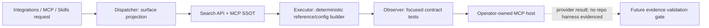
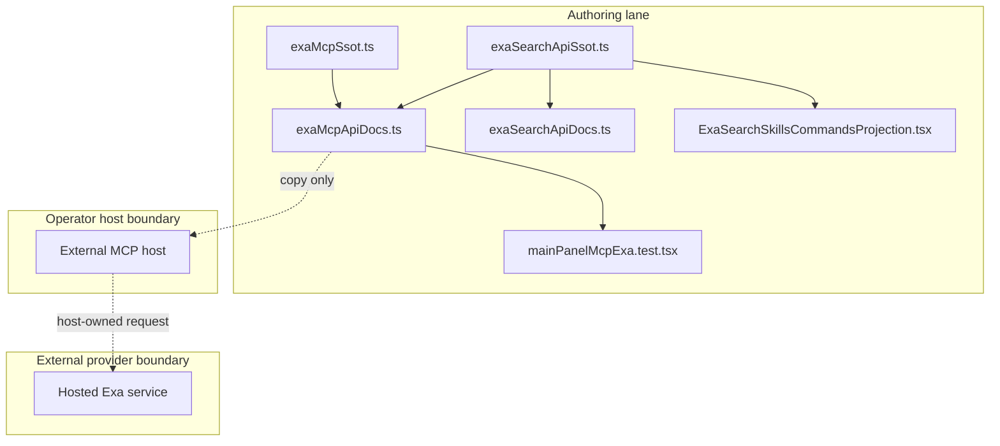

# Reference implementation: Exa Search API and MCP Contract

## Reference implementation scope and readiness

This combined PRD/TAD describes the source-present Exa configuration and
documentation surface in the current repository. It does not claim that the
browser invokes Exa, that an Exa host is configured for an operator, or that
any public delivery has been verified.

| Scope | Local rung | Delivered rung | Basis |
|---|---|---|---|
| Combined contract | `dev-proven` | `undocumented` | Focused local SSOT, Integrations, MCP, Skills & Commands, and type checks pass; no delivery Evidence Reference is attached. |

The readiness ladder is `undocumented` → `spec-complete` → `dev-proven` →
`runtime-ready` → `production-verified`.

### Actual repository baseline

| Source owner | Source-present fact | What it does not prove |
|---|---|---|
| `grph-shared/src/search/exaMcpSsot.ts` | Owns the hosted URL string, three allowed tool names, two profiles, normalization, and bounded result/content defaults. | Host availability, account quota, or an executed search. |
| `grph-shared/src/search/exaSearchApiSsot.ts` | Owns the coding-agent endpoint, current search modes, bounds, highlights default, response/error/deprecation contracts, and canonical `/ # @` projection. | A live API credential, provider request, or provider availability. |
| `canvas/src/features/panels/views/exaSearchApiDocs.ts` | Projects the shared Search API contract into MainPanel Integrations. | A browser-owned Exa client or proxy. |
| `canvas/src/features/panels/views/exaMcpApiDocs.ts` | Builds MainPanel documentation rows plus non-secret Codex and generic MCP configuration text. | An in-browser MCP client or Exa request path. |
| `canvas/src/features/integrations/ExaSearchSkillsCommandsProjection.tsx` | Renders the canonical `/tool.catalog #tool-routing @tool-provider` reference in FloatingPanel Skills & Commands. | A new Exa-specific command or execution owner. |
| `canvas/src/features/panels/views/settingsMcpDocEntries.ts` | Aggregates the virtual rows into the shared MCP settings view. | Operator configuration outside the browser. |
| `canvas/src/__tests__/mainPanelMcpExa.test.tsx` | Checks rendering, exact profile URL generation, tool filtering, and secret omission. | Remote-provider or delivered-runtime verification. |

The default source profile contains `web_search_exa` and `web_fetch_exa`.
The advanced profile adds `web_search_advanced_exa`. The normalizer rejects
unknown names. The source defaults cap results at 10 and fetched content at
12,000 characters, but no repository-owned Exa invocation harness was found
that enforces a model-token budget after that content enters a chat.

## PRD

### Problem and outcome

Operators need one consistent way to inspect coding-agent Search API behavior,
copy an external MCP configuration, and discover the canonical invocation
grammar without storing a provider credential in browser state. The
first-value outcome is a non-secret contract projected from one shared source
into MainPanel Integrations, MainPanel MCP, and FloatingPanel Skills & Commands.
Search execution and evidence-to-canvas conversion remain separate capabilities
until a trusted host and evidence harness prove them.

### Personas and user stories

| Persona | User story | Success signal |
|---|---|---|
| Operator | As an operator, I want a copyable hosted MCP configuration so that setup does not depend on stale notes. | MainPanel renders the source-owned URL and default profile with no credential value. |
| Research user | As a researcher, I want fetched content treated as untrusted evidence so that it cannot mutate a canvas directly. | Any future result enters validation before app state changes. |
| Maintainer | As a maintainer, I want one tool allow-list so that generated URLs cannot advertise unknown tools. | Config builders consume the shared normalizer. |
| Auditor | As an auditor, I want source and delivery readiness separated so that UI presence is not mistaken for a working provider connection. | The document and evidence register retain separate rungs. |

### User journey flow

| Stage | User action | Touchpoint | Friction | Required outcome |
|---|---|---|---|---|
| Trigger | Needs current web evidence. | MainPanel MCP | A hosted provider and a browser UI can look like one runtime. | Identify configuration as host-owned. |
| Discover | Opens the Exa rows. | Shared settings view | Tool names and profiles can drift. | Render source-owned defaults. |
| Engage | Copies a config and configures an MCP host. | Host outside Knowgrph | A secret may be pasted into browser state. | Copy only non-secret material. |
| Complete | Invokes through the chosen host. | External MCP host | Remote response and quota are not repository evidence. | Return a typed host result or explicit failure. |
| Return | Reuses evidence in a workspace. | Chat/import validation | Untrusted pages may contain hostile instructions. | Validate and bound evidence before app mutation. |

### Requirements and prioritization

| ID | Requirement | Priority |
|---|---|---|
| `PRD-EXA-01` | Derive hosted URL, profiles, and allowed tools from `exaMcpSsot.ts`. | Must |
| `PRD-EXA-02` | Generate Codex and generic MCP copy text without a credential value. | Must |
| `PRD-EXA-03` | Reject unsupported tool names and deduplicate supported names. | Must |
| `PRD-EXA-04` | Keep browser UI responsibility to configuration and documentation; do not imply in-app execution. | Must |
| `PRD-EXA-05` | Treat fetched content as untrusted and require validation before workspace or canvas mutation. | Must |
| `PRD-EXA-06` | Add an execution harness only with a recorded token bound, quota policy, and circuit breaker. | Won't in this increment |
| `PRD-EXA-07` | Project current coding-agent request, response, error, freshness, structured-output, and deprecated-field guidance into MainPanel Integrations. | Must |
| `PRD-EXA-08` | Reuse the Search API SSOT in Exa MCP rows rather than copying endpoint or request defaults. | Must |
| `PRD-EXA-09` | Render `/tool.catalog #tool-routing @tool-provider` in Skills & Commands with the shared invocation-chip renderer; do not add Exa-specific aliases. | Must |

### Acceptance criteria

| Requirement | Given / When / Then | VCC |
|---|---|---|
| `PRD-EXA-01` | Given default values, when config is generated, then the default source URL and two default tool names are used. | `VCC-EXA-01` |
| `PRD-EXA-02` | Given config generation, when output is inspected, then no header value, API-key literal, or secret placeholder is present. | `VCC-EXA-02` |
| `PRD-EXA-03` | Given duplicate and unknown tools, when normalization runs, then only unique allowed names remain. | `VCC-EXA-03` |
| `PRD-EXA-04` | Given the source inventory, when runtime ownership is reviewed, then no browser Exa invocation owner is claimed. | `VCC-EXA-04` |
| `PRD-EXA-05` | Given a future provider result, when app mutation is requested, then the existing validation owner must accept it first. | `VCC-EXA-05` |
| `PRD-EXA-06` | Given a proposed execution harness, when activation is reviewed, then it remains blocked until token, quota, and circuit-breaker bounds are specified. | `VCC-EXA-06` |
| `PRD-EXA-07` | Given MainPanel Integrations, when Exa rows render, then the coding-agent request contract, cost field, documented errors, and deprecated-field guard are source-present without a secret value. | `VCC-EXA-07` |
| `PRD-EXA-08` | Given MainPanel MCP, when Exa rows render, then endpoint, highlight-first request, response/cost fields, invocation, and coding-agent guide URL match the shared SSOT. | `VCC-EXA-08` |
| `PRD-EXA-09` | Given FloatingPanel Skills & Commands, when the Exa projection renders, then the three canonical tokens use the shared chip renderer and no `/exa`, `#exa`, or `@exa` alias exists. | `VCC-EXA-09` |

### Economics, TTV, and delivery reach

Scores use `(impact × reach) / (build + TCO + token cost)` with normalized
0–10 inputs.

| Scope | Impact × reach | Cost scores | ROI score | Decision |
|---|---:|---:|---:|---|
| Configuration/docs contract | `6 × 4` | `2 + 0 + 0` | `12.0` | Keep; it is source-present and zero-token. |
| Browser-owned provider proxy | `5 × 3` | `8 + 6 + 6` | `0.75` | Reject for this increment. |

| Metric | Current fact | Target / gate |
|---|---|---|
| Time to first value | Not measured | At most 5 minutes to find and copy non-secret config; record a clean-client VCC before promotion. |
| MainPanel model tokens | 0 | Remain 0 for rendering and config generation. |
| Provider-result model tokens | No repository execution path found | Numeric prompt/input/output cap required before activation. |
| Loop bound | No execution loop | Any future loop must state maximum calls and stop condition. |
| Managed 12-month incremental Knowgrph TCO | USD 0 for source-only UI; upstream fees unmeasured | Keep USD 0 until a provider budget is approved. |
| Self-managed 12-month TCO | Not selected; unmeasured | Requires a separate ADR with compute, maintenance, and egress. |
| Hybrid 12-month TCO | Not selected; unmeasured | Requires the same explicit comparison. |

| Reach | Current source behavior |
|---|---|
| Browser | MainPanel rows and config builders are source-present. |
| Mobile browser | No distinct evidence; shared responsive UI is not a verified mobile capability. |
| Offline | Rows and builders can render from bundled source; provider invocation is unavailable. |

### Minimum scope, exclusions, and dependencies

Minimum scope is the source-owned allow-list, non-secret config builders,
MainPanel aggregation, and focused tests. Browser-stored provider keys, a new
proxy, direct graph mutation, and an unbounded evidence loop are excluded.

The external hosted service is a host-owned dependency. This document does not
own a Knowgrph Invocation Register. Knowgrph endpoint selection remains solely
in [the MCP installation contract](../knowgrph-mcp-install-contract.md).

## TAD

### Workflow flow

**Trigger:** an operator asks for external search MCP configuration.

1. MainPanel Integrations resolves Search API reference rows from the shared SSOT.
2. MainPanel MCP reuses that contract beside normalized hosted-tool configuration.
3. FloatingPanel Skills & Commands renders the canonical tool-routing invocation.
4. The browser renders non-secret contract and config text only.
5. The operator configures an external trusted host; that host owns connectivity and credential injection.

**Alternate path:** the advanced profile adds the third allowed tool.

**Error path:** invalid tool names are filtered; an empty valid set falls back
to the two default names.

**Postcondition:** config text exists; no provider call or delivery promotion is
implied.

### Data flow

| Stage | Component | Input | Output | Persistence | Failure |
|---|---|---|---|---|---|
| Ingest | Settings reader | Local non-secret labels | Candidate config values | Browser-owned settings where configured | Invalid values use source defaults. |
| Transform | SSOT normalizer | Profile and tool names | Allowed unique names | None | Empty valid set returns defaults. |
| Store | None for provider results | — | — | No repository Exa-result store is defined. | Do not invent persistence. |
| Serve | Config builders | Normalized values | Command or JSON text | Clipboard is operator-owned | Builder returns deterministic text. |
| Consume | External MCP host | Copied config | Host-defined result | Host-owned | Host surfaces provider failure. |

### Orchestration and harness flow

The dispatcher, executor, and observer consume zero model tokens. No evaluator
may infer remote readiness from the source test.

### Topology flow

### Journey-to-system mapping

| Journey stage | Workflow | Data stage | Harness role | Topology owner |
|---|---|---|---|---|
| Trigger | Open MCP view | Ingest | Dispatcher | Shared settings view |
| Discover | Resolve rows | Transform | Normalizer | `exaMcpSsot.ts` |
| Engage | Build/copy config | Serve | Executor | `exaMcpApiDocs.ts` |
| Complete | Host invokes | Consume | External executor | Operator MCP host |
| Return | Validate evidence | Future ingest | Future guarded harness | Existing validation owners |

### Component and integration contracts

| Component ID | Component | Interface IDs | VCC mappings | Invariant |
|---|---|---|---|---|
| `TAD-EXA-SSOT` | Shared SSOT | `TAD-EXA-SSOT-NORMALIZE`; `TAD-EXA-SSOT-URL` (`normalizeExaMcpToolNames`; `buildExaMcpRemoteUrl`) | `VCC-EXA-01`, `VCC-EXA-03` | Three allowed names; default has two. |
| `TAD-EXA-CONFIG` | Config builders | `TAD-EXA-CONFIG-BUILD` (`resolveExaMcpEnabledTools`; config builders) | `VCC-EXA-01`, `VCC-EXA-02` | No credential value or header material. |
| `TAD-EXA-MAINPANEL` | MainPanel aggregation | `TAD-EXA-MAINPANEL-ROWS` (`EXA_MCP_DOC_ENTRIES`) | `VCC-EXA-04` | No parallel tab or browser MCP client. |
| `TAD-EXA-SEARCH-SSOT` | Coding-agent Search API SSOT | `TAD-EXA-SEARCH-BUILD` (`buildExaCodingAgentSearchRequest`) | `VCC-EXA-07`, `VCC-EXA-08` | Required query; allowed mode; 1-100 results; highlights by default. |
| `TAD-EXA-SKILLS` | Skills & Commands projection | `TAD-EXA-SKILLS-INVOKE` (`EXA_SEARCH_API_INVOCATION_TEXT`) | `VCC-EXA-09` | Canonical dictionary tokens only; no private aliases. |
| `TAD-EXA-EVIDENCE` | Evidence boundary (not implemented) | `TAD-EXA-EVIDENCE-VALIDATE` | `VCC-EXA-05` | No direct canvas mutation. |
| `TAD-EXA-HARNESS` | Execution harness (not implemented) | `TAD-EXA-HARNESS-EXECUTE` | `VCC-EXA-06` | Activation requires token, quota, and circuit-breaker bounds. |

The source URL string and upstream docs links are configuration facts, not
Knowgrph route ownership. No separate provider endpoint register is authored
here.

### PRD ↔ TAD traceability

| Requirement | TAD component | Interface | VCC |
|---|---|---|---|
| `PRD-EXA-01` | `TAD-EXA-SSOT` + `TAD-EXA-CONFIG` | `TAD-EXA-SSOT-NORMALIZE` + `TAD-EXA-CONFIG-BUILD` | `VCC-EXA-01` |
| `PRD-EXA-02` | `TAD-EXA-CONFIG` | `TAD-EXA-CONFIG-BUILD` | `VCC-EXA-02` |
| `PRD-EXA-03` | `TAD-EXA-SSOT` | `TAD-EXA-SSOT-NORMALIZE` | `VCC-EXA-03` |
| `PRD-EXA-04` | `TAD-EXA-MAINPANEL` | `TAD-EXA-MAINPANEL-ROWS` | `VCC-EXA-04` |
| `PRD-EXA-05` | `TAD-EXA-EVIDENCE` | `TAD-EXA-EVIDENCE-VALIDATE` | `VCC-EXA-05` |
| `PRD-EXA-06` | `TAD-EXA-HARNESS` | `TAD-EXA-HARNESS-EXECUTE` | `VCC-EXA-06` |
| `PRD-EXA-07` | `TAD-EXA-SEARCH-SSOT` | `TAD-EXA-SEARCH-BUILD` | `VCC-EXA-07` |
| `PRD-EXA-08` | `TAD-EXA-SEARCH-SSOT` + `TAD-EXA-MAINPANEL` | `TAD-EXA-SEARCH-BUILD` + `TAD-EXA-MAINPANEL-ROWS` | `VCC-EXA-08` |
| `PRD-EXA-09` | `TAD-EXA-SKILLS` | `TAD-EXA-SKILLS-INVOKE` | `VCC-EXA-09` |

### Security and error contract

| Condition | Required response |
|---|---|
| Unknown tool name | Filter it; never emit it in the generated URL. |
| Actual API key supplied to browser config | Reject or omit it; do not persist or render it. |
| Provider unavailable | External host reports failure; browser does not fabricate success. |
| Oversized or hostile page content | Stop before app mutation and require the validation/evidence harness. |
| Missing token budget for a future model step | Capability remains disabled. |

### Architectural decision

Use a configuration-only reference surface over one shared allow-list.
Alternatives—browser proxying, copied constants, and direct graph mutation—add
secret, drift, and trust risk without improving first value.

### Lane and deploy boundaries

| Lane | Allowed content | Prohibited inference |
|---|---|---|
| Authoring | Source, docs, deterministic tests | Public availability |
| Mirror | A separately authorized projection | Readiness derived from authoring state |
| Delivery | Operator/runtime publication with recorded evidence | Silent promotion |

The authoring → mirror and mirror → delivery gates are `closed` by default.
Each requires a named operator instruction, evidence reference, affected
surface, and rollback path. This document supplies none and authorizes no
publication.

### Deploy Boundary Register

| Boundary | From lane | To lane | Evidence Reference | Operator instruction | Rollback statement/check | State |
|---|---|---|---|---|---|---|
| `DB-EXA-AUTHORING-MIRROR` | Authoring | Mirror | `none recorded` | `none` | Restore the prior approved mirror revision; verify its digest matches the prior promotion record. | `closed` |
| `DB-EXA-MIRROR-DELIVERY` | Mirror | Delivery | `none recorded` | `none` | Restore the prior delivered revision; rerun the health check recorded by that prior promotion. | `closed` |

## VCC and evidence register

| VCC | Exact check | Expected end state | Constraint | Evidence Reference |
|---|---|---|---|---|
| `VCC-EXA-01` | From `canvas/`: `npm run test:ci:unit -- ui.mainPanel.mcpHub.exa` | Three registered config cases run and the default config uses the source-owned profile. | Require `SUMMARY total=3 ... failed=0`; no network. | Local authoring run, 2026-08-13: `total=3 ok=3 failed=0` |
| `VCC-EXA-02` | Same exact registered filter as `VCC-EXA-01` | Generated text omits secret material. | No real credential fixture. | Local authoring run, 2026-08-13: `total=3 ok=3 failed=0` |
| `VCC-EXA-03` | Same exact registered filter as `VCC-EXA-01` | Unknown/duplicate tools are filtered. | Require `SUMMARY total=3 ... failed=0`. | Local authoring run, 2026-08-13: `total=3 ok=3 failed=0` |
| `VCC-EXA-04` | Source-owner review of `exaMcpApiDocs.ts` and its call sites | UI remains configuration/documentation only. | A source review is not delivery evidence. | None recorded |
| `VCC-EXA-05` | No invocable Exa evidence-harness case exists. | Provider content cannot mutate app state without validation. | Unsatisfied; no readiness credit. | None recorded |
| `VCC-EXA-06` | No invocable Exa execution-harness case exists. | Execution remains disabled until token, quota, and circuit-breaker bounds are specified and checked. | Unsatisfied; no readiness credit. | None recorded |
| `VCC-EXA-07` | From `canvas/`: run `npm run test:ci:unit -- ui.mainPanel.integrationsHub.exaCodingAgentSearchContract` and `npm run test:ci:unit -- integrations.exa.codingAgentSearchRequestBounded` | Both registered cases pass; rows and bounded request contract match the shared SSOT. | No network and no real credential fixture. | Local authoring runs, 2026-08-13: each `total=1 ok=1 failed=0` |
| `VCC-EXA-08` | From `canvas/`: `npm run test:ci:unit -- ui.mainPanel.mcpHub.surfacesExaMcpConfig` | Existing MCP rendering case also checks the coding-agent endpoint, request, response/cost fields, invocation, and guide URL. | Source projection only. | Local authoring run, 2026-08-13: `total=1 ok=1 failed=0` |
| `VCC-EXA-09` | From `canvas/`: separately run `npm run test:ci:unit -- ui.floatingPanel.skillsCommands.exaCanonicalInvocation` and `npm run test:ci:unit -- ui.floatingPanel.skillsCommands.reusesMediaLayout` | Direct and composed FloatingPanel checks pass with canonical `/ # @` tokens and no Exa alias. | Remote catalog remains the dictionary source of truth. | Local authoring runs, 2026-08-13: each `total=1 ok=1 failed=0` |

Focused source and TypeScript results raise this authoring lane to
`dev-proven`. No public delivery, live provider call, account quota, or
production evidence is recorded, so the delivered rung remains `undocumented`.
