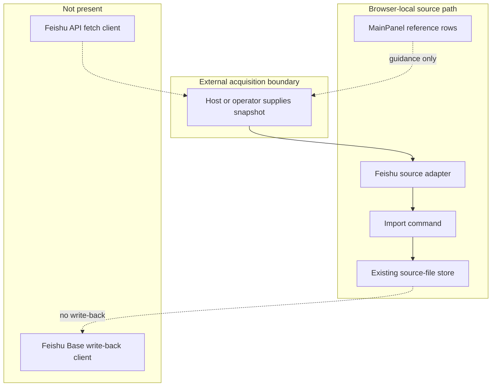

# Reference implementation: Feishu Base Configuration and Snapshot Import Contract

## Reference implementation scope and readiness

This combined PRD/TAD reconciles two source-present concerns:

1. a MainPanel configuration/documentation row family; and
2. a separate adapter/import command for caller-supplied Base snapshots.

Neither concern fetches records from Feishu. No Feishu auth client, Base API
reader, remote MCP executor, or Base write-back owner was found in the
repository path inspected for this contract.

| Scope | Local rung | Delivered rung | Basis |
|---|---|---|---|
| Combined contract | `spec-complete` | `undocumented` | Source owners and VCCs are stated; no satisfying remote Feishu or delivery Evidence Reference is attached. |

The readiness ladder is `undocumented` → `spec-complete` → `dev-proven` →
`runtime-ready` → `production-verified`.

### Actual repository baseline

| Source owner | Source-present fact | Explicit limit |
|---|---|---|
| `grph-shared/src/search/feishuBaseMcpSsot.ts` | Defines host-managed configuration labels, auth boundary, operator guidance, and phase labels. | The source scope text describes docs/settings only; labels do not establish delivery. |
| `canvas/src/features/settings/registry-feishu-base-mcp.ts` | Persists non-secret configuration labels in browser-local settings. | It stores no Base credential and executes no Base operation. |
| `canvas/src/features/panels/views/feishuBaseMcpApiDocs.ts` | Projects 11 virtual documentation rows into MainPanel. | It is not an MCP or Base API client. |
| `canvas/src/features/source-files/feishuBaseSourceAdapter.ts` | Converts a caller-supplied snapshot into sanitized Markdown, redacts identifiers, and reports field/record counts. | It does not obtain the snapshot from Feishu. |
| `canvas/src/features/source-files/feishuBaseSourceImportCommand.ts` | Exposes a browser-local command/event bridge that delegates to existing source-file ingest. | It is not remote Base mutation. |
| Focused Feishu tests | Exercise row defaults, adapter transformation, import delegation, warnings, and secret-related constraints. | No upstream auth, fetch, or write test. |

The MainPanel phase label and the separate adapter can coexist: the
configuration surface remains documentation-only, while supplied-snapshot
transformation is source-present in another owner. Neither fact establishes a
remote Feishu integration.

## PRD

### Problem and outcome

Operators need a clear Base configuration boundary and a safe way to transform
already-acquired records into a reviewed source document. The first-value
outcome is deterministic, zero-token snapshot conversion with redacted source
references. Remote acquisition and write-back remain absent.

### Personas and user stories

| Persona | User story | Success signal |
|---|---|---|
| Operator | As an operator, I want host/auth ownership visible so that I do not paste Base secrets into browser settings. | MainPanel stores only non-secret labels. |
| Importer | As an importer, I want a supplied snapshot converted through the existing source-file seam so that validation is reused. | The adapter returns sanitized Markdown and the import command delegates. |
| Reviewer | As a reviewer, I want identifiers redacted so that generated Markdown does not expose full Base/table/view/record tokens. | Output contains redacted refs and URL origin only. |
| Maintainer | As a maintainer, I want configuration and import owners separated so that a docs phase label cannot hide actual source seams. | Ownership table distinguishes them. |
| Auditor | As an auditor, I want remote read/write gaps explicit so that local transformation is not promoted to provider readiness. | Separate rungs and unsatisfied remote VCCs remain. |

### User journey flow

| Stage | User action | Touchpoint | Friction | Required outcome |
|---|---|---|---|---|
| Trigger | Needs Base records in a workspace. | MainPanel or external Base tooling | Configuration rows may look executable. | Identify host-owned acquisition. |
| Discover | Reviews server key, auth boundary, and guidance. | Feishu Base row family | Non-secret labels may be mistaken for credentials. | Show labels only. |
| Engage | Supplies a structured snapshot. | Browser-local import command | Snapshot may include identifiers or hostile Markdown. | Validate required selection and sanitize content. |
| Complete | Imports the generated source document. | Existing source-file ingest | A parallel import stack can drift. | Delegate to canonical ingest owner. |
| Return | Requests refresh or write-back. | Future host integration | No remote adapter exists. | Fail unavailable; never imply remote success. |

### Requirements and prioritization

| ID | Requirement | Priority |
|---|---|---|
| `PRD-FB-01` | Keep MainPanel configuration labels non-secret and host/server-owned. | Must |
| `PRD-FB-02` | Require `baseToken` and `tableId` for supplied snapshot conversion. | Must |
| `PRD-FB-03` | Sanitize imported values and redact Base, table, view, and record identifiers in generated Markdown. | Must |
| `PRD-FB-04` | Delegate import to the existing source-file ingest owner. | Must |
| `PRD-FB-05` | Distinguish supplied-snapshot transformation from remote Base acquisition. | Must |
| `PRD-FB-06` | Keep Base write-back absent until auth, idempotency, conflict, audit, and rollback contracts exist. | Must |
| `PRD-FB-07` | Add browser-owned Base credentials or a direct write path. | Won't |

### Acceptance criteria

| Requirement | Given / When / Then | VCC |
|---|---|---|
| `PRD-FB-01` | Given default MainPanel state, when rows render, then only host-managed labels and documentation guidance appear. | `VCC-FB-01` |
| `PRD-FB-02` | Given a snapshot missing `baseToken` or `tableId`, when adapted, then a typed failure is returned. | `VCC-FB-02` |
| `PRD-FB-03` | Given valid fields/records, when adapted, then output is sanitized and full identifiers are absent from rendered metadata. | `VCC-FB-03` |
| `PRD-FB-04` | Given a valid import request, when command execution begins, then it delegates to `importFeishuBaseSnapshotIntoSourceFile`. | `VCC-FB-04` |
| `PRD-FB-05` | Given source review, when acquisition ownership is traced, then no Feishu network fetch is claimed. | `VCC-FB-05` |
| `PRD-FB-06` | Given a write-back request, when current ownership is checked, then the capability is unavailable. | `VCC-FB-06` |
| `PRD-FB-07` | Given browser configuration or import, when credential and mutation ownership is inspected, then no browser-held Base credential or direct remote write path exists. | `VCC-FB-07` |

### Economics, TTV, and delivery reach

| Scope | Impact × reach | Build + TCO + token score | ROI score | Decision |
|---|---:|---:|---:|---|
| Supplied-snapshot transform/import | `7 × 5` | `3 + 0 + 0` | `11.67` | Retain. |
| Browser-owned remote Base client | `5 × 3` | `9 + 7 + 4` | `0.75` | Reject. |

| Metric | Current fact | Gate |
|---|---|---|
| Time to first value | Not measured | At most 5 minutes from supplied snapshot to reviewed source file; record a clean-browser VCC. |
| Configuration/transform tokens | 0 model tokens | Remain 0. |
| Import loop | Finite field/record traversal; no retry loop | Add explicit maximum snapshot-size policy before large-scale delivery. |
| Remote operation tokens | No remote executor | Numeric bounds required before any AI-assisted transform is added. |
| Managed 12-month incremental Knowgrph TCO | USD 0 for current browser-local source path | External Base/platform costs unmeasured. |
| Self-managed 12-month TCO | Not selected; unmeasured | Compare auth proxy compute, maintenance, storage, and egress. |
| Hybrid 12-month TCO | Not selected; unmeasured | Compare separately. |

| Reach | Current source behavior |
|---|---|
| Browser | Config rows and supplied-snapshot import path are source-present. |
| Mobile browser | No distinct evidence; large-table ergonomics unmeasured. |
| Offline | Supplied snapshots can be transformed; remote Base acquisition is unavailable. |

The `lark-base` string in the source SSOT is operator guidance, not a
repository-owned browser route. This document owns no MCP endpoint or
Invocation Register. Canonical Knowgrph routes remain in
[the MCP installation contract](../knowgrph-mcp-install-contract.md).

## TAD

### Workflow flow

**Trigger:** an operator supplies a Base snapshot or opens configuration help.

1. MainPanel renders source-owned non-secret configuration labels.
2. External tooling or a host acquires a snapshot outside this contract.
3. The adapter validates `baseToken` and `tableId`.
4. It sanitizes fields/records, redacts identifiers, and builds Markdown.
5. The import command delegates to existing source-file ingest.
6. The operator reviews the imported source before graph application.

**Alternate path:** empty fields or records produce warnings and a valid
document when required selection identifiers exist.

**Error path:** missing required selection data returns a typed adapter failure;
import errors remain explicit.

**Postcondition:** app-owned source state may change; Feishu remote state does
not.

### Data flow

| Stage | Component | Input | Output | Persistence | Failure |
|---|---|---|---|---|---|
| Ingest | Caller/host | Supplied selection, fields, records | Adapter input | Caller-owned before import | No repository fetch fallback |
| Transform | Base source adapter | Snapshot | Sanitized Markdown document + warnings | None | Typed missing-selection error |
| Store | Source-file ingest owner | Generated document | App source file | Existing app store | Typed ingest failure |
| Serve | Import command/event bridge | Import request | Summarized result | Last result may be reflected in app dataset | Explicit result/error |
| Consume | Workspace/Canvas | Imported source document | Reviewed/applicable content | Existing workspace/canvas owners | Existing validation rules apply |

### Orchestration and harness flow

Every present step is deterministic and zero-model-token.

### Topology flow

### Journey-to-system mapping

| Journey stage | Workflow | Data stage | Harness role | Owner |
|---|---|---|---|---|
| Trigger | Open guidance/request import | Ingest | Dispatcher | MainPanel/import command |
| Discover | Review auth boundary | Ingest | Deterministic projection | Feishu SSOT/docs rows |
| Engage | Supply and adapt snapshot | Transform | Guard + executor | Source adapter |
| Complete | Persist source file | Store/serve | Existing ingest + observer | Source-file owners |
| Return | Review/refresh | Consume | Operator; remote gap | Workspace/Canvas/future host |

### Component and integration contracts

| Component ID | Component | Interface IDs | VCC mappings | Invariant |
|---|---|---|---|---|
| `TAD-FB-CONFIG` | Configuration SSOT/registry | `TAD-FB-CONFIG-ROWS` (Feishu Base virtual rows) | `VCC-FB-01`, `VCC-FB-07` | No Base token value or remote operation. |
| `TAD-FB-ADAPTER` | Source adapter | `TAD-FB-ADAPTER-ADAPT` (`adaptFeishuBaseRecordsToSourceDocument`) | `VCC-FB-02`, `VCC-FB-03` | No network fetch; no full identifier in Markdown metadata. |
| `TAD-FB-IMPORT` | Import command | `TAD-FB-IMPORT-COMMAND` (`createFeishuBaseSourceImportCommand`) | `VCC-FB-04` | No parallel persistence owner. |
| `TAD-FB-WORKSPACE` | Workspace/Canvas | `TAD-FB-WORKSPACE-VALIDATE` (existing source-file ingest) | `VCC-FB-04` | Import does not bypass validation. |
| `TAD-FB-REMOTE` | Future remote owner (not implemented) | `TAD-FB-REMOTE-READ`; `TAD-FB-REMOTE-WRITE` | `VCC-FB-05`, `VCC-FB-06`, `VCC-FB-07` | Must be separately authenticated, idempotent, conflict-aware, audited, and reversible. |

### PRD ↔ TAD traceability

| Requirement | TAD component | Interface | VCC |
|---|---|---|---|
| `PRD-FB-01` | `TAD-FB-CONFIG` | `TAD-FB-CONFIG-ROWS` | `VCC-FB-01` |
| `PRD-FB-02` | `TAD-FB-ADAPTER` | `TAD-FB-ADAPTER-ADAPT` | `VCC-FB-02` |
| `PRD-FB-03` | `TAD-FB-ADAPTER` | `TAD-FB-ADAPTER-ADAPT` | `VCC-FB-03` |
| `PRD-FB-04` | `TAD-FB-IMPORT` + `TAD-FB-WORKSPACE` | `TAD-FB-IMPORT-COMMAND` + `TAD-FB-WORKSPACE-VALIDATE` | `VCC-FB-04` |
| `PRD-FB-05` | `TAD-FB-REMOTE` | `TAD-FB-REMOTE-READ` | `VCC-FB-05` |
| `PRD-FB-06` | `TAD-FB-REMOTE` | `TAD-FB-REMOTE-WRITE` | `VCC-FB-06` |
| `PRD-FB-07` | `TAD-FB-CONFIG` + `TAD-FB-REMOTE` | `TAD-FB-CONFIG-ROWS` + `TAD-FB-REMOTE-WRITE` | `VCC-FB-07` |

### Security and error contract

| Condition | Required outcome |
|---|---|
| Browser receives a Base secret as configuration | Reject/omit; config stores labels only. |
| Snapshot lacks required selection identifiers | Typed adapter failure. |
| Snapshot content contains unsafe Markdown/HTML | Sanitize before source-file ingest. |
| Source URL contains path/query identifiers | Persist only valid origin metadata. |
| Empty field schema or records | Emit warning, not fabricated content. |
| Remote read/write requested | Typed unavailable boundary. |

### Architectural decision

Keep host-owned acquisition separate from deterministic browser-local
transformation. Reuse existing source-file persistence and validation. This
delivers useful import behavior without creating a secret-bearing provider
client or duplicating storage owners.

### Lane and deploy boundaries

| Lane | Allowed state | Promotion rule |
|---|---|---|
| Authoring | Source contracts, docs, deterministic checks | Current lane |
| Mirror | Separately authorized projection | `closed` without instruction, evidence, target, rollback |
| Delivery | Public app or remote Base service | `closed` without provider/auth/runtime VCCs |

No authoring-lane command here authorizes a mirror, remote fetch, write-back, or
public publication.

### Deploy Boundary Register

| Boundary | From lane | To lane | Evidence Reference | Operator instruction | Rollback statement/check | State |
|---|---|---|---|---|---|---|
| `DB-FB-AUTHORING-MIRROR` | Authoring | Mirror | `none recorded` | `none` | Restore the prior approved mirror revision; verify its digest matches the prior promotion record. | `closed` |
| `DB-FB-MIRROR-DELIVERY` | Mirror | Delivery | `none recorded` | `none` | Restore the prior delivered revision; rerun the provider/import health check recorded by that prior promotion. | `closed` |

## VCC and evidence register

| VCC | Exact check | Expected end state | Constraint | Evidence Reference |
|---|---|---|---|---|
| `VCC-FB-01` | From `canvas/`: `node --preserve-symlinks --preserve-symlinks-main ../node_modules/tsx/dist/cli.cjs src/tests/runExport.ts src/__tests__/mainPanelMcpFeishuBase.test.tsx testFeishuBaseMcpRegistryDefaultsStayNonSecretAndPhaseOneOnly` | `runExport` prints `OK`; defaults remain non-secret and configuration-only. | Deterministic; no network. | None recorded |
| `VCC-FB-02` | From `canvas/`: `node --preserve-symlinks --preserve-symlinks-main ../node_modules/tsx/dist/cli.cjs src/tests/runExport.ts src/__tests__/feishuBaseSourceAdapter.test.ts testFeishuBaseSourceAdapterRejectsMissingRequiredIdentifiers` | `runExport` prints `OK`; required selection fields fail closed. | Supplied fixtures only. | None recorded |
| `VCC-FB-03` | From `canvas/`: `node --preserve-symlinks --preserve-symlinks-main ../node_modules/tsx/dist/cli.cjs src/tests/runExport.ts src/__tests__/feishuBaseSourceAdapter.test.ts testFeishuBaseSourceAdapterBuildsCanonicalMarkdownDocument` | `runExport` prints `OK`; identifiers are redacted and content is sanitized. | No upstream call. | None recorded |
| `VCC-FB-04` | From `canvas/`: `node --preserve-symlinks --preserve-symlinks-main ../node_modules/tsx/dist/cli.cjs src/tests/runExport.ts src/__tests__/feishuBaseSourceImportCommand.test.ts testFeishuBaseSourceImportCommandImportsSnapshotThroughWindowCommand` | `runExport` prints `OK`; import delegates and preserves explicit results. | Browser-local. | None recorded |
| `VCC-FB-05` | No invocable Feishu network-fetch VCC exists. | No network fetch is claimed. | Unsatisfied; source review is not delivery evidence. | None recorded |
| `VCC-FB-06` | No invocable remote fetch/write VCC exists. | Auth, conflicts, idempotency, audit, and rollback are proven before activation. | Unsatisfied; no readiness credit. | None recorded |
| `VCC-FB-07` | Source review of configuration and import owners | Browser storage contains no Base credential owner and import exposes no direct remote write path. | Source review only; no remote readiness credit. | None recorded |

See [the companion](knowgrph-feishu-base-mcp-prd-tad.companion.md) for the
source-gap register. No VCC result recorded here advances readiness.
