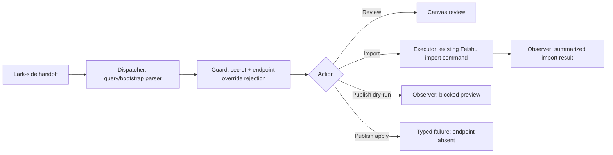
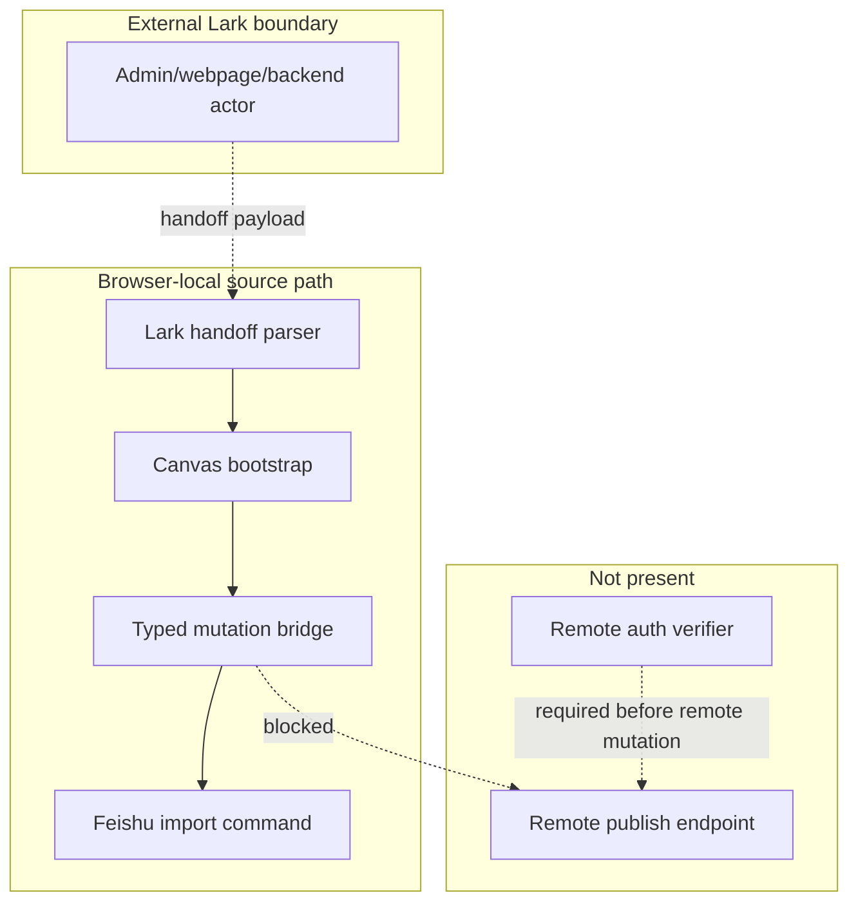

# Reference implementation: Lark App-to-Canvas Contract

## Reference implementation scope and readiness

This combined PRD/TAD describes source-present Lark handoff, local source
import, and blocked publish-preview contracts. It does not claim that a Lark
backend calls Knowgrph, that browser-supplied auth context is cryptographically
verified, that a remote write endpoint exists, or that any public route has
been verified.

| Scope | Local rung | Delivered rung | Basis |
|---|---|---|---|
| Combined contract | `spec-complete` | `undocumented` | Typed source contracts and VCCs are stated; no satisfying Lark-host or delivery Evidence Reference is attached. |

The readiness ladder is `undocumented` → `spec-complete` → `dev-proven` →
`runtime-ready` → `production-verified`.

### Actual repository baseline

| Source owner | Source-present fact | Explicit limit |
|---|---|---|
| `grph-shared/src/search/larkAppMcpSsot.ts` | Owns Lark admin links, configuration labels, Canvas/import labels, and local preview guidance. | Its phase and endpoint-shaped strings are UI constants, not delivery evidence. |
| `canvas/src/features/panels/views/larkAppMcpApiDocs.ts` | Builds virtual MainPanel rows and remote-config text. | The browser does not become a Lark backend or verify route availability. |
| `canvas/src/features/canvas/larkAppCanvasHandoff.ts` | Builds/parses a base64url query handoff for review/import and rejects secret-like material or endpoint overrides. | A query token is not an authenticated session. |
| `canvas/src/features/canvas/CanvasQueryBootstrapRuntime.tsx` | Consumes the handoff and installs local commands. | It is browser-local app behavior. |
| `canvas/src/features/canvas/larkAppRemoteMutationBridge.ts` | Defines typed import and publish-preview requests/results with idempotency, conflict, audit, and blocked-readiness fields. | Type fields do not perform authentication. |
| `canvas/src/features/canvas/larkAppRemoteMutationBridgeRuntime.ts` | Delegates `import-source-document` to the existing Feishu import command; returns a blocked preview for publish dry-runs; rejects non-dry-run publish. | No remote mutation transport or remote publish endpoint. |
| Focused Lark tests | Exercise config, handoff, local import delegation, blocked preview, and secret/override rejection. | No Lark API, host, or public-route verification. |

The exact remote MCP target must not be copied into this document. The sole
Knowgrph Invocation Register and endpoint owner is
[the MCP installation contract](../knowgrph-mcp-install-contract.md). The
source constant used by MainPanel must be reconciled with that owner before a
delivery claim.

## PRD

### Problem and outcome

A Lark-side workflow needs a safe way to open Knowgrph for review and import
without leaking app secrets, accepting arbitrary endpoint overrides, or
mistaking a browser-local bridge for a remote write service. The first-value
outcome is a validated Canvas handoff and local source import. Remote publishing
remains explicitly blocked.

### Personas and user stories

| Persona | User story | Success signal |
|---|---|---|
| Lark operator | As an operator, I want the canonical MCP target referenced once so that setup cannot drift across provider documents. | This document links the install contract instead of repeating an endpoint. |
| Reviewer | As a reviewer, I want a handoff that opens Canvas without embedding secrets so that imported content remains user-mediated. | Secret-like keys and endpoint overrides are rejected. |
| Importer | As an importer, I want a reviewed snapshot delegated to the existing source-file seam so that validation is not duplicated. | The local bridge invokes the Feishu import command. |
| Publisher | As a publisher, I want an honest preview when remote publish is unavailable so that no dry-run is mistaken for a write. | Preview says blocked; non-dry-run publish returns failure. |
| Auditor | As an auditor, I want typed auth fields distinguished from auth verification so that source types cannot promote readiness. | No authenticated-service claim without a verifier and host evidence. |

### User journey flow

| Stage | User action | Touchpoint | Friction | Required outcome |
|---|---|---|---|---|
| Trigger | Starts from a Lark admin/webpage/backend surface. | External Lark surface | Admin URLs can be mistaken for MCP endpoints. | Resolve target only through the canonical install contract. |
| Discover | Opens a review handoff. | Query/bootstrap runtime | Payload may contain secrets or endpoint overrides. | Reject forbidden material before use. |
| Engage | Reviews or imports a structured snapshot. | Canvas + source-file import | A remote-looking bridge may bypass validation. | Delegate to existing local import owners. |
| Complete | Requests publish preview. | Browser-local bridge | Preview may be mistaken for remote mutation. | Return blocked preview metadata only. |
| Return | Attempts actual remote publish later. | Future host service | No endpoint or auth verifier exists. | Fail closed until separately specified and evidenced. |

### Requirements and prioritization

| ID | Requirement | Priority |
|---|---|---|
| `PRD-LARK-01` | Keep Knowgrph endpoint ownership solely in the canonical MCP installation contract. | Must |
| `PRD-LARK-02` | Reject secret-like material and endpoint overrides in handoff and mutation payloads. | Must |
| `PRD-LARK-03` | Reuse the existing Feishu source import command for local import. | Must |
| `PRD-LARK-04` | Require explicit idempotency key, conflict policy, audit reason, and target for bridge requests. | Must |
| `PRD-LARK-05` | Keep publish dry-runs preview-only and blocked; reject non-dry-run publish. | Must |
| `PRD-LARK-06` | Do not describe typed `authContext` fields as cryptographic authentication. | Must |
| `PRD-LARK-07` | Add a remote write service without a separate auth, conflict, audit, cost, and rollback ADR. | Won't in this increment |

### Acceptance criteria

| Requirement | Given / When / Then | VCC |
|---|---|---|
| `PRD-LARK-01` | Given this document, when an operator needs a Knowgrph endpoint, then exactly one link resolves to the canonical register and no endpoint is duplicated here. | `VCC-LARK-01` |
| `PRD-LARK-02` | Given secret-like or endpoint-override fields, when a handoff/request is built, then construction fails before import. | `VCC-LARK-02` |
| `PRD-LARK-03` | Given a valid local import request, when the runtime command executes, then it delegates to `importSnapshot`. | `VCC-LARK-03` |
| `PRD-LARK-04` | Given missing identity, idempotency, conflict, audit, or target fields, when normalization runs, then it returns an error. | `VCC-LARK-04` |
| `PRD-LARK-05` | Given publish dry-run, when executed, then a blocked preview is returned; given non-dry-run publish, then failure is returned. | `VCC-LARK-05` |
| `PRD-LARK-06` | Given the current runtime, when auth behavior is inspected, then no cryptographic verifier or remote auth transport is claimed. | `VCC-LARK-06` |
| `PRD-LARK-07` | Given a proposed remote write service, when activation is reviewed, then it remains blocked without a separate auth, conflict, audit, cost, and rollback ADR. | `VCC-LARK-07` |

### Economics, TTV, and delivery reach

| Scope | Impact × reach | Build + TCO + token score | ROI score | Decision |
|---|---:|---:|---:|---|
| Local review/import handoff | `7 × 5` | `3 + 0 + 0` | `11.67` | Retain. |
| Remote publish service | `5 × 3` | `9 + 7 + 4` | `0.75` | Reject until evidence and demand justify it. |

| Metric | Current fact | Gate |
|---|---|---|
| Time to first value | Not measured | At most 5 minutes from handoff to reviewed local import; record clean-browser evidence. |
| Handoff/import model tokens | 0 | Remain 0; parsing and transformation are deterministic. |
| Publish-preview model tokens | 0 | Remain 0. |
| Runtime loops | No model or retry loop in the local bridge | Any future remote retry loop needs numeric attempt and time bounds. |
| Managed 12-month incremental Knowgrph TCO | USD 0 for browser-local source path | Remote host/API costs unmeasured and not approved. |
| Self-managed 12-month TCO | Not selected; unmeasured | Compare host compute, auth operations, maintenance, storage, and egress. |
| Hybrid 12-month TCO | Not selected; unmeasured | Compare separately. |

| Reach | Current source behavior |
|---|---|
| Browser | Handoff parsing and local commands are source-present. |
| Mobile browser | No distinct evidence; large snapshot usability is unmeasured. |
| Offline | Local parsing/import can operate on supplied data; Lark and remote MCP access are unavailable. |

## TAD

### Workflow flow

**Trigger:** a Lark-side actor constructs a Knowgrph review/import handoff.

1. The target is selected from the canonical MCP installation contract.
2. The browser parses a handoff token and rejects forbidden material.
3. Canvas opens the requested review/import surface.
4. A valid import delegates to the Feishu source import command.
5. A publish dry-run produces blocked handoff metadata.
6. A non-dry-run publish fails because no remote endpoint exists.

**Alternate path:** a review-only handoff opens Canvas without a snapshot
import.

**Error path:** malformed token, secret material, endpoint override, unsupported
action, missing required field, or non-dry-run publish fails closed.

**Postcondition:** local import may update app-owned source state; no remote
publish occurs.

### Data flow

| Stage | Component | Input | Output | Persistence | Failure |
|---|---|---|---|---|---|
| Ingest | Handoff parser | Query token or JSON | Normalized review/import intent | Query removed after consumption | Typed parse error |
| Transform | Request contract | Typed bridge input | Validated request | None | Required-field/forbidden-material error |
| Store | Feishu import seam | Supplied snapshot | Sanitized source document | Existing app source-file owner | Import result/error |
| Serve | Browser-local bridge | Import or publish request | Applied local import, accepted dry-run, blocked preview, or failure | Last result may be reflected in app dataset | Explicit result variant |
| Consume | Canvas/operator | Result | Review state or next-step guidance | App/operator-owned | No remote success shape |

### Orchestration and harness flow

All present steps are deterministic and zero-model-token. The `authContext`
object is validated structurally, not cryptographically.

### Topology flow

### Journey-to-system mapping

| Journey stage | Workflow | Data stage | Harness role | Owner |
|---|---|---|---|---|
| Trigger | Select canonical target | Ingest | External dispatcher | Install contract + Lark actor |
| Discover | Parse handoff | Ingest/transform | Parser/guard | `larkAppCanvasHandoff.ts` |
| Engage | Review/import | Store | Local executor | Canvas + Feishu import owner |
| Complete | Preview publish | Serve | Blocked observer | Browser-local bridge |
| Return | Attempt future publish | Consume | Fail-closed boundary | Future host owner |

### Component and integration contracts

| Component ID | Component | Interface IDs | VCC mappings | Invariant |
|---|---|---|---|---|
| `TAD-LARK-ENDPOINT` | MCP installation contract | `TAD-LARK-ENDPOINT-RESOLVE` (canonical Invocation Register link) | `VCC-LARK-01` | Provider docs link; they do not duplicate targets. |
| `TAD-LARK-HANDOFF` | Handoff parser | `TAD-LARK-HANDOFF-BUILD-PARSE` (handoff builders/parser) | `VCC-LARK-02` | A token is not authentication. |
| `TAD-LARK-BOOTSTRAP` | Canvas bootstrap | `TAD-LARK-BOOTSTRAP-CONSUME` | `VCC-LARK-02`, `VCC-LARK-03` | No parallel canvas/import stack. |
| `TAD-LARK-REQUEST` | Mutation request contract | `TAD-LARK-REQUEST-NORMALIZE` (`buildLarkAppRemoteMutationRequest`) | `VCC-LARK-02`, `VCC-LARK-04`, `VCC-LARK-06` | Structural validation only. |
| `TAD-LARK-BRIDGE` | Local bridge | `TAD-LARK-BRIDGE-EXECUTE` (`createLarkAppRemoteMutationBridgeCommand`) | `VCC-LARK-03`, `VCC-LARK-05` | No remote write side effect. |
| `TAD-LARK-IMPORT` | Feishu import command | `TAD-LARK-IMPORT-SNAPSHOT` (`importSnapshot`) | `VCC-LARK-03` | No Lark network fetch. |
| `TAD-LARK-REMOTE` | Remote write service (not implemented) | `TAD-LARK-REMOTE-PUBLISH` | `VCC-LARK-06`, `VCC-LARK-07` | Requires separately evidenced authentication and an accepted ADR. |

### PRD ↔ TAD traceability

| Requirement | TAD component | Interface | VCC |
|---|---|---|---|
| `PRD-LARK-01` | `TAD-LARK-ENDPOINT` | `TAD-LARK-ENDPOINT-RESOLVE` | `VCC-LARK-01` |
| `PRD-LARK-02` | `TAD-LARK-HANDOFF` + `TAD-LARK-REQUEST` | `TAD-LARK-HANDOFF-BUILD-PARSE` + `TAD-LARK-REQUEST-NORMALIZE` | `VCC-LARK-02` |
| `PRD-LARK-03` | `TAD-LARK-BRIDGE` + `TAD-LARK-IMPORT` | `TAD-LARK-BRIDGE-EXECUTE` + `TAD-LARK-IMPORT-SNAPSHOT` | `VCC-LARK-03` |
| `PRD-LARK-04` | `TAD-LARK-REQUEST` | `TAD-LARK-REQUEST-NORMALIZE` | `VCC-LARK-04` |
| `PRD-LARK-05` | `TAD-LARK-BRIDGE` | `TAD-LARK-BRIDGE-EXECUTE` | `VCC-LARK-05` |
| `PRD-LARK-06` | `TAD-LARK-REQUEST` + `TAD-LARK-REMOTE` | `TAD-LARK-REQUEST-NORMALIZE` + `TAD-LARK-REMOTE-PUBLISH` | `VCC-LARK-06` |
| `PRD-LARK-07` | `TAD-LARK-REMOTE` | `TAD-LARK-REMOTE-PUBLISH` | `VCC-LARK-07` |

### Security and error contract

| Condition | Required outcome |
|---|---|
| Secret-like key/value in handoff | Reject before parsing into app state. |
| Endpoint override in handoff/request | Reject; use canonical route owner. |
| Claimed actor/session fields | Treat as data until a host-side verifier proves them. |
| Duplicate/replayed remote request | Future service must enforce idempotency; browser type alone is insufficient. |
| Conflict | Use explicit reject/compare policy; no silent overwrite. |
| Non-dry-run publish | Return failure with no retryable success implication. |

### Architectural decision

Keep review and supplied-snapshot import browser-local and reuse existing
source-file owners. Keep remote publish absent until a separate authenticated
service and deployment evidence exist. This minimizes first-value cost and
prevents endpoint and runtime duplication.

### Lane and deploy boundaries

| Lane | Allowed state | Promotion rule |
|---|---|---|
| Authoring | Source contracts, docs, deterministic tests | Current lane |
| Mirror | Separately authorized projection | `closed` without instruction, evidence, target, rollback |
| Delivery | Lark host, public MCP, or remote mutation service | `closed` without host/runtime VCCs and rollback |

No authoring-lane command in this document may mutate a mirror or delivery
surface.

### Deploy Boundary Register

| Boundary | From lane | To lane | Evidence Reference | Operator instruction | Rollback statement/check | State |
|---|---|---|---|---|---|---|
| `DB-LARK-AUTHORING-MIRROR` | Authoring | Mirror | `none recorded` | `none` | Restore the prior approved mirror revision; verify its digest matches the prior promotion record. | `closed` |
| `DB-LARK-MIRROR-DELIVERY` | Mirror | Delivery | `none recorded` | `none` | Restore the prior delivered revision; rerun the Lark handoff/import health check recorded by that prior promotion. | `closed` |

## VCC and evidence register

| VCC | Exact check | Expected end state | Constraint | Evidence Reference |
|---|---|---|---|---|
| `VCC-LARK-01` | From repository root: `node -e 'const fs=require("node:fs"); const files=process.argv.slice(1); const text=files.map(f=>fs.readFileSync(f,"utf8")).join("\n"); const copied=["https:/","/airvio.co"].join(""); if(text.includes(copied) \|\| !text.includes("../knowgrph-mcp-install-contract.md") \|\| !fs.existsSync("docs/documents/knowgrph-mcp-install-contract.md")) process.exit(1)' docs/documents/knowgrph-mcp/knowgrph-lark-app-mcp-prd-tad.md docs/documents/knowgrph-mcp/knowgrph-lark-app-mcp-prd-tad.companion.md` | No copied target appears and the install-contract link resolves. | Deterministic source check. | None recorded |
| `VCC-LARK-02` | From `canvas/`: `node --preserve-symlinks --preserve-symlinks-main ../node_modules/tsx/dist/cli.cjs src/tests/runExport.ts src/__tests__/larkAppCanvasHandoff.test.ts testLarkAppCanvasHandoffDoesNotAcceptSecretMaterial`; then `node --preserve-symlinks --preserve-symlinks-main ../node_modules/tsx/dist/cli.cjs src/tests/runExport.ts src/__tests__/larkAppRemoteMutationBridge.test.ts testLarkAppRemoteMutationBridgeRejectsEndpointOverride` | Both invocations print `OK`; forbidden inputs fail closed. | No external Lark call. | None recorded |
| `VCC-LARK-03` | From `canvas/`: `node --preserve-symlinks --preserve-symlinks-main ../node_modules/tsx/dist/cli.cjs src/tests/runExport.ts src/__tests__/larkAppRemoteMutationBridgeRuntime.test.ts testLarkAppRemoteMutationBridgeRuntimeImportsSourceDocumentThroughExistingSeam` | `runExport` prints `OK`; valid local import delegates to the existing command. | Browser-local only. | None recorded |
| `VCC-LARK-04` | From `canvas/`: `node --preserve-symlinks --preserve-symlinks-main ../node_modules/tsx/dist/cli.cjs src/tests/runExport.ts src/__tests__/larkAppRemoteMutationBridge.test.ts testLarkAppRemoteMutationBridgeBuildsTypedRequest` | `runExport` prints `OK`; required fields and supported values are enforced. | Structural auth only. | None recorded |
| `VCC-LARK-05` | From `canvas/`: `node --preserve-symlinks --preserve-symlinks-main ../node_modules/tsx/dist/cli.cjs src/tests/runExport.ts src/__tests__/larkAppRemoteMutationBridgeRuntime.test.ts testLarkAppRemoteMutationBridgeRuntimeRejectsLivePublishUntilEndpointExists` | `runExport` prints `OK`; dry-run is blocked preview and publish apply is rejected. | No remote endpoint. | None recorded |
| `VCC-LARK-06` | No invocable cryptographic-auth or remote-transport VCC exists. | No verifier or remote transport is claimed. | Unsatisfied; no readiness credit. | None recorded |
| `VCC-LARK-07` | No accepted remote-write ADR or invocable remote-publish VCC exists. | Remote write activation remains blocked until auth, conflict, audit, cost, and rollback decisions are accepted and evidenced. | Unsatisfied; no readiness credit. | None recorded |

See [the companion](knowgrph-lark-app-mcp-prd-tad.companion.md) for file-level
ownership and gap detail. No VCC result recorded here advances readiness.
