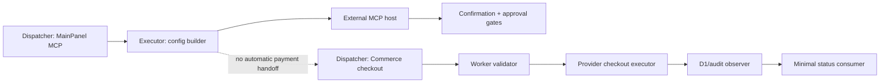
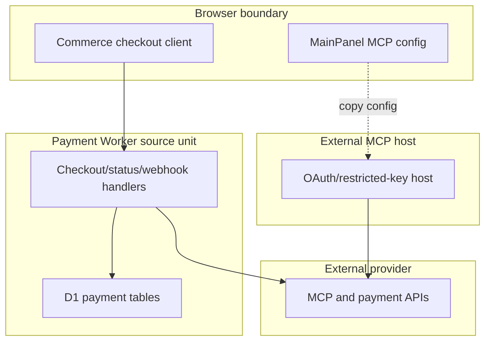

# Reference implementation: Stripe MCP Configuration and Checkout Boundary

## Reference implementation scope and readiness

This combined PRD/TAD separates two source-present units:

1. MainPanel rows and deterministic remote/local MCP config builders; and
2. a payment Worker checkout/webhook code path used by the Commerce surface.

The first does not invoke Stripe from the browser. The second is not an MCP
tool and is not automatically activated by MCP configuration. Neither source
unit carries a satisfying public-delivery Evidence Reference in this document.

| Scope | Local rung | Delivered rung | Basis |
|---|---|---|---|
| Combined contract | `spec-complete` | `undocumented` | Acceptance criteria and source-test VCCs are named; no satisfying host/provider/delivery Evidence Reference is attached. |

The readiness ladder is `undocumented` → `spec-complete` → `dev-proven` →
`runtime-ready` → `production-verified`.

### Actual repository baseline

| Source owner | Source-present fact | Explicit limit |
|---|---|---|
| `grph-shared/src/payments/stripeMcpSsot.ts` | Owns remote/local config labels, a sandbox restricted-key placeholder, 10 tool names, one excluded name, timeout, and confirmation policy. | Provider host/session availability is not verified. |
| `canvas/src/features/panels/views/stripeMcpApiDocs.ts` | Builds remote and local MCP config JSON and 14 virtual rows. | Does not execute MCP or retain an actual key. |
| `canvas/src/features/panels/views/settingsMcpDocEntries.ts` | Aggregates the Stripe row family into MainPanel MCP. | Rendering is not payment acceptance. |
| `grph-shared/src/payments/stripePaymentSsot.ts` | Owns payment route paths, server environment names, checkout constraints, and operator-command labels. | Configuration labels are not Worker delivery evidence. |
| `cloudflare/workers/knowgrph-payment/payments.ts` and `stripeHostedCheckout.ts` | Define checkout create/status and webhook handling, server-side provider calls, D1 writes, signature checks, idempotency, and failure paths. | Source presence does not prove a configured or reachable Worker. |
| Browser payment owners | Call the server-managed checkout/status route and gate return state. | They do not expose server credentials. |
| Focused tests | Cover MainPanel rendering and Worker checkout/webhook security behavior with fixtures. | Fixture tests do not prove provider credentials or public delivery. |

Current source responsibility copy says: “MainPanel MCP exposes payment readiness and agent configuration; MainPanel Commerce remains the customer-facing checkout, entitlement, and reconciliation surface.” In this
contract, “payment readiness” means configuration/reference visibility only.
The source row `accept_payment_ready: ready` is a UI value and is not a
Readiness Ladder rung or Evidence Reference.

## PRD

### Problem and outcome

Operators need MCP configuration without browser-held payment credentials, and
customers need checkout through the server-owned Commerce path rather than an
implicit agent action. The first-value outcomes are:

- non-secret MCP config text; and
- a typed, server-route checkout request when the separate Worker is configured.

No implicit MCP payment, provider session, or entitlement grant is authorized.

### Personas and user stories

| Persona | User story | Success signal |
|---|---|---|
| MCP operator | As an operator, I want remote/local config from one SSOT so that I do not copy stale provider settings. | MainPanel emits deterministic JSON with no credential value. |
| Buyer | As a buyer, I want checkout to remain an explicit Commerce action so that an agent cannot charge me through hidden configuration. | Commerce surface owns checkout, entitlement, and reconciliation UX. |
| Payment maintainer | As a maintainer, I want MCP and Worker owners separated so that provider-tool configuration cannot bypass checkout controls. | Traceability names both source units and their boundary. |
| Auditor | As an auditor, I want every provider tool confirmed and every state/spend action additionally approval-gated. | Source policy and tests retain the guard distinction. |
| Operator | As an operator, I want missing Worker configuration to fail closed. | Checkout route returns typed error instead of a fabricated URL. |

### User journey flow

| Stage | User action | Touchpoint | Friction | Required outcome |
|---|---|---|---|---|
| Trigger | Needs agent configuration or customer checkout. | MainPanel MCP/Commerce | Two distinct paths can be conflated. | Choose the intended owner. |
| Discover | Reviews remote/local config, tool policy, and secret boundary. | MainPanel MCP | UI value `ready` can be mistaken for delivery. | Show configuration as source-only. |
| Engage | Configures an external MCP host or explicitly starts checkout. | Host or Commerce | Credential placement and consent differ. | Host owns MCP auth; Worker owns checkout auth/config. |
| Complete | Receives host result or server-created checkout response. | External host or Worker | Provider/D1 partial failure can look successful. | Return typed result; fail closed on persistence/audit failure. |
| Return | Revisits payment status/entitlement. | Commerce return runtime | Unowned session lookup can leak state. | Require locally owned session and minimal response. |

### Requirements and prioritization

| ID | Requirement | Priority |
|---|---|---|
| `PRD-STRIPE-01` | Derive MCP config rows and builders from the shared MCP SSOT. | Must |
| `PRD-STRIPE-02` | Keep actual OAuth tokens and restricted/secret keys outside browser storage, docs, and fixtures. | Must |
| `PRD-STRIPE-03` | Require human confirmation for every hosted provider MCP tool; require the app approval gate for state-changing or spend-bearing tools. | Must |
| `PRD-STRIPE-04` | Keep customer checkout and entitlement in Commerce/payment Worker owners, not MCP config rows. | Must |
| `PRD-STRIPE-05` | Keep Worker secrets, visible checkout authority, D1 persistence, webhook verification, and return-state validation explicit and fail-closed. | Must |
| `PRD-STRIPE-06` | Treat `accept_payment_ready: ready` as display data only. | Must |
| `PRD-STRIPE-07` | Allow an agent to initiate an unconfirmed payment or promote source tests to public readiness. | Won't |

### Acceptance criteria

| Requirement | Given / When / Then | VCC |
|---|---|---|
| `PRD-STRIPE-01` | Given MainPanel MCP, when rows render, then source-owned remote/local config and policy labels appear. | `VCC-STRIPE-01` |
| `PRD-STRIPE-02` | Given local config text, when inspected, then it contains the sandbox restricted-key environment reference and no actual key value. | `VCC-STRIPE-02` |
| `PRD-STRIPE-03` | Given a hosted tool or state/spend action, when dispatch is considered, then confirmation and the appropriate approval gate precede execution. | `VCC-STRIPE-03` |
| `PRD-STRIPE-04` | Given checkout intent, when the buyer engages, then Commerce calls the server route rather than invoking an MCP config row. | `VCC-STRIPE-04` |
| `PRD-STRIPE-05` | Given checkout/webhook requests, when ownership, config, signature, persistence, or audit checks fail, then the Worker returns failure and withholds success state. | `VCC-STRIPE-05` |
| `PRD-STRIPE-06` | Given readiness derivation, when display labels are read, then they contribute no readiness evidence. | `VCC-STRIPE-06` |
| `PRD-STRIPE-07` | Given an agent or host payment attempt, when required confirmation or approval is absent, then no payment dispatch or readiness promotion occurs. | `VCC-STRIPE-07` |

### Economics, TTV, and delivery reach

| Scope | Impact × reach | Build + TCO + token score | ROI score | Decision |
|---|---:|---:|---:|---|
| Source-owned MCP config + explicit Commerce handoff | `8 × 6` | `3 + 0 + 0` | `16.0` | Retain. |
| Browser-held credential/payment execution | `2 × 2` | `9 + 9 + 3` | `0.19` | Reject. |

| Metric | Current fact | Gate |
|---|---|---|
| Time to config value | Not measured | At most 5 minutes to locate/copy non-secret config; record clean-host evidence. |
| Time to checkout value | Not measured | At most 2 minutes from explicit Commerce action to provider redirect in a sandbox VCC. |
| Config/checkout model tokens | 0 | Remain 0; these are deterministic paths. |
| Model loops | None | Any future agent planner must state numeric calls/tokens/cost before use. |
| Managed 12-month incremental Knowgrph TCO | Source-only UI USD 0; Worker/provider actual unmeasured | Record Worker requests, D1, provider fees, and support before delivery promotion. |
| Self-managed 12-month TCO | Not selected; unmeasured | Compare host, secrets, audit, database, maintenance, and egress. |
| Hybrid 12-month TCO | Not selected; unmeasured | Compare separately. |

| Reach | Current source behavior |
|---|---|
| Browser | Config rows and Commerce client code are source-present. |
| Mobile browser | No distinct payment-flow evidence. |
| Offline | Config rows render; OAuth, MCP tools, checkout, status refresh, and webhooks are unavailable. |

### Scope and route ownership

Minimum scope is non-secret config, explicit tool policy, source-owned Worker
checkout boundaries, and deterministic tests. Creating products/prices,
provider account setup, autonomous payments, and entitlement policy are outside
this document.

This document does not create a second HTTP or MCP Invocation Register. The
canonical MCP endpoints remain in
[the MCP installation contract](../knowgrph-mcp-install-contract.md).
Payment HTTP paths are catalogued by the existing API document and owned in
source by `STRIPE_PAYMENT_ROUTE_PATHS`.

## TAD

### Workflow flow

**Configuration path:**

1. MainPanel resolves Stripe MCP rows.
2. Deterministic builders emit remote or local config.
3. An external host owns OAuth or restricted-key injection.
4. Host tool execution requires confirmation; state/spend also requires the
   app approval gate.

**Checkout path:**

1. Buyer explicitly starts checkout from Commerce.
2. Browser sends a typed request to the payment server route.
3. Worker validates server configuration and return URLs.
4. Worker creates a provider session, validates totals, and persists the local
   row; persistence/audit failure triggers compensation/failure.
5. Webhook or owned-session status refresh may update local state.
6. Browser receives only minimal payment state.

**Postcondition:** config generation has no payment side effect; checkout
success is never inferred from an MCP row.

### Data flow

| Stage | Component | Input | Output | Persistence | Failure |
|---|---|---|---|---|---|
| Ingest | MCP row mapper / Commerce client | Source constants or checkout intent | Config values or typed payload | Browser non-secret settings only | Invalid payload/config fails |
| Transform | Config builder / Worker validation | Values or payload | JSON config or provider form | None | Typed validation error |
| Store | External host / D1 owners | Host config or provider session/event | Host state or checkout/webhook row | Host-owned or D1 | No browser secret; explicit DB error |
| Serve | External MCP / payment Worker | Tool or HTTP request | Typed result/minimal payment state | Provider/D1 as owner defines | Typed provider/auth/audit error |
| Consume | Operator/Commerce return runtime | Result or session status | Review/entitlement decision | Existing app owners | Unpaid/unowned stays locked |

### Orchestration and harness flow

No present path requires a model call.

### Topology flow

### Journey-to-system mapping

| Journey stage | Workflow | Data stage | Harness role | Owner |
|---|---|---|---|---|
| Trigger | Choose config or checkout | Ingest | Dispatcher | MainPanel MCP/Commerce |
| Discover | Render policy/owners | Transform | Deterministic config builder | Stripe MCP SSOT/docs |
| Engage | Configure host/start checkout | Store/transform | Host or Worker executor | External host/payment Worker |
| Complete | Receive result/persist session | Serve/store | Provider executor + D1 observer | Host/provider/Worker |
| Return | Read owned status | Consume | Guarded consumer | Commerce return runtime |

### Component and integration contracts

| Component ID | Component | Interface IDs | VCC mappings | Invariant |
|---|---|---|---|---|
| `TAD-STRIPE-SSOT` | MCP SSOT | `TAD-STRIPE-SSOT-CONFIG` (Stripe MCP constants/policy) | `VCC-STRIPE-01`, `VCC-STRIPE-03`, `VCC-STRIPE-06` | Display readiness does not set a rung. |
| `TAD-STRIPE-CONFIG` | Config builders | `TAD-STRIPE-CONFIG-BUILD` (`buildStripeRemoteMcpConfigJson`; `buildStripeLocalMcpConfigJson`) | `VCC-STRIPE-01`, `VCC-STRIPE-02` | Local env contains reference text only. |
| `TAD-STRIPE-HOST` | External host | `TAD-STRIPE-HOST-CONFIRM-EXECUTE` | `VCC-STRIPE-03`, `VCC-STRIPE-07` | Browser never receives key value; confirmation precedes execution. |
| `TAD-STRIPE-COMMERCE` | Commerce client | `TAD-STRIPE-COMMERCE-CHECKOUT-STATUS` | `VCC-STRIPE-04`, `VCC-STRIPE-07` | No implicit MCP payment. |
| `TAD-STRIPE-WORKER` | Payment Worker | `TAD-STRIPE-WORKER-CHECKOUT`; `TAD-STRIPE-WORKER-WEBHOOK` | `VCC-STRIPE-05`, `VCC-STRIPE-07` | Fail closed on missing ownership or failed compensation/audit. |
| `TAD-STRIPE-RETURN` | Return runtime | `TAD-STRIPE-RETURN-STATUS` | `VCC-STRIPE-05` | Cancelled/unpaid/unowned remains locked. |

### PRD ↔ TAD traceability

| Requirement | TAD component | Interface | VCC |
|---|---|---|---|
| `PRD-STRIPE-01` | `TAD-STRIPE-SSOT` + `TAD-STRIPE-CONFIG` | `TAD-STRIPE-SSOT-CONFIG` + `TAD-STRIPE-CONFIG-BUILD` | `VCC-STRIPE-01` |
| `PRD-STRIPE-02` | `TAD-STRIPE-CONFIG` | `TAD-STRIPE-CONFIG-BUILD` | `VCC-STRIPE-02` |
| `PRD-STRIPE-03` | `TAD-STRIPE-HOST` | `TAD-STRIPE-HOST-CONFIRM-EXECUTE` | `VCC-STRIPE-03` |
| `PRD-STRIPE-04` | `TAD-STRIPE-COMMERCE` | `TAD-STRIPE-COMMERCE-CHECKOUT-STATUS` | `VCC-STRIPE-04` |
| `PRD-STRIPE-05` | `TAD-STRIPE-WORKER` + `TAD-STRIPE-RETURN` | `TAD-STRIPE-WORKER-CHECKOUT` + `TAD-STRIPE-WORKER-WEBHOOK` + `TAD-STRIPE-RETURN-STATUS` | `VCC-STRIPE-05` |
| `PRD-STRIPE-06` | `TAD-STRIPE-SSOT` | `TAD-STRIPE-SSOT-CONFIG` | `VCC-STRIPE-06` |
| `PRD-STRIPE-07` | `TAD-STRIPE-HOST` + `TAD-STRIPE-COMMERCE` + `TAD-STRIPE-WORKER` | `TAD-STRIPE-HOST-CONFIRM-EXECUTE` + `TAD-STRIPE-COMMERCE-CHECKOUT-STATUS` + `TAD-STRIPE-WORKER-CHECKOUT` | `VCC-STRIPE-07` |

### Security and error contract

| Condition | Required outcome |
|---|---|
| Key/token appears in browser/docs/fixture | Reject and remove. |
| Hosted MCP tool lacks confirmation | Deny. |
| State/spend MCP tool lacks app approval | Deny. |
| Worker key/price authority/return origin invalid | Fail before provider success is returned. |
| Provider session total mismatches expected ACP data | Expire where possible and fail. |
| D1/audit persistence fails after provider creation | Compensate/expire where possible and fail. |
| Webhook signature or API version invalid | Reject without settlement. |
| Status session is not locally owned | Reject before provider lookup. |

### Architectural decision

Use a configuration-only MCP reference surface and a separate server-owned
checkout path. The separation preserves explicit buyer action, secret custody,
idempotent persistence, and testable failure behavior without inventing a new
payment wrapper.

### Lane and deploy boundaries

| Lane | Allowed state | Promotion rule |
|---|---|---|
| Authoring | Source, docs, deterministic fixture tests | Current lane |
| Mirror | Separately authorized projection | `closed` without instruction, evidence, target, rollback |
| Delivery | MCP host or payment Worker publication | `closed` without clean-host/provider evidence and rollback |

No command in this document authorizes secret mutation, D1 migration, provider
creation, or deployment.

### Deploy Boundary Register

| Boundary | From lane | To lane | Evidence Reference | Operator instruction | Rollback statement/check | State |
|---|---|---|---|---|---|---|
| `DB-STRIPE-AUTHORING-MIRROR` | Authoring | Mirror | `none recorded` | `none` | Restore the prior approved mirror revision; verify its digest matches the prior promotion record. | `closed` |
| `DB-STRIPE-MIRROR-DELIVERY` | Mirror | Delivery | `none recorded` | `none` | Restore the prior delivered MCP/Worker revision; rerun the checkout and webhook health checks recorded by that prior promotion. | `closed` |

## VCC and evidence register

| VCC | Exact check | Expected end state | Constraint | Evidence Reference |
|---|---|---|---|---|
| `VCC-STRIPE-01` | From `canvas/`: `npm run test:ci:unit -- ui.mainPanel.mcpHub.surfacesStripeMcpPaymentReadiness` | One registered case runs and rows render from source constants. | Require `SUMMARY total=1 ... failed=0`; no network. | None recorded |
| `VCC-STRIPE-02` | Source config-builder test is not registered as a distinct case. | Local config contains only the sandbox restricted-key reference. | Unsatisfied as a standalone VCC. | None recorded |
| `VCC-STRIPE-03` | No end-to-end external MCP confirmation/approval VCC exists. | Every hosted tool is confirmed and state/spend is approval-gated. | Unsatisfied; no readiness credit. | None recorded |
| `VCC-STRIPE-04` | From `canvas/`: `npm run test:ci:unit -- ui.payments.stripe.checkout.usesServerManagedRoute` | One registered case runs; Commerce uses the server route. | Require `SUMMARY total=1 ... failed=0`. | None recorded |
| `VCC-STRIPE-05` | From `canvas/`: `npm run test:ci:unit -- worker.payments.stripe.webhook.rejectsBadSignature` and `npm run test:ci:unit -- worker.payments.stripe.checkout.rejectsUnownedStatusLookup` | Each invocation has `total=1`, `failed=0`; bad signature and unowned lookup fail closed. | Fixture/source evidence only. | None recorded |
| `VCC-STRIPE-06` | Conformance evaluator verifies no Evidence Reference is derived from `accept_payment_ready`. | Display data contributes no rung. | Distinct evaluator required. | None recorded |
| `VCC-STRIPE-07` | No end-to-end agent/host payment-dispatch VCC exists. | Missing confirmation or approval prevents payment dispatch and prevents readiness promotion. | Unsatisfied; no readiness credit. | None recorded |

See [the companion](knowgrph-stripe-mcp-service.companion.md) for exact source
ownership and checkout invariants. No VCC result recorded here advances
readiness.
