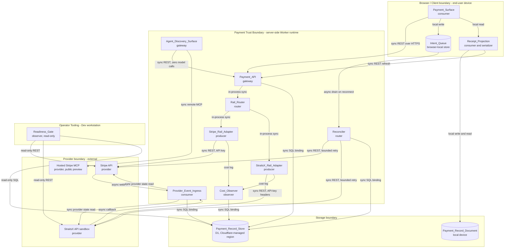
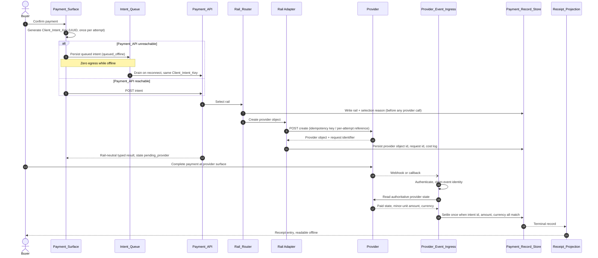
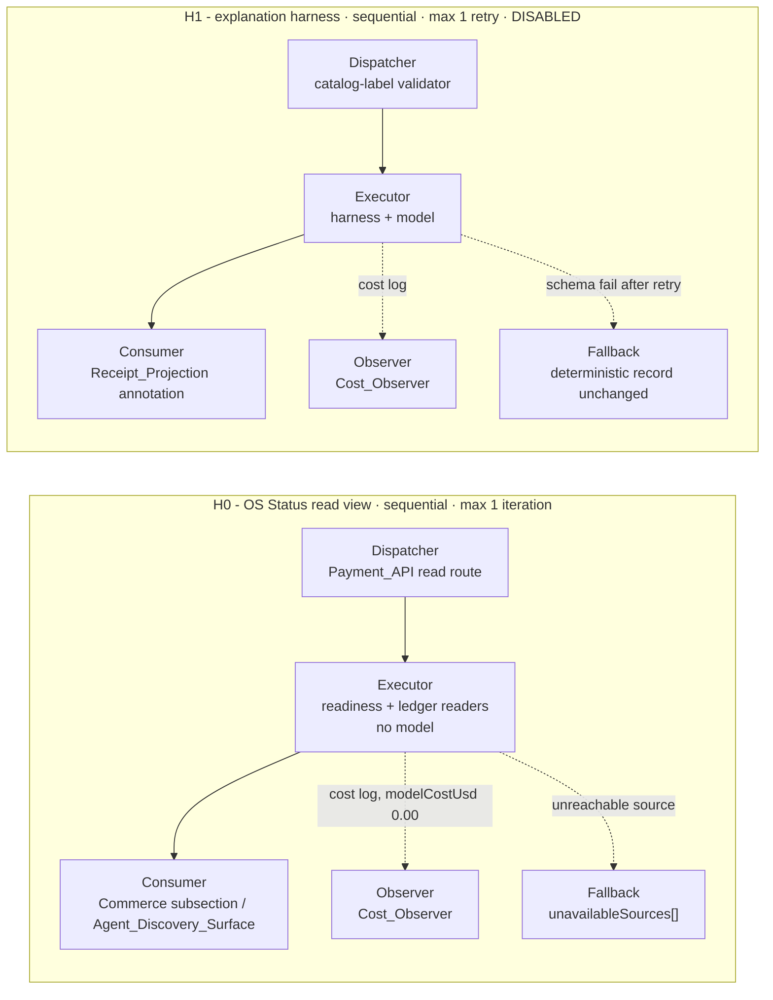
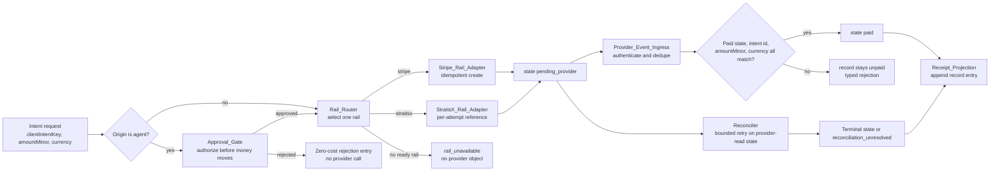
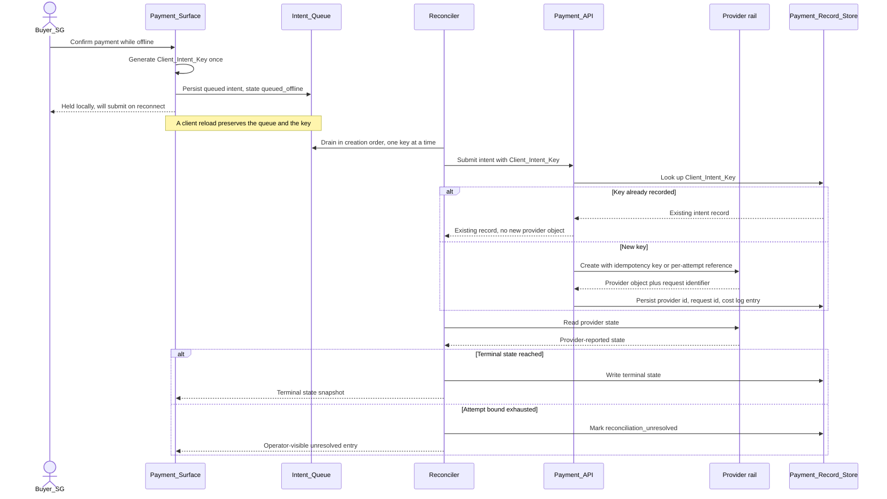
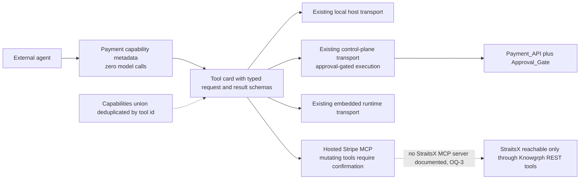

# Knowgrph Payments PRD/TAD

## Status

Proposed. Development authority only.

This document is the PRD/TAD projection of the `knowgrph-payments` spec requirements at `.kiro/specs/knowgrph-payments/requirements.md` version 0.1.0. The spec remains the normative requirements source of truth. Where this document and the spec disagree, the spec wins and this document is the defect.

## Authority and Scope

| Concern | Owner | This document's position |
|---|---|---|
| Payments requirements SSOT | `.kiro/specs/knowgrph-payments/requirements.md` | Projected here as PRD acceptance criteria and derived architecture. No requirement is weakened, added, or reinterpreted. |
| Operator surface for commerce and payments | `docs/documents/knowgrph-mainpanel-commerce-prd-tad.md` | MainPanel Commerce remains the canonical operator surface. Payments stays a Commerce subsection and never becomes a top-level tab. |
| ACP checkout, Web3 settlement, Solana Pay, OpenBOX, proof and trace runtime | `docs/documents/knowgrph-agentic-commerce-prd-tad.md` | Remains the runtime owner. This document consumes those routes and adds rail selection, the StraitsX rail, an offline intent queue, and a record projection on top. |
| Stripe MCP readiness, connection mode, tool confirmation policy | `docs/documents/knowgrph-mcp/knowgrph-stripe-mcp-service.md` | Remains the MCP readiness owner. This document references that transport for federation only. |
| Settings row rendering and generated schema | existing settings architecture owner | Reused. No second payment settings registry. |

New surface area introduced by this document: an explicit rail-selection contract, the StraitsX rail adapter, a client-owned offline intent queue with reconnect reconciliation, a serialized payment record with a round-trip guarantee, and a stated agent-platform readiness posture for payment tools.

Excluded by construction: a second payment Worker, a second payment store, a second commerce worker, a parallel panel framework, a unified MCP proxy tier, live-mode payments, and any production mirror or Cloudflare deployment action.

---

# PART I - PRD

## Feature: Two-Rail Payments Capability

### Problem Statement

A Knowgrph buyer in Singapore is offered a card-only checkout, and a Knowgrph client that is browser-first, local-first, offline-first, and mobile-first cannot structurally hold a payment secret. The result is three concrete losses. Buyers who transact with PayNow or SGD bank transfer abandon at the payment step. Buyers on an intermittent mobile connection tap twice and fear a double charge, because no client-generated identity ties the retry to the first attempt. Operators cannot tell whether a rail is configured well enough to accept money, because readiness lives in undocumented manual steps.

The opportunity is one payments capability with two rails behind one deterministic selection contract: Stripe for card and global consumer collection ([Stripe API](https://docs.stripe.com/api)), StraitsX for SGD fiat and XSGD stablecoin settlement ([StraitsX API guides](https://docs.straitsx.com/docs/introduction)). The client keeps no credential, retries are replay-safe, provider events are authenticated, and terminal payments are projected into one locally readable record. Fixed infrastructure cost stays at zero because the existing payment Worker and its D1 binding already exist.

### Personas

| Persona | Job to be done | Primary pain | Success signal |
|---|---|---|---|
| Buyer_SG | Unlock a paid Knowgrph capability paying in SGD from a phone on an unreliable connection | Card-only checkout excludes PayNow; a lost tap looks like a possible double charge | Payment reaches a terminal state within 90 seconds and a local receipt is readable offline |
| Buyer_Global | Pay by card in a non-SGD currency and retry safely | A retried card payment may create a second charge | Exactly one provider object exists per purchase attempt |
| Buying_Agent | Discover the payment capability and purchase on a buyer's behalf without unbounded spend | No structured payment target; no spend authorization boundary | Discovery costs zero model tokens and every money-moving call passes an approval gate |
| Solo_Operator | Enable a rail from zero state and prove it works before exposing it | Unknown prerequisites; silent configuration drift; secrets leaking into visible config | One command per rail names every missing input and exits non-zero when the rail is not ready |

Buyer_Global is the non-SGD variant of the Buyer_SG journey and shares journey JB. It is named separately because R3 is written from its perspective.

### Journey JB: Buyer_SG - complete a purchase with an unreliable connection

| Stage | Action | Touchpoint | Pain Point | Opportunity |
|---|---|---|---|---|
| Trigger | Buyer decides to unlock a paid capability | Payment_Surface | Unclear which currency and method apply | Rail selected from locale and currency without asking |
| Discover | Buyer sees the price in SGD and the available method | Payment_Surface | Card-only checkout excludes PayNow users | StraitsX rail offers PayNow and XSGD |
| Engage | Buyer confirms while the connection is intermittent | Payment_Surface plus Intent_Queue | Tap is lost; buyer retaps and fears a double charge | Client_Intent_Key makes the retry replay-safe |
| Complete | Payment confirms and the capability unlocks | Payment_Surface | Silent pending state with no explanation | Explicit pending, paid, and failed states each with a next action |
| Return | Buyer reopens later and reads a receipt | Payment_Record_Document | Receipt exists only in a provider dashboard | Local receipt projection readable with zero network requests |

### Journey JA: Buying_Agent - purchase on behalf of a buyer

| Stage | Action | Touchpoint | Pain Point | Opportunity |
|---|---|---|---|---|
| Trigger | Agent receives a purchase intent | Agent host | No structured payment target | Discoverable payment capability |
| Discover | Agent reads discovery metadata at zero token cost | Agent_Discovery_Surface | HTML scraping | Machine-readable capability document with typed schemas |
| Engage | Agent requests a payment intent | Agent_Discovery_Surface plus Approval_Gate | Unbounded agent spend | Approval gate authorizes before money moves |
| Complete | Payment settles and the agent receives a typed result | Agent_Discovery_Surface | Result shape varies per rail | One rail-neutral result schema |
| Return | Agent reads the settlement proof | Payment_Record_Document | No audit trail | Record carrying the provider reference and a cost log entry |

### Journey JO: Solo_Operator - enable a rail from zero state

| Stage | Action | Touchpoint | Pain Point | Opportunity |
|---|---|---|---|---|
| Trigger | Operator decides to accept payment on a new rail | MainPanel Commerce, Payments subsection | Unknown prerequisites | Readiness_Gate names every missing input |
| Discover | Operator reads which credentials the rail needs | Readiness_Gate output | Secrets leak into visible config | Gate fails when a secret name appears in visible variables |
| Engage | Operator configures sandbox credentials | Server-side secret store | Manual undocumented steps | One command per rail |
| Complete | Operator observes a confirmed sandbox payment | Payment_Surface plus Readiness_Gate | No end-to-end proof | Sandbox payment reaches a terminal state |
| Return | Operator re-runs the gate after a change | Readiness_Gate output | Silent drift | Gate reports per-rail status and mutates nothing |

### User Stories

| ID | Story | Journey stage | Requirement |
|---|---|---|---|
| PS-1 | As a Solo_Operator I want every payment credential held only server-side so that a local-first browser client can never leak a payment secret. | JO-Discover, JO-Engage | R1 |
| PS-2 | As a Buyer_SG I want the right rail chosen for my currency and region without being asked so that I can pay with a method I already use. | JB-Trigger, JB-Discover | R2 |
| PS-3 | As a Buyer_Global I want a card payment I can retry safely so that a lost response never charges me twice. | JB-Engage | R3 |
| PS-4 | As a Buyer_SG I want to pay in SGD with PayNow or bank transfer, or settle in XSGD, so that I am not forced onto a card rail. | JB-Discover, JB-Engage | R4 |
| PS-5 | As a Solo_Operator I want provider callbacks authenticated and applied exactly once so that a replayed or forged event cannot unlock a paid capability. | JB-Complete, JA-Complete | R5 |
| PS-6 | As a Buyer_SG I want a purchase started with no connection to resolve correctly when the connection returns so that I neither lose the purchase nor pay twice. | JB-Engage, JB-Complete | R6 |
| PS-7 | As a Solo_Operator I want terminal payments written to one inspectable local document so that I can audit and show a receipt without opening a provider dashboard. | JB-Return, JA-Return | R7 |
| PS-8 | As a Buyer_SG on a phone I want the payment state and my next action always visible so that I am never left guessing whether I paid. | JB-Discover, JB-Complete | R8 |
| PS-9 | As a Buying_Agent I want zero-token discovery and an approval-gated payment tool so that automated purchase is possible without unbounded spend. | JA-Discover, JA-Engage | R9 |
| PS-10 | As a Solo_Operator I want every failure typed and every refund traceable so that I can resolve a buyer problem without guessing. | JB-Complete, JO-Return | R10 |
| PS-11 | As a Solo_Operator I want per-rail readiness and per-call cost visible before I accept a payment so that I never expose a half-configured rail and never pay for hidden model calls. | JO-Trigger, JO-Complete, JO-Return | R11 |
| PS-12 | As a Solo_Operator I want the capability to hold as little regulated data as possible and stay inside Dev authority so that compliance exposure and release risk stay bounded. | JO-Discover, JO-Return | R12 |

### Acceptance Criteria

Each block summarizes one spec requirement in Given-When-Then form and states the VCC translation. The VCC lines are derived from the spec's existing Verifiable Completion Conditions and are not weakened.

#### R1 - Server-side trust boundary and secret custody

**Given** a browser-first Payment_Client and a server-side Payment_Trust_Boundary, **When** any payment operation runs, **Then** only the trust boundary sends a provider credential, Stripe credentials come from server-side secret storage using a restricted key where the operation permits one, every StraitsX request carries `X-XFERS-APP-API-KEY`, signed-mode requests additionally carry `X-PUBLIC-KEY-ID`, `X-TIMESTAMP` within 300 seconds of provider server time, a per-request UUID `X-NONCE`, and a base64 `X-SIGNATURE`, one Stripe API version is pinned per deployment, and a planted secret in client bundle output or visible Worker variables fails the readiness gate with configuration unchanged.

> **VCC translation**: `Verify a repository check reports zero occurrences of Stripe or StraitsX secret names and values in Payment_Client bundle output and in visible Worker vars and exits non-zero when a secret name is planted in either location; verify every outbound StraitsX request carries X-XFERS-APP-API-KEY and the signed-mode builder additionally emits X-PUBLIC-KEY-ID, X-TIMESTAMP, X-NONCE, and X-SIGNATURE with a fresh nonce per request; verify the configured Stripe API version is read from one owner and appears in every outbound Stripe request, with no configuration file mutated by the check`

The header set, the mandatory-header rule, the timestamp window, and the per-request nonce for replay protection are provider-documented ([StraitsX Say Hello](https://docs.straitsx.com/reference/say-hello)). The prohibition on embedding secret or restricted keys in source or client-side applications, the preference for scoped restricted live keys, and the failure of unauthenticated or plain-HTTP requests are Stripe-documented ([Stripe API](https://docs.stripe.com/api)).

#### R2 - Rail selection

**Given** a requested currency, a requested settlement asset, and per-rail readiness, **When** the Rail_Router runs, **Then** exactly one rail is selected before any provider call, `sgd` fiat with a ready StraitsX rail selects `straitsx`, `xsgd` selects `straitsx`, a non-SGD card-settled currency selects `stripe`, a single ready rail is selected with reason `only_ready_rail`, no ready rail returns typed `rail_unavailable` with zero provider objects created, and identical inputs return an identical rail and reason.

> **VCC translation**: `Verify a selection table test covers sgd fiat, xsgd, non-sgd card currency, single-ready-rail, and no-ready-rail and each case returns the documented rail identifier and reason; verify the intent record persisted before any provider call already contains the rail identifier and selection reason; verify repeated selection with identical inputs returns identical output across 100 generated input cases, with no provider call issued during the property run`

#### R3 - Stripe rail intent creation and idempotency

**Given** the Rail_Router selected `stripe`, **When** the Stripe rail creates the provider payment object, **Then** every Stripe POST carries a Provider_Idempotency_Key derived deterministically from the Client_Intent_Key, of at most 255 characters, containing no email address and no personal identifier, a retry with the same key and the same parameters returns the first stored result and leaves the Stripe object count at one, an `idempotency_error` from changed parameters yields typed `intent_parameter_conflict` with no additional provider object, the Knowgrph intent identifier is stored as provider metadata and the provider object identifier is stored on the intent record, the `Request-Id` response header is recorded per call, and a session past provider expiry moves the record to `expired`.

> **VCC translation**: `Verify a Stripe create call carries an idempotency key of at most 255 characters derived from the Client_Intent_Key with no email or personal identifier; verify replaying the same create request yields exactly one Stripe object and one stored provider identifier; verify a simulated idempotency_error produces typed intent_parameter_conflict with no second provider object; verify the persisted record contains the provider object id and the Request-Id for every Stripe call; verify an expired provider session transitions the record to expired and unlocks nothing`

Key length up to 255 characters with a V4 UUID suggested, replay of the stored status code and body for a repeated key including 500s, key pruning after roughly 24 hours, the error on reusing a key with different parameters, the guidance against sensitive data in keys, and the per-request identifier returned in the `Request-Id` response header are all Stripe-documented ([Stripe API](https://docs.stripe.com/api)).

#### R4 - StraitsX rail for SGD fiat and XSGD

**Given** exactly one configured StraitsX integration model per deployment, **When** the Rail_Router selects `straitsx`, **Then** an SGD fiat collection is created through a Payment API method valid for that model, the returned payment reference, amount, and destination are presented to the client unmodified, an `xsgd` request obtains its on-chain destination through the Blockchain API deposit-address method and offers only networks returned by the supported-blockchains method, the StraitsX payment identifier is recorded and provider state is authoritative on disagreement, a retried create sends a per-attempt unique request reference and reads provider state before recording a second attempt, a fund flow outside the configured model returns typed `integration_model_unsupported` with zero provider objects, and every sandbox request targets `https://api-sandbox.straitsx.com/v1`.

> **VCC translation**: `Verify the configured integration model is read from one owner and a fund flow outside that model returns integration_model_unsupported with zero provider calls; verify an SGD fiat intent produces a payment instruction whose reference, amount, and destination match the provider response byte-for-byte; verify an xsgd intent offers only networks present in the supported-blockchains response and rejects any other requested network; verify a create retry reads provider state before recording a second attempt and never records two paid payments for one Client_Intent_Key; verify every StraitsX request in sandbox mode targets the sandbox base URL`

The three integration models (First Party Transfer, Third Party Transfer, Regular Transfer), their distinct fund-flow permissions, the assignment of one model per approved use case, and the six API families (Customer Profiles, Payment, Payout, Swap, Blockchain, Transaction Limit) are provider-documented, with product availability varying by integration type and granted access ([StraitsX API guides](https://docs.straitsx.com/docs/introduction)). The sandbox base URL is documented on the connection smoke-test page ([StraitsX Say Hello](https://docs.straitsx.com/reference/say-hello)).

#### R5 - Provider event authentication and replay-safe settlement

**Given** an inbound provider event, **When** the Provider_Event_Ingress processes it, **Then** a Stripe event is verified against the `Stripe-Signature` header and the endpoint signing secret over the unmodified raw body before the payload is read, a verification failure yields typed `signature_verification_failed` with zero state change, a StraitsX callback is accepted only from the documented source addresses and its referenced payment is confirmed by reading provider state before any settlement, each provider event identity is recorded with a processing status and its side effects apply at most once, a repeat delivery of a processed identity with an equivalent payload is acknowledged with success and no further state change, a conflicting payload for a recorded identity is rejected with prior state preserved, an identity recorded as failed or as a stale in-flight claim is reprocessable on redelivery, and a record moves to `paid` only when provider-reported paid state, intent identifier, minor-unit amount, and currency all match.

> **VCC translation**: `Verify a tampered body or wrong signing secret is rejected as signature_verification_failed with zero state change; verify a callback from an address outside the documented source addresses is rejected and an accepted callback triggers a provider state read before settlement; verify delivering the same event identity twice produces one settlement side effect and a success acknowledgement on the second delivery; verify a conflicting payload for a recorded identity is rejected and prior state is unchanged; verify a failed identity is reprocessed on redelivery to a terminal outcome; verify an amount, currency, or intent-identifier mismatch leaves the record unpaid`

The signature header, signing secret, and source-address allowlist are carried from spec R5. Sandbox tests are driven from the provider sandbox surface, which exposes mock PayNow payment and mock bank transfer simulation, webhook configuration read and update endpoints, and callback resend by contract or event type ([StraitsX Say Hello](https://docs.straitsx.com/reference/say-hello)).

#### R6 - Offline intent queue and reconnect reconciliation

**Given** an unreachable Payment_Trust_Boundary, **When** a buyer requests a payment, **Then** the client persists a queued intent record with a UUID Client_Intent_Key generated once per purchase attempt and displays `queued_offline`, the queue survives a client reload, on reconnect the Reconciler submits queued records in creation order one key at a time, a submission for an already-recorded key returns the existing record with no additional provider object, every submitted record reaches a terminal state only from provider-read state, a record that cannot reach a terminal state within a stated attempt bound is marked `reconciliation_unresolved` and stops retrying with an operator-visible entry, paid capability is withheld while no terminal state exists, and the queue stores no credential and no card or bank identifier.

> **VCC translation**: `Verify a payment requested with the trust boundary unreachable persists as queued_offline with a UUID Client_Intent_Key and survives a client reload; verify submitting the same Client_Intent_Key N times creates exactly one provider object across 100 generated interleavings; verify every reconciled record reaches a terminal state only from provider-read state and queue state alone never unlocks capability; verify an unresolvable record stops retrying at the stated attempt bound and is reported as reconciliation_unresolved; verify the persisted queue contains no credential, card, or bank identifier field`

#### R7 - Payment record serialization and receipt round-trip

**Given** an intent record reaching a terminal state, **When** the Record_Serializer runs, **Then** one entry is appended carrying the intent identifier, Client_Intent_Key, selected rail, minor-unit amount, currency, settlement asset, terminal state, provider object identifier, and terminal timestamp, entries are emitted in a stable order with base-10 integer minor units, LF line endings, and a single trailing newline, parsing then re-serializing any valid document is byte-identical, serializing then parsing then serializing any valid record set is byte-identical, a malformed document yields a typed parse error naming the failing line with document bytes unchanged, no entry carries a card number, bank account number, credential, buyer email address, or provider customer identifier, and the offline receipt view renders from local storage with zero network requests.

> **VCC translation**: `Verify every terminal record produces exactly one entry with all nine named fields populated; verify parse then print is byte-identical for 100 generated valid documents; verify print then parse then print is byte-identical for 100 generated record sets; verify a malformed document yields a typed parse error naming the failing line with file bytes unchanged; verify no entry contains a card number, bank account number, credential, email address, or provider customer identifier across 100 generated records; verify the receipt view renders from local state with zero network requests`

#### R8 - Buyer payment surface states

**Given** an active intent record, **When** the Payment_Surface renders, **Then** it displays exactly one of `idle`, `queued_offline`, `pending_provider`, `paid`, `no_payment_required`, `failed`, `expired`, `cancelled`, or `reconciliation_unresolved` together with the amount in the requested currency, the selected rail, and that rail's payment instruction, the `queued_offline` state states that the payment is held locally and will be submitted on reconnect, state changes come from the single client-owned snapshot with no surface-derived payment state, a failure shows a buyer-safe reason and one retry action reusing the existing Client_Intent_Key, the surface has no horizontal overflow at 375 by 812 CSS pixels, and every control is keyboard reachable with the current state exposed to assistive technology as text.

> **VCC translation**: `Verify each of the nine states renders a distinct labelled state and the documented next action; verify no horizontal overflow at 375x812 and every control is keyboard reachable with a text state announcement; verify the surface reads the shared payment snapshot and holds no local payment state field`

#### R9 - Agent payment discovery and approval-gated tools

**Given** an external agent, **When** it discovers and invokes the payment capability, **Then** machine-readable metadata names the available rails, supported currencies, supported settlement assets, and typed request and result schemas, discovery is served with zero model calls and a recorded model cost of zero, a payment-creating or money-moving tool call is authorized by the existing Approval_Gate before any provider contact, an unapproved call is rejected with zero provider objects and a zero-cost rejection entry, the hosted Stripe MCP server is federated as one external transport at `https://mcp.stripe.com` with every payment-mutating tool behind human confirmation, account-scoped MCP calls use a restricted access key rather than an unrestricted secret key, one rail-neutral typed result shape is returned regardless of rail, and no new proxy tier or transport is added.

> **VCC translation**: `Verify the discovery response validates against the published schema, names both rails, and reports a model cost of zero; verify an unapproved payment tool call is rejected with zero provider calls and a zero-cost log entry; verify every registered payment-mutating Stripe MCP tool is marked as requiring confirmation and the configured endpoint matches the documented remote URL; verify account-scoped configuration references a restricted key rather than an unrestricted secret key; verify a stripe-selected and a straitsx-selected request return the same result shape; verify no new transport or proxy component is introduced beyond the existing MCP transports`

Stripe documents the hosted remote server as a public preview, recommends enabling human confirmation of tools, cautions about prompt-injection risk when combining it with other servers, manages client sessions and access from its dashboard, and documents restricted access keys plus a `Stripe-Account` header rather than OAuth for connected-account calls ([Stripe MCP](https://docs.stripe.com/mcp)).

#### R10 - Typed failures and refunds

**Given** a provider failure or a refund request, **When** the trust boundary handles it, **Then** every Stripe failure maps to a typed Knowgrph result preserving the Stripe error type from the documented enum, a card failure carrying a `decline_code` records that code while surfacing only a buyer-safe message, every StraitsX failure maps to a typed result preserving the provider HTTP status and reported reason, a refund on a `paid` record is created on the settling rail with its refund reference recorded, a repeated refund request leaves the refunded amount unchanged, a refund on a non-`paid` record returns typed `refund_not_applicable` with zero provider contact, a transport or `5xx` failure retries with the same Provider_Idempotency_Key to a stated attempt bound and then returns typed `provider_unavailable`, and every recorded failure carries the provider request identifier where the provider supplies one.

> **VCC translation**: `Verify each documented Stripe error type and a decline_code case map to a distinct typed result with provider internals excluded from the buyer-visible message; verify a StraitsX error maps to a typed result carrying HTTP status and provider reason; verify a refund on a paid record records a refund reference on the settling rail and a repeated request leaves the refunded amount unchanged; verify a refund on a non-paid record returns refund_not_applicable with zero provider calls; verify a simulated 5xx sequence retries with the same idempotency key to the stated bound and then returns provider_unavailable; verify each recorded failure carries the provider request identifier when supplied`

The error object exposes `code`, `decline_code`, `message`, `param`, `payment_intent`, and a `type` enum of `api_error`, `card_error`, `idempotency_error`, and `invalid_request_error`, with 2xx for success, 4xx for caller error, and 5xx for a provider-side problem ([Stripe API](https://docs.stripe.com/api)).

#### R11 - Cost observability, token economics, and readiness gates

**Given** a configured deployment, **When** payments run and the Readiness_Gate is invoked, **Then** one cost log entry per provider call records rail, operation, provider request identifier where available, outcome, and elapsed milliseconds, rail selection, intent creation, event ingestion, reconciliation, and record serialization make zero model calls and report a model cost of `0.00`, any optional payment-adjacent model explanation runs behind a harness with typed input, typed output, a per-call cost log, and a fallback returning the deterministic record unchanged, the gate reports per rail the required credential names, their presence in server-side secret storage, and whether any credential name appears in visible configuration, the gate mutates nothing and exits non-zero when a required input for an enabled rail is missing, a rail is reported ready only after a sandbox payment on that rail has reached a terminal state at least once, the gate names the configured Stripe API version and StraitsX integration model, and the Agentic OS read views expose rail readiness and the cost ledger without mutating state and without a model call.

> **VCC translation**: `Verify every provider call in a recorded run has exactly one cost log entry with the five named fields; verify a full intent-to-settlement run reports a model cost of 0.00 and zero model calls; verify the gate output lists required credential names per rail, performs zero writes, and exits non-zero when a required input is absent; verify a rail without a terminal sandbox payment is reported as not ready; verify the gate output names the configured Stripe API version and StraitsX integration model; verify the payment read views return typed output with zero state mutation and zero model calls`

#### R12 - Data minimization, compliance boundary, and release boundary

**Given** the payments capability in Dev authority, **When** any payment data is stored, transmitted, or released, **Then** no card number, card verification value, or full bank account number is stored in any Knowgrph store, buyer identity verification is delegated to the selected provider, idempotency keys and provider metadata exclude email addresses and personal identifiers, no payment record field enters a model prompt, the public status response carries exactly the intent identifier, state, minor-unit amount, and currency, a live-mode credential under sandbox mode returns typed `mode_mismatch` with zero provider contact, no production mirror change and no Cloudflare deployment occurs without a separate explicit release instruction, and no second payment Worker, payment store, or payment settings registry is added.

> **VCC translation**: `Verify no store schema field can hold a card number, CVV, or full bank account number and a planted value is rejected; verify no idempotency key or provider metadata value contains an email address or personal identifier across 100 generated records; verify no payment record field appears in any model prompt in a recorded run; verify the public status response contains exactly the four permitted fields; verify a live-mode credential under sandbox mode returns mode_mismatch and contacts no provider; verify the change set touches no production mirror path and no Cloudflare deployment target and introduces no second payment worker, store, or settings registry`

Provider-side customer profiles, KYC, and bank-account linking are documented provider capabilities, not Knowgrph capabilities ([StraitsX API guides](https://docs.straitsx.com/docs/introduction)). Metadata limits of up to 50 keys, key names at most 40 characters, values at most 500 characters, no square brackets in key names, and the prohibition on storing bank account numbers or card details in metadata or `description` are Stripe-documented ([Stripe API](https://docs.stripe.com/api)).

### Time-to-Value

| Step | Persona | Named action | Cumulative steps |
|---|---|---|---|
| T0 | Solo_Operator | Zero state: repository checked out, no provider credential configured | 0 |
| T1 | Solo_Operator | Obtain sandbox credentials for the target rail | 1 |
| T2 | Solo_Operator | Write credentials into server-side secret storage with the per-rail configure command | 2 |
| T3 | Solo_Operator | Record the rail mode, Stripe API version, and StraitsX integration model in visible configuration | 3 |
| T4 | Solo_Operator | Run the StraitsX sandbox reachability probe and the per-rail readiness gate | 4 |
| T5 | Solo_Operator | Resolve every input the gate reports as missing | 5 |
| T6 | Solo_Operator | Start one sandbox payment from the Payment_Surface | 6 |
| T7 | Solo_Operator | Drive the sandbox settlement using the provider sandbox simulation for that rail | 7 |
| T-check | Solo_Operator | Observe the intent reach a terminal state and appear in the Payment_Record_Document | 8 |

| Dimension | Estimate | Target ceiling | Validation method |
|---|---|---|---|
| TTV steps (Solo_Operator, zero state to first confirmed sandbox payment) | 8 steps | 10 steps or fewer | Walk-through on a clean checkout with sandbox credentials |
| TTV elapsed (Solo_Operator) | about 30 min | 45 min or less | Timed first-run on a clean checkout |
| TTV steps (Buyer_SG, price shown to paid) | 3 steps | 4 steps or fewer | Timed sandbox purchase on a 375 px viewport |
| TTV elapsed (Buyer_SG) | about 45 s | 90 s or less | Timed sandbox purchase |
| TTV steps (Buying_Agent, discovery to typed result) | 3 calls | 4 calls or fewer | Scripted agent run against sandbox |
| First-value action | A sandbox payment reaches a terminal state and the Payment_Surface reflects it | - | Observable state transition plus a Payment_Record_Document entry |

Operator TTV excludes provider account approval time. StraitsX access depends on an approved use case and an assigned integration model ([StraitsX API guides](https://docs.straitsx.com/docs/introduction)); that wait is an Open Question, not TTV. The TTV walk-through has not been executed because it requires operator-provided sandbox credentials. It is a pre-sign-off gate, not a claim.

### Success Metrics

| Metric | Baseline | Target | Timeline |
|---|---|---|---|
| Rails reaching a confirmed sandbox payment | 1 (Stripe, implemented elsewhere) | 2 (Stripe plus StraitsX) | Increment 1 |
| Duplicate provider objects created per replayed intent | not measured | 0 | Increment 1 |
| Queued offline intents resolved to a terminal state after reconnect | 0 percent (no queue exists) | 100 percent within 60 s of reconnect | Increment 1 |
| Provider events applied more than once | not measured | 0 | Increment 1 |
| Unauthenticated provider events accepted | not measured | 0 | Increment 1 |
| Payment secrets reachable from the client bundle | 0 asserted, not gated | 0 gated by a check | Increment 1 |
| Payment_Record_Document round-trip fidelity | not measured | byte-identical re-serialization for every valid document | Increment 1 |
| Time-to-value steps (Solo_Operator) | not measured | 10 steps or fewer | Increment 1 |
| Time-to-value elapsed (Solo_Operator) | not measured | 45 min or less | Increment 1 |
| Time-to-value steps (Buyer_SG) | not measured | 4 steps or fewer | Increment 1 |
| Time-to-value elapsed (Buyer_SG) | not measured | 90 s or less | Increment 1 |
| Token cost per month on the payment path | not measured | 0.00 USD with zero model calls in selection, creation, ingestion, reconciliation, serialization | Continuous |
| Monthly TCO (fixed infrastructure) | 0.00 USD (existing Worker plus D1 free tier) | 0.00 USD | Continuous |
| ROI score (capability aggregate) | - | 8 or higher | Increment 1 |

Provider transaction, FX, and network fees are variable cost of revenue and are excluded from monthly TCO. StraitsX commercial pricing is not published in the referenced documentation and is an Open Question ([StraitsX API guides](https://docs.straitsx.com/docs/introduction)).

### MoSCoW Priority

ROI uses `(User Impact x Reach) / (Build Hours + Monthly TCO + Token Cost per Month)`, with Reach expressed as payments per month at launch and Impact on a 1 to 5 scale. Values are carried from the spec unchanged.

| Tier | Feature | Requirement | Impact x Reach | Build hours | Monthly TCO | Token cost / month | ROI score |
|---|---|---|---|---|---|---|---|
| Must | Server-side trust boundary and secret custody gate | R1 | 5 x 40 = 200 | 4 | 0.00 | 0.00 | 50.0 |
| Must | Rail selection contract | R2 | 4 x 40 = 160 | 3 | 0.00 | 0.00 | 53.3 |
| Must | Stripe rail intent creation with idempotency | R3 | 4 x 30 = 120 | 5 | 0.00 | 0.00 | 24.0 |
| Must | StraitsX rail SGD fiat collection | R4 | 5 x 25 = 125 | 10 | 0.00 | 0.00 | 12.5 |
| Must | Provider event authentication and replay-safe settlement | R5 | 5 x 40 = 200 | 6 | 0.00 | 0.00 | 33.3 |
| Must | Offline intent queue and reconnect reconciliation | R6 | 4 x 20 = 80 | 8 | 0.00 | 0.00 | 10.0 |
| Must | Payment record serialization with round-trip guarantee | R7 | 3 x 40 = 120 | 4 | 0.00 | 0.00 | 30.0 |
| Must | Typed failure handling and refunds | R10 | 4 x 15 = 60 | 5 | 0.00 | 0.00 | 12.0 |
| Must | Per-rail readiness gates | R11 | 4 x 20 = 80 | 4 | 0.00 | 0.00 | 20.0 |
| Must | Data minimization and release boundary | R12 | 5 x 40 = 200 | 2 | 0.00 | 0.00 | 100.0 |
| Should | Mobile-first buyer payment surface states | R8 | 3 x 40 = 120 | 5 | 0.00 | 0.00 | 24.0 |
| Should | Agent payment discovery plus approval-gated tool surface | R9 | 4 x 10 = 40 | 6 | 0.00 | 0.00 | 6.7 |
| Should | StraitsX rail XSGD stablecoin acceptance | R4 | 3 x 8 = 24 | 8 | 0.00 (network fees variable) | 0.00 | 3.0 |
| Could | XSGD to SGD conversion through the Swap API | - | 2 x 5 = 10 | 6 | 0.00 | 0.00 | 1.7 |
| Could | Payout and disbursement rails through the Payout API | - | 2 x 3 = 6 | 8 | 0.00 | 0.00 | 0.8 |
| Won't (this increment) | Subscriptions and recurring billing | - | - | - | - | - | - |
| Won't (this increment) | Marketplace or connected-account fund splitting | - | - | - | - | - | - |
| Won't (this increment) | Custody of buyer funds or a Knowgrph-operated wallet | - | - | - | - | - | - |
| Won't (this increment) | Stripe Treasury agentic finance tools | - | - | - | - | - | - |
| Won't (this increment) | A second payment Worker, proxy tier, or payment store | - | - | - | - | - | - |

### Min-Viable Scope

The ten Must rows: two rails, one selection contract, one replay-safe settlement path, one offline queue, one serialized record with a round-trip guarantee, one readiness gate per rail, all in sandbox mode inside the Dev runtime. Every Should, Could, and Won't row is excluded from the min-viable cut.

### Out of Scope

- Subscriptions, recurring billing, invoicing schedules, and dunning.
- Marketplace flows, connected-account fund splitting, and platform fee capture.
- Knowgrph custody of buyer funds, a Knowgrph-operated wallet, or an exchange.
- Stripe Treasury money-movement, bill-pay, and card tools, which are access-gated ([Stripe MCP](https://docs.stripe.com/mcp)).
- StraitsX Payout, Swap, and FX flows beyond the Could tier.
- Tax calculation, invoicing compliance, and accounting integration.
- A custom card-entry form or any component touching raw card data.
- A second payment Worker, a unified proxy gateway tier, a second payment store, and a second payment settings registry.
- A payment-only top-level MainPanel tab.
- Production mirror publication and Cloudflare deployment.
- Live-mode payments. This increment is sandbox only, and the API key in use determines live versus sandbox behavior on the Stripe side ([Stripe API](https://docs.stripe.com/api)).

### Dependencies

| Dependency | Class | Justification |
|---|---|---|
| Existing `knowgrph-payment` Cloudflare Worker and its D1 binding | Zero-TCO, existing free-tier binding | Already the payment trust boundary; reuse avoids a new tier. |
| Existing shared payment SSOT modules (`grph-shared/src/payments/stripePaymentSsot.ts`, `stripeMcpSsot.ts`, `agenticCommerceSsot.ts`) | Repository-owned | Route, secret-name, and MCP configuration authority already exists; duplicating it would split ownership. |
| Existing external-tool Approval_Gate owner | Repository-owned | Spend authorization must not be reimplemented per rail. |
| Existing MainPanel Commerce surface | Repository-owned | Payments remains a Commerce subsection. |
| Stripe API and hosted Checkout | Proprietary, justified in ADR-2 | No FOSS alternative provides global card acquiring. Fees are per-transaction and variable; fixed monthly TCO stays 0.00 ([Stripe API](https://docs.stripe.com/api)). |
| Hosted Stripe MCP server | Proprietary, public preview, justified in ADR-4 | Only first-party MCP surface for the Stripe account; federated behind human confirmation ([Stripe MCP](https://docs.stripe.com/mcp)). |
| StraitsX API, sandbox first | Proprietary, justified in ADR-2 | Regulated SGD rails, PayNow, and XSGD issuance have no FOSS substitute; access depends on an approved use case and assigned integration model ([StraitsX API guides](https://docs.straitsx.com/docs/introduction)). |
| Browser-local storage for the Intent_Queue | Platform, FOSS | Zero egress while offline; no new service. |

### Open Questions

| ID | Question | Blocks | Resolution path |
|---|---|---|---|
| OQ-1 | StraitsX commercial pricing (transaction, FX, and network fee schedules) is not published in the referenced documentation ([StraitsX API guides](https://docs.straitsx.com/docs/introduction)). | Revenue model and per-transaction cost of revenue | Operator to obtain a commercial schedule from the provider |
| OQ-2 | Which StraitsX integration model will be approved for a solo operator collecting payments for its own product: First Party Transfer, Third Party Transfer, or Regular Transfer ([StraitsX API guides](https://docs.straitsx.com/docs/introduction)). | R4 endpoint selection and the StraitsX_Rail_Adapter fund-flow guard | Provider onboarding outcome |
| OQ-3 | No StraitsX MCP server is described in the referenced documentation. | Agent-surface parity across rails | Confirm existence before promising parity; otherwise StraitsX stays REST-only behind the Knowgrph tool surface |
| OQ-4 | The Stripe MCP server is a public preview and its tool surface may change ([Stripe MCP](https://docs.stripe.com/mcp)). | ADR-4 federation stability | Pin the federated tool list and re-verify on each preview change |
| OQ-5 | Stripe Treasury money-movement, bill-pay, and card tools are access-gated ([Stripe MCP](https://docs.stripe.com/mcp)). | Any future money-movement automation | Out of scope this increment; revisit only with granted access and a new ADR |
| OQ-6 | StraitsX callback authenticity beyond source-address allowlisting is unconfirmed; no signature header is documented on the referenced pages. | R5 hardening | Until confirmed, settlement requires a provider state read rather than trusting the payload |
| OQ-7 | StraitsX request-level idempotency semantics are not documented on the referenced pages. | R4 retry design | Until confirmed, a per-attempt reference plus a provider state read is the contract |
| OQ-8 | Which request header the Worker reads to evaluate the StraitsX source address, and whether a shared-secret path segment is warranted as defense in depth. | Provider_Event_Ingress implementation | Design task |
| OQ-9 | XSGD inbound acceptance path and which networks are enabled for the account through the supported-blockchains method. | R4 XSGD scope | Provider confirmation |
| OQ-10 | Exact StraitsX payment method for the first increment: dynamic PayNow QR, persistent PayNow QR, or virtual bank account, all documented as Payment API capabilities ([StraitsX API guides](https://docs.straitsx.com/docs/introduction)). | R4 buyer flow | Depends on OQ-2 |
| OQ-11 | Which Stripe API version the existing payment Worker already pins. The reference names `2026-06-24.dahlia` as current at time of writing ([Stripe API](https://docs.stripe.com/api)). | R1 criterion 7 | Read the existing owner before changing anything |
| OQ-12 | Which existing browser-local persistence owner holds the Intent_Queue and what its size bound is. | R6 implementation | Design task |
| OQ-13 | R11 criterion 3 permits an optional payment-adjacent model explanation while R12 criterion 4 forbids any payment record field in a model prompt, leaving that harness with no record-derived input. | Enabling any payment-adjacent model call | Keep the harness disabled and specified as a contract only until the spec resolves the tension |
| OQ-14 | The canonical request string construction for the StraitsX `X-SIGNATURE` header is not documented on the referenced pages, which name the header and its base64 encoding but not the string being signed ([StraitsX Say Hello](https://docs.straitsx.com/reference/say-hello)). | Enabling StraitsX HTTP Request Signing mode | Ship key-only mode first; the signed-mode request builder stays gated until the signing string layout is confirmed with the provider |
| OQ-15 | The StraitsX live-mode base URL is not stated on the referenced pages; only the sandbox base URL `https://api-sandbox.straitsx.com/v1` is documented ([StraitsX Say Hello](https://docs.straitsx.com/reference/say-hello)). | Live-mode operation on the StraitsX rail | Out of scope this increment, which is Sandbox_Mode only; confirm before any live enablement |

---

# PART II - TAD

## Architecture: Knowgrph Payments

### Overview

**From buyer intent to a locally readable receipt**: Payment_Surface captures an intent with a client-generated key, Intent_Queue holds it when the trust boundary is unreachable, Rail_Router selects exactly one rail, the selected rail adapter creates the provider object inside the Payment_Trust_Boundary, Provider_Event_Ingress authenticates and applies provider events at most once, Reconciler resolves every intent to a terminal state from provider-read state, Payment_Record_Store persists the record, and Receipt_Projection emits a byte-stable document the buyer and operator can read offline.

The payment path performs zero model calls. All provider credentials live server-side. The client holds identity keys and state projections only.

### Journey to System Mapping

| Journey Stage | Workflow | Data Flow | Orchestration/Harness Flow | Topology Node(s) | Component |
|---|---|---|---|---|---|
| JB-Trigger, JB-Discover | W1 Rail selection and intent creation | DF1 Intent ingest | None. Deterministic rules, zero model calls | Payment_Surface, Payment_API, Rail_Router | Payment_Surface, Rail_Router |
| JB-Engage online | W1 Rail selection and intent creation | DF1 Intent ingest, DF2 Provider create | None | Rail_Router, Stripe_Rail_Adapter, StraitsX_Rail_Adapter, provider APIs | Stripe_Rail_Adapter, StraitsX_Rail_Adapter |
| JB-Engage offline | W3 Offline queue and reconnect reconciliation | DF4 Queue persistence | None | Intent_Queue, Reconciler | Intent_Queue |
| JB-Complete, JA-Complete | W2 Provider event ingestion and settlement | DF3 Event ingest and settlement | None | Provider_Event_Ingress, Payment_Record_Store | Provider_Event_Ingress, Payment_Record_Store |
| JB-Return, JA-Return | W4 Receipt projection | DF5 Record serialization | H1 explanation harness, disabled this increment | Receipt_Projection, Payment_Record_Store | Receipt_Projection |
| JA-Discover | W5 Agent discovery | DF6 Capability metadata read | H0 zero-token read view, max 1 iteration | Agent_Discovery_Surface | Agent_Discovery_Surface |
| JA-Engage | W1 with an approval precondition | DF1 Intent ingest | None. The approval check is policy, not a model call | Approval_Gate, Payment_API | Agent_Discovery_Surface |
| JO-Trigger to JO-Return | W6 Rail readiness | DF7 Readiness snapshot | H0 zero-token read view, max 1 iteration | Readiness_Gate, Commerce Payments subsection | Readiness_Gate |
| JB-Complete failure branch, JO-Return | W7 Typed failure and refund | DF3, DF5 | None | Payment_API, rail adapters, Payment_Record_Store | Stripe_Rail_Adapter, StraitsX_Rail_Adapter |

### Topology

**Version**: 1 - 2026-07-28, proposed, Dev runtime only.

**Boundaries**: Browser/Client (end-user device), Payment Trust Boundary (server-side Worker runtime), Provider boundary (Stripe, hosted Stripe MCP, StraitsX sandbox), Storage boundary, Operator Tooling (Dev workstation, command-invoked).

| Node | Role | Type | Connects to | Connection type | Data residency |
|---|---|---|---|---|---|
| Payment_Surface | Consumer | Client view | Payment_API, Intent_Queue, Receipt_Projection | Sync REST over HTTPS, local read | End-user device. No credential, no card or bank identifier |
| Intent_Queue | Store | Browser-local durable queue | Payment_Surface, Reconciler | Local write, async drain on reconnect | End-user device only. Intent identity, amount, currency, rail, state |
| Receipt_Projection | Consumer | Client view plus serializer | Payment_Record_Document, Payment_API | Local read and write, sync REST on refresh | End-user device for the local projection |
| Payment_API | Gateway | Worker route | Rail_Router, Payment_Record_Store, Approval_Gate | Sync REST over HTTPS | No persistence in the route layer |
| Rail_Router | Router | Worker function | Stripe_Rail_Adapter, StraitsX_Rail_Adapter, Payment_Record_Store | In-process sync | No persistence. Decision written to Payment_Record_Store |
| Stripe_Rail_Adapter | Producer | Worker function | Stripe API, Cost_Observer | Sync REST over HTTPS with API-key auth | No persistence. Credential read from server-side secret storage |
| StraitsX_Rail_Adapter | Producer | Worker function | StraitsX API sandbox, Cost_Observer | Sync REST over HTTPS with API-key and optional signed-request headers | No persistence. Credential read from server-side secret storage |
| Provider_Event_Ingress | Consumer | Worker route | Stripe API, StraitsX API, Payment_Record_Store | Async inbound webhook or callback, then sync provider state read | Event identity and processing status persisted in the payment store |
| Reconciler | Router | Worker function plus client driver | Provider APIs, Payment_Record_Store, Intent_Queue | Sync REST with bounded retry | No persistence of its own |
| Payment_Record_Store | Store | D1 database bound to the payment Worker | Payment_API, Provider_Event_Ingress, Reconciler, Cost_Observer | Sync SQL over the Worker binding | Cloudflare-managed D1 for the payment Worker account. Intent records, event identities, cost ledger rows. No card, CVV, or full bank account number |
| Cost_Observer | Observer | Worker function | Payment_Record_Store | In-process sync write | Cost ledger rows in the payment store |
| Agent_Discovery_Surface | Gateway | Worker route plus static metadata | Payment_API, existing MCP transports, hosted Stripe MCP | Sync REST and sync remote MCP, zero model calls | No persistence. Metadata derived at read time |
| Readiness_Gate | Observer | Command-invoked script | Provider APIs, Payment_Record_Store, secret-store metadata | Sync REST and SQL, read-only | No persistence. Writes nothing |
| Stripe API | Provider | External REST service | Stripe_Rail_Adapter, Provider_Event_Ingress | Sync REST over HTTPS | Provider-managed. Resource-oriented REST with form-encoded bodies and JSON responses at `https://api.stripe.com` ([Stripe API](https://docs.stripe.com/api)) |
| Hosted Stripe MCP | Provider | External MCP transport | Agent_Discovery_Surface | Sync remote MCP over HTTPS | Provider-managed. Public preview at `https://mcp.stripe.com` ([Stripe MCP](https://docs.stripe.com/mcp)) |
| StraitsX API sandbox | Provider | External REST service | StraitsX_Rail_Adapter, Provider_Event_Ingress | Sync REST over HTTPS | Provider-managed. Sandbox base URL `https://api-sandbox.straitsx.com/v1` ([StraitsX Say Hello](https://docs.straitsx.com/reference/say-hello)) |
| Payment_Record_Document | Store | Serialized text projection | Receipt_Projection | Local write and read | End-user device or operator workstation. No credential, card, bank account, email, or provider customer identifier |

**Component inventory for the topology diagram**

| Node in diagram | Component specification | Boundary | Status |
|---|---|---|---|
| PS | Payment_Surface | Browser/Client | Proposed |
| IQ | Intent_Queue | Browser/Client | Proposed |
| RP | Receipt_Projection | Browser/Client | Proposed |
| API | Payment_API route surface on the existing payment Worker | Payment Trust Boundary | Implemented (owned elsewhere) for Stripe and ACP routes; Proposed for rail-neutral intent routes |
| RR | Rail_Router | Payment Trust Boundary | Proposed |
| SRA | Stripe_Rail_Adapter | Payment Trust Boundary | Implemented (owned elsewhere) for hosted Checkout; Proposed for the rail-adapter contract |
| XRA | StraitsX_Rail_Adapter | Payment Trust Boundary | Proposed |
| PEI | Provider_Event_Ingress | Payment Trust Boundary | Implemented (owned elsewhere) for Stripe webhooks; Proposed for StraitsX callbacks |
| REC | Reconciler | Payment Trust Boundary | Proposed |
| CO | Cost_Observer | Payment Trust Boundary | Proposed |
| ADS | Agent_Discovery_Surface | Payment Trust Boundary | Implemented (owned elsewhere) for ACP and MCP discovery; Proposed for payment capability metadata |
| RG | Readiness_Gate | Operator Tooling | Implemented (owned elsewhere) for the Stripe readiness gate; Proposed for the StraitsX rail gate |
| STRIPE, SMCP, XFERS | External providers | Provider | External |
| D1 | Payment_Record_Store | Storage | Implemented (owned elsewhere) for Stripe and ACP tables; Proposed for rail-neutral intent and cost ledger tables |
| DOC | Payment_Record_Document | Storage | Proposed |

**Version notes**: version 1 is the first payments topology. It adds Rail_Router, StraitsX_Rail_Adapter, Intent_Queue, Reconciler, Cost_Observer, Receipt_Projection, and Payment_Record_Document to the existing payment Worker, D1 binding, Stripe adapter, webhook ingress, and MainPanel Commerce surface. It adds no runtime, no second Worker, and no second store.

### Workflow Specifications

#### Workflow W1: Rail selection and intent creation

**Trigger**: Buyer confirms a payment on the Payment_Surface, or an approved agent tool call requests a payment intent.

**Actors**: Buyer_SG or Buying_Agent, Payment_Surface, Payment_API, Approval_Gate, Rail_Router, Stripe_Rail_Adapter, StraitsX_Rail_Adapter, Payment_Record_Store, Cost_Observer.

**Happy path**:
1. Payment_Surface generates a Client_Intent_Key UUID once for the attempt and posts the intent to Payment_API over HTTPS.
2. For an agent-originated call, Payment_API requires a valid Approval_Gate authorization before any provider contact.
3. Rail_Router selects exactly one rail from currency, settlement asset, and per-rail readiness, then writes the rail identifier and selection reason to Payment_Record_Store before any provider call.
4. The selected adapter creates the provider object: Stripe with a deterministic idempotency key derived from the Client_Intent_Key, StraitsX with a per-attempt unique request reference under the configured integration model.
5. The adapter records the provider object identifier and, for Stripe, the `Request-Id` response header value on the intent record. Cost_Observer writes one cost log entry.
6. Payment_API returns the rail-neutral typed result and the rail's payment instruction. The record state is `pending_provider`.

**Alternate paths**:
- Only one rail is ready: Rail_Router selects it and records reason `only_ready_rail`.
- Retry with the same Client_Intent_Key and identical parameters: Stripe replays the stored status code and body for that key, so exactly one provider object exists ([Stripe API](https://docs.stripe.com/api)); StraitsX reads provider state before recording a second attempt.
- Agent call with no valid approval: rejected with a zero-cost rejection entry and zero provider contact.

**Error paths**:
- No ready rail for the requested currency and settlement asset: typed `rail_unavailable`, zero provider objects created.
- Retry with the same key and different parameters: Stripe returns the `idempotency_error` type and the adapter records typed `intent_parameter_conflict` with no additional provider object ([Stripe API](https://docs.stripe.com/api)).
- Requested fund flow outside the configured StraitsX integration model: typed `integration_model_unsupported`, zero provider objects created.
- Live-mode credential detected under sandbox mode: typed `mode_mismatch`, zero provider contact.
- Transport or `5xx` provider failure: bounded retry with the same idempotency key, then typed `provider_unavailable`.

**Postconditions**: exactly one intent record exists for the Client_Intent_Key, carrying the rail identifier, selection reason, provider object identifier where one was created, and one cost log entry per provider call. No credential left the trust boundary. Paid capability remains withheld.

#### Workflow W2: Provider event ingestion and settlement

**Trigger**: Stripe webhook delivery or StraitsX callback delivery to Provider_Event_Ingress.

**Actors**: Stripe API, StraitsX API, Provider_Event_Ingress, Payment_Record_Store, Payment_Surface.

**Happy path**:
1. Provider_Event_Ingress authenticates the delivery. Stripe deliveries are verified against the `Stripe-Signature` header and the endpoint signing secret over the unmodified raw body before the payload is read. StraitsX deliveries are accepted only from the documented source addresses.
2. The event identity is claimed in Payment_Record_Store with a processing status.
3. Provider state is read before any settlement is applied.
4. Settlement applies only when provider-reported paid state, intent identifier, minor-unit amount, and currency all match the stored record. The record moves to `paid`.
5. Payment_Surface reflects the new state from the shared snapshot and Receipt_Projection appends the terminal entry.

**Alternate paths**:
- Repeat delivery of a processed identity with an equivalent payload: acknowledged with success, zero additional state change.
- Identity previously recorded as failed or as a stale in-flight claim: a later delivery is processed to a terminal outcome. StraitsX callbacks can be resent by contract or event type from the provider surface ([StraitsX Say Hello](https://docs.straitsx.com/reference/say-hello)).

**Error paths**:
- Signature verification failure or a tampered body: typed `signature_verification_failed`, zero state change.
- Callback from an address outside the documented source addresses: rejected, zero state change.
- Conflicting payload for a recorded identity: rejected, prior state preserved.
- Amount, currency, or intent-identifier mismatch: the record stays unpaid.

**Postconditions**: the event identity is recorded exactly once with a terminal processing status, settlement side effects applied at most once, and the intent record either reached `paid` with a matched amount and currency or remained unpaid with a typed rejection recorded.

#### Workflow W3: Offline queue and reconnect reconciliation

**Trigger**: Buyer confirms a payment while the Payment_Trust_Boundary is unreachable.

**Actors**: Buyer_SG, Payment_Surface, Intent_Queue, Reconciler, Payment_API, provider APIs.

**Happy path**:
1. Payment_Surface generates the Client_Intent_Key, persists a queued intent record to Intent_Queue, and displays `queued_offline` with the statement that the payment is held locally and will be submitted on reconnect.
2. On reconnect, Reconciler submits queued records in creation order, one Client_Intent_Key at a time.
3. Payment_API returns the existing record for an already-recorded key and creates no additional provider object.
4. Reconciler resolves each record to a terminal state from provider-read state and Receipt_Projection appends the terminal entry.

**Alternate paths**:
- Client reload while offline: the queue and its keys survive and the display remains `queued_offline`.
- Provider object already created before the disconnection: reconciliation reads provider state and adopts the terminal outcome without creating anything.

**Error paths**:
- A record that cannot reach a terminal state within the stated attempt bound: marked `reconciliation_unresolved`, retries stop, an operator-visible entry is surfaced.
- Provider unavailable during reconciliation: bounded retry with the same idempotency key, then typed `provider_unavailable`, and the record stays non-terminal until a later drain.

**Postconditions**: every queued record is either terminal from provider-read state or explicitly `reconciliation_unresolved`. Exactly one provider object exists per Client_Intent_Key. Paid capability was never unlocked from queue state alone. The persisted queue holds no credential and no card or bank identifier.

#### Workflow W4: Receipt projection

**Trigger**: An intent record reaches a terminal state, or the buyer opens the receipt view.

**Actors**: Payment_Record_Store, Receipt_Projection, Payment_Record_Document, Payment_Surface.

**Happy path**: the terminal record is appended as one entry with the nine named fields in stable order, base-10 integer minor units, LF line endings, and a single trailing newline. The receipt view renders the document from local storage with zero network requests.

**Alternate path**: the document is parsed and re-serialized during verification and the output is byte-identical to the input.

**Error path**: a malformed document yields a typed parse error naming the failing line and leaves the document bytes unchanged.

**Postconditions**: one entry per terminal record, byte-stable under round trip, containing no card number, bank account number, credential, email address, or provider customer identifier.

#### Workflow W5: Agent discovery

**Trigger**: An external agent resolves the Knowgrph payment capability.

**Actors**: Buying_Agent, Agent_Discovery_Surface, existing MCP transports, hosted Stripe MCP, Approval_Gate.

**Happy path**: the agent reads capability metadata naming both rails, supported currencies, supported settlement assets, and the typed request and result schemas, with zero model calls and a recorded model cost of zero. Execution requests route through Payment_API and the existing Approval_Gate.

**Alternate path**: the hosted Stripe MCP transport is federated as one additional external transport, and payment-mutating tools on it are marked as requiring human confirmation ([Stripe MCP](https://docs.stripe.com/mcp)).

**Error path**: an unreachable federated transport is listed as unavailable in the discovery response rather than failing the whole response, and no new proxy tier is introduced to compensate.

**Postconditions**: the discovery response validates against the published schema, reports a model cost of zero, and adds no transport beyond the existing set plus the federated Stripe MCP endpoint.

#### Workflow W6: Rail readiness

**Trigger**: Operator invokes the per-rail readiness gate, or opens the Payments subsection inside MainPanel Commerce.

**Actors**: Solo_Operator, Readiness_Gate, secret-store metadata, provider sandbox APIs, Payment_Record_Store.

**Happy path**: the gate reports per rail the required credential names, their presence in server-side secret storage, whether any credential name appears in visible configuration, the configured Stripe API version, and the configured StraitsX integration model. A rail is reported ready only after a sandbox payment on that rail has reached a terminal state at least once.

**Alternate path**: the reachability probe `GET https://api-sandbox.straitsx.com/v1/authorize/hello` returns `{"msg":"Hello world"}` on 200 and is used as the zero-state reachability check before any credential-dependent assertion ([StraitsX Say Hello](https://docs.straitsx.com/reference/say-hello)).

**Error paths**:
- A required input for an enabled rail is missing: the gate exits non-zero and mutates nothing.
- A credential name appears in visible configuration or in client bundle output: the gate reports failure and leaves configuration unchanged.

**Postconditions**: the gate wrote nothing, made zero model calls, and produced a per-rail readiness snapshot that the Commerce Payments subsection renders read-only.

#### Workflow W7: Typed failure and refund

**Trigger**: A provider call fails, or an operator requests a refund.

**Actors**: Solo_Operator, Payment_API, rail adapters, provider APIs, Payment_Record_Store.

**Happy path**: a refund on a `paid` record is created on the settling rail and the refund reference is recorded on that record.

**Alternate paths**:
- Repeated refund request for the same record: the refunded amount is unchanged.
- Stripe card failure carrying a `decline_code`: the code is recorded and only a buyer-safe message reaches the surface.

**Error paths**:
- Refund requested for a non-`paid` record: typed `refund_not_applicable`, zero provider contact.
- Transport or `5xx` failure: bounded retry with the same idempotency key, then typed `provider_unavailable`.

**Postconditions**: every failure carries a typed Knowgrph result preserving the provider error type or HTTP status and the provider request identifier where supplied, and no buyer-visible message contains provider internals.

### Data Flows

#### DF1: Intent ingest

| Stage | Component | Input Format | Output Format | Persistence | Error Handling |
|---|---|---|---|---|---|
| Ingest | Payment_API | `{clientIntentKey: uuid, amountMinor: int, currency: iso4217-lower, settlementAsset: "fiat" \| "xsgd", origin: "buyer" \| "agent", approvalRef?: string}` JSON over HTTPS | Validated intent command plus `receivedAt` | None in the route layer | Schema rejection before any provider call; typed error returned |
| Transform | Rail_Router | Validated intent command plus per-rail readiness snapshot | `{rail: "stripe" \| "straitsx", reason: enum}` | None | Typed `rail_unavailable`; no provider object |
| Store | Payment_Record_Store | Intent record with rail and reason | Persisted row with `state: "pending_provider"` | D1 table on the payment Worker binding, retained for audit | Write failure aborts before the provider call; typed error returned |
| Serve | Payment_API | Intent identifier | `{intentId, state, amountMinor, currency}` only | None | Typed error; never a provider payload |

#### DF2: Provider create

| Stage | Component | Input Format | Output Format | Persistence | Error Handling |
|---|---|---|---|---|---|
| Ingest | Stripe_Rail_Adapter | Intent record plus derived idempotency key | Form-encoded Stripe request body with an idempotency key header, one object per request | None | Typed `intent_parameter_conflict` on `idempotency_error`; bounded retry on `5xx` |
| Ingest | StraitsX_Rail_Adapter | Intent record plus per-attempt request reference | JSON StraitsX request with `X-XFERS-APP-API-KEY` and, in signed mode, `X-PUBLIC-KEY-ID`, `X-TIMESTAMP`, `X-NONCE`, `X-SIGNATURE` | None | Typed `integration_model_unsupported`; provider state read before any second attempt |
| Transform | Rail adapters | Provider JSON response | Rail-neutral typed result plus rail payment instruction | None | Provider error mapped to a typed Knowgrph result |
| Store | Payment_Record_Store | Provider object identifier, request identifier, cost log entry | Row update plus one cost ledger row | D1, Cloudflare-managed region | State transition rolled back; typed error returned |
| Serve | Payment_API | Intent identifier | Rail-neutral result plus rail payment instruction; the public status response omits hosted payment URLs | None | Typed error |

#### DF3: Event ingest and settlement

| Stage | Component | Input Format | Output Format | Persistence | Error Handling |
|---|---|---|---|---|---|
| Ingest | Provider_Event_Ingress | Raw request body bytes plus provider headers, or callback JSON plus source address | Authenticated event envelope `{provider, eventId, type, payload}` | Event identity row claimed with a processing status | Typed `signature_verification_failed` or source rejection; zero state change |
| Transform | Provider_Event_Ingress | Event envelope plus provider state read | `{intentId, providerPaid: bool, amountMinor, currency}` | None | Mismatch leaves the record unpaid |
| Store | Payment_Record_Store | Matched settlement decision | Intent row at `paid` plus event identity marked processed | D1, Cloudflare-managed region | Conflicting payload rejected with prior state preserved; a failed identity stays reprocessable |
| Serve | Payment_API | Intent identifier | `{intentId, state, amountMinor, currency}` | None | Typed error |

#### DF4: Queue persistence

| Stage | Component | Input Format | Output Format | Persistence | Error Handling |
|---|---|---|---|---|---|
| Ingest | Payment_Surface | Buyer confirmation plus generated `clientIntentKey` | Queued intent record with no credential and no card or bank identifier field | Browser-local durable store on the end-user device | Rejected if any prohibited field is present |
| Transform | Reconciler | Queued records ordered by creation time | One submission per Client_Intent_Key | None | Bounded retry schedule with a stated maximum attempt count |
| Store | Payment_Record_Store | Submitted intent | Existing row for a known key, otherwise a new row | D1, Cloudflare-managed region | A duplicate key never creates a second provider object |
| Serve | Payment_Surface | Local queue plus server snapshot | One displayed state from the shared snapshot | None | `reconciliation_unresolved` surfaced with an operator-visible entry |

#### DF5: Record serialization

| Stage | Component | Input Format | Output Format | Persistence | Error Handling |
|---|---|---|---|---|---|
| Ingest | Receipt_Projection | Terminal intent record with the nine named fields | Normalized entry with base-10 integer minor units | None | A missing field aborts the append |
| Transform | Record_Serializer role of Receipt_Projection | Normalized entries in stable order | Text document, LF line endings, single trailing newline | None | Deterministic output required; nondeterminism is a defect |
| Store | Payment_Record_Document | Serialized text | Appended document | End-user device or operator workstation | Malformed input yields a typed parse error naming the failing line; bytes unchanged |
| Serve | Payment_Surface receipt view | Local document bytes | Rendered receipt list | None, zero network requests | Parse error surfaced as a typed message |

#### DF6: Capability metadata read

| Stage | Component | Input Format | Output Format | Persistence | Error Handling |
|---|---|---|---|---|---|
| Ingest | Agent_Discovery_Surface | Discovery request, no body | Read-time capability snapshot request | None | Typed error; zero model calls |
| Transform | Agent_Discovery_Surface | Rail catalog plus schema registry plus federated transport list | `{rails[], currencies[], settlementAssets[], requestSchema, resultSchema, transports[], unavailableTransports[]}` | None | An unreachable transport is listed in `unavailableTransports[]` and the response still succeeds |
| Store | None | - | - | No new persistent store | - |
| Serve | Agent_Discovery_Surface | Discovery request | JSON metadata with `modelCostUsd: 0.00` | None | Typed error |

#### DF7: Readiness snapshot

| Stage | Component | Input Format | Output Format | Persistence | Error Handling |
|---|---|---|---|---|---|
| Ingest | Readiness_Gate | Rail identifier plus configuration and secret-store metadata | Required-input checklist per rail | None | A missing input is recorded and nothing is written |
| Transform | Readiness_Gate | Checklist plus sandbox reachability probe plus terminal sandbox payment history | `{rail, requiredCredentialNames[], presentInSecretStore[], leakedIntoVisibleConfig[], stripeApiVersion, straitsxIntegrationModel, ready: bool}` | None | Non-zero exit when a required input for an enabled rail is missing |
| Store | None | - | - | Read-only, no configuration mutation | - |
| Serve | MainPanel Commerce Payments subsection | Readiness snapshot | Read-only rendered rows | None | Row marked not ready; no write path exposed |

### Orchestration/Harness Flows

**No AI model call is in the payment path this increment.** Rail selection, intent creation, provider event ingestion, reconciliation, and record serialization are deterministic and make zero model calls. The read-only OS Status Surface for payments (rail readiness views and the cost ledger view) costs 0.00 USD in token spend with zero model calls per view, aggregates at read time over state that already exists in the payment store, adds no persistent OS-level datastore, and exposes no payment write path. A non-zero model cost on any of those views is a defect, not a budget overrun.

#### H0: Payment OS Status Surface read view

**Trigger**: Operator or agent requests a payment readiness or cost view.
**Topology pattern**: Sequential. **Max iterations**: 1. **Circuit-breaker**: any view attempting a model call or a state write aborts the response and reports a defect.
**Token budget**: 0 prompt + 0 completion at any cache hit rate = 0.00 USD per call.

| Role | Component | Input schema | Output schema | Cost log emitted | Fallback |
|---|---|---|---|---|---|
| Dispatcher | Payment_API read route | `{view: "rail_readiness" \| "cost_summary"}` | Routed read request | - | Reject an unknown view with a typed error |
| Executor | Readiness snapshot reader and cost ledger reader, no model | Typed read request | `{entries[], unavailableSources[]}` | Yes, with `modelCostUsd: 0.00` | Move the unreachable source into `unavailableSources[]`; the response still succeeds |
| Observer | Cost_Observer | Cost log stream | Ledger rows and totals | - | Silent fail with a logged gap; the view still returns |
| Consumer | MainPanel Commerce Payments subsection, Agent_Discovery_Surface | `{entries[], unavailableSources[]}` | Rendered rows or JSON | - | Upstream typed error propagated |

**Postconditions**: zero payment state mutation, zero model calls, `modelCostUsd` equal to 0.00, and every unreachable source named rather than silently dropped.

#### H1: Optional payment-adjacent explanation harness, disabled in this increment

R11 criterion 3 allows an optional payment-adjacent model explanation behind a harness. R12 criterion 4 forbids sending any payment record field into a model prompt. Together those constraints leave the harness with no record-derived input, so H1 ships disabled and is specified only so that no ad-hoc model call can appear later without a contract. The tension is recorded as OQ-13.

**Trigger**: Operator explicitly enables the harness and requests a generic explanation of a state label. Never invoked from a selection, creation, ingestion, reconciliation, settlement, or serialization path.
**Topology pattern**: Sequential. **Max iterations**: 1. **Circuit-breaker**: an invalid output schema after one retry, or invocation from any payment path, aborts and returns the deterministic record unchanged.
**Token budget**: not measured. A ceiling must be stated before enablement and the harness stays disabled until then.

| Role | Component | Input schema | Output schema | Cost log emitted | Fallback |
|---|---|---|---|---|---|
| Dispatcher | Payment_API explanation route, disabled by default | `{stateLabel: enum, railLabel: enum}` drawn from the static catalog, with no intent identifier, amount, currency, provider identifier, card, bank, email, or provider customer field | Validated explanation request | - | Reject malformed or record-bearing input before any token spend |
| Executor | Explanation harness plus model | Typed prompt built only from the two catalog labels | `{explanation: string}` validated against schema | Yes, `{model, prompt_tokens, completion_tokens, cache_hits, estimated_cost_usd}` | Return the deterministic record unchanged |
| Observer | Cost_Observer | Cost log stream | Ledger rows and alerts | - | Silent fail with a logged gap |
| Consumer | Receipt_Projection view | `{explanation}` | Rendered annotation, never a stored payment field | - | Upstream error propagated; record unchanged |

**Postconditions**: no payment record field entered a model prompt, the deterministic record is unchanged, and one cost log entry exists per call while the harness is enabled.

### Workflow and Harness Diagrams

**W1 plus W2: intent creation through settlement** (multi-actor, `sequenceDiagram`).

**H0 and H1: harness control paths** (`flowchart LR`, loop sections bounded by subgraphs).

Circuit-breaker conditions restated for the diagram: H0 aborts and reports a defect if any
view attempts a model call or a state write. H1 aborts to the deterministic record if the
output schema fails after one retry, or if it is invoked from any selection, creation,
ingestion, reconciliation, settlement, or serialization path.

### Component Specifications

VCC identities below are the spec's Verifiable Completion Conditions for the named
requirement. Criterion text stays in `.kiro/specs/knowgrph-payments/requirements.md`; it is
not restated here.

---

**Component**: `Payment_Surface`
**Responsibility**: The surface renders exactly one payment state and its next action from
the single client-owned snapshot.
**Interfaces**: reads the client payment snapshot; posts an intent to `Payment_API`; emits a
retry that reuses the existing `Client_Intent_Key`.
**Dependencies**: `Payment_API`, `Intent_Queue`, `Receipt_Projection`.
**Configuration**: none. The nine states are enumerated in the shared payment contract.
**FOSS / Vendor**: FOSS, repository-owned. Extends the existing paywall overlay owner.
**VCC Conditions**: R8-VCC1 (nine states each render a distinct label and documented next
action), R8-VCC2 (no horizontal overflow at 375×812; every control keyboard reachable; state
announced as text), R8-VCC3 (surface holds no local payment state field).

---

**Component**: `Intent_Queue`
**Responsibility**: The queue durably holds intents created while `Payment_API` is
unreachable.
**Interfaces**: local append, ordered read by creation ordinal, mark-submitted; survives a
client reload.
**Dependencies**: browser-local durable storage.
**Configuration**: maximum queue depth (bound required, see OQ-12).
**FOSS / Vendor**: FOSS, browser platform storage. Zero egress while offline.
**VCC Conditions**: R6-VCC1 (queued record persists with a UUID key and survives reload),
R6-VCC5 (persisted queue holds no credential, card, or bank identifier field).

---

**Component**: `Reconciler`
**Responsibility**: The reconciler resolves every submitted intent to a terminal state from
provider-read state under a bounded retry schedule.
**Interfaces**: reconnect trigger; ordered submission, one `Client_Intent_Key` at a time;
bounded retry with a stated maximum attempt count.
**Dependencies**: `Intent_Queue`, `Payment_API`, both rail adapters, `Payment_Record_Store`.
**Configuration**: maximum attempt count per record; retry backoff schedule.
**FOSS / Vendor**: FOSS, repository-owned.
**VCC Conditions**: R6-VCC2 (one provider object across 100 generated interleavings of the
same key), R6-VCC3 (terminal state only from provider-read state; queue state alone never
unlocks capability), R6-VCC4 (stops at the attempt bound and reports
`reconciliation_unresolved`), R3-VCC5 (expired provider session transitions to `expired`).

---

**Component**: `Receipt_Projection`
**Responsibility**: The projection serializes terminal records to a byte-stable document and
parses that document back without loss.
**Interfaces**: `serialize(records) → bytes`; `parse(bytes) → records | typed parse error`;
offline render from local storage.
**Dependencies**: `Payment_Record_Document`, `Payment_API` (refresh only).
**Configuration**: document location; entry field order.
**FOSS / Vendor**: FOSS, repository-owned.
**VCC Conditions**: R7-VCC1 (one entry per terminal record with all nine fields), R7-VCC2
(parse-then-print byte-identical across 100 generated documents), R7-VCC3
(print-parse-print byte-identical across 100 generated record sets), R7-VCC4 (malformed
document yields a typed error naming the failing line; bytes unchanged), R7-VCC5 (no
prohibited field across 100 generated records), R7-VCC6 (renders with zero network requests).

The two round-trip properties are why this component is trustworthy rather than merely
present. They are property-based tests, not examples.

---

**Component**: `Payment_API`
**Responsibility**: The route surface accepts payment operations, enforces the approval
precondition for agent-originated calls, and returns rail-neutral typed results.
**Interfaces**: intent create; public status read returning exactly four fields; refund
request; read-view route for H0.
**Dependencies**: `Rail_Router`, `Payment_Record_Store`, `Approval_Gate`, `Cost_Observer`.
**Configuration**: sandbox mode flag; per-rail enablement; pinned Stripe API version;
StraitsX integration model.
**FOSS / Vendor**: FOSS, repository-owned, on the existing zero-cost Worker runtime.
**VCC Conditions**: R1-VCC1 (no secret name or value in client bundle output or visible
Worker variables; a planted secret fails the check), R1-VCC3 (one API-version owner reflected
in every outbound Stripe request), R9-VCC5 (identical result shape across rails), R12-VCC4
(public status response carries exactly the four permitted fields).

---

**Component**: `Rail_Router`
**Responsibility**: The router selects exactly one rail per intent from currency, settlement
asset, and per-rail readiness.
**Interfaces**: pure selection function returning `{rail, reason}`; result persisted before
any provider call.
**Dependencies**: readiness state in `Payment_Record_Store`. No network access.
**Configuration**: per-rail enablement; the card-settled currency set.
**FOSS / Vendor**: FOSS, repository-owned. No dependency.
**VCC Conditions**: R2-VCC1 (selection table covers SGD fiat, XSGD, non-SGD card,
single-ready-rail, no-ready-rail), R2-VCC2 (rail and reason persisted before any provider
call), R2-VCC3 (identical inputs yield identical output across 100 generated cases with zero
provider calls during the property run).

Determinism here is a property, not a convention. It is what makes offline replay and agent
retry safe to reason about.

---

**Component**: `Stripe_Rail_Adapter`
**Responsibility**: The adapter creates and reads card-rail payment objects with
deterministic idempotency.
**Interfaces**: create hosted Checkout Session; read session state; create refund.
**Dependencies**: server-side secret storage, `Cost_Observer`, `Payment_Record_Store`.
**Configuration**: pinned API version; checkout mode; return origin; restricted key preferred
where the operation permits one.
**FOSS / Vendor**: Proprietary provider. See ADR-1.
**VCC Conditions**: R3-VCC1 (key ≤ 255 characters, derived from the intent key, no email or
personal identifier), R3-VCC2 (replay yields exactly one provider object), R3-VCC3 (simulated
`idempotency_error` yields typed `intent_parameter_conflict`), R3-VCC4 (provider object id and
`Request-Id` persisted per call), R3-VCC5 (expired session transitions to `expired`),
R10-VCC1 (each documented error type maps to a distinct typed result).

Upstream basis: the first result for an idempotency key is replayed for later requests using
that key including `500`s; keys are client-generated, at most 255 characters, and should avoid
sensitive data; every response carries a `Request-Id`
([Stripe API](https://docs.stripe.com/api)).

---

**Component**: `StraitsX_Rail_Adapter`
**Responsibility**: The adapter creates and reads SGD fiat collections and XSGD acceptance
instructions under exactly one configured integration model.
**Interfaces**: create a Payment API collection valid for the configured model; read payment
state (authoritative); obtain an XSGD destination through the Blockchain API deposit-address
method; read supported blockchains to bound the offered network set.
**Dependencies**: server-side secret storage, `Cost_Observer`, `Payment_Record_Store`.
**Configuration**: integration model (one per deployment); sandbox base URL
`https://api-sandbox.straitsx.com/v1`; signing mode on or off; secret names.
**FOSS / Vendor**: Proprietary provider. See ADR-2.
**VCC Conditions**: R1-VCC2 (mandatory header always present; signed mode additionally emits
the key id, timestamp, fresh nonce, and signature), R4-VCC1 (single integration-model owner;
out-of-model flow returns `integration_model_unsupported` with zero provider calls), R4-VCC2
(payment instruction reference, amount, and destination match the provider response
byte-for-byte), R4-VCC3 (only networks present in the supported-blockchains response are
offered), R4-VCC4 (retry reads provider state before recording a second attempt), R4-VCC5
(every sandbox request targets the sandbox base URL), R10-VCC2 (provider HTTP status and
reason preserved in the typed result).

The byte-for-byte instruction rule exists because a reformatted payment reference or amount
produces an unmatchable payment. Knowgrph presents provider instructions; it never rewrites
them.

---

**Component**: `Provider_Event_Ingress`
**Responsibility**: The ingress authenticates, deduplicates, and applies provider events at
most once.
**Interfaces**: per-rail inbound receiver; event identity ledger carrying processing status
and processing error; provider state read before settlement.
**Dependencies**: server-side secret storage (signing secret), both rail adapters,
`Payment_Record_Store`.
**Configuration**: per-rail signing secret name; documented callback source addresses;
source-address header (see OQ-8).
**FOSS / Vendor**: FOSS, repository-owned. Extends the existing webhook processing-state
pattern, keeping in-flight and failed claims retryable rather than frozen.
**VCC Conditions**: R5-VCC1 (tampered body or wrong secret rejected with zero state change),
R5-VCC2 (callback outside the documented source addresses rejected; accepted callback
triggers a provider state read before settlement), R5-VCC3 (duplicate identity yields one
side effect and a success acknowledgement), R5-VCC4 (conflicting payload for a recorded
identity rejected, prior state preserved), R5-VCC5 (failed identity reprocessed on
redelivery), R5-VCC6 (amount, currency, or intent mismatch leaves the record unpaid).

Two different authenticity models converge here and the design does not pretend they are
equivalent. The card rail is cryptographically verified. The SGD rail is source-restricted
plus provider-state-verified, because no signature header is documented upstream (OQ-6). The
mandatory provider state read is the control that makes the weaker model acceptable, and it
stays in place even if OQ-6 resolves favourably.

---

**Component**: `Payment_Record_Store`
**Responsibility**: The store persists intent records, event identities, and cost ledger rows
for the payment Worker.
**Interfaces**: intent row read and write; event identity claim and status update; cost ledger
append; readiness snapshot read.
**Dependencies**: the existing D1 binding on the payment Worker.
**Configuration**: additive migration only. No second store.
**FOSS / Vendor**: FOSS schema on an existing zero-cost managed binding.
**VCC Conditions**: R12-VCC1 (no schema field can hold a card number, CVV, or full bank
account number; a planted value is rejected), R12-VCC6 (no second payment worker, store, or
settings registry introduced).

---

**Component**: `Cost_Observer`
**Responsibility**: The observer records one cost log entry per provider call and per model
call.
**Interfaces**: provider entry `{rail, operation, providerRequestId?, outcome, elapsedMs}`;
model entry `{model, prompt_tokens, completion_tokens, cache_hits, estimated_cost_usd}`.
**Dependencies**: `Payment_Record_Store`.
**Configuration**: ledger retention.
**FOSS / Vendor**: FOSS, repository-owned.
**Harness Contract**: observer role in both H0 and H1.
**Token Budget**: 0 prompt + 0 completion on every payment-path operation.
**Orchestration Topology**: sequential observer, no loop.
**VCC Conditions**: R11-VCC1 (every provider call in a recorded run has exactly one entry
with the five named fields), R11-VCC2 (a full intent-to-settlement run reports model cost
`0.00` and zero model calls), R11-VCC6 (read views return typed output with zero mutation and
zero model calls).

---

**Component**: `Agent_Discovery_Surface`
**Responsibility**: The surface publishes payment capability metadata and registers
approval-gated payment tools over existing transports.
**Interfaces**: capability metadata read (zero model calls); payment tool registrations on
existing MCP transports; federation of the hosted card-rail MCP transport.
**Dependencies**: `Payment_API`, `Approval_Gate`, existing MCP transport owner.
**Configuration**: federated transport URL `https://mcp.stripe.com`; per-tool confirmation
policy; restricted-key reference for account-scoped calls.
**FOSS / Vendor**: FOSS surface over one proprietary federated transport. See ADR-4.
**Harness Contract**: H0 for read views. Input `{view}`; output `{entries[],
unavailableSources[]}`; cost log with `modelCostUsd: 0.00`; fallback names every unreachable
source rather than dropping it.
**Token Budget**: 0 prompt + 0 completion at any cache hit rate = `0.00` per call.
**Orchestration Topology**: sequential, max 1 iteration, circuit-breaker on any attempted
model call or state write.
**VCC Conditions**: R9-VCC1 (discovery validates against the published schema, names both
rails, reports model cost zero), R9-VCC2 (unapproved tool call rejected with zero provider
calls and a zero-cost log entry), R9-VCC3 (every payment-mutating federated tool marked
confirmation-required; configured endpoint matches the documented remote URL), R9-VCC4
(account-scoped configuration references a restricted key, not an unrestricted secret key),
R9-VCC6 (no new transport or proxy component introduced).

Upstream basis: human confirmation of tools is recommended, prompt-injection caution applies
when combining servers, and connected-account calls use restricted access keys with an
account header rather than OAuth ([Stripe MCP](https://docs.stripe.com/mcp)).

---

**Component**: `Readiness_Gate`
**Responsibility**: The gate reports per-rail configuration completeness and mutates nothing.
**Interfaces**: per-rail and combined commands; report on stdout plus a process exit code.
**Dependencies**: secret-store name listing, client bundle output, visible Worker variables,
provider reachability probe, `Payment_Record_Store` sandbox payment history.
**Configuration**: required credential names per rail; enabled-rail set.
**FOSS / Vendor**: FOSS, repository-owned. Extends the existing payment readiness script
family.
**VCC Conditions**: R11-VCC3 (lists required credential names per rail, performs zero writes,
exits non-zero on any missing required input), R11-VCC4 (a rail without a terminal sandbox
payment is reported not ready), R11-VCC5 (output names the configured Stripe API version and
StraitsX integration model), R1-VCC1 (leak check), R12-VCC5 (`mode_mismatch` on a live-mode
credential under sandbox mode).

The SGD rail's cheapest check is deliberately first: the connection probe proves credential
validity and reachability without creating any financial object
([StraitsX Say Hello](https://docs.straitsx.com/reference/say-hello)).

---

**Component**: `Approval_Gate` (existing owner, referenced not rebuilt)
**Responsibility**: The gate authorizes spend-bearing tool calls before they execute.
**Interfaces**: the existing external-tool approval contract.
**Dependencies**: existing owner.
**Configuration**: existing.
**FOSS / Vendor**: FOSS, repository-owned.
**VCC Conditions**: R9-VCC2.

---

**Component**: `Payment_Record_Document`
**Responsibility**: The document holds the serialized terminal payment entries readable
without a network.
**Interfaces**: append-only write by `Receipt_Projection`; whole-document read by the parser.
**Dependencies**: local device storage.
**Configuration**: stable field order; base-10 minor units; LF line endings; single trailing
newline.
**FOSS / Vendor**: FOSS, plain text.
**VCC Conditions**: R7-VCC2, R7-VCC3, R7-VCC5.

### Integration Contracts

| Interface | Protocol | Format | Auth | Error strategy |
|---|---|---|---|---|
| `Payment_Surface` → `Payment_API` intent create | HTTPS POST | JSON | Session-scoped; no payment credential client-side | Typed envelope: `rail_unavailable`, `intent_parameter_conflict`, `integration_model_unsupported`, `provider_unavailable`, `mode_mismatch` |
| `Payment_Surface` → `Payment_API` status read | HTTPS GET | JSON, exactly four fields | Public by intent identifier | Typed `not_found`; provider internals never surfaced |
| `Payment_API` → `Stripe_Rail_Adapter` → Stripe | HTTPS POST/GET, form-encoded request bodies, JSON responses | Provider JSON | API key from server-side secret storage, HTTPS only, pinned API version | Provider `type` enum mapped to distinct typed results; `decline_code` recorded, buyer-safe message surfaced |
| `Payment_API` → `StraitsX_Rail_Adapter` → StraitsX | HTTPS POST/GET | JSON | `X-XFERS-APP-API-KEY` always; signed mode additionally `X-PUBLIC-KEY-ID`, `X-TIMESTAMP` within ±300 s, `X-NONCE` (fresh UUID), `X-SIGNATURE` | HTTP status plus provider reason preserved in the typed result |
| Stripe → `Provider_Event_Ingress` | HTTPS POST, raw body preserved | JSON | `Stripe-Signature` verified against the endpoint signing secret before the payload is read | `signature_verification_failed`, zero state change |
| StraitsX → `Provider_Event_Ingress` | HTTPS POST | JSON | Documented source-address allowlist plus a mandatory provider state read | Rejected outside the documented addresses; provider state is the settlement authority |
| Agent host → `Agent_Discovery_Surface` metadata | HTTPS GET | JSON matching the published schema | None required; zero model calls | Typed `method_not_allowed`; unreachable sources named in `unavailableSources[]` rather than dropped |
| Agent host → payment tool | Existing MCP transport | Typed tool schema | `Approval_Gate` authorization required for every mutating tool | `approval_missing`, `schema_invalid`; zero-cost rejection entry recorded |
| `Agent_Discovery_Surface` → hosted MCP transport | HTTPS, MCP | MCP tool schema | Restricted key bearer plus account header for account-scoped calls | Registration policy refuses any unconfirmed mutating tool |
| `Readiness_Gate` → providers and store | HTTPS GET, SQL read | JSON, rows | Read-only | Non-zero exit on any missing required input for an enabled rail; writes nothing |

Provider request rules are captured locally rather than restated per contract: card-rail
cross-cutting rules in `docs/documents/knowgrph-api-reference/knowgrph-stripe-api-reference.md`,
hosted MCP surface in `knowgrph-stripe-mcp-reference.md`, SGD rail families in
`knowgrph-straitsx-api-reference.md`, SGD rail headers and endpoint index in
`knowgrph-straitsx-authentication-reference.md`.

### Component Specifications

#### Component: Payment_Surface

- **Responsibility**: Renders payment state and the rail payment instruction, and captures buyer confirmation. Owns no payment logic and derives no payment state.
- **Interfaces**: `POST /payments/intents` (create), `GET /payments/intents/{intentId}` (public status, four fields only), local read of the shared payment snapshot, local read of Payment_Record_Document.
- **Dependencies**: Payment_API, Intent_Queue, Receipt_Projection, existing canvas surface owners.
- **Configuration**: Rail instruction copy per rail, state label catalog, viewport breakpoints.
- **FOSS / Vendor**: FOSS, repository-owned.
- **VCC Conditions**: nine states render distinct labels with the documented next action; no horizontal overflow at 375x812; every control keyboard reachable with a text state announcement; no local payment state field.

#### Component: Rail_Router

- **Responsibility**: Selects exactly one rail per intent from currency, settlement asset, and per-rail readiness, and records the decision before any provider call.
- **Interfaces**: `selectRail({currency, settlementAsset, readiness}) -> {rail, reason}`; typed `rail_unavailable` result.
- **Dependencies**: readiness snapshot source, Payment_Record_Store.
- **Configuration**: Rail enablement flags, card-settled currency list, SGD fiat mapping, XSGD mapping.
- **FOSS / Vendor**: FOSS, repository-owned. Rail choice justified in ADR-2.
- **VCC Conditions**: the selection table covers the five documented cases; the persisted record carries rail and reason before any provider call; identical inputs produce identical output across 100 generated cases.

#### Component: Stripe_Rail_Adapter

- **Responsibility**: Creates, reads, and refunds Stripe payment objects on behalf of the trust boundary, and maps every Stripe outcome to a typed Knowgrph result.
- **Interfaces**: `createIntent(record) -> RailResult`, `readState(providerId) -> RailState`, `refund(record) -> RefundResult`. Requests are form-encoded with JSON responses, one object per request, no bulk update ([Stripe API](https://docs.stripe.com/api)).
- **Dependencies**: Stripe API, server-side secret storage, Cost_Observer, Payment_Record_Store.
- **Configuration**: Pinned API version, sandbox versus live key selection, idempotency key derivation, metadata key allowlist, retry bound.
- **FOSS / Vendor**: Proprietary provider. See ADR-2 and ADR-3.
- **VCC Conditions**: idempotency key at most 255 characters with no email or personal identifier; replay produces one provider object; `idempotency_error` maps to `intent_parameter_conflict`; provider object id and `Request-Id` persisted per call; an expired session transitions to `expired`.

#### Component: StraitsX_Rail_Adapter

- **Responsibility**: Creates and reads StraitsX payments and XSGD deposit destinations under exactly one configured integration model, and maps every StraitsX outcome to a typed Knowgrph result.
- **Interfaces**: `createSgdCollection(record) -> RailResult`, `resolveXsgdDestination(record) -> RailResult`, `readState(providerId) -> RailState`, `refund(record) -> RefundResult`. Every request carries `X-XFERS-APP-API-KEY`; signed mode adds `X-PUBLIC-KEY-ID`, `X-TIMESTAMP`, `X-NONCE`, `X-SIGNATURE` ([StraitsX Say Hello](https://docs.straitsx.com/reference/say-hello)).
- **Dependencies**: StraitsX Payment API and Blockchain API within the granted integration model, server-side secret storage, Cost_Observer, Payment_Record_Store ([StraitsX API guides](https://docs.straitsx.com/docs/introduction)).
- **Configuration**: Integration model identifier, sandbox base URL, enabled networks from the supported-blockchains response, per-attempt request reference format, retry bound.
- **FOSS / Vendor**: Proprietary provider. See ADR-2. Integration model pending OQ-2, payment method pending OQ-10, idempotency semantics pending OQ-7.
- **VCC Conditions**: a fund flow outside the configured model returns `integration_model_unsupported` with zero provider calls; the payment instruction matches the provider response byte-for-byte; only supported networks are offered; a retry reads provider state before recording a second attempt; every sandbox request targets the sandbox base URL.

#### Component: Intent_Queue

- **Responsibility**: Persists payment intents created while the trust boundary is unreachable and exposes them for ordered drain.
- **Interfaces**: `enqueue(record)`, `peekOrdered()`, `markSubmitted(clientIntentKey)`, `markUnresolved(clientIntentKey)`.
- **Dependencies**: an existing browser-local persistence owner (OQ-12), Reconciler.
- **Configuration**: Queue size bound, field allowlist that excludes credentials and card or bank identifiers.
- **FOSS / Vendor**: FOSS, platform storage.
- **VCC Conditions**: an offline request persists as `queued_offline` with a UUID key and survives reload; the persisted queue contains no credential, card, or bank identifier field.

#### Component: Provider_Event_Ingress

- **Responsibility**: Authenticates inbound provider events, deduplicates them by provider event identity, and applies settlement side effects at most once.
- **Interfaces**: `POST /payments/webhooks/stripe` (raw body plus `Stripe-Signature`), `POST /payments/callbacks/straitsx` (source-address checked), `claimEventIdentity(provider, eventId)`.
- **Dependencies**: Stripe API and StraitsX API for provider state reads, Payment_Record_Store event identity table.
- **Configuration**: Endpoint signing secret name, source-address allowlist, in-flight claim staleness window.
- **FOSS / Vendor**: FOSS, repository-owned. Providers are proprietary.
- **VCC Conditions**: a tampered body or wrong signing secret is rejected with zero state change; a callback outside the documented source addresses is rejected; a duplicate identity produces one side effect and a success acknowledgement; a conflicting payload is rejected with prior state preserved; a failed identity is reprocessed on redelivery; an amount, currency, or intent mismatch leaves the record unpaid.

#### Component: Payment_Record_Store

- **Responsibility**: Persists intent records, provider event identities with processing status, and cost ledger rows in the existing D1 binding.
- **Interfaces**: `upsertIntent(record)`, `getIntentByClientKey(key)`, `recordEventIdentity(identity)`, `appendCostLog(entry)`.
- **Dependencies**: existing payment Worker D1 binding.
- **Configuration**: Table and column names owned by the existing payment schema owner; migration command owned elsewhere.
- **FOSS / Vendor**: FOSS runtime on a managed serverless database. See ADR-5.
- **VCC Conditions**: no schema field can hold a card number, CVV, or full bank account number and a planted value is rejected; one intent row per Client_Intent_Key; one processing status per event identity.

#### Component: Receipt_Projection

- **Responsibility**: Serializes terminal intent records into a byte-stable Payment_Record_Document and parses that document back into records.
- **Interfaces**: `append(record)`, `serialize(records) -> bytes`, `parse(bytes) -> records | ParseError{line}`.
- **Dependencies**: Payment_Record_Store for terminal records, local storage for the document.
- **Configuration**: Field order, LF line ending, single trailing newline, minor-unit integer format.
- **FOSS / Vendor**: FOSS, repository-owned.
- **VCC Conditions**: one entry per terminal record with all nine fields; parse then print byte-identical across 100 generated documents; print then parse then print byte-identical across 100 generated record sets; malformed input yields a typed parse error naming the line with bytes unchanged; no prohibited field across 100 generated records; the receipt view renders with zero network requests.

#### Component: Readiness_Gate

- **Responsibility**: Reports per-rail readiness without mutating configuration, and exits non-zero when a required input for an enabled rail is missing.
- **Interfaces**: `payment:*` readiness command per rail; JSON snapshot consumed read-only by the Commerce Payments subsection.
- **Dependencies**: secret-store metadata, visible configuration, provider sandbox reachability probe, terminal sandbox payment history in Payment_Record_Store.
- **Configuration**: Required credential names per rail, enabled rails, Stripe API version, StraitsX integration model.
- **FOSS / Vendor**: FOSS, repository-owned. Extends the existing Stripe readiness gate rather than replacing it.
- **VCC Conditions**: output lists required credential names per rail, performs zero writes, and exits non-zero on a missing input; a rail without a terminal sandbox payment is reported not ready; output names the pinned Stripe API version and the configured StraitsX integration model.

#### Component: Agent_Discovery_Surface

- **Responsibility**: Publishes zero-token payment capability metadata and federates existing tool transports plus the hosted Stripe MCP transport without adding a proxy tier.
- **Interfaces**: `GET` capability metadata returning `{rails[], currencies[], settlementAssets[], requestSchema, resultSchema, transports[], unavailableTransports[], modelCostUsd}`; existing MCP transports; hosted Stripe MCP client configuration `{"mcpServers":{"stripe":{"url":"https://mcp.stripe.com"}}}` ([Stripe MCP](https://docs.stripe.com/mcp)).
- **Dependencies**: Payment_API, existing Approval_Gate owner, existing MCP transport owners, the Stripe MCP readiness owner document.
- **Configuration**: Federated transport list, per-tool confirmation flags, restricted-key reference for account-scoped calls, tool allowlist that excludes access-gated Treasury tools.
- **FOSS / Vendor**: FOSS surface over a proprietary preview transport. See ADR-4.
- **VCC Conditions**: discovery validates against the published schema, names both rails, and reports a model cost of zero; an unapproved tool call is rejected with zero provider calls and a zero-cost entry; every payment-mutating federated tool is marked as requiring confirmation with the endpoint matching the documented remote URL; account-scoped configuration references a restricted key; both rails return the same result shape; no new transport or proxy component beyond the existing set.

### Integration Contracts

#### Interface: Stripe REST API

| Aspect | Contract |
|---|---|
| Protocol | HTTPS REST, resource-oriented URLs, base URL `https://api.stripe.com`. Plain HTTP and unauthenticated requests fail ([Stripe API](https://docs.stripe.com/api)) |
| Format | Form-encoded request bodies, JSON responses, standard HTTP verbs and status codes. One object per request; no bulk update ([Stripe API](https://docs.stripe.com/api)) |
| Auth | API keys read from server-side secret storage. Test secret keys use the `sk_test_` prefix; live restricted keys use `rk_live_` with scoped permissions and are preferred over `sk_live_`, which grants full access. Keys are never embedded in source or client-side code ([Stripe API](https://docs.stripe.com/api)) |
| Sandbox | Sandboxes exercise the API without touching live data or banking networks, and the key in use determines live versus sandbox ([Stripe API](https://docs.stripe.com/api)) |
| Idempotency | Every POST carries an idempotency key of at most 255 characters, V4 UUID shape suggested, derived from the Client_Intent_Key. The stored status code and body of the first request are replayed for later requests with the same key, including 500s. Keys may be pruned after roughly 24 hours. Reusing a key with different parameters is an error. Sensitive data must not appear in keys. GET and DELETE are idempotent by definition, so keys have no effect there ([Stripe API](https://docs.stripe.com/api)) |
| Errors | 2xx success, 4xx caller error, 5xx provider-side. Error object fields include `code`, `decline_code`, `message`, `param`, `payment_intent`, and a `type` enum of `api_error`, `card_error`, `idempotency_error`, `invalid_request_error`. Mapped to typed Knowgrph results; transport and 5xx retried with the same idempotency key to a stated bound, then `provider_unavailable` ([Stripe API](https://docs.stripe.com/api)) |
| Pagination | Cursor-based with `limit` between 1 and 100 (default 10) and mutually exclusive `starting_after` and `ending_before`; list responses are `{object:"list", data, has_more, url}`. Search uses `query`, `page`, `next_page`. The `/v2` namespace paginates differently, and API v2 uses an `include` array to select which properties return actual values instead of null ([Stripe API](https://docs.stripe.com/api)) |
| Metadata | Up to 50 keys, key names at most 40 characters, values at most 500 characters, no square brackets in key names. Bank account numbers and card details are never placed in metadata or `description` ([Stripe API](https://docs.stripe.com/api)) |
| Versioning | Named major releases; monthly releases are backward compatible. One version pinned per deployment. `2026-06-24.dahlia` is named as current at time of writing ([Stripe API](https://docs.stripe.com/api)) |
| Correlation | `Request-Id` response header recorded per call for support correlation and log linkage ([Stripe API](https://docs.stripe.com/api)) |
| Connected accounts | A `Stripe-Account` header carrying an `acct_` identifier where an operation is account-scoped ([Stripe API](https://docs.stripe.com/api)) |

#### Interface: hosted Stripe MCP transport

| Aspect | Contract |
|---|---|
| Protocol | Remote MCP over HTTPS at `https://mcp.stripe.com`, public preview. Client configuration is `{"mcpServers":{"stripe":{"url":"https://mcp.stripe.com"}}}` ([Stripe MCP](https://docs.stripe.com/mcp)) |
| Tools in federation scope | Generic API tools `stripe_api_search`, `stripe_api_details`, `stripe_api_read`, `stripe_api_write`; `get_stripe_account_info`; `create_refund`; plus `search_stripe_resources`, `fetch_stripe_resources`, `search_stripe_documentation`, `stripe_implementation_planner`, `stripe_report`, `send_stripe_mcp_feedback`. The generic read and write tools keep much of the API reachable without inflating the context window ([Stripe MCP](https://docs.stripe.com/mcp)) |
| Tools excluded | Treasury tools including `get_balance_summary`, and money-movement, bill-pay, and card tools, which are access-gated and out of scope this increment ([Stripe MCP](https://docs.stripe.com/mcp)) |
| Auth | Restricted access keys with a `Stripe-Account` header for connected-account calls; OAuth is not usable for that path. Client sessions and MCP access are managed from the provider dashboard ([Stripe MCP](https://docs.stripe.com/mcp)) |
| Safety | Human confirmation enabled on mutating tools. Prompt-injection risk is a standing caution when this transport is combined with other MCP servers ([Stripe MCP](https://docs.stripe.com/mcp)) |
| Errors | An unreachable transport is reported in `unavailableTransports[]`; a mutating call without confirmation is refused before dispatch |

#### Interface: StraitsX REST API

| Aspect | Contract |
|---|---|
| Protocol | HTTPS REST. Sandbox base URL `https://api-sandbox.straitsx.com/v1` ([StraitsX Say Hello](https://docs.straitsx.com/reference/say-hello)) |
| Format | JSON requests and responses |
| Auth, all modes | `X-XFERS-APP-API-KEY` is required on every request under every authentication method ([StraitsX Say Hello](https://docs.straitsx.com/reference/say-hello)) |
| Auth, signed mode | When HTTP request signing is enabled for the account, requests additionally carry `X-PUBLIC-KEY-ID` (dashboard key id), `X-TIMESTAMP` (Unix epoch seconds within 300 seconds of provider server time), `X-NONCE` (a unique lowercase-hex UUID per request, not reused inside the timestamp window, for replay protection), and `X-SIGNATURE` (base64 signature over the canonical request string) ([StraitsX Say Hello](https://docs.straitsx.com/reference/say-hello)) |
| Reachability probe | `GET https://api-sandbox.straitsx.com/v1/authorize/hello` returns `{"msg":"Hello world"}` on 200 and is the zero-state reachability check ([StraitsX Say Hello](https://docs.straitsx.com/reference/say-hello)) |
| Access model | Access depends on an approved use case, and the partner is assigned one of First Party Transfer (Customer Profile), Third Party Transfer (Customer Profile), or Regular Transfer. First Party restricts deposits and withdrawals to a user's own bank accounts with per-user KYC. Third Party lets the partner collect KYC and move funds to users, merchants, or third parties. Regular Transfer moves only the partner's own funds between its own or linked corporate accounts ([StraitsX API guides](https://docs.straitsx.com/docs/introduction)) |
| API families used | Payment API for one-time payments, PayNow and bank transfer, dynamic and persistent PayNow QR, and real-time payment status. Blockchain API for on-chain deposits and withdrawals, address whitelisting, network fee estimation, and multi-network support. Customer Profiles API only where the granted model requires per-user profiles and KYC. Payout, Swap, and Transaction Limit APIs are out of scope this increment ([StraitsX API guides](https://docs.straitsx.com/docs/introduction)) |
| Idempotency | No request-level idempotency header is documented on the referenced pages, so the contract is a per-attempt unique request reference plus a provider state read before recording a second attempt. Tracked as OQ-7 ([StraitsX API guides](https://docs.straitsx.com/docs/introduction)) |
| Errors | Provider HTTP status and provider-reported reason preserved in a typed Knowgrph result. A fund flow outside the configured model returns `integration_model_unsupported` before any provider call |
| Sandbox aids | Mock PayNow payment, mock bank transfer, sandbox verification-status transitions, and sandbox limit-update status. Webhook configuration can be read and updated, and callbacks resent by contract or event type ([StraitsX Say Hello](https://docs.straitsx.com/reference/say-hello)) |

### Quality Attributes

| Attribute | Scenario | Pattern | Validation |
|---|---|---|---|
| Performance | Buyer on a 375 px viewport reaches a terminal sandbox state within 90 seconds | Hosted provider payment surfaces, no client-side card handling, one state snapshot | Timed sandbox purchase during the TTV walk-through |
| Correctness | A replayed intent must never create a second provider object | Client-generated key carried into the provider idempotency mechanism plus a provider state read | Property test across 100 generated interleavings |
| Scalability | Event volume grows without a second store or tier | Existing Worker plus existing D1 binding, event identity dedup table | Focused worker tests plus readiness gate output |
| Security | A forged or replayed provider event must not unlock capability | Signature verification over the raw body, source-address allowlist, provider state read, at-most-once side effects | Negative-path tests for tampered body, wrong secret, foreign source address, conflicting payload |
| Secret custody | A payment secret must never be reachable from the client bundle | Server-side secret storage only, gated bundle and visible-var scan | Gate exits non-zero when a secret name is planted |
| Observability | Every provider call must be attributable | One cost log entry per call with rail, operation, provider request identifier, outcome, elapsed ms | Recorded-run assertion of one entry per call |
| Accessibility | Payment state must be available without sight or a mouse | Text state announcement, keyboard-reachable controls, no horizontal overflow at 375x812 | Focused surface tests |
| Token Cost | Payment path at any load | Zero model calls on selection, creation, ingestion, reconciliation, serialization; read views at 0 prompt plus 0 completion | Cost log assertion that `modelCostUsd` equals 0.00; a non-zero value fails the gate |
| TCO | 12-month fixed infrastructure spend at target load | Reuse of the existing managed serverless Worker and its managed serverless database free tier; zero-egress default; no new provisioned runtime | Monthly cost audit and ADR-5 review. Managed serverless variant is 0.00 USD per month at current load; self-managed equivalents are priced separately in ADR-1 and ADR-5 and are not blended into this figure |

### Deployment Strategy

Dev to Prod to Cloudflare parity is preserved, and this document performs none of it.

| Stage | Scope | Who acts | Rollback |
|---|---|---|---|
| Dev | Author documents, implement components, run focused tests, type checks, hygiene, and sandbox readiness gates in the Dev runtime | Implementation agent under Dev authority | Revert the change set in Dev. Sandbox provider objects are disposable, so there is no external state to undo |
| Prod mirror | Publish the document and any UI change into the production mirror | Operator instruction required. Not performed by this document | Re-sync the mirror from Dev at the prior revision |
| Cloudflare | Deploy the Worker and any Pages functions so routes and UI publish together | Operator instruction required. Not performed by this document | Redeploy the previously published Worker version; re-run readiness gates before traffic is trusted |

Rules that bind this increment:

- Prod and Cloudflare deploys are gated on explicit operator instruction and are NOT performed by this document. No deploy, publish, or push command is issued here.
- Rail enablement is staged. A rail is exposed only after its readiness gate reports ready, which requires a terminal sandbox payment on that rail.
- Live-mode credentials are rejected while sandbox mode is configured, so an accidental live deploy fails closed rather than moving money.
- Schema changes ride the existing payment migration owner. No second migration path is introduced.

### Architecture Diagrams

#### Diagram 1: Rail selection and settlement control flow

**Component inventory for diagram 1**

| Diagram node | Component | Requirement | Status |
|---|---|---|---|
| Intent request | Payment_Surface, Payment_API | R6, R8 | Proposed |
| Approval_Gate | existing approval owner | R9 | Implemented (owned elsewhere) |
| Rail_Router | Rail_Router | R2 | Proposed |
| Stripe_Rail_Adapter | Stripe_Rail_Adapter | R3 | Implemented (owned elsewhere) for hosted Checkout; Proposed for the adapter contract |
| StraitsX_Rail_Adapter | StraitsX_Rail_Adapter | R4 | Proposed |
| Provider_Event_Ingress | Provider_Event_Ingress | R5 | Implemented (owned elsewhere) for Stripe webhooks; Proposed for StraitsX callbacks |
| Reconciler | Reconciler | R6 | Proposed |
| Receipt_Projection | Receipt_Projection | R7 | Proposed |

#### Diagram 2: Offline capture to reconnect settlement

**Component inventory for diagram 2**

| Diagram participant | Component | Requirement | Status |
|---|---|---|---|
| Payment_Surface | Payment_Surface | R6, R8 | Proposed |
| Intent_Queue | Intent_Queue | R6 | Proposed |
| Reconciler | Reconciler | R3, R4, R6 | Proposed |
| Payment_API | Payment_API route surface | R1, R6 | Implemented (owned elsewhere) for existing routes; Proposed for rail-neutral intent routes |
| Provider rail | Stripe API, StraitsX API | R3, R4 | External |
| Payment_Record_Store | Payment_Record_Store | R5, R6, R12 | Implemented (owned elsewhere) for existing tables; Proposed for rail-neutral tables |

#### Diagram 3: Agent discovery federation

**Component inventory for diagram 3**

| Diagram node | Component | Requirement | Status |
|---|---|---|---|
| Payment capability metadata, tool card, capabilities union | Agent_Discovery_Surface | R9 | Proposed |
| Existing local, control-plane, and embedded transports | existing MCP transport owners | R9 | Implemented (owned elsewhere) |
| Hosted Stripe MCP | external preview transport, readiness owned by the Stripe MCP service document | R9 | External, public preview |
| Payment_API plus Approval_Gate | Payment_API, existing approval owner | R9 | Implemented (owned elsewhere) for the gate; Proposed for payment tool wiring |
| StraitsX REST tools | StraitsX_Rail_Adapter behind Knowgrph tools | R4, R9 | Proposed |

### Component Inventory

| Layer | Component | File / Module owner | Status |
|---|---|---|---|
| Client | Payment_Surface | canvas payment surface owner, rendered inside the Commerce Payments subsection | Proposed |
| Client | Intent_Queue | existing browser-local persistence owner, named in design (OQ-12) | Proposed |
| Client | Receipt_Projection | canvas payment record projection owner | Proposed |
| Operator surface | Commerce Payments subsection rows | `canvas/src/features/panels/views/CommerceHubView.tsx` delegating to the shared settings pipeline | Implemented (owned elsewhere) |
| Trust boundary | Payment_API rail-neutral intent routes | `cloudflare/workers/knowgrph-payment` | Proposed |
| Trust boundary | Existing Stripe hosted Checkout and ACP checkout routes | `cloudflare/workers/knowgrph-payment` | Implemented (owned elsewhere) |
| Trust boundary | Rail_Router | payment Worker rail routing module | Proposed |
| Trust boundary | Stripe_Rail_Adapter | payment Worker Stripe adapter over the existing Stripe path | Implemented (owned elsewhere) for hosted Checkout; Proposed for the adapter contract |
| Trust boundary | StraitsX_Rail_Adapter | payment Worker StraitsX adapter | Proposed |
| Trust boundary | Provider_Event_Ingress, Stripe webhook path | payment Worker webhook route | Implemented (owned elsewhere) |
| Trust boundary | Provider_Event_Ingress, StraitsX callback path | payment Worker callback route | Proposed |
| Trust boundary | Reconciler | payment Worker reconciliation module plus client driver | Proposed |
| Trust boundary | Cost_Observer | payment Worker cost log module | Proposed |
| Trust boundary | Agent_Discovery_Surface, ACP and MCP discovery | `grph-shared/src/payments/agenticCommerceSsot.ts`, `grph-shared/src/payments/stripeMcpSsot.ts` | Implemented (owned elsewhere) |
| Trust boundary | Agent_Discovery_Surface, payment capability metadata | payment capability metadata owner | Proposed |
| Storage | Payment_Record_Store, existing Stripe and ACP tables | payment Worker D1 binding | Implemented (owned elsewhere) |
| Storage | Payment_Record_Store, rail-neutral intent and cost ledger tables | payment Worker D1 binding, existing migration owner | Proposed |
| Storage | Payment_Record_Document | local device or operator workstation | Proposed |
| Tooling | Stripe readiness gate | existing `payment:stripe:readiness` owner | Implemented (owned elsewhere) |
| Tooling | StraitsX readiness gate and combined per-rail gate | payment readiness script owner | Proposed |
| Config SSOT | Stripe route, secret name, and MCP constants | `grph-shared/src/payments/stripePaymentSsot.ts`, `grph-shared/src/payments/stripeMcpSsot.ts` | Implemented (owned elsewhere) |
| Config SSOT | StraitsX rail constants: base URL, header names, integration model | payment SSOT owner, new module in the same package | Proposed |

### Architectural Decisions

Figures are at launch scale: 40 payments per month, one selection path, one event ingestion
path, one small relational store. All costs are monthly unless stated. Provider transaction
fees are variable cost of revenue and are deliberately absent from the infrastructure rows,
because including them would hide which alternative actually changes fixed cost.

---

#### ADR-1: Use a provider-hosted checkout session for the card rail

**Status**: Accepted
**Date**: 2026-07-28

**Context.** Knowgrph needs global card acceptance from a browser-first client that must never
touch raw card data. Two shapes exist: redirect to a provider-hosted payment page, or build a
card-entry surface inside Knowgrph against a payment-element SDK.

**Decision.** Create the card-rail payment object as a provider-hosted Checkout Session and
redirect the current browser window. Knowgrph renders no card field.

**Alternatives Considered**
1. **In-app payment element with a client secret**: Pros — no redirect, tighter visual
   control. Cons — pulls a client-side SDK into the bundle, moves Knowgrph toward card-data
   adjacency, and adds a second confirmation failure mode with no revenue gain at launch
   reach.
2. **FOSS alternative — self-operated payment router in front of an acquirer**: Pros — no
   vendor-owned checkout surface, multi-acquirer routing. Cons — the acquirer relationship and
   its per-transaction fee persist, so no variable cost is removed; it adds a provisioned
   runtime, PCI scope, and ops burden a solo operator cannot carry; TTV gets longer, not
   shorter.
3. **FOSS alternative — self-hosted invoicing plus manual bank transfer**: Pros — genuinely
   zero provider fee. Cons — no card acceptance at all, manual reconciliation, TTV in days.

**Rationale.** Hosted checkout is the smallest artifact delivering global card acceptance with
zero card data in Knowgrph. The FOSS router is rejected on ops burden and PCI scope, not on
licence: it converts a $0 fixed-cost architecture into a provisioned one while leaving the
acquirer fee intact, failing TCO-zero and min-viable-max-value simultaneously.

**TCO Impact**

| Dimension | Hosted checkout on existing Worker [Managed/Serverless] | Self-operated router [Provisioned/Self-Managed] | Self-operated router [Hybrid/Consolidated] | Delta / 12 months |
|---|---|---|---|---|
| Infra cost | $0.00 (existing free-tier Worker and D1) | ~$12.00 (always-on host plus managed DB floor) | ~$5.00 (shares one provisioned host with other workloads) | +$60 to +$144 for the FOSS variants |
| Egress cost | $0.00 (zero-egress default) | ~$1.00 (metered host egress) | ~$1.00 | +$12 |
| Token cost | $0.00 | $0.00 | $0.00 | $0.00 |
| Ops burden | Near-zero: provider patches and scales the runtime | High: OS patching, DB backup, TLS renewal, failover, plus PCI scope | Medium-high: same duties amortized across workloads; PCI scope still applies | — |
| Vendor risk | Medium: checkout surface and API versioning are provider-controlled | Low on the router; the acquirer dependency persists | Low on the router; acquirer dependency persists | — |

The consolidated variant is shown because Knowgrph could realistically place such a router on
a shared host rather than a dedicated one. Even consolidated it loses on ops burden and PCI
scope, so the comparison is not decided by infra dollars alone.

**Consequences**
- **Positive**: zero card data in Knowgrph; no card SDK in the bundle; $0 fixed
  infrastructure; shortest TTV to a working card payment.
- **Negative**: a full-page redirect in the buyer flow; checkout appearance is
  provider-controlled; one API version must be pinned and maintained because major releases
  are not backward compatible ([Stripe API](https://docs.stripe.com/api)).
- **Neutral**: refunds and disputes stay provider-mediated.

---

#### ADR-2: Add a second rail for SGD fiat and XSGD rather than routing SGD through the card rail

**Status**: Accepted
**Date**: 2026-07-28

**Context.** The card rail can process SGD and can expose PayNow as a payment method through
the acquirer. A second provider means a second credential set, a second event authenticity
model, and a second integration contract, so the capability gain must be real.

**Decision.** Add a distinct SGD rail providing PayNow and bank-transfer collection plus XSGD
acceptance, selected by the deterministic router.

**Alternatives Considered**
1. **Card rail only, PayNow through the acquirer**: Pros — one provider, one credential set,
   one authenticity model, materially lower build cost. Cons — no SGD-pegged stablecoin
   settlement, no direct virtual-bank-account collection, no local issuer relationship; the
   agent rail is left with no non-card settlement path.
2. **FOSS alternative — direct bank API integration**: Pros — no payment-provider fee layer.
   Cons — a regulated banking relationship, per-bank integration work, no stablecoin issuance;
   not reachable by a solo operator in this increment.
3. **FOSS alternative — self-custodied on-chain acceptance only**: Pros — near-zero provider
   fee, no provider onboarding. Cons — Knowgrph would custody buyer funds, explicitly out of
   scope, and SGD buyers largely do not hold stablecoin.

**Rationale.** The second rail is justified by capability, not cost. XSGD settlement and direct
SGD collection are unreachable through the card rail and are the only paths that make the
agent rail usable without a card. Both FOSS alternatives fail on regulatory reachability for a
solo operator. Cost stays contained because both rails share one router, one ingestion path,
one intent record, and one store.

**TCO Impact**

| Dimension | Second rail on existing Worker [Managed/Serverless] | Direct bank integration [Provisioned/Self-Managed] | Direct bank integration [Hybrid/Consolidated] | Delta / 12 months |
|---|---|---|---|---|
| Infra cost | $0.00 (same Worker, same D1) | ~$12.00 (provisioned integration host) | ~$5.00 (shared provisioned host) | +$60 to +$144 |
| Egress cost | $0.00 | ~$1.00 | ~$1.00 | +$12 |
| Token cost | $0.00 | $0.00 | $0.00 | $0.00 |
| Ops burden | Near-zero infra; medium provider ops (integration-model approval, credential rotation, signing-mode setup) | Very high: banking relationship, per-bank protocol maintenance, settlement file handling | High: same duties on an amortized host | — |
| Vendor risk | Medium: access is granted against an approved use case (OQ-2); pricing unpublished (OQ-1) | Medium-high: per-bank dependency | Medium-high | — |

**Consequences**
- **Positive**: SGD buyers get a method they already use; XSGD settlement becomes available;
  the card rail stops being a single point of commercial failure.
- **Negative**: two authenticity models to maintain; no documented request-level idempotency
  on the SGD rail (OQ-7); pricing unknown (OQ-1); integration model is granted, not chosen
  (OQ-2).
- **Neutral**: refunds execute on whichever rail settled the payment.

---

#### ADR-3: Treat provider state as authoritative and inbound events as hints

**Status**: Accepted
**Date**: 2026-07-28

**Context.** The two rails deliver settlement notification with materially different
authenticity guarantees. The card rail signs its webhooks. The SGD rail documents
source-address allowlisting and no signature header (OQ-6). One settlement rule must be safe
under the weaker model.

**Decision.** Never settle from an event payload alone. Authenticate the event, read provider
state, then require intent identifier, minor-unit amount, and currency to all match before a
record moves to `paid`.

**Alternatives Considered**
1. **Trust the signed card-rail payload directly and read state only for the SGD rail**:
   Pros — one fewer provider call on the card path, marginally faster settlement. Cons — two
   settlement code paths with different trust assumptions, which is precisely the shape that
   produces a subtle unlock bug under replay.
2. **FOSS alternative — self-hosted event broker with its own signing layer in front of both
   providers**: Pros — one uniform authenticity model inside Knowgrph. Cons — a new
   provisioned tier and a new store, both forbidden by scope; and it cannot manufacture
   authenticity the upstream provider never asserted.

**Rationale.** One rule, uniformly stronger than either provider's own guarantee, is cheaper to
verify than two rules. The extra read costs one HTTPS call and no money. While OQ-6 is open,
this is also the only control that makes SGD-rail settlement defensible.

**TCO Impact**

| Dimension | Provider-state-authoritative on existing Worker [Managed/Serverless] | Self-hosted event broker [Provisioned/Self-Managed] | Self-hosted event broker [Hybrid/Consolidated] | Delta / 12 months |
|---|---|---|---|---|
| Infra cost | $0.00 | ~$10.00 (broker host plus persistence) | ~$4.00 (shared host) | +$48 to +$120 |
| Egress cost | $0.00 (one extra provider read; inbound is unbilled at this scale) | ~$1.00 | ~$1.00 | +$12 |
| Token cost | $0.00 | $0.00 | $0.00 | $0.00 |
| Ops burden | Near-zero | High: broker availability becomes a settlement dependency | Medium-high | — |
| Vendor risk | Low: no new vendor | Low | Low | — |

**Consequences**
- **Positive**: replay, forgery, and payload mutation all fail the same check; one settlement
  path to test.
- **Negative**: one additional provider read per settlement; settlement latency now depends on
  provider read availability.
- **Neutral**: provider redelivery remains the recovery mechanism for transient failures.

---

#### ADR-4: Federate the existing hosted MCP transport instead of building a payment gateway proxy

**Status**: Accepted
**Date**: 2026-07-28

**Context.** Agent-initiated purchase needs a tool surface. Knowgrph already operates MCP
transports and an approval gate, and the card-rail provider publishes a hosted MCP server. The
choice is discovery-first federation over existing transports versus a unified Knowgrph payment
proxy tier fronting everything.

**Decision.** Register the hosted transport as one external transport alongside existing
Knowgrph transports. Keep every payment-mutating tool behind human confirmation and the
existing approval gate. Add no proxy tier.

**Alternatives Considered**
1. **Unified Knowgrph payment MCP proxy**: Pros — one endpoint for agents, uniform tool
   naming, provider changes absorbed centrally. Cons — duplicates the existing dispatch layer,
   puts a new always-on component on the money path, becomes a single point of failure for
   both rails, and concentrates tools in a way that widens prompt-injection blast radius.
2. **FOSS alternative — self-hosted MCP gateway fronting both rails**: Pros — FOSS licence,
   vendor-neutral tool naming. Cons — the same duplication as option 1 plus a provisioned
   runtime; and no SGD-rail MCP surface is documented upstream (OQ-3), so the gateway would
   front exactly one real transport.
3. **No agent surface this increment**: Pros — zero cost, zero risk. Cons — forfeits journey
   JA entirely; agent commerce is the differentiating reach for the SGD rail.

**Rationale.** Federation reuses what exists and adds no runtime. The proxy alternatives buy
uniform naming at the price of a new tier on the money path, which scope forbids. Upstream also
recommends human confirmation of tools and warns about prompt injection when combining servers
([Stripe MCP](https://docs.stripe.com/mcp)); concentrating tools behind one proxy would work
against that guidance rather than with it.

**TCO Impact**

| Dimension | Discovery-first federation [Managed/Serverless] | Self-hosted MCP gateway [Provisioned/Self-Managed] | Self-hosted MCP gateway [Hybrid/Consolidated] | Delta / 12 months |
|---|---|---|---|---|
| Infra cost | $0.00 (no new component) | ~$8.00 (gateway host) | ~$3.00 (shared host) | +$36 to +$96 |
| Egress cost | $0.00 | ~$1.00 | ~$1.00 | +$12 |
| Token cost | $0.00 on discovery | $0.00 on discovery | $0.00 on discovery | $0.00 |
| Ops burden | Near-zero; the transport is provider-operated | High: gateway availability gates agent commerce | Medium-high | — |
| Vendor risk | Medium-high: the transport is a public preview and tool names may change without a Knowgrph-visible pin (OQ-4) | Low on the gateway; the provider dependency persists | Low on the gateway | — |

**Consequences**
- **Positive**: zero new runtime; the existing approval gate stays the single spend authority;
  discovery costs `0.00`.
- **Negative**: preview status means tool identity can shift without notice, so the federated
  tool list must be pinned and re-verified (OQ-4).
- **Neutral**: no SGD-rail MCP parity is claimed, because none is documented upstream.

---

#### ADR-5: Own the offline intent queue in the client rather than deferring to server-side retry

**Status**: Accepted
**Date**: 2026-07-28

**Context.** The client is offline-first. A payment confirmed with no network path must not be
lost and must not become a second charge when the network returns.

**Decision.** Persist unsent intents in browser-local durable storage keyed by a
client-generated UUID, submit them in creation order on reconnect, and resolve each to a
terminal state from provider state under a bounded retry schedule.

**Alternatives Considered**
1. **Fail fast with no queue**: Pros — no client state, simplest implementation. Cons —
   abandons the offline-first claim; the purchase intent is lost; retry behaviour becomes
   buyer-improvised, which is exactly where double charges originate.
2. **FOSS alternative — server-side durable queue**: Pros — one queue, server-owned ordering.
   Cons — it cannot receive the intent while the client has no network path, so it does not
   address the stated failure; and it adds a binding the increment does not need.

**Rationale.** The failure being defended against is the absence of a network path, so the
queue must sit on the client side of that gap. Correctness comes from the client-generated
intent key plus provider-authoritative resolution, not from the queue: the queue preserves
intent and never asserts payment.

**TCO Impact**

| Dimension | Client-local queue [Managed/Serverless] | Server-side durable queue [Managed/Serverless] | Server-side durable queue [Provisioned/Self-Managed] | Delta / 12 months |
|---|---|---|---|---|
| Infra cost | $0.00 (browser storage) | $0.00 at this volume (free-tier binding) | ~$10.00 (provisioned broker) | $0 to +$120 |
| Egress cost | $0.00 while offline | $0.00 | ~$1.00 | +$12 on the provisioned variant |
| Token cost | $0.00 | $0.00 | $0.00 | $0.00 |
| Ops burden | Near-zero; storage quota is the only concern | Low; one more binding to configure and monitor | High: broker availability, retention, dead-letter handling | — |
| Vendor risk | Low: platform storage | Low | Low | — |

**Consequences**
- **Positive**: offline-first becomes honest rather than aspirational; zero egress while
  offline; replay safety proven by a property test over generated interleavings.
- **Negative**: client storage quota and eviction become failure modes; queue depth needs a
  stated bound (OQ-12); a device wipe loses unsent intents, though no payment, since nothing
  was sent.
- **Neutral**: one intent key powers both offline replay and online retry, so there is one
  retry concept rather than two.

### Quality Attributes

| Attribute | Scenario | Pattern | Validation |
|---|---|---|---|
| Performance | Buyer on a 4G mobile connection expects intent creation to return within 1.5 s at p95 | One provider call per creation; selection is pure computation; zero model calls | Timed sandbox run asserting p95 on the creation route |
| Performance | Settlement adds one provider state read per event; terminal state within 60 s of the event | Single ingestion path; claim then read; no queue hop | Timed sandbox event-to-terminal measurement |
| Scalability | Growth to 10× launch reach (400 payments/month) must require no new component | Stateless Worker plus one relational store; per-intent work is constant | Synthetic 400-payment month against sandbox; assert no new binding is required |
| Scalability | Event redelivery storms must not multiply side effects | Event identity ledger with at-most-once side effects | Replay one identity N times; assert a single side effect |
| Security | A forged or replayed provider event attempts to unlock a paid capability | Signature verification on the card rail; source allowlist plus mandatory provider state read on the SGD rail; four-way match before `paid` | R5 VCC suite: tampered body, wrong secret, foreign source address, conflicting payload, amount and currency mismatch |
| Security | A provider secret leaks into the client bundle or visible Worker variables | Secrets only in server-side secret storage; gate fails on any name or value found in a visible surface | R1-VCC1 with a planted secret; the check must exit non-zero |
| Security | Regulated data minimization: no card number, CVV, or full bank account number anywhere in Knowgrph | Provider-hosted collection; no schema field capable of holding them; prohibited-field assertion in the serializer | R12 VCC suite across 100 generated records |
| Security | Agent-initiated spend without authorization | Approval gate before any provider contact; mutating federated tools confirmation-required | R9-VCC2, R9-VCC3 |
| Observability | Operator must answer "did this settle, on which rail, and what did the provider say" without a provider dashboard | One cost log entry per provider call carrying rail, operation, provider request id, outcome, elapsed ms; provider request id persisted on the intent record | R11-VCC1 over a recorded run; R3-VCC4 |
| Observability | Cost log emission itself fails | Observer silent-fails, the pipeline continues, the gap is flagged rather than hidden | Inject an observer failure; assert settlement completes and a gap is reported |
| Token Cost | Target load 400 payments/month with a money-path budget of 0 tokens per request | Zero model calls in selection, creation, ingestion, reconciliation, serialization | R11-VCC2: a full run reports `0.00` and zero model calls |
| Token Cost | The optional explanation harness must not become a hidden cost | H1 ships disabled, with typed schemas, a stated retry bound, a per-call cost log, and a deterministic fallback; a ceiling must be stated before enablement (OQ-13) | Cost log sampling on H1 once enabled; alert on p95 overrun of the stated ceiling |
| TCO | 12-month projected fixed spend must stay at $0.00 against a zero-TCO target | Existing free-tier Worker and D1; browser-local storage; zero-egress default; no new binding, tier, or store | Monthly cost audit; ADR review; assert the change set adds no second worker, store, or settings registry (R12-VCC6) |
| TCO | A cheaper self-managed alternative appears for any dependency | Deployment-model variants compared separately in every ADR with ops burden stated per variant | 12-month re-evaluation per the FOSS-first rule |

### Deployment Strategy

**Environment sequence.** Dev only for this increment. Production mirror publication and
Cloudflare deployment are gated on a separate explicit operator instruction and are not part of
any task in this spec.

**Rollout pattern.** Incremental behind per-rail enablement flags, which act as the canary
mechanism. The card rail is already live-capable and its behaviour is unchanged. The SGD rail
ships disabled and is enabled only after its readiness gate reports ready, which itself
requires a terminal sandbox payment.

**Order of enablement**
1. Trust boundary and secret custody gating (R1, R12) — no buyer-visible change.
2. `Rail_Router` with the SGD rail disabled (R2) — card-rail behaviour unchanged; selection
   reason now recorded.
3. `Provider_Event_Ingress` hardening (R5) — benefits the existing card rail immediately.
4. `Intent_Queue` and `Reconciler` (R6), then `Receipt_Projection` (R7).
5. `StraitsX_Rail_Adapter` (R4) behind its flag; enable only after the gate passes.
6. `Payment_Surface` states (R8), `Agent_Discovery_Surface` (R9), typed failures and refunds
   (R10).

**Rollback plan.** Each rail is independently disable-able by flag, returning the router to
`only_ready_rail` behaviour without a deploy. Schema changes are additive, so a code rollback
needs no data migration. The offline queue is client-side and versioned; an unreadable queue
version is drained by reconciliation rather than discarded.

**Migration path.** Intent records and the rail-neutral event ledger extend the existing
payment tables rather than introducing a store. The existing webhook processing-state pattern
is reused so in-flight and failed claims stay retryable rather than frozen.

### Component Inventory

| Layer | Component | File / Module | Status |
|---|---|---|---|
| Client | `Payment_Surface` (paywall overlay) | `canvas/src/features/payments/PaywallOverlay.tsx` | Exists; extend for the nine states |
| Client | Checkout initiation | `canvas/src/features/payments/stripeCheckout.ts` | Exists; extend for rail-neutral intent create |
| Client | Checkout return runtime | `canvas/src/features/payments/StripeCheckoutReturnRuntime.tsx`, `stripeCheckoutReturn.ts` | Exists; contract unchanged |
| Client | Provider registry | `canvas/src/features/payments/providers.ts` | Exists; extend with the SGD rail |
| Client | `Intent_Queue`, `Reconciler`, `Receipt_Projection` | new modules under `canvas/src/features/payments/` | New |
| Shared | Card rail SSOT (routes, secret names, checkout authority) | `grph-shared/src/payments/stripePaymentSsot.ts` | Exists |
| Shared | MCP SSOT | `grph-shared/src/payments/stripeMcpSsot.ts` | Exists |
| Shared | Agentic commerce SSOT | `grph-shared/src/payments/agenticCommerceSsot.ts` | Exists |
| Shared | Rail registry, selection contract, typed result envelope, record schema | new module under `grph-shared/src/payments/` | New |
| Shared | SGD rail SSOT (headers, base URLs, integration model, secret names) | new module under `grph-shared/src/payments/` | New |
| Worker | Trust boundary entry | `cloudflare/workers/knowgrph-payment/index.ts` | Exists |
| Worker | Card rail adapter and checkout routes | `cloudflare/workers/knowgrph-payment/payments.ts` | Exists; extend |
| Worker | Settlement match and persistence patterns | `cloudflare/workers/knowgrph-payment/agenticCommerceSettlement.ts`, `agenticCommercePersistence.ts` | Exists; reuse |
| Worker | `Rail_Router`, `StraitsX_Rail_Adapter`, SGD `Provider_Event_Ingress`, `Cost_Observer` | new modules under `cloudflare/workers/knowgrph-payment/` | New |
| Worker | Configuration and bindings | `cloudflare/workers/knowgrph-payment/wrangler.toml` | Exists; extend with visible non-secret vars only |
| Store | Payment tables | `cloudflare/d1/migrations/0002_stripe_payments.sql` | Exists |
| Store | Webhook processing state | `cloudflare/d1/migrations/0006_stripe_webhook_processing_state.sql` | Exists; pattern reused |
| Store | Intent records, rail-neutral event ledger, cost ledger | new additive migration | New |
| Operator | Readiness gate family | `scripts/check-stripe-payment-readiness.mjs`, `check-agentic-payment-readiness.mjs`, `check-payment-readiness.mjs` | Exists; extend with the SGD rail |
| Operator | SGD rail configure and readiness | new script under `scripts/` | New |
| Agent | `Agent_Discovery_Surface` capability metadata and tool registration | existing MCP transport owner plus a new capability document | New document, existing transport |
| Agent | Federated hosted MCP transport | `docs/documents/knowgrph-mcp/knowgrph-stripe-mcp-service.md` | Exists |
| Reference | Card rail API capture | `docs/documents/knowgrph-api-reference/knowgrph-stripe-api-reference.md` | Exists; Core Request Semantics section added |
| Reference | Hosted MCP capture | `docs/documents/knowgrph-api-reference/knowgrph-stripe-mcp-reference.md` | New |
| Reference | SGD rail guides capture | `docs/documents/knowgrph-api-reference/knowgrph-straitsx-api-reference.md` | New |
| Reference | SGD rail auth and endpoint index capture | `docs/documents/knowgrph-api-reference/knowgrph-straitsx-authentication-reference.md` | New |

---

# PART III - AGENT-PLATFORM READINESS

All three readiness dimensions are in scope. No ambiguous "agent-ready" claim is made: each
dimension below names its surface, tier, spend boundary, and VCCs.

## Agentic OS: Knowgrph Payments

**Tool surface**: one read-only status view on the existing OS status surface owner, taking a
`view` argument (`rail_readiness`, `cost_summary`). A single tool with a view argument is chosen
over per-view tools to match the existing OS surface convention and to avoid introducing a new
tool family; see H0 for the harness contract.
**Tier**: Must.
**Token cost**: `$0.00`, zero model calls per view.
**Spend boundary**: strictly read-only. The view must not create, mutate, refund, or reconcile
a payment, and must not issue, verify, or consume an approval token.

| View | Aggregates over | Partial-failure behaviour |
|---|---|---|
| `rail_readiness` | Per-rail readiness verdict, required credential names and presence, configured Stripe API version, configured StraitsX integration model, terminal sandbox payment proof | Names every unreachable source in `unavailableSources[]`; never reports ready optimistically |
| `cost_summary` | Per-call provider cost log entries, model cost total (expected `0.00`), per-rail counts and outcomes | Reports a log gap explicitly rather than presenting a complete-looking ledger |

**VCCs**: R11-VCC6 (typed output, zero mutation, zero model calls), R11-VCC3 and R11-VCC5
(readiness content), R11-VCC1 (ledger completeness per recorded run).

## AI Agent Discovery: Knowgrph Payments

**Surface**: machine-readable payment capability metadata plus typed harness contracts,
segmented by trust boundary.
**Tier**: Must.
**Token cost**: `$0.00` on discovery; harness-dependent on execution and always logged.

| Surface | Consumer | Trust boundary | Callable | Approval required |
|---|---|---|---|---|
| Payment capability metadata | External agent, MCP host, browser agent | Public read | No | — |
| Rail, currency, and settlement-asset lists | External agent | Public read | No | — |
| Typed request and result schemas | External agent | Public read | No | — |
| Intent create tool | External agent | Payment Trust Boundary | Yes | Yes |
| Status read tool (four-field projection) | External agent | Public projection | Yes | No |
| Refund tool | Operator-scoped agent | Payment Trust Boundary | Yes | Yes |

**Rules**: discovery paths must not invoke a paid model; execution routes through the existing
`Approval_Gate`; the result shape is rail-neutral so an agent never branches on rail.
**VCCs**: R9-VCC1, R9-VCC2, R9-VCC5.

## Gateway Federation: Knowgrph Payments

**Surfaces in federation**: 2.

| Surface | Role | Transport type | Spend routing |
|---|---|---|---|
| Existing Knowgrph MCP transports | Primary tool surface, control plane | Existing in-repo MCP transport | Orchestration and spend route through the existing `Approval_Gate` |
| Hosted card-rail MCP transport (`https://mcp.stripe.com`) | External provider tool surface | Remote MCP over HTTPS | Read-only tools free to federate; every mutating tool confirmation-required and approval-gated |

**Tier**: Must.
**Token cost**: `$0.00` on federation and discovery.
**No new proxy tier.** Resolution happens across existing transports. ADR-4 records the
comparison against the unified-proxy alternative.
**Known non-parity**: no MCP surface is documented for the SGD rail (OQ-3), so federation covers
one external transport and no parity claim is made.
**VCCs**: R9-VCC3, R9-VCC4, R9-VCC6.

## Execution Order

Must-tier visibility and discovery precede federation, federation precedes spend-safety proof,
and spend safety precedes any live orchestration.

1. `rail_readiness` and `cost_summary` read views (Agentic OS, Must).
2. Payment capability metadata and typed schemas (AI Agent discovery, Must).
3. Hosted transport registration with the per-tool confirmation policy (Gateway federation,
   Must).
4. Approval-gated intent create and refund tools with a zero-cost rejection proof (spend
   safety, Must).
5. A terminal sandbox payment driven end-to-end by an agent (live proof, Must).
6. Surfacing the readiness and ledger views inside the MainPanel Commerce Payments subsection
   (Follow-on).

No Follow-on item starts before every Must-tier VCC above it passes.

## Readiness Gap Matrix

Dev and deployed status are stated separately and never blended. Every "exists" entry below
refers to the Dev runtime only.

| Workstream | Current state | Gap | Priority | Exit criteria (VCC) |
|---|---|---|---|---|
| Card rail collection | Runtime-ready in Dev: hosted Checkout, webhook processing state, and payment tables exist | No rail-neutral intent record; idempotency key not derived from a client intent key | Must | R3-VCC1, R3-VCC2, R3-VCC4 |
| Rail selection | Not present; surfaces branch implicitly | No router, no recorded selection reason | Must | R2-VCC1, R2-VCC2, R2-VCC3 |
| SGD rail collection | Not present | Adapter, integration-model configuration, secret names, sandbox base URL, and readiness gate all absent | Must | R4-VCC1 … R4-VCC5 |
| XSGD acceptance | Not present | Deposit-address path and network allowlist absent; inbound path unconfirmed (OQ-9) | Should | R4-VCC3 |
| Event authenticity | Card rail verified in Dev; SGD rail absent | SGD source-address check and mandatory provider state read absent; signature mechanism unconfirmed (OQ-6) | Must | R5-VCC1, R5-VCC2, R5-VCC6 |
| Offline continuity | Not present | Queue, reconciler, and bounded retry absent; queue size bound unspecified (OQ-12) | Must | R6-VCC1 … R6-VCC4 |
| Local audit trail | Not present | Serializer, parser, and round-trip properties absent | Must | R7-VCC1 … R7-VCC6 |
| Secret custody gating | Asserted by the existing configure and readiness scripts; not gated for the SGD rail | Leak check does not cover SGD secret names; no `mode_mismatch` check | Must | R1-VCC1, R12-VCC5 |
| Agentic OS views | Not present as payment-scoped views | `rail_readiness` and `cost_summary` views absent | Must | R11-VCC6, R11-VCC1 |
| Agent discovery | Agentic commerce discovery exists; payment capability metadata does not | Capability metadata and rail-neutral result schema absent | Must | R9-VCC1, R9-VCC5 |
| Gateway federation | Hosted transport already documented by the MCP service owner | Per-tool confirmation policy not asserted for payment-mutating tools; tool list not pinned (OQ-4) | Must | R9-VCC3, R9-VCC4 |
| Payment-adjacent model use | Not present | H1 specified as a contract but disabled; input tension unresolved (OQ-13) | Won't (this increment) | — |
| Live-mode operation | Not in scope | Live base URL unknown for the SGD rail (OQ-15); live credentials not provisioned | Won't (this increment) | — |
| Production and Cloudflare publication | Not in scope | Requires a separate explicit release instruction | Won't (this increment) | — |

---

# PART IV - TRACEABILITY

## PRD ↔ TAD ↔ VCC

| PRD story | TAD component / interface | VCC set |
|---|---|---|
| `PS-1` (R1) | `TAD-Payment_API-SecretCustody`, `TAD-Readiness_Gate-Report` | R1-VCC1, R1-VCC2, R1-VCC3 |
| `PS-2` (R2) | `TAD-Rail_Router-Select` | R2-VCC1, R2-VCC2, R2-VCC3 |
| `PS-3` (R3) | `TAD-Stripe_Rail_Adapter-CheckoutCreate`, `TAD-Stripe_Rail_Adapter-StateRead` | R3-VCC1 … R3-VCC5 |
| `PS-4` (R4) | `TAD-StraitsX_Rail_Adapter-PaymentCreate`, `TAD-StraitsX_Rail_Adapter-DepositAddress`, `TAD-StraitsX_Rail_Adapter-StateRead` | R4-VCC1 … R4-VCC5 |
| `PS-5` (R5) | `TAD-Provider_Event_Ingress-CardReceiver`, `TAD-Provider_Event_Ingress-SgdReceiver`, `TAD-Payment_Record_Store-EventLedger` | R5-VCC1 … R5-VCC6 |
| `PS-6` (R6) | `TAD-Intent_Queue-LocalStore`, `TAD-Reconciler-Submit` | R6-VCC1 … R6-VCC5 |
| `PS-7` (R7) | `TAD-Receipt_Projection-Serialize`, `TAD-Receipt_Projection-Parse`, `TAD-Payment_Record_Document` | R7-VCC1 … R7-VCC6 |
| `PS-8` (R8) | `TAD-Payment_Surface-Snapshot` | R8-VCC1, R8-VCC2, R8-VCC3 |
| `PS-9` (R9) | `TAD-Agent_Discovery_Surface-Metadata`, `TAD-Agent_Discovery_Surface-Tools`, `TAD-Approval_Gate-Authorize` | R9-VCC1 … R9-VCC6 |
| `PS-10` (R10) | `TAD-Payment_API-ErrorMap`, `TAD-Stripe_Rail_Adapter-Refund`, `TAD-StraitsX_Rail_Adapter-Refund` | R10-VCC1 … R10-VCC6 |
| `PS-11` (R11) | `TAD-Cost_Observer-Record`, `TAD-Readiness_Gate-Report`, `TAD-Agent_Discovery_Surface-H0` | R11-VCC1 … R11-VCC6 |
| `PS-12` (R12) | `TAD-Payment_API-PublicProjection`, `TAD-Receipt_Projection-FieldGuard`, `TAD-Payment_Record_Store-Schema` | R12-VCC1 … R12-VCC6 |

## Requirement → Flow coverage

| Requirement | Journey | Workflow | Data flow | Harness flow | Topology nodes |
|---|---|---|---|---|---|
| R1 | JO | W6 | DF7 | — | Payment_API, Readiness_Gate, providers |
| R2 | JB, JA | W1 | DF1 | — | Rail_Router, Payment_Record_Store |
| R3 | JB | W1, W2 | DF2, DF3 | — | Stripe_Rail_Adapter, Stripe API, Payment_Record_Store |
| R4 | JB | W1, W2 | DF2, DF3 | — | StraitsX_Rail_Adapter, StraitsX API sandbox, Payment_Record_Store |
| R5 | JB, JA | W2 | DF3 | — | Provider_Event_Ingress, Payment_Record_Store, both providers |
| R6 | JB | W3 | DF4 | — | Payment_Surface, Intent_Queue, Reconciler |
| R7 | JB, JA | W4 | DF5 | H1 (disabled) | Receipt_Projection, Payment_Record_Document |
| R8 | JB | W1, W3 | DF1, DF5 | — | Payment_Surface |
| R9 | JA | W5, W1 | DF6, DF1 | H0 | Agent_Discovery_Surface, Approval_Gate, Payment_API, Hosted Stripe MCP |
| R10 | JB, JO | W7 | DF3, DF5 | — | Payment_API, both rail adapters |
| R11 | JO | W6 | DF7 | H0, H1 | Cost_Observer, Readiness_Gate, Payment_Record_Store |
| R12 | JO | W1, W6 | DF1, DF5 | — | Payment_API, Payment_Record_Store, Payment_Surface |

Every requirement traces to at least one journey, one workflow, and one data flow. No
requirement is orphaned and no flow exists without a requirement.

## Reference source bindings

Each upstream source has one local capture. Provider content in the captures was rephrased for
compliance with licensing restrictions, and anything not confirmed upstream is marked rather
than inferred.

| Upstream source | Local capture | Requirements grounded |
|---|---|---|
| [Stripe API](https://docs.stripe.com/api) | `docs/documents/knowgrph-api-reference/knowgrph-stripe-api-reference.md` (Core Request Semantics) | R1, R3, R10, R12 |
| [Stripe MCP](https://docs.stripe.com/mcp) | `docs/documents/knowgrph-api-reference/knowgrph-stripe-mcp-reference.md` | R9, ADR-4 |
| [StraitsX API guides](https://docs.straitsx.com/docs/introduction) | `docs/documents/knowgrph-api-reference/knowgrph-straitsx-api-reference.md` | R4, R12, ADR-2 |
| [StraitsX Say Hello](https://docs.straitsx.com/reference/say-hello) | `docs/documents/knowgrph-api-reference/knowgrph-straitsx-authentication-reference.md` | R1, R4, R11 |

---

# PART V - VALIDATION STATUS

## Pre-Implementation

- [x] User journeys mapped before stories; every story anchored to a journey stage
- [x] Workflows defined with trigger, happy path, alternate paths, error paths, postconditions (W1–W7)
- [x] Data flows typed at every stage boundary with persistence and error handling (DF1–DF7)
- [x] User stories in "As a… I want… So that" form (PS-1 … PS-12)
- [x] Acceptance criteria in Given-When-Then with observable outcomes and VCC translations
- [x] Every criterion expressible as a VCC; VCC identities recorded per component
- [x] MoSCoW with ROI score and rationale per feature
- [x] Min-viable scope stated before implementation
- [x] Token budget stated for every harness (H0: 0 + 0; H1: ceiling required before enablement)
- [x] Monthly TCO estimated per dependency; FOSS-first decisions recorded in ADR-1 … ADR-5
- [x] Deployment-model variants separated in every TCO table with ops burden per variant
- [x] ROI computed for every Must and Should feature
- [x] TTV estimated with steps and elapsed time; named rows present in success metrics
- [x] Harness flows document dispatcher, executor, observer, and consumer roles with cost log fields and fallback paths
- [x] Loop bounds and circuit-breaker conditions stated (H0 max 1; H1 max 1 retry)
- [x] Topology documented with labelled connection types, data residency per store, Mermaid `flowchart TB` with subgraphs per boundary, and a version note
- [x] Components carry a single responsibility; interfaces specified with explicit contracts
- [x] Harness contracts carry typed input, typed output, cost log fields, and a fallback
- [x] ADRs include a TCO comparison and at least one FOSS alternative
- [x] Diagrams are Mermaid; component inventory tables accompany them
- [x] PRD ↔ TAD ↔ VCC traceability established
- [x] No implementation detail in Part I; no business logic in Part II
- [x] Agent-platform readiness documented across all three dimensions with tiers and execution order
- [x] Gateway federation ADR compares discovery-first against a unified-proxy alternative
- [ ] TTV walked through on a clean environment — **pending**, blocked on sandbox credential provisioning

## Post-Documentation Review

- [ ] Operator validates that Part I addresses the real user problems — pending review
- [ ] Implementation confirms Part II gives sufficient guidance — pending task breakdown
- [ ] Acceptance criteria confirmed objectively testable — VCCs present; pending review
- [x] Success metrics defined with baseline, target, and timeline
- [x] Quality attributes specified with measurable scenarios; token cost and TCO attributes present
- [ ] Open questions resolved or formally tracked — **tracked** as OQ-1 … OQ-15
- [ ] TTV validated on a clean environment — pending
- [x] Topology nodes all map to component specifications; no orphaned nodes; version note present
- [ ] Token budget actuals vs estimates — no actuals yet; first review after Increment 1
- [x] FOSS alternatives evaluated per ADR against the 12-month threshold
- [x] Agent-platform execution order recorded; no Follow-on item precedes a Must-tier VCC
- [x] Readiness gap matrix present; Dev and deployed status stated separately

## Blocking Gates

| Gate | Blocked by | Unblocks |
|---|---|---|
| SGD rail enablement beyond sandbox | OQ-1 (pricing), OQ-2 (integration model), OQ-10 (payment method choice) | Live SGD collection |
| SGD rail signed-request mode | OQ-14 (canonical request string construction) | Signed mode on the SGD rail |
| Reducing SGD settlement to a payload trust model | OQ-6 (callback signature mechanism) | Not planned; the provider state read stays regardless |
| SGD retry design simplification | OQ-7 (request-level idempotency) | Removing the pre-attempt provider state read |
| XSGD acceptance | OQ-9 (inbound path and enabled networks) | Should-tier XSGD settlement |
| Any payment-adjacent model call | OQ-13 (R11 vs R12 input tension) | Enabling H1 |
| Live-mode operation | OQ-15 (live base URL) plus a separate explicit release instruction | Production mirror and Cloudflare publication |
| Agent live orchestration | Must-tier spend-safety VCCs (R9-VCC2, R9-VCC3) | Follow-on operator UI surfacing |
