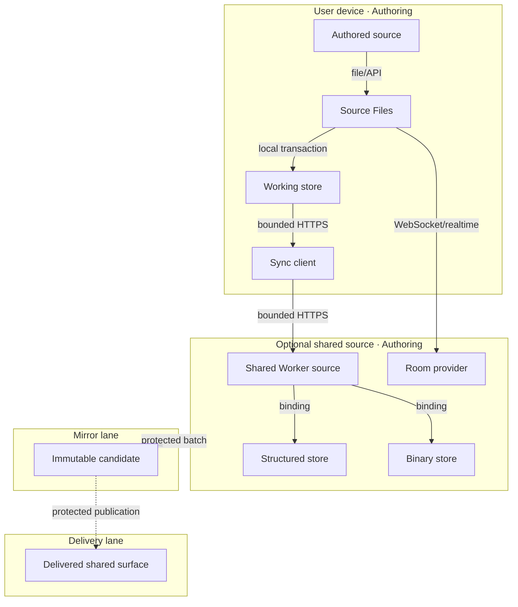

# Reference implementation: Knowgrph Storage and Synchronization

## Authority and readiness

This document owns the product and architecture contract for local working persistence and optional
shared projections. Authored Markdown remains canonical. The portable authority is Git-backed
Markdown plus YAML frontmatter; GitHub is the current protected forge, not an irreplaceable content
database. Browser records, Lark resources, shared D1 rows, R2 objects, collaboration rooms, and
generated mirrors are supporting stores with explicit roles.

The source contains working adapters, but no satisfying Evidence Reference is attached here.
Therefore local readiness is `spec-complete` and delivered readiness is `undocumented`.

## Recommended knowledge-base storage boundary

| Store or format | Decision | Minimum-value use | Forbidden authority claim |
|---|---|---|---|
| Git-backed Markdown/frontmatter | **Choose as SSOT** | Portable authoring, reviewable diffs, provenance, rollback, and agent-readable context | GitHub-specific UI or API state is not the content format. |
| Lark Suite Base + Wiki/Docs | **Integrate as collaboration projection** | Base for structured catalog/workflow fields; Wiki/Docs for navigation, discussion, and review | A Lark row, page, callback, or web-app payload cannot silently overwrite accepted source. |
| Cloudflare Pages/static Markdown | **Generate for publication** | Low-cost public read path for `airvio.co/knowgrph` from an exact accepted revision | Published bytes are not an authoring root. |
| Cloudflare D1 | **Use as rebuildable structured projection** | Search, relationship, document metadata, cursors, and runtime queries | D1 content is not canonical Source Files content. |
| Cloudflare R2 | **Use for large or content-addressed bytes** | Media, exports, snapshots, and content-addressed artifacts | Immutability applies only where an owning route proves it; object existence does not prove source acceptance or delivery readiness. |
| Cloudflare KV | **Use narrowly** | Small caches, configuration, and revision pointers | KV is not for relational authority or concurrent document edits. |
| Cloudflare Durable Objects | **Use for live coordination only when needed** | One selected per-document room, ordering, and ephemeral collaboration state | Room history does not become durable authoring authority. |
| CSV/JSON | **Use for interchange** | Bulk import/export, backups, and deterministic transforms | An exchange file is a candidate until provenance and review bind it to Git. |
| PostgreSQL/other database | **Defer** | Future workloads that prove D1/source projections insufficient | Do not add a second database before measured scale, query, or retention need. |

The recommended Lark integration is host-mediated and review-first. A Lark web app may provide the
user experience under the
[Web App API boundary](https://open.larksuite.com/document/client-docs/gadget/-web-app-api/api-overview),
while a server-owned adapter applies the [Lark Docs/Base OpenAPI](https://open.larksuite.com/document/ukTMukTMukTM/uczNzUjL3czM14yN3MTN)
scopes and user/tenant access-token permissions. The browser receives no app secret or reusable
provider credential. Start with read-only Base/Wiki/Docs discovery and supplied-snapshot import;
add outbound write-back only after idempotency, conflict, audit, rollback, deletion, and cost VCCs
are evidenced.

For the current release topology, accepted Dev source in `huijoohwee/knowgrph` generates the
`huijoohwee/content/knowgrph` mirror, which is then published to `airvio.co/knowgrph`. The mirror
and public route remain generated projections and are never authoring roots.

The proposed Lark knowledge-base integration must define one typed projection envelope that binds:

- source repository, repository-relative path, accepted Git revision, and content digest;
- projection provider, resource identifier, provider revision, schema version, and generation time;
- direction (`source-to-projection` or `projection-to-candidate`) and review state.

No current D1 row or Lark adapter is claimed to satisfy this target. Its schema, migration, and
verification owner must be admitted before remote integration work begins.

The only accepted external-edit flow is `Lark change -> immutable snapshot/event -> normalized
Markdown/frontmatter candidate -> reviewed protected merge -> regenerated Lark/Cloudflare
projections`. Concurrent providers never use last-write-wins against the source.

## Problem and personas

| Persona | Problem | First value |
|---|---|---|
| Solo author | browser refresh/offline work can lose context | save and reopen one local source |
| Multi-device author | revisions can diverge across devices | explicit push/pull result or conflict |
| Collaborator | concurrent edits can overwrite one another | one selected room provider and visible state |
| Operator | source, shared state, and delivery can be confused | exact store role, evidence, and rollback |

## Journey: Author — Save, reconnect, and reconcile

| Stage | Action | Touchpoint | Pain | Opportunity |
|---|---|---|---|---|
| Trigger | edits one source | workspace | fears loss | persist locally before transport |
| Discover | inspects save/sync state | Source Files | status can be ambiguous | expose local, queued, conflict, and failure |
| Engage | requests synchronization | sync adapter | network may fail and trust differs by adapter | bounded outbox, typed result, and explicit auth gap |
| Complete | reopens or reconciles | workspace | fears silent overwrite | retain canonical revision and conflict |
| Return | continues offline/online | local store | provider may be unavailable | local-first degraded mode |

## Requirements and VCCs

| ID | Given / When / Then | VCC: end state; stated check; constraint |
|---|---|---|
| S1 Local durability | Given a valid source edit, when saved, then a recoverable local record exists before optional transport. | End: save/reopen and fallback tests pass; Check: `npm test` exits 0; Constraint: source identity remains explicit and memory fallback is not called durable. |
| S2 Typed synchronization | Given queued mutations, when push/pull runs, then applied/conflict/rejected/deferred results are recorded with cursors. | End: storage/runtime suites pass; Check: `npm run runtime:test` exits 0; Constraint: conflict/rejection is never silently resent or overwritten. |
| S3 Source authority | Given local, shared, and mirror copies, when identities disagree, then the configured authored source and revision remain authoritative. | End: source-authority tests pass; Check: `npm test` exits 0; Constraint: no D1/browser/mirror record becomes an implicit authoring owner. |
| S4 Optional collaboration | Given concurrent editing is enabled, when a document opens, then exactly one room provider owns updates and recovery. | End: provider-specific room/replay tests pass; Check: `npm test` exits 0; Constraint: no dual-write between room providers. |
| S5 Binary separation | Given generated/uploaded bytes, when stored or replayed, then binary-route auth/overwrite behavior matches the dedicated contract. | End: media/blob suites pass; Check: named binary tests exit 0; Constraint: no entitlement, immutability, or delivery claim beyond actual handlers. |
| S6 Protected delivery | Given a shared Worker or mirror candidate, when promotion is requested, then Source→Mirror→Delivery boundaries remain closed without evidence and instruction. | End: exact candidate/live/rollback receipt exists; Check: protected workflow reports it; Constraint: the Pages release does not implicitly deploy storage Workers. |
| S7 Shared authorization | Given a shared structured route, when authorization is missing or invalid, then the request is rejected before any read or write. | End: negative auth tests pass for push, pull, and export; Check: a future named security suite exits 0; Constraint: current source has no satisfying auth enforcement, so shared delivery remains closed. |
| S8 Projection provenance | Given any Lark or Cloudflare projection, when it is read, then its accepted source revision and content digest are explicit and verifiable. | End: projection-envelope fixtures pass; Check: a future named projection suite exits 0; Constraint: provider timestamps, titles, and row IDs cannot substitute for source identity. |
| S9 External edit review | Given a Lark or interchange edit, when synchronization runs, then it produces a bounded candidate and never overwrites authored source directly. | End: candidate/conflict/idempotency fixtures pass; Check: a future named provider-adapter suite exits 0; Constraint: remote acquisition and write-back remain unimplemented and delivery-closed today. |

## Time-to-value and metrics

| Metric | Baseline | Target | Timeline |
|---|---:|---:|---|
| Local save/reopen TTV | unmeasured | ≤3 actions / ≤5 min | before baseline |
| Offline save recovery | unmeasured | 100% canonical fixtures | before baseline |
| Conflict visibility | unmeasured | 100% conflict fixtures produce explicit state | before enabling shared sync |
| Mandatory token cost | 0 by design | 0/run and $0/month | every run |
| Local cash TCO | $0 estimate | $0/month; $0/12 months | monthly |
| Shared cash TCO | unmeasured | operator-approved budget before use | before delivery |
| Local readiness rung | `spec-complete` | evidence-derived only | every revision |
| Delivered readiness rung | `undocumented` | evidence-derived only | every revision |

## ROI and scope

Score is `(impact × monthly reach) / (build hours + 12-month cash TCO/100 + risk)`.

| Tier | Capability | Estimated ROI | 12-month TCO | Scope |
|---|---|---:|---:|---|
| Must | local working store and recovery | 3.1 | $0 | minimum viable |
| Must | typed outbox/cursor/conflict | 2.2 | $0 local | minimum viable |
| Must | source-authority labels | 3.8 | $0 | minimum viable |
| Should | optional shared structured sync | 0.9 | $0–540 | evidence-gated |
| Should | one collaboration room provider | 0.6 | $120–1,200 | evidence-gated |
| Could | shared binary replay | 0.5 | $0–420 | blocked on security VCCs |
| Won't | hidden cloud authority or unbounded auto-sync | <0.1 | unbounded | excluded |

Minimum viable scope is local save/reopen, explicit memory fallback, typed outbox/cursor/conflict,
and zero-token operation. Real-time collaboration, automatic Worker delivery, and claims of
cross-device/public durability are out of scope until separately evidenced.

## Topology: Storage roles v4.1 — 2026-08-05

| Node | Role | Type | Lane | Connects to | Connection | Data residency |
|---|---|---|---|---|---|---|
| Authored source | Store | Markdown/file or configured source | Authoring | Source Files | file/API | configured source root |
| Protected Git history | Authority/Audit | Git repository; GitHub is current forge | Authoring | authored source, build jobs | commit/review | configured repository |
| Source Files | Router/Consumer | client feature | Authoring | working store, sync client | in-process events | browser memory |
| Working store | Store | IndexedDB/Dexie or explicit memory adapter | Authoring | sync client | local transaction | user device |
| Sync client | Producer/Consumer | typed client adapter | Authoring | shared Worker | bounded HTTPS | request memory |
| Shared Worker source | Gateway | Worker source | Authoring | D1/R2/room binding | in-process binding | configured service region |
| Structured store | Store | D1-compatible database | Authoring until delivered separately | Worker | binding call | configured database region |
| Binary store | Store | R2-compatible object store | Authoring until delivered separately | Worker | binding call | configured bucket region |
| Room provider | Store/Gateway | optional collaboration service | Authoring until delivered separately | Source Files | WebSocket/realtime | provider configuration |
| Lark collaboration | Producer/Consumer | optional Base + Wiki/Docs adapter | Authoring until evidenced | candidate review, projection publisher | host-mediated OpenAPI | configured tenant/region |
| Mirror | Store | immutable candidate | Mirror | Delivery | protected batch | mirror artifact store |
| Delivery | Consumer/Gateway | optional public/shared runtime | Delivery | clients | HTTPS/WebSocket | declared delivery region |

**Version note**: v4.1 preserves the v4 delivery boundary and records Git-backed Markdown as the
portable knowledge authority, with Lark, Cloudflare stores, and interchange formats assigned
non-authoritative roles. The prior long-form ADR narrative is retained as a superseded archive.

## Data flows

### Local save and reopen

| Stage | Component | Input | Output | Persistence | Error handling |
|---|---|---|---|---|---|
| Ingest | Source Files | source edit + identity | typed source revision | active source | validation error |
| Transform | storage mapper | revision | document/chunk/snapshot/outbox records | none | typed mapping error |
| Store | working store | records | committed local transaction | device; user-controlled | explicit memory fallback/failure |
| Serve | workspace | reopened record | source/projection | active session | preserve unsaved state |

### Optional synchronization

| Stage | Component | Input | Output | Persistence | Error handling |
|---|---|---|---|---|---|
| Ingest | sync client | outbox + cursor | bounded request | request-scoped | retain outbox |
| Transform | shared Worker | typed mutations/base revisions | applied/conflict/rejected/deferred | transaction-scoped | typed revision/quota result; current structured routes do not enforce auth |
| Store | structured/binary/room owner | accepted record/update | shared projection | declared retention/region | rollback/reconcile |
| Serve | reconciler | response + local state | updated cursor/conflict | local history | no silent overwrite |

### Lark collaboration candidate flow

| Stage | Component | Input | Output | Persistence | Error handling |
|---|---|---|---|---|---|
| Discover | host-owned Lark adapter | scoped Base/Wiki/Docs selection | immutable provider snapshot + revision | request/evidence store | reject missing scope, token permission, or provider revision |
| Transform | deterministic mapper | snapshot + mapping version | Markdown/frontmatter candidate + diagnostics | candidate worktree only | preserve unsupported fields; no invented repair |
| Review | protected Git workflow | candidate diff + source base | accepted revision or explicit rejection/conflict | Git history | never direct-write canonical source |
| Project | bounded publisher | accepted revision + content digest | Lark and Cloudflare projections | declared provider stores | idempotent retry; retain prior projection on failure |

## Reference implementation: Current owners and limits

| Role | Source owner | Current truth |
|---|---|---|
| Browser contract/types | `canvas/src/lib/storage/knowgrphStorageSyncContract.ts` | document/chunk/snapshot/outbox/cursor shapes |
| Route identity source | `canvas/src/lib/storage/knowgrphStorageRoutePaths.ts` | typed route constants/builders; sole runtime route owner |
| Browser database | storage-sync client modules and Dexie/IndexedDB adapter | explicit memory fallback |
| Storage Worker | `cloudflare/workers/knowgrph-storage/index.ts` | source dispatcher; separate deployment |
| Structured persistence | Worker D1 modules/migrations | optional shared projection; push, pull, and export currently dispatch without authorization |
| Binary persistence | `cloudflare/workers/knowgrph-storage/blob.ts`, `media.ts` | security/overwrite gaps documented separately |
| Collaboration | Source Files room adapters plus Durable Object source | exactly one active provider required |
| Lark configuration/import | `knowgrph-mcp/knowgrph-feishu-base-mcp-prd-tad.md`, `knowgrph-mcp/knowgrph-lark-app-mcp-prd-tad.md` | configuration and supplied-snapshot/local handoff only; no remote fetch or write-back is evidenced |
| Git/file relay | `knowgrph-storage-git-file-sync-runtime-api.md` | path-derived, authenticated source transport; provider credentials remain Worker-owned |
| Release | `.github/workflows/release.yml` | seeds documentation with Pages release; does not deploy storage Worker |

The generic blob handler currently has no auth and permits overwrite at a workspace/path key. The
run-media token checks expiry and run id but is not signed. The binary contract owns those blockers.
The structured push, pull, and export handlers also have no authorization gate; current browser
clients send content type but no credential. These routes must not be treated as safe public shared
storage until S7 is implemented and evidenced.
Optional KV support is not assumed live merely because a binding is supported.

## VCC and Evidence Reference register

| VCC | Named check | Recorded result | Surface | Derived rung |
|---|---|---|---|---|
| S1, S3 | `npm run check && npm test` | not recorded for this revision | authoring | `spec-complete` |
| S2, S4 | `npm run runtime:test` | not recorded for this revision | authoring | `spec-complete` |
| S5 | named media/blob unit tests in the binary contract | not recorded | authoring | `spec-complete` |
| S6 | exact storage Worker delivery/security/rollback check | not recorded | delivery | `undocumented` |
| S7 | negative authorization tests for structured push/pull/export | no satisfying check exists | authoring/delivery | `undocumented` |
| S8 | projection-envelope source revision/digest checks | no satisfying check exists | authoring | `spec-complete` |
| S9 | Lark candidate/conflict/idempotency checks | remote adapter is not implemented | authoring/delivery | `undocumented` |

## TCO comparison

| Model | Infra/month | Egress/month | 12-month cash | Ops burden | Default |
|---|---:|---:|---:|---|---|
| local working store | $0 | $0 | $0 | low | chosen minimum |
| managed shared structured/object/room adapters | $0–45 | $0–15 | $0–720 | medium | optional |
| Lark collaboration projection | plan-dependent/unmeasured | provider-dependent | unmeasured | low/medium | optional after demand and permission review |
| FOSS self-hosted shared stack | $15–100 | $0–25 | $180–1,500 | high | portability fallback |
| hybrid local + selected managed adapters | $0–35 | $0–15 | $0–600 | medium/high | only with measured value |

All storage/sync operations have a zero-LLM-token budget.

## Deploy Boundary Register

| Boundary | From lane | To lane | Evidence Reference | Operator instruction | Rollback statement/check | State |
|---|---|---|---|---|---|---|
| `STORAGE-SOURCE-TO-MIRROR` | Authoring | Mirror | local/security candidate result `not recorded` | `none` | discard candidate; rerun local/runtime/security checks | `closed` |
| `STORAGE-MIRROR-TO-DELIVERY` | Mirror | Delivery | exact live storage/auth/rollback result `not recorded` | `none` | restore prior Worker/config/migrations; rerun sync, conflict, auth, and read-back probes | `closed` |

## Open questions

- Which shared adapter, region, retention, and deletion policy is authorized per workspace?
- Which cryptographic authorization replaces the current unsigned run-media token?
- What clean-environment save/reopen and conflict-recovery TTV is observed?
- What document/blob limits and cost ceilings are acceptable?
- Which separately approved runbook owns Worker migration and rollback?
- Which Base schema and Wiki/Docs hierarchy give enough collaboration value without duplicating the Markdown/frontmatter model?
- Which host owns Lark tokens, event verification, snapshot retention, candidate creation, and outbound idempotency?
