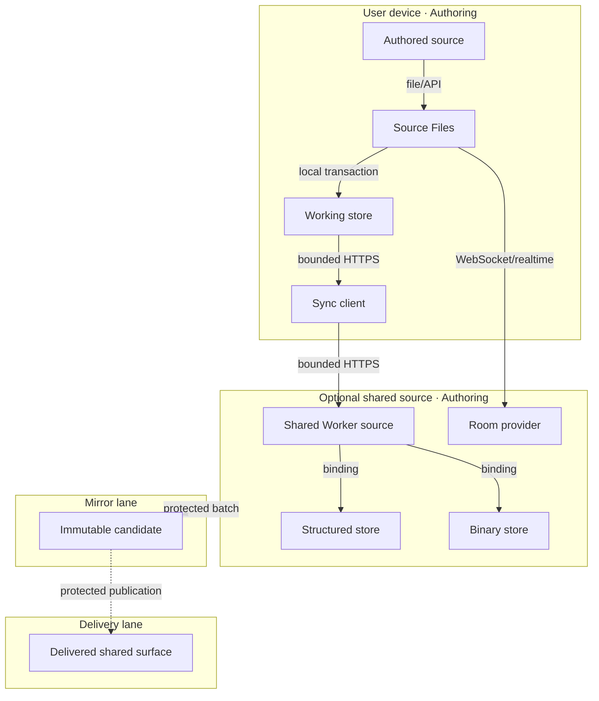

# Reference implementation: Knowgrph Storage and Synchronization

## Authority and readiness

This document owns the product and architecture contract for local working persistence and optional
shared projections. Authored Markdown remains canonical. Browser records, shared D1 rows, R2
objects, collaboration rooms, and generated mirrors are supporting stores with explicit roles.

The source contains working adapters, but no satisfying Evidence Reference is attached here.
Therefore local readiness is `spec-complete` and delivered readiness is `undocumented`.

## Problem and personas

| Persona | Problem | First value |
|---|---|---|
| Solo author | browser refresh/offline work can lose context | save and reopen one local source |
| Multi-device author | revisions can diverge across devices | explicit push/pull result or conflict |
| Collaborator | concurrent edits can overwrite one another | one selected room provider and visible state |
| Operator | source, shared state, and delivery can be confused | exact store role, evidence, and rollback |

## Journey: Author — Save, reconnect, and reconcile

| Stage | Action | Touchpoint | Pain | Opportunity |
|---|---|---|---|---|
| Trigger | edits one source | workspace | fears loss | persist locally before transport |
| Discover | inspects save/sync state | Source Files | status can be ambiguous | expose local, queued, conflict, and failure |
| Engage | requests synchronization | sync adapter | network may fail and trust differs by adapter | bounded outbox, typed result, and explicit auth gap |
| Complete | reopens or reconciles | workspace | fears silent overwrite | retain canonical revision and conflict |
| Return | continues offline/online | local store | provider may be unavailable | local-first degraded mode |

## Requirements and VCCs

| ID | Given / When / Then | VCC: end state; stated check; constraint |
|---|---|---|
| S1 Local durability | Given a valid source edit, when saved, then a recoverable local record exists before optional transport. | End: save/reopen and fallback tests pass; Check: `npm test` exits 0; Constraint: source identity remains explicit and memory fallback is not called durable. |
| S2 Typed synchronization | Given queued mutations, when push/pull runs, then applied/conflict/rejected/deferred results are recorded with cursors. | End: storage/runtime suites pass; Check: `npm run runtime:test` exits 0; Constraint: conflict/rejection is never silently resent or overwritten. |
| S3 Source authority | Given local, shared, and mirror copies, when identities disagree, then the configured authored source and revision remain authoritative. | End: source-authority tests pass; Check: `npm test` exits 0; Constraint: no D1/browser/mirror record becomes an implicit authoring owner. |
| S4 Optional collaboration | Given concurrent editing is enabled, when a document opens, then exactly one room provider owns updates and recovery. | End: provider-specific room/replay tests pass; Check: `npm test` exits 0; Constraint: no dual-write between room providers. |
| S5 Binary separation | Given generated/uploaded bytes, when stored or replayed, then binary-route auth/overwrite behavior matches the dedicated contract. | End: media/blob suites pass; Check: named binary tests exit 0; Constraint: no entitlement, immutability, or delivery claim beyond actual handlers. |
| S6 Protected delivery | Given a shared Worker or mirror candidate, when promotion is requested, then Source→Mirror→Delivery boundaries remain closed without evidence and instruction. | End: exact candidate/live/rollback receipt exists; Check: protected workflow reports it; Constraint: the Pages release does not implicitly deploy storage Workers. |
| S7 Shared authorization | Given a shared structured route, when authorization is missing or invalid, then the request is rejected before any read or write. | End: negative auth tests pass for push, pull, and export; Check: a future named security suite exits 0; Constraint: current source has no satisfying auth enforcement, so shared delivery remains closed. |

## Time-to-value and metrics

| Metric | Baseline | Target | Timeline |
|---|---:|---:|---|
| Local save/reopen TTV | unmeasured | ≤3 actions / ≤5 min | before baseline |
| Offline save recovery | unmeasured | 100% canonical fixtures | before baseline |
| Conflict visibility | unmeasured | 100% conflict fixtures produce explicit state | before enabling shared sync |
| Mandatory token cost | 0 by design | 0/run and $0/month | every run |
| Local cash TCO | $0 estimate | $0/month; $0/12 months | monthly |
| Shared cash TCO | unmeasured | operator-approved budget before use | before delivery |
| Local readiness rung | `spec-complete` | evidence-derived only | every revision |
| Delivered readiness rung | `undocumented` | evidence-derived only | every revision |

## ROI and scope

Score is `(impact × monthly reach) / (build hours + 12-month cash TCO/100 + risk)`.

| Tier | Capability | Estimated ROI | 12-month TCO | Scope |
|---|---|---:|---:|---|
| Must | local working store and recovery | 3.1 | $0 | minimum viable |
| Must | typed outbox/cursor/conflict | 2.2 | $0 local | minimum viable |
| Must | source-authority labels | 3.8 | $0 | minimum viable |
| Should | optional shared structured sync | 0.9 | $0–540 | evidence-gated |
| Should | one collaboration room provider | 0.6 | $120–1,200 | evidence-gated |
| Could | shared binary replay | 0.5 | $0–420 | blocked on security VCCs |
| Won't | hidden cloud authority or unbounded auto-sync | <0.1 | unbounded | excluded |

Minimum viable scope is local save/reopen, explicit memory fallback, typed outbox/cursor/conflict,
and zero-token operation. Real-time collaboration, automatic Worker delivery, and claims of
cross-device/public durability are out of scope until separately evidenced.

## Topology: Storage roles v4 — 2026-07-30

| Node | Role | Type | Lane | Connects to | Connection | Data residency |
|---|---|---|---|---|---|---|
| Authored source | Store | Markdown/file or configured source | Authoring | Source Files | file/API | configured source root |
| Source Files | Router/Consumer | client feature | Authoring | working store, sync client | in-process events | browser memory |
| Working store | Store | IndexedDB/Dexie or explicit memory adapter | Authoring | sync client | local transaction | user device |
| Sync client | Producer/Consumer | typed client adapter | Authoring | shared Worker | bounded HTTPS | request memory |
| Shared Worker source | Gateway | Worker source | Authoring | D1/R2/room binding | in-process binding | configured service region |
| Structured store | Store | D1-compatible database | Authoring until delivered separately | Worker | binding call | configured database region |
| Binary store | Store | R2-compatible object store | Authoring until delivered separately | Worker | binding call | configured bucket region |
| Room provider | Store/Gateway | optional collaboration service | Authoring until delivered separately | Source Files | WebSocket/realtime | provider configuration |
| Mirror | Store | immutable candidate | Mirror | Delivery | protected batch | mirror artifact store |
| Delivery | Consumer/Gateway | optional public/shared runtime | Delivery | clients | HTTPS/WebSocket | declared delivery region |

**Version note**: v4 removes direct Authoring-to-Delivery commands, provider deployment claims, and
duplicate invocation dictionaries. The prior long-form ADR narrative is retained as a superseded
archive.

## Data flows

### Local save and reopen

| Stage | Component | Input | Output | Persistence | Error handling |
|---|---|---|---|---|---|
| Ingest | Source Files | source edit + identity | typed source revision | active source | validation error |
| Transform | storage mapper | revision | document/chunk/snapshot/outbox records | none | typed mapping error |
| Store | working store | records | committed local transaction | device; user-controlled | explicit memory fallback/failure |
| Serve | workspace | reopened record | source/projection | active session | preserve unsaved state |

### Optional synchronization

| Stage | Component | Input | Output | Persistence | Error handling |
|---|---|---|---|---|---|
| Ingest | sync client | outbox + cursor | bounded request | request-scoped | retain outbox |
| Transform | shared Worker | typed mutations/base revisions | applied/conflict/rejected/deferred | transaction-scoped | typed revision/quota result; current structured routes do not enforce auth |
| Store | structured/binary/room owner | accepted record/update | shared projection | declared retention/region | rollback/reconcile |
| Serve | reconciler | response + local state | updated cursor/conflict | local history | no silent overwrite |

## Reference implementation: Current owners and limits

| Role | Source owner | Current truth |
|---|---|---|
| Browser contract/types | `canvas/src/lib/storage/knowgrphStorageSyncContract.ts` | document/chunk/snapshot/outbox/cursor shapes |
| Route identity source | `canvas/src/lib/storage/knowgrphStorageRoutePaths.ts` | typed route constants/builders; sole runtime route owner |
| Browser database | storage-sync client modules and Dexie/IndexedDB adapter | explicit memory fallback |
| Storage Worker | `cloudflare/workers/knowgrph-storage/index.ts` | source dispatcher; separate deployment |
| Structured persistence | Worker D1 modules/migrations | optional shared projection; push, pull, and export currently dispatch without authorization |
| Binary persistence | `cloudflare/workers/knowgrph-storage/blob.ts`, `media.ts` | security/overwrite gaps documented separately |
| Collaboration | Source Files room adapters plus Durable Object source | exactly one active provider required |
| Release | `.github/workflows/release.yml` | seeds documentation with Pages release; does not deploy storage Worker |

The generic blob handler currently has no auth and permits overwrite at a workspace/path key. The
run-media token checks expiry and run id but is not signed. The binary contract owns those blockers.
The structured push, pull, and export handlers also have no authorization gate; current browser
clients send content type but no credential. These routes must not be treated as safe public shared
storage until S7 is implemented and evidenced.
Optional KV support is not assumed live merely because a binding is supported.

## VCC and Evidence Reference register

| VCC | Named check | Recorded result | Surface | Derived rung |
|---|---|---|---|---|
| S1, S3 | `npm run check && npm test` | not recorded for this revision | authoring | `spec-complete` |
| S2, S4 | `npm run runtime:test` | not recorded for this revision | authoring | `spec-complete` |
| S5 | named media/blob unit tests in the binary contract | not recorded | authoring | `spec-complete` |
| S6 | exact storage Worker delivery/security/rollback check | not recorded | delivery | `undocumented` |
| S7 | negative authorization tests for structured push/pull/export | no satisfying check exists | authoring/delivery | `undocumented` |

## TCO comparison

| Model | Infra/month | Egress/month | 12-month cash | Ops burden | Default |
|---|---:|---:|---:|---|---|
| local working store | $0 | $0 | $0 | low | chosen minimum |
| managed shared structured/object/room adapters | $0–45 | $0–15 | $0–720 | medium | optional |
| FOSS self-hosted shared stack | $15–100 | $0–25 | $180–1,500 | high | portability fallback |
| hybrid local + selected managed adapters | $0–35 | $0–15 | $0–600 | medium/high | only with measured value |

All storage/sync operations have a zero-LLM-token budget.

## Deploy Boundary Register

| Boundary | From lane | To lane | Evidence Reference | Operator instruction | Rollback statement/check | State |
|---|---|---|---|---|---|---|
| `STORAGE-SOURCE-TO-MIRROR` | Authoring | Mirror | local/security candidate result `not recorded` | `none` | discard candidate; rerun local/runtime/security checks | `closed` |
| `STORAGE-MIRROR-TO-DELIVERY` | Mirror | Delivery | exact live storage/auth/rollback result `not recorded` | `none` | restore prior Worker/config/migrations; rerun sync, conflict, auth, and read-back probes | `closed` |

## Open questions

- Which shared adapter, region, retention, and deletion policy is authorized per workspace?
- Which cryptographic authorization replaces the current unsigned run-media token?
- What clean-environment save/reopen and conflict-recovery TTV is observed?
- What document/blob limits and cost ceilings are acceptable?
- Which separately approved runbook owns Worker migration and rollback?
