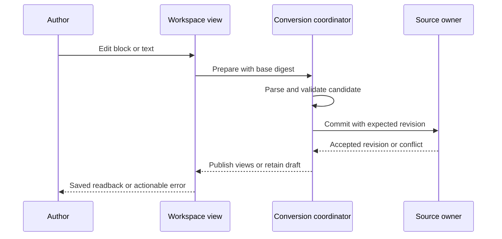
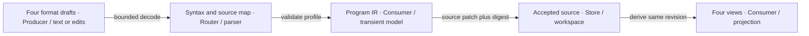
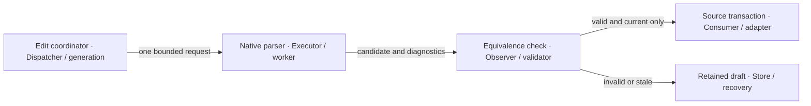
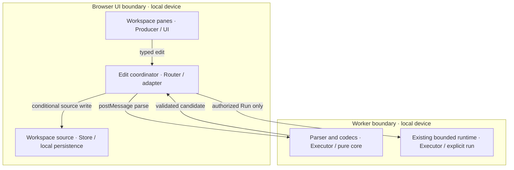
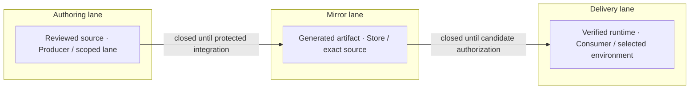

# Native Block Editor and Four-Format Workspace

## Identity, scope and source policy — reference implementation

**J1 = NATIVE-BLOCK-EDITOR-001@1.0.0.** PRD, TAD, ADR, MVP, GTM and the discovery projections below consume this exact join. This deliverable specifies an enhancement to the existing Editor Workspace. It does not implement the feature. The conservative `undocumented` ladder values mean the independent specification-baseline gate has not passed; they do not mean this proposal is absent.

Add **Block immediately to the right of Python** in the existing pane controls: **bin → Python → Block → JSON → Markdown → Viewer**, preserving any contextual HTML control. A native, headless conversion core connects all four authoring representations. There is one durable workspace document, one accepted revision and one edit transaction owner, with format-specific drafts and derived views.

**0:** native workspace and bounded Python execution owners exist; four-format editing, lossless syntax retention and buyer demand are unproven. **1:** a learner edits a supported program in each of the four views, completes a round trip, saves and reloads offline without losing source or changing behavior, within a measured five-minute session. Product acceptance, a first collected dollar and repeat demand require distinct evidence.

All new grammar, codecs, block geometry and interaction code must be authored in the native repository. No added package, remote parser, downloaded grammar, runtime service, copied implementation, copied assets or model call may be required for conversion. Existing host UI/storage dependencies remain host prerequisites; this is a zero-new-dependency feature, not a claim that the whole application has no dependencies. Conceptual inputs supply no implementation or readiness evidence and are excluded from deliverable names, links, dependencies, assets and release metadata.

Authority: [authoring guideline][guideline] v3.3.0 at source revision `987dd1d1e6d25761f2279d49a53c40a210466679`; shared [CID contract][cid], [templates][templates], [planning record][planning], [verification][verification] and [diagram contract][diagrams]. The runtime SSOT is `agentic-os/guides/SYSTEM-PROMPT-RUNTIME.md`; its former `templates/` locator is absent. START, ADLC and RELEASE remain runtime-owned; product deployment and rollback remain repository-owned. No second lifecycle controller is proposed.

## Codebase grounding and reuse — reference implementation

Inspected 2026-09-24: **Graph = `2874751715a1e1f0a12c06415141a93c894c9d90`**, **OS = `f8d00dd13242d7d83bae0276837268286b550bf0`**, guideline source as above. All paths below are Graph-relative. `W` = `canvas/src/features/markdown-workspace`; `P` = `canvas/src/features/python-learning`; `F` = `canvas/src/features/workspace-fs`. Source inspection proves only the stated code behavior; feature tests remain proposed unless the evidence register records execution.

| ID / capability owner | Inspected source and current behavior | Reuse decision / smallest delta / named check |
|---|---|---|
| G1 / pane controls | `W/MarkdownWorkspaceToolbar.tsx`: `WorkspacePaneToggle` places Python before JSON; `W/main/layout/MarkdownWorkspaceLayout.tsx` renders Python before JSON. These are pane toggles, not a separate route. | Extend-owner: insert Block in both orders; preserve multi-pane behavior. V1 pane/browser checks. |
| G2 / pane policy | `W/main/types.ts`: visibility, availability, presets and resolution; `.py` currently enables Python only and disables JSON/Markdown/Viewer. `W/main/useInitialWorkspacePaneVisibility.ts` compares explicit fields. | Extend-owner: add `block`, content-profile availability and equality; enable four views for supported program documents. Keep ordinary data/model policies. V1/V3. |
| G3 / active document | `W/main/MarkdownWorkspaceMain.tsx` lazily imports `PythonLearningPane`; `W/main/useWorkspaceDocumentState.ts` binds text/JSON projections and mutation callbacks. | Extend-owner: lazy Block pane and one conversion adapter ahead of current format branches; preserve read-only/passive behavior. V1/V4. |
| G4 / native Python grammar | `P/pythonParser.ts::parseLearningPython`, `P/pythonModel.ts`: procedural AST, precedence, bounds; imports `features/parsers/python/lexer`. Parser skips comments/blank lines, drops quote spelling and parentheses; spans have start line/column only. | Extend-owner: retain tokens/trivia/end offsets in the same parser, expose pure syntax result, keep execution AST contract. It is not currently a round-trip parser. V2/V3 plus existing Python suites. |
| G5 / runtime | `P/pythonEvaluator.ts`, `P/learningRuntime.ts::bind`, `P/learningProtocol.ts`: worker limits, source digest/generation and stale run invalidation. `PythonLearningPane.tsx` owns controls and currently binds/disposes runtime on mount lifecycle. | Reuse execution; move document binding to the common workspace lifecycle if Block can remain open without Python. Do not mount a hidden Python pane to keep execution alive. V4/V5. |
| G6 / Markdown–JSON fidelity | `W/main/jsonMarkdownEditing.ts::serializeJsonMarkdownDraftToSourceText` uses `features/markdown/jsonMarkdownSourceFidelity.ts`; `metadata.markdownSource` retains original Markdown. | Retain-local for ordinary Markdown/graph JSON. Add a versioned program codec; never reinterpret existing graph JSON as a program AST or claim existing fidelity covers program edits. V3. |
| G7 / source writes | `F/workspaceSourceTextTransaction.ts::enqueueWorkspaceSourceTextTransaction`: per-path revision check and serialized in-process writes; `F/workspaceFsPersisted.ts::writeFileText`: existing durable source write. | Extend-owner: bind draft digest/generation and write outcome; confirm readback. In-memory revision maps are not cross-tab/device compare-and-swap. V4. |
| G8 / autosave and sync | `W/workspaceAutosave.ts::shouldAutosaveWorkspaceFile` guards path and debounced text; `W/useMarkdownEditorSsotSync.ts` guards ownership and only accepts Markdown paths. | Reuse guards; program edits must enter the existing source pipeline, never call Markdown normalization on Python. Pause derived publication on invalid/conflicting drafts. V4. |
| G9 / tools | `P/learningToolContract.mjs`, `P/learningWebMcp.ts`, `features/agent-ready/webMcpToolRegistry.ts`: existing local learning inspect/control route. | Retain existing execution authority; proposed conversion tool joins the same registry only after schema/permission tests. No new registry. V6. |
| G10 / offline and checks | `canvas/vitePythonLearningOffline.mjs`, `canvas/src/__tests__/pythonLearning{,Lifecycle,Offline}.test.ts`; `workspaceSourceTextTransaction.test.ts`, `jsonMarkdownMode.test.ts`, `markdownWorkspaceAbsoluteDocumentPanes.test.ts`. | Extend existing cache closure and focused regressions for the new chunk and codecs. V1–V6; full new coverage absent. |

The separate `features/parsers/python/index.ts` is a graph-analysis entry point with an optional worker path; it is not the conversion owner. Block conversion must not transitively enter optional third-party parsing paths. The existing planning owner [offline learning specification](prd-tad-adr-mvp-gtm-offline-python-learning-workspace.md) retains lesson/execution requirements; J1 owns only the new editing/conversion seam. No cross-repository source imports, new package or duplicate persisted AST store are needed.

## PRD — customer, pain and acceptance

The initial user is a learner or occasional script author who can describe a short procedure but loses confidence at syntax errors. The buyer hypothesis is a tutor or small training operator preparing reusable local exercises; the beneficiary is the learner; the operator is the workspace maintainer. No interviewed buyer, measured re-entry cost or willingness-to-pay evidence was supplied. All pain and price claims remain **unvalidated**. User authorization establishes desired product scope, not market validation.

Journey: open an existing file → inspect its structure → modify it in a preferred view → compare representations → explicitly run, if supported → save/reopen. Friction hypotheses are lost comments, destructive conversion, duplicated edits and touch-unfriendly wiring. The hook is “change one instruction and see the same program in four views”; the close is a locally saved, recoverable source file.

| Pain / priority | Hook → break → fix → close | Reuse/build split and buyer ranking |
|---|---|---|
| P1 / unvalidated, rank 1 | Readable steps → syntax blocks progress → editable statement/value blocks → save equivalent Python. | Reuse G1–G5; build block interaction and source-preserving edits. Closest to current learning workspace. |
| P2 / unvalidated, rank 2 | Reuse an exercise → conversion loses content → preserved source plus explicit fidelity → reopen with comments intact. | Reuse G6–G8; build program adapters and invariants. Potential tutor support savings unmeasured. |
| P3 / unvalidated, rank 3 | Work across devices → competing edits overwrite → revision checks and recovery → resolve conflict deliberately. | Reuse G7/G8; add proposal fencing and cross-tab checks. Cloud collaboration is deferred. |

WTP is unknown for all three, so it cannot establish a monetary rank. Provisional order uses the user's requested outcome and proximity to built owners; re-rank after five prospect observations. No ROI score is defensible yet: **ROI = unmeasured** for each tier.

| Criterion / story and Given–When–Then | Priority / VCC: verify end state by check with constraint | TAD / ADR / evidence |
|---|---|---|
| R1: As an author I want Block beside Python. Given the existing workspace, when I open Block, then it appears immediately right of Python and edits the same document. | Must / V1: DOM-order and browser checks show the exact pane order, shared file identity, keyboard/touch operation and retained pane choice after reopen. No second workspace or inspector. | G1–G3 / A1 / planned |
| R2: As a learner I want valid connected steps. Given a supported program, when I insert/move/delete/edit a block, then Python remains syntactically valid and the intended structure survives. | Must / V2: grammar and structural edit checks pass for every supported node kind, scope, precedence, holes and rejected connection; no execution on edit. | G4/G5 / A2 / planned |
| R3: As a tutor I want reversible representations. Given a supported document, when I edit any of Block/Python/JSON/Markdown and return, then normalized meaning agrees and untouched source survives. | Must / V3: all 12 directed pairs and four cyclic starts pass semantic/byte invariants, save/reopen and source-map checks; unsupported input is preserved visibly. | G4/G6 / A2/A3 / planned |
| R4: As an author I want my draft protected. Given invalid input, a late worker, file switch, failed save or concurrent edit, when sync completes, then it cannot overwrite a newer source or falsely show Saved. | Must / V4: adversarial transaction tests and two-tab browser checks prove rejection/recovery, one logical undo and no source loss. | G3/G7/G8 / A4 / planned |
| R5: As a mobile learner I want local use. Given verified offline cache, when disconnected, then editing, conversion, save/reopen and explicit bounded run work on the tested device. | Must / V5: airplane-mode browser test, keyboard-only and screen-reader review, 320 px layout and measured caps pass; zero new dependencies/model/network requests. | G5/G10 / A1/A5 / planned |
| R6: As an integrator I want the same checked conversion. Given a registered local tool and explicit edit permission, when a proposal is applied, then it uses the same contract and returns a revision-bound receipt. | Should / V6: registry discovery, read-only default, prepare/apply and stale-authority tests; unsupported remote routes fail explicitly. | G9 / A4 / deferred after Must slice |

**Should:** reversible file exports, inspect/prepare/apply tool adapter, source-to-block selection. **Could:** palette search and top-level function templates after usage evidence. **Won't (this increment):** arbitrary Python parity, new language packages, arbitrary JSON-to-code inference, prose-to-program generation, concurrent offline device merging, plugins, cloud execution, a new renderer framework, automatic payments or new payment infrastructure.

| Success metric | Baseline | Target / observation window |
|---|---|---|
| TTV steps / elapsed | Unmeasured; manual editing exists | ≤5 actions to first block edit and ≤5 minutes for four-view save/reopen; first five pilot sessions |
| Round-trip correctness | Not implemented | 100% of declared supported fixtures; zero silent losses in every failure fixture; each release |
| Edit latency / memory | Unmeasured | At 200 visible blocks: p95 conversion ≤150 ms desktop, ≤300 ms test phone; ≤32 MiB added heap; profile 30 edits/device |
| Recovery | No four-view evidence | 100% stale/invalid/failed-write fixtures retain recoverable draft and source; release gate |
| Token and serving spend | No feature serving path | 0 model tokens and $0 incremental serving spend per month in the local MVP; no overages |
| Readiness | undocumented / undocumented | spec-complete after alignment; dev-proven only after V1–V5; production separately |

## TAD — native document and conversion contract

**T1: ownership.** Persist the selected file through the existing workspace source owner. The canonical accepted snapshot is `{workspaceId, documentId, sourceFormat, sourceText, sourceDigest, revision}`. A derived `ProgramDocument` contains syntax, normalized program IR, stable edit IDs, source maps and diagnostics for that exact revision. It is a disposable cache, not a second durable SSOT. Each format can hold an invalid draft, but only one validated proposal may become the next accepted snapshot. A native `.py` file stays `.py` when switching views; export is an explicit Save As operation.

**T2: profiles and admission.** File extension can select the initial view; conversion eligibility comes from parsed content, explicit program binding and versioned schema. Existing non-program JSON/Markdown stays on G6. Opening a generic document shows Block with an explanation and an explicit program/fence selection action; it never converts tables, prose or graph nodes into executable statements. If several Python fences exist, require a selected region; no silent first-fence rule. Nested or unclosed fences fail admission.

**T3: grammar owner.** Evolve G4's handwritten lexer and recursive expression/statement parser; retain its entry point for existing execution callers. Capture a concrete syntax stream including comments, whitespace, blank lines, indentation, delimiters, quote spelling, parentheses, line endings and final newline. Build IR from that stream once. Use full bounded reparse in a worker first; add incremental invalidation only after measured need and identical full-parse results. Do not create a second Python grammar in a block package.

| Supported language profile v1 | Exact scope / invariant |
|---|---|
| Values and expressions | Existing ASCII identifiers, bounded integers, finite floats, quoted strings, `True`, `False`, `None`; names, positional calls, unary `+ - not`, binary `+ - * / // % and or`, comparisons `== != < <= > >=`, parentheses. Preserve comparison chains and short-circuit semantics. |
| Statements and scope | Assignment to one name; expression statements; `if/elif/else`; `while`; `for`; top-level `def` with positional parameters; `return`, `break`, `continue`, `pass`. Existing parser and runtime restrictions remain authoritative. |
| Runtime calls | Existing allowlisted built-ins and optional lesson calls; a syntactically representable call is not execution permission. Undefined names can be edited but yield diagnostics and cannot gain runtime authority. |
| Unsupported | Imports, classes, attributes/subscripts, containers/comprehensions, annotations, decorators, async, exceptions, generators, augmented assignment, exponentiation, multiline/triple-quoted strings and other unrecognized constructs remain source text. No approximation. |
| Bounds inherited from G4 | 32,768 UTF-8 source bytes; 4,096 AST nodes; depth 32; 16 parameters and 32 call arguments. Execution separately retains 50,000 steps and five seconds active compute. |

The native parser's acceptance alone is insufficient: V2 must verify semantics for accepted inputs and reject any existing edge-case mismatch before labeling it convertible. Empty statement suites use a real `pass` node only on an explicit structural edit; expression holes are draft diagnostics, never implicit zero/empty strings. Inserting or moving `return`, loop exits or definitions rechecks scope; expression sockets reject statement nodes and ancestry cycles.

**T4: JSON.** Introduce a native, versioned `workspace-program/v1` envelope distinct from graph JSON. The normative fields are `schema`, `languageProfile`, `program` and optional `fidelity`. Program nodes have stable IDs, declared kinds and ordered children; no executable strings, prototypes or arbitrary host objects. Encode integer literals as tagged decimal strings, finite floats as tagged round-trippable decimal lexemes, booleans/null as distinct kinds, and strings with Unicode-safe JSON escaping. Never pass runtime `bigint` or callables directly to `JSON.stringify`. Reject duplicate keys, duplicate IDs, unknown versions/kinds, invalid references, cycles, nonfinite numeric values, invalid scalar encodings and excessive size/depth before commit.

`fidelity` contains original source, source format, grammar revision, node spans and semantic digest. It is untrusted: parse it and prove equality with `program` before restoring exact bytes. When JSON changes only `program`, compute a supported tree edit against the accepted snapshot, patch the retained source and rebuild fidelity. If both program and fidelity source change incompatibly, reject as ambiguous; never pick one by timestamp. Unknown optional extension data may be retained only under a size-bounded `extensions` namespace with no semantic authority.

**T5: Markdown.** The program document profile uses ordinary prose plus a selected fenced `python` region. New exports mark a single owned region with adjacent `<!-- workspace-program:v1 id=... -->`; existing documents require explicit fence selection before binding. Preserve frontmatter, prose, unrelated fences, indentation and line endings outside the selected region. Fence scanning is native, delimiter-aware and bounded; choose a delimiter longer than any matching run inside exported code. JSON can carry exact original Markdown in validated fidelity. Program edits patch only that region. Removing/duplicating a marker, adding a conflicting region or crossing a fence boundary suspends sync rather than rewriting the document.

Plain `.py` exported through Markdown and returned as plain `.py` can retain program bytes, but plain Python cannot carry arbitrary surrounding prose or block layout. **Lossless bundle export** retains the fidelity envelope; **plain source export** explicitly lists excluded metadata/prose before the user chooses it. A filename or language label never proves equivalence.

Minimal cross-format fixture (proposed schema example): Python `count = 2\nprint(count)\n` corresponds to Block **set count to 2 → print count** and the following program JSON. The Markdown projection places the exact Python text inside the explicitly bound Python fence; expected run output is `2\n`. Comments and noncanonical spacing are added to the independent fidelity fixture, not inferred from this normalized example.

```json
{
  "schema": "workspace-program/v1",
  "languageProfile": "procedural-python/v1",
  "program": {"id": "p1", "kind": "module", "body": [
    {"id": "s1", "kind": "assign", "name": "count", "value":
      {"id": "e1", "kind": "literal", "value": {"kind": "integer", "decimal": "2"}}},
    {"id": "s2", "kind": "expression", "value":
      {"id": "e2", "kind": "call", "name": "print", "args": [{"id": "e3", "kind": "name", "name": "count"}]}}
  ]}
}
```

**T6: Block.** Render semantic statement stacks and nested expression sockets from IR using host UI primitives and native DOM/CSS/SVG. Stable IDs identify edits independently of screen position. Layout/selection/collapse are local view preferences, not program semantics. Use native pointer events with pointer capture/cancel, a keyboard insert/move/delete path and a touch “select → insert before/after/inside” path; dragging is optional. A linear accessible tree exposes node kind, value, parent and valid insertion targets. Reuse typography/theme tokens and existing pane resizing. No second Canvas, global inspector or renderer store.

**T7: losslessness contract.** Let `P` parse accepted source, `E_f` encode format f, `D_f` decode it, and `N` erase trivia, spans and view-only IDs while retaining ordered semantics and numeric kinds. For the supported profile: `N(D_f(E_f(IR))) = N(IR)` for each format, and `N(D_b(E_b(D_a(E_a(IR))))) = N(IR)` for every distinct a,b. No-op projection/reopen returns original bytes; untouched source intervals remain identical after a localized edit. Generated/new regions use deterministic spacing and precedence-safe parentheses. Pretty-printing is explicit and separately undoable.

| Conversion pair, both directions | Editable meaning | Fidelity and refusal rule |
|---|---|---|
| Block ↔ Python | Each v1 statement/expression maps to native syntax/IR. | Patch smallest safely mapped syntax region; preserve exterior bytes. No mapping or overlapping spans → refuse mutation. |
| Block ↔ JSON | Block tree ↔ validated program nodes. | Preserve node identity and validated fidelity; never treat graph JSON as program JSON. |
| Block ↔ Markdown | Block tree ↔ selected Python fence. | Surrounding Markdown remains byte-identical; missing/ambiguous binding → stop sync. |
| Python ↔ JSON | Native source ↔ tagged program plus fidelity. | Preserve numeric precision, comments and source spelling; contradictory fidelity → reject. |
| Python ↔ Markdown | Native source ↔ selected fence/program document. | Exact source payload retained; prose only survives through Markdown or bundle fidelity. |
| JSON ↔ Markdown | Program envelope ↔ selected fence with retained document source. | Shared IR validator; no pairwise converter or inference from arbitrary prose/objects. |

**Unsupported/invalid source:** keep the entire original document as one read-only source block for MVP; display line/range diagnostics and a direct return-to-source action. JSON/Markdown preservation exports can wrap raw source without claiming an editable semantic translation. Do not partially reinterpret unknown regions, execute opaque content or replace it with empty blocks. Valid text correction triggers a fresh parse. Over-limit input stays editable in its existing text view, with Block conversion unavailable. This fallback is preservation, not full-language parity.

Source-map offsets are half-open UTF-16 indices into the exact JS source string; line/column are 1-based display values, with a line-ending-aware index. UTF-8 bytes are measured separately for caps and digests. No-op IDs remain stable. Moved nodes retain IDs; imported source edits reuse IDs only when span reconciliation is unambiguous, otherwise assign fresh IDs. Identical subtrees must not collide through content-hash identity. Comments attach to concrete source intervals; ambiguous comment movement requires a preview or refusal, never silent reassignment.

## TAD — transactions, execution and failure recovery

**T8: protocol.** All four views call one `prepareEdit`/`commitEdit` adapter. A proposal binds `{workspaceId, documentId, baseRevision, baseSourceDigest, requestId, generation, origin, targetFormat, edits}`. Preparation parses, validates limits/scope, derives source patches, reparses the candidate and proves the round-trip invariants before presenting a diff. Commit rechecks the live document and draft digest, read-only authority and generation; enqueue once through G7 and verify persistence readback. `requestId` deduplicates retransmission; same ID with different bytes is an error. No view-to-view subscription writes another view's output back as user input.

Text edits debounce at most 150 ms after composition ends; never publish incomplete IME composition. A file change, close, newer draft or cancellation invalidates queued results. Keep the last valid block view visibly stale while invalid text remains editable; disable block mutation/run until resolved. A failed save retains the draft, shows Unsaved and allows retry/export. One accepted user action is one logical undo transaction across views; undo/redo creates a new monotonic revision rather than resurrecting an old revision number.

G7's in-process queue alone cannot protect cross-tab/device writes. Extend the existing workspace storage mutation boundary with expected persisted digest/revision inside its atomic update, rather than adding another database. Where a backend cannot provide that conditional write, allow only a verified single writer and return `conflict` on external change; disable multi-writer apply. Notifications alone are not a lock. Multi-device offline branches use explicit export/import plus conflict review in MVP; automatic merging remains deferred.

**T9: execution.** Parse/conversion/preview never executes Python, evaluates JSON, runs Markdown content, accesses file/network APIs or loads remote grammars. Explicit Run/Step delegates only accepted supported source to G5. A source change cancels/stales an existing run and old generation messages cannot update the current document. Common document ownership must outlive individual pane mounting; switching from Python to Block must not leave a hidden stale runtime or destroy source. Conversion diagnostics and execution diagnostics are separate.

| Failure / trust boundary | Required result and recovery | Check |
|---|---|---|
| Malformed syntax/schema, malicious keys or deep tree | Reject proposal, retain raw source, capped diagnostic; plain text rendering | V2/V3 |
| Unsupported source or ambiguous fence/fidelity | Preserve whole source; mark conversion unavailable; correct text/select region explicitly | V3 |
| Late parse, file rename/delete/switch, duplicate commit | Bind identity and generation; reject stale effect; no recreation of deleted source | V4 |
| Cross-tab conflict or disconnected remote source | Compare persisted version; preserve both drafts for review; no last-write-wins | V4 |
| Quota, denied storage, worker crash/timeout | Keep Unsaved draft; export recovery; one user-triggered retry, no background retry loop | V4/V5 |
| Runtime overrun or hidden/pagehide transition | Existing worker cancellation and stale identity rules; editing remains recoverable | V5 |

Data stays in the existing local workspace; no telemetry leaves the device by default. History follows existing user retention/deletion controls; exported bundles may contain comments/prose and must display included content. Existing sync operates only under its current permission; activating Block grants none. Reject unsafe import sizes before allocating large syntax trees, render strings as text, and retain no secrets in diagnostic summaries.

## TAD — five flows and topology — reference implementation

All diagrams are J1 version 1, 2026-09-24. The five flowcharts target the frontmatter-declared primary surface; BE-W1 is a sequence illustration for document rendering, not a node-link projection claim. Node/edge IDs are authored by the notation. The tables supply inventories and journey joins; rendering is not runtime evidence.

**Diagram BE-J1** · Class: Journey stage map · Notation: flowchart LR · Version: 1. A learner changes and recovers one program.


| Stage inventory | Emotion/friction hypothesis | Criteria and topology |
|---|---|---|
| j_open → j_edit | Curious; syntax and touch precision impede change | R1/R2; UI and parser |
| j_verify → j_reuse | Unsure about loss; reassured only by visible diff/readback | R3/R4/R5; validator and storage |

**Diagram BE-W1** · Class: User workflow · Notation: sequenceDiagram · Version: 1. One edit is conditionally committed.



| Actor inventory / path | Postcondition |
|---|---|
| U Actor, V Adapter, C Validator, S Store / happy | All visible views bind the same accepted revision; save status requires readback. |
| Alternate: text temporarily invalid | C retains last valid projection; V retains current draft and diagnostic. |
| Error: S rejects expected revision | C publishes no accepted projection; U sees recoverable conflict. |

**Diagram BE-D1** · Class: Data flow · Notation: flowchart LR · Version: 1. Every representation enters one semantic path.



| Inventory / journey | Contract |
|---|---|
| d_input, d_syntax / j_edit | Raw text or typed block patch; limits before decode; original bytes retained. |
| d_ir, d_commit, d_views / j_verify–j_reuse | Valid IR → fenced commit → derived views; no direct view-to-view writes. |

**Diagram BE-H1** · Class: Orchestration / harness flow · Notation: flowchart LR · Version: 1. Deterministic harness; no AI pipeline or model calls.



| Inventory / journey | Bound and circuit breaker |
|---|---|
| h_dispatch, h_parse / j_edit | One in-flight request/document; superseded work cancels; ≤1 s hard worker deadline. |
| h_check, h_apply, h_retain / j_verify | No automatic repair/retry; one candidate validation, reject on mismatch; tokens = 0. |

**Diagram BE-T1** · Class: Runtime topology · Notation: flowchart TB · Version: 1. Local trust boundaries and residency.



| Node inventory | Lane / connection / data residency |
|---|---|
| t_ui, t_coordinator, t_store | Runtime consumers of a delivered candidate; sync edits and async persistence; same device. |
| t_core, t_run | Separate worker responsibilities; versioned message contracts; same device; no network dependency. |

Build dependencies are acyclic: syntax/types → program codecs/validation → workspace adapter → pane/tool consumers. The existing evaluator consumes the same syntax owner through its preserved API. Runtime request/reply edges do not imply circular module imports. New pure modules must not import UI, storage, transport or effect authority. Keep the feature local; shared extraction requires two concrete consumers and a later ADR.

## TAD — invocation, ecosystem and delivery boundaries — reference implementation

| Capability / route | Current support / authority | Proposed change / check |
|---|---|---|
| Workspace UI / Block control | Absent; existing file read-only/passive rules apply | T6/T8 through same source owner; V1–V5 |
| Headless core / parse, encode, prepare | New pure functions; zero tokens/network/effects | Same schema and limits as UI; V2/V3 |
| Local learning / `/python.learning @canvas #learning` | Existing inspect/control tools `agentic-graph.inspect_local_python_learning` and `agentic-graph.control_local_python_learning`; bound to current document/run | Keep identifiers/authority; accepted program source only; V5 |
| Conversion / `/workspace.block @canvas #program` | Proposed, unregistered; must report unsupported today | One future schema/handler in G9, with inspect/prepare/apply operations; V6 |
| Browser tool / `agentic-graph.workspace_block` | Proposed WebMCP identity, not callable evidence | Read/prepare zero tokens; apply requires explicit capability, document/revision and receipt; V6 |
| Remote HTTP/MCP or other devices | No new endpoint in MVP | Defer transport until native registration, authentication and parity checks; no permissive fallback |

The register above is the only J1 route declaration; catalog updates occur in the route owner in a later admitted implementation scope. Developer path: discover declared version → rehearse fixtures locally → inspect → prepare diff → authorized apply → consume revision/diagnostic event → reconcile rejected writes → export recovery → retire only with migration/readback checks. Discovery is not authorization.

| Participant / value exchange | Owner/interface and trust boundary | Evidence/gap and cost/exit |
|---|---|---|
| Learner/user / understandable edits | G1–G5, local file permission | Source owners exist; usability unmeasured; local export and deletion. |
| Tutor/buyer / reusable exercise and less support | G6–G8; optional paid preparation service | Demand unvalidated; no personal data collection required; editable source handoff. |
| Maintainer/developer / bounded extension | G1–G10, versioned source contracts | No new supplier/license; dependency audit needed before implementation release. |
| Agent / inspect or prepare bounded change | G9; read-only default, separate apply authority | New route unsupported; zero serving tokens; no network required. |
| Assurance/operator / verify and recover | V1–V6 and source receipts | Independent checks required; no claim of legal certification. |

**Diagram BE-L1** · Class: Lane & deploy boundary · Notation: flowchart LR · Version: 1. Source and runtime effects remain separate.



| Boundary / inventory | Trigger and actor | Mechanism / required evidence | State and recovery |
|---|---|---|---|
| Authoring → integrated source / l_spec | Scoped source release by release owner | OS RELEASE plus repository Integration Gate; exact candidate/check/merge receipts | Not established by this specification; source revert through owner. |
| Source → mirror / l_artifact | Product release owner after integration | Existing build/sync controllers and exact source/artifact identity; no hand-edited mirror | Closed; retain predecessor artifact. |
| Mirror → delivery / l_runtime | Candidate-specific human production authorization | `.github/workflows/release.yml`, [core release](../production-core-runtime-release.md), live readback and [rollback baseline](../production-rollback-baseline.md) | Closed; no deployment authority in this task. Exact retained predecessor plus authorized rollback/readback. |

Human gate: production environment authorization only when pursuing production; no additional approval is required for this authorized document. Hosting and edge variants remain deferred; free hosting is not a FOSS claim. Browser/local conversion costs $0 incremental provider spend, while existing hardware, electricity, labor and support remain real but unmeasured TCO. Any future edge variant requires a separate free-only quota/license/account check and stops at exhaustion, never paid overflow.

## ADR — material decisions

All decisions consume J1 PRD and TAD, dated 2026-09-24; proposed for implementation, with bounded source evidence G1–G10. Hard constraints: native conversion, source preservation, existing workspace ownership, local/offline operation and zero new dependency/spend. Selection took one design pass; at most three alignment cycles, 30 active minutes and 8,000 planning tokens per revisit. An unresolved contested decision remains open for independent evaluation.

| ID | Decision, candidates and non-compensatory comparison | Consequence / recovery / revisit |
|---|---|---|
| A1 | Extend existing pane policy/layout (pass) outranks standalone editor (fail duplicate-owner). Native DOM/CSS/SVG (pass) selected; added UI library (fail no-new-dependency). | More host integration work; lazy mount and reuse tokens. Disable Block while preserving source if UI regresses. Revisit only with measured unmet accessibility/performance requirement. |
| A2 | Extend G4 parser with concrete syntax (pass) outranks second handwritten parser (fail duplicate grammar). AST-only regeneration fails byte preservation; broad external parser fails native constraint. | Lexer/trivia work and compatibility tests are necessary. Retain old execution API; rollback source adapters, never discard authored files. Incremental parser work waits for latency evidence. |
| A3 | One source plus derived IR and fidelity envelope (pass) outranks six pairwise converters (fail drift/single owner) and four durable copies (fail source authority). | Program JSON differs from existing graph JSON. Plain source cannot preserve all document/view metadata; export must name that boundary. Unknown versions remain raw, not auto-migrated. |
| A4 | Revision-bound proposals with conditional persistence (pass) outrank last-write-wins (fail race safety). Whole-document opaque fallback (pass) selected over partial unknown-syntax edits (fail proof in MVP). | Conflicts require explicit resolution; supported scope is narrower than arbitrary Python. Revisit regional opaque edits only with losslessness and scope proofs. |
| A5 | Local deterministic codecs plus existing explicit runtime (pass) outrank hosted/model translation (fail native/offline/spend). | No AI interpretation of prose. First-load offline needs verified installed cache; otherwise disclose unavailable. Roll back feature chunk using retained candidate, not user storage. |
| A6 | Tutor preparation pilot (pass local/manual constraints) is provisionally nearer a first dollar than hosted subscriptions (fail MVP no-new-service) or marketplace sales (defer distribution evidence). | Price/channel WTP unknown; no payment action authorized here. Revisit after five buyer conversations; stop commercial expansion absent demonstrated need. |

There is no claimed numerical winner where evidence is incomparable: willingness to pay across segments and native full-reparse versus incremental performance remain unknown. A failed hard constraint cannot be compensated by a better score elsewhere.

## MVP — bounded delivery and verification plan

The MVP is R1–R5 for the declared procedural profile, not general-language parity. Existing Python lessons supply a reusable explicit-run surface; the feature adds a statement/expression editor, syntax fidelity, two program codecs and one transaction adapter. The first fixture is an original short assignment/conditional/loop program with comments; subsequent fixtures cover every node kind, numeric edge and failure branch. No implementation is recorded in this authoring task.

| Phase / ranked pain | Owner / reuse and smallest delta | Prerequisite / exit | Active estimate and hard caps / stop |
|---|---|---|---|
| S0 / P1–P3 proposal | Product engineer; G1–G10 → J1 | Authorized document → reviewed draft/check record | 20–30 min initial estimate; 45 min cap; refreshed artifact cap 64 kB for the required five roles/coverage; 1 Markdown file <600 lines; 0 runtime modules; 1 checkout; 0 serving tokens/$0 new spend. |
| S1 / P2 losslessness | Parser owner; G4/G6 → source spans, codecs, fixtures | J1 baseline and implementation grant → V2/V3 | Estimate 2–3 working days; cap 24 active hours, 8 new modules/80 kB source, 60k agent tokens; stop on unsupported semantic mismatch. |
| S2 / P1 visible editing | Workspace owner; G1–G3/G5 → lazy Block pane, shared binding | S1 → V1 and one four-view save | Estimate 1–2 days; cap 16 hours, 4 new modules/40 kB source, 40k agent tokens; no dependency additions. |
| S3 / P3 recovery/offline | Storage/validation owner; G7/G8/G10 → conditional write, recovery and cache closure | S2 → V4/V5 and R1–R5 acceptance | Estimate 1–2 days; cap 16 hours, 4 new test/support modules/50 kB source, 40k agent tokens; stop on lost bytes/stale commit. |
| S4 / payer learning | Product owner; existing workspace demo and manual offer | V1–V5 plus reachable consenting prospects → measured pilot | ≤5 sessions, ≤4 operator hours, no ad spend; calendar/payment waits have no ETA; recheck on prospect reply/receipt. |

Every implementation file remains <600 lines; every emitted chunk <500 kB. Feature target: ≤120 kB added minified conversion/UI code, ≤40 kB gzip, and ≤2 kB gzip added to the initial shell. Envelopes ≤256 KiB; source remains ≤32 KiB; ≤4,096 nodes; ≤200 mounted blocks with windowing for larger programs. New lazy module count ≤12 production modules across S1–S3; per-phase estimates must be reduced if the aggregate cap would be exceeded. Benchmark drift requires replan, not silently larger limits. No new always-load guidance.

| VCC / invocable check plan | Cases and independent oracle | Evidence now |
|---|---|---|
| V1 / extend `markdownWorkspaceAbsoluteDocumentPanes.test.ts` plus browser smoke | Exact Python–Block adjacency; initial/persisted/split states; unrelated `.json`, Markdown, model files; desktop/mobile keyboard and touch | Proposed; no execution claim |
| V2 / proposed `blockEditorSyntax.test.ts` with existing `pythonLearning.test.ts` | Every node/operator; comments/CRLF/Unicode; integer precision, negative floats, precedence, comparison chains, short circuit; scope/hole/type rejection. Golden trees and expected source bytes authored independently of codec. | Proposed |
| V3 / proposed `blockEditorRoundTrip.test.ts` | 12 directed pairs, four cyclic starts; no-op byte equality; changed-region/exterior preservation; duplicate JSON keys; conflicting fidelity; multiple fences; unsupported and limit boundaries. Deterministic generated corpus supplements golden fixtures. | Proposed |
| V4 / extend `workspaceSourceTextTransaction.test.ts` and proposed browser cases | Reverse worker completion; same request replay; file switch/delete; failed/quota write/readback; two tabs on same base; undo/redo; IME draft; stale export. Barrier-controlled storage checks, not just parser mocks. | Proposed |
| V5 / extend Python lifecycle/offline tests and browser runner | Edit never runs; explicit run shares digest; close Python with Block open; cancellation; fresh offline reload, failed cache closure, cold offline disclosure; heap/chunk/latency and accessibility checks | Proposed |
| V6 / existing tool registry suite plus new contract cases | Read-only discovery, schema/version/bounds, explicit effect permission, prepare/apply digest, unsupported transport | Deferred |

Existing focused command for G4/G5 compatibility: `env TSX_TSCONFIG_PATH=canvas/tsconfig.json node --import tsx --test canvas/src/__tests__/pythonLearning.test.ts canvas/src/__tests__/pythonLearningLifecycle.test.ts canvas/src/__tests__/pythonLearningOffline.test.ts`. Register new checks in the repository-owned affected map before claiming V1–V6. Use `npm run ci:affected` and the native validation owner for final selection. Passing parse/round-trip tests alone does not prove Python semantics: add explicit expected runtime outputs and a local standard interpreter comparison for the shared pure subset when available; exclude lesson host calls. Do not require an interpreter download or executing untrusted imports.

| Demo beat | Time cap | Observable action / criterion |
|---|---|---|
| Hook | 20 s | Open original short exercise; show Python and adjacent Block, R1. |
| Probe | 40 s | Change a loop bound and connect a comparison through keyboard/touch, R2. |
| Reveal | 60 s | Follow Block → Python → JSON → Markdown → Block; compare preserved comments and expected structure, V3. |
| Edit and recover | 100 s | Make invalid text, retain draft, fix it; reject a stale edit; explicitly run; R4/R5. |
| Close | 80 s | Save, disconnect and reopen same source; show readback, included export content and limits; R3/R5. |

Total ≤300 s. Every Must criterion appears in the demo; the demo does not substitute for its fixtures. Domain object = a revision-bound program document. Four maturity criteria (core functionality, theme alignment, technical integration, useful agentic experience) remain **unassessed** for this feature; no contiguous 1–5 level is claimed. Blocking owners are the pane, syntax, transaction and verification owners respectively; next assessment follows V1–V5.

## GTM — payer experiment and discovery projections

J1's initial segment is English-speaking independent tutors/training operators already willing to use a browser-local exercise; geography is unspecified and must be recorded during outreach. Why now is a source-grounded opportunity: the native learning runtime and Editor Workspace already exist. Market timing, demand and economic savings are hypotheses, not research findings.

| First-dollar rank / stream | Offer hypothesis and prerequisites | Evidence / continue–pivot–stop |
|---|---|---|
| 1 / manual exercise preparation | Prepare and hand over one editable offline exercise; test a **US$1-equivalent** optional pilot price after free demonstration. No new subscription or payment integration. | Mechanism-proven: no; demand-validated: no; recognized revenue: unverified; collected cash: unverified. Record consent, agreed currency/price, lawful existing collection route and fulfillment separately. |
| 2 / reusable exercise pack | Several original exercises with source/fidelity exports; only after rank-1 acceptance and repeat requests. | Deferred; require ≥2 repeat-use requests and support-time evidence. |
| 3 / team/hosted service | Collaboration or hosting offer | Won't this increment; native MVP and free-only supplier constraints do not establish viable service economics. |

Pilot funnel: five consenting prospects → timed demonstration → independently completed edit/save → optional priced offer → verified collection → accepted source handoff → seven-day reuse check. **Continue** if ≥3/5 complete without assistance and ≥1 accepts and pays the explicit offer; **pivot** interaction if ≥2/5 cannot finish; **stop paid expansion** after five sessions with no priced acceptance or any unresolved data loss. Tiny samples guide the next experiment, not demand-proven scale. No outreach or payment is sent by this task.

Acquisition is existing direct contacts, conditional on reachability; no contact list is evidenced. Alternatives are manual source editing, duplicated files and doing nothing. Support uses recoverable source exports and bounded diagnostic summaries, never full student content by default. One operator handles the pilot; hiring/automation triggers only after measured recurring support exceeds four hours/week. IP owner reviews original code/exercises and existing license notices; entity, jurisdiction, tax, refund/consumer obligations and child-data consent remain research gaps owned by the commercial operator before any real sale/data collection.

| Assumption / source and disposition, 2026-09-24 | Model input and next evidence |
|---|---|
| F1 / user-requested local/free constraint, design target | Incremental provider/token serving cost = $0 with no network/model path; verify V5. Existing device/electricity cost unknown. |
| F2 / pilot hypothesis, unvalidated | Price p = US$1-equivalent; reachable buyers n unknown; conversion c unknown; fulfillment/support minutes h unknown. Record quoted currency and actual collection, never assume fees zero. |
| F3 / execution-resource gap | Labor rate w, authoring token usage/cost and implementation cost unknown; collect existing execution receipts and actual operator time. |
| F4 / discovery market gap | Bottom-up SAM = reachable tutors × relevant exercises/year × accepted price; independent top-down method = published regional tutor/training count × relevant-use share × annual spend. Inputs and citations absent; no numeric TAM/SAM/SOM claim. |

Reduced financial sketch, **incomplete and not audience-ready**: forecast fulfilled sales q = n×c; earned revenue = q×p only after the applicable fulfillment/accounting basis; collections are separate actual receipts. Contribution = earned revenue − payment fees − h×w − serving cost. Cash end = opening cash + collections − paid costs; receivables end = opening receivables + earned revenue − collections; equity changes by recognized profit and contributions; cash/receivables/liabilities/equity must reconcile. Base/downside/upside vary n,c,h and collection delay, but no numbers or runway are invented without opening cash and cost inputs. Cash floor = $0 incremental provider budget; stop before any paid supplier effect. Bootstrap from existing local resources; funding ask = none; capitalization/dilution = not applicable for this increment.

Discovery projections at J1: **Pitch Deck** (five-slide register, 3-minute maximum): pain/segment 30 s (PRD), current owners 30 s (G1–G10), proposed Reveal 60 s (V3 demo, labelled unbuilt), pilot economics 40 s (F1–F4), ask for pilot feedback 20 s (GTM). **Business Plan** = this segment/offer/funnel/operations/risk record, with market/legal gaps visible. **Financial Model** = formulas and assumption register above; linked numeric statements and scenarios deferred until observed inputs. These are planning projections, not investor or sales-ready artifacts.

## Coverage, alignment and next owner action

Every row joins J1 at revision 1.0.0. Coverage disposition is not readiness. `covered` means the domain has an explicit decision and source/gap; it does not prove market or runtime facts.

| Domain | Decision / exact J1 source section | Accountable owner / evidence or gap / next check |
|---|---|---|
| C01 | covered / PRD | Product owner; pain unvalidated; five observations. |
| C02 | deferred / GTM F4 | Commercial owner; market inputs/citations absent; collect two methods before market claim. |
| C03 | covered / ADR A6, GTM | Product owner; price/channel hypotheses; record priced pilot. |
| C04 | covered / PRD R1–R5 | Workspace owner; source-grounded design; timed/mobile/accessibility V1/V5. |
| C05 | covered / TAD T1–T8 | Engineering owner; G1–G10 inspected; V2–V4. |
| C06 | covered / failures, T9 | Validation owner; no runtime proof; limits/privacy/offline V2–V5. |
| C07 | covered / ADR A1–A6 | Architecture owner; native decisions, performance unknown; recheck at prototype. |
| C08 | covered / MVP | Validation owner; full slice proposed; V1–V5 before dev-proven. |
| C09 | covered / GTM funnel | Commercial owner; prospects/payment/reuse absent; five-session pilot. |
| C10 | covered / GTM operations | Maintainer; single-operator capacity assumed; support-time log. |
| C11 | deferred / GTM obligations | Commercial/IP owner; jurisdiction and obligations unknown; review before sale or student-data collection. |
| C12 | deferred / GTM F1–F4 | Finance owner; no sourced numeric statements/scenarios; obtain receipts/costs before viability claim. |
| C13 | covered / GTM bootstrap | Product owner; no funding ask; revisit only after paid/repeat signal. |
| C14 | covered / execution evidence below | Release owner; authoring lane/check receipts only; exact release gate. |
| C15 | deferred / discovery projections | Product owner; reduced drafts only; regenerate with observed inputs before audience handoff. |
| C16 | covered / GTM thresholds, next action | Product owner; no pilot results; successor context after prototype/pilot. |

Dispositioned: **16/16**; covered applicable domains: **12/16**; deferred: **4**; not-applicable: **0**. Deferral reasons/dependencies and revisit triggers are explicit above. Authoring-rule and diagram-rule coverage ratios require the independent conformance audit; no exhaustive compliance percentage is claimed from these domain counts.

| Finding Type | Severity | Rule anchor | Artifact reference | Evidence excerpt | Remediation |
|---|---|---|---|---|---|
| pain-point-not-validated | major | pain-point-to-feature-mapping#3 | J1 PRD | “All pain and price claims remain unvalidated.” | Specification change: product owner adds observed prospect evidence before baseline. |
| missing-economics-metric | major | time-to-value#2 | J1 metrics | “Unmeasured; manual editing exists” | Locally reproducible check: timed clean-device prototype before specification-baseline sign-off. |
| market-size-single-method | minor | venture-record-pitch-deck-business-plan--financial-model#6 | J1 F4 | “Inputs and citations absent” | Specification change: commercial owner supplies two independent sourced estimates before audience claim. |
| scenario-set-incomplete | minor | venture-record-pitch-deck-business-plan--financial-model#5 | J1 financial sketch | “incomplete and not audience-ready” | Specification change: finance owner produces linked numeric scenarios once inputs exist. |

No runtime criterion is marked satisfied. This targeted finding register is not an exhaustive independent alignment verdict; unchecked rule families have no asserted zero count. Baseline remains open until the independent mechanism supplies full rule coverage, typed findings and zero blockers. Limit alignment to three cycles; two consecutive cycles with no blocker reduction stop dependent progression. Routine document completion remains authorized.

Next bounded implementation action, once separately in scope: parser owner prototypes T3/T7 against original golden fixtures, reusing G4; cap four active hours, two changed owner files plus two fixture files, no packages, 32 KiB fixture source. Exit: exact no-op bytes and semantic equivalence for assignment/conditional/loop plus explicit unsupported-source retention. If proof fails, retain source and revise A2 before UI work. Product owner can independently gather pain evidence; no runtime changes are implied by this document request.

## Execution evidence and handoff — reference implementation

Authoring lane: `agent/device-0232231d4a19/block-editor-spec`; original START base is frontmatter `base_sha`. START admitted only `docs/documents/prd-tad-adr-mvp-gtm-block-editor.md`, with checkout cap 1. The existing learning document was the committed START context; it does not authorize J1 runtime implementation. Publication first stopped on an advanced protected base. The sole intervening change was a disjoint planning document; code grounding remains unchanged. The unpublished source was refreshed onto `df55f0b64ef470c78853acce785597a2e51d62ca`, and native readmission accepted `9144d64d15504138560c6b4341ad268f5d1b1f4f` in the same lane. Its manifest is `.workspace/.artifacts/workflows/a903ceb02cf9c0f2394cd7c1/2ca0a387e97aa19b0df90d9e1907f192fdadbf847b6dcf5151802ab86c073183/manifest.json` in the parent workspace. No published ref was rewritten.

| Evidence / surface | Observed result | Scope and limitation |
|---|---|---|
| E1 / OS `npm run check`, source f8d00dd | Pass: 4/232 affected/sentinel suites, 28 tests, evaluators exit 0 | OS governance evidence only; not feature/runtime parity. |
| E2 / OS `npm run evals`, same source | Pass: readiness 97 Markdown files, document/module budgets | Reuses runtime owner; no copied evaluator. |
| E3 / Graph document checks | Pass: one-off native YAML/continuity/role/local-link/16-domain/restricted-reference validation; `git diff --check`; `npm run hygiene:check`; `npm run ci:affected` (5/5 owner partitions, one changed documentation path) | Documentation selection only; no new feature tests. Initial affected-check attempt lacked lane dependencies; reused the already installed exact-lock dependency tree through a local ignored symlink, then passed. |
| E3a / guideline diagram check | `node scripts/check-diagram-canvas-render.mjs <this-file>`: no findings; 6 diagrams, 5 projecting; 22 nodes, 15 edges, 5 clusters; zero model tokens | Parse-only graph counts; BE-W1 is non-projecting. Does not prove browser rendering or full semantic guideline conformance. |
| E4 / source RELEASE | Prepared for native publication after final checks; exact lane/PR/merge receipt belongs to the release owner | No integrated-source or production claim in this authoring snapshot. |
| E5 / product runtime, deployment and payer evidence | Not executed | V1–V6, live candidate readback, payment and repeat demand remain absent. |

ADLC cost ledger: one authoring checkout, one human-requested document, zero new runtime dependencies/services; actual token/monetary authoring cost unavailable, not asserted zero. OS check receipt: `.workspace/.artifacts/agent-observability-economy-20260916/validation-60684fc3ab048501fad756db/last.json` in the parent workspace. Source publication may need external provider availability; recheck only on gate/provider evidence change. Preserve the lane and authored bytes if release is blocked. Run the product lifecycle check after parking or completing it; no cleanup without an exact eligible-target receipt.

### 2026-09-24

| PRD-TAD-ADR-MVP-GTM | CID | RAO | Updated Date |
|---|---|---|---|
| `NATIVE-BLOCK-EDITOR-001@1.0.0` | C: G1–G10 at the pinned Graph source and explicit user authoring request · I: a native four-view workspace proposal grounded in existing owners · D: Specify Block immediately after Python with native reversible conversion, safe synchronization, bounded MVP and evidence gaps. | R: Editor Workspace product engineering · A: Product engineer specifies the native Block enhancement · O: one source-grounded proposal with criterion-owner-check joins · check: document structure, links, budgets, diagram projection and affected source gate | 2026-09-24 |

[guideline]: https://github.com/huijoohwee/huijoohwee.github.io/blob/987dd1d1e6d25761f2279d49a53c40a210466679/guidelines/prd-tad-adr-mvp-gtm-guidelines.md
[cid]: https://github.com/huijoohwee/huijoohwee.github.io/blob/987dd1d1e6d25761f2279d49a53c40a210466679/guidelines/cid-guidelines.md
[templates]: https://github.com/huijoohwee/huijoohwee.github.io/blob/987dd1d1e6d25761f2279d49a53c40a210466679/guidelines/prd-tad-adr-mvp-gtm-templates.md
[planning]: https://github.com/huijoohwee/huijoohwee.github.io/blob/987dd1d1e6d25761f2279d49a53c40a210466679/guidelines/prd-tad-adr-mvp-gtm-planning-record.md
[verification]: https://github.com/huijoohwee/huijoohwee.github.io/blob/987dd1d1e6d25761f2279d49a53c40a210466679/guidelines/prd-tad-adr-mvp-gtm-verification.md
[diagrams]: https://github.com/huijoohwee/huijoohwee.github.io/blob/987dd1d1e6d25761f2279d49a53c40a210466679/guidelines/prd-tad-adr-mvp-gtm-diagram-canvas-render.companion.md
