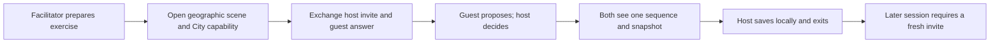
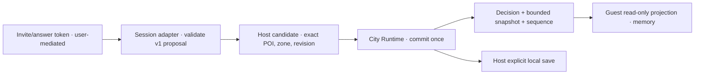
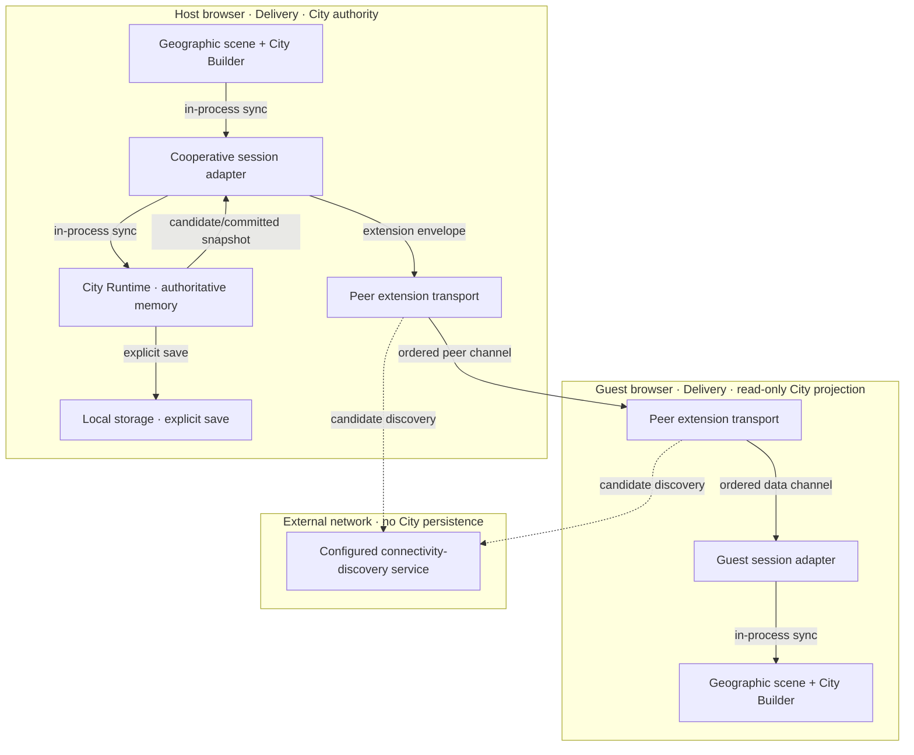

# Reusable Spatial Panels and Cooperative City Planning

This joined PRD, TAD, ADR, MVP, and GTM record specifies reusable scene-authoring panels, a small POI activity game on Geo+XR, and a cooperative city-planning workflow. The implementation exposes shared panel capabilities across workspace files, gates document-bound actions by active content, and lets Game Mode use the active authored XR scene when present or the shared neutral scene on other loaded documents. It draws the local player, next goal, and connecting travel route on the existing MapLibre map, refits that map to the exposed aperture when editor or FloatingPanel occlusion changes, and pans the player-goal route midpoint into that aperture after travel without changing zoom. With the shared Immersive Media keyboard navigation setting enabled, clicking the player selects it and clicking elsewhere deselects it; a focused map sends WASD/arrows to short screen-relative steps on rendered walkable street/path lines and pans the camera when no player is selected. The first step may snap the player a bounded distance onto a nearby walkable line; absent a nearby route, movement stops without panning. Building and water polygons, restricted access, and non-walkable transport classes cannot be destinations. Shift fine-tunes movement or panning, plus/minus zoom, and editable controls remain unaffected. The marked goal is reachable with one clearly styled City Builder action while optional POI detours remain available; a collapsed **How to travel** disclosure explains supported destination, map, and keyboard interactions. It also adds a host-decided City proposal protocol over the existing peer extension and expands the checked-in Singapore POI profile. Typecheck, focused source/profile/gameplay/viewport/keyboard-camera checks, and live browser verification pass. Two-client protocol proof, the broader file matrix, full accessibility review, runtime frame-performance measurements, and release evidence remain pending.

## Authority and boundaries

This document owns reusable panel behavior, the regional POI catalog expansion, and the cooperative overlay. Existing domain owners continue to own simulation, animation, scene, geographic rendering, and persistence state. The proposal adds no parallel
renderer, camera, state store, asset catalog, or durable-session owner.

### Scope and neutrality contract

- **Universal:** the four requested panel capabilities—media subjects and props, game mode, XR asset animation controls, and city building—appear in the common FloatingPanel for every workspace file. A capability can be empty,
  offer setup, or disable an action when its required scene or model data is absent. Game Mode is available on any loaded document, using authored XR content when present and the neutral shared scene otherwise; file names, directories, mirrors, and demo identity never determine availability.
- **Neutral:** panels are named by capability. The Singapore regional POI profile is a selectable data package, not the identity or default scope of the generic scene, asset, animation, game, or city tools.
- **Agnostic:** inputs come from validated document content and the active runtime contract. A city can run from any document containing the supported city schema and profile reference; it does not require a particular seed marker.
- **Reusable:** one panel router, each capability owner, one media catalog, and shared regional geometry utilities serve every document. No per-seed panel copies.

## PRD — cooperative planning outcome

### Problem, hypothesis, and target outcome

**Pain status:** hypothesis, not customer-validated. A single-user City demo does not let a facilitator and one participant make a shared, reviewable zoning decision during the same session. Existing code proves a local City loop exists; it does not prove this
pain, willingness to pay, or demand.

**Hypothesis:** one host-owned City state with guest proposals lets two people complete a short planning exercise without state divergence or a second spatial world.

**1 target:** in a 5-minute local development session, one host and one invited guest join the same City, the guest proposes a valid zone, the host accepts it, both clients display the same City revision after one tick, and the host explicitly saves and reads
back that revision. Observe the first 10 paired sessions; target at least 8 complete without a divergent revision. This is a proposed acceptance target, not observed evidence. Any committed revision divergence is a release blocker; the 8/10 threshold applies
only to session completion.

### Users and journey

| User | Job | Risk |
|---|---|---|
| Host / facilitator | Start one City session and decide which proposals enter the simulation | Guest input mutates state without consent or host disconnect loses the only live state |
| Guest / co-planner | Inspect the same POIs and submit one zoning proposal | Stale state or unclear proposal outcome |
| Reviewer | Confirm one owner, one map, and an explicit local save | Presence or transport is mistaken for durable shared City state |

### Journey: Facilitator — run one shared planning session

| Stage | Action | Touchpoint | Friction / emotion | Opportunity |
|---|---|---|---|---|
| Trigger | Prepare a two-person zoning exercise | Existing City workspace | Unsure whether the session is shared or local | Show session availability before inviting |
| Discover | Open the geographic scene and Cooperative Planning | Shared toolbar and City Builder | Several setup steps; invite and answer exchange may feel technical | Preserve one surface and show a short setup status |
| Engage | Share invite, apply guest answer, review and decide on one proposal | Cooperative Planning panel | Host may fear an unseen guest mutation | Show pending proposal and require host decision |
| Complete | Advance one tick; confirm both clients show the same sequence; save locally | City Builder and host save control | Concern about divergence or which save persists | Show sequence and state that only host save is durable |
| Return | Reopen the host's saved City for a later exercise | Existing local save flow | Guest has no durable shared session | Require a fresh invite and disclose local-only persistence |

### Journey: Co-planner — contribute one zoning proposal

| Stage | Action | Touchpoint | Friction / emotion | Opportunity |
|---|---|---|---|---|
| Trigger | Receive a session invite from the facilitator | User-mediated invite exchange | Unsure what the invite reveals | State that it is a bearer invite, not account login |
| Discover | Open the City source, enter invite, return answer token | Source and collaboration controls | Copy/paste can be error-prone | Validate current invite/session and expose clear errors |
| Engage | Inspect host snapshot and propose one allowed zone | City Builder panel | Stale view may make proposal feel lost | Show base revision and pending status |
| Complete | See host decision and updated sequence | City Builder panel | A rejected proposal may appear to vanish | Announce accepted or rejected outcome with reason |
| Return | Join a later exercise with a new invite | User-mediated invite exchange | No account or session recovery | Disclose that each session is ephemeral |

**Diagram D-01 — paired user journey** · class: user journey · notation: Mermaid `flowchart LR` · surface: this specification · projects: no · version: 0.6.9 · caption: invite exchange leads to one host-decided shared result.



### User stories and VCCs

| ID | Journey stage | Story and acceptance condition | VCC and evidence state |
|---|---|---|---|
| `PRD-CCO-01` | Discover | As a host, I want the existing geographic scene to remain the only world. | `VCC-CCO-01`: canonical and content-only renamed City documents opened on one Geo+XR host with one MapLibre canvas; paired-client proof remains pending. |
| `PRD-CCO-02` | Discover | As a host, I want to invite one guest with a bounded participant set. | `VCC-CCO-02`: existing invite/answer and peer roles are reused; City sync permits one peer. City transport handshake proof remains pending. |
| `PRD-CCO-03` | Engage | As a guest, I want to propose one legal zone change without owning simulation state. | `VCC-CCO-03`: versioned envelope validates exact fields, session, document hash, parcel, zone, payload size, and host revision; negative-case proof remains pending. |
| `PRD-CCO-04` | Engage | As a host, I want to accept or reject a proposal so each committed change has one decision owner. | `VCC-CCO-04`: only the host decision handler calls the City zoning owner; the host decides each pending proposal. Two-client commit proof remains pending. |
| `PRD-CCO-05` | Complete | As both participants, we want a common snapshot so a tick or accepted proposal cannot silently fork the session. | `VCC-CCO-05`: host sends monotonic latest-state snapshots; guests discard old sequences. Byte convergence and packet-loss proof remain pending. |
| `PRD-CCO-06` | Complete | As a participant, I want local simulation and save rules to remain clear when the network fails. | `VCC-CCO-06`: guest mutation, load, and save APIs reject with `guest-read-only`; a focused runtime test passes. Disconnect and solo save/read-back proof remain pending. |
| `PRD-CCO-07` | Return | As a host, I want Exit to restore the prior workspace surface exactly once. | `VCC-CCO-07`: existing Exit restoration remains the owner; a live City-to-README switch exits and hides City metrics. Exact restoration and full cleanup proof remain pending. |
| `PRD-CCO-08` | Engage | As a facilitator or co-planner, I want proposal controls to work with keyboard and assistive technology. | `VCC-CCO-08`: named keyboard actions, announced status, managed focus, and non-color state; browser and assistive-technology proof required. |
| `PRD-CCO-09` | Discover | As an author, I want the four spatial panels in every workspace file, with XR keyboard guidance reachable from Asset Control. | `VCC-CCO-09`: a live local browser check opened Media, Game Mode, Animation/XR Asset Control, and City Builder on both a City seed and a general README; a renamed City fixture opened without run-ready identity. XR Asset Control opens the existing MainPanel Help shortcuts filtered to WASD, where object and Camera controls are listed; wider file matrix pending. |
| `PRD-CCO-10` | Engage | As an author, I want scene actions and panel state bound to the current document. | `VCC-CCO-10`: content capability gates and the City-to-README switch are implemented; the inactive City panel hides the previous file's metrics. Other workflow switch and stale-action cases remain pending. |
| `PRD-CCO-11` | Engage | As a planner, I want a more detailed Singapore POI profile using shared procedural geometry. | `VCC-CCO-11`: the profile has 12 stable identities and 19 source polygons across five contexts; shared profile validation and provenance tests pass. |
| `PRD-CCO-12` | Complete | As a planner, I want consistent POI identity and footprint in map and XR views. | `VCC-CCO-12`: local map and XR render-plan checks pass for matching profile identities; cross-projection tolerance review remains pending. |
| `PRD-CCO-13` | Complete | As an author, I want generated POI detail to use the existing procedural asset utilities. | `VCC-CCO-13`: six searchable/placeable POI details use shared deterministic recipes and the existing builder; tests enforce local-only output, stable recipe data, and a 2,000-triangle cap while profile geometry retains spatial authority. |
| `PRD-CCO-14` | Engage / Complete | As a City player, I want my current POI, next goal, and travel path visible on the existing Geo+XR map, and I want to reach the marked goal without first selecting it on the map. | `VCC-CCO-14`: one profile-keyed player sprite, goal marker, and contrasting route share the existing MapLibre canvas; one City Builder action travels to the goal, completes and rotates it, while an optional selected-POI action supports detours; editor or FloatingPanel visibility changes refit the route into the exposed map aperture, and route changes pan its midpoint into that aperture without changing zoom or requiring Start; with shared keyboard navigation enabled, clicking the player selects it and clicking elsewhere deselects it, then map focus routes WASD/arrows to short steps snapped to rendered walkable street/path lines or blocks movement when no nearby line exists; building/water polygons, restricted access, and non-walkable transport classes are excluded. Unselected input still pans the camera, Shift fine-tunes, plus/minus zooms, and editable controls are not intercepted; movement changes neither City tick, economy, nor save bytes. |

### Scope, metrics, and economics

| Capability | Priority | Scope |
|---|---|---|
| Keep local City loop and explicit host save | Must | Preserve the existing source-authored local behavior and its current persistence contract. |
| One host plus one invited guest | Must | Two-client local proof through the existing peer-to-peer fallback when authenticated-room config is absent; no public room discovery or account-authentication claim. |
| Guest proposal, host decision, ordered shared snapshot | Must | Reuse the City operation owner; proposals never write state directly. |
| Cooperative session, proposal status, stale/disconnected disclosure | Must | Render in City Builder; no peer-presence markers or camera changes. |
| POI neighborhood activity | Must | One abstract player sprite, goal marker, a visible route between their canonical POIs, one-action marked-goal travel, optional selected-POI detours, goal rotation, and a session-local score on the same MapLibre Geo+XR map; selecting the player and focusing the map enables short WASD/arrow steps along rendered walkable street/path lines, with bounded path snapping and blocking where no line is nearby; building/water polygons and restricted/non-walkable segments are excluded; unselected input pans the camera; refit the camera after editor/FloatingPanel occlusion changes and pan route updates into the exposed aperture without changing zoom; keep movement session-local, out of City tick/save state and the zoning protocol; do not create a 3D scene. |
| Accessible proposal and connection controls | Must | Keyboard and assistive-technology access; state is not conveyed by color alone. |
| Reusable FloatingPanel capabilities | Must | Shared views for Media → Assets → Subjects & Props, Game Mode, Animation → XR Asset Control, and City Builder → City-Building Sim; capability readiness follows active document content, never a seed/path identity. |
| Data-driven regional POI catalog | Must | Expand the Singapore example with sourced, stable POI identities; reuse regional profile and procedural geometry utilities for map/XR and detail kits. Other profiles use the same neutral interfaces. |
| Remote-agent or tool-gateway integration | Won't | No remote agent route or tool authority is part of this cooperative slice. |
| Three or more participants | Should | Revisit after two-client sessions demonstrate need and capacity. |
| 3D character simulation, multiple player presence, voice/chat, public rooms, server-persisted shared cities | Won't | The local loop uses one abstract fixed-pixel marker and one goal; shared presence and durable multiplayer state need separate product, privacy, cost, and ownership decisions. |
| AI-directed zoning or generated economy rules | Won't | Existing deterministic local Advisor remains separate and zero-token. |

| Metric | Current baseline | Proposed target | Validation window |
|---|---|---|---|
| Geographic scene option | Present in source | Keep one option and one surface owner | Source and browser check |
| Shared City sessions | Protocol implementation exists; no two-client proof | 2 participants | First 10 paired sessions |
| Panel reuse | Live checked on the City seed and general README | All four panel capabilities open on every workspace-file fixture; unsupported City data shows setup state | Exact-head context-switch matrix |
| Singapore POI detail | 12 identities and 19 profile surfaces in the worktree | At least 12 provenance-bearing identities; identical stable IDs and footprints across map/XR | Profile validation and cross-surface projection checks |
| State divergence | Implemented peer snapshot path; no paired-session measurement | 0 divergent committed revisions | 10 paired sessions plus replay test |
| Operation sync | City proposal protocol implemented; latency not measured | p95 ≤ 1 s on local development network | Two-browser smoke |
| TTV steps | Unknown | ≤ 4 manual actions to the first shared snapshot | Clean local walkthrough starting with both City Builder panels open |
| TTV elapsed | Unknown | ≤ 5 minutes | Timed facilitator walkthrough including invite/answer exchange |
| First-value action | None | Identical session snapshot visible to both clients | Two-client observation |
| Required model calls / cost | 0 for current local Advisor | 0 | Every run |
| Added package dependencies | 0 in current implementation | 0 | Dependency review |
| Delivered readiness | `undocumented` | Remains `undocumented` until authorized delivery evidence | Every release transition |
| 12-month TCO / ROI | Unknown | No new project-owned service; inherited connectivity discovery terms and operator time unknown; ROI uncomputed until impact, reach, build effort, and support are estimated | Before a pilot, relay, or hosted decision |

TTV targets and latency are estimates, not measurements. Local development has $0 incremental service cost. Peer connectivity, connectivity discovery reachability, any future relay cost, and operating burden are unmeasured; this plan authorizes no hosted
service. The proposed ROI calculation is not computable because session frequency, build effort, buyer impact, and willingness to pay are unobserved. Local reversible implementation and proof may proceed while Phase 0 discovery runs; a pilot, relay, or hosted
decision waits for those inputs and an explicit threshold. Do not convert the local cost target into a connectivity or revenue claim.

**Ecosystem outcome and evidence:** the facilitator needs a reviewable shared zoning decision; the co-planner needs a bounded proposal role; the operator needs a recoverable local session. These are pain hypotheses. The measurable target is 8 of the first 10
paired sessions completing without a divergent committed revision; WTP and paid conversion remain unvalidated.

**Reuse outcome:** existing surface, City Runtime, peer transport, shared panel owners, regional geometry, and local persistence are the reference owners. No parallel renderer, catalog, generator, reducer, or persistence owner is justified. Measure setup time,
failed invite exchanges, divergence, state leakage, and support time across the first 10 sessions; integration savings are unknown until measured.

**Dependencies:** one geographic scene host, current City operation and local-save contracts, a compatible peer path, and a supported desktop browser. No package or server is added to the local proof. **Open questions:** Product owns pain/WTP/price and ROI
inputs; Runtime owns target-environment transport selection and connectivity; Privacy/Operations own invite handling, metadata, participant consent, support time, and any future relay cost.

## TAD — ownership and flows

### Journey-to-system mapping

| Journey stage | Workflow | Data flow | AI orchestration | Topology nodes | Component |
|---|---|---|---|---|---|
| Discover | Select surface and apply source | Source intent → geographic scene activation | Not applicable | Workspace UI, scene surface | Scene surface |
| Engage | Invite/answer, propose, host decision | Invite token; proposal → decision | Not applicable | Host panel, session adapter, peer channel, City Runtime | Cooperative adapter; City Runtime |
| Complete | Move the local player to a regional POI; complete a goal; tick, compare sequence, save, exit | One-action goal travel or selected-POI detour → player/route/goal state → MapLibre overlay; editor/panel occlusion → debounced aperture refit; peer City snapshot → guest projection; host save | Not applicable | City Runtime, MapLibre source/layers, peer channel, local storage | City Runtime; geographic presentation; persistence |
| Return | Start a fresh session | Saved host City; new ephemeral invite | Not applicable | Workspace UI, host and guest browsers | Existing City source and save flow |

### Workflow — join and commit one proposal

**Trigger:** both participants have a compatible City document open in City Builder and a supported peer path is selected. **Actors:** host, guest, Cooperative Planning panel, session adapter, City Runtime.

**Happy path:**

1. Host starts a pending invite and shares the token.
2. Guest supplies the invite, joins, and returns an answer token.
3. Host applies the answer; both peers connect and exchange session state.
4. Guest submits one proposal for an exact POI and allowed zone at the current City revision.
5. Host adapter validates session, peer source, schema, proposal ID, revision, POI membership, zone, and size. Host accepts or rejects it.
6. On acceptance, the host commits once through City Runtime and publishes a decision plus the next snapshot and sequence. Guest displays that snapshot.
7. Host may tick and explicitly save through the existing local save action.

**Alternate paths:** a wrong or expired answer does not join; host can reject the proposal with a typed reason; a duplicate identical request receives its first decision; a repeated request ID with changed content is rejected; a stale revision receives the
current snapshot.

**Error paths:** invite/answer parse error returns a visible error; discovery or channel failure closes the attempted session and preserves solo City; an oversized candidate snapshot blocks commit before mutation; host disconnect closes the session without
election or guest save. If configuration selects another collaboration authority, this workflow is unavailable and must not bypass that owner.

**Postconditions:** either one host City revision is committed and the same serialized snapshot/sequence is visible to the guest, or no City mutation occurs and a typed result is visible. Only an explicit host save writes local durable state.

**Diagram D-02 — invite and proposal workflow** · class: system sequence · notation: Mermaid `sequenceDiagram` · surface: this specification · projects: no · version: 0.6.9 · caption: the host remains the only City mutation owner.

```mermaid
sequenceDiagram
  actor H as Host
  actor G as Guest
  participant A as Session adapter
  participant C as City Runtime
  participant P as Host local persistence
  H->>A: Start invite and share token
  G->>A: Join invite; return answer token
  H->>A: Apply answer for pending invite
  A-->>H: Connected session and initial snapshot
  A-->>G: Initial read-only snapshot
  G->>A: Proposal(base revision, POI, zone, request ID)
  A->>A: Validate direction, session, schema, revision, size
  A->>H: Show pending proposal
  H->>A: Accept or reject
  alt Accepted
    A->>C: Commit existing City operation once
    C-->>A: New immutable snapshot and revision
    A-->>H: Decision and ordered snapshot
    A-->>G: Decision and ordered snapshot
  else Rejected or invalid
    A-->>H: Typed result; no mutation
    A-->>G: Typed result and current snapshot when needed
  end
  H->>P: Explicit local save
```

### Data Flow — proposal, decision, snapshot, and save

| Stage | Component | Input schema | Output schema | Persistence / retention | Error handling |
|---|---|---|---|---|---|
| Invite | Selected peer invite protocol | Versioned token with opaque session/document binding | Guest answer token bound to invite/session/owner IDs | User-mediated transfer; lifetime is the pending invite; channel retention is unknown | Reject malformed, stale, or nonmatching answer; do not claim account identity |
| Ingest | `agentic-graph.city-coop/v1` extension | Proposal `{kind, sessionId, documentHash, proposalId, baseRevision, parcelId, zone}` | Validated proposal tied to the active session, exact document, and connected peer | Adapter memory only; replay IDs bounded to 256; clear on session reset | Reject unknown fields, wrong session/document, malformed values, replay, wrong direction, or >20 KiB |
| Transform | Host decision handler + City Runtime | One pending validated proposal and current City snapshot | Host accept/decline result | Pending proposal and decision remain in browser memory | Recheck host sequence and City revision before acceptance; reject stale state |
| Commit / serve | City Runtime + peer extension | Host acceptance and existing zone operation | One City mutation followed by `{kind, sessionId, documentHash, sequence, city, phase, selectedParcelId, decision}` | Volatile host memory; snapshots use the ordered peer extension | Host is sole mutator; snapshot is sent only to the connected guest |
| Consume | Guest projection | Host decision and snapshot | Read-only view matching the newest host sequence | Guest browser memory only; disconnect retains a read-only last projection | Ignore older or wrong-session/document snapshots; wait for the next host snapshot |
| Save | Local persistence owner | Host snapshot and explicit save action | Save result and host read-back | Host's existing local storage boundary | Preserve save/read-back errors; guest has no save path |

Zones are limited to the existing mutable zoning values `residential`, `commercial`, and `industrial`; `unzoned` is not a proposal. `parcelId` must match one exact current City parcel/POI identity. The host keeps a bounded set of proposal IDs to reject repeats and allows one pending proposal. A proposal binds to the last host snapshot sequence; the host also rejects it if the City runtime changed since that snapshot. Snapshot sequence advances for each transmitted snapshot, not each City mutation, and no history survives a session reset. The extension enforces a 20 KiB City payload limit beneath its generic 24 KiB cap.

**Diagram D-03 — typed City data movement** · class: data flow · notation: Mermaid `flowchart LR` · surface: this specification · projects: no · version: 0.6.9 · caption: only the host persists the committed City.



### Orchestration / Harness Flow — not applicable

This increment has no model call or autonomous agent path. Proposal validation and host decisions are deterministic code; the Advisor does not approve or commit proposals. Token budget is 0 per session by design, with no harness, executor, observer, or model
fallback to specify.

### Topology — two-client local proof v0.6.9 — 2026-10-10

**Boundaries:** one host browser, one guest browser, user-mediated invite exchange, an ordered peer channel, connectivity discovery, and the host's existing local persistence boundary. The remote peer and invite recipient are untrusted. There is no City
server, session database, or relay in this proposal.

| Node | Role | Type | Lane | Connects to | Connection type | Data residency |
|---|---|---|---|---|---|---|
| Geographic scene and City Builder UI | Source activation and participant controls | Browser UI | Delivery | Host/guest adapter, City Runtime | In-process synchronous | Each participant's browser memory |
| Cooperative session adapter | Validate, sequence, and project messages | Browser function | Delivery | City Runtime; peer extension | In-process synchronous; peer event stream | Each participant's browser memory; no durable session store |
| Host City Runtime | Sole simulation mutation owner | Browser function | Delivery | Host adapter; local storage | In-process synchronous | Host browser memory until explicit save |
| Peer extension transport | Deliver bounded envelopes to connected peer | Browser peer channel | Delivery | Host and guest adapters | Ordered channel | Transient browser/channel buffers |
| Connectivity discovery | Assist peer candidate discovery | External service selected by configuration | Delivery | Host and guest peer connections | Request/response | Network metadata; provider retention is unverified |
| Host local save | Persist explicit host save | Existing workspace storage boundary | Delivery | Host City Runtime | Existing local persistence API | Host's local workspace storage under its existing contract |
| Invite/answer exchange | Transfer connection setup tokens | User-mediated channel | Delivery | Host and guest collaboration controls | Copy/paste or invite link | User-selected channel; retention is outside app control |



### Trust, quality, and budgets

- A generated invite is a bearer capability, not account authentication. It carries opaque session negotiation and document-binding data. Do not include secrets or sensitive City content. The host treats all peer payloads as untrusted and accepts only proposal
  messages in its active session; client controls alone are not an authorization boundary.
- Guests can propose only an exact existing POI identity and one allowed zone. Reject unknown fields, oversized payloads, wrong session, stale revision, replay, and guest commit/save/reset attempts before any state effect.
- Session state is ephemeral and limited to two connected participants in this increment. There is no public room search, cross-session broadcast, account-authentication claim, or server-side City history. Host Save remains explicit and local. The cooperative
  snapshot envelope is capped at 20 KiB; chunking and larger City snapshots are deferred.
- Protocol budgets: one pending host-reviewed proposal; 20 KiB maximum for each extension payload, below the generic transport's 24 KiB limit; generic extension rate limiting is 30 Hz. No per-minute application quota is implemented. If the host is absent, the guest retains a read-only last snapshot; there is no host election.
- A connected host sends a fresh snapshot on connection and after City state changes. Old sequences and mismatched session/document hashes are ignored.
- The geographic surface owns hit testing and gestures. The overlay uses the existing City Builder panel; it adds no map feature, second camera, pointer capture, or renderer.
- Keep single-player offline behavior available when collaboration settings or network access are missing. No paid model call, new package, or new deployment is needed for the local proof.

### Integration and release boundary

The City extension depends on the City operation contract and existing peer-extension transport, not the reverse. It must not repurpose document text synchronization as authoritative game state. The `agentic-graph.city-coop/v1` namespace is versioned, exact-field,
bounded, direction-checked, document/session-bound, and replay-aware. Host/guest wire-level negative cases and two-client browser proof are release gates.

### Reusable panel and POI contracts

| Panel capability | Content contract | Behavior when unavailable |
|---|---|---|
| Subjects & Props | Shared catalog plus the active authored scene and its object-edit owner | Keep the catalog browsable; explain when placement needs a compatible scene |
| Game Mode | Any loaded document; use its authored XR scene when available, otherwise the neutral shared scene; retain the deterministic gameplay owner | Disable Start only while no document is loaded or a runtime prerequisite such as WebGL or local Decision hydration fails |
| XR Asset Control | Compatible XR scene, selected asset, and active animation/timeline owner | Keep the controls reachable; request a scene or actor selection |
| City-Building Sim | Validated city schema, regional-profile identity, and zoning table in document content | Offer create/setup or a validation error; never require a demo marker |

The shared router resolves capability from active content/runtime, never its file name or path. It cancels in-flight edits on context change and rejects a late commit whose document revision or selected entity changed. Media, NPC, animation, and proposal selections are transient; changing documents clears them. The City Runtime retains the existing workspace-level canonical City save, but the City panel hides its state when the active document has no valid City capability. Cooperative messages bind to the active document hash, so a proposal or snapshot cannot cross into a different file context.

The Singapore profile now contains twelve stable POI identities and nineteen sourced polygon surfaces across civic/cultural, green, transit, waterfront, and commercial contexts. Each surface has category, height/footprint accuracy, attribution, and versioned provenance. Optional details for six identities are searchable and placeable from the shared Media → Assets library in any workspace file. They reuse `singaporePoiDetailKits.ts`, the existing local text recipe, and `buildProceduralAsset`, seeded by POI identity. Exact profile footprints remain the map/XR spatial authority; generated detail is schematic, deterministic, local-only, and does not imply greater source accuracy. Missing verified geometry stays absent instead of being fabricated.

**Interface:** `agentic-graph.city-coop/v1` over the existing peer extension. **Protocol:** ordered peer channel. **Format:** exact-field JSON payload bound to `sessionId` and active `documentHash`. **Errors:** typed UI status; never silently retry a City mutation.

| Message | Direction | Required fields | Authority / effect |
|---|---|---|---|
| `proposal` | Guest → host only | `kind`, `sessionId`, `documentHash`, `proposalId`, `baseRevision`, `parcelId`, `zone` | Requests host review; cannot mutate City |
| `snapshot` | Host → guest | `kind`, `sessionId`, `documentHash`, `sequence`, `city`, `phase`, `selectedParcelId`, `decision` | Read-only guest projection; never accepted from guest |

The generic extension envelope supplies namespace, opaque source ID, payload, and send time. The adapter validates the current transport session and active document hash; source ID identifies a connected transport source only. The host retains up to 256 proposal IDs per session and rejects replay. A proposal is current only while its base sequence matches the latest host sequence and the City runtime has not changed since that sequence was sent. Host snapshots use a monotonic sequence; guests accept only newer snapshots.

Local source checks establish authored contracts only. Browser proof must use two isolated clients, assert equal snapshot bytes and sequence, exercise stale and unauthorized requests, disconnect/rejoin, host-only save, and exact Exit restoration. Protected
integration, deployment, projection, and production verification remain separate; this document grants none of them.

### Shared utility and invocation reuse

| Capability / VCC | Shared owner | Smallest delta | Boundary and acceptance |
|---|---|---|---|---|
| Four reusable panels / `VCC-CCO-09/10` | One FloatingPanel router and one owner per capability | Keep Media Assets, Game Mode, XR Asset Control, and City Building in the shared router; bind actions to validated active content | Panels remain reachable in every file; unsupported actions show setup or disabled state; no path or identity checks |
| Subjects & Props / `VCC-CCO-09/10` | Shared media catalog and authored-scene object owner | Reuse one catalog and typed place/swap/remove actions; place instances only in the active scene | Context switch clears stale selection and drafts; one catalog serves all files |
| Game and animation / `VCC-CCO-09/10` | Shared XR scene, gameplay, animation, keyboard shortcut catalog, and choreography runtime | Keep current runtime APIs; link XR Asset Control to MainPanel Help filtered to WASD, and reuse the catalog and choreography runtime for object and Camera controls | No second shortcut catalog; Game Mode uses a neutral shared scene when an active document has no XR authoring data; object and Camera choreography continue through their existing runtime; animation actions still require a compatible selected cast mark or Camera context |
| Geo+XR player and map controls / `VCC-CCO-14` | City Runtime player session state, Immersive Media navigation setting, rendered transportation lines, and the existing MapLibre geographic host | Map clicks select/deselect the player; when selected, resolve short screen-relative WASD/arrows steps onto nearby walkable street/path line geometry and block unresolved steps; otherwise preserve map-camera panning; focus the map from pointer input | No duplicate setting or renderer; building/water polygons, explicit foot/access restrictions, ramps, and non-walkable road classes are rejected; bounded snapping cannot teleport across a block; movement is transient and independent of City ticks, economy, and saves; Shift fine-tunes movement/panning, plus/minus zoom, editable fields remain untouched, and cleanup removes listeners and temporary focus metadata |
| City activation / `VCC-CCO-01/09` | City domain capability resolver and one local simulation owner | Accept compatible city schema/profile content without a run-ready demo ID; show setup state in other files | No filename, directory, mirror, or seed gate; invalid content cannot launch or mutate |
| Regional geometry / `VCC-CCO-11/12` | Shared regional profile, validation, map projection, and XR presentation utilities | Expand data and visual templates on common interfaces; preserve stable IDs, exact source rings, heights, and provenance | Same profile drives geographic and XR views; deterministic output, no network fetch |
| POI detail assets / `VCC-CCO-13` | `singaporePoiDetailKits.ts`, shared XR library/search, `buildProceduralAsset`, primitive templates, and export helpers | Reuse six shared recipes for optional visual details; expose them in Media → Assets across files; never replace profile geometry with model bounds | Stable recipes, zero provider calls, and ≤2,000 generated triangles are covered by the focused XR catalog test; profile remains spatial authority; no parallel generator |

Each panel resolves a typed active-document context at invocation. Document changes invalidate pending edits and actor/POI selections before another operation can commit. Persisted edits use the capability's existing authored-data owner; search, tabs, selected
rows, and pending UI drafts remain view state. The `agentic-graph.city-coop/v1` envelope is ephemeral; unsupported payloads are rejected and preserve local City state. Rollback removes only the adapter and returns to single-user behavior. Existing shared utilities
remain the only parser, serializer, scene store, and asset-generation owner.

### Quality attributes

| Attribute | Scenario | Pattern | Validation |
|---|---|---|---|
| Performance | Local connected proposal-to-snapshot p95 ≤1 s | One host commit and one bounded ordered extension broadcast | Two-client latency record; target is proposed, not measured |
| Scalability | Session has two people and one pending proposal | Enforced one-peer and one-pending-proposal limits; inherited transport rate limit; no public discovery | Boundary and over-limit cases |
| Security | Malformed, stale, replayed, wrong-session, oversized, or guest-commit input arrives | Validate at host before state effect; bearer invite, no account claim | Negative cases and invite-token URL handling review |
| Observability | Host must diagnose join, rejection, divergence, disconnect, save | Aggregate counters and sequence status; no raw user content or persistent in-app analytics | Local proof log; study notes only with participant consent |
| Token cost | Session runs without model calls | Deterministic City logic; AI Advisor remains separate | Source inspection and zero model-call record |
| Offline behavior | Peer transport fails | Close session; retain solo City and host local save | Disconnect and airplane/offline exercise |
| TCO | First proof runs with current local runtime | No new service, package, or persistent store; inherited discovery and support costs remain gaps | 12-month model before any relay or hosted decision |
| Device reach | Geographic scene and peer transport work in target browser | Desktop browser is initial target; mobile/tablet is unverified and not claimed | Clean browser proof; mobile matrix before expanding scope |
| Accessibility | Keyboard-only and screen-reader user submits or reviews a proposal | Native buttons, visible focus, live status announcement, non-color state | Keyboard and assistive-technology review before VCC-CCO-08 passes |

### Deployment and boundary strategy

Phase 1 is a local authoring proof only. It adds no server, external endpoint, or deployed runtime; current connectivity configuration is reviewed separately. New session code must use a compatible selected peer adapter and keep solo City available. Any relay,
alternate room transport, or hosted shared state requires a new decision and independent cost/privacy review. Rollback unregisters the extension and adapter; no shared server data needs migration.

| Boundary | From lane | To lane | Evidence Reference | Operator instruction | Rollback statement | State |
|---|---|---|---|---|---|---|
| Source implementation | Authoring | Mirror | Worktree implementation exists; typecheck, focused source checks, and live local UI passed; two-client proof remains open | `none` | Revert the City co-op adapter and panel changes; retain the profile and single-user City path | `open` |
| Source release | Mirror | Delivery | No source-release evidence for this proposal | `none` | Restore the previous exact source revision and retain local City data | `closed` |
| Relay or hosted state | Authoring | Delivery | No measured connectivity discovery failure, cost model, privacy review, or approved candidate | `none` | Keep peer/local or solo mode; no relay or shared state to remove | `closed` |

### Architecture diagrams and register

The user journey, workflow, data flow, and topology diagrams are D-01 through D-04 above. Each is documentation-only and does not claim a rendered or runtime artifact.

| Diagram | Class | Notation | Surface | Projects | Nodes | Edges | Clusters | Version |
|---|---|---|---|---:|---:|---:|---:|---|
| D-01 | User journey | Mermaid `flowchart LR` | This Markdown document | No | 7 | 6 | 0 | 0.6.9 |
| D-02 | System sequence | Mermaid `sequenceDiagram` | This Markdown document | No | 5 participants | 16 message edges | 1 alternative | 0.6.9 |
| D-03 | Data flow | Mermaid `flowchart LR` | This Markdown document | No | 7 | 6 | 0 | 0.6.9 |
| D-04 | Runtime topology | Mermaid `flowchart TB` | This Markdown document | No | 9 | 10 | 3 | 0.6.9 |

### Component inventory

| Layer | Component | Responsibility | Local rung | Delivered rung |
|---|---|---|---|---|
| Surface | Geographic scene host | Retain one map/scene surface | `dev-proven` | `undocumented` |
| Panels | Shared FloatingPanel router and capability views | Expose all four panels from every workspace file | `dev-proven` | `undocumented` |
| Domain | City Runtime | Own local deterministic City mutations and snapshots | `dev-proven` | `undocumented` |
| Adapter | Cooperative session adapter | Validate proposals; host decides and sequences commits | `spec-complete` | `undocumented` |
| Data | Regional POI profiles and shared projections | Own identity, footprint, height, provenance, and map/XR projection | `dev-proven` | `undocumented` |
| Detail | Procedural asset utilities | Produce optional deterministic visual detail kits | `spec-complete` | `undocumented` |
| Persistence | Local save owner | Preserve explicit local save/read-back; no shared durable state | `spec-complete` | `undocumented` |

**Component specifications:**

| Component | Responsibility (SVO) | Interface / dependency / configuration | FOSS / cost | VCC, evidence, readiness |
|---|---|---|---|---|
| Shared panels | Bind content actions to the active document and capability | One view per feature; shared invocation and context fence | Reuse; no package | `VCC-CCO-09/10`; live UI checked on two files, full matrix pending; `dev-proven` / `undocumented` |
| Media and animation | Reuse scene catalog, selection, and timeline owners | Typed scene entity IDs; document-scoped edits | Reuse; no package | `VCC-CCO-09/10`; live shared views checked, context-switch proof pending; `dev-proven` / `undocumented` |
| City Runtime | Host commits deterministic City operations | Local domain owner; session adapter calls it once | Reuse; no package | `VCC-CCO-01/04/05`; runtime and live single-user proof pass, co-op proof pending; `dev-proven` / `undocumented` |
| Session adapter | Validate proposal and snapshot envelopes | `agentic-graph.city-coop/v1`; existing peer extension | Reuse; no package | `VCC-CCO-02–08`; implementation present, two-client proof pending; `spec-complete` / `undocumented` |
| Regional POI profile | Provide stable geometry and provenance for projections | Profile registry, geographic projection, XR presentation | Reuse plus sourced data; no runtime service | `VCC-CCO-11/12`; shared profile and map/XR checks pass; `dev-proven` / `undocumented` |
| Procedural detail kit | Generate optional POI-specific visual detail | Existing deterministic asset builder; profile remains spatial authority | Reuse; no package | `VCC-CCO-13`; shared recipe, deterministic output, provider-call, and triangle-budget checks pass; runtime frame-rate measurement pending; `dev-proven` / `undocumented` |
| Local persistence | Write explicit host saves | Existing local storage contract; guests have no write route | Reuse; no service | `VCC-CCO-06`; save/read-back evidence pending; `spec-complete` / `undocumented` |

### Ecosystem and invocation reuse

| Participant / job | Value exchange / payer | Owner / interface / authority | Evidence gap | Cost, privacy, and exit |
|---|---|---|---|---|
| Host / facilitator | Run a shared planning session; potential pilot payer | Existing City operation owner; host-only commit and local save | Pain and willingness to pay unvalidated; two-client proof pending | Local proof adds no service; host Exit closes the City projection |
| Guest / co-planner | Submit one proposal and see the same committed outcome | Existing host invite; proposal-only peer message | Protocol implemented; connection, decision, and convergence proof pending | Do not store message history; disconnect becomes read-only |
| Runtime operator | Keep the peer path usable | Existing peer-extension transport; no City persistence authority | connectivity discovery reachability, support, and any future relay cost are unverified | Local-only fallback remains available; future hosted relay stays closed |

**Value-moving flow:** not applicable to the in-session product; no money, asset, or payout moves between participants. Any paid pilot is an external commercial transaction and requires Product/Finance review before an offer or collection.

Keep the existing local local City invocation and City inspection/control boundaries. The overlay UI may submit a proposal through the new versioned session protocol, but a guest cannot call local mutation tools or gain remote tool authority. Do not add an
remote agent/tool route or a second invocation grammar for this increment.

## ADR — shared capability panels and one City authority

**Status:** accepted for local implementation · **Date:** 2026-10-10 · **Decision:** expose one shared view for each requested capability from the common FloatingPanel, resolve actions from active document content, and clear transient state when that context changes. Keep the current
scene, catalog, timeline, City, and local-save owners. Fit the existing MapLibre camera to the currently exposed viewport when editor or FloatingPanel occlusion changes; pan the active player-goal route into that aperture without changing zoom when travel changes the route. Add a typed ephemeral proposal protocol; the host decides every shared mutation. Keep regional profiles as data and reuse shared map/XR geometry and procedural detail utilities.

**Context:** current controls already use a common view router, but source readiness and City demo activation have differing gates. The City is a local deterministic simulation. Existing peer and authenticated workspace paths do not define City operation
authority, proposal ordering, or shared persistence.

| Alternative | Benefit | Cost / consequence | Decision |
|---|---|---|---|
| Shared panels with content-based capability resolution | Every workspace file can open the same controls; one owner and content-based capability gates | Requires context resolution, migration of seed gates, and switch/leak tests | Accepted for local implementation |
| Observe only native map resize events | Uses the map's existing resize lifecycle | Editor and FloatingPanel visibility can change the exposed map aperture without resizing the map host; gameplay framing remains hidden or off-center | Reject |
| Observe editor/panel occlusion and refit the existing MapLibre camera | Uses one map and its existing camera owner; responds to editor and panel visibility/size changes | Requires mutation/resize observation, debounce, and cleanup tests | Accepted |
| Clone panels per demo or file | Small first change | Duplicates controls, diverges behavior, and makes file identity an accidental API | Reject |
| Host proposals over a selected validated peer-extension interface | Preserves City mutation owner and single-user behavior | Host must remain online; protocol, invite handling, and security tests are new work | Proposed |
| Reuse workspace document synchronization as City state | Membership and document sync already exist | No City transaction, ordering, permission, or replay contract | Reject |
| Add a dedicated persistent game service | Server can own durable shared state and host failover | New authority, schema, migration, operations, cost, and release surface; duplicates local save semantics | Defer until evidence requires it |
| Keep the feature single-player only | Offline and zero-cost path is already grounded | Does not meet the cooperative overlay hypothesis | Retain as fallback, not the proposed co-op outcome |
| Add richer POIs through shared profile and geometry utilities | Maintains one geospatial authority across 2D/3D and supports other profiles | New source data, procedural template coverage, and rendering budgets need validation | Proposed |
| Add a new POI-specific generator | Could specialize output quickly | Duplicates procedural construction and risks geometry/identity drift | Reject |
| Add managed or self-operated relay | Could improve peer reachability | Terms, egress, privacy, staffing, and cost are unmeasured | Defer until local tests show need |

Consequences: one host disconnect ends shared play; guests can view the last snapshot but cannot mutate or save the host's City. A guest proposal is not a committed City action. The host's local file remains the only durable save. Revisit this ADR if users
require host failover, shared persistence, more than two participants, or a session that survives host Exit.

**Reuse compatibility decision:** one adapter depends on the existing City mutation interface and a selected validated peer transport. Preserve local City semantics, save format, and authority. Do not route game state through document text sync or silently
bypass the selected collaboration owner. Rollback removes the adapter and returns to single-user City behavior.

**FOSS-first and 12-month TCO comparison:** no package or infrastructure is added for the local proof. Existing connectivity-service terms, retention, and service levels remain unverified in the reference implementation and are not assumed to cost $0.

| Dimension | Chosen: existing peer path | FOSS alternative: managed relay | FOSS alternative: self-managed relay | 12-month delta / assumption |
|---|---|---|---|---|
| Infrastructure cash | No new project-owned service; inherited connectivity discovery cost/terms unknown | Unknown; provider and quote not selected | Unknown; host and bandwidth not sized | Not computable until usage and connectivity failure are measured |
| Egress | No project-owned relay egress; connectivity discovery traffic/terms unmeasured | Unknown | Unknown | Not computable |
| Token cost | `$0` by design | `$0` | `$0` | `$0` |
| Operations | Manual invite support; hours unmeasured | Provider dependence; support scope unknown | High self-operations: patching, uptime, incidents | No labor value is inferred |
| Vendor / continuity risk | Existing connectivity discovery provider and configured-room selection are external boundaries | Hosting provider and relay terms not evaluated | Lower managed-provider dependence; single-operator/host risk | Review only after local proof |

The local path therefore has `$0` new application-service spend, not a measured `$0` total cost. Human support, public connectivity discovery terms, and any relay cost remain unknown; Phase 2 cannot pass until those inputs are costed.

## MVP — two-client local proof

**Projects:** `PRD-CCO-01`–`PRD-CCO-14` · TAD ownership and flows above · this ADR at `CITY-GEOPLAY-001@0.6.9`.

| VCC | Required evidence | Evidence Reference | Local rung | Delivered rung |
|---|---|---|---|---|
| `VCC-CCO-01` | Exact-head source and browser proof show one geographic XR host, one City Runtime, and City Builder overlay | Live browser E2E on the canonical seed and content-only renamed fixture: both opened the existing Geo+XR host with one MapLibre canvas; City Builder Start advanced the deterministic tick, Stop fenced queued ticks, and Reset seed restored tick 0. Two-client proof pending | `dev-proven` | `undocumented` |
| `VCC-CCO-02` | With room config absent, two clients exchange invite/answer and connect with host/guest roles; UI makes no account-auth claim | Existing P2P invite flow reused; two-client handshake proof pending | `spec-complete` | `undocumented` |
| `VCC-CCO-03` | Legal proposal appears; malformed, stale, wrong-session, replayed, and guest-commit proposals change no City revision | Exact-field/session/hash/size/replay guards implemented; adversarial protocol test pending | `spec-complete` | `undocumented` |
| `VCC-CCO-04` | Host accepts/rejects; accepted operation uses City Runtime exactly once | Host-only decision path implemented; two-client commit proof pending | `spec-complete` | `undocumented` |
| `VCC-CCO-05` | Both clients converge on identical serialized snapshot and sequence after operation and tick | Monotonic host snapshots implemented; two-client byte convergence proof pending | `spec-complete` | `undocumented` |
| `VCC-CCO-06` | Guest disconnect degrades read-only; host offline solo flow and explicit save/read-back still work | `city.sim.runtime.guestReadOnly` passed; disconnect and host persistence proof pending | `dev-proven` | `undocumented` |
| `VCC-CCO-07` | Host Exit closes once and restores prior surface and panel state | Live City-to-README switch exits and hides City metrics; exact restore proof pending | `dev-proven` | `undocumented` |
| `VCC-CCO-08` | Named keyboard actions, announced status, managed focus, and non-color state work | Local browser screen-reader tree inspected; keyboard and assistive-technology review pending | `spec-complete` | `undocumented` |
| `VCC-CCO-09` | Every workspace-file fixture opens the same four capability panels; no filename, directory, mirror, or demo-ID gate. XR Asset Control exposes the existing MainPanel Help catalog for WASD, arrows, and Camera choreography; searching WASD expands the matching Shortcuts section. | Live local browser opened Media Assets, Game Mode, Animation/XR Asset Control, and City Builder on the City seed and general README; README showed 6 POI kits and empty Subjects & Props. Game Mode now starts on a neutral shared scene when a loaded document has no XR authoring source; the focused source test verifies this fallback. A content-only renamed City fixture without run-ready identity also opened Geo+XR. XR Asset Control's Shortcuts action opens Help filtered to WASD; the live result lists selected-object movement and Camera framing/choreography. `canvas.xrMode.choreographyOwnership` and the existing `canvas.xrMode.keyboardChoreography` runtime suite pass. Broader file matrix pending | `dev-proven` | `undocumented` |
| `VCC-CCO-10` | Switching documents during media, gameplay, animation, and City work cancels stale actions and leaks no state | Live City-to-README switch shows City setup only, hides old metrics, and disables Open. Game Mode uses the neutral scene on loaded documents without XR authoring data, while no loaded document keeps Start disabled. Source lifecycle path-drift, concurrent refresh, selection supersession, and cancellation retry checks pass; cross-panel in-flight and late-commit browser cases remain pending | `dev-proven` | `undocumented` |
| `VCC-CCO-11` | Singapore profile has ≥12 stable, provenance-bearing POIs across five requested contexts | `npm run test --workspace=grph-shared` passed 100/100, including profile revision, polygon, source, and accuracy checks | `dev-proven` | `undocumented` |
| `VCC-CCO-12` | Map and XR projections retain profile revision, stable IDs, labels, provenance, and equivalent geometry within projection tolerance | `city.sim.geo.regionalPoiMapLibre` and `city.sim.xr.regionalPoiRenderPlan` passed; full tolerance review pending | `dev-proven` | `undocumented` |
| `VCC-CCO-13` | POI detail kits use shared deterministic geometry utilities within declared size/performance budgets | `canvas.xrMode.motionReferencePackage` passed; six stable/searchable kits, zero provider calls, and ≤2,000 triangles are checked against the shared procedural builder. Live Media Assets shows all six on City and README contexts | `dev-proven` | `undocumented` |
| `VCC-CCO-14` | One profile-keyed player sprite, next-goal marker, and connecting route render on the existing MapLibre Geo+XR canvas; the marked goal is reachable without POI selection; optional selected-POI detours update the player route; reaching a goal increments the local score and rotates the goal without changing City economy/save state; editor/panel occlusion changes refit the route into the exposed map aperture, and route updates pan to the aperture midpoint without changing zoom; with shared keyboard actions enabled, clicking the player selects it and clicking elsewhere deselects it; on a focused map WASD/arrows move the selected player in short steps snapped to nearby rendered street/path lines and stop when no walkable line is nearby; building/water polygons, explicit access restrictions, ramps, and non-walkable transport classes are excluded; unselected keys pan the camera, Shift fine-tunes, and plus/minus zooms without intercepting editable controls; player movement does not advance City tick or alter economy/save state | `city.sim.core.gameplayMovement`, `city.sim.geo.maplibreOverlay`, `geoMapViewportOcclusionObserver.test.ts`, and `city.sim.ui.goalTravelWithoutSelection` pass. Added `city.sim.geo.maplibreOverlay` assertions verify street/path line snapping, rejection of building/water geometry, motorway, foot=no, ramps, and blocked movement without camera pan. In the clean localhost City seed, the player marker was selected (`data-kg-city-gameplay-player-selected="1"`) and W advanced it a short step on the Geo+XR map while City tick remained `0`; travel help now states that walking follows mapped streets/paths and stops when no walkable line is mapped. The earlier goal-action, route, detour, camera-aperture, and session-only checks remain valid. Profile-switch cleanup remains pending | `dev-proven` | `undocumented` |

**Demo skeleton:** Hook (geographic XR City) → Probe (show host/guest and sequence) → Reveal=`VCC-CCO-05` → guest proposes one zone, host accepts, one tick, host saves, both close; target ≤ 5 minutes.

**Domain-object rubric:** local implementation has `CityCoopProposal` and versioned proposal/snapshot payloads in memory. They are ephemeral, session- and document-bound, and have no durable entity identity. Product and architecture owners must assess identity and lifecycle before a pilot or persistent-session work.

**Smallest scope:** four shared panel views in all workspace-file contexts; content-based setup and action gates; one workspace-level canonical City save; one validated regional profile; two browser contexts, one City, one host, one guest, presence, one pending proposal, host decision, ordered snapshots,
one tick, host-only save, reconnect disclosure, and cleanup.

**Won't in this increment:** production deployment, public rooms, persistent shared City state, host migration, character simulation, chat/voice, user assets, additional geographic layers, and agent-controlled City-state mutations.

### Roadmap

| Phase / outcome | Evidence and rank | Reuse / delta / owner | Exit condition | Bounds / wait | Stop or recovery |
|---|---|---|---|---|---|
| 0 — validate both user problems | Hypothesis; rank remains below verified user work until interviews | Product interviews 5 facilitators and 5 spatial authors; record cohort results separately | At least 2 in a cohort request a priced pilot at a disclosed price | 10 interviews; no market size claim | Stop an unvalidated cohort; do not infer its demand from the other |
| 1 — reusable panels and local cooperative proof | Shared panels and POI profile are implemented; focused local checks pass; two-client and broad context proof remain open | Finish negative cases, context-switch matrix, accessibility review, and two-client peer proof; City owner validates and commits | All 13 VCCs pass at exact source SHA | 2 clients, 1 guest, 20 KiB extension payload, 0 model calls/packages/services; inherited transport limits apply | Stop if VCCs fail; keep solo mode; split transport work if the selected authority cannot support this flow |
| 2 — connectivity decision | Deferred pending proof and measured failures | Product + runtime owners evaluate connectivity discovery reachability and any relay need, cost, privacy, and support | Costed connectivity option and authorized release plan | No relay or hosted City state before independent authorization | Remain peer/local or solo if need, cost, or authority is unresolved |

Local implementation and proof can proceed while Phase 0 discovery runs. A pilot offer or external release waits for validated demand and applicable VCC evidence. Local proof, source release, hosted deployment, first collected dollar, and repeat demand retain separate evidence.

## GTM — discovery before a paid pilot

**Candidate segment:** facilitators running civic-design, planning, or classroom exercises, and creators who reuse spatial assets across authored scenes. These segments are hypotheses, not market findings.

| Stream | Segment exists now | Distance to first dollar | Mechanism | Demand | Collected revenue |
|---|---|---|---|---|---|
| `S-01` facilitated two-person planning session | Hypothesis; no interviews | 5 facilitator interviews → local proof → disclosed priced-pilot offer | Facilitator may pay for setup and a guided session if the shared decision loop saves preparation or discussion time | Unvalidated | `$0` observed |
| `S-02` reusable spatial authoring workflow | Hypothesis; no interviews | 5 author interviews → cross-file prototype → disclosed priced-pilot offer | Creator may pay if shared asset, animation, and simulation panels reduce repeated scene setup | Unvalidated | `$0` observed |

**Alternatives:** the existing solo simulation, a shared map or whiteboard, and a spreadsheet discussion. Comparative value and switching behavior are unknown. Do not claim market size, adoption, savings, or pricing until measured.

**Learn loop:** record session completion, proposal acceptance, divergence, return use, and support time; then compare those outcomes with priced-pilot acceptance and collected payment. A completed demo is not payment; a pilot offer is not collected revenue;
one payment is not repeat demand. Feed actuals into the successor Context at this join.

**Acquisition test:** recruit five facilitators and five spatial authors through existing professional contacts. Show the relevant prototype, disclose a price
before asking for a pilot decision, and observe each cohort within 30 days. Continue a segment only if at least 2 people in that cohort request the pilot and its
direct connectivity/support cost is covered. Price and direct cost are open inputs owned by Product; no amount is inferred here.

**Ecosystem dependency:** PRD host/co-planner jobs and the TAD host, guest, and runtime-operator rows at `CITY-GEOPLAY-001@0.6.9`. **Reuse outcome measurement:** compare setup time, failed invite exchanges, divergence, and support time before and after the
overlay across the first 10 paired sessions; savings remain unknown until observed. **Roadmap join:** the Phase 0/1 thresholds above own the only roadmap; no projection may claim revenue before a recorded payment.

## C01–C16 coverage record

**Join:** `CITY-GEOPLAY-001@0.6.9` · **As of:** 2026-10-10 · **Owner:** Product and spatial runtime. **0:** a source-backed local city has no shared proposal flow; user pain and willingness to pay are unknown. **1:** the two-person, host-authoritative local
session defined above, observed over the first 10 paired sessions.

| ID | Decision | Source section | Evidence or gap | Owner | Next check / trigger |
|---|---|---|---|---|---|
| C01 | deferred | PRD@0.6.9 | Both user problems are hypotheses; neither cohort has interview evidence | Product | Interview both cohorts and record pain/WTP separately before any pilot |
| C02 | deferred | GTM@0.6.9 | TAM/SAM/SOM and timing are unmeasured; no two-method estimate | Product | Size only after segment and geography are chosen |
| C03 | deferred | GTM@0.6.9 | Offer and alternatives are listed; relative value and WTP unknown | Product | Priced pilot test before Phase 2 |
| C04 | covered | PRD@0.6.9; MVP@0.6.9 | Fourteen VCCs define reusable panel contexts, accessibility, local fallback, data scope, and checks; mobile reach is not claimed | Product and spatial runtime | Exact-head cross-document, two-client, and accessibility proof |
| C05 | covered | TAD@0.6.9 | Shared panel, asset, geometry, and domain owners are reused; the City protocol is implemented, with two-client proof pending | Spatial runtime | Review context fence, shared utilities, and message contract |
| C06 | covered | TAD@0.6.9; ADR@0.6.9 | Authorization, replay, stale state, failure, offline, and no-AI cases are bounded; security proof pending | Security and spatial runtime | Negative cases before release review |
| C07 | covered | ADR@0.6.9 | Host authority, reuse, alternatives, consequences, and revisit triggers recorded | Architecture owner | Revisit on failover/persistence need |
| C08 | covered | MVP@0.6.9 | Fourteen VCCs, evidence gaps, cross-document checks, and separate rungs recorded | Product | Complete the remaining local and two-client proof |
| C09 | deferred | GTM@0.6.9 | Acquisition, paid conversion, and retention have no observed values | Product | Five qualified interviews and 30-day return check |
| C10 | deferred | TAD@0.6.9; GTM@0.6.9 | Peer connectivity support and any relay ownership are not priced | Operations | Before a relay or remote delivery decision |
| C11 | deferred | GTM@0.6.9; TAD@0.6.9 | Jurisdiction, consent, invite-token handling, connectivity discovery metadata, and retention review not assessed | Legal / privacy owner | Before external participants or non-test City data |
| C12 | deferred | PRD@0.6.9; GTM@0.6.9 | Relay/connectivity cost, support hours, and unit economics unknown | Finance / Product | Costed connectivity option before Phase 2 |
| C13 | deferred | MVP@0.6.9 (Roadmap) | No capital or funding request is supported | Product | Revisit only after paid pilot evidence |
| C14 | covered | TAD@0.6.9; MVP@0.6.9 | Local proof, protected integration, release, and deploy boundaries are separate | Release owner | Attach exact checks and receipts per transition |
| C15 | deferred | GTM@0.6.9 | No audience handoff; deck, plan, and model would overstate current evidence | Product | Revisit after validated demand |
| C16 | covered | MVP@0.6.9 (Roadmap) | Cross-document panel matrix, 12-POI profile, first-10-session threshold, and stop/continue trigger recorded | Product | Review after authoring and paired-session cohorts |

**Coverage:** 16/16 domains dispositioned; 7/16 applicable domains covered; 9 deferred; 0 not applicable. Coverage is not runtime readiness.

## Codebase Grounding — repository evidence

The Graph source baseline for this task is `a593e2d59e8db70c64e375099c77f4d128509c6f`; fetched `origin/main` is `ca334aabfc85301e0f94b8b65e72273313d04ace`. The two intervening upstream commits do not touch the City, peer-extension, regional-POI, or FloatingPanel owner paths. Candidate changes remain in this Dev worktree until reviewed and integrated. Source presence and local Dev evidence do not prove multi-client behavior or deployment.

| Repository / source | Observed owner and finding | Decision for this proposal |
|---|---|---|
| `agentic-graph/canvas/src/components/toolbar/canvasViewMenu.ts`; `canvas/src/lib/canvas/canvas3dMode.ts` | The toolbar has a `Surface Mode` row. The mode registry already includes `geo-xr` / `Geo+XR Mode`, with radial-layout applicability rules. | Reuse the exact mode; add no toolbar mode or alias. |
| `agentic-graph/canvas/src/lib/toolbar/FloatingPanelXrSceneViews.tsx`; `ToolbarToolMenu.impl.tsx`; `features/command-menu/XrMediaLibraryPanel.tsx`; `features/three/XrAnimationFloatingPanelView.tsx`; `features/three/XrSharedAssetControls.tsx`; `features/game-fps/GameModeFloatingPanelView.tsx`; `features/game-fps/gameModeDocumentCapability.ts` | One shared panel router hosts Media, Animation, Game Mode, and City Builder views. The Media library uses the shared XR catalog; Game Mode resolves readiness from active graph content; animation actions require a ready scene and target. These are capability gates, not path checks. | Keep one reusable view owner per feature; make inactive contexts browsable with clear disabled/setup states. |
| `agentic-graph/canvas/src/features/canvas/CitySimRunReadyDemoRuntime.tsx`; `features/game-city-sim/citySimAuthoredSource.ts`; `features/workspace-fs/workspaceRunReadyDemos.ts` | At the reviewed base, City parsing and automatic activation require the registered `city-sim` run-ready identity even though its schema, POI profile, and zoning table are content data. | Implemented content-based candidate detection and City schema validation; no file path or demo identity is required for panel setup or launch. |
| `agentic-graph/canvas/src/features/game-city-sim/citySimRuntime.ts`, `citySimRuntimeState.ts`, `citySimPersistence.ts` | One browser-local runtime owns fixed-step City mutations, immutable snapshots, and explicit workspace save/read-back. | Keep this as the sole City mutation and durable local-save owner. |
| `agentic-graph/gympgrph/src/cityGeoOverlay.ts`, `cityGeoOverlayMapLibreController.ts`, `cityGeoGameplayMapLibre.ts`, `canvas/src/features/geospatial/geoXrSurfaceActivation.ts` | City zoning and activity share the existing geographic host. The controller prefers the Flight route layer as its insertion anchor, but City mode has no Flight route; gameplay layer placement must resolve absent anchors to the live MapLibre style end. | Draw one profile-keyed player and goal on the existing map; retain City as the movement owner and add no second renderer or scene. |
| `agentic-graph/grph-shared/src/geospatial/regionalPoiGeo.ts`, `singaporeMajorPoiGeo.ts`, `singaporeMajorPoiIdentity.ts`; `canvas/src/features/three/regionalPoiXrPresentation.ts`, `xrSingaporeEnvironmentSource.ts`, `XrSingaporeTerrainGeometry.tsx`; `gympgrph/src/regionalPoiMapLibre.ts` | The reviewed base profile had six POI identities. This implementation contains twelve POI identities and nineteen sourced surfaces; shared validation, longitude handling, map projection, XR local-meter projection, and render planning preserve source IDs, topology, and provenance. | Keep profile geometry authoritative; add local procedural detail only as a secondary visual layer. Shared profile and map/XR render-plan tests pass. |
| `agentic-graph/canvas/src/features/three/singaporePoiDetailKits.ts`; `features/three/xrSceneLibrary.ts`; `features/three/XrRegionalPoiSurfaceGeometry.tsx`; `features/command-menu/XrMediaLibraryPanel.tsx`; `features/image-to-glb/proceduralAssetBuilder.ts`, `proceduralEnvironmentParts.ts`, `proceduralTransportParts.ts`, `proceduralAssetExportPrimitives.ts` | Six stable POI detail kits share recipe data between the regional XR projection and the searchable Media Assets library; both paths use the existing local procedural builder. The detail layer remains distinct from profile geometry. | Use the same six recipes for Media placement and Geo+XR presentation; generated bounds do not define sourced geography. The focused XR catalog test checks stable inputs, zero provider calls, and the 2,000-triangle ceiling. |
| `agentic-graph/canvas/src/lib/markdown-workspace-runtime/useMarkdownWorkspaceCollaborationRuntimeBridge.ts`; `canvas/src/lib/storage/agentic-graph-storage-canvas-room-client.ts`; `use-agentic-graph-storage-collaboration-runtime.ts` | The bridge selects the authenticated storage-room runtime when its base URL, workspace ID, and session token are configured; otherwise it selects P2P. In the authenticated-room runtime, invite/join/apply-answer commands are explicitly retired. | Keep Phase 1 restricted to the existing P2P fallback with room config absent. If the authenticated room is configured for the target environment, require a separate City transport decision; do not bypass its selection or fall back silently. |
| `agentic-graph/canvas/src/features/collaboration/useP2PCollaborationCommandEffect.ts`; `p2pCollaborationRuntimeState.ts`; `p2pCollaborationExtensionRuntime.ts`; `p2pCollaborationProtocol.ts` | The P2P fallback creates a host invite URL/token; a guest returns an answer token which the host applies to the still-pending invite. It creates an ordered `kg-collab` data channel. The generic extension registry validates extension payloads, limits them to 24 KiB, throttles them to 30 Hz, and routes messages to the connected peer. This implementation registers `agentic-graph.city-coop/v1`, binds payloads to session and document hash, and makes the host the only City mutator. The invite and opaque transport source ID are not account identity; the invite includes the active document key. | Reuse this extension seam with one connected guest, proposal-only guest payloads, host validation, and a 20 KiB City payload cap. Measure ICE reachability before any external-use claim. |
| `agentic-graph/canvas/src/features/collaboration/use-agentic-graph-storage-collaboration-runtime.ts`; `cloudflare/workers/agentic-graph-storage/canvasSyncRoom.ts` | The separately configured collaboration path handles authenticated room membership, document synchronization, and shared-node messages. It has no City operation, proposal, revision, or shared-save contract. The P2P fallback configures public STUN endpoints `stun.l.google.com:19302` and `stun1.l.google.com:19302`. | Do not reuse document sync as City authority or add a Worker/DO for the local P2P proposal. Review the inherited STUN/ICE dependency's availability and privacy posture before any hosted-use claim; a relay requires a separate evidence and release decision. |
| `agentic-graph/docs/documents/agentic-graph-game-city-building-sim-prd-tad-adr-mvp-gtm.md`; `docs/documents/agentic-graph-geo-xr-mode-prd-tad-adr-mvp-gtm.md`; `docs/workspace-seeds/agentic-graph-game-city-building-sim-demo.md` | Existing contracts already cover the local deterministic City and the Geo+XR surface. The City contract explicitly defers multiplayer/shared persistence; the seed is `proof-pending`. | This document is a separate proposed overlay; it does not silently change those contracts or claim the seed is runtime-ready. |
| `agentic-os` at fetched `origin/main` `8dbda651566e5da8e46d497c1105b3a685973c64`; `runtime/adapters/collab-room.js`; `runtime/adapters/canvas-room.js` | Owns the ADLC lifecycle and repository-governance runtime. Its room reducer and Durable Object adapter validate and persist collaborative graph operations, snapshots, and catch-up; they do not define City state or zoning operations. | Apply its lifecycle and evidence contracts. Keep City mutation and the bounded proposal protocol in Graph's existing owners; do not encode City state as graph-edit operations or add a second room authority. |
| `agentic-canvas-os` at fetched `origin/main` `45c132b6c9297141dc3b63427427e83ea6df8b34`; `docs/DICTIONARY-COMMAND.md`; `docs/FACTS.md` | Owns neutral `/`, `#`, and `@` invocation metadata and typed invocation boundaries. `/game.mode @canvas #gameplay` describes the existing deterministic Agentic ECS surface; it does not implement or own the City Runtime. | Reuse the generic invocation contract where applicable. Keep City operations and peer-session behavior in Graph; add no parallel command or execution owner for this local feature. |
| `GameXR` at `74bd6c6d28b5aeaa275edd2f149ec4618bcc86f3` | Owns a separate local spatial flight application and native input contracts; no shared City session state owner was identified. | Keep its flight controls, assets, and runtime out of this City overlay. |

## Local Implementation Evidence — 2026-10-09 to 2026-10-10

- `npm -C ../agentic-os run evals` passed readiness, documentation, and module-budget checks. `npm -C canvas run typecheck`, `npm -C canvas run test:smoke:game-fps:source` (90/90), `npm -C canvas run test:ci:unit -- canvas.xrMode.motionReferencePackage` (1/1), and `npm run test --workspace=grph-shared` (100/100) passed.
- Eight selected City checks passed: `city.sim.core.authoredSource`, `city.sim.core.invocation`, `city.sim.geo.regionalPoiMapLibre`, `city.sim.runtime.guestReadOnly`, `city.sim.runtime.sourceFailClosed`, `city.sim.source.identityBeforePreset`, `city.sim.source.identityFailClosed`, and `city.sim.xr.regionalPoiRenderPlan`. The XR catalog check covers all six detail recipes, search, deterministic output, zero provider calls, and the 2,000-triangle ceiling.
- Gameplay overlay checks use the production Flight route anchor while that layer is absent, matching City mode, and verify the player, goal, and route layers are added to the existing MapLibre style. `geoMapViewportOcclusionObserver.test.ts` verifies editor/panel visibility changes trigger one debounced camera refit with updated aperture padding and still respond to native map resize. Live browser verification at tick 0 showed the player, goal, and route after closing the editor; the one-action goal trip then moved the player, advanced the goal count, rotated the target, and updated the route without changing City tick state.
- The focused source lifecycle suite passed `city.sim.core.authoredSource`, `city.sim.source.identityBeforePreset`, `city.sim.source.identityFreshSnapshot`, `city.sim.source.identityPathDriftFence`, `workspace.activeMaterialization.concurrentSourceRefresh`, `workspaceFs.bootstrap.materialize.retriesGraphOwnerAfterActivePathDrift`, `workspaceFs.bootstrap.materialize.retriesInFlightSelectionSupersession`, and `workspaceFs.bootstrap.materialize.cancellationStopsSupersessionRetry`.
- The hardcode guard passed: `AG_TEST_VALIDATION_FORBID_HARDCODE_IN_REPO=docs/workspace-seeds/agentic-graph-game-city-building-sim-demo.md npm -C canvas run test:ci:unit -- policy.boundary.forbidHardcodedRuntimeValidationInput`.
- Live browser E2E opened the canonical City source and an in-memory renamed City document with run-ready identity removed. Both selected Geo+XR, rendered the City semantic media stage on exactly one native MapLibre canvas, and reported no page errors. City Builder Start advanced deterministic ticks, Stop fenced queued ticks, and Reset seed restored tick 0 without changing the document.
- Source Files comparison found the same 27 checked-in workspace seed documents, including City, in the production tab and both local dev tabs. The badge read 46 on production after its sample was opened, 43 on a separate `localhost` dev tab, and 57 in the existing `127.0.0.1` dev workspace. These totals include different browser-local materials; tracked seed inventory parity is confirmed, while exact badge-count parity remains unresolved.
- Cross-file panel checks on the City source and `/docs/workspace-seeds/README.md` showed the shared Media Assets catalog and all six POI details, empty Subjects & Props on the generic document, setup guidance and hidden telemetry in Game Mode, setup state and hidden metrics in City Builder, and XR Asset Control bound to the active scene. A prior browser action placed and removed one POI asset; the current scene has zero placed assets.
- The live Geo+XR City panel exposes a collapsed **How to travel** help disclosure and a visibly styled goal action. Browser verification confirmed the disclosure opens to show destination selection, direct goal travel, optional detours, map pan/zoom, and native keyboard activation; goal and detour actions move the player, and goal completion advances the goal without changing City tick. The UI check asserts the disclosure starts collapsed and includes those supported instructions.
- Geo+XR camera navigation uses the existing Immersive Media keyboardActions setting and active MapLibre host. Its focused map accepts WASD/arrows, Shift fine-panning, and plus/minus zoom; editable targets and modifier chords are excluded, and deactivation cleans up listeners and temporary focus metadata. The registered city.sim.geo.maplibreOverlay check covers key mapping, focus, pan/zoom, modifiers, and cleanup. Live verification confirmed W, reverse S, and lateral D movements on the City map without advancing the simulation tick. The expanded **How to travel** disclosure explains these controls.
- Player walking now uses short 10px steps (4px with Shift) resolved against rendered transportation linework. A bounded 24px anchor snap handles an actor just off the mapped path; the 8px destination snap rejects building/water polygons, motorway and restricted transport, foot=no, and ramps. If no legal line destination is found, the selected-player key is consumed and neither player nor camera moves. Unit coverage passes for line snapping, excluded geometry/classes, and blocked-step behavior. In the live localhost City seed, W visibly moved the selected player while City tick remained 0; the updated travel help describes street/path-only movement and its stop condition.
- Game Mode now keys readiness to a loaded workspace document instead of requiring authored XR content. The canonical XR bridge supplies its neutral shared scene when a document has no XR source; the shared Game Mode panel and MCP control path both accept that fallback. `npm -C canvas run test:smoke:game-fps:source` passes 90/90 and `npm -C canvas run typecheck` passes. Live Start on the City Simulation document reported `ready · ready`, `Mission playing`, and `Surface xr`, mounted one Game Mode scene, and produced no browser console errors. Game actors appeared black in the captured Geo+XR view; a stage-local light rig has been added, but its visual effect still needs a clean browser proof because the temporary tab hit `Active document source changed during materialization (graph import authority)` after reload.
- XR Asset Control exposes a **Shortcuts** action that opens the existing MainPanel Help filtered to WASD. A non-empty Help search expands the shared Shortcuts section; the live browser result lists WASD/Arrow object movement, Camera framing, and selected Camera timeline choreography. `canvas.xrMode.choreographyOwnership`, `canvas.xrMode.keyboardChoreography`, and typecheck pass. The choreography suite was run with its declared Agentic OS docs revision `f174f70555613885756b69035328edb88248f908` supplied through `AGENTIC_OS_AGENTIC_CANVAS_OS_DOCS_ROOT`. Movement remains context-gated by a compatible cast mark or Camera selection; shortcuts stay discoverable without those targets.
- The current browser reports two HTTP 403 responses for workspace metadata requests through the local `/__fetch_remote` proxy to the Git refs API. The MapLibre basemap and interactions render, and no application exception is present. These checks prove local implementation only. `npm run workspace-seeds:authority`, `npm run xr-mode:runtime-ready`, and `npm run collaboration:readiness:check` cover adjacent owners but do not prove two-client City convergence. Handshake, proposal, snapshot, disconnect, and host-save browser proof remain required before marking the corresponding VCCs satisfied.
