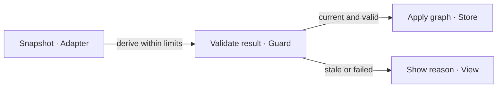
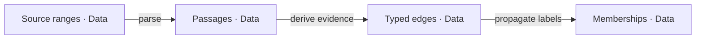
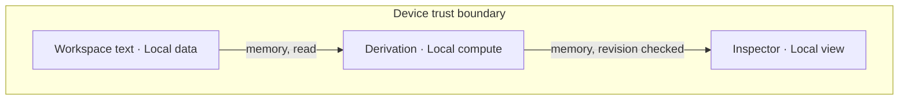

# Document nodes, relationships and evidence groups

`kg-node-cluster-edge@0.6.3` joins PRD, TAD, ADR, MVP and GTM. It adds local passage inspection,
source-backed relationships and connected lexical groups to existing document analysis. The core,
worker, panel component and revision-guarded graph layer are implemented and locally tested.
The original implementation merged in PR #1450. This increment completes inspectable provenance: method,
revision, paired source ranges and connected member-set identity. Current live UI proof remains separate
from production deployment and business outcomes.

## Planning record — 2026-10-01

| PRD-TAD-ADR-MVP-GTM | CID | RAO | Updated Date |
|---|---|---|---|
| `kg-node-cluster-edge@0.6.3` | C: G1–G8 expose reusable owners; E1–E2 establish baseline limits. I: make passage relationships inspectable with local bounded work. D: implement F1–F5 with original-source evidence and publish only through native lifecycle. | R: Document graph product function · A: Extend native derivation and inspection · O: Reviewable code, tests and joined specification · check: V1–V5, E3–E8 and exact release receipt | 2026-10-01 |

## Grounding — reference implementation

Baseline G is `agentic-graph@e8d8e9ab02b95697ed8e8682a04f3ba2b507a8fb`. G locators below refer to
that immutable revision. I locators refer to this admitted working diff, not a committed or delivered
revision. Current integration base B is `02e8ed01b7ae8ea262dddb7efcf524c09a35d845`; inspected
parser/source/parent contracts are unchanged from G. Bind the diff to its publication SHA. No sibling-repository source import or new dependency is introduced.

| ID | Exact source at G / export | Observed capability → decision |
|---|---|---|
| G1 | `canvas/src/lib/markdown.ts`: `parseMarkdownFrontmatter`, `parseMarkdownBlocks` | Metadata exclusion and ranged headings, paragraphs, code, tables and lists → reuse original block boundaries |
| G2 | `canvas/src/lib/parsers/markdownJsonLd.impl.ts`: `buildMarkdownJsonLd`; `canvas/src/features/parsers/markdownJsonLdBuilder.ts` | Existing document/media/reference graph → retain its behavior; no parser replacement or growth of the 1,335-line owner |
| G3 | `canvas/src/lib/graph/textAnalysis/utils.ts`; `canvas/src/lib/semantic-mode/keywordEvidence.ts`: `collectKeywordEvidence` | Native Unicode segmentation, normalization, bounds, source context and fallback policy → reuse token policy and original offsets |
| G4 | `canvas/src/lib/semantic-mode/keywordGraph.impl.ts`: `deriveKeywordGraphFromText` | Existing keyword graph, ranking and total-edge pruning → preserve keyword semantics; passage graphs have a separate input/output contract within native parsers |
| G5 | `canvas/src/lib/semantic-mode/keywordCommunities.ts`: `computeLabelPropagationCommunities`, `compressCommunityLabels`; `canvas/src/features/semantic-mode/densityClustering.ts`: `computeDbscanCommunities` | Bounded grouping exists; display compression can merge disconnected labels → reuse raw propagation, split induced components, omit isolates |
| G6 | `grph-shared/src/graph/types.ts` exported as `grph-shared/graph/types`; `canvas/src/hooks/store/graph-data-slice/graphDataDocumentActions.ts` | Shared graph shape and source ownership → additive derived layer through current graph store, no second store or mandatory cluster root |
| G7 | `canvas/src/features/panels/views/DocumentInsights.tsx`, `DocumentKeywordInsights.tsx`; `canvas/src/features/markdown-workspace/documentInsightsRuntime.ts` | Existing source registration, current-source navigation and keyword UI → reuse source owner and lazily extend the inspector |
| G8 | `canvas/src/__tests__/nativeDocumentAnalysis.test.ts`, `nativeDocumentAnalysisPanel.test.tsx`, `crossRepoBoundaryGuards.test.ts` | Independent native assertions and external-input guard → original synthetic passage suites plus runtime-fed validation |

| ID | Working-diff owner / exported interface | Behavior / verification |
|---|---|---|
| I1 | `canvas/src/lib/parsers/documentPassageGraph.ts`: `deriveDocumentPassageGraph`, `PassageGraphInput`, `PassageGraphResult` | Pure ranged projection, TF-IDF mutual neighbors and connected groups; V1–V3 |
| I2 | `canvas/src/lib/parsers/documentPassageGraphWorker.ts`: `analyzePassagesInWorker`; `canvas/src/workers/documentPassageGraph.worker.ts` | One worker per requested analysis, terminated on completion, cancel or timeout; V4 |
| I3 | `canvas/src/features/markdown-workspace/documentInsightsRuntime.ts`: `isCurrentDocumentInsightsSource`, `applyDocumentPassageLayer` | Current source/revision guard; preserve authored graph or fail without writing; V4 |
| I4 | `canvas/src/features/panels/views/DocumentPassageInsights.tsx`: default component | Lazy inspection, original text, relationship evidence, group members, source jump, explicit layers and expandable method/revision/range/group evidence; V5 partial |
| I5 | `canvas/src/__tests__/documentPassageGraph.test.ts`, `documentPassageGraphWorker.test.ts`, `documentPassageInsights.test.tsx` | 14 original regression tests; E6 |

The general analysis owner remains `GRAPH-NATIVE-TEXT-001@1.0.29` at B; this artifact owns only the
passage/relationship/group increment. It does not replace the product roadmap, invocation catalog or
release controller. Authoring follows [guidelines 3.4.0](https://github.com/huijoohwee/huijoohwee.github.io/blob/82835ac37d524643faa6b9703cb077ea9474ab15/guidelines/prd-tad-adr-mvp-gtm-guidelines.md)
and its CID 2.0.0, planning record 1.1.3, verification 1.3.2, readiness 1.1.0, process flows 1.4.1 and
canvas companions. START, ADLC, RELEASE and DEPLOY bind the runtime revision in frontmatter.
Consumer effect checks use the authenticated runtime pin, not an inferred latest version.

## PRD

**Zero:** document parsing and keyword analysis exist; passage relationship/group provenance lacked a
complete inspection contract. **One:** a reader can inspect a connection and reach its exact source
within three interactions and 60 seconds, while distinguishing authored structure from lexical overlap.
The target is a hypothesis for five voluntary sessions over 14 days after V1–V5 pass. It is not measured demand.

| Pain / status | Reader, buyer and workaround | Rank / outcome |
|---|---|---|
| P1 `unvalidated` | Researcher/operator manually reopens paragraphs to understand a connection; the same person could buy assisted setup | 1: explain a relationship and jump to its source; G1–G8 make this a small extension |
| P2 `unvalidated` | Reader compares original text to distinguish display groups from supported claims | 2: show method, member evidence and omissions |
| P3 `unvalidated` | Multilingual reader checks paraphrases manually when shared words are insufficient | 3: record lexical limits; defer learned matching until measured task failures justify it |

Value hypothesis: verify passage connections on the device. Beneficiary: reader and reviewer of their
cited work. First reachable user is the operator; reachable buyers and willingness to pay are unknown.
No claim of factual/causal reasoning, cross-language equivalence or validated customer pain is made.

| Story | Priority / pain | Observable behavior |
|---|---|---|
| F1 Locate a passage | Must / P1 | Original boundaries/ranges; metadata excluded; repeated occurrences distinct; V1 |
| F2 Explain a connection | Must / P1–P2 | Authored order/references distinguished from lexical inference; source evidence inspectable; V2 |
| F3 Inspect a group | Must / P2 | Authored sections distinct from computed membership; unsupported isolates ungrouped; V3 |
| F4 Recompute safely | Must / P1 | Bounded local work cannot overwrite a newer source or alter imported bytes; V4 |
| F5 Finish the review | Must / P1 | Native inspector, keyboard, narrow screen and warm-offline source navigation; V5 |
| F6 Learned/cross-document matching | Won't this increment / P3 | No embedding/model downloads, remote enrichment or entity linking; revisit after E-L1 |

**Source behavior.** Keep headings, lists, quotes, code, tables and media-associated source blocks.
Do not concatenate separated paragraphs or infer captions without evidence. Repeated text remains
separate occurrences. Media/link destinations are inert. Generic link-only notices are recoverable and
retained by default; exclusion affects lexical analysis only. Publisher, path, domain, title, passage
count and expected topic names never select behavior. The original document remains available.

**Relationships.** Preserve directed containment, source order and resolvable local references.
Unresolved/external links stay explicit and are never fetched. Each lexical edge exposes method,
revision, both source ranges, shared terms and a finite normalized score. Mutual top-k limits both
endpoints to k≤4; authored structure does not count toward that degree. Shared words establish overlap
only. Typed duplicate edges collapse; candidate pruning occurs before output materialization.

**Groups.** A computed group has stable member-set identity, member IDs, algorithm version and
extractive terms. Membership must be supported by connected lexical edges. Palette reduction must not
merge disconnected components. Singletons stay ungrouped. There is no target topic count or prescribed pairing.

### Product verification and completion criteria

| VCC / story | Named independent check | Result / remaining acceptance |
|---|---|---|
| V1 / F1 | I5 core source-range tests and E7 runtime input | Local pass: original slices, duplicates, CRLF, metadata exclusion, media/code/table/quote ranges and Unicode. Source digest unchanged. No automatic caption reconstruction claimed |
| V2 / F2 | I5 endpoint/degree/provenance assertions and E7 graph audit | Local pass: endpoints, authored direction, unresolved targets, finite scores and mutual bound. Counts are observations, never narrative golden answers |
| V3 / F3 | I5 disconnected/isolate cases and E7 equal-input runs | Local pass: connected member evidence, singleton omission and deterministic graph bytes across three runs. Semantic-quality benchmark remains open |
| V4 / F4 | I5 bounds, worker and explicit-layer tests | Local pass: invalid metadata/options, input/token limits, cancel/timeout termination, out-of-order/stale results, wrong source, authored nodes and authored edge dependencies. Production cache/migration evidence not claimed |
| V5 / F5 | I5 panel tests; E8 browser walkthrough and integrated UI | Partial: real worker, source/group navigation, layer actions, 360px layout and offline-session rerun pass. Actual-device accessibility, installed-app warm-offline and measured human completion remain open |

TTV includes opening an already available local document, selecting evidence and returning to source.
Measure app load, compute time and human task time separately. Compute target: p95≤3s across 20 bounded
documents on each declared browser/device profile. A few local timings cannot establish that target.
Cold installation and optional import/media viewing are separate prerequisites. A fetch trap is not
proof that the installed application works offline.

## TAD

### Native ownership and data contract

Dependency direction: portable graph/text contracts → I1 derivation → I2/I3 adapters → I4 view.
G1 owns block parsing; G3 owns token policy; G5 owns propagation; G6 owns graph state; G7 owns source
registration and navigation. I1 composes these owners without replacing G2 or adding a parser registry,
service, persistent database or sibling import. The oversized G2 does not change in this increment.

`PassageGraphInput` accepts opaque `documentId`, original `text`, optional `locale`, `k`, `threshold`
and `excludeLinkOnly`. `PassageGraphResult` returns existing `GraphData`, passages, groups, completeness,
reasons, segmentation policy and elapsed compute milliseconds. I1 has no filesystem, provider SDK,
network call, credential or effect grant. Node properties use `passage:*`; generated elements carry
`kind=document-passage`, `derived=true`, source identity and revision. Graph metadata records algorithm
version 1, options, token/step counts and groups. `visual:community` is a display projection of supported membership.

The revision uses the existing non-cryptographic text hash for local identity; it is not an authenticity
or security proof. IDs include document and source revision plus block occurrence index, preserving
duplicate text. Equal source/options/policy produce equal output; cross-edit identity stability is not
promised. UTF-16 offsets map directly to original text, including CRLF. Only uniquely resolved local
heading anchors create reference edges. Code references are ignored; external media is never fetched.

Lexical vectors use native segmentation/normalization and existing function-word policy. Code, tables,
media and explicitly excluded blocks retain structural nodes but supply no lexical vector. URL targets
and markup are removed from lexical input. I1 computes TF-IDF cosine, selects mutual top-k neighbors,
runs raw label propagation for at most 14 passes, then splits induced connected components. Group names
are extractive terms, not inferred semantic labels. Locale/fallback policy is disclosed with each run.

I3 applies only to the currently registered source object and matching source graph/revision. It removes
only that source's generated passage layer, retains authored nodes/edges and rejects identifier collisions.
If an authored edge depends on a layer node, replacement/removal fails instead of silently deleting it.
The inspector exposes method, both line/UTF-16 ranges and local revision per relationship, plus algorithm/segmentation and connected member-set provenance. The revision is labeled a change identifier, not authenticity. Details expand by keyboard and wrap at narrow widths.
Adding/removing a layer requires an explicit user action. New analysis clears old inspection results;
stale or cancelled work cannot apply. There is no new persistent cache to migrate.

### Bounds, failure and security

| Resource | Enforced ceiling / failure |
|---|---|
| Input | 60,000 UTF-16 units, 240,000 UTF-8 bytes; oversized input rejected before parsing |
| Metadata | 4,000 traversed nodes, depth 24; malformed/unclosed/over-budget frontmatter visibly rejected |
| Projection | 200 passages, 12,000 analyzed words, 2,000 total edges; omissions produce explicit partial reasons |
| Lexical graph | k≤4 at both endpoints, 120,000 candidate/reference/group traversal steps, 14 propagation passes |
| Compute | 10s core guard plus 10s disposable-worker deadline; cancel/timeout terminates worker; no synchronous fallback |
| Serving cost | Zero model calls, no new dependencies or service purchases; retained local storage/energy not measured |

Input and candidate bounds limit work as well as output; the step counter does not count every token
operation, so the worker deadline is also required. Excluded or truncated analysis never changes source
bytes. Partial status is visible. No automatic retries. A corrected input or explicit user action may
retry; stop after two unchanged failed attempts and diagnose the boundary.

Imported instructions/HTML remain inert. Render excerpts as escaped text; never activate reference
schemes or fetch media in analysis. Current-source guards protect navigation and graph application.
Computation capability grants no publication/payment/message authority. Missing worker support reports
unavailability. Installed-app offline precaching and production chunk sizes need separate build/runtime
receipts; no <500KB production-chunk claim is inferred from small source files.

### Five flows — reference implementation

The five diagrams project on the declared 2D D3 surface. Version 1 binds the role/feature contracts at
0.6.3. E3 checks parse projection only. Journey J1–J3 covers F1–F5; workflow W1–W4 applies F4 across
that journey; data D1–D4 supports evidence at J2; harness H1–H4 executes that request; topology T1–T3
binds all operations to the device. Browser integration still requires V5.

**Diagram KG-J1** · Class: User journey · Notation: flowchart LR · Version: 1
**Caption**: A reader follows one visible connection back to the original passage.

| Node | Responsibility / type | Feature |
|---|---|---|
| J1 | Source selection / Reader | F1 |
| J2 | Relationship and group inspection / Reader | F2–F3 |
| J3 | Source verification / Reader | F5 |

**Diagram KG-W1** · Class: User workflow · Notation: flowchart LR · Version: 1
**Caption**: Applying a derived graph requires the same source revision; failure preserves the document.

| Node | Responsibility / type | Path |
|---|---|---|
| W1 | Capture revision / Adapter | happy |
| W2 | Limits, cancellation and revision / Guard | all |
| W3 | Atomic derived application / Store | happy |
| W4 | Preserve source, disclose failure / View | alternate/error |

**Diagram KG-D1** · Class: Data flow · Notation: flowchart LR · Version: 1
**Caption**: Source spans remain attached through passage, relationship and membership derivation.

| Node | Owner / data | Lifetime |
|---|---|---|
| D1 | G1 / original ranges | source lifetime |
| D2 | I1 / passage projection | revision-bound |
| D3 | I1 using G3 / edge evidence | revision-bound |
| D4 | G5 / raw memberships | regenerable |

**Diagram KG-H1** · Class: Orchestration / harness flow · Notation: flowchart LR · Version: 1
**Caption**: One bounded local operation emits an observable result without an agent loop.

| Node | Responsibility / type | Limit |
|---|---|---|
| H1 | Validated request / Dispatcher | no automatic retry |
| H2 | G1–G5 / Executor | 14 passes; hard ceilings above |
| H3 | Bound/status checks / Observer | deterministic, zero model calls |
| H4 | G7 / Consumer | no effect authority |

**Diagram KG-T1** · Class: Runtime topology · Notation: flowchart TB · Version: 1
**Caption**: The active document and derived graph remain inside the device trust boundary.

| Node | Placement / type | Residency / connection |
|---|---|---|
| T1 | Device workspace / Local data | existing user storage; no new sink |
| T2 | Browser worker or headless adapter / Local compute | same-device memory; disposable worker implemented |
| T3 | Existing panel / Local view | same-device memory; remote media blocked in offline validation |

### Invocation register — reference implementation

| Surface | Owner / current support | Input, authority and next check |
|---|---|---|
| Pure local | I1 implemented; not a CLI transport | Typed text/identity/options; no network or filesystem effect; E6–E7 |
| Browser | I2–I4 and lazy parent insertion implemented | Existing active source; explicit graph-layer application; V5 |
| `/`, `@`, `#` | Native invocation catalog; no new binding | Reuse one capability identity; schema/catalog parity before exposure |
| MCP | Native tool catalog; passage tool deferred | Same pure handler, declared schema and caller authority; V1–V4 first |
| WebMCP | Embedded catalog; passage tool deferred | Same handler plus active-source boundary; V5/catalog parity first |

No speculative command is advertised. OS discovery/status and federation for this new capability
remain undocumented locally and at delivery. Existing host capabilities do not prove new surface parity.

### Deployment and rollback — reference implementation

Authoring is the registered lane; mirror is the generated-artifact stage; delivery is the public runtime.
Browser/device-local is primary. Headless core is testable with the installed runtime. Managed-edge
execution is deferred without proven need/quota eligibility; static hosting is a separate product concern.

| Boundary | Current authority / required evidence | Recovery |
|---|---|---|
| Source release | User authorized implementation; native exact candidate gates and provider receipt still required | Review/revert this increment; preserve originals and lane recovery bytes |
| Authoring → mirror | Closed: no promotion instruction; exact integrated SHA and generated checks required | Regenerate reviewed predecessor through native sync owner |
| Mirror → delivery | Closed: no production instruction; protected human authorization and same-candidate readback required | Protected release owner restores verified predecessor and reads live identity |

Native owners at G: `docs/collaboration-runtime-contract.md`, `docs/conflict-resolution.md`,
`scripts/release-common.mjs`, `.github/workflows/release.yml`, `docs/production-core-runtime-release.md`,
`docs/production-rollback-baseline.md`. RELEASE ends at provider handoff; merge/cleanup/sync/deploy are
separate effects. This code affects the application and needs a candidate-specific deployment disposition.
An absent disposition is not a no-deploy exemption. Derived graph layers can be explicitly removed only
when they have no authored dependents; rollback must preserve those dependencies for manual resolution.

## ADR

Constraints precede selection: FOSS/free tier, no overages, no runtime network/models, mobile browser
reach, bounded work and source preservation. Decisions rank existing reuse and measurable reader value.

| Decision | Alternatives / selected approach | Consequence, recovery and revisit |
|---|---|---|
| A1 Source units | Compose G1 blocks over fixed windows, caption guessing or another parser | Exact ranges and no dependency; G2 unchanged; revisit only with measured boundary failures |
| A2 Similarity | Native lexical evidence over hosted similarity; learned local models deferred | No paraphrase/cross-language promise; revisit after E-L1 exposes material unmet tasks |
| A3 Groups | Existing raw propagation plus connected-component split over new library/display compression | No forced topic count; regenerate derived version on regression |
| A4 Graph integration | Existing `GraphData` and source store over new database/root schema | Add/remove explicit derived layer, preserve authored dependencies; no source migration |
| A5 Identity | Document/revision/occurrence over content-only node identity | Duplicate passages survive; cross-edit stability not promised; source hash is not authenticity |
| A6 Execution | Disposable browser worker over current singleton's wait-only timeout | Abort/deadline stop computation; extra worker startup cost measured separately; unavailable worker fails visibly |
| A7 First-dollar route | Bounded assisted setup over subscription/new standalone product | Least new payment/hosting work; no demand or collected cash yet; E-L1 decides |

One new consumer does not justify a common package. Contract-only adapters need input/error/cancellation
parity checks. No imported model/library or paid offering is selected. Overall repository redistribution
rights remain unverified; local internal checks proceed, public redistribution waits for owner evidence.
A material contest triggers a recorded alternatives/evidence review before changing these decisions.

## MVP and sprint ledger

Dependency-closed slice: F1–F5 for one active source. S1–S4 are locally implemented, including the native parent inspector. S5 has local evidence,
not complete product acceptance or release parity.

| RAO step / role | Action → result | Check / state |
|---|---|---|
| S1 / Document engineer | Compose G1/G3 → ranged occurrence projection | I1; V1 local pass |
| S2 / Document engineer | Reuse G5 → typed evidence and connected memberships | I1; V2–V3 local pass |
| S3 / Workspace engineer | Terminate bounded work and guard explicit layer apply | I2/I3; V4 local pass |
| S4 / Interface engineer | Extend native inspector → inspect and return to source | I4 plus G7 parent; provenance and full-app narrow-screen journey pass; device/pilot proof partial |
| S5 / Independent checks | Original fixtures plus external runtime input → criterion receipts | I5/E3–E8; release/integrated-device evidence remains open |

Implementation sprint announced: 60 active minutes, at most eight production modules and 40KB added
production source; no dependencies/models/paid execution. Current production footprint remains six files, below the added-source byte cap; each new file is below 600 lines. Documentation has its own one-file <40KB/<600-line
cap; temporary validation stays outside the repository. Installed modules are reused through ignored
symlinks. CI registration extends the existing native-analysis scope.

This revision refreshes the original two-sprint estimate against completed work. Remaining local work:
one ≤30-minute bounded verification/integration sprint, same cumulative production byte/module caps. Current scope is the existing inspector, its test and this document; no new module or dependency.
The coordinated writer blocker was resolved through native source closeout. Provider CI/review waits
have no completion ETA. Do not expand
scope to redesign unrelated renderer/layout code. Authoring tokens, energy and billing are unmeasured;
zero product inference tokens is a separate measured design property, not a claim of free authoring.

Demo plan (unrecorded): 10s open a source connection, 10s select a passage, 15s inspect relationship and
group evidence, 20s jump to the original lines, 5s show completeness/source identity. Human time targets
remain unproven. Do not label a test-host demonstration as the installed-product journey.

## Evidence and validation — reference implementation

External validation enters only through `AG_TEST_VALIDATION_FORBID_HARDCODE_IN_REPO`; text, path,
publisher identifiers and expected topic answers are not repository fixtures. Independently authored
synthetic tests vary topics/languages. Temporary receipts stay outside the repository and are not runtime
dependencies. Set `KG_PROBE_SCRIPT`, `KG_PASSAGE_PROBE`, `KG_BROWSER_PROBE`, `KG_PLAN` and
`GUIDELINES_ROOT` to the operator-held local artifacts/checked source before invoking these checks.

| Evidence | Command / observed result | Scope and limit |
|---|---|---|
| E1 | `env TSX_TSCONFIG_PATH=canvas/tsconfig.json node --import tsx --test canvas/src/__tests__/nativeDocumentAnalysis.test.ts` → 6/6, 522ms | Baseline native analysis, not new feature acceptance |
| E2 | `env TSX_TSCONFIG_PATH=canvas/tsconfig.json node --import tsx "$KG_PROBE_SCRIPT"` → three identical baseline hashes; max keyword degree 9; four edgeless raw labels compressed to two display labels | Motivates mutual-degree bound and raw groups. No article-specific golden counts |
| E3 | `node "$GUIDELINES_ROOT/scripts/check-diagram-canvas-render.mjs" "$KG_PLAN"` → version 0.6.3: five projections, 18 nodes, 8 edges, one cluster, zero findings | Parse-only, not UI proof |
| E4 | Native `policy.boundary.forbidHardcodedRuntimeValidationInput` with environment-fed input → pass | Native unit runner: 1/1 pass; scans tracked/untracked text. No corpus copied |
| E5 | `npm run check --workspace=@agentic-graph/canvas` and `npm run ci:affected` → exit 0; 10/10 native owner checks pass | Expanded plan passed: native/new suites, no-hardcode guard, canvas and collaboration checks; standard partition 83.46s. Native receipt `validation-7cb484d9628a9cb44e83c888` |
| E6 | `env TSX_TSCONFIG_PATH=canvas/tsconfig.json node --import tsx --test canvas/src/__tests__/documentPassageGraph.test.ts canvas/src/__tests__/documentPassageGraphWorker.test.ts canvas/src/__tests__/documentPassageInsights.test.tsx` → 14/14, 4.09s | Source/edge/group invariants, bounds, cancel/timeout, current-source UI/layer and native-parent reachability; no production parity |
| E7 | `env TSX_TSCONFIG_PATH=canvas/tsconfig.json node --import tsx "$KG_PASSAGE_PROBE"` → 33 passages, 60 edges, two groups, max lexical degree 2; three equal graph hashes; 27.42/3.47/3.56ms | Observations only; no target counts. Input unchanged, zero fetch attempts, endpoint/range/group-connectivity assertions pass |
| E8 | `node "$KG_BROWSER_PROBE"` → 33 passages; selected line 23; client/scroll width 360/360; no page errors or outbound requests | Chrome test host at 360px. Full app at 1100px also passes Editor Workspace → inspector → worker → source jump → add/remove 33 nodes; source/existing graph preserved, no page errors or inspection network requests. Installed offline remains open |

E7 input digest: `2b7b80572915e0d46179af242000869dc131dd3e0183c8e43415405703d655fd`;
graph digest: `1d5e8ac2ce11a32631f032d43e24a3112537db6797828729f50f28c033ed1ad6`.
The declared import digest matches neither current whole-file bytes, body bytes nor trimmed body.
Cause is unknown; do not change the source or assert original authenticity. Original import verification
waits for its artifact owner; behavior on observed bytes remains reproducible.

| Validation class | Independent oracle / disposition |
|---|---|
| Source | Slice original bytes/ranges; duplicate IDs distinct; metadata excluded; V1 failures fixed in native owner |
| Edges | Check endpoints, finite scores, degree at both ends, typed dedupe and inert references; no narrative expected answers |
| Groups | Connected induced memberships, isolates ungrouped, deterministic repeated runs; semantic-quality experiment separate |
| Robustness | Invalid metadata/options, bounds, cancellation, late results, authored dependencies, fetch rejection; explicit failure/partial state |
| Reach | English/Malay/Mandarin and native/fallback segmentation tested; actual phone/desktop assistive use and installed offline remain open |
| External input | Environment-only input, unchanged digest, invariant assertions, no repository text/path literals; E4 guards future changes |

## GTM

`mechanism-proven: false`; `demand-validated: false`. No observed revenue or payment. A passing graph
test, document, demo or cost avoidance is not a collected first dollar.

E-L1, after V1–V5: invite up to five authorized reachable researchers to a local verification task and
USD 1 assisted setup offer. Invitations/payments need separate authorization; no messages or charges
are sent by this implementation. Pre-register baseline task time, completion without help, willingness
to pay, delivered assistance, cash, fees and support minutes. Observe 14 days. Continue if ≥3 finish and
≥1 independently pays for delivered assistance; revise if task value exists without purchase; stop on
source/privacy failure or zero completions. These thresholds are hypotheses.

| Rank / phase | Pain → reused solution → next outcome | Stop/recovery |
|---|---|---|
| 1 / R0–R1 | P1/P2 → current parser/inspector plus S1–S5 → source-verification MVP | V1–V5 first; preserve source and remove/revert derived increment on regression |
| 1 / R2 | P1 → bounded assisted setup → first priced learning receipt | Authorized participant response is an external wait; recheck at response/window close |
| 2 / R3 | Repeat demand → optional host-product service | No subscription/infrastructure purchase without validated need |
| 3 / R4 | P3 or measured integration pain → learned matching/standalone option | Deferred; compare task benefit, rights, footprint and free-tier constraints first |

Market size is unknown. Bottom-up method: authorized reachable users × evidenced annual purchase
frequency × price. Top-down method: independently bound the relevant workflow market and reachable
share. Neither has sourced inputs; TAM/SAM/SOM are unknown, not zero. Local use has no chosen
sales jurisdiction; terms/jurisdiction require owner review before offering sales.

Browser-local has no required model/service purchase; device storage/energy/download/support remain
unmeasured. Headless checks reuse installed runtime and local hardware. Managed edge is deferred without
quota/cost evidence; no overage exposure is accepted. Contribution = collected cash − transaction fees −
incremental service costs − support labor at an explicit rate. Record currency, tax, settlement date and
fulfilled performance separately from recognized-revenue claims.

Capital choice is bootstrap, no external ask. Linked statements, Base/Downside/Upside scenarios and
cash-floor runway are deferred until evidenced inputs; this is an incomplete discovery economics sketch.
Public deck, business plan and financial model are deferred together; no audience handoff depends on
these projections. Product operator owns delivery, existing issue intake and rights/privacy review.
Capacity/response times are unknown. No supplier/hiring commitment is implied.

## Coverage and findings

Coverage binds `kg-node-cluster-edge@0.6.3`; it records disposition, not VCC acceptance. Roles:
P = Product function, E = Engineering function, O = Product operator.

| Domain | Disposition / artifact | Owner / next evidence |
|---|---|---|
| C01 Customer/pain | covered / PRD | P: E-L1 validates P1–P3 |
| C02 Market | deferred / GTM | P: source both methods after reachable-user evidence |
| C03 Value/alternatives | covered / PRD, ADR, GTM | P: A1–A7 and priced response |
| C04 Product | covered / PRD | E: V1–V4 local; V5 remains partial |
| C05 Architecture/data | covered / TAD | E: G/I owners, five flows, typed contract |
| C06 Quality/security | covered / TAD, evidence | E: E6–E8; actual-device/offline gaps |
| C07 Decisions | covered / ADR | E: A1–A7 and revisit triggers |
| C08 MVP/delivery | covered / MVP | E: S1–S5; parent/CI wired; release pending |
| C09 GTM | covered / GTM | P: acquisition/activation/payment experiment; retention unknown |
| C10 Operations | covered / GTM, rollback | O: support capacity during first pilot |
| C11 Legal/risks | covered / ADR, GTM | O: rights, terms and jurisdiction before redistribution/sales |
| C12 Finance | deferred / GTM | P: unit inputs, linked statements/scenarios after priced pilot |
| C13 Capital | covered / GTM | O: bootstrap; revisit only on evidenced capacity need |
| C14 Lifecycle | covered / TAD, handover | O: exact native source/deploy/runtime receipts |
| C15 Audience projections | deferred / GTM | P: same-revision deck/plan/model before audience handoff |
| C16 Learning | covered / GTM | P: threshold outcomes in successor Context |

Dispositioned domains 16/16; covered 13/16; deferred 3; not-applicable 0. Exhaustive artifact-bearing
rule coverage and advisory counts remain unaudited; this is not a full conformance baseline. The five
flows cover the feature contract; E3 reports parse projection separately from runtime behavior.

| Finding Type | Severity | Rule anchor | Artifact / evidence | Remediation |
|---|---|---|---|---|
| `pain-point-not-validated` | major | `pain-point-to-feature-mapping#3` | P1–P3 remain unvalidated | P: authorized E-L1 observations and timings |
| `unimplemented-guideline` | major | `validation-checklist#1` | V5 actual-device/offline proof incomplete | E: actual-device/offline walkthrough and exact runtime receipts |
| `unimplemented-guideline` | major | `autonomous-implementation-verification#2` | Complete applicable-rule/advisory coverage not audited | P: enumerate and link obligations before baseline sign-off |

Unchecked finding types are not assigned zero. Local rung remains `spec-complete`; delivered rung is
`undocumented`. Local code/test completion does not advance overall runtime or universal-surface readiness.

## Handover — reference implementation

I1–I5 and source-preserving layers merged in PR #1450 as
`750130d1f3358b413d22b0cfbc9c9c38e6c21503`; PR/main runs `36822204072`/`36823077124` passed.
Native recovery preserved its checkout. CI tooling subsequently merged as B; main run `36824327295`
passed and Dev was certified.

This increment exposes provenance already retained by the graph: expandable method, revision, paired
ranges and connected-group identity in I4, with independent synthetic range checks in I5. Live source
jumps passed before editing. Native publication binds the diff to its reviewed SHA.

E9: full-app browser, admitted checkout, external runtime input and real disposable worker:
33 passages, 60 relationships, two connected groups. Keyboard selection, group navigation, source
jumps and explicit add/remove actions passed. Method/revision/ranges matched the source. At 360px,
the inspector client/scroll widths both measured 300px; references contained zero active links.
Screenshots and observations are retained outside the repository. Production-mode build and PWA
HTML-ownership checks passed. With browser networking disabled, a fresh worker rerun completed and
source navigation passed; networking was restored. This proves a loaded offline session, not offline
reload, installed PWA, physical-device or assistive-technology acceptance.

The environment-fed probe passed three equal graph hashes, unchanged input and zero fetch attempts.
The focused panel suite passed 4/4 in 1.99s. Initial native affected validation passed in 71.69s with
three selected owner checks captured; this is affected coverage, not full-suite parity. The final source
check and protected publication receipts are recorded by native release and private handover owners.

Production remains the separately authorized retention revision `d3a6a3bbc17e626fa37b33029ebb9fb1a655b1ac`
from run `36818672753`; it does not include this feature. No external input text/path, private reference,
dependency or paid service is added. Document graph product function owns remaining V5 device/PWA/
accessibility checks and E-L1. Refresh on source/schema/guideline drift; production needs exact authority.

## Viewer control recovery — reference implementation

PRD: a researcher must be able to inspect and configure a document table with the Canvas pane hidden.
The reported regression made Layout, Group, Filter, Sort and Properties appear inert in Viewer-only
workspaces. Search retained its local behavior. This applies to every Markdown table, including
import inventories, without source-domain or path branches.

TAD: `canvas/src/pages/Canvas.tsx` retains the existing toolbar host while the editor is open;
only its visible Canvas controls are hidden. `ToolbarMenuLauncher.tsx` portals the same lazy floating
panel to the document body, outside the hidden toolbar. The existing data-view binding, settings,
query state and document mutation contracts remain the owners. Explicit toolbar interaction activates
its own table binding; passive previews may update their registration but cannot take that selection.
Unmount releases it to a live registration. No new dependency or network work.

ADR A8: keep one event/bridge owner and one lazy settings surface. A second Viewer-specific settings
panel would duplicate bindings and mutation behavior. Revisit if the workspace needs a different
application-root overlay host. Rollback is the two owner changes together, preserving document data.

MVP: reproduce with Canvas unchecked; open Layout, Group, Filter, Sort and Properties; switch Table
and Kanban; close and reopen; reload and repeat. The component regression mounts the real launcher
inside a hidden host, requests View, checks that its panel escapes the host, and verifies close.
The same test checks two competing bindings, passive rerenders, repeat activation and unmount
fallback. The existing toolbar unit entry awaits these regressions. Live checks and native affected results are
recorded in private evidence and the release receipt; no external validation corpus is committed.

GTM: restore the current inspection workflow before adding features or paid services. Success means
a visible, usable settings response with Canvas hidden and unchanged imported records. This repair
makes no claim about adoption, payment, production delivery, or untested device coverage.

## Kanban action recovery — reference implementation

PRD: a document-table user can add a record between cards or at the end of a group,
add from the group header, and open card actions. These controls must be reachable
by pointer, keyboard and a touch device without hover, across all document sources.

TAD: `styles/markdown-kanban-actions.css` owns hidden, hover, focus and coarse-pointer
states in one component cascade layer. `KanbanGroup`, `KanbanCard` and
`KanbanNewRecordDividerRow` retain their existing callbacks and mutation checks;
they no longer supply later-layer utilities that override the reveal state.
There is no additional JavaScript, dependency, data write, fetch or per-card listener.

ADR A9: repair the shared CSS owner instead of adding event-driven visibility state
or overriding utilities with important declarations. Non-hover/coarse pointers show
actions persistently; fine pointers reveal on hover or focus within. Rollback reverts
these presentation changes together and leaves document records intact.

MVP: in the running Viewer with Canvas hidden, verify a hovered divider is opaque
and hit-testable, creates a temporary record with its group preselected, then removes
only that test row through the source editor;
verify card actions, group-header add, keyboard focus and emulated non-hover input.
Run affected checks and existing Kanban contracts. Browser evidence stays private;
emulation does not establish physical-device or full accessibility acceptance.

GTM: recover the existing authoring workflow within a six-file, 20 KB first-pass
budget. Acceptance is usable controls with unchanged inventory counts. Revenue,
production delivery and untested devices remain separate evidence requirements.

## Compact selectable divider — reference implementation

PRD: add-record affordances occupy less space between cards while remaining visible
to selection tools, pointer activation and keyboard focus. Apply the same shared
button to every source. Hover reveals only the insertion position under the pointer;
keyboard focus reveals only its own divider. No generic wrappers or hidden decoration.

TAD: `WorkspaceDataViewNewRecordButton` renders its divider as a native button with
one labelled SVG image; line, circle and plus route activation to that button.
`markdown-kanban-actions.css` reduces the fine-pointer inter-card space from 60 to
32 CSS pixels (24-pixel control and two four-pixel gaps). Non-hover/coarse pointers
retain visible 44-pixel targets. Each native list item owns hover/focus reveal of its
child button; lane/header hover cannot reveal other dividers. Mutation callbacks remain.

ADR A10: use semantic vector content, avoiding extra interactive descendants,
pseudo-element hit surfaces, per-record state or new dependencies. Keep the list item
hit-testable while its child button is hidden so local hover can reveal it. Rollback reverts
the shared presentation changes; stored records and import receipts are unaffected.

MVP: measure card spacing and hit-test the line, circle and plus in live Dev, inspect
the named button/image and absence of hidden wrappers, and check keyboard focus and
44-pixel touch emulation. Verify neighboring dividers stay hidden on local hover/focus
and header/card hover reveals none. The query-workbench contract rejects broad reveal;
the mounted regression verifies independent semantic rows and graphic-part activation.
GTM: improve scan density without losing discoverability; preserve inventory counts.
Physical-device accessibility, paid adoption and production delivery need separate proof.
