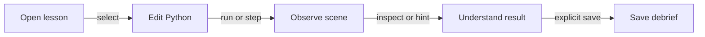
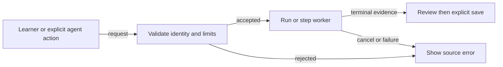
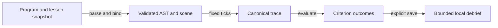
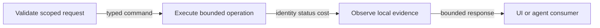
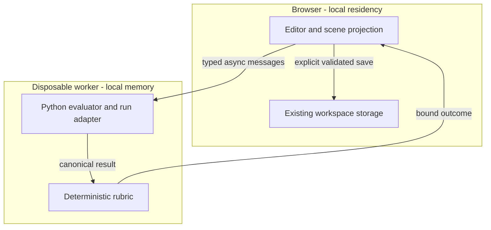

# Reference implementation - Offline Python Learning Workspace

## Identity and authority - reference implementation

**J1 = OFFLINE-PYTHON-LEARNING-WORKSPACE-001@1.0.0.** All five roles and projections consume this join. This fresh proposal specifies Python source in the existing Editor Workspace, a Python pane immediately after `bin`, and bundled offline visual lessons. Earlier task-local proposals remain historical alternatives; accepted native contracts remain authoritative. No prior bytes are removed.

**0:** editor, scene, simulation and storage owners exist; integrated Python learning and buyer demand are unproven. **1:** one learner completes and saves three lessons offline on one tested candidate within a 15-minute observed session. Product acceptance, first net collected dollar and repeat demand require separate evidence.

**DIR-01:** Context = G1-G9 and the user's authoring request; Intent = connect code to visible effects through native owners; Directive = specify bounded execution, original lessons and verifiable acceptance. Role/Subject = product engineer; Action/Verb = specifies; Outcome/Object = J1 with criterion-owner-check joins. No copied code, prose, assets, branding or curriculum; no external product dependency.

Authority: [authoring guideline][guideline] v3.1.0 and its pinned companions: Templates 1.2.0, Verification 1.2.0, Process/Flows 1.3.0, Readiness 1.0.2, Economics 1.0.3, Selection 1.0.0, Venture 2.1.0, Diagrams 1.1.2, Canvas Render 1.0.2. OS START/ADLC/RELEASE own lifecycle; product runbooks own deployment. This task generates a specification; proposed implementation requires an applicable scoped instruction, not authority inferred from this document.

## Codebase grounding - reference implementation

Inspected source on 2026-09-22: Graph **b242ab5d82c49155808a86b45565c797f8e04f61**, Canvas **997ecfe8ed4e779eba3bd3d6a0b70b7254a2d4a0**, OS **e0a07e9b594285b409b9a4192e3d208a3ebbf446**. Paths are Graph-relative unless qualified. Source observations do not prove runtime readiness; recheck ownership/head before implementation. Prefix `W` below means `canvas/src/features/markdown-workspace/`.

| ID | Observed input / status | Native disposition |
|---|---|---|
| G1 | `W/MarkdownWorkspaceToolbar.tsx`, `W/main/types.ts`, `W/main/layout/MarkdownWorkspaceLayout.tsx`; confirmed composable pane controls | Extend availability/visibility with Python after bin (Binary Model); reuse workspace. |
| G2 | `W/main/editor/MarkdownEditorPane.tsx`, `W/main/useWorkspaceDocumentState.ts`, `canvas/src/lib/monaco/MonacoTextEditor.impl.tsx`; shared language/URI editor, no Python lazy contribution | Reuse model, save and diff; add language contribution and source binding. |
| G3 | `canvas/src/features/parsers/python/index.ts`; confirmed graph parser | Execution capability absent; never treat parsing as a sandbox. |
| G4 | `ecs/world.js`, `ecs/worldTick.js`, `canvas/src/features/three/xrPhysicsModel.ts`, `xrSceneLibrary.ts`, `canvas/src/features/agentic-ecs/xrAuthoringEcsRuntime.ts`; native World, kinematics and render projection | Add learning adapter; deterministic educational composition still unverified. |
| G5 | `canvas/src/features/game-flight-sim/flightSimReplay.ts`, `flightSimTrainingRuntime.ts`, `flightSimDecisionStore.ts`; replay, grade and save patterns | Reuse patterns; robot rubric remains learning-owned. |
| G6 | `canvas/src/features/agent-ready/webMcpToolRegistry.ts`, `webMcpRuntime.ts`, `flightSimWebMcpTools.ts`; `canvas/src/features/workspace-fs/workspaceFs.ts` | Existing fences, registry and local persistence; new learning contract unimplemented. |
| G7 | `canvas/src/lib/three/offlineModules.ts`, `scripts/production-service-worker-profile.mjs` | Extend installed-source/cache owners; full learning cache closure unverified. |
| G8 | Canvas `docs/FACTS.md`, `docs/TOOL-SEARCH.md`, `docs/HARNESS-CONTRACTS.md`; OS invocation/lifecycle guides | Canvas owns guidance, Graph product/runtime, OS invocation/lifecycle; no duplicate interpreter or grader. |
| G9 | User request and selected conversation direction | Python beside bin and offline scenes are proposed intent; pain/WTP and device performance unverified. |

Language reference: [statements][py-simple], [control structures][py-compound], [expressions][py-expressions]. Pin an exact local Python oracle before conformance acceptance; references supply semantics, no copied implementation or runtime fetch. Pygame-style simulation, Tk-style controls and SQLite-style persistence are capability inputs: reuse native scene/UI/storage owners. Desktop packages, their APIs and a new SQL store are outside the browser MVP.

## PRD - reference implementation

### Pain, user and value

User/beneficiary: beginning programmer practising procedures through visible robot motion. Buyer hypothesis: independent tutor/facilitator needing repeatable exercises and feedback. Workaround hypotheses: separate coding tools, manual setup and facilitator debugging. No quote, ticket, observed session or payment validates these yet.

| Pain / status | Hook | Break | Fix / Must | Close | Reuse/build economy |
|---|---|---|---|---|---|
| P1 setup/context switching / unvalidated | Open lesson | Disconnected code/scene | F1 editor, F3 scene | See an edit's effect | G1/G2/G4 plus pane/adapter |
| P2 opaque failure / unvalidated | Predict motion | No bounded source step | F2 execution, F4 assessment | Explain failure and retry | New evaluator/rubric, existing World |
| P3 connectivity/data loss / unvalidated | Practise offline | Missing assets/progress | F5 continuity | Reload saved work | G6/G7 extensions |
| P4 unreliable assistance / unvalidated | Request hint | Advice and grade disagree | F6 shared assistance | One measured verdict | Existing registry, same rubric |

WTP is unknown, so no payer ranking is established. F1 is nearest to built functionality; F2/F3 remain essential for fidelity despite larger uncertainty. ROI heuristic = impact x reach / (build hours + monthly TCO + token cost); inputs and results are unmeasured for every tier. This is not a currency return.

### Experience

Learner story: edit `.py`, observe/step a scene, request hints and save a debrief to connect procedures with outcomes. Facilitator story: each worked solution passes the public rubric. Assistant story: inspect bound evidence without implicitly editing, executing or saving.

Pane order: `Explorer | bin | Python | JSON | Markdown | ... | Canvas`. Reuse native pane toggles; Python can coexist with Canvas/Markdown. Selecting `.py` opens Python without execution or conversion. Other file types show an accessible unavailable reason; New Python File uses Explorer. Markdown lessons link to `.py` and local scenes; executable Markdown fences are excluded.

Desktop default: Python + Canvas, lesson available in Markdown. At 375 px, Code/Scene/Lesson switches retain cursor and run state. Run/Step/Stop/Reset live inside Python with diagnostics/output. Shared undo, save, diff, keyboard and focus conventions remain. Reset clears the active simulation, preserves source and saved debriefs; deletion remains a separate existing action.

### Acceptance and metrics

Each AC is its VCC: verify the stated end state using Q and constraints. Q1-Q7 are future checks, not passing evidence. Each binds J1, exact program/lesson/scene/runtime identities and device/browser.

| Feature / pain / AC | Given -> when -> then | Check / constraints | TAD / ADR |
|---|---|---|---|
| F1 / P1 / AC1 | Existing .py -> select/edit/save/reopen -> Python follows bin, exact bytes/model identity retained, zero implicit execution | Q1 desktop/375 px keyboard/touch and storage integration | T1,T5 / A1 |
| F2 / P2 / AC2 | Supported program -> Run or Step -> identical terminal output/state; invalid/unsupported syntax identifies span; runaway stops visibly | Q2 every supported construct, arithmetic/scope, negatives/caps and host denial | T2,T3 / A2 |
| F3 / P1 / AC3 | Installed scene -> execute motion/sensors -> visible goals pass/fail; three seeded runs agree | Q3 three lessons, canonical replay; no provider/CDN/map requests | T3,T4 / A3 |
| F4 / P2 / AC4 | Any bundled lesson -> run worked/incorrect answers -> correct passes and incorrect fails the same public rubric; staged hints explain evidence | Q4 solvability, negative answers and identity; no solution auto-apply | T4 / A3 |
| F5 / P3 / AC5 | Verified install -> disable network/reload -> code, scenes, lessons, controls and saved debrief work; failed save/upgrade preserves prior valid version | Q5 offline reload, quota/corruption, export/import and recovery | T5,T6 / A4 |
| F6 / P4 / AC6 | Bound run -> UI/tool inspect/control -> same result; stale/cancelled request cannot affect another run; absent tool API leaves UI usable | Q6 schema, scope, deadline, supersession and zero model calls | T7 / A5 |
| All / P1-P4 / AC7 | Complete installed slice -> three-lesson session -> target time, usable controls, visible identities and AC1-AC6 pass | Q7 timed browser/mobile/accessibility/bundle/license proof | T1-T7 / A1-A5 |

Targets below are estimates, not outcomes; baselines are unmeasured. Observe first acceptance run and five subsequent pilot sessions.

| Metric | Target after installation | Check |
|---|---|---|
| TTV F1 | Open/edit/save <=3 actions, 60 s | Q1 timer/event log |
| TTV F2 | Edit/run/inspect <=3 actions, 90 s, excluding reading | Q2/Q7 |
| TTV F3 | Select/run/observe <=3 actions, 60 s; first frame <=3 s | Q3 |
| TTV F4 | Inspect/hint/retry <=3 actions, 120 s | Q4 |
| TTV F5 | Offline reload/open <=2 actions, 30 s | Q5; uncached install excluded |
| TTV F6 | Inspect/hint <=2 calls, 2 s per acknowledgement/read | Q6; run duration separate |
| Session | <=15 min; >=4/5 pilots complete without facilitator editing | Q7; directional, not efficacy proof |
| Responsiveness | p95 active input <=100 ms; Stop acknowledgement <=250 ms | Q7 recorded desktop/midrange-mobile profiles |
| Cost | Core 0 model calls/provider fees by design; actual total TCO unknown | Q5/Q6 traces; developer/device/support separate |
| Readiness | Runtime-ready only after AC1-AC7; delivered rung needs delivery evidence | Evidence/boundary registers |

**MoSCoW:** Must F1-F6+AC7. Should further import/export hardening and accessibility study. Could blocks generating the same Python and a local lesson builder. Won't: unrestricted Python/packages, desktop GUI distribution, new SQL store, remote maps/execution, physical robot control, cloud AI, accounts/rosters, paid infrastructure, accreditation or LMS. Structured-command-only or trace-only delivery does not satisfy this slice.

## TAD - reference implementation

### Components and contracts

Consumes PRD J1. Dependency direction: editor/tool adapters -> controller -> evaluator -> simulation capabilities -> native World. Renderer/grade consume canonical snapshots; persistence consumes validated explicit-save records. No adapter owns a second grader or engine.

| ID / responsibility | Origin and owner | Interface/configuration | Local / delivered |
|---|---|---|---|
| T1 source editor | Enhance G1/G2 workspace/Monaco | File key/model, pane state, lazy Python, source diagnostics | spec-complete / undocumented |
| T2 language evaluator | Proposed new `canvas/src/features/python-learning/`; G3 remains graph-only | Typed AST/value evaluation, worker protocol, subset/limits | spec-complete / undocumented |
| T3 run controller | Learning adapter over G4 | Fixed ticks, typed commands/sensors, cancellation, bounded trace | spec-complete / undocumented |
| T4 lessons/assessment | Learning domain; G5 serialization patterns | Versioned starters/solutions/hints/scenes, pure shared rubric | spec-complete / undocumented |
| T5 persistence | Enhance G6 source/Decision adapters | Existing .py storage; validated bounded debrief; explicit save/export | spec-complete / undocumented |
| T6 offline admission | Enhance G7 asset/service-worker owner | Version membership/digests, readiness and retained-version recovery | spec-complete / undocumented |
| T7 assistance | Extend G6 registry/fences; G8 documentation owners | One operation contract, schema/identity/action policy | spec-complete / undocumented |

These rungs describe the proposed learning feature, not existing subsystem maturity. Files stay <600 lines; chunks <500 kB. Extract a cohesive responsibility if an affected owner is already near budget.

### Language, simulation and isolation

User label: **Python - supported learning subset**. Actual Python execution semantics are required for supported constructs; valid unsupported syntax reports `UNSUPPORTED_SYNTAX` and span. Do not silently translate it into another language. A2 remains provisional pending an independent conformance/feasibility result.

| Surface | Proposed supported behavior |
|---|---|
| Values/operators | Integers, finite floats, booleans, bounded strings, None; parentheses, unary +/-/not, + - * / // %, comparisons, short-circuit and/or. Caps raise resource errors, never numeric coercion. |
| Statements | Indentation/comments, single-name assignment, call, if/elif/else, for-range, while, break/continue/pass, top-level def with positional parameters/return. Supported scope/evaluation order matches the pinned oracle. |
| Built-ins | Allowlist range, print, abs, min, max; typed arity errors. No unbounded iterable materialization. |
| Excluded | Imports, classes, recursion, nested definitions, arbitrary indexing/attributes, comprehensions, async, decorators, exception handling, exponentiation and package APIs. |
| Simulation calls | Proposed `drive(speed,ticks)`, `turn(degrees)`, `distance()`, `at_goal()`; units m/s, positive ticks, degrees, metres, boolean. Exact bounds/returns must close in T3 before baseline. |
| Run/Step | Freeze source on start. Step completes one executable statement; motion advances its fixed ticks before completion. Show source line/tick; Run and Step terminal evidence agrees. |
| Capability boundary | Disposable worker evaluates AST, never eval/Function/dynamic import. No network/filesystem/DOM handles. Worker alone is not a sandbox: validate messages, allocations and all exposed capabilities. |

Provisional limits: source 32 KiB; AST 4,096 nodes/depth 32; 50,000 evaluator steps; call depth 16, recursion rejected; 256 variables; strings 4,096 characters; integers 1,024 bits; output 64 KiB; 7,200 ticks at 60 Hz; trace 1 MiB. Check intermediate allocations, not just final values. One active run/worker per workspace; no fan-out; active compute 5 s, paused lifetime 15 min, cooperative batches <=8 ms. Terminate worker if cooperation fails.

Hidden tabs suspend visibly; revalidate identity on resume without claiming real-time timer guarantees. Stop, file/lesson switch, workspace disposal and superseding Run fence late events and dispose the prior World. Inputs causing overflow, unsupported host access or indefinite execution fail visibly.

### Identity and data lifecycle

Protocol v1 request: `{operation,workspaceId,documentId,sourceDigest,lessonId,lessonRevision,sceneDigest,runtimeRevision,seed,expectedRunId,requestId}`. Start includes code matching its digest. Controller issues runId/generation; events carry matching identity, monotonic sequence, span, tick and typed payload. T3 defines canonical numeric serialization and seeded order; wall time cannot affect outcomes.

States: idle -> validating -> ready -> running/paused -> completed/failed/cancelled. Reject invalid starts before World allocation. Stop is idempotent; Reset creates a fresh run without deleting source/history. Editor changes mark old results historical, never current. Wrong identity, duplicate/late/oversized events fail closed. Error families: invalid-input, unsupported-syntax, runtime-error, limit-exceeded, cancelled, stale-input, asset-unavailable, persistence-failed, unsupported-platform; all actionable with applicable spans.

Store source in existing workspace files. Explicitly save completed/failed debriefs as validated Decisions: run identities, seed, criteria, score, hint stage, timestamp/version. Interpreter/frame state is ephemeral; trace export is bounded and explicit. No learner/classroom identity or automatic code upload. Quota/eviction failures disclose missing durability and offer export. Multi-device means portable files and validated import, not automatic sync/parity. Import never executes.

The bundled first-lesson worked example is discoverable from Source Files and creates an editable local `.py` file only when opened. An authenticated learner may explicitly upload Markdown or Python text as a shared workspace snapshot, with remote read-back; download retains conflicting local bytes under a distinct name. Python snapshots do not invoke the canonical GitHub document-save bridge, and no background code upload or cross-device parity is implied.

The lesson stage uses the existing full Canvas renderer and its orbit, pan, and zoom controls beneath the Editor overlay. Resizing the Editor does not resize the Canvas. A file-specific icon at the right edge of the shared toolbar reopens Python code; no lesson-only Canvas or gesture owner is mounted.

### Offline lessons

Original tasks: L1 variable-controlled travel to a goal; L2 repeated route around local obstacles; L3 function with sensor-conditioned motion. Each binds objective, supported constructs, starter, scene/seed, rubric, staged hints and a worked solution. Correct/incorrect fixtures pass/fail the displayed rubric; source text or agent assertions cannot substitute for simulation evidence.

Source-authored procedural floor, subject, obstacles and goals use the native scene owner. Pose, collision, sensors, telemetry and grade consume one canonical state. One renderer owns the learning scene and restores prior Canvas mode on exit. Instructional kinematics does not imply certified physical robotics or Flight parity.

Offline Ready requires verified closure of route, editor language chunk, worker, scene code, lessons and assets for one version. First install needs local distribution/download; an uncached visit cannot work offline. No remote map/font/model/texture fallback. Extend the existing service worker; activate a complete bundle atomically, retain the prior complete version until readback. Missing dependencies are explicit. Unrelated connected features are outside this offline claim.

### Invocation and harness register

All entries are **proposed/unimplemented**, joined to J1; existing catalogs remain executable schema owners. OS defines sigils, Graph implements, Canvas documents.

| Route | Contract/effect | Fallback |
|---|---|---|
| `/python.learning @canvas #learning` | inspect/validate/run/step/stop/reset/hint/save; bound document required | Typed unsupported until registered |
| `agentic-graph.inspect_local_python_learning` | Read capabilities, limits, lesson, bound run/result; no writes | Ordinary UI |
| `agentic-graph.control_local_python_learning` | Structured controller operations; same action policy as UI, no source edits | Ordinary UI |

Mutation needs the user's applicable action instruction and current identity; run does not imply save. Reads/hints use authored deterministic data and zero model calls. <=2 s acknowledgement/read; Run returns runId/status, never fabricated completion. <=5 bounded observations per requested run, then return current status; no automatic retries, recursive loops or polling service.

Harness: dispatcher T7 validates -> executor T2/T3/T4 acts -> observer emits identity/status/Cost_Log -> T1/T7 consumer displays. Core cost model is none/zero tokens/provider cost; external agent costs belong to its host. Optional model hints/remote gateways are Won't. Agentic OS-ready, AI Agent-ready and WebMCP federation are Must through AC6; all spec-complete locally, delivery undocumented.

### Five flows and diagram register

All diagrams: J1/version 1, 2026-09-22, native Storyboard projection plus static Markdown surface. Flowchart replaces sequence notation for D2 to preserve native node-link projection. Parser types: MermaidNode/MermaidSubgraph; edge labels carry relations. Inventories below bind nodes, owners and features; E2 verifies counts, E3 handles static legibility.

**D1 — Journey stage map — flowchart LR.** Learner reaches an explainable saved outcome.

| Node | Journey/workflow | Data/harness | Topology / owner / feature |
|---|---|---|---|
| jOpen | Open cached lesson | Read metadata | tUI / T1,T6 / F1,F5 |
| jEdit | Edit file | Freeze on start | tUI / T1 / F1,F2 |
| jSee | Run/Step | Evaluate/render | tWorker / T2,T3 / F2,F3 |
| jLearn | Assess/hint | Shared trace/rubric | tGrade / T4,T7 / F4,F6 |
| jSave | Save/reopen | Validated Decision | tStore / T5 / F5 |

**D2 — User workflow — flowchart LR (substitution).** Validate before execution; return actionable failure.

Inventory: wUser = F1-F6 explicit entry; wGate = T2/T7 validation; wRun = T2/T3 execution; wError = T1 failure/retry; wReview = T4 assessment/T5 save. Every F routes through acceptance or typed rejection; passive discovery has no effect.

**D3 — Data flow — flowchart LR.** A bound trace supplies grading and debrief.

Inventory: dSource = T1/T4 immutable input, jOpen/jEdit, F1/F4; dInput = T2/T3 ephemeral AST/scene, jSee, F2/F3; dTrace = T3 bounded telemetry, jSee/jLearn, F2/F3/F6; dGrade = T4 shared verdict, jLearn, F4/F6; dRecord = T5 retained Decision, jSave, F5.

**D4 — Orchestration / harness flow — flowchart LR.** Bounded execution exposes identity and cost.

Inventory: hDispatch = T7 dispatcher, jOpen/jEdit, F1/F6; hExecute = T2-T5 executor, jSee/jSave, F2-F5; hObserve = existing event/cost contracts, jSee/jLearn, F2-F6; hConsume = T1/T7 consumer, all journey stages/F1-F6. One worker, zero model, <=5 reads; proposer does not self-grade correctness.

**D5 — Runtime topology — flowchart TB.** Local residency and capability isolation.

Inventory: tBrowser/tIsolation = boundary clusters; tUI = T1 UI/render function, F1/F3/F6; tStore = T5 local store, F5; tWorker = T2/T3 executor, F2/F3; tGrade = T4 pure evaluator, F4/F6. All are proposed delivery runtime; authoring produces their source. T6 admits their complete local asset version. Worker connections are asynchronous; storage is explicit and local.

| ID | Class | Nodes (excluding clusters) | Edges | Clusters | Version/surface |
|---|---|---|---|---|---|
| D1 | Journey stage map | 5 | 4 | 0 | 1 / Storyboard |
| D2 | User workflow | 5 | 5 | 0 | 1 / Storyboard |
| D3 | Data flow | 5 | 4 | 0 | 1 / Storyboard |
| D4 | Orchestration / harness flow | 4 | 3 | 0 | 1 / Storyboard |
| D5 | Runtime topology | 4 | 4 | 2 | 1 / Storyboard |

### Quality and delivery boundaries

Negative cases: oversized/unknown syntax, infinite loops, overflow, host access, renderer failure, corrupt/quota-limited save, schema drift and cancelled generations. Q2/Q3/Q5/Q6 prove visible failure and preservation; renderer failure cannot forge a passing grade. Q7 covers labels, keyboard/focus, reduced motion, textual telemetry, non-colour-only results, screen reader and mobile operation.

Initial native option proposes no new runtime package; admit only locked FOSS dependencies/assets with verified licenses and zero hidden fetches. Measure production chunks; unknown license blocks admission. Browser/provider fee targets exclude development, electricity and hardware cost.

| Boundary | From -> to | Required evidence/instruction | Recovery / state |
|---|---|---|---|
| Integration | Lane -> protected Graph source | Exact path/head, affected checks, reviewed candidate/Integration Gate | Preserve lane; closed |
| Consumption | Accepted Graph contract -> Canvas/OS guidance | Exact contract, owner-specific validation/integration | Preserve prior route; closed |
| Publication | Protected source -> generated mirror | Native artifact/parity receipt and scope | Rebuild retained exact source; closed |
| Activation | Release artifact -> runtime | Lower-environment proof, exact-candidate Production authority/readback | Prior artifact/cache plus rollback/readback; closed |

Controllers: Graph `.github/workflows/release.yml`, `docs/agentic-graph-acos-deploy-runbook.md`, `docs/production-rollback-baseline.md`; OS `docs/START-WORKFLOW.md`, `docs/adlc-guidelines.md`, `docs/RELEASE-WORKFLOW.md`, `guides/DEPLOY-WORKFLOW.md`. Live baseline/rollback target unobserved. Proposed migration is opt-in pane/versioned payload, preserving old and unknown future data. Merge, publication, activation, rollback, canonical sync, retirement and cleanup are separate receipts.

## ADR - reference implementation

All Proposed, 2026-09-22, consume J1. Constraints: browser/mobile, offline, bounded isolation, native owner reuse, FOSS/free core. Feasibility claims remain provisional until Q results. Selection disposition uses pass or fail-named-constraint; missing proof is fail-evidence, not proof of intrinsic inferiority.

| ID / context | Recommendation | Alternatives / disposition | Consequence / recovery / revisit |
|---|---|---|---|
| A1 / P1 | Shared Python pane after bin | Shared pane pass; separate IDE fail-owner-reuse | Pane-state work; hide pane preserving files if Q1 fails |
| A2 / P2 | Prototype bounded native Python subset | Native and bundled FOSS full-language/Wasm both fail-evidence pending measurement; structured commands fail-language; host interpreter fail-browser-isolation | Native semantics/security burden; full interpreter may improve fidelity. Select only after Q2/size/interruptibility comparison; no silent language substitution |
| A3 / P1,P2 | Native procedural scenes/shared trace | Adapter pass; remote maps fail-offline; second engine fail-owner-reuse | Instructional kinematics; disable adapter/restore prior Canvas mode on Q3/Q4 failure |
| A4 / P3 | Existing file/Decision storage and cache owner | Existing adapters pass; new SQL store fail-owner-reuse; mandatory cloud fail-offline | Quota risk; export/retained complete version; revisit after Q5 |
| A5 / P4 | Existing WebMCP adapter, same rubric, authored hints | Shared adapter pass; separate grader fail-parity; required model fail-offline | Finite hints; ordinary UI fallback; revisit Q6 |

`pass` means pass against design constraints only; it does not admit runtime readiness. No A2 winner/implementation baseline is asserted. Argument graph: C1 native bounds reduce dependency weight -> supports native; C2 custom semantics increase maintenance -> attacks native; C3 bundled runtime improves language coverage -> supports alternative; C4 size/interruptibility unknown -> attacks both admission claims. Independent conformance/performance evaluator holds no argument. Outranking relation is empty until both are eligible; preserve incomparability. Bound each affected decision to 3 cycles/30 active minutes/8k authoring tokens; stop after two cycles without new evidence.

TCO variants kept separate: browser-native and bundled runtime target zero provider/egress/model fees, with unknown device/download/support/development costs; desktop runtime has unknown install/support costs and fails browser scope; managed remote runtime has unknown serving/egress costs and fails offline admission. Twelve-month totals/deltas are unknown, with no claimed savings. Paid plans/add-ons/overages prohibited.

## MVP and execution - reference implementation

Slice = F1-F6+AC7, T1-T7, A1-A5 at J1: three solvable lessons, executable subset, visible local scene, stepping, shared grade/hints, save/reopen, verified offline bundle and agent contract. All are **spec-complete / undocumented**; G1-G8 source observations are not satisfying Evidence References. F1->Q1, F2->Q2, F3->Q3, F4->Q4, F5->Q5, F6->Q6, whole slice->Q7. No AC currently passed.

Per-feature demo ceiling 300 s = Hook 15 + Probe 45 + Reveal 60 + run/edit action 150 + Close 30. Shared beats may overlap in the 15-minute whole-session target; retain each feature's individual Reveal.

| Feature | Hook | Probe | Reveal = VCC | Run/edit action | Close |
|---|---|---|---|---|---|
| F1 | Open workspace | Select .py | AC1 save/reopen | Edit beside scene | Persisted source |
| F2 | Predict outcome | Change condition | AC2 Run/Step agreement | Step/error/retry | Terminal state |
| F3 | Select task | Inspect obstacles | AC3 visible replay | Move/read sensor | Compare result |
| F4 | Show failure | First hint | AC4 shared verdict | Fix/run | Explain criterion |
| F5 | Offline Ready | Disable network | AC5 reload/readback | Save/export | Durability status |
| F6 | Agent inspect | Bounded action | AC6 UI/tool parity | Cancel/retry | Same identity |

Domain object = version-bound learning program run. Rubric criteria Core Requirements & Functionality, Innovation & Theme Alignment, Technical Execution & Integration, Usefulness & Agentic Experience are all unassessed. No contiguous maturity level earned; T2/T3/T6/Q7 block the first demonstrated level.

### Roadmap / RAO

Conditional engineering estimate 12-24 active hours, low confidence until R1; budgets below are experiment ceilings, not completion promises. External CI/review waits report dependency/recheck, not ETA. One writer/feature lane; preserve other lanes.

| Phase / dependency | Role -> action -> outcome | Reuse/new | Time/token/byte/module cap | Check/stop |
|---|---|---|---|---|
| R0 authoring grant | Writer specifies -> J1 reviewable | Ground existing owners | Initial 20 min estimate exceeded; refreshed cap after coverage expansion; 1 file <56 KiB/<600 lines; 24k-token target | E1-E3; disclose gaps |
| R1 implementation scope | Engineer tests feasibility -> A2/A3 evidence | G2/G4 + evaluator spike | 2x90 min; 20k tokens; 6 modules/32 KiB | Q2/Q3; stop after 2 failed cycles without progress |
| R2 R1 pass | Engineer integrates -> F1-F3 | G1/G2/G4 + T2/T3 | 3x90 min; 30k tokens; 10 modules/64 KiB | Q1-Q3 |
| R3 R2 pass | Engineer joins lessons/offline/tools -> F4-F6 | G6/G7/G8 + T4 | 3x90 min; 30k tokens; 10 modules/64 KiB | Q4-Q6, licenses/cache |
| R4 Q1-Q6 | QA evaluates -> exact accepted slice | Extend owner runners | 2x90 min; 12k tokens; 4 test modules/24 KiB | Q7/source checks; no automatic Prod |
| R5 delivery/contact scope | Operator observes -> continue/pivot/stop | Existing product/cohort log | 5x15 min +2 h analysis; cash cap 0 | GTM thresholds |

Shared implementation cap: 24 distinct modules, 180 KiB added authored source, two cohesive new domain responsibilities (language execution and lesson assessment), no always-load growth. Adapt within native owners; splitting files does not create a new capability. Exceeding a cap triggers a scoped replan, never silent Must removal. Blocks/lesson builder follow reliable completion/buyer evidence; full packages follow measured demand/admission.

| PRD-TAD-ADR-MVP-GTM | CID | RAO | Updated Date |
|---|---|---|---|
| Five roles and all R phases at J1 | DIR-01, J1 | R0 authoring now; R1-R5 conditional above | 2026-09-22 |

## GTM, operations and economics - reference implementation

### Offer and learn loop

Segment hypothesis: independent tutors teaching beginners through existing operator relationships. Reachable count, geography, sales cycle and urgency evidence unknown. Free self-serve/manual assistance is the comparison. Differentiation hypothesis = code/scene/feedback/offline continuity in one existing workspace. Price/package/terms/refund/payment method unresolved; no outreach or payment authorized here.

| Stream | Near-built first-dollar rank | Revenue mechanism / demand / collected cash |
|---|---|---|
| Guided pilot/workshop | 1 provisional; useful MVP plus bounded support | unproven / unvalidated / unknown, no receipt |
| Original lesson customization | 2 after pilot/repeat request | unproven / unvalidated / unknown |
| Hosting/subscription/LMS | Won't; infrastructure/procurement before evidence | unproven / unvalidated / unknown |

Channel constraints: zero spend, authorized contact, no new infrastructure. Paid acquisition fails spend constraint. Public self-serve and existing-relationship pilot remain incomparable until reach/conversion evidence; no invented CAC advantage. Proposed R5: <=5 participants, 15 min each, 14-day window after proven MVP and contact authority. Track dated invited->attended->activated->completed->offered->paid->returned with denominators. >=4/5 unaided completions and no loss supports product exploration; >=2 purchase-intent observations supports price testing. Demand needs actual net payment; retention needs observed return within 7 days. No cohort -> revisit segment; repeated execution/offline failure -> repair product. Small sample is not population efficacy proof.

Capacity: one operator, <=5 sessions/experiment; no custom commitments before support time is measured. Support uses approved minimal identity/error exports. Incident owner is product maintainer: stop unsafe new runs, preserve files, restore complete prior cache. Entity/jurisdiction, child-data/privacy, IP/licenses, commercial/tax obligations are unresolved reviews before classroom/paid use, not legal conclusions. No hiring/funding; revisit when repeated paid demand exceeds measured capacity.

### Discovery financial model

**Incomplete**, M01-M12 monthly from first authorized pilot; actuals cut-off 2026-09-22. Currency, accounting basis, opening balances and customer/expense ledger absent. Unknown does not mean zero. Operator resolves basis/jurisdiction before audience use.

| ID | Assumption / unit / owner | Low/base/high | Source/status/date/refresh |
|---|---|---|---|
| B1 | Net session price / currency/session / operator | unknown each | Priced interview absent; unverified 2026-09-22; refresh before offer |
| B2 | Leads/conversion/return / cohort / operator | unknown each | Authorized cohort absent; unverified 2026-09-22; R5 |
| B3 | Fulfilment/support min, imputed hourly cost / operator | unknown each | Timer/rate absent; unverified 2026-09-22; each session |
| B4 | Opening cash/assets/liabilities/equity/cash floor / operator | unknown each | Records absent; unverified 2026-09-22; before statements |
| B5 | Collection/payment lags, refunds/tax/fees / operator | unknown each | Terms absent; unverified 2026-09-22; before offer |
| B6 | Core model/provider serving spend / run / engineer | target 0 each; actual unknown | TAD design, 2026-09-22; verify Q5/Q6 |
| B7 | Development/device/hosting cost by variant / maintainer | unknown each | ADLC/TCO gaps, 2026-09-22; each sprint |
| B8 | Capacity / operator | <=5 sessions/14 days proposed | R5 bound, 2026-09-22; refresh against B3 |

Monthly drivers: leads x conversion limited by capacity and delivery lag -> delivered units; units x B1 -> earned amount subject to verified recognition policy. Keep bookings, billings, recognized revenue, cash collected, refunds and tax-for-others separate. Cohort opening+new+reactivated-churned=closing. Unknown inputs propagate unknown outputs.

COGS includes serving tokens/provider/allocated infrastructure and variable delivery/support. Contribution = net price - variable costs, allocated once. CAC = attributable acquisition cost/new paying customers in the same cohort; zero denominator undefined. LTV = observed cohort contribution over stated horizon; payback/LTV:CAC unknown until evidence. ADLC development is operating cost, not duplicated serving cost.

| Linked monthly schedule | Formula / current result |
|---|---|
| Income | Recognized revenue-COGS-opex+other income-interest-tax=net result; unknown |
| Cash | Opening cash+collections-operating payments-tax+investing+financing=ending cash; unknown |
| Balance | Cash+receivables+other assets-payables-deferred revenue-debt-other liabilities-equity=0; unproven |
| Reconciliation | Ending cash ties balance; bridge net result/noncash/working capital; next opening=prior close; unknown |
| Runway/break-even | First month below B4 cash floor / cumulative contribution covering fixed cost; unknown, not infinite |

| Scenario / M01-M12 | Changed drivers | Revenue/collections/burn/runway/break-even |
|---|---|---|
| Base | Evidence-backed B1-B8 base | all unknown |
| Downside | Lower B2, higher B3, slower B5 collection | all unknown |
| Upside | Higher observed B2 within B8, reduced B3 with evidence | all unknown |

Before financial publication, resolve inputs and produce 12 explicit monthly rows per statement/scenario with continuity and zero balance difference. Sensitivity candidates B1/B2/B3 are unranked until cash-floor impacts calculated. Current formulas are an incomplete discovery sketch, not financial-complete.

Market methods: top-down independently sourced tutor/site count in one geography/year x evidenced compatible spend; bottom-up reachable accounts x observed conversion x capacity/price over the same horizon. Sources, values, filters, units and reconciliation ratio absent. Operator owns both before market pitch. No invented share. Bootstrap only, new cash-spend cap 0, use of resources R1-R4; current capitalization unknown. A later equity ask requires real claims/dilution and phase-bound use of funds.

### ADLC cost ledger

| Event / join | Attribution | Observed | Estimate/gap |
|---|---|---|---|
| J1-R0-source / G1-G9 | Authoring discovery only | Source reads/lane admission in transcript | Active minutes/tokens unmetered; initial 20 min estimate |
| J1-R0-guideline / v3.1.0 | Development context | Main guideline 38,176 bytes; selective companions | Aggregate bytes/tokens unknown |
| J1-R0-validation / E1-E3 | Authoring checks | Results below | Model/tool cash unmeasured; no CI requested |
| J1-R1-R4 / future candidate | Build/check/recovery | No runtime receipts | Roadmap estimates; count failed work and provider waits separately |
| J1-R5 / future cohort | Acquisition/support | No pilot/payment receipt | R5 bounds; imputed labor separate from cash |

Each future entry binds candidate/task/event/receipt, unit, actual/estimate and allocation. Avoid double-counting recovery already in active time. No paid overage authorized.

## Projections and coverage - reference implementation

All audience projections consume J1; cannot originate claims/numbers. Audience hypothesis = facilitator considering a pilot; decision = one bounded session after Q7. No deck, separate business plan or workbook is claimed delivered.

| Slide roles (12 total) | Source / evidence | Planned bound |
|---|---|---|
| Problem; who pays | PRD P1-P4 / unvalidated | 30 s |
| Market; alternatives | GTM sizing/channels / unverified | 30 s |
| Solution; Reveal | MVP AC7 / spec-complete, no demo proof | 60 s |
| Why now; team/why us | G1-G8 reuse, R phases / source-only | 30 s |
| Traction; economics | GTM/ledger / no traction, incomplete model | 30 s |
| Roadmap; ask | R1-R5 / proposed pilot, no equity ask | 30 s |

Deck ceiling 210 s. Business-plan projection: summary/offer->PRD/MVP; market/competition/acquisition->GTM; operations/team/obligations->TAD/GTM; capital->B4/resources; risks/milestones->register/roadmap. Financial projection consumes B1-B8/schedules; regenerate all after revision change.

All source sections below are **J1**. Coverage is disposition, not passed evidence. Deferrals block only dependent actions.

| Domain | Decision | Source | Evidence/gap | Owner | Next check/revisit |
|---|---|---|---|---|---|
| C01 | covered | PRD | G9 direction; pain/WTP unknown | Product maintainer | R5 |
| C02 | deferred | GTM sizing | Geography/population absent; market pitch depends on research | Operator | Before market pitch |
| C03 | covered | ADR/GTM | Options; price unknown | Product maintainer | Priced offer experiment |
| C04 | covered | PRD AC | Spec only | UX/QA | Q7 |
| C05 | covered | TAD flows | G1-G8; adapter gaps | Engineer | R1-R3 |
| C06 | covered | TAD boundaries | Isolation/cache unverified | Engineer | Q2/Q5/Q6 |
| C07 | covered | ADR | A2 unresolved | Evaluator | R1 comparison |
| C08 | covered | MVP | No runtime demo | QA | Q1-Q7 |
| C09 | covered | GTM experiment | Funnel, no cohort | Operator | Authorized R5 |
| C10 | covered | GTM operations | Capacity bound; support unknown | Maintainer | R5 time log |
| C11 | covered | GTM obligations | Applicability/entity/IP unresolved | Operator | Before classroom/paid use |
| C12 | deferred | GTM model | Inputs absent; financial projection depends on records | Modeler | Before financial audience use |
| C13 | covered | GTM capital | No funding ask; cap table unknown | Operator | Funding/capacity trigger |
| C14 | covered | MVP/TAD boundaries | Authoring only | Release owner | Exact scoped handoff |
| C15 | deferred | Projection contract | Audience outputs depend on Q7/market/model evidence | Writer | Before presentation |
| C16 | covered | GTM/risk register | Thresholds, no observations | Maintainer | R5 successor Context |

**16/16 dispositioned; 13/16 applicable domains covered; 3 deferred; 0 not-applicable.** Revisit at discovery, baseline, MVP acceptance and audience handoff. Unsatisfied VCCs support spec-complete only; delivered remains undocumented.

## Verification and handoff - reference implementation

### Evidence register

| ID | Check / surface | Result / limit |
|---|---|---|
| E1 | Authoring: frontmatter/revision, AC-Q-owner/C01-C16 joins, path/anchor/budget/whitespace checks | Passed 2026-09-22: five revision joins; 7 AC-Q-T-A joins; 16 domains (13 covered/3 deferred); 26 source-path references resolved; guideline SHA-256 matched; structure only |
| E2 | Authoring: native `parseMermaidFrontmatter` with all fenced blocks | Passed 2026-09-22: D1 5/4/0, D2 5/5/0, D3 5/4/0, D4 4/3/0, D5 4/4/2 nodes/edges/clusters; no runtime proof |
| E3 | Static diagram syntax/legibility review | Passed 2026-09-22: installed Mermaid + headless local Chromium, 1500 px; all five parse/render; labels visually reviewed without clipping; 0 network requests. Screenshot surfaced in authoring transcript; no mobile-host claim |
| Q1 | Proposed existing editor browser/storage runner extensions | Not implemented/run; AC1 |
| Q2 | Proposed subset corpus vs pinned local oracle; denial/limits | Not implemented/run; AC2; trusted oracle fixtures only |
| Q3 | Proposed native seeded replay/egress-denied scene suite | Not implemented/run; AC3 |
| Q4 | Proposed public-rubric worked/incorrect solution matrix | Not implemented/run; AC4 |
| Q5 | Proposed offline/cache/storage failure browser suite | Not implemented/run; AC5 |
| Q6 | Proposed tool schema/UI parity/scope/cancellation suite | Not implemented/run; AC6 |
| Q7 | Proposed timed desktop/mobile/accessibility/bundle/license acceptance | Not implemented/run; AC7 |

Bind Q1-Q7 to invocable existing-runner extensions before implementation baseline. Authoring checks do not satisfy product VCCs. Graph's contract-derived affected selection is authoritative; documentation-only scope does not justify full product builds. Affected selection returned scope documentation, zero additional commands, no unmatched paths. Source validation, browser proof, delivery and user outcomes remain separate. 7/7 AC rows join Q/T/A; T1-T7 and R1-R4 consume the same criteria. Independent mechanisms evaluate surfaced behavior, never the proposer's unsupported self-rating. Alignment <=3 cycles; stop after two without fewer blockers.

### Open conformance findings

Six-field register; no waiver or zero-finding audit claimed. Rule text is retained to guard ordinal drift. Missing artifact/evidence is major under the verification owner; dependent baseline/audience actions stay closed.

| Finding Type | Severity | Rule anchor and text | Artifact reference | Evidence excerpt | Remediation |
|---|---|---|---|---|---|
| pain-point-not-validated | major | pain-point-to-feature-mapping#3: validate pain before baseline | PRD P1-P4 | "No quote, ticket, observed session or payment validates these yet" | Specification change: dated pain evidence before baseline |
| missing-economics-metric | major | time-to-value#2: validate clean-environment TTV before sign-off | PRD metrics | "baselines are unmeasured" | Locally reproducible check: timed Q7 |
| unimplemented-guideline | major | rule-identity--classification#3: report artifact-bearing/advisory rule coverage | This bounded audit | "no zero-finding audit claimed" | Documentation change: evaluate parent/companion rule union before sign-off |
| scenario-set-incomplete | major | venture-record-pitch-deck-business-plan--financial-model#5: linked statements/scenarios | GTM model | "an incomplete discovery sketch" | Documentation change: grounded linked 12-month scenarios |
| market-size-single-method | major | venture-record-pitch-deck-business-plan--financial-model#6: two sourced reconciled methods | GTM sizing | "Sources, values, filters, units and reconciliation ratio absent" | Documentation change: two independent reconciled estimates |
| unimplemented-guideline | major | artifact-continuity-authoring-seam#4: close grounding/joins before RAO | T2/T3/Q1-Q7 | "Exact bounds/returns must close in T3 before baseline" | Specification change: exact API, oracle and runnable check bindings |

Rule-level coverage/advisory counts are **unassessed**, not 100%; domain disposition above is a different denominator. This authoring pass cannot authorize Phase 3 or claim an independent complete conformance audit. Close or retain findings with scope before dependent work; never suppress new blockers to improve counts.

### Risk register

| Risk / evidence | Likelihood/impact | Trigger | Mitigation/contingency | Owner |
|---|---|---|---|---|
| Semantic drift / A2 | unknown/high | Oracle mismatch | Corpus; disable failing lesson, revisit runtime | Engineer |
| Escape/exhaustion / T2 | unknown/high | Host access/unbounded allocation | AST caps/capabilities/termination; stop execution | Security/QA |
| False offline/durability / G7 | unknown/high | Eviction/partial upgrade/save fail | Explicit errors/export/prior complete cache | Storage owner |
| Visual/grade divergence / AC3/4 | unknown/high | Same run, different verdict | Shared trace/rubric; block result promotion | Simulation owner |
| Demand/channel / P1-P4 | unknown/medium | No cohort/repeated refusal | Bounded segment experiment; stop extra features | Operator |
| Capacity/cash / B1-B8 | unknown/high | Support exceeds cap/unresolved floor | No paid commitments; measure/model first | Operator |
| License/data obligations | unknown/high | Unknown license/classroom data | Original assets/minimal data; applicability review | Maintainer |
| Concurrent ownership | observed/high | Head/path overlap | Reground exact owners/claims; preserve other writers | Release owner |

### Reproduce and close

Run from pinned canonical Graph; set PLAN_PATH to this lane's actual document. Reads only; uses existing installed parser dependencies.

```sh
PLAN_PATH=/absolute/path/to/prd-tad-adr-mvp-gtm-offline-python-learning-workspace.md \
TSX_TSCONFIG_PATH=canvas/tsconfig.json node --import tsx --input-type=module <<'JS'
import fs from 'node:fs';
import assert from 'node:assert/strict';
import { parseFrontmatter, readContract, selectAffectedCommands } from './scripts/collaboration-contract.mjs';
import { parseMermaidFrontmatter } from './canvas/src/features/parsers/markdownJsonLdMermaidParser.ts';
const text=fs.readFileSync(process.env.PLAN_PATH,'utf8');
const fm=parseFrontmatter(text);
for(const role of ['prd','tad','adr','mvp','gtm']) assert.equal(fm[role+'_revision'],fm.version);
assert(text.split('\n').length-1<600); assert(Buffer.byteLength(text)<57344);
const domains=[...text.matchAll(/^\| (C\d\d) \| (covered|deferred|not-applicable) \|/gm)];
assert.deepEqual(domains.map(m=>m[1]),Array.from({length:16},(_,i)=>'C'+String(i+1).padStart(2,'0')));
assert.equal(domains.filter(m=>m[2]==='covered').length,13);
const acRows=text.split('\n').filter(r=>/^\| (F[1-6]|All) \/.* \/ AC[1-7] \|/.test(r));
assert.equal(acRows.length,7);
for(let i=1;i<=7;i++){
  const row=acRows.find(r=>r.includes(' / AC'+i+' |'));
  assert(row.includes('Q'+i)&&/T[1-7]/.test(row)&&/A[1-5]/.test(row));
}
console.log(selectAffectedCommands(['docs/documents/prd-tad-adr-mvp-gtm-offline-python-learning-workspace.md'],await readContract()));
const blocks=[...text.matchAll(/^```mermaid\n([\s\S]*?)^```/gm)];
const expected=[[5,4,0],[5,5,0],[5,4,0],[4,3,0],[4,4,2]];
assert.equal(blocks.length,expected.length);
blocks.forEach((block,i)=>{
  const nodes=new Map(), edges=[];
  parseMermaidFrontmatter(block[1],{gid:'g',docId:'doc:learning',diagramId:'D'+(i+1),
    startIndex:1,ensureNode:n=>nodes.set(n['@id'],n),addRel:(s,k,t)=>edges.push([s,k,t]),mkMeta:()=>({})});
  const values=[...nodes.values()];
  const counts=[values.filter(n=>n['@type']==='MermaidNode').length,
    edges.filter(([s,k,t])=>nodes.get(s)?.['@type']==='MermaidNode'&&nodes.get(t)?.['@type']==='MermaidNode').length,
    values.filter(n=>n['@type']==='MermaidSubgraph').length];
  assert.deepEqual(counts,expected[i]); console.log('D'+(i+1),counts);
});
console.log('Authoring structure/projection passed; product VCCs remain unverified.');
JS
```

Handoff: exact J1 document, grounding/AC-Q joins, scope/budgets, open findings and surfaced authoring logs. Preserve lane and earlier proposals until eligible owner-controlled closeout. No integration/deployment/cleanup receipt follows from this file. After an actual pilot, append a successor Context through the existing private planning owner; preserve targets and link actual outcomes rather than backdating them. No memory update is part of this task.

[guideline]: https://github.com/huijoohwee/huijoohwee.github.io/blob/993eb0e28a6d2e9427364df98c39c8a5e10910b4/guidelines/prd-tad-adr-mvp-gtm-guidelines.md
[py-simple]: https://docs.python.org/3.13/reference/simple_stmts.html
[py-compound]: https://docs.python.org/3.13/reference/compound_stmts.html
[py-expressions]: https://docs.python.org/3.13/reference/expressions.html
