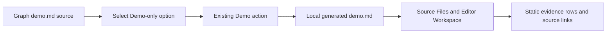

# Production Runtime Readiness Demo Implementation

This implementation continues the [source-grounded demo specification](agentic-graph-production-runtime-ready-demo-prd-tad-adr-mvp-gtm.md) and its [walkthrough](production-runtime-ready-demo.md). The earlier increment described a static document. This increment makes the walkthrough available through Graph's existing catalog Demo flow and adds a lightweight local launcher for that text-only route.

## PRD

### Problem and users

Maintainers and evaluators need to distinguish an exact deployed Graph marker from a separate cross-repository readiness result. A standalone Markdown guide requires manual navigation and does not demonstrate the existing generated `demo.md` path. A generic development launch also prepares optional motion/depth assets that this text-only walkthrough does not use.

The intended users are Graph maintainers, integration evaluators, and prospective adopters. Their job is to inspect a bounded, revision-linked example, open its evidence in Source Files → Editor Workspace, and leave without triggering model, repository, payment, or deployment effects. Demand and willingness to pay remain unmeasured.

### Journey and acceptance

1. Run the local, targeted `demo:runtime-readiness` command from the exact candidate.
2. Open `/81rv10/`, select **Production Runtime Readiness · Demo only**, then choose **Demo**.
3. Read the generated `docs/demos/production-runtime-readiness/<session>/demo.md` in Editor Workspace and inspect the linked evidence guide.
4. Name one fact proven by the protected Graph marker and one gap left by the cross-repository composition check.

| VCC | Acceptance criterion | Evidence |
|---|---|---|
| VCC-01 | The targeted launcher starts the existing Graph app without preparing optional model assets. | `npm run demo:runtime-readiness -- --host 127.0.0.1 --port 5185`; focused launcher contract test. |
| VCC-02 | The Graph-owned Demo-only option creates and opens the named local `demo.md` in Source Files and Editor Workspace. | Observed in the local task browser; generated path is visible in Source Files and its Markdown renders in Editor Workspace. |
| VCC-03 | The preset presents the production marker and composition result as separate claims, with exact identity and limits. | Source-row review against the linked guide. |
| VCC-04 | Demo creates no model/provider call, repository acquisition, remote write, payment, or deployment. | The authored document and two-message Chat history appeared without submitting the form. Network capture remains pending. |
| VCC-05 | The generated document is readable at 360 × 800 CSS pixels and by keyboard. | Pending; the available browser session did not expose a viewport override. |
| VCC-06 | Production build and XR-specific launch retain their model asset preparation. | Existing `prebuild`, `predev`, and `predev:xr-v2` contract assertions. |
| VCC-07 | Reverting the exact implementation paths restores the previous catalog and startup behavior. | Exact diff and source-tree review; no cleanup or runtime rollback implied. |

**Success measures**: From a running local app, reach the rendered document in at most two Demo actions; 5/5 initial evaluators distinguish the Graph deployment marker from cross-repository composition status. Both are targets, not observed outcomes. No time-saved, adoption, or paid-conversion claim is made.

## TAD

### Ownership and minimal change

| Owner surface | Change | Boundary |
|---|---|---|
| `docs/workspace-seeds/demo.md` | Add one static catalog preset linked to the evidence guide. | Reuse the existing Demo parser and local workspace artifact flow. |
| `LiveCanvasHeroPromptPresetPicker` and demo source loader | Expose Graph-authored display-only demos absent from the shared prompt catalog. | Keep the shared prompt catalog as owner of executable prompts; the new choice creates a local example document only. |
| Root `package.json` and `scripts/run-runtime-readiness-demo.mjs` | Add `demo:runtime-readiness`; resolve and validate the existing sibling catalog, then pass its absolute docs root to the Canvas workspace launcher. | No copied catalog, alternate application, or hosted service. |
| `canvas/package.json` | Add `predev:docs` and `dev:docs`; retain ordinary `predev`, XR launch, and production build asset preparation. | Skip only optional motion/depth preparation for the targeted text walkthrough. |
| Source Files and Editor Workspace | Reuse existing local generated-document activation. | No editor, persistence, or seed-registry change. |

The optional asset preparation is measurable in source: LiteRT accepts at most a 32 MiB task download; the pinned XR depth model and Wasm files total approximately 31 MiB. The new launcher does not invoke either preparation script. This is a bounded avoided preparation for this local route, not a measured cash or elapsed-time saving. Generic `npm run dev` and production builds retain their previous feature-complete preparation.

### Runtime and data flow

Five flows are covered: user journey (selection → local document), runtime (targeted Vite launch), data (authored catalog snapshot → local workspace), failure (missing preset/path stays visible and is not substituted), and release/rollback (source PR and protected release remain separate). Opening the snapshot does not poll a provider or update its evidence.

## ADR

### ADR-001 — Extend the existing catalog and local Demo owner

**Status**: Proposed.

Add one display-only option to Graph's existing `demo.md` source and reuse its Demo button to create and select a local workspace document. The shared prompt catalog retains ownership of executable prompts. Add a dedicated launcher whose preparation omits optional assets unused by the text walkthrough. Keep ordinary dev and production-build paths unchanged.

Rejected alternatives: a new Source Files seed registry or activation runtime would duplicate ownership; a new dashboard or service adds bundle and operating cost; a live readiness query would conflate a static walkthrough with production authority; removing assets from the general dev/build path would reduce feature coverage.

Consequences: the route has no new dependency or hosted service and avoids optional large-asset preparation. The static evidence can drift, so its exact revisions and limits remain visible and must be refreshed before a later decision. The targeted launcher still requires the repository's normal installed dependencies.

## MVP

**Included**: one Graph-owned Demo-only option sourced from `docs/workspace-seeds/demo.md`, one targeted local command, one generated local `demo.md`, one focused contract test, and the five-role demo specification. The option supplements the shared executable prompt catalog without adding an executable prompt to it. The feature uses Graph's existing workspace persistence.

**Excluded**: dynamic release-status polling, auto-running checks from the editor, production promotion, Cloudflare changes, payment, cross-repository readiness certification, and physical-device claims.

**Sprint caps**: ≤60 active minutes; ≤12 authored paths; ≤48 KiB total candidate diff; zero new dependencies or paid services. The current patch measures about 42 KiB including new files. Run focused checks, the exact Source Files browser flow, mobile/keyboard review when supported, and the affected Integration Gate. Reuse existing receipts; do not repeat the broad suite without changed input or a failed required check. Any external wait is a blocker with a recheck condition, not an ETA.

**Rollback**: revert the Graph-owned Demo-only source/selector, targeted launch scripts, focused tests, and implementation documentation. The local browser `demo.md` is a user workspace artifact; its deletion is outside this source rollback. No remote cleanup or production rollback is part of this candidate.

## GTM

The first audience is maintainers and reviewers who need a short source-to-production evidence walkthrough. The offer is a free, local, 90-second demo of the current Graph deployment marker and its limits. No subscription, add-on, overage, provider, or hosted service is introduced.

The `$1` figure remains an untested willingness-to-pay question for a future human-assisted evidence review. Do not charge or forecast revenue. Test it only after observed usage and a named buyer accepts a clearly bounded review; keep this implementation free and offline-capable after source checkout.

## Evidence and release boundary

The linked guide records the protected run, source revision, artifact and manifest digests, plus the separate `productionRuntimeReady:false` composition result. Neither this preset nor a green source check changes those records or grants release authority. The local desktop authoring path was observed from the task worktree before its changes were committed. Protected integration, mobile, keyboard, network, user-demand, and production behavior remain unverified.

Source integration requires the exact candidate and green protected checks. Deployment, promotion, readback, and rollback remain separate effects under the Graph owner workflow. This PR authorizes none of them.
