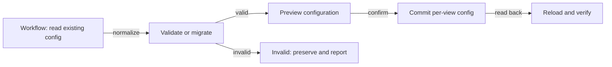
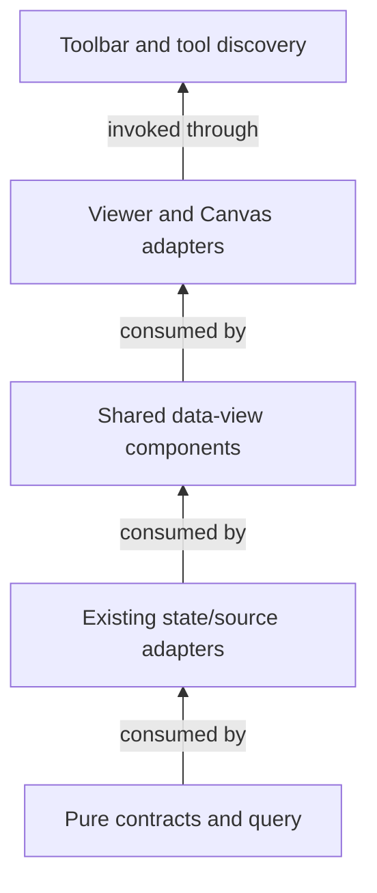

# Workspace data views: Table, Kanban and Calendar

`workspace-data-views@1.3.1` joins all five roles below. After the specification-first checkpoint,
the operator authorized implementation on 2026-10-02. Shared settings, versioned queries and native
Calendar are now implemented in the existing owners. B records the historical baseline; the
implementation checkpoint below separates verified behavior from remaining acceptance evidence.
The [parent document](./prd-tad-adr-mvp-gtm-knowledge-graph-node-cluster-edge.md) retains its
passage-graph and completed import-index interaction scope. This module owns the new view increment.

## PRD — purpose and pain

**Context C-DV:** readers already inspect the same source as tables or grouped cards, but controls
and global renderer choices do not expose a complete, consistent view model.
**Intent I-DV:** configure one source once, then inspect records as Table, Kanban or Calendar without
losing filters, hidden properties, ordering, provenance or edits.
**Zero at B:** native source-backed table/card rendering and per-view persistence existed; Calendar
and richer query controls were absent. **One:** an operator can switch
views, configure a compound filter, order records and inspect scheduled/unscheduled records in a
three-minute local demonstration with source bytes unchanged by presentation-only actions.

User and beneficiary: the workspace operator reviewing imported or authored records. Potential buyer:
an individual or small team paying for setup assistance; willingness to pay remains unknown.
The operator's 21 browser comments are direct usability/request evidence, not paid-demand evidence.
No screenshots, foreign source, assets, prose or new external dependency are part of the deliverable.

| Pain / priority | Hook → break → fix → close | Reuse and evidence |
|---|---|---|
| P1 observed / first | Open a view → settings are incomplete and renderer choices omit requested layouts → extend shared controls → configure the same records predictably | Comments 16–21; reuse G1–G7 before adding a renderer |
| P2 requested / second | Narrow a large inventory → flat filters and one effective sort cannot express intent → bounded boolean groups and ordered sorts → explain the resulting set | Comments 4–12, 14–15; native query owner G2 |
| P3 requested / third | Inspect work by date → no record Calendar exists → local month projection plus unscheduled list → see dates without inventing them | Comments 1, 21; reuse date-cell seams, add G8's missing projection |

## PRD — directives and request coverage

D1: One source record set and source mutation owner across inline Viewer, Editor Workspace and Canvas.
D2: Persist independent view presentation/query state; layout changes never rewrite source content.
D3: Every active control performs an observable action with keyboard/touch access; unsupported actions
show a reason. Use semantic HTML and labelled icons/media with hit-testable visible parts; no generic
layout divs or aria-hidden decorations in new controls.
D4: Preserve existing state, fail visibly on unsupported configuration, and bound local computation.
D5: Derive behavior from typed content and explicit configuration, never a filename, domain or fixture.

| Requirement / comments | Must behavior | VCC / design |
|---|---|---|
| R1 Layout and view management / 1–2, 16–19 | Shared Table, Kanban, Calendar choices; keep Multi-dimensional Table distinct; rename, duplicate and delete only the selected view | V1, V7 / T1, T2 |
| R2 Properties / 3, 16–18 | One searchable property inventory; per-property visibility, bulk Show/Hide All, order and shown count; title identity remains available | V2 / T3 |
| R3 Filter rules / 4, 6, 14 | Edit field/operator/value; type-aware membership and empty/nonempty operations; counts describe active rules | V3 / T4 |
| R4 Filter groups / 5, 7–10, 15 | Nested AND/OR; add rule/group; wrap, duplicate, delete a node; preserve the rest of the expression | V3 / T4 |
| R5 Sort / 11–12 | Add multiple fields; ascending/descending; reorder precedence; remove one or clear all | V4 / T4 |
| R6 Group / 13 | Group-by property, empty-group policy, per-group visibility and bulk visibility; counts and ungrouped records remain inspectable | V5 / T3 |
| R7 Global renderers / 19–21 | Restore Kanban as a named 2D choice and add Calendar; choices activate real surfaces and survive reload/source switch | V1 / T1 |
| R8 Calendar / 1, 21 and Calendar follow-up 1–5 | Explicit start/end fields; localized month grid and date navigator; Today highlight; day-local New row; compact records and bounded overflow; unscheduled/invalid-date records | V6 / T5 |
| R9 Shared affordances / 16–18 | Same settings outcome across three surfaces; preserve compact local-hover add-record behavior and source mutation guards | V7, V8 / T2, T3 |

External calendars, subscriptions, recurrence, remote sync, notifications and week/day scheduling are
**Won't this increment**. They need separate adapter, privacy, cost and authority contracts; no inert
connection buttons or dependency installs. Revisit only after native Calendar acceptance and demand evidence.
Calendar drag-rescheduling is also deferred; explicit source/date editing is the first bounded mutation path.

## Grounding — reference implementation

B = `agentic-graph@8b258a4a116cd7ef70718acd28307fc4a62af897`. Every G path below is relative
to that repository at B. Two parallel read-only audits were reconciled against the source by the
author. Source inspection proves ownership and current limits; it does not prove the new VCCs.

| ID | Exact native source / symbol | Existing behavior, gap and decision |
|---|---|---|
| G1 | `canvas/src/features/markdown-workspace/main/viewer/WorkspaceDataViewSettingsPanel.tsx`: `WorkspaceDataViewSettingsPanel` | Layout, Properties, Filter, Sort, Group, Reset sections already share one owner → extend, do not fork |
| G2 | `canvas/src/features/markdown-workspace/main/viewer/workspaceDataViewConfig.ts`: `applyWorkspaceDataViewQuery`, `coerceWorkspaceDataViewConfig`, `duplicateWorkspaceDataViewInState`, `deleteWorkspaceDataViewFromState` | Persisted v2 table/Kanban views; OR of flat AND groups; contains/equals/includes; only sortRules[0] executes; lifecycle helpers exist → extract pure query/migration responsibility and extend |
| G3 | `canvas/src/features/markdown-workspace/main/viewer/WorkspaceDataViewSettingsPropertiesSection.tsx` | Search, individual visibility, type and column CRUD/order exist; repeated inventories and no bulk actions → consolidate |
| G4 | `canvas/src/features/markdown-workspace/main/viewer/WorkspaceDataViewFilterMenu.tsx`, `WorkspaceDataViewSettingsFilterSection.tsx`, `WorkspaceDataViewSettingsSortSection.tsx` | Flat add/remove rules and single-sort UI → one shared expression editor and ordered-sort editor |
| G5 | `canvas/src/features/markdown/ui/MarkdownDataViewKanbanView.tsx`: `MarkdownDataViewKanbanView`; `canvas/src/features/markdown/ui/kanban/KanbanNewRecordDividerRow.tsx` | Configured/encountered lanes and source-backed card/add/drop behavior exist; empty configured lanes survive row filtering → apply view group visibility in lane projection |
| G6 | `canvas/src/features/markdown-workspace/main/viewer/MarkdownWorkspaceDerivedViewer.tsx`; `canvas/src/features/markdown/ui/MarkdownDataViewBlock.tsx` | Both call applyWorkspaceDataViewQuery and render native table/Kanban → preserve one query result and row identity across consumers |
| G7 | `canvas/src/lib/config.render.ts`: `CANVAS_2D_RENDERERS`, `getCanvas2dSurfaceId`; `canvas/src/components/toolbar/canvasViewMenu.ts`, `canvasViewActions.ts`; `canvas/src/features/workspace-table/workspaceEditorMode.ts` | Canonical renderer registry has no Kanban/Calendar; editor modes include table/multiDimTable/kanban → extend canonical contracts and exhaustive maps |
| G8 | `canvas/src/features/graph-data-table/ui/fast-grid/DateCellEditor.tsx`; `dateCellValue.ts`: `normalizeDateDraftToValue` | Date input/picker exists, not Calendar; permissive parsing truncates to dates → reuse editing seam only where semantics match; strict projection is new |
| G9 | `canvas/src/features/markdown-workspace/main/viewer/MultiDimTableSurface.tsx`; `canvas/src/components/CanvasViewport.tsx` | Shared source/mutation adapter and lazy mount exist; viewerMode is fixed to multiDimTable → pass explicit data-view mode through that owner |
| G10 | `canvas/src/hooks/store/canvasSlice.ts`: `setCanvas2dRenderer`; `canvas/src/hooks/store/uiSettingsSliceModeActions.ts`; `canvas/src/features/canvas/graphStoreDocumentUiRestoreWrites.ts` | Renderer selection/restoration also adjusts graph interpretation → distinguish data-view surface family from multi-dimensional graph semantics |

G8's abbreviated `dateCellValue.ts` shares its preceding directory. G10 restoration uses
`applySavedDocumentUiModeStateWrites`. Existing GraphRecordDb is an inspector adjunct, not a new
workspace view store; retain the boundary in the existing graph-data-table document.
At B, G2 is 593 lines, G1 549, G3 616 and the G6 derived Viewer 714. Do not grow oversized files:
extract their touched responsibilities in the implementation lane and keep changed/new modules <600 lines.

## TAD — owners and interfaces

| Design | PRD join | Implemented owner extension / interface | Consumers and check |
|---|---|---|---|
| T1 Renderer family | D1–D2, R1/R7 | G7/G9/G10; explicit kanban/calendar IDs and mode-to-surface mapping; separate data-view-family predicate from graph-enabled interpretation | Main toolbar, restore/frontmatter, existing WebMCP action; V1 |
| T2 View state and mutations | D1–D2/D4, R1/R9 | G2/G6; normalize legacy config into next version; use existing view store and source mutation callbacks; expose lifecycle helpers through current binding | Inline/Workspace/Canvas; V7 |
| T3 Properties and groups | D3/D5, R2/R6/R9 | G1/G3/G5; one property list, persistent hidden group IDs/empty policy and derived counts | Same settings registration and Kanban projection; V2/V5/V8 |
| T4 Query | D1/D4/D5, R3–R5 | Extract from G2; pure bounded filter expression, ordered comparator, immutable node operations | Both G6 consumers and Calendar projection; V3/V4 |
| T5 Calendar | D1/D3–D5, R8 | New pure month projection beside existing data-view model; lazy semantic Calendar view and date-field settings; G8 editing seam | Viewer/inline/Canvas; V6/V8 |

Implemented filter expression: rule `{id, kind: rule, columnId, operator, operand}` or group
`{id, kind: group, conjunction: and|or, children}`. This is the internal `workspaceDataViewFilterTree.ts` shape, not a second public schema. Use stable IDs and one normalized tree per saved view.
Limits: depth ≤8, total nodes ≤128, sort fields ≤16. Reject invalid/over-budget input with a visible
configuration error; preserve the last valid state and the submitted bytes for recovery.

Legacy migration maps each nonempty flat group to an AND group under an OR root, preserving the
old empty-group/no-filter behavior, legacy case-insensitive matching and stored rule identity.
Blank operands and missing-field legacy rules currently match true; an OR branch containing only
such rules can admit every row. Preserve those exact results as explicit legacy pass-through clauses
with a visible migration notice until the operator resolves them; never silently narrow the result set.
Do not silently activate legacy sort entries after the first: preserve the extras as inactive until
explicitly enabled; existing effective ordering must survive upgrade. Migrations must be idempotent.
New empty groups are drafts excluded from evaluation; zero active clauses means no filter. Wrapping
or duplicating regenerates only newly created node IDs and preserves field references and meaning.
New rules with missing/deleted fields are flagged inactive; cleanup traverses nested children.
V3 must compare pre/post-migration row IDs for blank-operand and missing-column OR branches.

Operator matrix: text contains/equals/not-equals/empty/nonempty; select and multi-select one-of,
not-one-of, empty/nonempty; numeric/date equality and ordered comparisons use typed operands.
Existing includes retains its legacy multi-select behavior. No arbitrary expression evaluation.
Empty set operands remain draft rules; malformed typed values produce visible validation errors.
Missing cells are empty. For active set rules, one-of uses intersection; not-one-of uses disjointness,
including empty cells; combine with nonempty when needed. Missing columns never become a match-all silently.
Legacy effective sorts also retain raw-string `localeCompare` semantics, including blank and numeric
strings, until explicit conversion previews and confirms any order change. New typed sorts use
ordered field comparisons with stable source order for ties; nulls sort last in either
direction, valid typed values before invalid ones, and text uses one declared deterministic comparator.

Persist group visibility per view, separate from transient search and group collapse. Derive group
choices from configured options plus encountered values plus an ungrouped identity that cannot collide
with literal cell text. Hide empty means empty after query; Show/Hide All changes known groups only.
Newly encountered groups default visible. Preserve one lane per record using the full multi-select
cell value in this increment, matching existing drop identity; per-option multi-lane membership is
deferred because it changes counts and mutation semantics. Hiding properties leaves title identity and record actions
available; use a count of hideable properties so the summary cannot claim a hidden identity field.

Calendar stores explicit start/end column IDs, a valid IANA display zone (UTC initial default), and
month anchor per view. Never infer dates from titles, paths or import timestamps. Strict YYYY-MM-DD
values stay civil dates with no timezone shift; RFC3339 instants with offsets project into the view's
zone. Ambiguous/local timestamps, invalid dates and unsupported types appear in an invalid-date list.
Empty/missing start values appear under Unscheduled. End absent means one day; date-only ends are
inclusive. Instant intervals are half-open; an end at local midnight does not occupy the next day.
End before start is invalid; zero-length intervals occupy their start day. Mixed date/instant ranges
are invalid until explicitly normalized by the user. Cover leap days, zone boundaries and DST.

Month projection intersects ranges with at most 42 visible days before materialization; no unbounded
per-day expansion. Each day renders at most 20 initial record entries with a visible total and
paged/virtualized overflow access. One record identity is retained across multi-day segments.
Day selection opens that day's record list; record activation opens existing record details. Explicit
New Record supplies a civil day to a date field; an instant field requires explicit time and offset
before saving. All writes pass current editable-source/revision guards. Selecting a date or layout
alone never writes data. Unscheduled/invalid lists use paging or existing virtualization; show totals
and omission state. A 42-day grid alone is not a bound on record count or DOM nodes.

## TAD — flows, reach and budgets

Each flow below applies to R1–R9 through the T1–T5 mapping; effectful source edits are explicitly separate.

Headless query/date projection is deterministic and I/O-free. Reuse the existing main toolbar tool
contract for renderer selection: `/canvas.view.set #canvas-view @canvas-view option=renderer:<id>`.
Existing WebMCP `control_local_canvas_view` receives enum additions through its canonical contract,
not a second registry. The current option list is manually owned by
`canvas/src/lib/canvas/canvasViewInvocationContract.mjs`: `CANVAS_VIEW_CONTROL_OPTION_IDS`, consumed
by `canvas/src/features/agent-ready/canvasViewAgentReadyContract.mjs`. Extend and cross-check that
existing list alongside G7; it does not automatically derive new IDs. Pure evaluation has no provider/token cost. Headless settings mutation and
native MCP parity are not currently established: remain unsupported until the existing owner exposes
and verifies the same schema, authority and errors. Tool discovery is never source-write permission.

Use current Settings tokens, typography, icons, density and overlay primitives; semantic buttons,
selects, labels, fieldsets, legends, lists, table/grid roles and time elements expose each action.
Support Escape/back, focus return, labelled nesting, keyboard reorder and non-drag alternatives.
At 360 CSS pixels, controls wrap without page overflow; touch targets are ≥44 pixels. Local-hover
insertion remains scoped to one divider, with focus reveal and persistent touch controls.

Free/FOSS only, no package addition or external requests. Warm-offline operation uses already loaded
source and modules; cold-offline availability requires the existing cache path's own proof.
Lazy-load Calendar on intent. Acceptance limits: <500 KB per emitted chunk; ≤40 KB gzip Calendar delta;
≤1 KB gzip always-load registry delta. Benchmark 1,000 neutral rows/128 clauses and a 42-day month;
target query+projection p95 ≤100 ms and control-to-visible-result p95 ≤200 ms on a recorded device.
These are acceptance targets, not measurements. No full inventory render per hidden settings section.
Cancel stale projection work by source/config revision; last writer does not bypass existing source guards.

## ADR — decisions

| Decision / owner | Alternatives and chosen approach | Consequence / recovery |
|---|---|---|
| A1 Shared surface / Workspace architecture function | Extend G6/G9; reject separate Canvas store or renderer-specific query implementations | One source/query owner; extract oversized components before growth; revert adapters without source loss |
| A2 Versioned query / Query architecture function | Extend G2 through a pure module; reject an unbounded expression language or silent coercion | Bounded tree and deterministic migration; preserve legacy bytes, no destructive downgrade |
| A3 Native month / View architecture function | Add local month projection; defer external calendar adapters and scheduling engine | No network/dependency cost; date semantics explicit; revert projection with records intact |
| A4 Renderer identity / Canvas architecture function | Add canonical identities; reject menu-only aliases and broadening multi-dimensional semantics | Selection, restoration and tools agree; restore prior renderer/config on rollback |

Prior source builds do not understand the new config version. Rollback retains its bytes, selects a
compatible read-only view or restores a validated pre-migration config snapshot; it never feeds new
state through the old lossy coercer or rewrites source records. State migration and its rollback check
must land before any consumer writes the new version. Source release, runtime promotion and production
approval remain independently evidenced effects.

## MVP — acceptance and evidence plan

Behavior tests, mounted settings controls, a neutral live Calendar journey and a production build
have passed locally. The checkpoint records the exact evidence boundaries; the table below retains
the complete acceptance contract, including device/offline and release checks not inferred from unit tests.
Use original neutral records or runtime-supplied user input; never embed a user's corpus in repository tests.

| VCC | Observable completion condition | Independent check / coverage boundary |
|---|---|---|
| V1 Renderer/layout | Kanban and Calendar select real surfaces, reload correctly and preserve source/graph semantics | Extend `ui.multiDimTable.surface.workspaceModeOwners`, `pipeline.2dRenderer.sharedSurfaceHelpers`, renderer action/restore tests; live Viewer/Canvas comparison |
| V2 Properties | Search/order/bulk visibility act on one list; counts and identity remain correct after reload | Extend `ui.workspaceTable.floatingPanel.queryWorkbench`; mounted interaction + source-unchanged assertion |
| V3 Filters | Nested AND/OR and every operator produce expected row IDs; edit/wrap/duplicate/delete preserve unaffected clauses | New pure truth-table/migration tests, malformed/depth/size tests; mounted controls and reload |
| V4 Sort | Two or more fields obey precedence and typed tie/null/invalid policy; legacy comparator remains unchanged until explicit conversion | Extend state/query behavior suite; reordered sorts change only expected record ordering |
| V5 Groups | Hidden/empty/configured/encountered/ungrouped lanes reflect policy and counts | Extend Kanban projection tests and `ui.dataViewKanban.cardLists.sharedResponsiveOwner`; live hide/show/reload |
| V6 Calendar | Correct civil/instant boundaries, month navigation, intervals and unscheduled/invalid recovery; day-local creation, keyboard date navigation and complete paged overflow | New deterministic projection tests (leap day/DST/offset/midnight); explicit date edit roundtrip and source revision rejection |
| V7 View lifecycle | Duplicate has independent config; deleting selected view preserves records and valid active view; final-view deletion is disabled with a reason; all surfaces show same queried IDs | Extend `markdownDataView.state.duplicateDelete`, `markdownDataView.state.columnCrudCleanup`; source selection and read-only tests |
| V8 Accessible bounded UI | Named hit targets, keyboard/touch/narrow layout, local hover, offline and lazy budgets pass | `ui.workspace.responsiveMenusAndDataViewSurfaces`, `floatingPanel.formControls.sharedDensity`; live interaction/screenshot and production-build chunk measurements |

Demo target (180 seconds): Hook open source 15s; Probe choose/switch view 20s; Reveal nested-filter
row set 45s; inspect Calendar and explicit source date edit 70s; Close reload/readback 30s.
Run against temporary neutral records; user data is inspected without disposable-row assumptions.
Physical devices, production behavior and complete accessibility certification need separate evidence.

## MVP — execution sequence and checkpoints

S1–S4 are implemented in the existing source owners; S5 has focused and live evidence below.
START admission binds the changed paths; affected checks and protected RELEASE remain independent gates.
The active implementation budget was refreshed to 51 files / 140 KB of source changes; no paid resources.
The shared Canvas tool description is concise so the added renderer choices retain the existing
32 KiB browser-discovery cap, complete input validation and execution ownership.

| Stage / RAO action | Dependencies / reusable owner | Exit / budget and next check |
|---|---|---|
| S1 Query engineer normalizes versioned view state | G2; A2; D2/D4 | V3/V4 migration core and rollback; 25 active min, ≤6 modules, ≤25 KB, ≤12k tokens, zero spend |
| S2 UI engineer consolidates shared settings | S1; G1/G3/G4; A1 | V2–V5/V7 controls, lifecycle and settings isolation; 30 min, ≤10 modules, ≤35 KB, ≤16k tokens |
| S3 Canvas engineer exposes Kanban renderer | G5–G7/G9/G10; A4; independent of S2 query UI | V1 Kanban routing/restoration/tool enum; 20 min, ≤10 modules, ≤25 KB, ≤12k tokens |
| S4 View engineer adds Calendar projection | S1/S3; G8/G9; A3 | V1/V6 shared month/date settings, explicit source edit; 35 min, ≤10 modules, ≤40 KB, ≤18k tokens |
| S5 Verification owner exercises complete journey | S2/S4; V1–V8 | Timed demo, device/offline/chunk measurements and affected suite; 20 min, ≤4 test modules, ≤15 KB, ≤8k tokens |

Bounds trigger a refreshed plan and checkpoint, never false completion or silent omission. Shared
owner edits are serial; read-only audits may run in parallel. Baseline test failure is isolated before
implementation. Limit refinement to three cycles; two cycles without blocker reduction require a
recorded design reassessment. External protected-CI waits name the failed/running check and recheck
at a provider completion event, without an ETA. Production stays closed without exact candidate authority.

## GTM — value, economics and learning

Offer hypothesis: assisted setup of reusable local views for an operator already maintaining structured
records. Rank (1) repair existing view configuration, (2) compound query work, (3) date planning by
proximity to native capability; reorder if measured paid pain contradicts this assumption.
First-dollar path: offer one consented setup outcome at a disclosed price; price and willingness to pay
are unknown. A synthetic $1 transaction would prove neither demand nor a first collected dollar.
No billing, prospect outreach or payment action is authorized by this specification.

After V1–V8, invite five voluntary operator sessions over 14 days: record time to configured view,
failed/repeated actions, support minutes and retained view use after seven days. Continue if four
complete the three-minute journey without source loss and at least one accepts a priced pilot;
otherwise fix the observed friction or stop Calendar expansion. Payment and repeat demand have their
own receipts. Active authoring time, token usage and CI time are recorded in private execution evidence;
unknown measurements remain unknown. Runtime requests/tokens added by this design: zero; measured
bundle/latency/resource savings remain unverified. No paid plans, addons or overages.

## Coverage decisions and open evidence

This map disposes 16/16 domains: 8 covered at specification scope, 8 deferred, 0 not applicable;
covered applicable domains = 8/16. Coverage is not runtime, demand or production readiness.

| Domain | Disposition / owning role | Evidence or next check |
|---|---|---|
| C01 Purpose/customer | covered / PRD | Operator comments and P1–P3; WTP remains unknown |
| C02 Market/timing | deferred / GTM | Buyer counts and two-method market sizing await voluntary pilot evidence |
| C03 Offer/alternatives | covered / GTM+ADR | Existing manual views versus native extensions; price validation at pilot |
| C04 Experience | covered / PRD | R1–R9/V1–V8; implemented shared controls; complete device acceptance remains in V8 |
| C05 Architecture/data | covered / TAD | G1–G10 baseline plus implemented owners in the checkpoint |
| C06 Quality/security | covered / TAD | Bounded input, revision guards, inert data and no new remote dependency; focused tests passed |
| C07 Decisions/tradeoffs | covered / ADR | A1–A4 choices, consequences and reversible state boundaries |
| C08 Smallest validated slice | covered / MVP | S1–S5 and V1–V8 state scope and gaps; local evidence below; no Production acceptance claimed |
| C09 Acquisition/retention | deferred / GTM | Draft pilot experiment exists; channel, conversion and retention evidence await consented sessions |
| C10 Business operations | deferred / GTM | Reuse existing delivery/incident process; measure setup/support capacity during priced pilot |
| C11 Organization/obligations | deferred / Product function | Named S1–S5 owners; entity, hiring, IP/data/contract review await any commercial or adapter expansion |
| C12 Financial viability | deferred / GTM | Zero new runtime fees; price, margin and linked scenario statements require measured pilot cost/payment |
| C13 Funding/capital | deferred / GTM | No funded expansion in this local increment; revisit on priced demand |
| C14 ADLC execution | covered / MVP | Exact admission, implemented stages, source/release/deploy separation and local evidence checkpoint |
| C15 Audience projections | deferred / Product function | No deck/plan/financial audience handoff authorized; require joined evidence first |
| C16 Learning | deferred / GTM | Defined 14-day experiment begins after V1–V8; outcome not yet observed |

## Checkpoint — native implementation, 2026-10-02

The specification baseline was integrated separately. This increment retains its import-plan mission
binding and explicitly readmits the shared view source paths under scope `#workspace-view-controls`.
Admission digest: `923cd3b9293b0e395b2a788ff82b1166a58d863f1c1cc15d27239b0988bbcbfe`.
All five role revisions advance together to 1.1.0; no external dependency or source corpus is added.

| Stage / native owner | Implemented behavior and local evidence |
|---|---|
| S1 / `workspaceDataViewConfig.ts`, `workspaceDataViewFilterTree.ts`, `workspaceDataViewQuery.ts`, `workspaceDataViewLegacyQuery.ts`, `workspaceDataViewExtensions.ts` | v3 state validates atomically; bounded AND/OR expressions and immutable edits; ordered typed sorts; v2 query/order preserved until explicit conversion; corruption and delayed-write tests pass |
| S2 / existing Settings sections, `WorkspaceDataViewSettingsGroupSection.tsx`, `WorkspaceDataViewSettingsLifecycle.tsx`, `useSavedWorkspaceDataView.ts` | Single property inventory, bulk visibility and native property-type selector; nested filter editor; sort precedence; group visibility; saved-view duplication/deletion; same-owner notifications and write failures; mounted interaction tests pass |
| S3 / `config.render.ts`, `canvasViewMenu.ts`, `canvasViewInvocationContract.mjs`, `workspaceEditorMode.ts`, `MultiDimTableSurface.tsx` | Canonical Kanban/Calendar renderer IDs route through the existing source-backed surface; graph interpretation remains separate; existing WebMCP discovery exposes both choices; renderer regressions pass |
| S4 / `markdownDataViewCalendar.ts`, `MarkdownDataViewCalendarView.tsx`, `WorkspaceDataViewCalendarSurface.tsx`, `WorkspaceDataViewSettingsCalendarSection.tsx` | Strict month projection, explicit date properties/zone, range boundaries, day selection, paged lists, native record dialog and source-backed civil-date creation; Calendar lazy-loads |
| S5 / `workspaceDataViewEnhancements.test.ts`, `markdownDataViewCalendar.test.ts`, existing registry cases | Twenty focused cases cover mounted settings, migration/recovery, sorting/groups/lifecycle, Calendar semantics/bounds and existing surface/property/hover regressions; TypeScript and production build pass |

The named owner files above are under `canvas/src/features/markdown-workspace/main/viewer/`,
except Calendar projection/view under `canvas/src/features/markdown/ui/`, renderer files under the
G7 paths, and tests under `canvas/src/__tests__/`. `useWorkspaceDataViewMutations.ts` extracts the
existing source writer callbacks without introducing another writer. All touched source modules
remain below 600 lines.

Persistence uses a `:v3` key and retains old v2 bytes for rollback, with a last-valid v3 backup.
Invalid stored payloads remain intact and block writes with a visible recovery error. A view update
addresses its own ID and cannot select a newer active view. The settings scope normalizes the
Markdown table range to its start line so appended records retain configuration; the previous exact
range key is read for migration. Native workspace path normalization unifies leading-slash and
relative paths; validated legacy path/range aliases are promoted before source edits while preserving
their original bytes. Regression coverage combines alias changes and growing tables. Moving a table's starting line remains a known identity limitation.
No source content is changed by these settings operations.

Live localhost verification used a new neutral four-record document: one two-day civil range,
one later record, one missing date and one invalid date. Calendar placed the range on both days,
kept the two exception lists separate, and a Title filter reduced the result to that range. Wrapping
the rule preserved the result. Property type selection and independent saved-view duplication worked. A dated record created through
the native source writer appeared on the selected day while keeping Calendar configuration and both
exception counts. Passive source composition and saved-view restoration retain data-view renderers;
explicit source presets keep their precedence. The existing import-materialization owner preserves
a selected record renderer for sources without a renderer preset.
This is targeted interaction evidence, not a timed 180-second acceptance run or physical-device proof.

The production build completed in 52.90 seconds. The new Calendar chunk is 14.19 KB raw / 5.86 KB
gzip. Its own chunk meets the 40 KB gzip ceiling; a before/after dependency-closure or always-load
registry delta was not measured. Existing unrelated output chunks exceed 500 KB and remain baseline
release debt; this increment does not claim repository-wide chunk compliance. The bounded projection
test covers 10,000 long-range records; formal 1,000-row/128-clause p95 and interaction-latency sampling,
cold/warm offline browser acceptance and physical mobile/touch evidence remain open V8 checks.

Development: native implementation with the local checks above. Protected integration is separately
recorded by the release receipt; no Production promotion or pilot-demand result is claimed here.
Full external calendar adapters, recurrence and drag scheduling remain deferred. The next value
checkpoint is the consented operator journey after the outstanding acceptance checks, with the
same source-loss and zero-spend stop criteria. Preserve this increment's diff, validation logs,
neutral live evidence and native release receipt in private execution evidence.

## Checkpoint — Calendar interaction refinement, 2026-10-02

`workspace-data-views@1.2.0` joins the five roles for the operator's Calendar enhancement request.
The existing source writer, date projection, view state and lazy renderer remain the owners.
The published 1.1.0 candidate is retained unchanged; scope `#calendar-refinements` uses its native
successor allocation. Admission digest: `70fe99a82bcd1c0cec03d51a9cb12a61fddd3a1fb6b24a8aedc7f0366675b169`.

- **PRD / value:** reduce the steps to add a record on a known day and make a dense month readable.
  A localized month heading, weekday labels, muted adjacent-month cells and a timezone-correct today
  highlight establish date context. Every populated day previews up to three named records; an empty
  title reads Untitled. A named more-records button opens the full day list with existing pagination.
- **TAD / ownership:** `markdownDataViewCalendar.ts` shares month cells with the main grid and compact
  navigator. The projection retains its 42-day bound; display trims unused trailing weeks.
  `MarkdownDataViewCalendarNavigation.tsx` owns month/date selection and arrow/Home/End focus movement;
  its semantic disclosure returns focus on selection or Escape. `MarkdownDataViewCalendarView.tsx`
  owns the day-local composer and passes only title/start-date seeds to the existing record callback.
  `markdownDataViewCalendar.css` scopes presentation and local-hover/focus/coarse-pointer rules.
- **ADR / choice:** use a native semantic table, buttons, time elements, details and forms. Reuse the
  configured timezone and browser locale without a calendar package. Keep record previews bounded
  instead of rendering an unbounded stack inside every cell. No generic div or aria-hidden decoration
  is introduced by these controls. View navigation does not write source content.
- **MVP / acceptance:** hovering one day reveals only its New row control; focus and touch keep it
  discoverable. Entering a title or accepting Untitled creates a row on that day through the same
  writer; Cancel/Escape writes nothing. Read-only or non-Date properties expose no civil-date writer.
  The date navigator, Previous/Next/Today, overflow and record details are interactive.
  The focused interaction suite covers creation/cancel seeds, focus, date selection, overflow paging,
  month changes and read-only controls; date tests retain leap/DST/range coverage and check 4/5/6-week
  presentation. Browser verification owns CSS hover visibility and the persisted write/readback.
- **GTM / learning:** retain the existing voluntary pilot and price hypothesis. Compare time and
  mistakes when adding three dated records through the inline day composer; no revenue or conversion
  claim follows from this implementation.

Sprint cap refreshed after CI diagnostics: ten files, 44 KB of added text, approximately 35 active minutes plus required checks,
zero paid resources. The new navigation and styles remain within the existing lazy Calendar module.
No new storage version, remote calendar, recurrence, notifications, drag rescheduling, source identity
policy or Production effect is introduced. Physical-device/offline and formal p95 acceptance remain
open; exact validation and release receipts accompany the candidate separately.

Validation includes three Calendar cases, the TypeScript check, eight responsibility-flow cases,
and live browser creation/readback of a titled record on 2026-10-15, record details, compact date
selection and keyboard movement. The first build emitted a lazy Calendar module of 18.64 KB JS and
3.46 KB CSS; shared pre-existing oversized chunks remain outside this feature's bundle claim.
The predecessor's remote Mission browser check lost its context during navigation. An unchanged
settings generation also reproduced a local preview reload. The existing artifact writer now skips
identical content while retaining staged writes for changes; its regression test checks unchanged
inode/mtime and changed-byte persistence. This removes one concurrent-verification reload source;
the exact candidate's protected CI remains the release authority, not that diagnosis alone.

## Checkpoint — Calendar record details, 2026-10-02

`workspace-data-views@1.2.1` joins the five roles for the five record-dialog browser comments.
The native successor scope is `#calendar-record-dialog`; published predecessors remain immutable.

- **PRD / value:** keep record details centered and column actions accessible, then retain the
  operator's place in the calendar after closing details. The close action uses the existing X icon
  with an accessible name and a 44-pixel target.
- **TAD / ownership:** `MarkdownDataViewCalendarView.tsx` separates selected record identity from
  dialog visibility. Its scoped stylesheet centers the native modal within the viewport and bounds
  its scrolling height. Shared `DetailsMenu.tsx` portals to the trigger's open dialog, falling back
  to the document body outside dialogs; viewport clamping and nonblocking pointer behavior remain.
- **ADR / choice:** reuse the native dialog top layer instead of increasing a body portal's z-index.
  Keyboard activation of the column summary is accepted without changing pointer label guards.
  Escape closes the open menu first and returns focus to its trigger. A small shared
  `rowSelectionStyle.ts` extracts the existing hierarchy-row accent and selected background; both
  span rows and calendar record buttons use that owner with a four-pixel inline-start border.
  Record selection is presentation state and never writes source or persisted view configuration.
- **MVP / acceptance:** the dialog is centered on desktop and a narrow viewport; a menu extends
  beyond its short dialog without being obscured. Closing by icon or Escape retains the record's
  accent/highlight, selecting a different record transfers it, and repeated open/close works.
  Focused interaction tests cover modal menu ownership, Escape, icon naming, selection and zero
  source writes; live browser checks cover geometry, hit testing and focus restoration.
- **GTM / learning:** retain the voluntary pilot and setup-price hypothesis. Observe wrong-record
  reopenings and menu failures during the existing dated-record journey; no conversion claim.

Bound: eight files, 24 KB of added text, approximately 20 active minutes plus required checks;
zero dependencies or paid resources. The shared style helper adds a small synchronous module to
existing hierarchy consumers; Calendar remains lazy. Production and physical-device verification
remain separate from this local fix; exact validation and protected release receipts accompany it.

Validation: focused Calendar interactions and the existing menu toggle guard pass; TypeScript passes.
Live checks at 1351 × 952 and 390 × 844 confirm zero center offset, a 44 × 44 close target, and
menu hit testing above the dialog and beyond its bounds. Mobile menu bounds remain in the viewport.
Escape and the close icon restore focus to the selected record. Protected CI remains the separate
source-integration gate; no Production runtime proof follows from these local observations.

## Checkpoint — Shared row selection, 2026-10-02

`workspace-data-views@1.3.1` joins five roles for the operator's traversal/reuse annotation.
Native successor: `/refactor #shared-row-selection @codex`; baseline is
`b7efa896e7d7f21733f5db39180b8ef67c76e088`. The previous checkpoint remains historical;
its local `rowSelectionStyle.ts` helper is removed by this increment.

- **PRD / value:** selected records, list/tree rows and command choices retain one visible
  highlight and left accent, including on hover. The user can identify their current item without
  interpreting different rings, outlines, category stripes or background strengths on each surface.
- **TAD / ownership:** extend `grph-shared/src/ui/selectedRowClasses.ts` and its existing
  `themeTokens.ts` authority. Calendar, hierarchy/span rows, table rows, search results, dashboard
  records, gallery/Kanban cards, semantic outlines, block-library and command lists consume it.
  Existing TOC, history, design trees and graph outlines inherit the record owner. Explorer file
  navigation and settings/menu choices retain the established shared soft background/border style.
  GitGraph and diagram command rows lose their separate inset/ring/background variant. The fast
  canvas grid imports the same owner’s paint constants; pinned DOM cells inherit the row background
  and the first cell receives the accent so sticky backgrounds cannot obscure selection.
- **ADR / choice:** use the existing theme's selected-row token for a 22% highlight and four-pixel
  inset left accent. Transparent borders preserve the existing helper contract; the inset avoids
  moving content. Remove the duplicate style helper, unused selected-border token and row-local
  selection literals. Keep domain colors in icons/swatches, keyboard focus outlines, dashed drop
  targets, canvas geometric bounds and date-cell selection: these represent distinct interactions.
  The follow-up correction explicitly excludes Explorer file selection and Autosave/settings
  choices from the record accent. The shared class owner selects between these two semantic roles;
  no component introduces local paint. Typography, icons, state callbacks and source writers stay. No new
  module, storage schema, API, package, asset or external runtime dependency is introduced.
- **MVP / VCC:** selecting and hovering a Calendar record uses the same computed highlight/accent
  as another native row; closing details retains selection. Table selection remains visible through
  pinned cells. The existing selected-row authority test now checks DOM/canvas paint agreement and
  scans source for retired helpers, tokens and row/card selection literals. Its narrow exclusions
  cover canvas geometry, map markers and date cells; it is a regression guard, not a complete CSS
  parser or proof of every interactive surface. Browser checks target desktop and narrow viewport.
- **GTM / learning:** retain the existing voluntary pilot and setup-price hypothesis; observe
  wrong-item reopening and time to locate the current row. This consistency fix establishes no
  willingness-to-pay, revenue or production-readiness claim.

Bound refreshed to 27 files, 50 KB diff and 50 active minutes plus required checks; zero paid
resources. Reservation recovery preserved the authored patch while the native pending expansion
was reconciled; no user edits were reverted. Canvas modules remain in their existing load paths.
The source-wide guard, TypeScript and affected-owner checks plus browser evidence determine local
acceptance; final exact candidate and protected integration receipts are retained separately.
Next: author verifies these conditions, publishes the admitted candidate and rechecks protected CI;
Production, physical-device/offline parity and formal performance acceptance remain separate.

Validation so far: `ui.selectedRow.authority.forbidsLegacyDuplicateVariants` and
`workspaceDataView.calendar.interactions` pass; Canvas TypeScript passes. The live desktop DOM
confirmed the record accent before the operator excluded Explorer and settings choices.
The follow-up guard now requires their original soft selection while retaining record paint.
Exact-head affected checks and remaining browser observations are recorded in the candidate's
private verification receipt, without upgrading Production readiness.

Correction acceptance: Explorer file rows and settings choices (including Autosave and Storage
Sync) use their previous shared selection classes with no inset left accent. Record selection
continues to use the canonical accent/highlight; tests check both semantic roles. The first affected
run was interrupted for this operator correction and supplies no final-candidate green claim.

Correction verification: the focused authority and Calendar interaction checks pass. Live DOM
inspection confirms Explorer, Autosave and Storage Sync use their original soft background/border
and `box-shadow: none`; the user-facing settings retain their On values. No settings value was changed.
