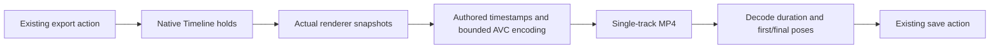

# XR scene MP4 recovery — reference implementation

All five roles join `XR-MP4-RECOVERY-001@1.0.0`. This editable recovery companion
consumes ADR-7 of the [immutable spatial-authoring plan](agentic-graph-ar-vr-xr-prd-tad-adr-mvp-gtm.md).
Its pinned bytes remain unchanged. The [authoring guideline](https://github.com/huijoohwee/huijoohwee.github.io/blob/987dd1d1e6d25761f2279d49a53c40a210466679/guidelines/prd-tad-adr-mvp-gtm-guidelines.md)
owns the shared authoring contract; no new readiness or invocation contract is introduced here.

## PRD — reference implementation

**Directive / CID:** In the existing silent scene-export action, the export maintainer
must preserve the authored opening pose, endpoint and duration despite browser encoding delay,
so a mobile or desktop scene author receives a decodable rehearsal reference.
Role / action / outcome: maintainer / repair timestamp ownership / verified authored export.
Verb / object: preserve / the authored scene interval. Pain evidence: Graph PR #1221's
required browser check decoded a two-second scene as 2.626467 seconds; the earlier
one-sample endpoint attempt in PR #1214 failed the decoded final-frame comparison.

| Acceptance / design / decision join | Observable requirement | Verification owner |
|---|---|---|
| AC-1 / T-1 / ADR-1 | Opening and endpoint match actual native playing-camera renders; supported timestamped output duration differs by less than 1 ms in the two-second fixture under a 150 ms encoding delay | Native desktop/mobile MP4 smoke and unchanged decoded verifier |
| AC-2 / T-2 / ADR-2 | Cancellation, source switching or encoder failure releases frames, encoder and lease; never restores an old document into a new one | Encoder/recorder tests and native menu cancellation/source-switch smoke |
| AC-3 / T-3 / ADR-3 | At most 120 seconds, 7,201 submitted samples, queue 4 and 64 MB output; no dependency or format substitution | Mux/encoder bounds and existing capability fallback |

Scope is the existing silent authored-scene export. Existing MainPanel, FloatingPanel,
BottomPanel/Timeline and export-menu owners retain their behavior and shared utilities.
No new scene clock, panel, capture permission, audio track, hosted service or deployment is included.

## TAD — reference implementation

T-1: [`captureXrSceneMp4`](../../canvas/src/features/three/xrSceneMp4Export.ts) lazily loads
[`xrSceneMp4Encoder`](../../canvas/src/features/three/xrSceneMp4Encoder.ts) when browser
AVC encoding is supported. The native Timeline holds startup at zero and completion at
the authored endpoint until the actual renderer callback supplies those poses.
Intermediate samples retain their observed authored playhead timestamps. The endpoint
occupies the final authored frame interval; wall-clock stalls do not extend that interval.
[`xrSceneMp4Mux`](../../canvas/src/features/three/xrSceneMp4Mux.ts) writes one ordered AVC
track with explicit display intervals, sample sizes, payload offset and keyframe table.

T-2: Reuse the source binding, shared recorder lease, `copyEncodedChunk`, transport
acknowledgements and [`verifyXrSceneMp4`](../../canvas/src/features/three/xrSceneMp4Evidence.ts).
The source fence remains live through decode verification and completion callback.
Teardown closes frames/encoder and restores transport/camera only while the same source is current.

T-3: Unsupported AVC capability uses the existing MediaRecorder path. A supported encoder
that fails, reorders timestamps, changes configuration or exceeds a bound fails visibly;
it does not silently retry another format. Queue pressure skips intermediate submissions,
retaining actual observed timestamps; it does not invent rendered frames or a second clock.

## ADR — reference implementation

ADR-1 accepts explicit authored timestamps for this bounded AVC track. More recorder
pause/resume waits cannot guarantee duration and terminal delivery under independent
stream scheduling. General transcoding packages add unnecessary cost and surface area.
ADR-2 retains the native Timeline, renderer, source fence and lease as the sole owners;
manual pose stepping or a parallel export clock is rejected. ADR-3 retains capability
fallback and all existing decoded evidence thresholds. No CI assertion or immutable plan
pin is weakened. Rollback is a reviewed source revert; no persisted scene schema changes.

## MVP — reference implementation

Checkpoint, 2026-09-24: the existing XR checkout was re-admitted after approved OS PR #296
merged as `0433c86a3528f2130d952a1b63c9e40feb41fde3`. All 40 focused encoder/recorder tests
and Canvas typecheck passed. Native desktop/mobile smoke passed with exact two-second
outputs, verified first/final poses, cancellation, document switching and resource release.
The first affected run correctly rejected editing the immutable parent plan; its exact
bytes are restored and this companion records the repair. The standard affected partition
passed at `1f6472e50a345e3c107691b5e4c4fbb14da595ed`. The broader XR browser verifier
requires a real upstream ref, so native publication must precede that remaining check.
This checkpoint precedes publication; bind protected CI and native integration/cleanup
receipts to the final candidate before accepting completion.

Budget: seven final changed files, two lazy runtime modules, less than 50 KB diff, one
existing checkout, no dependency or paid service. Runtime limits are AC-3. Provider wait
has no ETA; recheck on a changed required-check result. Update this checkpoint before
ending the next implementation turn, including exact results and the next unresolved action.

| Boundary | Evidence / authority | Recovery |
|---|---|---|
| Local authoring | Focused tests, typecheck and native browser evidence above | Retained branch and reviewed revert |
| Protected source integration | Exact-head required CI plus applicable approval; pending | Retain source and predecessor refs |
| Delivery / production | No deployment requested or proved | Remains closed |

## GTM — reference implementation

The proposed buyer pain is unreliable rehearsal export and repeated waiting. No measured
savings, demand, adoption, revenue or quality rating follows from passing engineering checks.
Use one timed desktop/mobile pilot through the existing export action, recording success,
active time, encoding delay, output bytes and user feedback separately. A $1 paid-export
hypothesis remains unvalidated; this repair adds no payment flow or monetization dependency.
Core functionality, innovation/theme alignment, technical integration and user experience
remain unassessed until criterion-specific pilot evidence is recorded.
