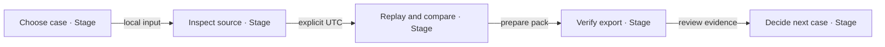
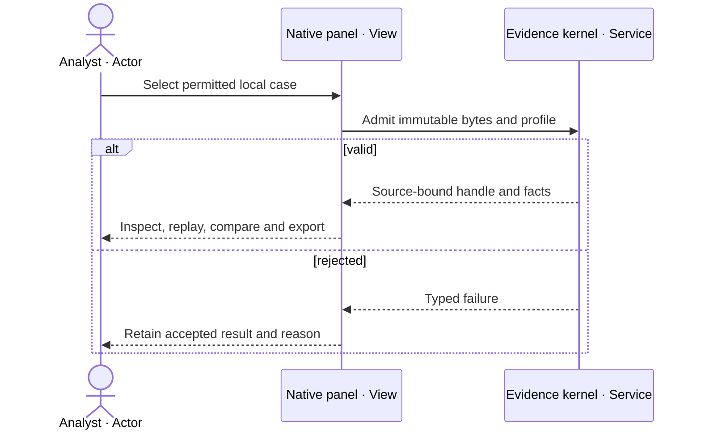
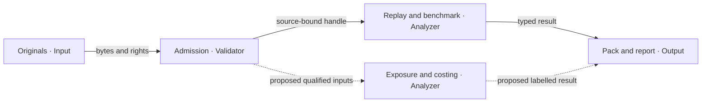
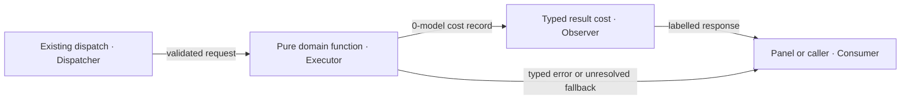
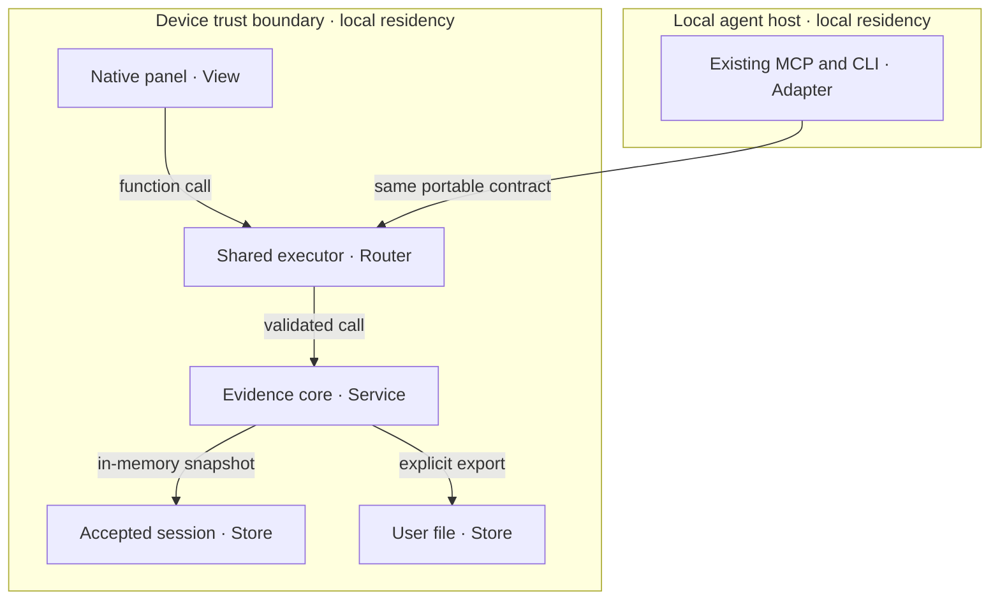
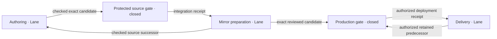

# Aviation Swarm

`aviation-swarm@0.2.0` specifies a bounded extension of the existing aviation evidence capability:
**inspect what is known, reproduce a comparison, and explain what is still unknown.**
The longer-term question remains “Which routes are exposed, and what does each option cost?”
Neither operational exposure assessment nor flight-cost calculation is currently implemented.

The user selected **agentic-graph** as the implementation and document owner. This reference implementation
consumes [aviation-evidence-layer@0.4.2](aviation-evidence/prd-tad-adr-mvp-gtm.md); it does not replace that
owner, its eleven acceptance thresholds, rights records, financial model, or execution backlog.
This revision replaces the ungrounded greenfield design in the 0.1.0 draft. It adds no runtime dependency,
gateway, store, host, provider subscription, agent framework or mandatory model call.

## Scope and grounding — reference implementation

All native inspections below bind Graph source `cc40000f8827ea68192edbd42385a887f107a3b5`.
`E/` abbreviates `canvas/src/features/evidence-analysis/`; it is only a locator shorthand.
The existing product source was integrated by [PR 1543](https://github.com/huijoohwee/agentic-graph/pull/1543).
Statements in the inherited 0.4.2 documents about then-pending publication are historical; this
observation establishes current source inclusion, not a deployment or complete acceptance result.

| Grounding ID / capability | Inspected owner and contract | Reuse / smallest delta | Check / evidence limit |
|---|---|---|---|
| G1 originals and provenance | `E/core/evidence-kernel.mjs`: `admit`, `inspect`, `sourceEvidence`, `exportPack`, `createSession`; `evidence-order/v2` | Reuse immutable originals, source pointers, units, nulls, hashes and latest-intent fences | `evidence-core.test.mjs`; ER1, not source authenticity |
| G2 time and source context | `E/core/evidence-replay.mjs`; `geospatialProject.mjs`, `geospatialSource.ts`, `sourceTimelineBridge.ts` | Reuse explicit UTC, gap breaks, source identity and existing map/Timeline owner | Core replay in ER1; UI acceptance separately ER3 |
| G3 route comparison | `E/core/route-benchmark.mjs`: `benchmarkRoute`; `route-distance/v1`; `profiles/route-policy.json` | Retain fixed-sphere distance and conditional error band; proposed exposure must not relabel it fuel or feasibility | `route-benchmark.test.mjs`; ER1 |
| G4 structured restrictions | `E/core/notice-triage.mjs`: `triageNotice`; `core/volume-project.mjs`: `projectVolume` | Reuse explicit geometry/time/datum and unresolved fields; no free-text interpretation | `notice-triage.test.mjs`, `volume-project.test.mjs`; ER1; 100-label benchmark open |
| G5 arrival evaluator | `E/core/arrival-analysis.mjs`: `analyzeArrivals`; authored train/calibration/test policy | Retain deterministic evaluation; do not add a predictive agent | `arrival-analysis.test.mjs`; ER1; real touchdown benchmark open |
| G6 shared tools | `E/tools/evidenceCatalog.mjs`: `EVIDENCE_OPERATIONS`; `executeEvidence.mjs`: `executeEvidence`, `dispatchEvidence`, `invokeEvidenceCommand` | Extend this single catalog/executor only after a new criterion is admitted | `evidenceTools.test.mjs`; ER2 scope recorded below |
| G7 transports | `E/tools/evidenceCli.mjs`; `canvas/src/features/agent-ready/evidenceAnalysisAgentReadyContract.mjs`, `evidenceAnalysisWebMcpTools.ts`; `mcp/local-tool-contract.js`, `mcp/server.js` | Retain local CLI/MCP and browser adapters; remote aviation parity unproved | Local adapter checks; browser-discovered tools require actual invocation proof |
| G8 native experience | `E/EvidencePanel.tsx`, `ui/EvidenceResults.tsx`; [Flight source](workspace-seeds/agentic-graph-game-flight-sim-demo.md) | Reuse lazy Evidence and analysis, native Flight, map, BottomPanel Timeline and source inspector | Exact authored-demo walkthrough ER3; simulation is distinct from observed evidence |

No source inspection found an implemented `assess_route_exposure`, `cost_options`, airline fuel model,
live disruption orchestration, all-airspace clearance service, or aviation monetary ledger in these owners.
Confirmed gaps are planned work, not evidence of capability. Grounding loads only the affected native
files and companion sections; always-loaded prompt delta is zero. Refresh exact source joins on drift.

## PRD

### Customer, pain and prioritization

User: analyst reconstructing a permitted historical flight-related case. Buyer: team lead with authority
to pay for a reproducible review; currently unidentified. Beneficiaries: analysts and reviewers. Job:
“Show which facts support this comparison, which are missing, and how to reproduce it.” Workaround:
manual source reconciliation and spreadsheets, a hypothesis pending interviews.

All pain and willingness-to-pay rankings are **unvalidated**. No survey, technology-spend figure or
industry disruption is used as customer proof. Rank by hypothesized buyer cost first, then the nearest
native solution. Recorded contrary buyer evidence overrides this order.

| Rank / pain | Hook → break → fix → close | Native reuse / delta | Priority and outcome |
|---|---|---|---|
| P1 repeated fact reconciliation | disputed comparison → lost provenance → inspect originals/unknowns → export reproducible case | G1/G2/G8; current feature, no new store | Must; first paid-review hypothesis |
| P2 unjustified route savings | “which is shorter?” → opaque assumptions → same-model distance comparison → show conditional uncertainty | G3/G6/G8; existing distance result | Must; never imply cheapest/fastest |
| P3 restriction exposure | “does this supplied volume intersect?” → mismatched time/datum → bounded deterministic join → explain intersection or unknown | Extend G3/G4 only after input/rights gates | Should; specification only |
| P4 incomparable costs | “what could this scenario cost?” → unsupported fuel/time inputs → explicit scenario lines → incomplete subtotal with omissions | Proposed pure costing owner under E/core, fed by G3; no prices inferred | Could; await buyer and model evidence |

The original route-exposure/option-costing ambitions are retained as P3/P4, with explicit deferral rather
than silent scope loss. Weather/ramp effects, general notice parsing, rules retrieval, GNSS attribution,
delay attribution, emissions and safety mining remain Won't for this increment. No replacement booking,
flight-plan filing, aircraft actuation, dispatch, clearance, certified advice or live surveillance claim.

### Stories, acceptance and time to value

| ID / story | VCC: measurable end state / check / constraints | Join and disposition |
|---|---|---|
| AS1 Must: inspect and reproduce | Exact native demo opens Evidence and analysis; selected case exposes original source, UTC, gaps and deterministic replay; prepared export matches executor. Check actual UI plus G1/G6 suites; no provider call or synthetic-as-observed claim | G1/G2/G6/G8; inherits AEL VCC-1/2/8/11; ER1 is partial, ER3 below |
| AS2 Must: compare routes honestly | Same admitted routes/policy yield identical lengths, signed difference and conditional band; result explicitly excludes fuel, optimality and legal feasibility. Check `route-benchmark.test.mjs` plus live route exercise | G3/G8; AEL VCC-9 unchanged; ER1 covers core only |
| AS3 Should: bounded exposure | For supplied route/volume/time inputs, independently labelled fixtures cover intersecting, disjoint, boundary-touch, stale, absent datum and absent-source cases; 100% report a reason, sources and qualified scope. Proposed test is not yet invocable | G3/G4 extension; no implementation/evidence |
| AS4 Could: scenario costing | Every line includes value or null, unit/currency, basis, source/model version and omissions. Reject currency/unit mixing, stale/negative/non-finite input; unknown never becomes zero. Proposed schema/arithmetic/parity suite | New bounded pure calculation only after ADR-S3 gate; unbuilt |
| AS5 Must: accessible local review | Desktop and 390 CSS px complete AS1/AS2 with visible labels and controls; record layout/keyboard errors. Offline reload/save and physical-device proof use the inherited device acceptance, not viewport emulation | G8; AEL VCC-5/6 remain open; ER3 bounded UI only |

`spec-complete` means VCCs exist, not that this artifact passes every guideline or the product is ready.
Current checks on reused components do not satisfy whole AS1/AS2/AS5. Local rung stays `spec-complete`;
delivered rung stays `undocumented` absent this increment's delivery evidence.

| Metric | Baseline / proposed target | Measurement and limit |
|---|---|---|
| AS1 TTV | Unknown / provisioned demo to inspected record ≤5 min | Time from demo selection through original-source drilldown; setup separate |
| AS2 TTV | Unknown / admitted route to comparison ≤2 min | Action count and timings; no fuel/financial answer implied |
| AS3 / AS4 TTV | Unknown / ≤5 s local computation each | Proposed benchmark, ≤10 routes ×10 volumes and ≤10 cost options; pre-baseline measurement required |
| Setup | Unknown / inherited ≤60 min | Fresh task Dev failed without dependencies; canonical runtime recovery is not clean-install proof |
| Serving tokens / cash | Core counters 0 / 0 model and billed API calls | Whole host effects/network still require complete capture; operator time/hardware unknown |
| Quality/value | 0 unlabelled estimates; ≥10 min saved; weekly use for four weeks | Technical checks plus inherited EXP-4; no buyer observation yet |
| ROI | Unmeasured / economic benefit exceeds total cost | Retain unknown reach, labour and support inputs; a $1 collection alone is not viability |

## TAD — reference implementation

### Ownership, contracts and limits

Keep `aviation-evidence-layer@0.4.2` as the evidence capability authority and this artifact as the
proposed analytical increment. Portable contracts → pure domain owners → existing transports → views
is the build dependency order. Browser-local originals/session state remain in the existing kernel;
export is explicit. No graph-wide database, sync daemon, new MCP gateway, scheduler or provider fan-out.

G1 admits strict Unicode/JSON and explicit source references before analysis. G3's route metric uses
its cited fixed sphere: declared per-vertex bound `u` yields conditional `2(n−1)u` polyline error;
add route bands for their difference. This excludes geodetic/model error. G4 supports a single simple
polygon and continuous half-open UTC interval, with compatible vertical datums. Missing geometry,
uncertainty, stale evidence or unsupported datum yields an unresolved result, never operational clearance.

Proposed AS3 must call a dedicated pure join within the existing feature, consuming G3/G4 outputs.
Its vocabulary is `intersects`, `no_intersection_with_supplied_evidence`, `unknown`; no “safe route”.
An uncovered source/time/region remains unknown even if geometry does not intersect. Preserve reasons
such as unsupported geometry, incompatible datum, stale source and incomplete coverage as evidence.
Do not retrofit a four-value generic error enum over the native `{ok:false,error:{code,message,path}}`
or erase structured unresolved reports. Actual runtime code owns error names.

AS4 is explicitly a user-supplied scenario: `time = distance / stated_groundspeed`; fuel requires an
independently qualified burn model; cost requires stated quantities × currency/unit prices. Each line's
`basis` is observed, derived, assumed or unknown. A subtotal of known comparable lines must say
“incomplete” when any line is unknown; mixed currency has no total without a stated dated conversion.
No operational optimization, fare quote, price lookup or external write follows from arithmetic.

Native limits: original ≤499,999 B; profile ≤10 entities/5,000 facts/20 sources/24 hours; each notice
≤12,000 B; combined tool input ≤2,000,000 B; export pack ≤2,000,000 B. Pack/input envelopes are not
JavaScript chunks. Authoring cap <600 lines/file and emitted chunk <500,000 B remains; inherited host
bundle violations stay open. New design target ≤30 KiB lazy JS, zero added initial JS, zero packages.
AS3/AS4 implementation estimate: two separately admitted ≤4-hour sprints, ≤4 modules/30 KiB each,
≤3 refinement cycles, stop after two no-progress cycles. These are estimates, not authorization or proof.

### Invocation and shared-utility reuse

`EVIDENCE_OPERATIONS` is the only invocation register. Each row below consumes its current exact
operation and name; WebMCP names add `agentic-graph.`. All use `/operation @evidence #evidence`.

| Operation | Native MCP tool | Input beyond explicit profile | Output |
|---|---|---|---|
| `aviation.inspect` | `evidence_inspect` | bundle | `evidence-inspection/v1` |
| `aviation.replay` | `evidence_replay` | bundle, entityId, atUtc | `evidence-replay/v1` |
| `aviation.source` | `evidence_source` | bundle, factId | `evidence-source/v1` |
| `aviation.export` | `evidence_export` | bundle | `evidence-export/v1` |
| `volume.project` | `evidence_volume_project` | bundle, entityId, atUtc, viewId | `volume-projection/v1` |
| `arrival.evaluate` | `evidence_arrival_evaluate` | bundles, policyId | `arrival-analysis/v1` |
| `route.benchmark` | `evidence_route_benchmark` | bundle, entityId, policyId | `route-benchmark/v1` |
| `notice.triage` | `evidence_notice_triage` | notice, atUtc, policyId, viewId | `notice-triage/v1` |

Discovery: `node canvas/src/features/evidence-analysis/tools/evidenceCli.mjs --list`.
CLI consumes stdin JSON; browser uses source-authored finite profile/policy IDs and the same executor.
Do not introduce `/exposure`, `/cost`, `/wx` or other aliases as if implemented. Future tools must enter
the existing owner and every supported adapter together; remote availability is a separate gate.
Unknown/extra/conflicting arguments fail. Input snapshots precede async work; source and generation
fences retain the last accepted result. Adapter tests must cover equal inputs, rejection, cancellation,
supersession, byte bounds and no effects. No independent serializer/schema/store extraction is justified.

### Five flows and diagram register

All diagrams are version 2, 2026-10-04, replacing the greenfield 0.1.0 drawings. Dashed edges mean
proposed work; solid edges mean reused structure, not a readiness badge. Inventory rows are text
equivalents. Notation render/Canvas projection remains an explicit verification gap.

**AS-D1 · Journey stage map · flowchart LR.** Analyst reaches a reproducible result before a decision.

| Nodes | Owner / inventory |
|---|---|
| J1, J2, J3, J4, J5 | Analyst journey: G8 import, G1 originals, G2/G3 analysis, G1 export, Product decision |

**AS-D2 · User workflow · sequenceDiagram.** Failed admission preserves the accepted case.

| Nodes | Owner / inventory |
|---|---|
| A, U, K | Analyst, G8 panel, G1 kernel; happy and rejected paths both stay on device |

**AS-D3 · Data flow · flowchart LR.** Derived outputs retain the input identity at journey J2–J4.

| Nodes | Owner / inventory |
|---|---|
| O, K, R, P, X | Permitted input, G1, G2/G3/G4, G1/G8, proposed AS3/AS4 |

**AS-D4 · Orchestration / harness flow · flowchart LR.** One deterministic execution serves J3 without model inference.

| Nodes | Owner / inventory |
|---|---|
| D, E, O, C | G6, G1–G5, existing output cost fields, G8/transport caller; max 1 pass, 0 prompt/completion tokens |

**AS-D5 · Runtime topology · flowchart TB.** Local analysis needs no new remote service.

| Nodes | Owner / inventory / privacy |
|---|---|
| U, T, K, S, F, M | G8, G6, G1–G5, G1 in-memory state, user-controlled export, G7; no auto-upload or persistent new database |

### Ecosystem, design and recovery

| Participant | Job / value exchanged | Contract and trust boundary | Gap / owner |
|---|---|---|---|
| User / buyer | Reproducible review / possible paid accepted case | Local files and explicit export; payment outside this read-only feature | Buyer, data permission and accepted outcome unproved / Product |
| Operator | Onboarding, source qualification and recovery | Existing rights/recovery record; one pilot, agreed hours | Support minutes and commercial terms unknown / Operator |
| Developer / agent | Discover → local rehearsal → typed call → error/effect reconciliation → support | G6/G7 catalog; no read grants authorize mutations | Remote parity and browser discovery measured separately / Engineering |
| Provider | Data in return for compliant use/attribution | Existing source record, original bytes and expiry/rights checks | Source-specific eligibility; no free-tier assumption / Operator |
| Assurance | Check criteria and source identity independently | Existing tests and external evaluator boundary | Full acceptance/real labels unresolved / Evaluator |

Reuse native Settings/preferences, shared typography, icons, controls and renderer tokens; no new brand
or map. Evidence status owns source/gap labels; Flight simulation retains its own control state.
The selected SourceFile owns profiles/scenes; source switch invalidates stale analytical/map state.
Native design acceptance covers focus, readable source text, 44 px controls, reduced motion, 200% zoom
and non-colour status. Desktop/narrow-browser observation does not prove all those dimensions.

Threats: fetched text is untrusted data; no notice may add instructions or tools. Reject malformed,
oversized, ambiguous, non-finite, mismatched-unit/datum and stale-revision input. Snapshot before awaits.
No retry may overwrite newer work. A hash proves integrity, not truth, origin or rights. On failure,
retain permitted originals and previous acceptance; reimport using the supported profile/algorithm.
No silent pack migration or network enrichment. Source expiry disables dependent analysis.
No passenger/crew information or credentials in screenshots, logs, fixtures or research notes.

## Source policy — reference implementation

Reuse the [rights/recovery owner](aviation-evidence/rights-recovery.md), including attribution,
retention/purge, incident response, export limits and source-specific grants. Public availability does
not mean unrestricted reuse; FOSS code and data rights are separate. No new live feed is selected.

| Source / proposed input | Observed evidence, 2026-10-04 | Decision |
|---|---|---|
| Retained ADSB.lol cases | [Primary API page](https://www.adsb.lol/docs/open-data/api/) identifies ODbL 1.0; native originals/receipt and full terms retained | Reuse qualified historical fixtures with attribution; no live coverage, touchdown or clearance inference |
| OurAirports context | [Primary terms](https://ourairports.com/data/) release data to Public Domain without accuracy/fitness guarantee | Reuse pinned native airport/runway context; no surveyed/current-operational claim |
| OpenSky candidate from 0.1.0 | [Primary terms](https://opensky-network.org/about/terms-of-use) require written licence for any commercial/for-profit use and operational API use | Exclude from the selected pilot absent exact permission; “research demo” is not a blanket exemption |
| Synthetic route/notice/volume/arrival exercises | Existing authored fixtures and policy identities | Use for software checks with visible synthetic labels only |
| Own receiver, weather, advisories, news, performance, fuel statistics, operating-cost reports, FIR/standards data | No source-specific purpose/rights/coverage/cost admission completed here | Deferred; own receiver is not operational certification; no remembered licence or standard asserted |

Before any new source: record exact source/version/bytes, rights holder, allowed purpose/derivation/
redistribution/offline use, attribution, validity, geographic/time/datum scope, quota and zero-overage
mechanism, reviewer and recheck trigger. Unknown permissions/costs block only dependent work.
Free hosted infrastructure is not FOSS. Local analysis is the selected zero-new-spend path; edge/device
adapters remain optional and require their own cost, resource and delivery receipts.

## ADR

### ADR-S1 Extend the native analytical owners

Constraints: K1 zero new paid plans/add-ons/overages; K2 native owner reuse; K3 deterministic local/offline
analysis; K4 no operational claim; K5 bounded work and source rights. Native reuse passes for existing
tools, with AS3/AS4 gated separately. A new orchestration service fails K2/K5; mandatory cloud inference
fails K1/K3; licensed-only feeds without a grant fail K1/rights. Manual review passes and remains the
baseline alternative. Native reuse outranks manual-only for reproducibility/reuse cost, conditional on
buyer value; WTP superiority is unresolved. No weighted score hides a failed constraint.

Decision: a logical set of analytical roles, not a requirement for autonomous agents or a second runtime.
Revisit after buyer evidence demonstrates value a deterministic composition cannot supply. Budget this
selection to one review cycle; contested economic choices stay unresolved, not self-certified.

### ADR-S2 Distance, evidence and operational feasibility stay distinct

Retain G3's model and explicit limitations. AS3 would evaluate only supplied qualified evidence.
Do not translate a missing intersection into a legal/safe-route verdict. Alternative blanket exposure
labels fail K4. Reversible by disabling the new operation and retaining originals; revisit only with
qualified routes, notices, time/datum and independent labelled cases. Existing AEL thresholds remain.

### ADR-S3 Costing follows a qualified buyer scenario

No cost tool is added in this revision. Reuse G3 distances if a buyer supplies a permitted scenario and
qualified units/models/prices; add one pure calculation owner and reuse G6/G8, not a billing ledger.
Invented average fuel burn or regional prices fail K4/evidence. Manual externally reviewed worksheet
and pure local calculation remain incomparable on value until the first priced case. Recovery retains
distance-only output; neither a quote nor a commitment follows from a scenario.

## MVP and live verification — reference implementation

The requested demo is [docs/workspace-seeds/agentic-graph-game-flight-sim-demo.md](workspace-seeds/agentic-graph-game-flight-sim-demo.md).
Its Practice Flight is synthetic; source-authored airport and historical tracks are separate context.
The initial authoring sprint is one document ≤40 KiB/<600 lines, zero runtime modules/dependencies,
one registered checkout, 30-minute target; verification extended by 15 minutes after runtime recovery.

| Evidence | Check / environment / recorded result | Satisfies / does not establish |
|---|---|---|
| ER1 | `node --test` over `E/tests/{evidence-core,evidence-readsb,volume-project,arrival-analysis,route-benchmark,notice-triage}.test.mjs` at exact source: 63 passed, 0 failed, 346.58 ms runner time | Native core behavior supporting AS1/AS2; not complete UI, real labels or demand |
| ER2 | `E/tests/evidenceTools.test.mjs` on clean canonical source: 11 passed, 0 failed, 2,204.90 ms; CLI, WebMCP builders and stdio parity. Native validation: 10/10 affected owner partitions passed; document frontmatter, role joins, seven local links, byte/line caps and exclusions checked | 74 focused tests; docs selection is bounded, not full-suite parity or full guideline conformance |
| ER3 | Live in-app browser, exact Flight source at localhost: admitted 3 entities/185 facts/3 sources; UTC step 02:25:30.000Z → 02:25:30.574Z; inspected original `/facts/0`; prepared `Save evidence-pack.json`. Synthetic route returned 77,757.706 m vs 71,188.231 m, difference 6,569.475 m and conditional band [6,541.475, 6,597.475] m with explicit limitations | AS1/AS2 bounded desktop walkthrough passed; actual download/reimport, gaps, keyboard, offline and flight-control lifecycle not checked in this walkthrough |
| ER4 | Task `npm run dev -- --host 127.0.0.1 --port 5184` stopped: `tsx: command not found`; dedicated browser runner lacked its Chromium binary | Fresh task browser setup not proved; no dependencies installed to hide failure |
| ER5 | Native `npm run runtime:local:ensure -- --json --timeout-ms=120000` recovered canonical localhost from stale revision to source `cc40000f…`; readback at 2026-10-04T10:32:13.832Z, apex/storage/proxy HTTP 200 | Native local runtime identity only; UI/error-free demo and production are separate |
| ER6 | 390×844 CSS px: demo remained open, but context cards clipped horizontally and left little space for evidence controls. Saved desktop/mobile screenshots in local `aviation-swarm-plan` artifacts; restored viewport | AS5 not accepted; emulation is not physical-device proof. Existing Flight layout owner must verify overflow, scrolling and completion at narrow widths |

### Demonstration and experience assessment

| Beat | Seconds | Observable action / VCC |
|---|---:|---|
| Hook |20| Explain one permitted historical case and synthetic controls |
| Probe |35| Open exact source demo and Evidence and analysis; inspect classification |
| Reveal |60| Original source, UTC and gap drilldown; AS1 |
| Compare and reproduce |90| Route comparison limits, replay/query and verifiable export; AS1/AS2 |
| Close |35| Missing evidence, qualified scope and next priced-review decision |
| Total |240| Target ≤300 seconds; not an observed TTV result |

Core/functionality, integration, usefulness and innovation ratings are **unassessed** under the guideline
rubric; test counts do not manufacture a maturity score. Next checks: complete AS1/AS2/AS5, qualified
real-data benchmarks and inherited EXP-1/4. OS-status dimension reuses existing runtime identity reads;
AI-agent and federation dimensions reuse G6/G7. New aviation remote/exposure/cost surfaces have no proof.

## GTM, economics and learning

Consume the existing [discovery/pilot](aviation-evidence/discovery-pilot.md),
[financial model](aviation-evidence/financial-model.md) and [venture projections](aviation-evidence/venture-projections.md)
at `aviation-evidence-layer@0.4.2`. No new parallel business ledger or outreach occurs.

1. Nearest first dollar: a manually assisted, reproducible evidence review using existing AS1/AS2.
2. Next: a qualified route/notice comparison only after AS3 and source-rights acceptance.
3. Later: scenario-cost analysis after AS4 input/model and buyer gates; hosted recurring service deferred.

**$1 is a proposed minimum collection experiment, not a selected sustainable price.** Quote one bounded
review in an agreed currency only after qualified buyer/offer/acceptance/refund terms. A genuine settled
payment, accepted delivery and repeat use are separate receipts. No offer, invoice or message is sent.
`mechanism-proven` for this aviation sale: no; `demand-validated`: no; recognized revenue and collected
cash: no evidence. Other products' payment tests cannot establish aviation revenue.

| Assumption | Source / disposition / date | Decision rule |
|---|---|---|
| A-S1 at least $1 equivalent collected | User's first-dollar objective / proposal / 2026-10-04 | Verify actual settlement and accepted scope; do not extrapolate recurring value |
| A-S2 serving models and billed APIs =0 | G1–G5 inspected counters / bounded core evidence / 2026-10-04 | Whole-host/network proof still open; block new charge-capable adapters |
| A-S3 buyer frequency, price, support minutes and labour value | No observed buyer / unknown / 2026-10-04 | Use EXP-1/3/4 and retain negative results |
| A-S4 cash balances, tax, fees, collection lag and runway | Existing financial-model input register / unknown / 2026-10-04 | No numeric profit/runway claim |

Local TCO: zero new subscription commitment; existing hardware, energy, build/review/support time and
assistant token cost unmeasured. Self-hosted service: deferred, cash/time unknown. Managed edge service:
deferred pending quota/FOSS boundaries and no-overage proof. These are separate deployment models.
Economic contribution = earned price − qualified direct costs − labour/support; cash contribution =
settled receipts − actual attributable cash outflows. Serving tokens enter COGS; implementation tokens
enter the ADLC ledger, never quietly zeroed. A nominal $1 pilot may have negative economic contribution.

Market: analyst teams with permitted historical evidence; initial geography follows existing examples,
not demonstrated demand. Two independent sizing methods remain unrun: counted eligible buyers ×
validated annual spend, and budget-based segment sizing from a cited primary dataset. No TAM/SAM/SOM
number or “why now” statistic is invented. Existing Base/Downside/Upside and linked-statement formulas
are reusable, but populated scenarios and reconciled balance/cash statements remain incomplete.

One operator/one pilot, agreed support hours; no safety-response SLA. Entity/jurisdiction, IP, data,
contracts, tax and privacy review remain buyer-specific open work. Bootstrap within zero-new-spend;
no funding ask, hiring or debt decision. Hire/partner only after paid demand and support load evidence.
Deck, business-plan and financial-model audience views are deferred; any future view must cite this
increment's continuity/revision and the existing owner, preserve hypotheses and show the actual demo.

| Roadmap | Reuse / exit | Active bound or external wait | Stop / next owner action |
|---|---|---|---|
| R0 current grounding/demo/document | G1–G8; exact local evidence and no fabricated capability | One document/40 KiB; zero runtime modules | Retain blockers; Engineering publishes only through native lane |
| R1 priced review discovery | Existing EXP-1 then EXP-3; ≥3/10 pain accounts, ≥1/2 genuine paid acceptances | External wait: authorized access/response; recheck on response, no completion ETA | Two declined offers → revise/stop; Product owns consent/outreach authority |
| R2 bounded exposure | G3/G4/G6/G8; AS3 and qualified rights/labels | ≤4 active hours, ≤4 modules/30 KiB, 3 cycles after admission | Unknown datum/coverage remains unknown; disable extension on regression |
| R3 scenario costing | G3/G6/G8; AS4 and buyer/model inputs | Separate ≤4-hour sprint, same caps; no inferred grant | Stop without qualified units/currency/model; preserve distance comparison |
| R4 recurring value | Existing EXP-4: ≥10 min saved and weekly accepted use for4 weeks | External wait: consented use/observations | No threshold → revise/stop; no hosted expansion from demo alone |

## ADLC and release — reference implementation

START admitted `agent/device-0232231d4a19/aviation-swarm-plan` from `cc40000f…`, using the committed AEL
plan and reserving only this document. Semantic intent: `/change #aviation-swarm-plan @codex-root`.
The mission links the current codebase/workflow manifests; checkout cap one. Existing Flight UI work
has separate active owners; no overlapping runtime edit is part of this documentation lane.

**AS-D6 · Lane & deploy boundary · flowchart LR · version 2.** Source and delivery each require their own receipt.

| Nodes / boundary | Authority and recovery |
|---|---|
| A, B | This admitted document; affected checks then native `release:common publish`; integration requires exact protected receipt |
| M, C, D | Existing release controller and protected production environment; no mirror/deploy grant in this task; retained baseline plus authorized rollback/readback |

Human gates are confined to source/data rights and commercial review for dependent work, and the
existing candidate-specific production authorization. Read-only source/browser checks continue.
Documentation may be published content; no deploy exemption is inferred from its extension. Release,
integration, canonical sync, deployment, rollback and cleanup remain separate effects/receipts.

| PRD-TAD-ADR-MVP-GTM | CID at aviation-swarm@0.2.0 | RAO: scoped action → observed outcome | Updated |
|---|---|---|---|
| PRD | C: draft overstated native scope; I: truthful smallest slice; D: bind AS1–AS5 | Product → define acceptance and exclusions → five traced criteria | 2026-10-04 |
| TAD | C: G1–G8 exist; I: single-owner reuse; D: inspect exact exports | Engineering → record native source/contract joins → proposed gaps separate | 2026-10-04 |
| ADR | C: cost/exposure absent; I: preserve bounds; D: reject duplicate runtime | Architecture → disposition alternatives → ADR-S1–S3, unresolved value explicit | 2026-10-04 |
| MVP | C: current demo required; I: visible evidence; D: run bounded checks | Engineering → test core and native UI → ER1–ER5, limits retained | 2026-10-04 |
| GTM | C: no payer evidence; I: nearest first dollar; D: consume existing experiments | Product → rank review before new services → unsent proposal, no revenue claim | 2026-10-04 |

## Coverage and findings

All anchors below join `aviation-swarm@0.2.0`; coverage decisions are not readiness.

| Domain | Decision / source section | Owner | Evidence or gap / next check |
|---|---|---|---|
| C01 purpose/customer/pain | covered / PRD | Product | Hypotheses; EXP-1 |
| C02 market/timing | deferred / GTM | Product | No sizing; buyer evidence then two-source sizing |
| C03 offer/alternatives | covered / ADR/GTM | Product | Unsent review offer; EXP-3 |
| C04 product/experience | covered / PRD/MVP | Product | AS1–AS5; exact demo and device checks |
| C05 architecture/data | covered / TAD | Engineering | G1–G8; input/export identity checks |
| C06 quality/security/AI | covered / TAD | Engineering | ER1; complete effects/accessibility still open |
| C07 decisions | covered / ADR | Architecture | Constraints and unresolved economics; revisit with buyer |
| C08 smallest slice | covered / MVP | Engineering | Core checks partial; AS1/AS2/AS5 not fully accepted |
| C09 acquisition/retention | covered / GTM | Product | Existing EXP-1/3/4 unrun |
| C10 operations | covered / TAD/GTM | Operator | One pilot/support scope; timed recovery unmeasured |
| C11 organization/obligations | covered / Source policy/GTM | Operator | Commercial/data review depends on selected buyer/source |
| C12 viability | deferred / GTM | Product | Unknown drivers; populate/reconcile existing model after priced case |
| C13 capital | covered / GTM | Product | Bootstrap/no ask; revisit on paid demand |
| C14 execution | covered / ADLC | Engineering | START and checks recorded; native publication receipt remains separate |
| C15 audience projections | deferred / GTM | Product | No audience handoff; generate only from qualified joined claims |
| C16 learning | covered / GTM | Product | Explicit continue/revise/stop thresholds; EXP results pending |

Dispositioned 16/16; covered applicable 13/16; deferred 3; not-applicable 0. This is domain coverage,
not full guideline alignment. Complete artifact-bearing-rule coverage and advisory count are unmeasured;
diagram-domain coverage/render verdict is also unmeasured. Neither is represented as 100% conformance.

| Finding Type | Severity | Rule anchor | Artifact reference | Evidence excerpt | Remediation |
|---|---|---|---|---|---|
| `pain-point-not-validated` | major | `pain-point-to-feature-mapping#3` — label pain unvalidated absent evidence | PRD P1/P2 | “All pain and willingness-to-pay rankings are unvalidated” | Specification change: bind qualified EXP-1 outcome before commercial baseline |
| `market-size-single-method` | major | `venture-record-pitch-deck-business-plan--financial-model#6` — two independent sizing methods | GTM | “Two independent sizing methods remain unrun” | Documentation change: add sourced methods and reconciliation |
| `scenario-set-incomplete` | major | `venture-record-pitch-deck-business-plan--financial-model#5` — linked statements/scenarios | GTM | “populated scenarios and reconciled balance/cash statements remain incomplete” | Documentation change: populate existing model with dated inputs |
| `unimplemented-guideline` | major | `autonomous-implementation-verification#3` — distinct evaluator | MVP / coverage | “Complete artifact-bearing-rule coverage and advisory count are unmeasured” | Locally reproducible check: independent full guideline evaluation before baseline |
| `unimplemented-guideline` | major | `flow-patterns#2` — render each required class | AS-D1–D6 | “Notation render/Canvas projection remains an explicit verification gap” | Locally reproducible check: render/parse and inspect narrow layout |

No zero-count assertion for unchecked finding families. These are tracked authoring gaps, not a claim
that the inherited feature lacks implementations or that this proposed increment is runtime-ready.

## Handover

Implemented here: one joined native-grounded plan; no runtime source changed. ER1–ER6 bind focused
checks and the requested live demo to inspected source. No first collection, full offline/mobile
acceptance, AS3/AS4 implementation or production receipt exists. Preserve originals and concurrent work.

Next owner action: finish AS1/AS2/AS5 evidence at the exact source, then Product runs existing discovery
after consent and external-action authorization. Rights/model gaps block dependent AS3/AS4 only.
Recheck on source/input/profile drift, narrow-layout repair, qualified buyer response or
new permission evidence. Completion requires VCC-linked results, honest limits and separate effect
receipts. Active work/cash/tokens: measured core runner time above; assistant token/cost and total host
TCO unknown, no new paid resources or dependencies selected.
