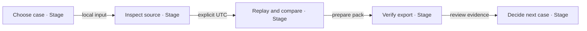
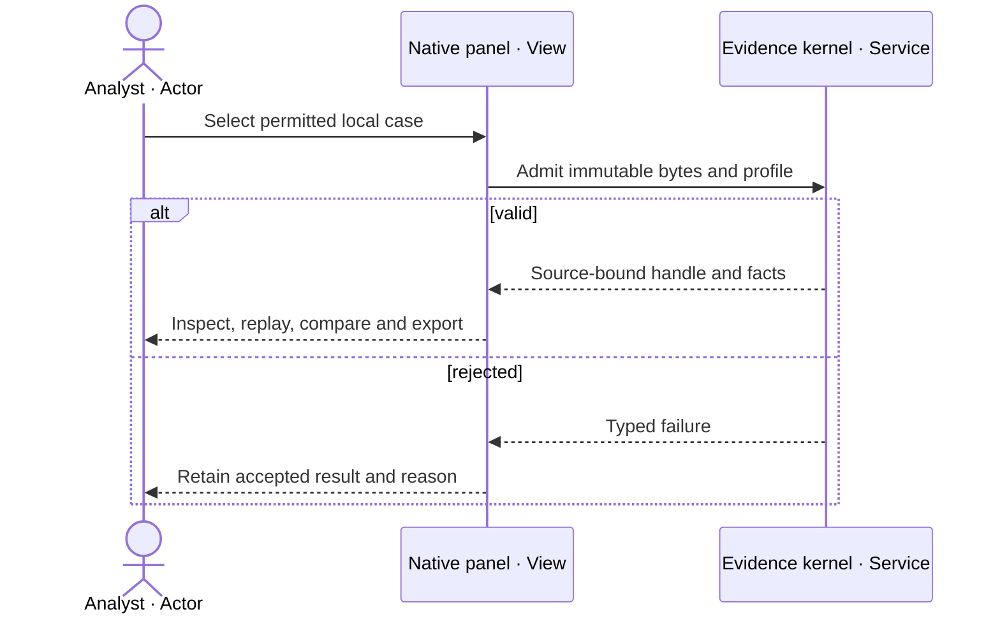
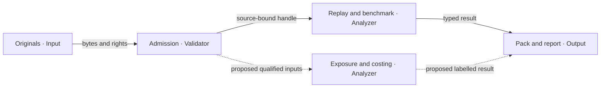
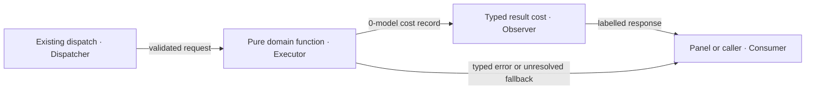
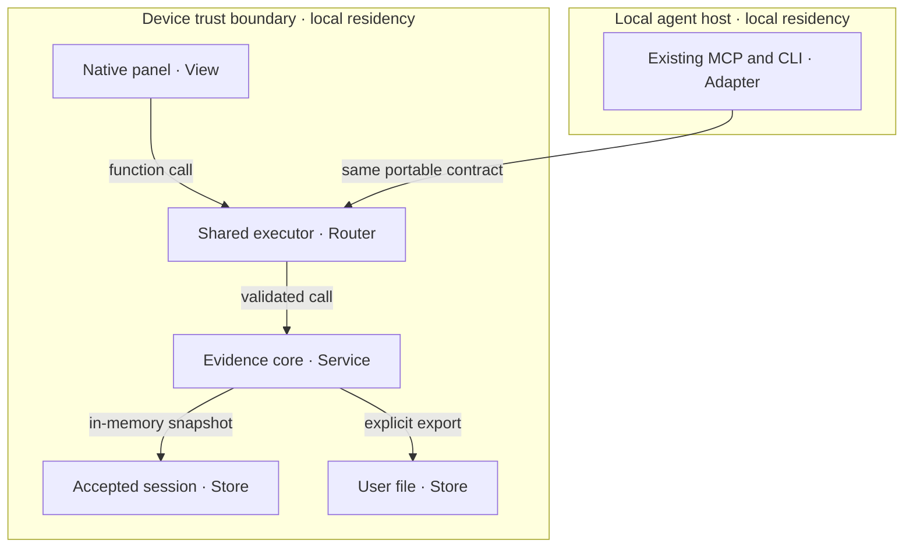
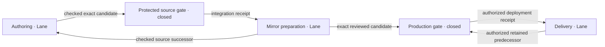

# Aviation Swarm

`aviation-swarm@0.4.16` hardens eligible aviation evidence Must workflows:
**inspect what is known, reproduce a comparison, and explain what is still unknown.**
Operational exposure and flight-cost calculation remain unimplemented.

**agentic-graph** owns code and documentation. This implementation
consumes [aviation-evidence-layer@0.4.2](aviation-evidence/prd-tad-adr-mvp-gtm.md); it does not replace that
owner, its eleven acceptance thresholds, rights records, financial model, or execution backlog.
Import race fences/stages, primary-first Geo/lazy SVG, bounded bundles and XR projections extend native
owners. Local imports survive seed refresh and stay visible. Async controls retain eligible focus.
Automatic JS precache follows static imports; installed packs resolve before background revalidation.
No package, provider, model or store is added.

## Scope and grounding — reference implementation

G1–G8 baseline: Graph `cc40000f`, [PR 1543](https://github.com/huijoohwee/agentic-graph/pull/1543).
`E/` = `canvas/src/features/evidence-analysis/`. Plan PR 1545 integrated at `24f06143`;
startup PRs 1552/1555 at `201835c8`/`e6c9f1ca`; latest adoption `0504394f`. ER rows bind proof.

| Grounding ID / capability | Inspected owner and contract | Reuse / smallest delta | Check / evidence limit |
|---|---|---|---|
| G1 originals and provenance | `E/core/evidence-kernel.mjs`: `admit`, `inspect`, `sourceEvidence`, `exportPack`, `createSession`; `evidence-order/v2` | Reuse immutable originals, source pointers, units, nulls, hashes and latest-intent fences | `evidence-core.test.mjs`; ER1, not source authenticity |
| G2 time and source context | `E/core/evidence-replay.mjs`; `geospatialProject.mjs`, `geospatialSource.ts`, `sourceTimelineBridge.ts` | Reuse explicit UTC, gap breaks, source identity and existing map/Timeline owner | Core replay in ER1; UI acceptance separately ER3 |
| G3 route comparison | `E/core/route-benchmark.mjs`: `benchmarkRoute`; `route-distance/v1`; `profiles/route-policy.json` | Retain fixed-sphere distance and conditional error band; proposed exposure must not relabel it fuel or feasibility | `route-benchmark.test.mjs`; ER1 |
| G4 structured restrictions | `E/core/notice-triage.mjs`: `triageNotice`; `core/volume-project.mjs`: `projectVolume` | Reuse explicit geometry/time/datum and unresolved fields; no free-text interpretation | `notice-triage.test.mjs`, `volume-project.test.mjs`; ER1; 100-label benchmark open |
| G5 arrival evaluator | `E/core/arrival-analysis.mjs`: `analyzeArrivals`; authored train/calibration/test policy | Retain deterministic evaluation; do not add a predictive agent | `arrival-analysis.test.mjs`; ER1; real touchdown benchmark open |
| G6 shared tools | `E/tools/evidenceCatalog.mjs`: `EVIDENCE_OPERATIONS`; `executeEvidence.mjs`: `executeEvidence`, `dispatchEvidence`, `invokeEvidenceCommand` | Extend this single catalog/executor only after a new criterion is admitted | `evidenceTools.test.mjs`; ER2 scope recorded below |
| G7 transports | `E/tools/evidenceCli.mjs`; `canvas/src/features/agent-ready/evidenceAnalysisAgentReadyContract.mjs`, `evidenceAnalysisWebMcpTools.ts`; `mcp/local-tool-contract.js`, `mcp/server.js` | Retain local CLI/MCP and browser adapters; remote aviation parity unproved | Local adapter checks; browser-discovered tools require actual invocation proof |
| G8 native experience | `E/EvidencePanel.tsx`, `ui/evidenceInput.ts`; [Flight source](workspace-seeds/agentic-graph-game-flight-sim-demo.md) | Add bounded cancellable asset reads; collapse optional context in `FloatingPanelXrSceneViews.tsx`; retain native owners | ER3/ER6–ER10; simulation remains distinct from observed evidence |

Exposure, costing, fuel and live disruption remain unbuilt. Load native sources on demand;
always-loaded prompt delta is zero. Recheck joins on drift.

## PRD

### Customer, pain and prioritization

User/beneficiary: analyst or reviewer reconstructing a permitted historical case. Buyer: unidentified
team lead authorized to pay. Job: “Show supporting facts, gaps and reproduction steps.” Manual source
reconciliation and spreadsheets are the hypothesized workaround, pending interviews.

Pain and willingness-to-pay rankings are **unvalidated**. Buyer evidence overrides the proposed order.

| Rank / pain | Hook → break → fix → close | Native reuse / delta | Priority and outcome |
|---|---|---|---|
| P1 repeated fact reconciliation | disputed comparison → lost provenance → inspect originals/unknowns → export reproducible case | G1/G2/G8; current feature, no new store | Must; first paid-review hypothesis |
| P2 unjustified route savings | “which is shorter?” → opaque assumptions → same-model distance comparison → show conditional uncertainty | G3/G6/G8; existing distance result | Must; never imply cheapest/fastest |
| P3 restriction exposure | “does this supplied volume intersect?” → mismatched time/datum → bounded deterministic join → explain intersection or unknown | Extend G3/G4 only after input/rights gates | Should; specification only |
| P4 incomparable costs | “what could this scenario cost?” → unsupported fuel/time inputs → explicit scenario lines → incomplete subtotal with omissions | Proposed pure costing owner under E/core, fed by G3; no prices inferred | Could; await buyer and model evidence |

P3/P4 remain deferred. Weather/ramp effects, general notice parsing, rules/GNSS/delay attribution,
emissions and safety mining are excluded. No booking, filing, aircraft actuation, dispatch, clearance,
certified advice or live surveillance is provided.

### Stories, acceptance and time to value

| ID / story | VCC: measurable end state / check / constraints | Join and disposition |
|---|---|---|
| AS1 Must: inspect and reproduce | Exact native demo opens Evidence and analysis; selected case exposes original source, UTC, gaps and deterministic replay; prepared export matches executor. Check actual UI plus G1/G6 suites; no provider call or synthetic-as-observed claim | G1/G2/G6/G8; AEL VCC-1/2/8/11; ER1–ER3/ER7–ER10, full acceptance open |
| AS2 Must: compare routes honestly | Same admitted routes/policy yield identical lengths, signed difference and conditional band; result explicitly excludes fuel, optimality and legal feasibility. Check `route-benchmark.test.mjs` plus live route exercise | G3/G8; AEL VCC-9 unchanged; ER1 core and ER6 live proof |
| AS3 Should: bounded exposure | For supplied route/volume/time inputs, independently labelled fixtures cover intersecting, disjoint, boundary-touch, stale, absent datum and absent-source cases; 100% report a reason, sources and qualified scope. Proposed test is not yet invocable | G3/G4 extension; no implementation/evidence |
| AS4 Could: scenario costing | Every line includes value or null, unit/currency, basis, source/model version and omissions. Reject currency/unit mixing, stale/negative/non-finite input; unknown never becomes zero. Proposed schema/arithmetic/parity suite | New bounded pure calculation only after ADR-S3 gate; unbuilt |
| AS5 Must: accessible local review | Desktop and 390 CSS px complete AS1/AS2 with visible labels and controls; record layout/keyboard errors. Offline reload/save and physical-device proof use the inherited device acceptance, not viewport emulation | G8; AEL VCC-5/6 open; ER6/ER7 separate code checks from live acceptance |

`spec-complete` means VCCs exist, not that this artifact passes every guideline or the product is ready.
Current hardening checks do not satisfy whole AS1/AS2/AS5. Local rung stays `spec-complete`;
delivered rung for this successor stays `undocumented` without integration/delivery evidence.

| Metric | Baseline / proposed target | Measurement and limit |
|---|---|---|
| AS1 TTV | Unknown / provisioned demo to inspected record ≤5 min | Time from demo selection through original-source drilldown; setup separate |
| AS2 TTV | Unknown / admitted route to comparison ≤2 min | Action count and timings; no fuel/financial answer implied |
| AS3 / AS4 TTV | Unknown / ≤5 s local computation each | Proposed benchmark, ≤10 routes ×10 volumes and ≤10 cost options; pre-baseline measurement required |
| Setup | Unknown / inherited ≤60 min | Locked `npm ci` recovered task dependencies; target setup timing remains unmeasured |
| Serving tokens / cash | Core counters 0 / 0 model and billed API calls | Whole host effects/network still require complete capture; operator time/hardware unknown |
| Quality/value | 0 unlabelled estimates; ≥10 min saved; weekly use for four weeks | Technical checks plus inherited EXP-4; no buyer observation yet |
| ROI | Unmeasured / economic benefit exceeds total cost | Retain unknown reach, labour and support inputs; a $1 collection alone is not viability |

## TAD — reference implementation

### Ownership, contracts and limits

Keep `aviation-evidence-layer@0.4.2` as capability authority. Build order: portable contracts → pure
domain owners → existing transports → views. Originals/session state stay in the native kernel; export
is explicit. No new database, sync daemon, MCP gateway, scheduler or provider fan-out.

G1 admits strict Unicode/JSON and explicit source references before analysis. G3's route metric uses
its cited fixed sphere: declared per-vertex bound `u` yields conditional `2(n−1)u` polyline error;
add route bands for their difference. This excludes geodetic/model error. G4 supports a single simple
polygon and continuous half-open UTC interval, with compatible vertical datums. Missing geometry,
uncertainty, stale evidence or unsupported datum yields an unresolved result, never operational clearance.

AS3 extends G3/G4 with one qualified pure join: `intersects`,
`no_intersection_with_supplied_evidence`, or `unknown`. Preserve native errors and reason codes.
Uncovered source/time/region or unsupported geometry/datum never implies a safe/legal route.
AS4 needs qualified user-supplied units/models/prices; label observed/derived/assumed/unknown basis.
Unknown is not zero. Incomplete comparable subtotals must say so; currency conversion needs a dated
stated rate. No operational optimization, quote, commitment or external write follows from arithmetic.

Native limits: original ≤499,999 B; profile ≤10 entities/5,000 facts/20 sources/24 hours; each notice
≤12,000 B; combined tool input ≤2,000,000 B; export pack ≤2,000,000 B. Pack/input envelopes are not
JavaScript chunks. New files <600 lines; oversized owners shrink; emitted JS/MJS <500,000 B.
ER4 binds emitted bytes; transfer proof remains open. Target ≤30 KiB lazy JS, zero initial growth/packages;
Prior Geo boundary cut 68,143 B. Direct pure GeoJSON import saves another 51,724 B initially; four checks pass.
Current hardening: `readEvidenceExamples` admits all paths before I/O, aborts superseded reads and
applies one 15-second deadline to the whole batch (test/config bound 1–30,000 ms). Late bodies cancel;
cleanup never waits on a broken stream. Panel source/view/remove/unmount changes cancel pending assets
and fence stale results; failed replacements retain acceptance. Local file reads remain byte-bounded
and result-fenced, not abortable. Optional panorama/city controls mount only when expanded; view changes
reset expansion; width fixes retain source owners. No analytical algorithm changes. `workspaceRefreshQueue.ts` settles callers after their queued pass, retaining fresh paired inventory and seed escalation. Later background passes cannot prolong an import wait.
`useWorkspaceFileActions/importActions.ts` reports await stages and fences post-await mutations;
`core.ts` fences graph/focus. Stale/failed native imports remain handled, preventing duplicate fallback;
dispatched lower-owner effects are not rolled back. Geo treats null map/no error as pending and lazily
loads `SvgGeospatialFallback.tsx` only for explicit SVG or confirmed failure, preserving geometry and
semantics. `RecoverableSvgFallback.tsx` contains failure and offers explicit reload: browsers can cache failed imports until navigation. No automatic retry/reload. XR selects stable surface fields; frame/HUD owners remain live.
AS3/AS4: separate ≤4-hour/4-module/30-KiB sprints after admission; ≤3 cycles, stop after two no-progress cycles.

### Invocation and shared-utility reuse

`EVIDENCE_OPERATIONS` is the only invocation register. Each row below consumes its current exact
operation and name; WebMCP names add `agentic-graph.`. All use `/operation @evidence #evidence`.

| Operation | Native MCP tool | Input beyond explicit profile | Output |
|---|---|---|---|
| `aviation.inspect` | `evidence_inspect` | bundle | `evidence-inspection/v1` |
| `aviation.replay` | `evidence_replay` | bundle, entityId, atUtc | `evidence-replay/v1` |
| `aviation.source` | `evidence_source` | bundle, factId | `evidence-source/v1` |
| `aviation.export` | `evidence_export` | bundle | `evidence-export/v1` |
| `volume.project` | `evidence_volume_project` | bundle, entityId, atUtc, viewId | `volume-projection/v1` |
| `arrival.evaluate` | `evidence_arrival_evaluate` | bundles, policyId | `arrival-analysis/v1` |
| `route.benchmark` | `evidence_route_benchmark` | bundle, entityId, policyId | `route-benchmark/v1` |
| `notice.triage` | `evidence_notice_triage` | notice, atUtc, policyId, viewId | `notice-triage/v1` |

Discovery: `node canvas/src/features/evidence-analysis/tools/evidenceCli.mjs --list`.
CLI consumes stdin JSON; browser uses source-authored finite profile/policy IDs and the same executor.
New tools enter the catalog/adapters together; unimplemented aliases stay hidden. Remote availability is separate. Unknown/extra/conflicting arguments fail; snapshot before
awaits and fence supersession. Check parity, rejection, cancellation, byte bounds and no effects.

### Five flows and diagram register

All diagrams are version 2, 2026-10-04, replacing the greenfield 0.1.0 drawings. Dashed edges mean
proposed work; solid edges mean reused structure, not a readiness badge. Inventory rows are text
equivalents. Primary: `flowchart`; AS-D2 secondary: `sequence`. Actual Graph parser counts
(nodes/relations/clusters): D1 5/4/0, D2 3/6/0, D3 5/5/0, D4 4/4/0, D5 6/5/2, D6 5/6/0
(`diagram-native-projection-38f2aa043.json`, zero model calls). Static/narrow render: ER11.
Regex counts undercount inline edges; native counts govern.

**AS-D1 · Journey stage map · flowchart LR.** Analyst reaches a reproducible result before a decision.

| Nodes | Owner / inventory |
|---|---|
| J1, J2, J3, J4, J5 | Analyst journey: G8 import, G1 originals, G2/G3 analysis, G1 export, Product decision |

**AS-D2 · User workflow · sequenceDiagram.** Failed admission preserves the accepted case.

| Nodes | Owner / inventory |
|---|---|
| A, U, K | Analyst, G8 panel, G1 kernel; happy and rejected paths both stay on device |

**AS-D3 · Data flow · flowchart LR.** Derived outputs retain the input identity at journey J2–J4.

| Nodes | Owner / inventory |
|---|---|
| O, K, R, P, X | Permitted input, G1, G2/G3/G4, G1/G8, proposed AS3/AS4 |

**AS-D4 · Orchestration / harness flow · flowchart LR.** One deterministic execution serves J3 without model inference.

| Nodes | Owner / inventory |
|---|---|
| D, E, O, C | G6, G1–G5, existing output cost fields, G8/transport caller; max 1 pass, 0 prompt/completion tokens |

**AS-D5 · Runtime topology · flowchart TB.** Local analysis needs no new remote service.

| Nodes | Owner / inventory / privacy |
|---|---|
| U, T, K, S, F, M | G8, G6, G1–G5, G1 in-memory state, user-controlled export, G7; no auto-upload or persistent new database |

### Ecosystem, design and recovery

| Participant | Job / value exchanged | Contract and trust boundary | Gap / owner |
|---|---|---|---|
| User / buyer | Reproducible review / possible paid accepted case | Local files and explicit export; payment outside this read-only feature | Buyer, data permission and accepted outcome unproved / Product |
| Operator | Onboarding, source qualification and recovery | Existing rights/recovery record; one pilot, agreed hours | Support minutes and commercial terms unknown / Operator |
| Developer / agent | Discover → local rehearsal → typed call → error/effect reconciliation → support | G6/G7 catalog; no read grants authorize mutations | Remote parity and browser discovery measured separately / Engineering |
| Provider | Data in return for compliant use/attribution | Existing source record, original bytes and expiry/rights checks | Source-specific eligibility; no free-tier assumption / Operator |
| Assurance | Check criteria and source identity independently | Existing tests and external evaluator boundary | Full acceptance/real labels unresolved / Evaluator |

Reuse native Settings, typography, icons, controls and renderer tokens. Evidence owns source/gap labels;
Flight owns simulation state. SourceFile owns profiles/scenes; source switch invalidates stale state.
Verify focus, readable text, 44 px controls, reduced motion, 200% zoom and non-colour status separately.

Treat fetched text as data, never instructions. Reject malformed, oversized, ambiguous, non-finite,
unit/datum-mismatched or stale-revision input. Retain originals/prior acceptance on failure; reimport
with the supported profile/algorithm. Hashes do not prove truth/rights. No silent migration/enrichment;
expiry disables dependent analysis. Exclude passenger/crew data and credentials from evidence/logs.

## Source policy — reference implementation

Reuse the [rights/recovery owner](aviation-evidence/rights-recovery.md), including attribution,
retention/purge, incident response, export limits and source-specific grants. Public availability does
not mean unrestricted reuse; FOSS code and data rights are separate. No new live feed is selected.

| Source / proposed input | Observed evidence, 2026-10-04 | Decision |
|---|---|---|
| Retained ADSB.lol cases | [Primary API page](https://www.adsb.lol/docs/open-data/api/) identifies ODbL 1.0; native originals/receipt and full terms retained | Reuse qualified historical fixtures with attribution; no live coverage, touchdown or clearance inference |
| OurAirports context | [Primary terms](https://ourairports.com/data/) release data to Public Domain without accuracy/fitness guarantee | Reuse pinned native airport/runway context; no surveyed/current-operational claim |
| OpenSky candidate from 0.1.0 | [Primary terms](https://opensky-network.org/about/terms-of-use) require written licence for any commercial/for-profit use and operational API use | Exclude from the selected pilot absent exact permission; “research demo” is not a blanket exemption |
| Synthetic route/notice/volume/arrival exercises | Existing authored fixtures and policy identities | Use for software checks with visible synthetic labels only |
| Own receiver, weather, advisories, news, performance, fuel statistics, operating-cost reports, FIR/standards data | No source-specific purpose/rights/coverage/cost admission completed here | Deferred; own receiver is not operational certification; no remembered licence or standard asserted |

New sources require exact version/bytes, rights holder, purpose/derivation/redistribution/offline grant,
attribution, validity, geography/time/datum, quota/no-overage mechanism, reviewer and recheck trigger.
Unknown rights/costs block dependent work. Hosted-free is not FOSS; optional edge/device adapters need
their own cost/resource/delivery receipts. Local analysis remains the zero-new-spend path.

## ADR

### ADR-S1 Extend the native analytical owners

Constraints: K1 zero new spend; K2 native reuse; K3 deterministic local/offline analysis; K4 no
operational claim; K5 bounded work/rights. Existing tools pass; AS3/AS4 stay gated. New orchestration
fails K2/K5, mandatory cloud inference fails K1/K3, ungranted licensed feeds fail K1/rights. Manual
review remains the baseline. Native reuse improves reproducibility/reuse cost; buyer/WTP value is unknown.
Decision: extend native owners, no second runtime. Import stages expose pending work; job fences stop
stale continuation. Geo defers SVG until selection/failure; XR narrows subscriptions without freezing
simulation. Root basename collisions retain bytes; provenance controls visibility, not deletion.
Automatic precache uses build graph membership, preserving required vendor chunks; deferred modules
remain runtime-cached or explicitly installed. Installed pack responses bypass background revalidation. Revisit on failure/buyer evidence.

### ADR-S2 Distance, evidence and operational feasibility stay distinct

Retain G3's model and explicit limitations. AS3 would evaluate only supplied qualified evidence.
Do not translate a missing intersection into a legal/safe-route verdict. Alternative blanket exposure
labels fail K4. Reversible by disabling the new operation and retaining originals; revisit only with
qualified routes, notices, time/datum and independent labelled cases. Existing AEL thresholds remain.

### ADR-S3 Costing follows a qualified buyer scenario

No cost tool is added in this revision. Reuse G3 distances if a buyer supplies a permitted scenario and
qualified units/models/prices; add one pure calculation owner and reuse G6/G8, not a billing ledger.
Invented average fuel burn or regional prices fail K4/evidence. Manual externally reviewed worksheet
and pure local calculation remain incomparable on value until the first priced case. Recovery retains
distance-only output; neither a quote nor a commitment follows from a scenario.

## MVP and live verification — reference implementation

The requested demo is [docs/workspace-seeds/agentic-graph-game-flight-sim-demo.md](workspace-seeds/agentic-graph-game-flight-sim-demo.md).
Its Practice Flight is synthetic; source-authored airport and historical tracks are separate context.
Plan ≤40 KiB; new files <600 lines; no spend/packages. Next: ≤20 active minutes, ≤9 files/8 KiB; one corrected build. Fix disconnect races and final-report/source-map defects; reuse baseline, then final checks.
Private artifacts below: `$GITHUB_ROOT/.workspace/.artifacts/aviation-swarm-readiness/`.

| Evidence | Check / recorded result | Scope and limit |
|---|---|---|
| ER1 | cd0987f standard stages pass in 268.66 s (`first-offline-cd0987f.log`) | Clean canonical-origin docs input uses contract pin 1d3e803 (`pinned-docs-input-1d3e803.json`); full-app/suite parity unproved |
| ER2 | 1f3802 import completes at 6.443 s; review stays disabled: “Active document source changed during materialization (workspace import publication).” `first-offline-1f3802/failure-diagnostics.json` | 1,113 requests settled; no network failure. Earlier provider refresh failures retained; concurrent parser writer not captured |
| ER3 | b639 Save: 3 entities/185 facts/3 sources; 262,899 B; `evidence-pack-b639ba42.json` | Exact saved bytes match cf1/38f2; 38f2 offline reimport retained |
| ER4 | d51d894 build/typecheck pass: entry/precache 37 JS/3,381,668 B (−51,724); 1,778 pack members verified; largest JS 495,688 B. `static-precache-inventory-d51d894.json` | Host inventory, not feature attribution: exclusive aviation chunks 132,847 B; shared adapters and initial delta unproved |
| ER5 | 1f3802 commits actual Flight acceptance at 1024/390: disconnect before first installed navigation, evidence/route/export/focus and worker request checks | 432cc531 first offline navigation opens recorded evidence; zero page errors. Fix combobox selector and offline map style requests; remaining assertions pending |
| ER6 | 38f2 390×844 offline + reduced-motion: import, UTC step, repeat route query, keyboard focus and zero horizontal overflow pass; 18 focus UI tests pass | `aviation-mobile-route-38f2aa043.json`; cf1 200% CSS zoom passes (not native browser zoom). Physical iPhone SKIP/KIV; startup blocked |
| ER7 | d51d894: six emitted-worker cases pass; four unchanged owner tests retained. Installed static/deferred requests make zero fetches; ordinary behavior retained | `emitted-worker-cache-proof-d51d894.json` binds worker hash/full installation. Valid metadata; missing/corrupt member coverage. Model proof, not UI acceptance |
| ER8 | Root-retention regression plus nine related checks and typecheck pass. Live 5196 import→Editor→Refresh retains selected root source; example loads 3 entities/185 facts/3 sources (`live-root-retention.png`) | Generic basename deletion removed; explicit local projection retained. Real IndexedDB covers missing/corrupt provenance and reopen. 432cc531 live reopen/example passes; primary Singapore map renders (`live-parser-432cc531.png`). Dev-only proof |
| ER9 | Six Geo checks pass. Built 160831d: zero SVG requests/mounts during activation; blocked SVG stays local and reload recovers (`geo-primary-built-160831d.json`, `geo-recovery-built-160831d.json`) | Unchanged-source browser proof; selection restored to MapLibre |
| ER10 | XR tests 2/2: five unrelated writes and five Flight advances each change commits 5→0; motion retained. Build 6 keeps the same connected WebGL canvas through History open/close, zero removals | Unchanged-source proof; counts are test measurements, retention is actual UI evidence |
| ER11 | 392fa static Mermaid: 6/6 render at 390 px, 16 px labels, all scroll endpoints reachable, page width 390 | `diagram-render-392fa379c/`: exact source hashes, screenshots, zero model/API calls; static artifact, not full canvas UI acceptance |

Repeated offline AS2: 77,757.706 m versus 71,188.231 m, difference 6,569.475 m, conditional band
[6,541.475,6,597.475] m with limitations. AS1 inspected `/facts/0`, UTC 02:25:30.000Z→02:25:30.574Z.
Actual browser WebMCP inspect and invalid-input results match local executor bytes (`webmcp-parity.json`);
not all-operation/remote parity. Automatic mirrors skip production/offline hosts; only acknowledged
writes cache digests. Local bytes and explicit Reveal retain existing owners; reconnect can retry.

### Demonstration and experience assessment

| Beat | Seconds | Observable action / VCC |
|---|---:|---|
| Hook |20| Explain one permitted historical case and synthetic controls |
| Probe |35| Open exact source demo and Evidence and analysis; inspect classification |
| Reveal |60| Original source, UTC and gap drilldown; AS1 |
| Compare and reproduce |90| Route comparison limits, replay/query and verifiable export; AS1/AS2 |
| Close |35| Missing evidence, qualified scope and next priced-review decision |
| Total |240| Target ≤300 seconds; not an observed TTV result |

Maturity remains unassessed. Complete AS1/AS2/AS5 and qualified benchmarks before acceptance;
remote/exposure/cost surfaces remain unproved.

## GTM, economics and learning

Consume the existing [discovery/pilot](aviation-evidence/discovery-pilot.md),
[financial model](aviation-evidence/financial-model.md) and [venture projections](aviation-evidence/venture-projections.md)
at `aviation-evidence-layer@0.4.2`. No new parallel business ledger or outreach occurs.

1. Nearest first dollar: a manually assisted, reproducible evidence review using existing AS1/AS2.
2. Next: a qualified route/notice comparison only after AS3 and source-rights acceptance.
3. Later: scenario-cost analysis after AS4 input/model and buyer gates; hosted recurring service deferred.

**$1 is a proposed collection experiment, not a sustainable price.** Qualify buyer, currency, offer,
acceptance and refund terms before quoting. Settlement, accepted delivery and repeat use need separate
receipts. No offer/invoice/message sent; aviation mechanism, demand, revenue and cash remain unproved.

| Assumption | Source / disposition / date | Decision rule |
|---|---|---|
| A-S1 at least $1 equivalent collected | User's first-dollar objective / proposal / 2026-10-04 | Verify actual settlement and accepted scope; do not extrapolate recurring value |
| A-S2 serving models and billed APIs =0 | G1–G5 inspected counters / bounded core evidence / 2026-10-04 | Whole-host/network proof still open; block new charge-capable adapters |
| A-S3 buyer frequency, price, support minutes and labour value | No observed buyer / unknown / 2026-10-04 | Use EXP-1/3/4 and retain negative results |
| A-S4 cash balances, tax, fees, collection lag and runway | Existing financial-model input register / unknown / 2026-10-04 | No numeric profit/runway claim |

No new subscription or paid resource; hardware, energy, labour, support and assistant cost are unknown.
Self-hosting/managed edge await cost/quota/FOSS proof. Economic contribution deducts all direct and
labour costs; cash contribution uses actual settlements/outflows. Serving tokens enter COGS and
implementation tokens ADLC. A $1 pilot may have negative contribution.

Market: analyst teams with permitted historical evidence; initial geography follows existing examples,
not demonstrated demand. Two independent sizing methods remain unrun: counted eligible buyers ×
validated annual spend, and budget-based segment sizing from a cited primary dataset. No TAM/SAM/SOM
number or “why now” statistic is invented. Existing Base/Downside/Upside and linked-statement formulas
are reusable, but populated scenarios and reconciled balance/cash statements remain incomplete.

One operator/pilot and agreed hours; no safety-response SLA. Buyer-specific entity/IP/data/contract,
tax/privacy review remains open. Zero-new-spend bootstrap; funding/hiring/debt depend on paid demand.
Audience projections must preserve qualified source joins, hypotheses and the actual demo.

| Roadmap | Reuse / exit | Active bound or external wait | Stop / next owner action |
|---|---|---|---|
| R0 current Must readiness | G1–G8; finish import/Geo/XR/bundle proof | Exact admitted paths; plan ≤40 KiB; next ≤20 active minutes, refresh on drift | Engineering binds final checks/UI then native release; protected review waits for receipt |
| R1 priced review discovery | Existing EXP-1 then EXP-3; ≥3/10 pain accounts, ≥1/2 genuine paid acceptances | External wait: authorized access/response; recheck on response, no completion ETA | Two declined offers → revise/stop; Product owns consent/outreach authority |
| R2 bounded exposure | G3/G4/G6/G8; AS3 and qualified rights/labels | ≤4 active hours, ≤4 modules/30 KiB, 3 cycles after admission | Unknown datum/coverage remains unknown; disable extension on regression |
| R3 scenario costing | G3/G6/G8; AS4 and buyer/model inputs | Separate ≤4-hour sprint, same caps; no inferred grant | Stop without qualified units/currency/model; preserve distance comparison |
| R4 recurring value | Existing EXP-4: ≥10 min saved and weekly accepted use for4 weeks | External wait: consented use/observations | No threshold → revise/stop; no hosted expansion from demo alone |

## ADLC and release — reference implementation

PRs 1547/1550 are immutable; PR 1551 fixes the latter’s path failure. PRs 1553/1554 retain failed provider checks. b639 local checks pass, but aviation first-open fails. Intent: `/fix #aviation-import-readiness @codex`.
Startup PR 1555 adopted. Parser PR 1559 merged green at `45a27725`; native disjoint adoption `432cc531` preserves 54 aviation paths. Contract v89 enrolls PWA, map, chunk and fixture checks.
Changed candidates need bound proof; source integration and production remain separate.

**AS-D6 · Lane & deploy boundary · flowchart LR · version 2.** Source and delivery each require their own receipt.

| Nodes / boundary | Authority and recovery |
|---|---|
| A, B | Admitted runtime/doc delta; affected checks then native `release:common publish`; exact protected receipt required |
| M, C, D | Existing release controller and protected production environment; no mirror/deploy grant in this task; retained baseline plus authorized rollback/readback |

Source/data and commercial decisions gate dependent work; checks continue. Publication, integration,
sync, deployment, rollback and cleanup require separate authority and exact receipts.

| PRD-TAD-ADR-MVP-GTM | CID at aviation-swarm@0.4.16 | RAO: scoped action → observed outcome | Updated |
|---|---|---|---|
| PRD | C: Must acceptance gaps; I: bounded readiness; D: retain AS1–AS5 gates | Product → prioritize eligible Must hardening → AS3/AS4 remain conditional | 2026-10-04 |
| TAD | C: import/early SVG/excess renders; I: reuse; D: fence/defer/project | Engineering → stages/fences, lazy SVG, XR projections → no package/analytical algorithm added | 2026-10-04 |
| ADR | C: cost/exposure absent; I: preserve bounds; D: reject duplicate runtime | Architecture → disposition alternatives → ADR-S1–S3, unresolved value explicit | 2026-10-04 |
| MVP | C: readiness gaps; I: reproducible demo; D: verify candidate | Engineering → tests/build/offline/Geo → ER1–ER10; final/device gates open | 2026-10-04 |
| GTM | C: no payer evidence; I: nearest first dollar; D: consume existing experiments | Product → rank review before new services → unsent proposal, no revenue claim | 2026-10-04 |

## Coverage and findings

Anchors join `aviation-swarm@0.4.16`; coverage is not readiness.

| Domain | Decision / source section | Owner | Evidence or gap / next check |
|---|---|---|---|
| C01 purpose/customer/pain | covered / PRD | Product | Hypotheses; EXP-1 |
| C02 market/timing | deferred / GTM | Product | No sizing; buyer evidence then two-source sizing |
| C03 offer/alternatives | covered / ADR/GTM | Product | Unsent review offer; EXP-3 |
| C04 product/experience | covered / PRD/MVP | Product | AS1–AS5; exact demo and device checks |
| C05 architecture/data | covered / TAD | Engineering | G1–G8; input/export identity checks |
| C06 quality/security/AI | covered / TAD | Engineering | ER1/ER2/ER7–ER10; final effects/accessibility proof open |
| C07 decisions | covered / ADR | Architecture | Constraints and unresolved economics; revisit with buyer |
| C08 smallest slice | covered / MVP | Engineering | Must hardening checked; whole AS1/AS2/AS5 not yet accepted |
| C09 acquisition/retention | covered / GTM | Product | Existing EXP-1/3/4 unrun |
| C10 operations | covered / TAD/GTM | Operator | One pilot/support scope; timed recovery unmeasured |
| C11 organization/obligations | covered / Source policy/GTM | Operator | Commercial/data review depends on selected buyer/source |
| C12 viability | deferred / GTM | Product | Unknown drivers; populate/reconcile existing model after priced case |
| C13 capital | covered / GTM | Product | Bootstrap/no ask; revisit on paid demand |
| C14 execution | covered / ADLC | Engineering | PR 1552 integrated; shared b639 local gate green, actual first-open fails; source review pending |
| C15 audience projections | deferred / GTM | Product | No audience handoff; generate only from qualified joined claims |
| C16 learning | covered / GTM | Product | Explicit continue/revise/stop thresholds; EXP results pending |

Dispositioned 16/16; covered applicable 13/16; deferred 3; not-applicable 0. This is domain coverage,
not full guideline alignment. Complete artifact-bearing-rule coverage and advisory count are unmeasured;
native projection counts and static render pass; full diagram conformance is unmeasured.

| Finding Type | Severity | Rule anchor | Artifact reference | Evidence excerpt | Remediation |
|---|---|---|---|---|---|
| `pain-point-not-validated` | major | `pain-point-to-feature-mapping#3` — label pain unvalidated absent evidence | PRD P1/P2 | “All pain and willingness-to-pay rankings are unvalidated” | Specification change: bind qualified EXP-1 outcome before commercial baseline |
| `market-size-single-method` | major | `venture-record-pitch-deck-business-plan--financial-model#6` — two independent sizing methods | GTM | “Two independent sizing methods remain unrun” | Documentation change: add sourced methods and reconciliation |
| `scenario-set-incomplete` | major | `venture-record-pitch-deck-business-plan--financial-model#5` — linked statements/scenarios | GTM | “populated scenarios and reconciled balance/cash statements remain incomplete” | Documentation change: populate existing model with dated inputs |
| `unimplemented-guideline` | major | `autonomous-implementation-verification#3` — distinct evaluator | MVP / coverage | “Complete artifact-bearing-rule coverage and advisory count are unmeasured” | Locally reproducible check: independent full guideline evaluation before baseline |

Unchecked findings have no zero-count claim. Coverage does not establish runtime readiness.

## Handover

ER1–ER11 bind proof; AS1/AS2/AS5 and delivery need separate acceptance.

Parser adopted; cd0987f standard passes. Build report failed on Vite-pruned CSS chunk; browser unrun.
AEL ADR-004 separates native host and feature bytes. This plan's former whole-host 150 kB reading
was an authoring error: measure feature served ≤150 kB and added initial ≤75 kB separately.
Baseline 8e77: 6,981,425 B; 432cc531: 3,384,435 B; net −3,596,990 B passes added initial ≤75 kB.
`baseline-8e77-b7680c3/` binds build/input/disposal; rebind final target inventory.
Feature attribution pending; fix final membership and disabled diagnostic minifier maps.
Offline map tests 30 pass, including disconnect/retry. Final CI/UI pending; iPhone SKIP/KIV.
Real-label/guideline acceptance stays separate; recheck on drift.
Source/integration/production need separate receipts; AS3/AS4 retain input/rights/buyer gates.
Preserve original/concurrent work; no spend/packages or revenue claim.
